# Research: Provider Support Deep Comparison - Bifrost vs LiteLLM

**Date:** 2026-05-11  
**Status:** Companion Research  
**Parent:** [Bifrost vs LiteLLM Comparison](./bifrost-litellm-comparison.md)

---

## Table of Contents

1. [Provider Overview](#1-provider-overview)
2. [OpenAI-Compatible Providers](#2-openai-compatible-providers)
3. [Cloud Providers](#3-cloud-providers)
4. [Specialized Providers](#4-specialized-providers)
5. [API Key Management](#5-api-key-management)
6. [Model Support](#6-model-support)
7. [Feature Parity](#7-feature-parity)

---

## 1. Provider Overview

### 1.1 Bifrost Provider Ecosystem

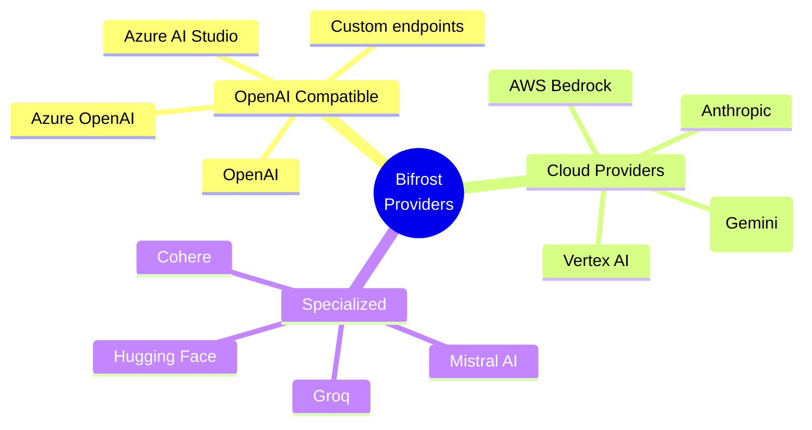

### 1.2 LiteLLM Provider Ecosystem

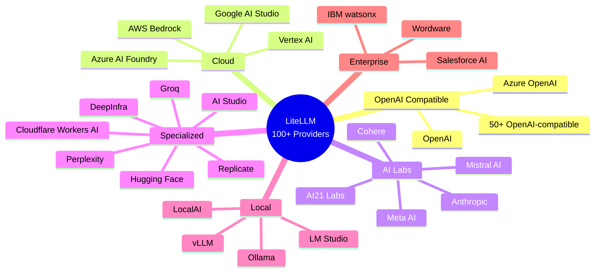

### 1.3 Provider Count Comparison

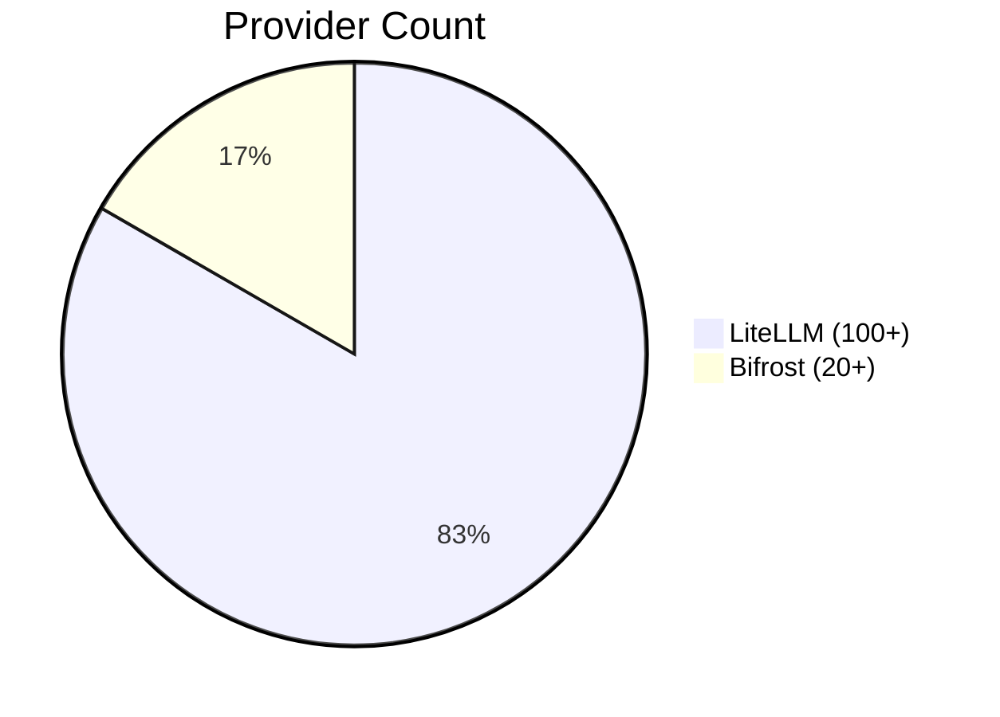

| Category | Bifrost | LiteLLM |
|----------|---------|---------|
| **Total Providers** | 20+ | 100+ |
| **OpenAI-compatible** | ✅ | ✅ 50+ |
| **Cloud Providers** | ✅ 4 | ✅ 10+ |
| **Specialized AI** | ✅ 5+ | ✅ 30+ |
| **Local/On-prem** | ❌ | ✅ 5+ |

---

## 2. OpenAI-Compatible Providers

### 2.1 Bifrost OpenAI-Compatible

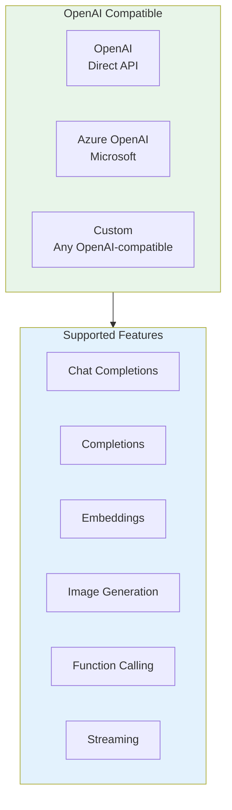

### 2.2 LiteLLM OpenAI-Compatible

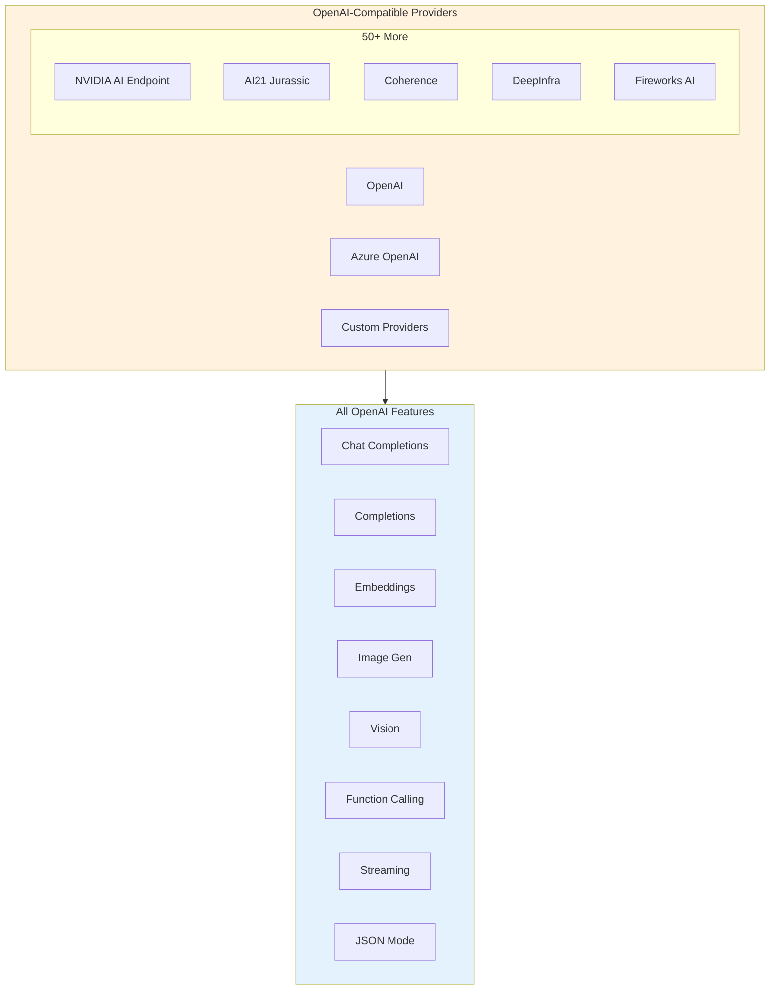

### 2.3 OpenAI-Compatible Comparison

| Provider | Bifrost | LiteLLM |
|----------|---------|---------|
| **OpenAI** | ✅ | ✅ |
| **Azure OpenAI** | ✅ | ✅ |
| **Custom Endpoint** | ✅ | ✅ |
| **NVIDIA AI** | ❌ | ✅ |
| **DeepInfra** | ❌ | ✅ |
| **Fireworks AI** | ❌ | ✅ |
| **AI21** | ❌ | ✅ |
| **Cohere** | ❌ | ✅ |

---

## 3. Cloud Providers

### 3.1 Bifrost Cloud Providers

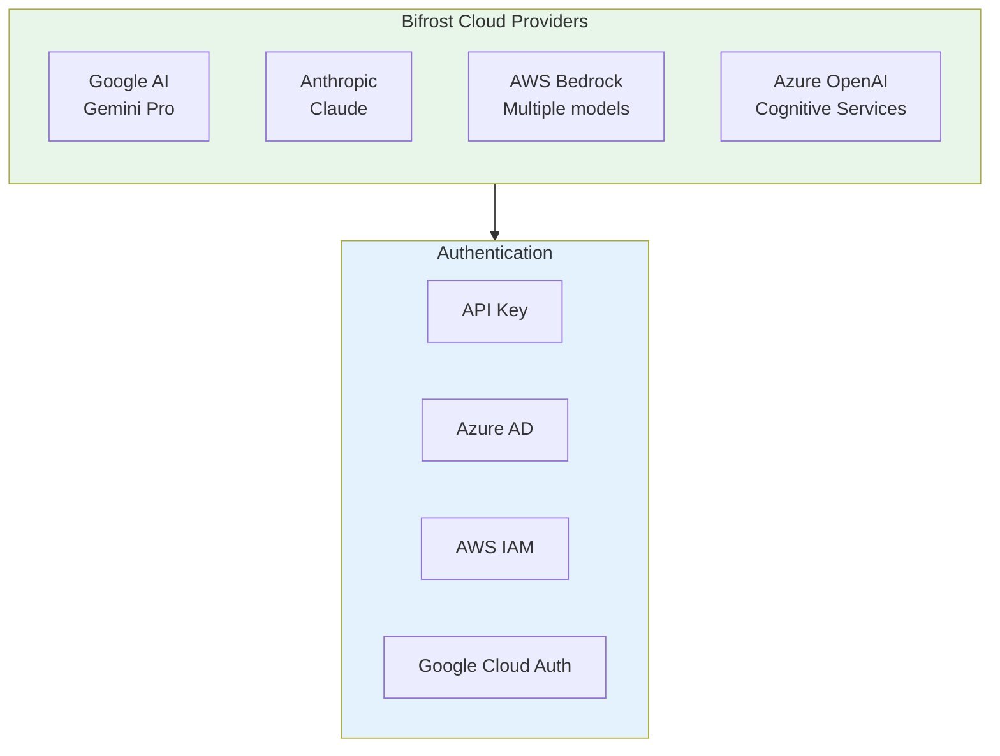

### 3.2 LiteLLM Cloud Providers

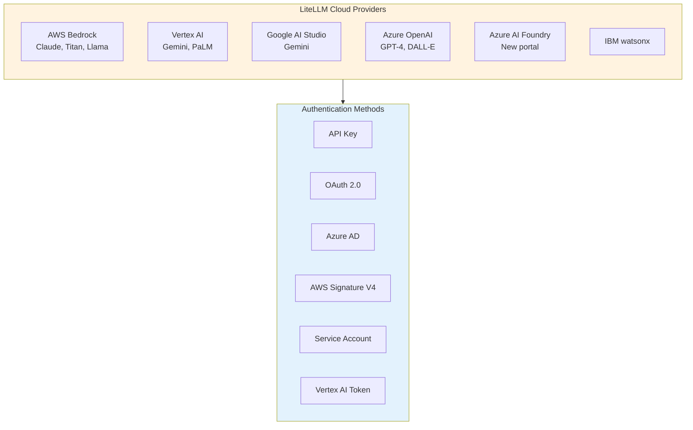

### 3.3 Cloud Provider Comparison

| Cloud Provider | Bifrost | LiteLLM |
|-----------------|---------|---------|
| **AWS Bedrock** | ✅ | ✅ |
| **Azure OpenAI** | ✅ | ✅ |
| **Azure AI Foundry** | ❌ | ✅ |
| **Google AI Studio** | ✅ | ✅ |
| **Vertex AI** | ❌ | ✅ |
| **IBM watsonx** | ❌ | ✅ |

---

## 4. Specialized Providers

### 4.1 Bifrost Specialized Providers

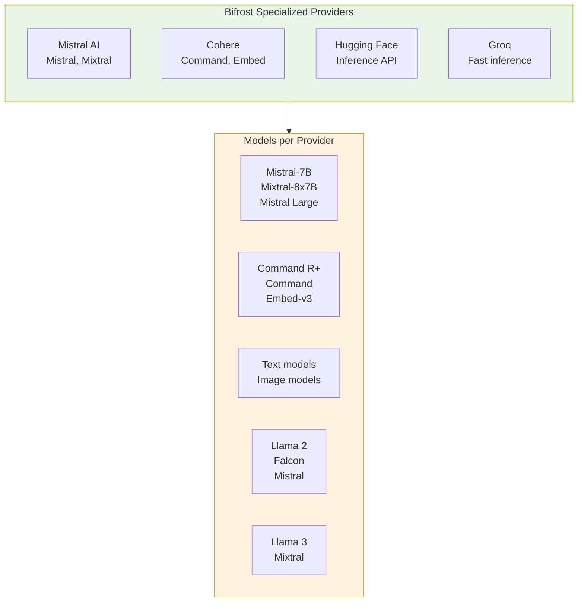

### 4.2 LiteLLM Specialized Providers

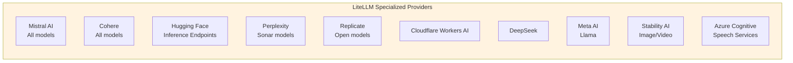

### 4.3 Specialized Provider Comparison

| Provider | Bifrost | LiteLLM |
|----------|---------|---------|
| **Mistral AI** | ✅ | ✅ |
| **Cohere** | ✅ | ✅ |
| **Hugging Face** | ✅ | ✅ |
| **Groq** | ✅ | ✅ |
| **Perplexity** | ❌ | ✅ |
| **Replicate** | ❌ | ✅ |
| **DeepSeek** | ❌ | ✅ |
| **Meta AI** | ❌ | ✅ |
| **Cloudflare Workers AI** | ❌ | ✅ |
| **Stability AI** | ❌ | ✅ |

---

## 5. API Key Management

### 5.1 Bifrost Key Management

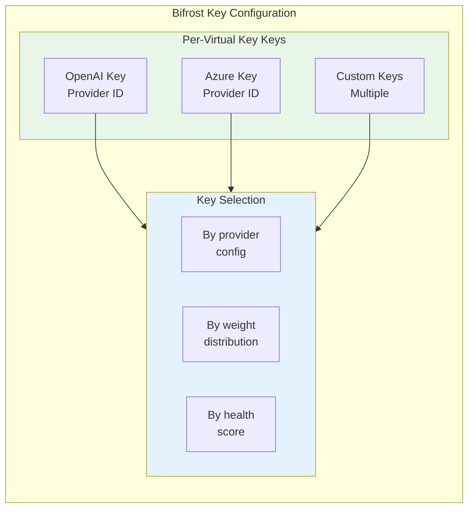

```yaml
# Bifrost provider key configuration
provider:
  name: "openai"
  api_keys:
    - id: "key-prod-1"
      key: "sk-..."  # Encrypted storage
      is_active: true
    - id: "key-prod-2"
      key: "sk-..."
      is_active: true

virtual_key:
  name: "my-vk"
  provider_configs:
    - provider: "openai"
      key_ids: ["key-prod-1", "key-prod-2"]  # Whitelist
      # Empty = allow all, ["*"] = allow all
      weight: 1.0
```

### 5.2 LiteLLM Key Management

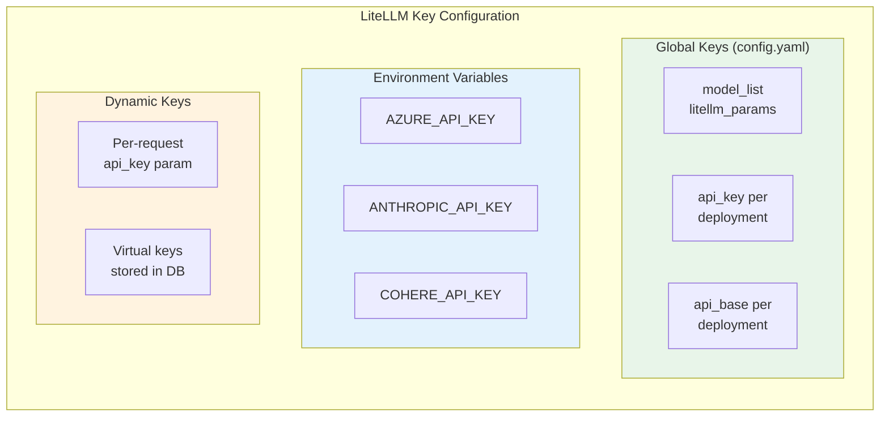

```yaml
# LiteLLM configuration
model_list:
  - model_name: "gpt-4"
    litellm_params:
      model: "openai/gpt-4"
      api_key: "sk-..."  # Per-deployment key
      
  - model_name: "claude-3"
    litellm_params:
      model: "anthropic/claude-3-sonnet-20240229"
      api_key: "sk-ant-..."  # Anthropic key

# Environment variable approach
environment:
  AZURE_API_KEY: "..."
  ANTHROPIC_API_KEY: "..."
```

### 5.3 Key Management Comparison

| Aspect | Bifrost | LiteLLM |
|--------|---------|---------|
| **Multiple Keys** | ✅ Per-VK | ✅ Per-deployment |
| **Key Selection** | Weight-based | Config-based |
| **Key Rotation** | Via VK update | Via config reload |
| **Key Whitelist** | ✅ `key_ids` | ❌ |
| **Encrypted Storage** | ✅ | ✅ |
| **Environment Vars** | Via config | ✅ |
| **Dynamic Keys** | Via VK | Per-request param |

---

## 6. Model Support

### 6.1 Bifrost Model Support

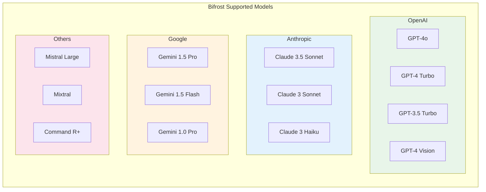

### 6.2 LiteLLM Model Support

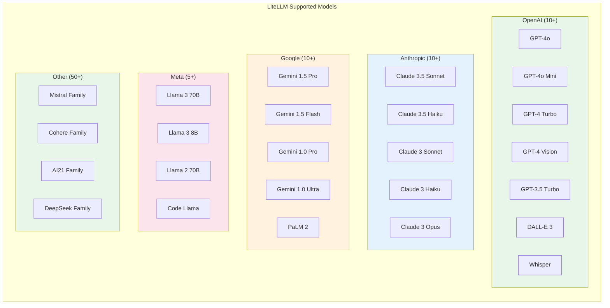

### 6.3 Model Support Comparison

| Model Family | Bifrost | LiteLLM |
|--------------|---------|---------|
| **GPT-4** | ✅ | ✅ |
| **Claude 3** | ✅ | ✅ |
| **Gemini 1.5** | ✅ | ✅ |
| **Llama 3** | ❌ | ✅ |
| **Mistral Large** | ✅ | ✅ |
| **Command R+** | ✅ | ✅ |
| **DeepSeek** | ❌ | ✅ |
| **DALL-E** | ❌ | ✅ |
| **Whisper** | ❌ | ✅ |
| **Embedding Models** | ✅ | ✅ |

---

## 7. Feature Parity

### 7.1 Bifrost Feature Parity by Provider

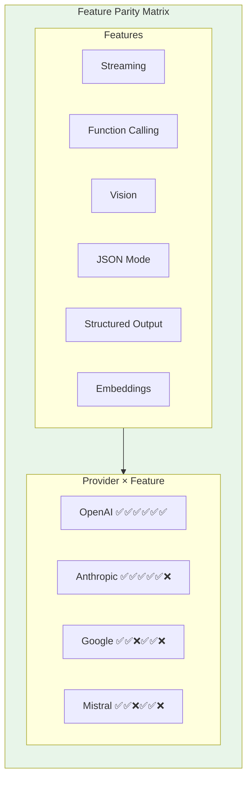

### 7.2 LiteLLM Feature Parity by Provider

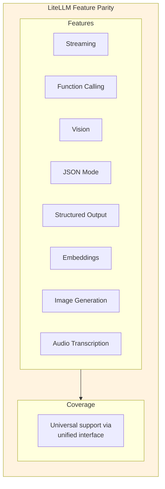

### 7.3 Feature Parity Comparison

| Feature | Bifrost | LiteLLM |
|---------|---------|---------|
| **Streaming** | ✅ All providers | ✅ All providers |
| **Function Calling** | ✅ OpenAI, Anthropic | ✅ Most providers |
| **Vision/Images** | ✅ OpenAI, Anthropic | ✅ OpenAI, Anthropic, Google |
| **JSON Mode** | ✅ OpenAI, Google | ✅ OpenAI, Anthropic, Google |
| **Structured Output** | ✅ | ✅ |
| **Embeddings** | ✅ Cohere, OpenAI | ✅ Many providers |
| **Image Generation** | ❌ | ✅ DALL-E, Stability |
| **Audio Transcription** | ❌ | ✅ Whisper |

---

## 8. Key Feature Matrix

| Feature | Bifrost | LiteLLM |
|---------|---------|---------|
| **Total Providers** | 20+ | 100+ |
| **OpenAI-Compatible** | ✅ 3+ | ✅ 50+ |
| **AWS Bedrock** | ✅ | ✅ |
| **Azure OpenAI** | ✅ | ✅ |
| **Vertex AI** | ❌ | ✅ |
| **Google AI Studio** | ✅ | ✅ |
| **Anthropic** | ✅ | ✅ |
| **Mistral AI** | ✅ | ✅ |
| **Cohere** | ✅ | ✅ |
| **Perplexity** | ❌ | ✅ |
| **Hugging Face** | ✅ | ✅ |
| **Local/On-prem** | ❌ | ✅ |
| **Key Whitelist** | ✅ | ❌ |
| **Model Support** | Basic | Extensive |

---

## 9. Summary

### Bifrost Advantages
- **Key whitelist**: Restrict VKs to specific provider keys
- **Provider scoring**: Health-based routing
- **Per-VK routing**: Different providers per customer
- **Simple config**: Focused on core providers
- **Clean abstraction**: Unified interface

### LiteLLM Advantages
- **Provider count**: 5x more providers
- **Local models**: Ollama, LM Studio, vLLM
- **Enterprise providers**: IBM watsonx, Salesforce
- **Emerging providers**: DeepSeek, Groq, Fireworks
- **Image/Audio**: DALL-E, Whisper support
- **Community**: Larger ecosystem of contributions

---

**Next Steps:**
- [ ] Research: Architecture Deep Comparison
- [ ] Create decision matrix for CipherOcto integration
- [ ] Analyze protocol compatibility for integration
- [ ] Update main comparison document with links