# Research: Retry & Fallback Deep Comparison - Bifrost vs LiteLLM

**Date:** 2026-05-11  
**Status:** Companion Research  
**Parent:** [Bifrost vs LiteLLM Comparison](./bifrost-litellm-comparison.md)

---

## Table of Contents

1. [Retry Architecture](#1-retry-architecture)
2. [Retry Strategies](#2-retry-strategies)
3. [Error Classification](#3-error-classification)
4. [Backoff Algorithms](#4-backoff-algorithms)
5. [Fallback Mechanisms](#5-fallback-mechanisms)
6. [Rate Limit Handling](#6-rate-limit-handling)
7. [Timeout Handling](#7-timeout-handling)
8. [Configuration](#8-configuration)

---

## 1. Retry Architecture

### 1.1 Bifrost Retry Architecture

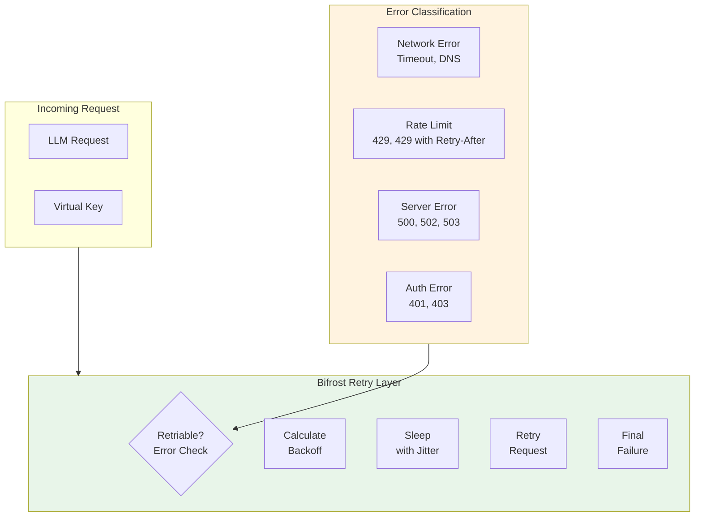

### 1.2 LiteLLM Retry Architecture

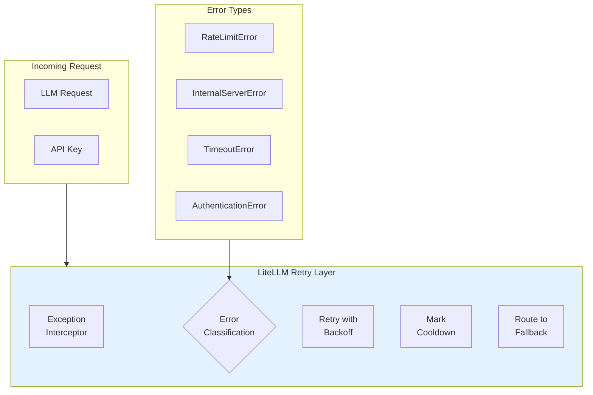

---

## 2. Retry Strategies

### 2.1 Bifrost Retry Flow

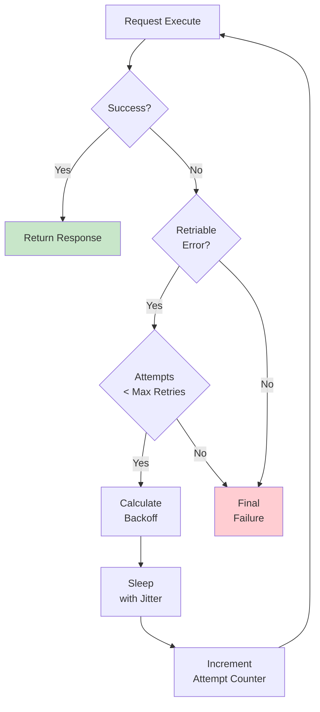

### 2.2 LiteLLM Retry Flow

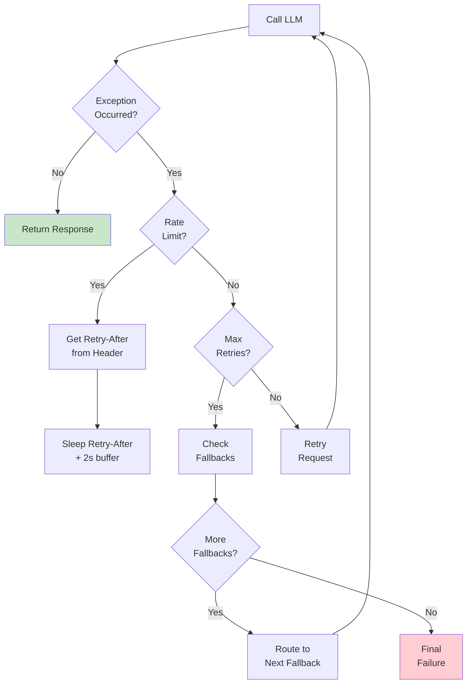

### 2.3 Retry Strategy Comparison

| Aspect | Bifrost | LiteLLM |
|--------|---------|---------|
| **Retry Count** | `max_retries` config | `num_retries` per call |
| **Retriable Check** | Error type classification | Exception type check |
| **Backoff** | Jittered exponential | Provider Retry-After |
| **Fallback** | Provider priority | Explicit fallbacks list |
| **Cooldown** | Via backoff | Separate cooldown system |

---

## 3. Error Classification

### 3.1 Bifrost Error Classification

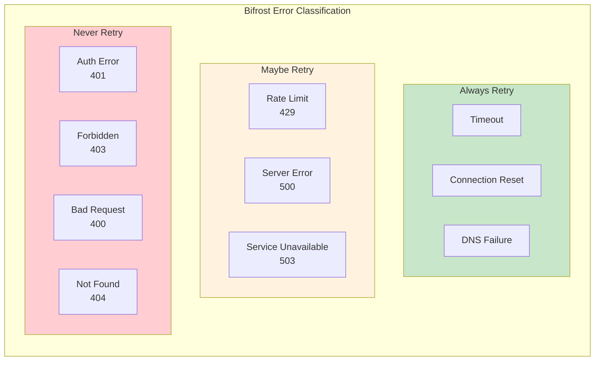

```go
// Bifrost error classification
func isRetriableError(err error) bool {
    switch err {
    // Always retry
    case ErrTimeout, ErrConnectionReset, ErrDNSFailure:
        return true
    
    // Maybe retry - check status code
    case ErrHTTPStatus:
        statusCode := getHTTPStatusCode(err)
        switch statusCode {
        case 429: // Rate limit
            return true
        case 500, 502, 503, 504: // Server errors
            return true
        default:
            return false
        }
    
    // Never retry
    case ErrAuth, ErrForbidden, ErrBadRequest:
        return false
    
    default:
        return false
    }
}
```

### 3.2 LiteLLM Error Classification

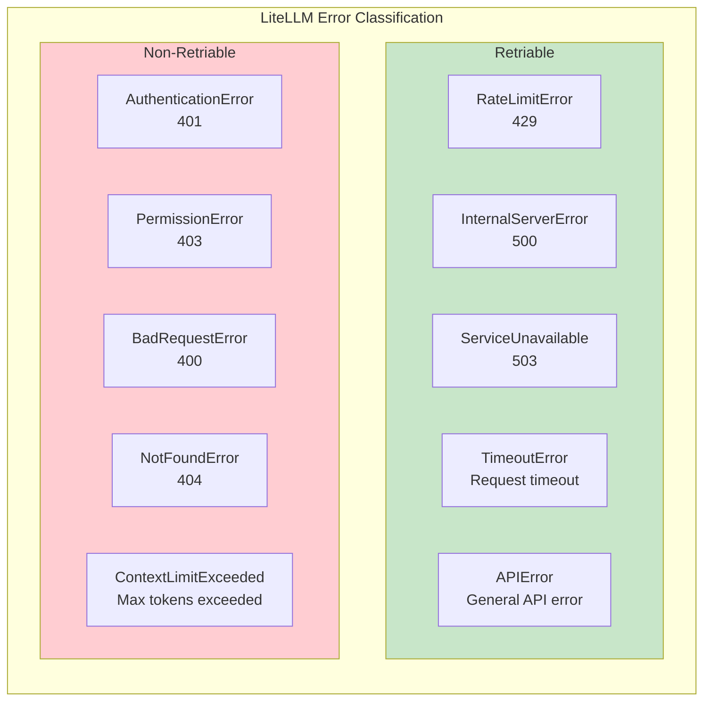

```python
# LiteLLM error classification
class RetriableErrors:
    RETRIABLE_ERROR_TYPES = (
        RateLimitError,
        InternalServerError,
        ServiceUnavailableError,
        TimeoutError,
        APIError,
    )

class NonRetriableErrors:
    NON_RETRIABLE_ERROR_TYPES = (
        AuthenticationError,
        PermissionError,
        BadRequestError,
        NotFoundError,
        ContextLimitExceededError,
        InvalidRequestError,
    )

def is_retriable(error: Exception) -> bool:
    return isinstance(error, RetriableErrors.RETRIABLE_ERROR_TYPES)
```

### 3.3 Error Classification Comparison

| Error Type | Bifrost | LiteLLM |
|------------|---------|---------|
| **429 Rate Limit** | Retriable | Retriable |
| **500 Server Error** | Retriable | Retriable |
| **502 Bad Gateway** | Retriable | Retriable |
| **503 Unavailable** | Retriable | Retriable |
| **Timeout** | Retriable | Retriable |
| **401 Auth** | Never | Never |
| **403 Forbidden** | Never | Never |
| **400 Bad Request** | Never | Never |

---

## 4. Backoff Algorithms

### 4.1 Bifrost Backoff Algorithm

```mermaid
graph LR
    subgraph Formula["Backoff Formula"]
        F1[Initial: 100ms]
        F2[Exponential: Initial × 2^attempt]
        F3[Capped: Min(exponential, max)]
        F4[Jitter: ±20% randomization]
    end
    
    F1 --> F2 --> F3 --> F4
    
    style Formula fill:#e8f5e9
```

```go
// Bifrost backoff calculation
func calculateBackoff(attempt int, config *NetworkConfig) time.Duration {
    // 1. Base exponential backoff
    baseBackoff := config.RetryBackoffInitial * time.Duration(1<<uint(attempt))
    
    // 2. Cap at maximum
    if baseBackoff > config.RetryBackoffMax {
        baseBackoff = config.RetryBackoffMax
    }
    
    // 3. Add jitter (±20%)
    jitter := float64(baseBackoff) * 0.2
    backoffWithJitter := baseBackoff + time.Duration(
        random.Float64()*jitter*2 - jitter,
    )
    
    return backoffWithJitter
}

// Example timeline:
// Attempt 0: 100ms base → 80-120ms
// Attempt 1: 200ms base → 160-240ms
// Attempt 2: 400ms base → 320-480ms
// Attempt 3: 800ms base → 640-960ms
// Attempt 4+: 10000ms cap → 8000-12000ms
```

### 4.2 LiteLLM Backoff Strategy

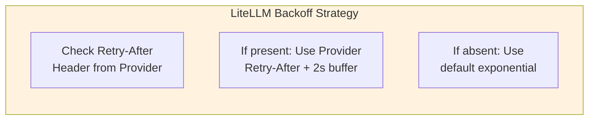

```python
# LiteLLM backoff calculation
def get_retry_after(error: RateLimitError) -> int:
    """Get retry-after from rate limit error or use default."""
    if hasattr(error, 'retry_after') and error.retry_after:
        return error.retry_after + 2  # Add 2 second buffer
    return 30  # Default 30 seconds

async def retry_with_backoff(
    request,
    max_retries: int = 3,
    initial_retry_delay: float = 0.5,
):
    for attempt in range(max_retries + 1):
        try:
            return await execute_request(request)
        except RateLimitError as e:
            if attempt == max_retries:
                raise
            retry_after = get_retry_after(e)
            await asyncio.sleep(retry_after)
        except RetriableError as e:
            if attempt == max_retries:
                raise
            delay = initial_retry_delay * (2 ** attempt)
            await asyncio.sleep(delay)
```

### 4.3 Backoff Comparison

| Aspect | Bifrost | LiteLLM |
|--------|---------|---------|
| **Initial Delay** | `retry_backoff_initial` (100ms) | 0.5s default |
| **Growth** | Exponential (×2) | Exponential (×2) |
| **Cap** | `retry_backoff_max` (10s) | Provider Retry-After |
| **Jitter** | ±20% | No jitter |
| **Rate Limit** | Standard backoff | Provider Retry-After |
| **Buffer** | N/A | +2 seconds |

---

## 5. Fallback Mechanisms

### 5.1 Bifrost Fallback via Provider Priority

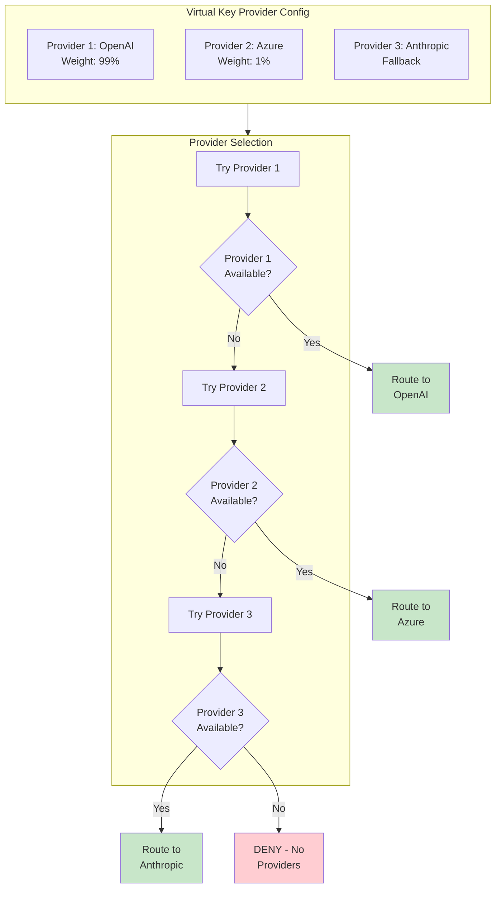

### 5.2 LiteLLM Fallback Configuration

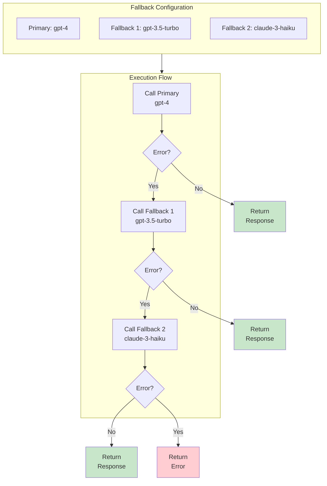

```python
# LiteLLM fallback usage
response = await litellm.acompletion(
    model="gpt-4",
    messages=[{"role": "user", "content": "Hello"}],
    fallbacks=[
        {"model": "gpt-3.5-turbo"},
        {"model": "claude-3-haiku"},
    ],
    max_retries=2,
)
```

### 5.3 Fallback Comparison

| Aspect | Bifrost | LiteLLM |
|--------|---------|---------|
| **Fallback Model** | Provider-level | Explicit `fallbacks` param |
| **Priority** | Via provider weight | Ordered list |
| **Retry per Fallback** | Yes | Yes |
| **Budget Tracking** | Per-provider | Per-model |
| **Cache** | Uses VK cache | Separate cache |

---

## 6. Rate Limit Handling

### 6.1 Bifrost Rate Limit Handling

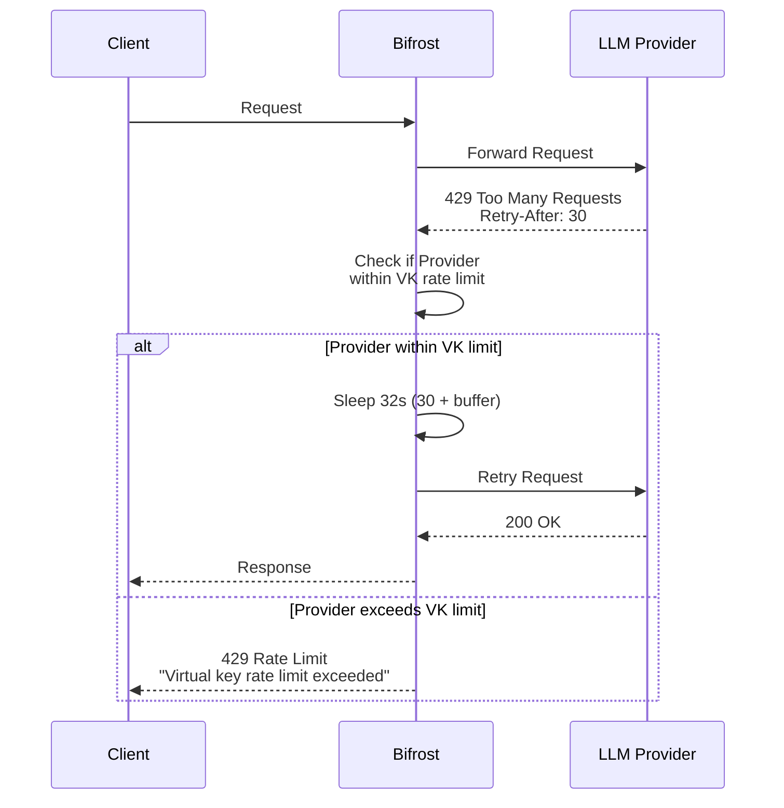

### 6.2 LiteLLM Rate Limit Handling

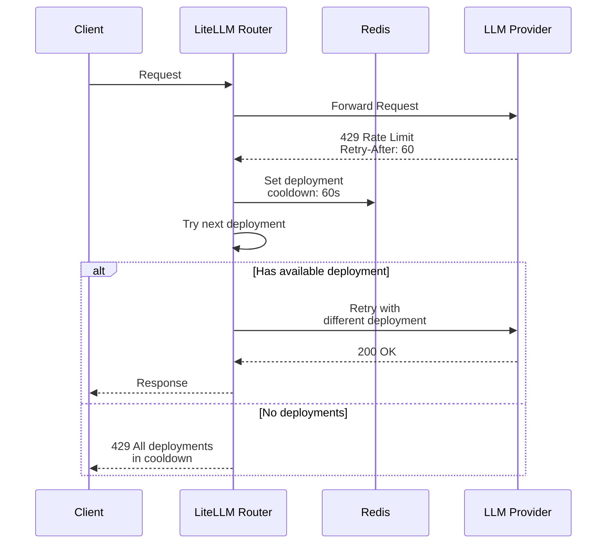

### 6.3 Rate Limit Handling Comparison

| Aspect | Bifrost | LiteLLM |
|--------|---------|---------|
| **Response** | Honor Retry-After | Honor Retry-After |
| **Buffer** | Jitter-based | +2 seconds |
| **VK Limit Check** | Yes - parallel | N/A |
| **Deployment Cooldown** | Per-provider | Per-deployment |
| **Fallback** | Score-sorted providers | Cooldown retry |

---

## 7. Timeout Handling

### 7.1 Bifrost Timeout Handling

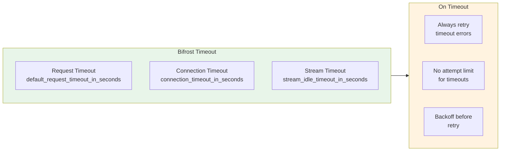

```go
// Bifrost timeout configuration
type NetworkConfig struct {
    DefaultRequestTimeoutInSeconds int `json:"default_request_timeout_in_seconds"`
    ConnectionTimeoutInSeconds     int `json:"connection_timeout_in_seconds"`
    StreamIdleTimeoutInSeconds    int `json:"stream_idle_timeout_in_seconds"`
    MaxConnsPerHost               int `json:"max_conns_per_host"`
}

// Timeout retry logic
func (r *RetryHandler) shouldRetry(err error, attempt int) bool {
    // ALWAYS retry on timeout errors
    if errors.Is(err, context.DeadlineExceeded) {
        return true
    }
    
    // For other errors, check retry policy
    return isRetriableError(err) && attempt < r.maxRetries
}
```

### 7.2 LiteLLM Timeout Handling

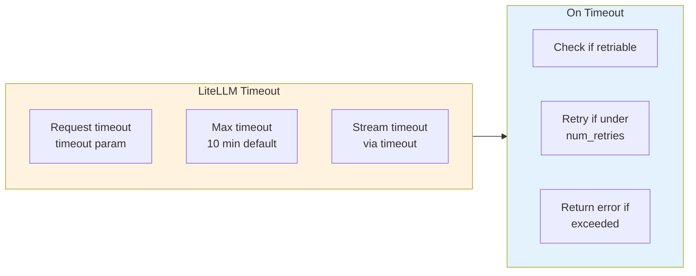

```python
# LiteLLM timeout configuration
response = await litellm.acompletion(
    model="gpt-4",
    messages=[{"role": "user", "content": "Hello"}],
    timeout=60,  # Request timeout in seconds
    max_retries=3,
)

# Timeout handling
async def handle_timeout():
    try:
        response = await litellm.acompletion(...)
    except TimeoutError as e:
        if attempt < max_retries:
            return await retry_with_backoff(...)
        raise
```

### 7.3 Timeout Comparison

| Aspect | Bifrost | LiteLLM |
|--------|---------|---------|
| **Default Timeout** | 60s | 60s |
| **Config Location** | Network config | Request param |
| **Stream Timeout** | `stream_idle_timeout` | Via timeout |
| **Always Retry Timeout** | Yes | Yes (if retriable) |
| **Connection Timeout** | Separate config | Part of timeout |

---

## 8. Configuration

### 8.1 Bifrost Retry Configuration

```yaml
# Network configuration
network_config:
  # Retry settings
  max_retries: 3
  retry_backoff_initial: 100      # milliseconds
  retry_backoff_max: 10000        # milliseconds
  
  # Timeout settings
  default_request_timeout_in_seconds: 60
  connection_timeout_in_seconds: 10
  stream_idle_timeout_in_seconds: 120
  
  # Connection settings
  max_conns_per_host: 100
  enforce_http2: true

# Virtual key with retry behavior
virtual_key:
  name: "production-vk"
  provider_configs:
    - provider: "openai"
      allowed_models: ["gpt-4o"]
      # Retry behavior inherited from network_config
```

### 8.2 LiteLLM Retry Configuration

```yaml
# Router retry configuration
router:
  num_retries: 3
  request_timeout: 60
  timeout_buffer_seconds: 2  # Buffer for retry-after
  retry_after_timeout: true  # Honor Retry-After header
  
  # Fallback models
  model_list:
    - model_name: "gpt-4"
      litellm_params:
        model: "openai/gpt-4"
        fallbacks:
          - model: "gpt-3.5-turbo"
            max_retries: 2
          - model: "claude-3-haiku"
            max_retries: 1

# Per-request retry configuration
litellm_settings:
  set_verbose: True
  
# Custom retry logic
litellm.max_retries = 3
litellm.retry_after_function = custom_retry_after
```

### 8.3 Configuration Comparison

| Config | Bifrost | LiteLLM |
|--------|---------|---------|
| **Max Retries** | `max_retries` | `num_retries` |
| **Initial Backoff** | `retry_backoff_initial` | 0.5s default |
| **Max Backoff** | `retry_backoff_max` | Provider Retry-After |
| **Request Timeout** | `default_request_timeout` | `timeout` |
| **Connection Timeout** | Separate | Part of timeout |
| **Fallback** | Via provider priority | Via `fallbacks` param |
| **Retry-After** | Jitter-based | Honor + 2s buffer |

---

## 9. Key Feature Matrix

| Feature | Bifrost | LiteLLM |
|---------|---------|---------|
| Exponential backoff | ✅ | ✅ |
| Jitter | ✅ ±20% | ❌ |
| Max retries | ✅ Configurable | ✅ Per-request |
| Rate limit handling | ✅ Provider-aware | ✅ Cooldown |
| Timeout retry | ✅ Always | ✅ If retriable |
| Provider fallback | ✅ Weight-based | ✅ Explicit |
| Model fallback | ❌ | ✅ Via fallbacks |
| Cooldown system | Via backoff | Separate |
| Custom backoff | Via config | Via function |

---

## 10. Summary

### Bifrost Advantages
- **Jitter**: Prevents thundering herd with ±20% randomization
- **Provider fallback**: Natural priority via weights
- **Timeout always retried**: No configuration needed
- **Per-VK retry config**: Different policies per customer
- **Simple backoff**: Exponential with cap

### LiteLLM Advantages
- **Explicit fallbacks**: Clear model fallback chain
- **Provider Retry-After**: Honor provider timing
- **Per-request retries**: More flexible
- **Cooldown system**: Separate from retry
- **Larger ecosystem**: More provider support

---

**Next Steps:**
- [ ] Research: Observability Deep Comparison
- [ ] Research: Provider Support Deep Comparison
- [ ] Research: Architecture Deep Comparison
- [ ] Update main comparison document with links