# Research: Virtual Keys Deep Comparison - Bifrost vs LiteLLM

**Date:** 2026-05-11  
**Status:** Companion Research  
**Parent:** [Bifrost vs LiteLLM Comparison](./bifrost-litellm-comparison.md)

---

## Table of Contents

1. [Data Structures](#1-data-structures)
2. [Budget Hierarchy](#2-budget-hierarchy)
3. [Rate Limiting](#3-rate-limiting)
4. [Enforcement Flow](#4-enforcement-flow)
5. [API Surface](#5-api-surface)
6. [In-Memory vs Persistent Storage](#6-in-memory-vs-persistent-storage)
7. [Self-Service Features](#7-self-service-features)

---

## 1. Data Structures

### 1.1 Bifrost Virtual Key Data Model

```go
type TableVirtualKey struct {
    ID              string
    Name            string
    Description     string
    Value           string                           // The actual VK string
    IsActive        bool
    TeamID          *string                          // FK to team
    CustomerID      *string                          // FK to customer
    Budgets         []TableBudget                    // Associated budgets
    RateLimit       *TableRateLimit                  // Rate limit for this VK
    ProviderConfigs []TableVirtualKeyProviderConfig // Per-provider config
}

type TableBudget struct {
    ID            string    // Primary key
    MaxLimit      float64   // Maximum spend allowed
    ResetDuration string    // e.g., "30s", "5m", "1h", "1d", "1w", "1M", "1Y"
    LastReset     time.Time // When budget was last reset
    CurrentUsage  float64   // Current spend
    VirtualKeyID  *string   // FK to VK
    TeamID        *string   // FK to team
    CustomerID    *string   // FK to customer
}

type TableRateLimit struct {
    ID                   string // Primary key
    TokenMaxLimit        *int64 // Max tokens per window
    TokenResetDuration   *string // Token window duration
    RequestMaxLimit      *int64 // Max requests per window
    RequestResetDuration *string // Request window duration
}

type TableVirtualKeyProviderConfig struct {
    Provider      string            // e.g., "openai", "anthropic"
    AllowedModels []string          // Models VK can use
    KeyIDs        []string          // Allowed provider key IDs
    Weight        float64           // Load balancing weight
    Budgets       []TableBudget     // Per-provider budgets
    RateLimit     *TableRateLimit   // Per-provider rate limits
}
```

### 1.2 LiteLLM Virtual Key Data Model

```python
class UserAPIKeyDict(TypedDict):
    token: str                          # Hashed API key
    key_alias: Optional[str]            # Human-readable alias
    key_name: Optional[str]             # Key name
    user_id: Optional[str]              # Owner user ID
    team_id: Optional[str]              # Owner team ID
    organization_id: Optional[str]       # Owner org ID
    max_budget: Optional[float]        # Key-level budget cap
    budget_duration: Optional[str]       # Budget reset period
    spend: float                       # Current spend
    max_parallel_requests: Optional[int]
    rpm_limit: Optional[int]            # Requests per minute
    tpm_limit: Optional[int]           # Tokens per minute
    allowed_model_region: Optional[str]
    model_max_budget: Optional[dict]    # Per-model budgets
    model_access_set: Optional[set]     # Allowed models
    blocked: bool
    litellm_budget_table: LiteLLM_BudgetTable
```

---

## 2. Budget Hierarchy

### 2.1 Bifrost Budget Hierarchy

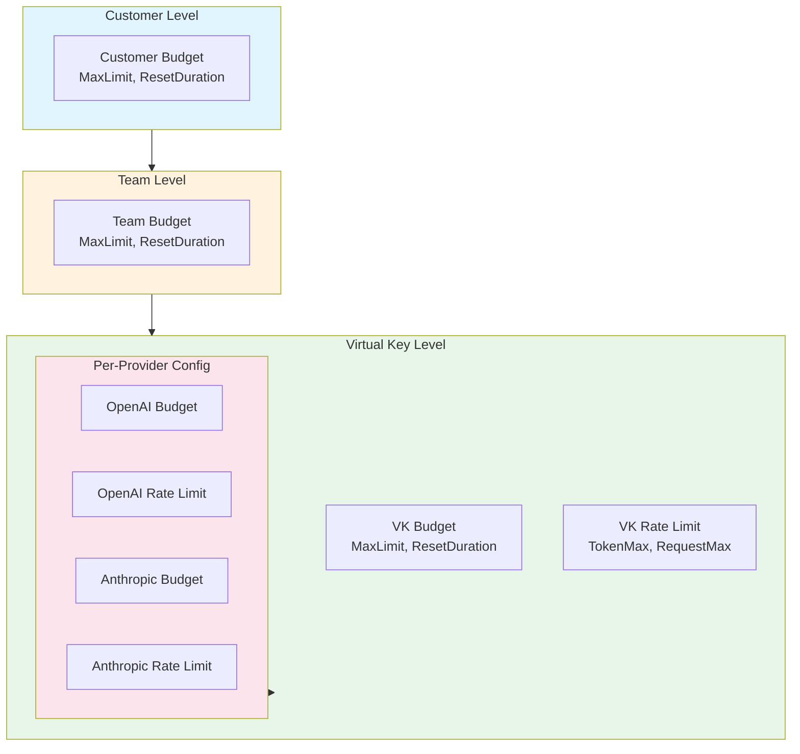

### 2.2 LiteLLM Budget Hierarchy

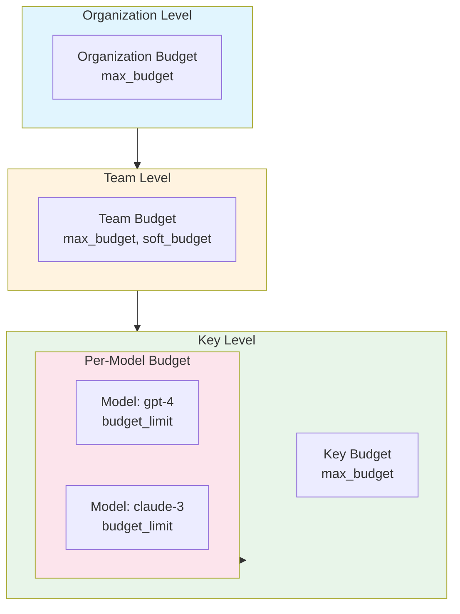

### 2.3 Budget Resolution Comparison

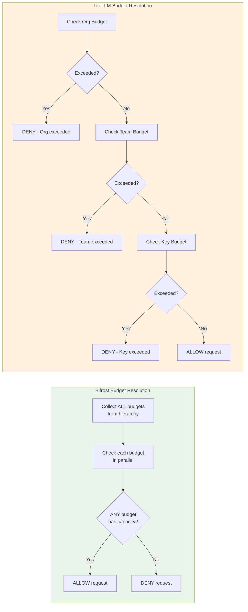

### 2.4 Hierarchy Comparison Table

| Aspect | Bifrost | LiteLLM |
|--------|---------|---------|
| **Levels** | 4 (Customer → Team → VK → Provider) | 4 (Org → Team → Key → Model) |
| **Parallel Check** | Yes - any budget with capacity allows | No - sequential, first failure wins |
| **Per-Provider** | Yes - full budget hierarchy | No - only model-level |
| **Customer Level** | Yes | No (organization) |
| **Self-Service** | Yes - quota endpoint | No |

---

## 3. Rate Limiting

### 3.1 Bifrost Rate Limiting Architecture

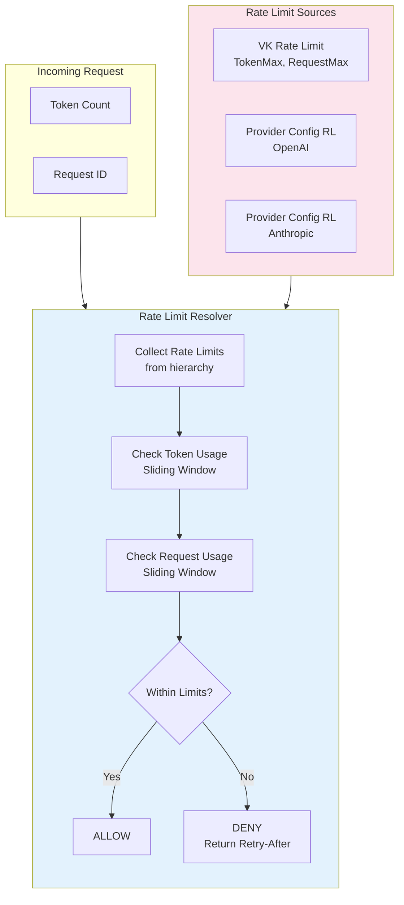

### 3.2 LiteLLM Rate Limiting Architecture

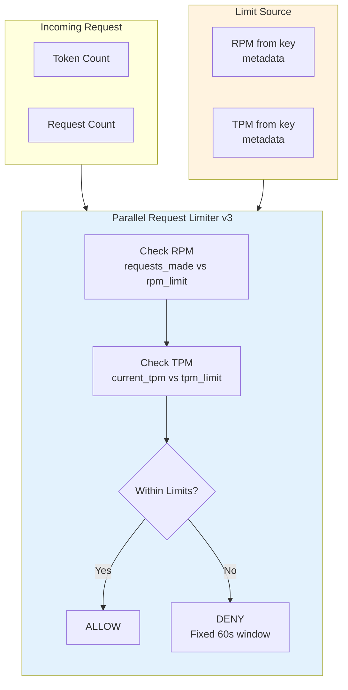

### 3.3 Rate Limiting Comparison

| Aspect | Bifrost | LiteLLM |
|--------|---------|---------|
| **Token Limits** | Native sliding window | Derived from TPM |
| **Request Limits** | Native sliding window | Derived from RPM |
| **Sliding Window** | Yes - precise tracking | Fixed 1-minute window |
| **Provider-Level** | Yes - per VK provider config | No - global only |
| **Distributed Sync** | Via Redis | Via Redis dual-cache |
| **Custom Durations** | Yes - any duration | No - fixed 1 minute |

---

## 4. Enforcement Flow

### 4.1 Bifrost Enforcement Flow

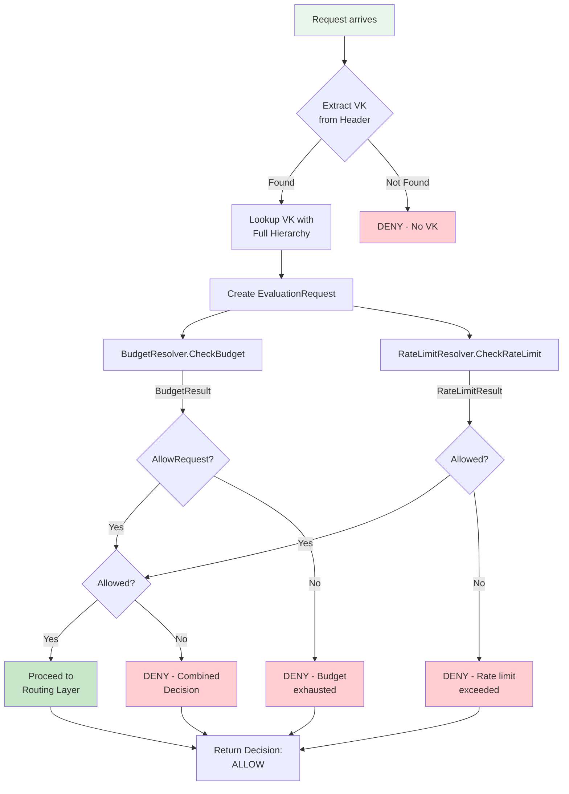

### 4.2 LiteLLM Enforcement Flow

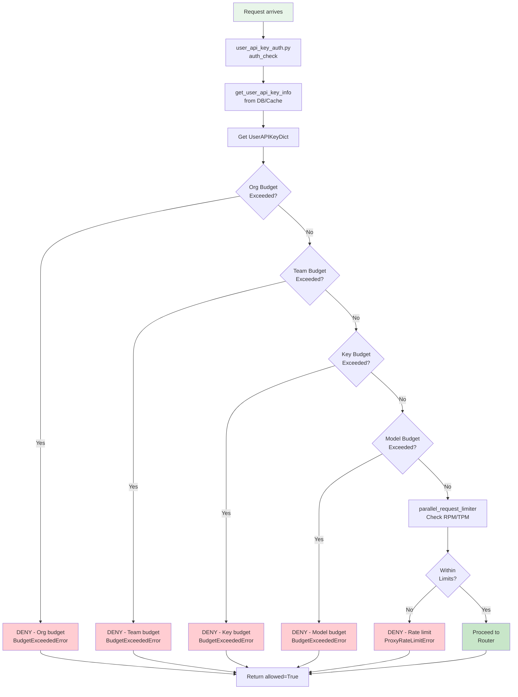

### 4.3 Enforcement Comparison Table

| Aspect | Bifrost | LiteLLM |
|--------|---------|---------|
| **Auth Layer** | Governance plugin | Auth middleware |
| **Budget Check** | Parallel (any capacity) | Sequential (fail-fast) |
| **Rate Limit Check** | Separate resolver | Hook system |
| **Decision Time** | After budget evaluation | During auth phase |
| **VK Lookup** | Full hierarchy included | Separate queries |
| **Error Codes** | Structured `Decision` enum | Generic exceptions |

---

## 5. API Surface

### 5.1 Bifrost API Flow

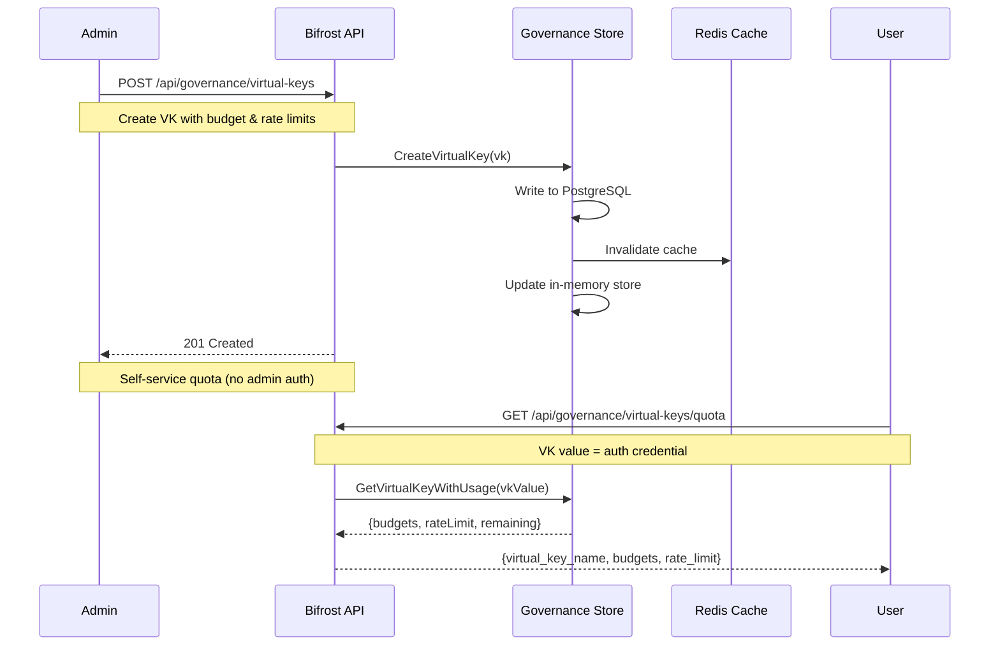

### 5.2 LiteLLM API Flow

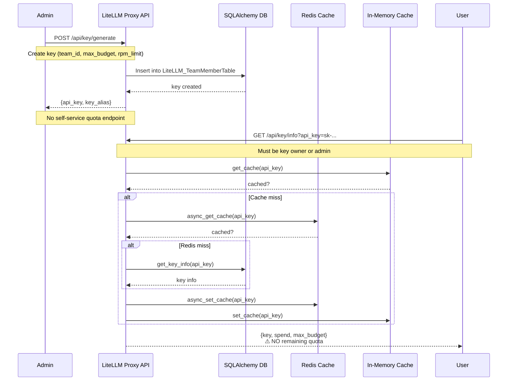

### 5.3 API Comparison Table

| Endpoint | Bifrost | LiteLLM |
|----------|---------|---------|
| Create VK | `POST /virtual-keys` | `POST /key/generate` |
| Self-service quota | Yes | No |
| Budget reset | Automatic | Budget duration |
| Per-provider config | Yes | No |
| Key restrictions | `key_ids` array | `models` array |
| Team assignment | FK reference | Separate endpoint |

---

## 6. Storage Architecture

### 6.1 Bifrost Storage Architecture

```mermaid
graph TB
    subgraph Write["Write Path"]
        W1[CreateVirtualKey] --> W2[Write to PostgreSQL]
        W2 --> W3[Invalidate Redis]
        W3 --> W4[Update In-Memory]
    end
    
    subgraph Read["Read Path"]
        R1[Read Request] --> R2{Redis Cache<br/>Hit?}
        R2 -->|Yes| R3[Return from Redis]
        R2 -->|No| R4{In-Memory<br/>Hit?}
        R4 -->|Yes| R5[Return from Memory]
        R4 -->|No| R6[Query PostgreSQL]
        R6 --> R7[Populate Caches]
        R7 --> R3
    end
    
    subgraph Stores["Storage Backends"]
        PG[(PostgreSQL<br/>SQLite)]
        RED[(Redis)]
        MEM[(&)sync.Map<br/>In-Memory]
    end
    
    W2 -.-> PG
    W3 -.-> RED
    W4 -.-> MEM
    R6 -.-> PG
    R7 -.-> RED
    R7 -.-> MEM
    
    style Write fill:#e8f5e9
    style Read fill:#e3f2fd
```

### 6.2 LiteLLM Storage Architecture

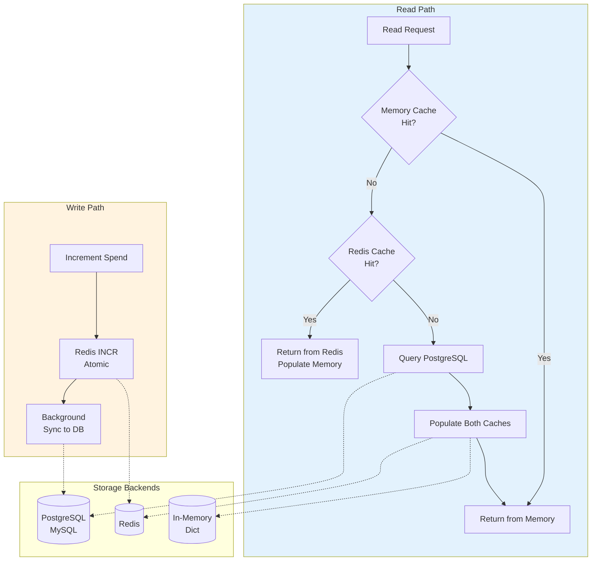

### 6.3 Storage Comparison Table

| Aspect | Bifrost | LiteLLM |
|--------|---------|---------|
| **Primary Store** | PostgreSQL/SQLite | PostgreSQL/MySQL |
| **Cache** | Redis (explicit) | Redis + In-Memory |
| **Write Pattern** | Write-through | Write-through |
| **Read Pattern** | Cache-first | Cache-first |
| **Distributed** | Redis sync | Redis dual-cache |
| **Transaction Safety** | GORM transactions | SQLAlchemy transactions |

---

## 7. Self-Service Features

### 7.1 Bifrost Self-Service Flow

```mermaid
sequenceDiagram
    participant User
    participant API as Bifrost API
    participant Store as Governance Store
    
    Note over User: Self-service endpoint - no admin auth!
    
    User->>API: GET /api/governance/virtual-keys/quota<br/>X-Virtual-Key: sk-bf-xxx
    
    API->>API: Extract VK from header
    API->>Store: GetVirtualKeyWithUsage(vkValue)
    
    Store-->>API: VK with all budgets & rate limits
    
    API->>API: Calculate remaining for each budget<br/>budget.MaxLimit - budget.CurrentUsage
    
    API-->>User: {
      virtual_key_name: "my-vk",
      is_active: true,
      budgets: [{
        id: "budget-123",
        max_limit: 100.00,
        current_usage: 45.50,
        remaining: 54.50,
        next_reset: "2026-06-01"
      }],
      rate_limit: {
        token_max_limit: 100000,
        token_usage: 25000,
        token_remaining: 75000,
        token_reset: "2026-05-11T16:00:00Z"
      }
    }
```

### 7.2 LiteLLM Self-Service (None)

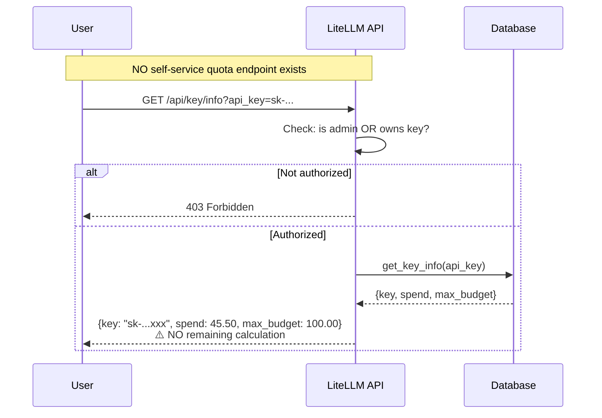

### 7.3 Self-Service Comparison Table

| Feature | Bifrost | LiteLLM |
|---------|---------|---------|
| **Quota endpoint** | Yes | No |
| **Remaining budget** | Yes | No (admin only) |
| **Rate limit status** | Yes | No |
| **Usage breakdown** | Yes | Partial |
| **Reset time** | Yes | No |
| **No admin auth** | Yes | No |

---

## 8. Key Feature Matrix

| Feature | Bifrost | LiteLLM |
|---------|---------|---------|
| Multi-tenant VKs | ✅ | ✅ |
| Budget hierarchy (4+ levels) | ✅ | ✅ |
| Per-provider budgets | ✅ | ❌ |
| Per-provider rate limits | ✅ | ❌ |
| Sliding window rate limits | ✅ | ❌ (fixed 1-min) |
| Key ID restrictions | ✅ | ❌ |
| Self-service quota | ✅ | ❌ |
| Distributed sync | ✅ | ✅ |
| In-memory cache | ✅ | ✅ |
| Redis cache | ✅ | ✅ |
| Transaction safety | ✅ | ✅ |
| Fail-fast budget check | ❌ (parallel) | ✅ |
| Soft budget (warnings) | ❌ | ✅ |

---

## 9. Summary

### Bifrost Advantages
- **Parallel budget evaluation**: Any budget with capacity allows the request
- **Per-provider configuration**: Granular control at provider level
- **Self-service quota**: Users can check their own usage without admin
- **Sliding window rate limits**: More accurate than fixed windows
- **Key ID restrictions**: Limit VK to specific provider API keys

### LiteLLM Advantages
- **Simpler model**: Sequential check is easier to understand
- **Soft budgets**: Warning before hard limit
- **Model access set**: Simple model restrictions
- **Mature ecosystem**: More integrations, larger community

---

**Next Steps:**
- [ ] Research: Load Balancing Deep Comparison
- [ ] Research: Caching Deep Comparison
- [ ] Research: Retry & Fallback Deep Comparison
- [ ] Research: Observability Deep Comparison