# Research: Hermes Agent Architecture

**Date:** 2026-05-22  
**Status:** Research  
**Source:** Source code analysis of `hermes-agent` v0.14.0 (Nous Research)

---

## Table of Contents

1. [Project Overview](#1-project-overview)
2. [System Architecture](#2-system-architecture)
3. [Gateway Layer](#3-gateway-layer)
4. [Channel & Platform System](#4-channel--platform-system)
5. [Communication & Network](#5-communication--network)
6. [Agent Core Loop](#6-agent-core-loop)
7. [TUI Architecture](#7-tui-architecture)
8. [ACP Integration](#8-acp-integration)
9. [Plugin & Extension System](#9-plugin--extension-system)
10. [Cron Scheduler](#10-cron-scheduler)
11. [Data Flow Diagrams](#11-data-flow-diagrams)

---

## 1. Project Overview

Hermes Agent is a self-improving AI agent by Nous Research that creates skills from experience, improves them during use, and runs across multiple platforms.

| Property | Value | Evidence |
|----------|-------|----------|
| **Version** | 0.14.0 | `pyproject.toml:8` |
| **Language** | Python >=3.11 + TypeScript (Ink/React) | `pyproject.toml:10` |
| **License** | MIT | `pyproject.toml:12` |
| **Entry Points** | `hermes`, `hermes-agent`, `hermes-acp` | `pyproject.toml:210-212` |
| **Core LOC** | `run_agent.py` 4247, `cli.py` ~11k, `gateway/run.py` 18205, `agent/conversation_loop.py` 4192 | Source files |
| **Tests** | ~17k tests across ~900 files | `AGENTS.md:61` |
| **Python Files** | 2,612 indexed files, 1,779 `.py` | CocoIndex |

---

## 2. System Architecture

### 2.1 High-Level Architecture

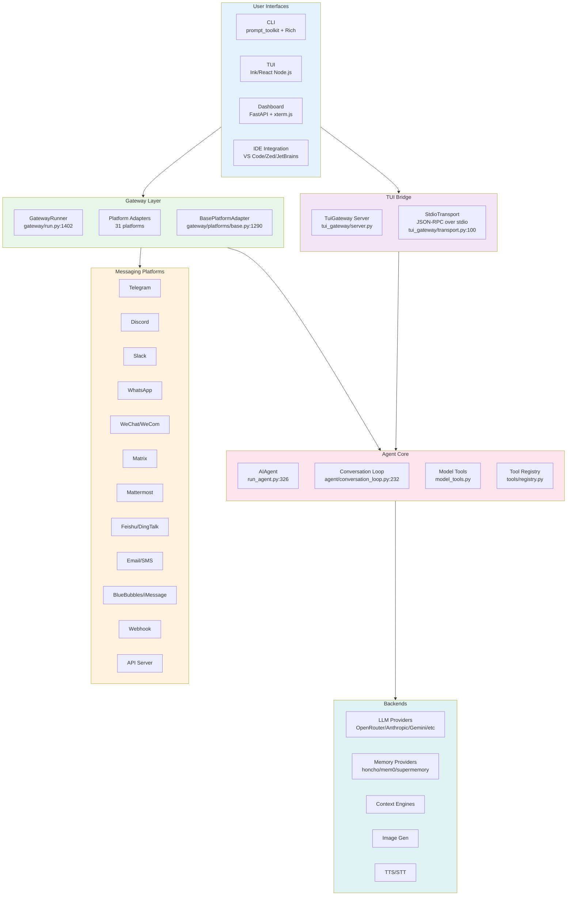

### 2.2 Component Map

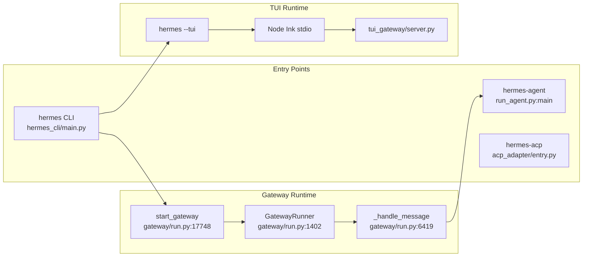

**Entry points** (`pyproject.toml:210-212`):
- `hermes` → `hermes_cli.main:main` — CLI with subcommands (chat, gateway, setup, tools, cron, etc.)
- `hermes-agent` → `run_agent:main` — Standalone agent entry point
- `hermes-acp` → `acp_adapter.entry:main` — IDE integration via Agent Client Protocol

---

## 3. Gateway Layer

### 3.1 Gateway Architecture

The gateway is the central messaging hub connecting chat platforms to the AI agent. It is implemented as a long-running async process.

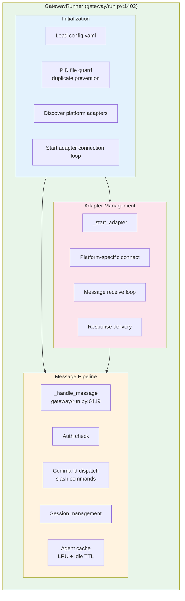

### 3.2 GatewayRunner Key Properties

| Property | Value | Evidence |
|----------|-------|----------|
| **Class** | `GatewayRunner` | `gateway/run.py:1402` |
| **Agent cache** | LRU, max 128, idle TTL 1h | `gateway/run.py:63-64` |
| **Message handler** | `_handle_message(event)` | `gateway/run.py:6419` |
| **Entry point** | `start_gateway()` | `gateway/run.py:17748` |
| **PID guard** | File lock prevents duplicate instances per HERMES_HOME | `gateway/run.py:17748` `gateway.status` |
| **Total gateway code** | 18,205 lines | `gateway/run.py` |

### 3.3 Message Processing Pipeline

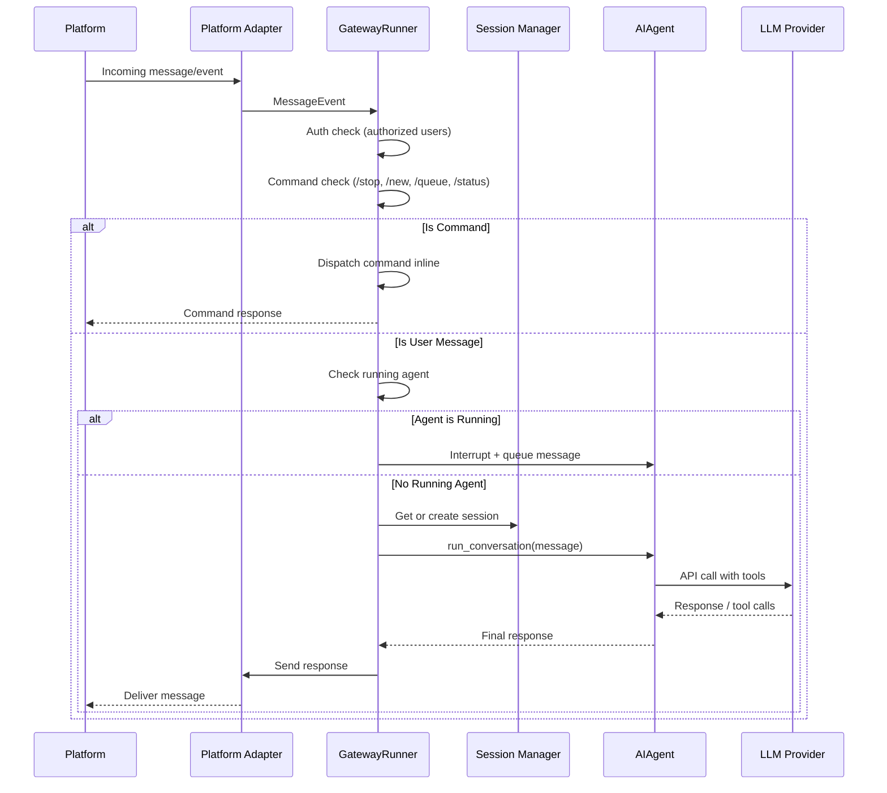

**Source:** `gateway/run.py:6419-6425` — `_handle_message` docstring documents the 7-step pipeline: auth → commands → interrupt check → session → context → agent → response.

### 3.4 Agent Cache

```mermaid
state-v2
    [*] --> Active
    Active --> Active: API call
    Active --> Idle: No activity
    Idle --> Active: New message arrives
    Idle --> Evicted: Idle > 1h (3600s TTL)
    Active --> Evicted: LRU limit (128 agents)
    Evicted --> [*]
```

**Source:** `gateway/run.py:63-64` — `_AGENT_CACHE_MAX_SIZE = 128`, `_AGENT_CACHE_IDLE_TTL_SECS = 3600.0`.

### 3.5 Gateway Process Management

The gateway can run as a foreground process or as a system service:

| Platform | Mechanism | Source |
|----------|-----------|--------|
| **Linux** | systemd unit | `hermes_cli/gateway.py:2142` — `generate_systemd_unit()` |
| **macOS** | launchd plist | `hermes_cli/gateway.py:2783` — `generate_launchd_plist()` |
| **Foreground** | `hermes gateway start` | `hermes_cli/gateway.py:3140` — `run_gateway()` |

CLI commands: `hermes gateway [start|stop|restart|status|setup|...]` at `hermes_cli/gateway.py:5010`.

### 3.6 LLM Transport Layer

The agent abstracts LLM provider communication via `agent/transports/`:

| Transport | File | Protocol |
|-----------|------|----------|
| **Anthropic Messages** | `agent/transports/anthropic.py` | Anthropic Native API |
| **Chat Completions** | `agent/transports/chat_completions.py` | OpenAI-compatible REST |
| **AWS Bedrock** | `agent/transports/bedrock.py` | AWS SDK |
| **Codex** | `agent/transports/codex.py` | OpenAI Codex |
| **MCP Server** | `agent/transports/hermes_tools_mcp_server.py` | MCP stdio |

Abstract base: `agent/transports/base.py`, shared types: `agent/transports/types.py`.

---

## 4. Channel & Platform System

### 4.1 Supported Platforms

Hermes Agent defines **22 built-in platforms** via the `Platform` enum, plus unlimited plugin-discovered platforms via dynamic `_missing_()` resolution.

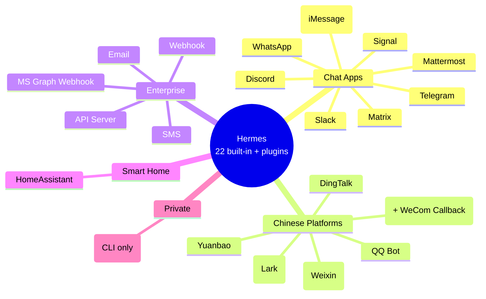

**Source:** `gateway/config.py:100-129` — `Platform(Enum)` enum class with all 22 members. Dynamic members created at `gateway/config.py:141-156` via `_missing_()` for plugin platforms. Bundled plugin platforms scanned at `gateway/config.py:178-199` via `_scan_bundled_plugin_platforms()`.

### 4.2 Platform Adapter Map

Each platform has a dedicated adapter file in `gateway/platforms/`:

| Platform | Adapter File | Additional Files |
|----------|-------------|------------------|
| **Telegram** | `telegram.py` | `telegram_network.py` |
| **Discord** | Plugin-based | `plugins/platforms/discord/adapter.py` |
| **WhatsApp** | `whatsapp.py` | `whatsapp_identity.py` |
| **Slack** | `slack.py` | |
| **Signal** | `signal.py` | `signal_rate_limit.py` |
| **Mattermost** | `mattermost.py` | |
| **Matrix** | `matrix.py` | |
| **HomeAssistant** | `homeassistant.py` | |
| **Email** | `email.py` | |
| **SMS** | `sms.py` | |
| **DingTalk** | `dingtalk.py` | |
| **Feishu** | `feishu.py` | `feishu_comment.py`, `feishu_comment_rules.py` |
| **WeCom** | `wecom.py` | `wecom_callback.py`, `wecom_crypto.py` |
| **Weixin** | `weixin.py` | |
| **BlueBubbles** | `bluebubbles.py` | |
| **QQ Bot** | `qqbot/adapter.py` | `crypto.py`, `keyboards.py`, `onboard.py` |
| **Yuanbao** | `yuanbao.py` | `yuanbao_media.py`, `yuanbao_proto.py`, `yuanbao_sticker.py` |
| **API Server** | `api_server.py` | |
| **Webhook** | `webhook.py` | |
| **MS Graph Webhook** | `msgraph_webhook.py` | |
| **Local** | (no adapter) | CLI-only, no network adapter needed |

**31 adapter files** total in `gateway/platforms/`.

Additionally, **6 plugin-only platforms** ship under `plugins/platforms/` without a corresponding entry in the built-in Platform enum:

| Plugin Platform | Adapter File |
|----------------|-------------|
| **Discord** | `plugins/platforms/discord/adapter.py` |
| **IRC** | `plugins/platforms/irc/adapter.py` |
| **LINE** | `plugins/platforms/line/adapter.py` |
| **SimpleX** | `plugins/platforms/simplex/adapter.py` |
| **Teams** | `plugins/platforms/teams/adapter.py` |
| **Google Chat** | `plugins/platforms/google_chat/adapter.py` |

These are discovered dynamically via `Platform._missing_()` at `gateway/config.py:130-173`.

### 4.3 Adapter Factory

`GatewayRunner._create_adapter()` at `gateway/run.py:5874-6087` maps each `Platform` enum to its adapter class via a large if/elif chain. Plugin platforms are checked first via `platform_registry.is_registered()` (line 5897-5917).

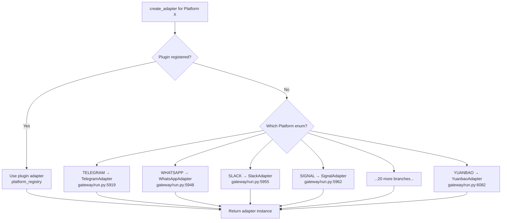

### 4.4 Plugin Platform Registry

**Source:** `gateway/platform_registry.py:39-260`

Third-party platforms self-register via `PlatformRegistry.register()` (line 172). Each `PlatformEntry` (line 39) holds:
- `name` — config.yaml key (e.g. "irc")
- `label` — human-readable name
- `adapter_factory` — callable returning adapter instance
- `check_fn` — dependency availability check
- `validate_config` — config validation function  
- `required_env` — required environment variables
- `install_hint` — pip install instructions

Key methods: `register()` (line 172), `create_adapter()` (line 208), `all_entries()` (line 197), `plugin_entries()` (line 201), `is_registered()` (line 205).

### 4.5 BasePlatformAdapter

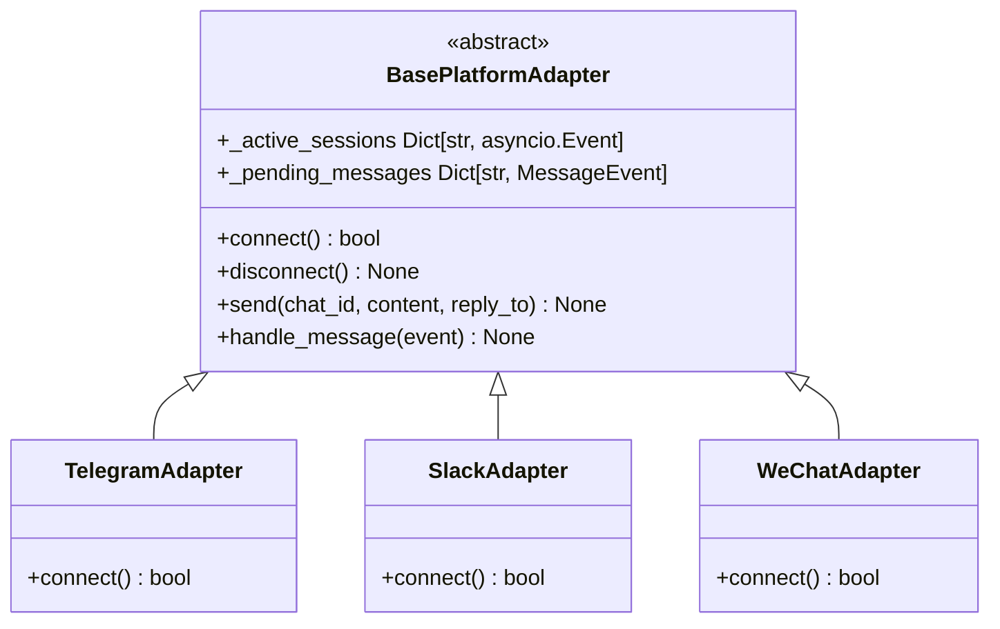

**Source:** `gateway/platforms/base.py:1290` — `BasePlatformAdapter(ABC)`, with `connect()` at line 1564, `disconnect()` at line 1573, `_active_sessions` tracking at line 2894, `_pending_messages` at line 3612.

### 4.6 Two-Level Message Guard

Messages pass through **two sequential guards** before reaching the agent:

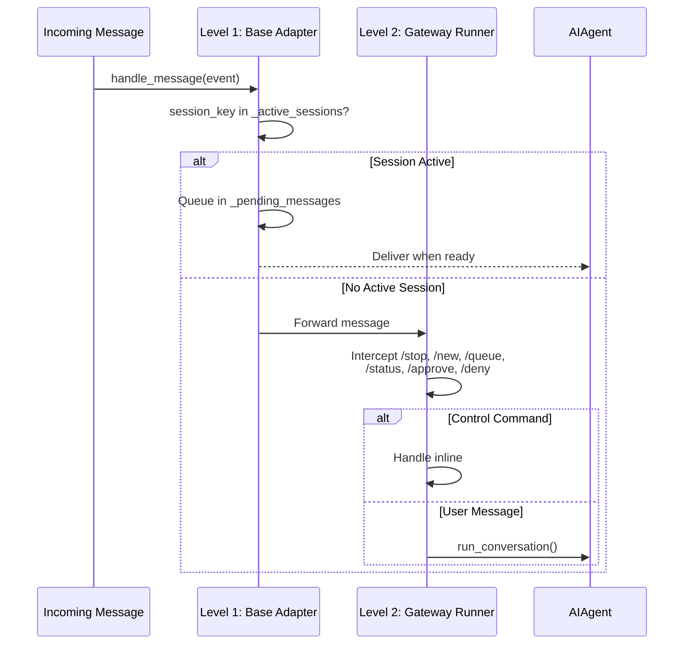

**Source:** `gateway/platforms/base.py:2894` (Level 1 — `_active_sessions` guard), `gateway/run.py` (Level 2 — command interception before `running_agent.interrupt()`).

---

## 5. Communication & Network

### 5.1 Communication Paths

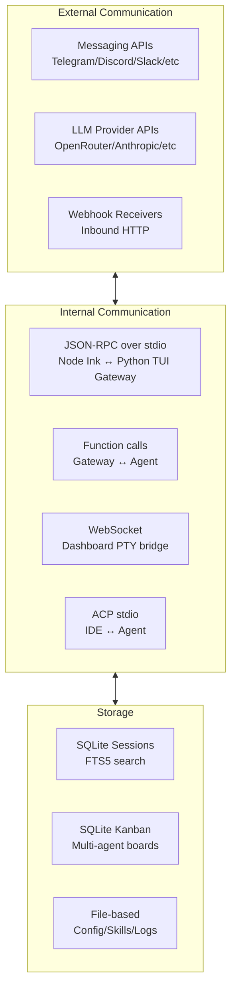

### 5.2 TUI Transport: JSON-RPC over stdio

The primary communication between the TypeScript Ink UI and the Python backend is **newline-delimited JSON-RPC over stdio**.

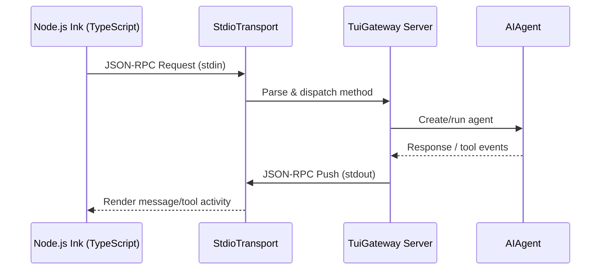

**Source:** `tui_gateway/transport.py:67-100`

- `Transport` Protocol (`transport.py:67`): `write(obj) -> bool`, `close()` 
- `StdioTransport` (`transport.py:100`): Writes JSON frames via callable stream getter, thread-safe with lock
- Uses `contextvars.ContextVar` for transport binding across async tasks

### 5.3 TUI Gateway Server

The server (`tui_gateway/server.py`, 6,769 lines) handles:

| Surface | Gateway Method | Direction |
|---------|---------------|-----------|
| Chat streaming | `prompt.submit` → `message.delta/complete` | Ink→Python→Ink |
| Tool activity | `tool.start/progress/complete` | Python→Ink (push) |
| Approvals | `approval.request` → `approval.respond` | Python→Ink→Python |
| Session picker | `session.list/resume` | Bidirectional |
| Slash commands | `slash.exec` → `command.dispatch` | Ink→Python worker |
| Completions | `complete.slash`, `complete.path` | Ink→Python |

**Source:** `AGENTS.md:217-227` — TUI Architecture section documents the full method/event catalog.

### 5.4 Dashboard WebSocket PTY Bridge

```mermaid
sequenceDiagram
    participant Browser as Browser (xterm.js)
    participant WS as WebSocket /api/pty
    participant Server as FastAPI
    participant PTY as PTY Process (hermes --tui)
    
    Browser->>WS: Connect?token=SESSION_TOKEN
    WS->>Server: Auth via ephemeral token
    Server->>PTY: Spawn hermes --tui via ptyprocess
    PTY-->>Server: Raw PTY bytes
    Server-->>WS: Forward output
    WS-->>Browser: Render in xterm.js Terminal
    Browser->>WS: User input
    WS->>Server: Forward stdin
    Server->>PTY: Write stdin
    Browser->>WS: Resize event
    WS->>Server: \x1b[RESIZE:cols;rows]
    Server->>PTY: TIOCSWINSZ ioctl
```

**Source:** `AGENTS.md:248-256` — Dashboard embeds the real `hermes --tui`, not a rewrite. Uses `ptyprocess` (POSIX PTY), `xterm.js` WebGL renderer, resize via ANSI escape intercept.

### 5.5 Delivery Router

The `DeliveryRouter` (`gateway/delivery.py:29-258`) resolves delivery targets and routes responses to the correct platform adapter.

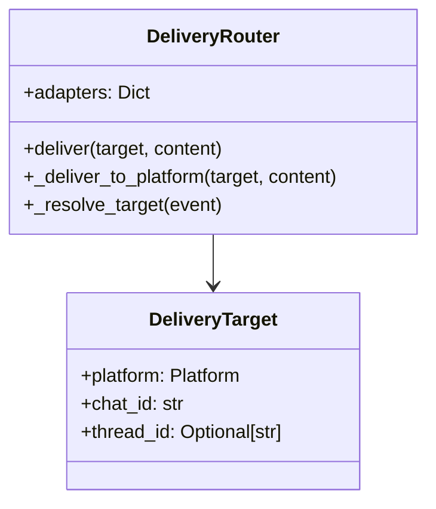

**Key method:** `DeliveryRouter.deliver()` (line 129) → `_deliver_to_platform()` (line 226) → `adapter.send()`. Infrastructure platforms (local, api_server, webhook) are skipped from channel discovery via `_SKIP_SESSION_DISCOVERY = frozenset({"local", "api_server", "webhook"})` (line ~80).

### 5.6 Pairing & Authorization System

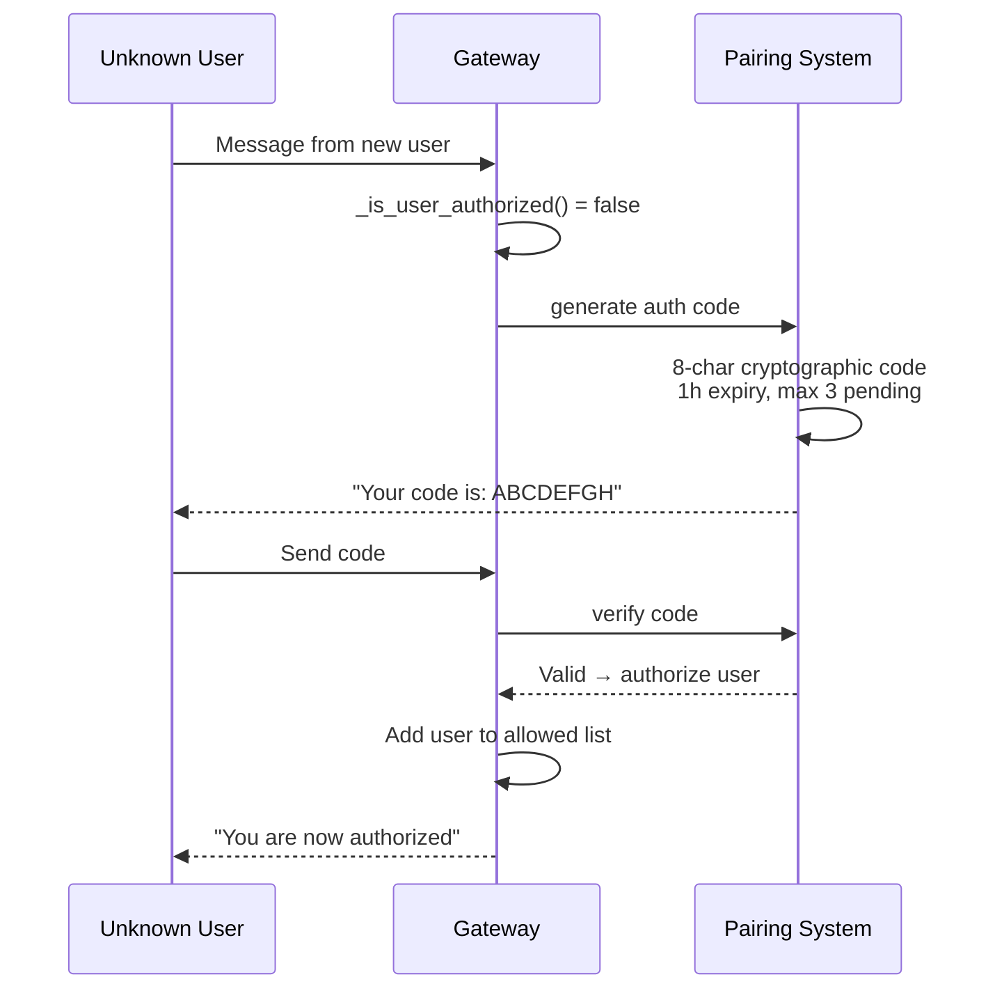

**Source:** `gateway/pairing.py:157` — `generate_code()` with 8-char codes, `gateway/pairing.py:188` — cryptographic code generation. Rate limited: 1 request per user per 10 min (line 41), lockout after 5 failed attempts (1 hour, line 41), file permissions `chmod 0600` on data. Storage in `~/.hermes/pairing/`.

**Authorization maps** in `gateway/run.py`:
- `platform_env_map`: maps `Platform` → `<PLATFORM>_ALLOWED_USERS` env var
- `platform_allow_all_map`: maps `Platform` → `<PLATFORM>_ALLOW_ALL_USERS` env var

### 5.7 Session Identity & Channel Directory

**Session identity** (`gateway/session.py`): `SessionSource` dataclass tracks `platform`, `chat_id`, `user_id` for routing responses back, injecting context into system prompts, and tracking origin for cron delivery. Session keys formatted as `platform:chat_id` (parsed by `_parse_session_key()` at `gateway/run.py:1244`).

**Channel directory** (`gateway/channel_directory.py:1-358`): `build_channel_directory()` (~line 50) builds a map from all connected adapters. Skips infrastructure platforms: `_SKIP_SESSION_DISCOVERY = frozenset({"local", "api_server", "webhook"})` (~line 80). Plugin platforms included via `platform_registry.plugin_entries()` (~line 93).

**Multi-profile safety:** Platform adapters use `acquire_scoped_lock()` from `gateway.status` in `connect()`/`start()` and `release_scoped_lock()` in `disconnect()`/`stop()` to prevent two profiles from using the same credential. Canonical pattern in `gateway/platforms/telegram.py`. Session key parse at `gateway/run.py:1244`.

### 5.8 Network Protocol Summary

| Path | Protocol | Transport | Evidence |
|------|----------|-----------|----------|
| **TUI** | JSON-RPC | stdio (stdin/stdout) | `tui_gateway/transport.py:100` |
| **Dashboard** | Raw PTY bytes | WebSocket upgrade | `AGENTS.md:253` |
| **Messaging** | Platform-native APIs | HTTPS (telegram, discord, slack, etc.) | `gateway/platforms/*.py` |
| **ACP** | Agent Client Protocol | stdio | `acp_adapter/` |
| **LLM** | OpenAI-compatible REST | HTTPS | `agent/transports/chat_completions.py` |
| **Config** | YAML files | Local filesystem | `hermes_cli/config.py` |
| **Sessions** | SQLite + FTS5 | Local file DB | `hermes_state.py` |

---

## 6. Agent Core Loop

### 6.1 AIAgent Class

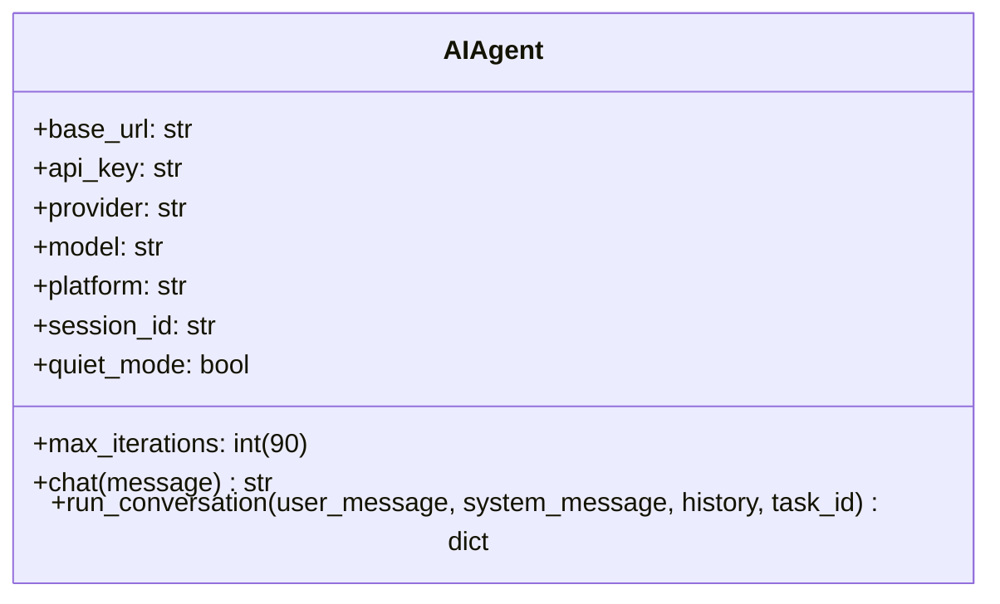

**Source:** `run_agent.py:326` — `AIAgent` class with ~60 init parameters. `chat()` at `run_agent.py:4003`, `run_conversation()` at `run_agent.py:3990`.

### 6.2 Conversation Loop

The core agent loop is in `agent/conversation_loop.py:232` (`run_conversation` function, 4,192 lines).

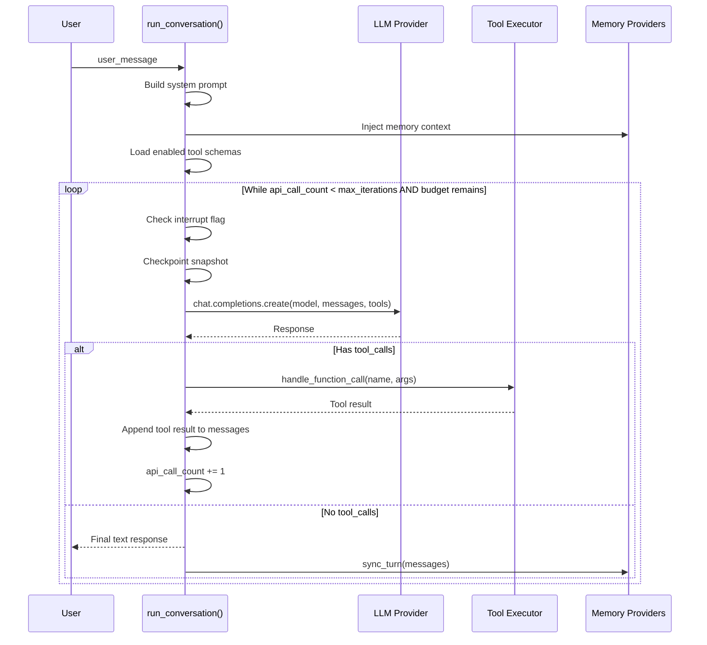

**Source:** `agent/conversation_loop.py:644` — while loop conditions: `api_call_count < agent.max_iterations AND agent.iteration_budget.remaining > 0` with `_budget_grace_call` for one extra turn.

### 6.3 Agent Loop Properties

| Property | Value | Evidence |
|----------|-------|----------|
| **Max iterations** | 90 (default) | `AGENTS.md:98` |
| **Grace call** | 1 extra turn after budget exhausted | `agent/conversation_loop.py:644` |
| **Interrupt model** | Flag-based (`_interrupt_requested`) | `agent/conversation_loop.py:651` |
| **Checkpoints** | Per-turn dedup snapshots | `agent/conversation_loop.py:647` |
| **Memory sync** | `sync_turn(messages)` after each turn | `AGENTS.md:520` |

### 6.4 Budget & Grace Call

```mermaid
state-v2
    [*] --> Running
    Running --> Running: api_call_count < max_iterations<br/>AND budget > 0
    Running --> GraceCall: budget exhausted
    GraceCall --> Done: grace consumed
    GraceCall --> Running: model returned tool_calls<br/>(needs one more iteration)
    Running --> Interrupted: interrupt flag set
    Interrupted --> [*]
    Done --> [*]
```

**Source:** `agent/conversation_loop.py:644-669` — `_budget_grace_call` allows one final API call after budget exhaustion, consumed if the response is a tool call that needs processing.

---

## 7. TUI Architecture

### 7.1 Dual-Process Model

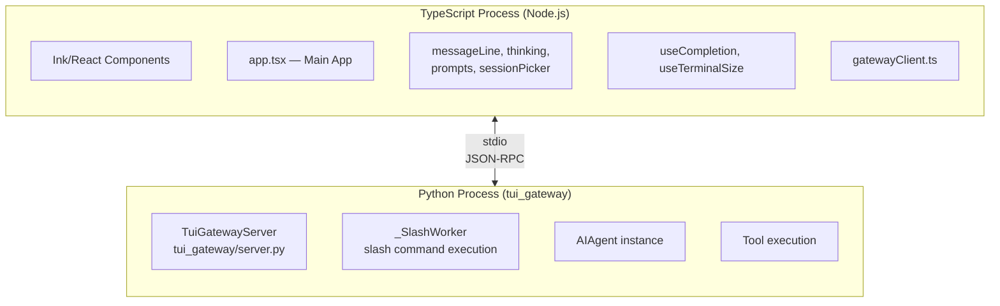

**Source:** `AGENTS.md:200-207` — "TypeScript owns the screen. Python owns sessions, tools, model calls, and slash command logic."

### 7.2 TUI Activation Flow

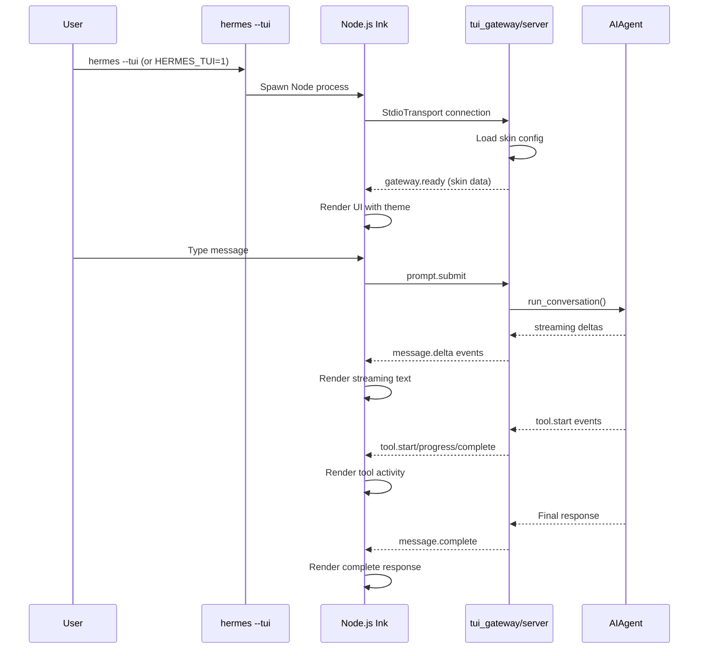

---

## 8. ACP Integration

### 8.1 Agent Client Protocol

ACP enables IDE integration (VS Code, Zed, JetBrains) via the `agent-client-protocol` package.

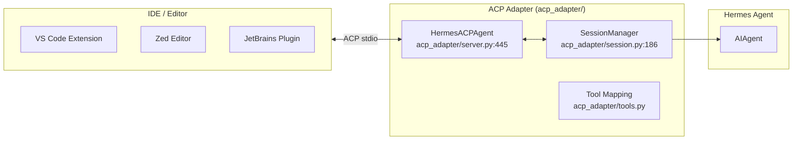

**Source:** `pyproject.toml:114` — `acp = ["agent-client-protocol==0.9.0"]`, `pyproject.toml:212` — `hermes-acp = "acp_adapter.entry:main"`.

### 8.2 HermesACPAgent Class

**Source:** `acp_adapter/server.py:445` — `HermesACPAgent(acp.Agent)` implements the full ACP protocol.

Key methods with line evidence:

| Method | Line | Purpose |
|--------|------|---------|
| `__init__` | 516 | Initialize with `SessionManager` |
| `on_connect` | 523 | Handle new ACP connection |
| `initialize` | 821 | Negotiate `acp.PROTOCOL_VERSION` (line 829) |
| `authenticate` | 855 | Auth via `method_id` and kwargs |
| `new_session` | 1069 | Create new agent session with `cwd` |
| `load_session` | 1086 | Load existing session by ID |
| `resume_session` | 1130 | Resume paused session |
| `cancel` | 1162 | Cancel running session |
| `fork_session` | 1176 | Fork session with new `cwd` |
| `list_sessions` | 1196 | List sessions for `cwd` |
| `prompt` | 1243 | **Main entry point** — user message to agent |
| `set_session_model` | 1878 | Override model for session |
| `set_session_mode` | 1912 | Change API mode |
| `set_config_option` | 1928 | Live config update |

### 8.3 SessionManager

**Source:** `acp_adapter/session.py:186` — `SessionManager` class.

Creates agent sessions via `_make_agent()` (line 563) which imports `from run_agent import AIAgent` (line 576). Key methods:
- `create_session(cwd)` (line 210), `get_session(session_id)` (line 231), `remove_session(session_id)` (line 244), `fork_session(session_id, cwd)` (line 253), `list_sessions(cwd)` (line 283).

### 8.4 ACP vs Gateway Channels

ACP is **not a messaging channel**. It is a **protocol surface** for IDE tools. It does NOT appear in the `Platform` enum. Instead it provides structured protocol methods (`prompt`, `new_session`, `cancel`, etc.) via its own ACP stdio — a different protocol from the TUI's JSON-RPC over stdio.

### 8.5 LSP Support

Hermes Agent includes an LSP client (`agent/lsp/`) enabling code intelligence interactions with language servers in IDE contexts.

---

## 9. Plugin & Extension System

### 9.1 Plugin Architecture

```mermaid
graph TB
    subgraph PluginManager["Plugin Manager (hermes_cli/plugins.py)"]
        PM1[Discover plugins<br/>~/.hermes/plugins/<br/>pip entry points]
        PM2[Lifecycle hooks<br/>pre/post tool_call<br/>pre/post llm_call<br/>session start/end]
        PM3[Register tools<br/>ctx.register_tool()]
        PM4[Register CLI commands<br/>ctx.register_cli_command()]
    end
    
    subgraph PluginTypes["Plugin Types"]
        direction LR
        PT1[Memory Providers<br/>honcho/mem0/supermemory]
        PT2[Model Providers<br/>openrouter/anthropic/gmi]
        PT3[Context Engines]
        PT4[Image Gen<br/>fal/other]
        PT5[Platform Adapters<br/>Discord]
        PT6[Kanban<br/>Multi-agent board]
        PT7[Observability]
    end
    
    PluginManager --> PluginTypes
```

**Source:** `AGENTS.md:487-584` — Two plugin surfaces: general plugins (lifecycle hooks) and memory-provider plugins (MemoryProvider ABC).

### 9.2 Model Provider Plugins

Model providers ship as plugins at `plugins/model-providers/<name>/`. Each calls `providers.register_provider(ProviderProfile(...))` at module load. Discovery order: bundled → user `$HERMES_HOME/plugins/` → legacy `providers/<name>.py`. User plugins override bundled via last-writer-wins.

**Source:** `AGENTS.md:549-572` — Full model-provider plugin architecture documented.

---

## 10. Cron Scheduler

### 10.1 Cron Architecture

```mermaid
graph TB
    subgraph Scheduler["Cron Scheduler"]
        direction TB
        CS[cron/scheduler.py:1787<br/>tick() loop — 1969 lines]
        CJ[cron/jobs.py:404<br/>load_jobs() — 1203 lines]
        Lock[File lock<br/>~/.hermes/cron/.tick.lock]
    end
    
    subgraph Jobs["Job Resolution"]
        J1[parse_duration<br/>cron/jobs.py:166]
        J2[parse_schedule<br/>cron/jobs.py:187]
        J3[compute_next_run<br/>cron/jobs.py:354]
        J4[get_due_jobs<br/>cron/jobs.py:959]
    end
    
    subgraph Execution["Execution"]
        E1[run_job<br/>cron/scheduler.py:1134]
        E2[_run_job_impl<br/>cron/scheduler.py:1141]
        E3[_build_job_prompt<br/>cron/scheduler.py:954]
        E4[_deliver_result<br/>cron/scheduler.py:569]
    end
    
    subgraph Interface["User Interface"]
        I1[hermes cron list/add/edit/pause/resume/run/remove]
        I2[cronjob tool]
        I3[/cron slash command]
    end
    
    Scheduler --> Jobs
    Jobs --> Execution
    Interface --> Scheduler
```

**Source:** `cron/jobs.py` (1203 lines) — job store, `cron/scheduler.py` (1969 lines) — tick loop + execution engine.

### 10.2 Cron Properties

| Property | Value | Evidence |
|----------|-------|----------|
| **Schedule formats** | Duration, "every" phrase, 5-field cron, ISO timestamp | `AGENTS.md:792-795` |
| **Job store** | `~/.hermes/cron/jobs.json` | `cron/jobs.py:404` |
| **Hard interrupt** | 3 minutes | `AGENTS.md:806` |
| **Lock** | File lock at `~/.hermes/cron/.tick.lock` | `cron/jobs.py` (lock paths) |
| **Catchup window** | Half job period, clamped 120s-2h | `AGENTS.md:807` |
| **Memory** | Disabled during cron (`skip_memory=True`) | `cron/scheduler.py:1141` |
| **Delivery** | Own cron session, NOT mirrored to gateway | `AGENTS.md:815` |

### 10.3 Per-Job Configuration

Jobs can specify: `skills` (skill list to load), `model`/`provider` overrides, `script` (pre-run data-collection script whose stdout is injected into prompt), `no_agent=True` (script-only job, no AI), `context_from` (chain job A's output → job B's prompt), `workdir` (working directory with `AGENTS.md` loaded), and multi-platform delivery targets.

### 10.4 Job Resolution

```mermaid
sequenceDiagram
    participant User
    participant CLI as hermes cron
    participant Jobs as cron/jobs.py
    participant Sched as cron/scheduler.py
    participant Agent as AIAgent (skip_memory=True)
    
    User->>CLI: hermes cron add "every 2h" "check status"
    CLI->>Jobs: parse_schedule("every 2h")
    Jobs->>Jobs: compute_next_run()
    Jobs-->>CLI: Job created
    
    loop Every tick
        Sched->>Jobs: get_due_jobs()
        Jobs>>Sched: Due jobs list
        Sched->>Sched: _process_job(job)
        Sched->>Sched: _resolve_delivery_targets(job)
        Sched->>Sched: _build_job_prompt(job, script)
        Sched->>Agent: run_conversation(prompt)
        Agent-->>Sched: Result
        Sched->>Sched: _deliver_result(job, content)
        Sched->>Jobs: advance_next_run(job_id)
    end
```

**Source:** `cron/scheduler.py:1787` — `tick()` main loop, `cron/scheduler.py:1134` — `run_job()`, `cron/scheduler.py:1141` — `_run_job_impl()`, `cron/jobs.py:187` — `parse_schedule()`, `cron/jobs.py:354` — `compute_next_run()`, `cron/jobs.py:959` — `get_due_jobs()`.

---

## 11. Data Flow Diagrams

### 11.1 Full Request Flow

```mermaid
sequenceDiagram
    participant User
    participant Channel as Chat Platform
    participant Adapter as Platform Adapter
    participant Gateway as GatewayRunner
    participant Session as SessionDB (SQLite)
    participant Agent2 as AIAgent
    participant Model as LLM Provider
    participant Tools2 as Tool Executor
    participant Memory2 as Memory Provider
    
    User->>Channel: Send message
    Channel->>Adapter: Platform event
    Adapter->>Gateway: MessageEvent
    
    Gateway->>Gateway: 1. Auth check
    Gateway->>Gateway: 2. Command dispatch?
    
    alt Slash Command
        Gateway->>Gateway: Handle inline
        Gateway-->>Adapter: Command response
        Adapter-->>Channel: Response
    else User Message
        Gateway->>Gateway: 3. Check running agent
        Gateway->>Session: 4. Get/create session
        
        alt Agent Running
            Gateway->>Agent2: queue_message()
            Agent2->>Agent2: Set interrupt flag
        else New Turn
            Gateway->>Agent2: run_conversation(message)
            
            Agent2->>Session: Build context from history
            Agent2->>Memory2: prefetch(query)
            Memory2-->>Agent2: Memory context
            
            loop Until completion or budget
                Agent2->>Model: API call (messages, tools)
                Model-->>Agent2: Response / tool_calls
                
                alt Tool Call
                    Agent2->>Tools2: Execute tool
                    Tools2-->>Agent2: Result
                else Text Response
                    Agent2-->>Gateway: Final response
                end
            end
            
            Agent2->>Memory2: sync_turn(messages)
            Agent2->>Session: Save turn to DB
            
            Gateway->>Adapter: Send response
            Adapter-->>Channel: Deliver message
            Channel-->>User: Display response
        end
    end
```

### 11.2 Gateway Process Model

```mermaid
state-v2
    [*] --> Booting
    Booting --> ConnectingAdapters: Config loaded, PID acquired
    
    ConnectingAdapters --> Running: >0 adapters connected
    ConnectingAdapters --> Failed: No adapters connected
    
    Running --> Running: Handling messages
    Running --> Draining: Signal received (SIGTERM/SIGINT)
    
    Draining --> Draining: Complete in-flight requests
    Draining --> Restarting: restart_requested
    Draining --> Stopped: All sessions ended
    
    Restarting --> Booting: New process spawns
    Stopped --> [*]
    Failed --> [*]
    
    note right of Running
        Agent cache: LRU 128
        Idle TTL: 3600s
        PID lock held
    end
```

**Source:** `gateway/run.py:1402-18205` — `GatewayRunner` with `_draining`, `_restart_requested`, `_restart_task_started`, `_restart_detached`, `_stop_task` state management.

### 11.3 Session Storage

```mermaid
graph TB
    subgraph SessionDB["SessionDB (hermes_state.py)"]
        direction TB
        SQLite[(SQLite Database)]
        FTS[FTS5 Full-Text Search]
        Schema[(session_data<br/>messages JSON<br/>metadata)]
    end
    
    subgraph Operations
        O1[Create session]
        O2[Save turn]
        O3[Search history]
        O4[List sessions]
        O5[Resume session]
    end
    
    SessionDB --> Operations
```

**Source:** `AGENTS.md:28` — `hermes_state.py` implements `SessionDB` with FTS5 search for session history.

---

## 12. Key Findings

### 12.1 Architecture Strengths

- **Multi-surface**: Same AI agent available via CLI, TUI, Web, IDE, and 31 messaging platforms — unified codebase, no rewrites
- **Gateway pattern**: Long-running process manages platform connections, agent lifecycle, and session state — clean separation from agent logic
- **Plugin extensibility**: Two plugin surfaces (general + memory) with provider model that supports overrides without repo patches
- **Incremental safety**: Hard interrupt limits (3min cron, budget exhaustion), PID locks, LRU agent cache prevent resource exhaustion
- **Deterministic storage**: SQLite + FTS5 for sessions, SQLite for kanban — no external DB dependency
- **Transport abstraction**: JSON-RPC over stdio for TUI, WebSocket PTY for web — same agent behind different transports

### 12.2 Architecture Concerns

- **Monolithic gateway**: `gateway/run.py` at 18,205 lines is a single-file orchestrator — risk of complexity growth
- **Sync agent loop**: The agent's conversation loop is synchronous (blocking) — gateway uses async wrappers and thread pools
- **Ambient credential pattern**: API keys loaded from `.env` and config.yaml at module level — test isolation requires aggressive env var cleanup
- **Dual TypeScript/Python process**: TUI architecture requires both Node.js and Python runtimes — deployment complexity

### 12.3 Relevance to CipherOcto

| Hermes Concept | CipherOcto Analogue | Notes |
|----------------|-------------------|-------|
| **Gateway pattern** | Ocean Stack Orchestrator | Hermes gateway as reference for multi-surface agent access |
| **Platform adapters** | Protocol bridges | Clean adapter interface pattern for blockchain networks |
| **JSON-RPC transport** | Consensus RPC | Low-overhead binary-safe protocol for agent communication |
| **Plugin system** | Ocean plugin slots | Lazy-loading, provider overrides, lifecycle hooks |
| **Agent loop** | Secure Execution | Iteration budget + interrupt + grace call → bounded execution |
| **Kanban** | Mission system | Multi-agent work queue with tenant isolation |

---

**File Count:** 2,612 unique source files indexed  
**Repository:** [NousResearch/hermes-agent](https://github.com/NousResearch/hermes-agent)  
**Research Conducted:** 2026-05-22 via CocoIndex-assisted source code analysis
