# Research: IronClaw Architecture

**Date:** 2026-05-24
**Status:** Research
**Source:** Source code analysis of `ironclaw` v0.28.2 (nearai/ironclaw)
**Index Stats:** 1,694 files, 46,498 chunks, 1,024 symbols*, 946 import edges

> *Symbol count reflects TypeScript/JavaScript-focused extraction pipeline applied to a Rust codebase. Actual symbol count is significantly higher.

---

## Table of Contents

1. [Project Overview](#1-project-overview)
2. [System Architecture](#2-system-architecture)
3. [Crate Topology](#3-crate-topology)
4. [Agent Subsystem](#4-agent-subsystem)
5. [The Reborn Engine](#5-the-reborn-engine)
6. [Multi-Provider LLM Layer](#6-multi-provider-llm-layer)
7. [Security Model](#7-security-model)
8. [Channel System](#8-channel-system)
9. [Extension System](#9-extension-system)
10. [Memory & Workspace System](#10-memory--workspace-system)
11. [Database Layer](#11-database-layer)
12. [Sandbox System](#12-sandbox-system)
13. [Gateway & Frontend](#13-gateway--frontend)
14. [Skills System](#14-skills-system)
15. [Orchestration & Scheduling](#15-orchestration--scheduling)
16. [Codebase Analysis](#16-codebase-analysis)
17. [Data Flow Diagrams](#17-data-flow-diagrams)

---

## 1. Project Overview

IronClaw is a secure personal AI assistant built in Rust by NEAR AI. It emphasizes security-first design with WASM sandboxing, capability-based permissions, and defense-in-depth against prompt injection. It runs on your own devices and communicates across multiple channels.

| Property | Value | Evidence |
|----------|-------|----------|
| **Version** | 0.28.2 | `Cargo.toml:3` |
| **Language** | Rust (edition 2024, rustc >=1.92) | `Cargo.toml` |
| **License** | MIT OR Apache-2.0 | `Cargo.toml` |
| **Authors** | NEAR AI | `Cargo.toml` |
| **Architecture** | Cargo workspace (29 path crates + root) | `Cargo.toml` |
| **Total Files** | 1,694 indexed | CocoIndex |
| **Code Chunks** | 46,498 | CocoIndex |
| **Extracted Symbols** | 1,024 (regex-based, Rust undercount) | CocoIndex |
| **Import Edges** | 946 | CocoIndex |
| **Embedded DB** | libSQL (default) or PostgreSQL | `Cargo.toml` features |
| **Sandbox Runtime** | Wasmtime 43 (component model) | `Cargo.toml` |

### 1.1 Design Philosophy

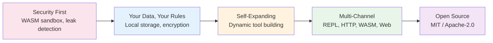

### 1.2 Key Differentiators vs OpenClaw

| Dimension | OpenClaw | IronClaw |
|-----------|----------|----------|
| **Language** | TypeScript (Node.js) | Rust |
| **Database** | SQLite + LanceDB | PostgreSQL or libSQL/Turso |
| **Sandbox** | Docker/Podman containers | WASM (Wasmtime) + Docker containers |
| **Security Model** | Extension trust via code review | Capability-based, credential injection, leak detection |
| **Extension System** | npm packages + plugin SDK | WASM modules + MCP servers + channel relays |
| **Vector Search** | LanceDB (separate process) | pgvector or libSQL native vectors |
| **LLM Providers** | Multi-provider via adapters | 10+ providers with circuit breaker, failover, smart routing |
| **Agent Architecture** | Single agent loop | Unified Thread/Step/Capability model (Reborn engine) |

---

## 2. System Architecture

### 2.1 High-Level Architecture

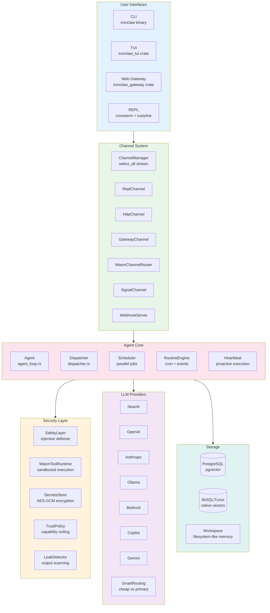

### 2.2 Component Map

```mermaid
graph LR
    subgraph Entry["Entry Points"]
        E1["main.rs<br/>CLI dispatch"]
        E2["async_main<br/>Tokio runtime"]
    end

    subgraph Core["Core Runtime (src/ -- 40+ modules)"]
        G1[agent/<br/>Agent loop + dispatcher]
        G2[channels/<br/>Multi-channel input]
        G3[tools/<br/>Builtin + WASM + MCP]
        G4[extensions/<br/>Discovery + install]
        G5[workspace/<br/>Memory filesystem]
        G6[config/<br/>Configuration]
        G7[sandbox/<br/>Docker execution]
        G8[orchestrator/<br/>Job management]
        G9[secrets/<br/>Credential vault]
        G10[safety/<br/>Injection defense]
        G11[setup/<br/>Onboarding wizard]
        G12[webhooks/<br/>Event hooks]
        G13[history/<br/>Conversation persistence]
        G14[bridge/<br/>ACP agent bridge]
    end

    subgraph Crates["Workspace Crates"]
        C1[ironclaw_llm<br/>10+ providers]
        C2[ironclaw_engine<br/>Reborn engine]
        C3[ironclaw_gateway<br/>Frontend assets]
        C4[ironclaw_safety<br/>Prompt defense]
        C5[ironclaw_embeddings<br/>Vector providers]
        C6[ironclaw_wasm<br/>WIT component runtime]
        C7[ironclaw_mcp<br/>MCP adapter]
        C8[ironclaw_skills<br/>Skill management]
        C9["29 path crates + root"]
    end

    E1 --> Core
    Core --> Crates
```

---

## 3. Crate Topology

IronClaw organizes its codebase into 29 workspace crates with strict dependency ordering. The layering follows a "Reborn" architecture with clear host/service separation.

```mermaid
graph TB
    subgraph Layer0["Layer 0: Foundation"]
        IC[ironclaw_common<br/>shared types, events, identity]
    end

    subgraph Layer1["Layer 1: Host API"]
        IH[ironclaw_host_api<br/>capability descriptors, paths, mounts]
    end

    subgraph Layer2["Layer 2: Service Crates"]
        direction LR
        IF[ironclaw_filesystem<br/>scoped FS service]
        IM[ironclaw_memory<br/>memory document adapters]
        IP[ironclaw_processes<br/>background process lifecycle]
        IE[ironclaw_events<br/>event sink infrastructure]
        IR[ironclaw_resources<br/>reservation governor]
        IN[ironclaw_network<br/>HTTP egress policy]
        IS[ironclaw_secrets<br/>tenant-scoped secret store]
        IT[ironclaw_trust<br/>trust-class policy engine]
        IAP[ironclaw_approvals<br/>approval workflows]
        IA[ironclaw_authorization<br/>authorization decisions]
        IRS[ironclaw_run_state<br/>run state transitions]
    end

    subgraph Layer3["Layer 3: Composition Crates"]
        direction LR
        ICAP[ironclaw_capabilities<br/>invocation host]
        ID[ironclaw_dispatcher<br/>runtime dispatch]
        IHR[ironclaw_host_runtime<br/>host runtime facade]
        IW[ironclaw_wasm<br/>WIT component runtime]
        IMCP[ironclaw_mcp<br/>MCP adapter]
        IEXT[ironclaw_extensions<br/>extension registry]
    end

    subgraph Layer4["Layer 4: Domain Crates"]
        direction LR
        ILM[ironclaw_llm<br/>multi-provider LLM]
        IEMB[ironclaw_embeddings<br/>vector providers]
        ISK[ironclaw_skills<br/>skill management]
        ISA[ironclaw_safety<br/>prompt defense]
        IG[ironclaw_gateway<br/>frontend assets]
        IE2[ironclaw_engine<br/>Reborn execution engine]
        IO[ironclaw_oauth<br/>OAuth flows]
        ISCR[ironclaw_scripts<br/>script runner]
        ITU[ironclaw_tui<br/>terminal UI]
    end

    subgraph TestCrates["Test Crates"]
        IARCH[ironclaw_architecture<br/>contract tests]
    end

    IC --> IH
    IH --> Layer2
    Layer2 --> Layer3
    Layer3 --> Layer4
```

### 3.1 Crate Inventory

| Crate | Purpose | Lines (est.) |
|-------|---------|-------------|
| `ironclaw_common` | Shared types: events, identity, platform, paths | Foundation |
| `ironclaw_host_api` | Capability descriptors, mount views, resource scopes, runtime kinds | API boundary |
| `ironclaw_filesystem` | Scoped filesystem with mount permissions and path validation | Service |
| `ironclaw_memory` | Memory document filesystem adapters with tenant/user/project scoping | Service |
| `ironclaw_processes` | Background process lifecycle: store, executor, cancellation, host | Service |
| `ironclaw_events` | Event sink infrastructure | Service |
| `ironclaw_resources` | Resource reservation governor (reserve → execute → reconcile) | Service |
| `ironclaw_network` | Network policy evaluation, DNS resolution, HTTP egress transport | Service |
| `ironclaw_secrets` | Tenant-scoped secret store with AES-GCM encryption, one-shot leases | Service |
| `ironclaw_trust` | Trust-class policy engine with invalidation bus | Service |
| `ironclaw_approvals` | Approval workflow management | Service |
| `ironclaw_authorization` | Authorization decision engine | Service |
| `ironclaw_run_state` | Run state transition management | Service |
| `ironclaw_capabilities` | Capability invocation host (authorization + approval + dispatch) | Composition |
| `ironclaw_dispatcher` | Runtime dispatch wiring (extensions → runtime lanes) | Composition |
| `ironclaw_host_runtime` | Host runtime facade (secret injection, egress, policy) | Composition |
| `ironclaw_wasm` | WIT component model runtime (Wasmtime 43) | Runtime |
| `ironclaw_mcp` | MCP server adapter (manifest → capabilities) | Runtime |
| `ironclaw_extensions` | Extension discovery, registry, lifecycle management | Runtime |
| `ironclaw_llm` | 10+ LLM providers with circuit breaker, failover, smart routing | Domain |
| `ironclaw_embeddings` | Multi-provider vector embeddings (OpenAI, NearAI, Ollama, Bedrock) | Domain |
| `ironclaw_skills` | Skill parsing, selection, gating, trust management | Domain |
| `ironclaw_safety` | Prompt injection defense, leak detection, credential scanning | Domain |
| `ironclaw_gateway` | Frontend assets, layout, widget system | Domain |
| `ironclaw_engine` | Reborn execution engine: Thread/Step/Capability/MemoryDoc/Project | Domain |
| `ironclaw_oauth` | OAuth 2.0 flows for tool authentication | Domain |
| `ironclaw_scripts` | Script runner for CLI capabilities via host-selected backend | Domain |
| `ironclaw_tui` | Terminal UI (feature-gated) | Domain |
| `ironclaw_architecture` | Workspace architecture contract tests (no production deps) | Test |

---

## 4. Agent Subsystem

The agent subsystem is the most complex part of IronClaw, managing conversations, tool execution, parallel jobs, and background automation.

### 4.1 Session / Thread / Turn Model

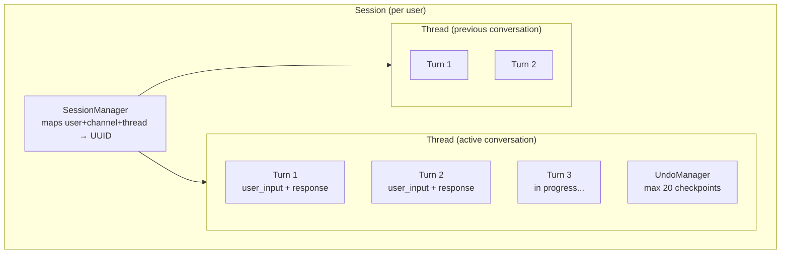

**Key properties:**
- A session has one active thread at a time; threads can be switched
- Turns are append-only; undo restores from checkpoint (message list, not full snapshot)
- Group chat detection: `MEMORY.md` excluded from system prompt in group contexts
- Auth mode: `pending_auth` intercepts messages for credential flows
- Session pruning: idle sessions pruned every 10 minutes (warns at 1000)

### 4.2 Agentic Loop Architecture

All three execution paths use a shared `run_agentic_loop()` engine via the `LoopDelegate` trait:

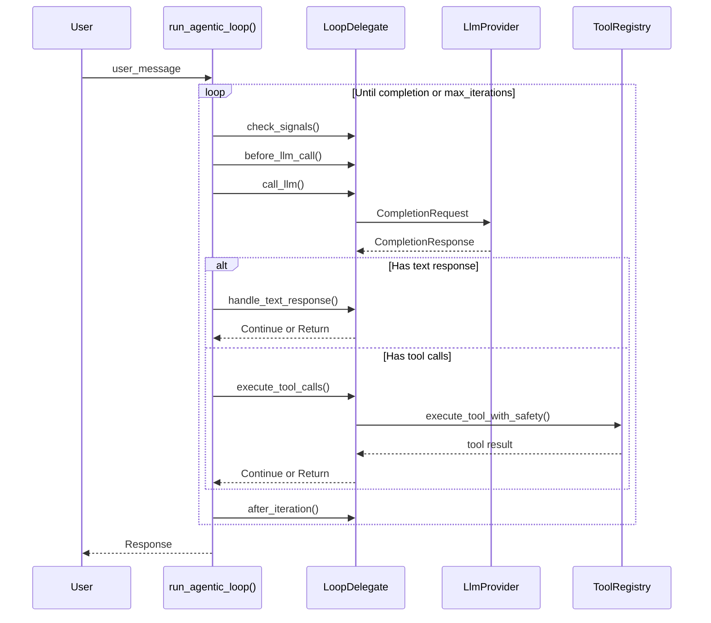

**Three delegate implementations:**

| Delegate | Context | Features |
|----------|---------|----------|
| `ChatDelegate` | User-initiated conversational turns | Session lock, turn tracking, tool approval |
| `JobDelegate` | Background scheduler jobs | Planning support, completion detection |
| `ContainerDelegate` | Docker container worker | Sequential tool exec, HTTP event streaming |

### 4.3 Command Routing

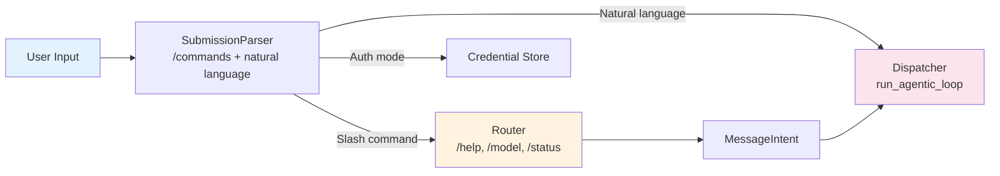

### 4.4 Agent Module File Map

| File | Role |
|------|------|
| `agent_loop.rs` | `Agent` struct, `AgentDeps`, main `run()` event loop |
| `dispatcher.rs` | Agentic loop for conversational turns: LLM → tool → repeat |
| `agentic_loop.rs` | Shared loop engine: `run_agentic_loop()`, `LoopDelegate` trait |
| `thread_ops.rs` | Thread/session operations: `process_user_input`, undo, approval |
| `commands.rs` | System commands (`/help`, `/model`, `/status`, `/skills`) |
| `session.rs` | Data model: `Session` → `Thread` → `Turn` |
| `session_manager.rs` | Lifecycle: create/lookup sessions, map external IDs |
| `router.rs` | Routes `/commands` to `MessageIntent` |
| `scheduler.rs` | Parallel job scheduling (jobs map + subtasks map) |
| `compaction.rs` | Context window management: 3 strategies with usage thresholds |
| `context_monitor.rs` | Memory pressure detection, compaction strategy suggestion |
| `self_repair.rs` | Detects stuck jobs and broken tools, attempts recovery |
| `heartbeat.rs` | Proactive periodic execution from `HEARTBEAT.md` |
| `routine.rs` | `Routine` types: Trigger (cron/event/manual) + Action |
| `routine_engine.rs` | Cron ticker and event matcher |
| `cost_guard.rs` | LLM spend and action-rate enforcement (`CostGuardConfig`: daily budget in cents + hourly call rate) |
| `undo.rs` | Turn-based undo/redo with checkpoints |

---

## 5. The Reborn Engine

The Reborn engine (`ironclaw_engine`) is IronClaw's next-generation execution model, unifying ~10 separate abstractions around 5 core primitives.

### 5.1 Five Core Primitives

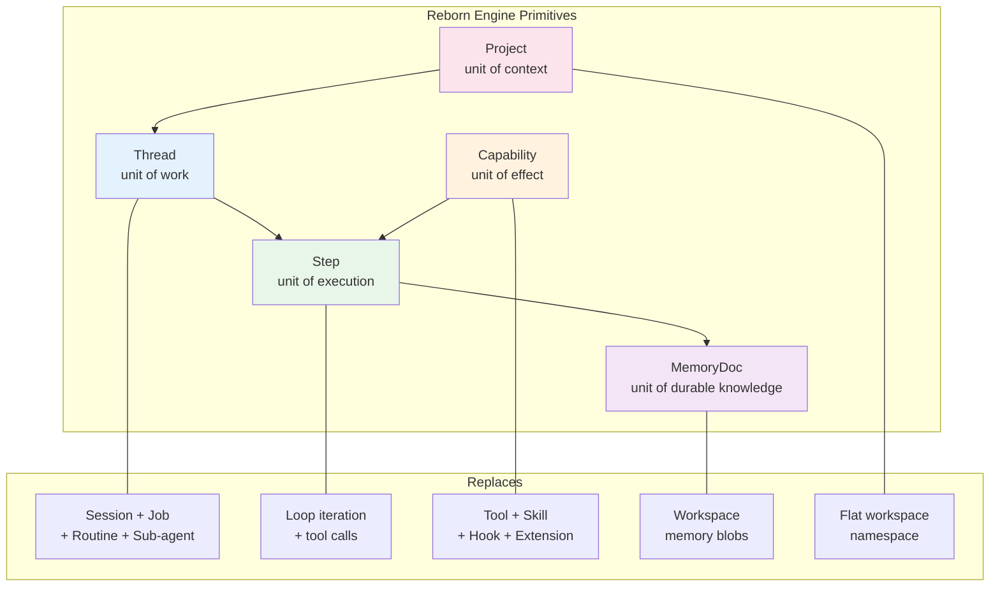

### 5.2 Thread State Machine

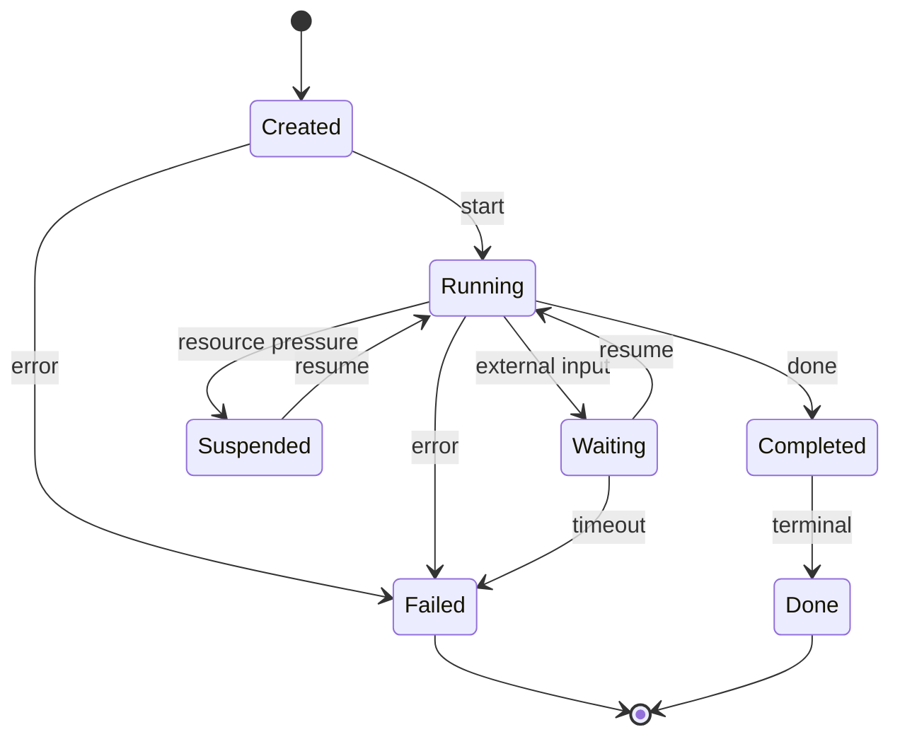

### 5.3 Capability Model

Capabilities are the unit of effect, bundling actions (tools), knowledge (skills), and policies (hooks):

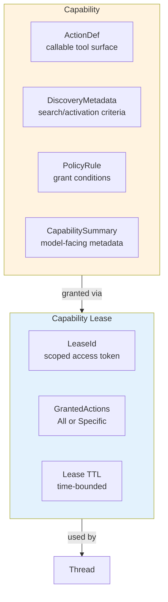

### 5.4 Execution Gate System

All pre-execution checks are expressed as composable `ExecutionGate` implementations:

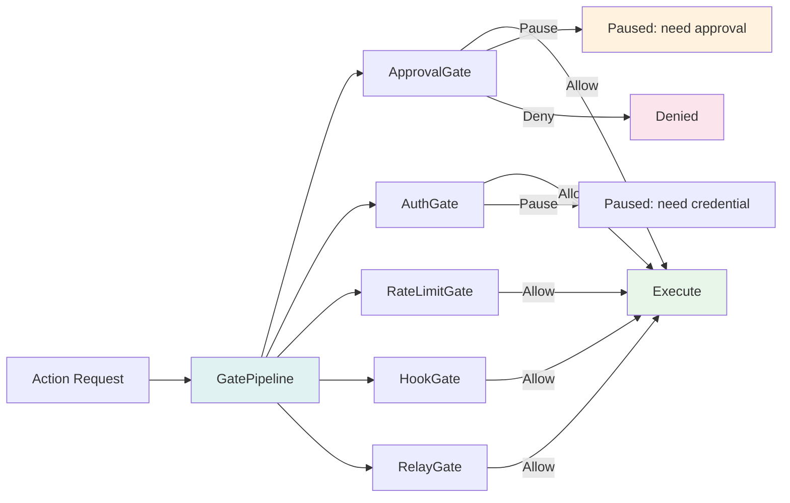

**Gate decisions are fail-closed by construction** — no `None` variant exists in `GateDecision`.

**Resume kinds:**
- `Approval` — user approves/denies tool invocation
- `Authentication` — user provides missing credential (token, API key, OAuth)
- `External` — webhook confirmation from external system

---

## 6. Multi-Provider LLM Layer

IronClaw supports 10+ LLM providers with enterprise-grade resilience patterns.

### 6.1 Provider Ecosystem

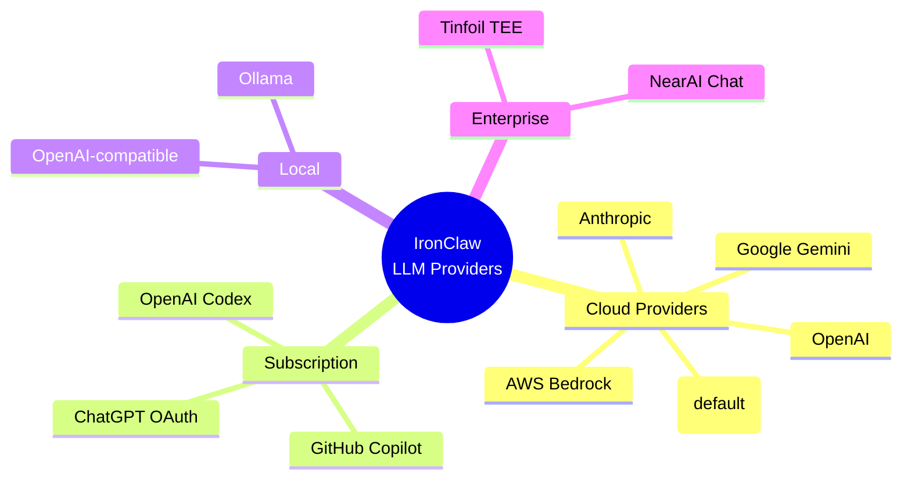

### 6.2 Provider Chain Architecture

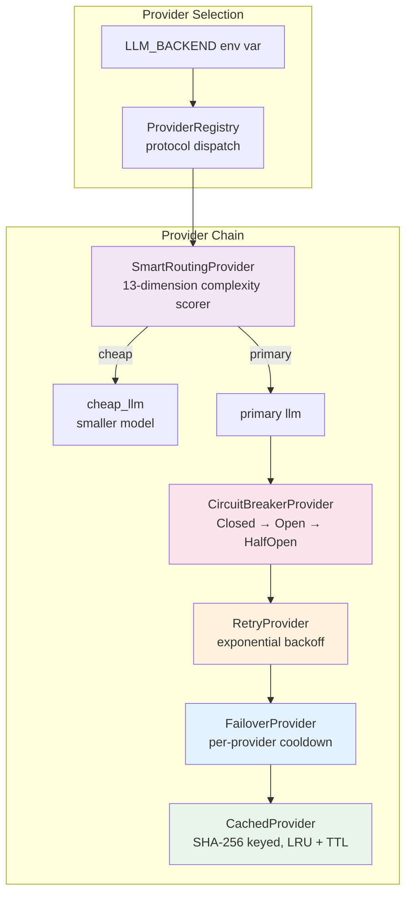

### 6.3 Provider Details

| Provider | Backend Key | Auth | Notes |
|----------|-------------|------|-------|
| NEAR AI | `nearai` (default) | Session token or API key | Auto-pricing fetch, tool message flattening |
| OpenAI | `openai` | `OPENAI_API_KEY` | Via `RigAdapter` |
| Anthropic | `anthropic` | `ANTHROPIC_API_KEY` or OAuth | Claude.ai subscription via OAuth |
| Ollama | `ollama` | None (local) | `OLLAMA_BASE_URL` |
| OpenAI-compatible | `openai_compatible` | `LLM_BASE_URL` + `LLM_API_KEY` | Any endpoint |
| AWS Bedrock | `bedrock` | AWS credential chain | Feature-gated, native Converse API |
| GitHub Copilot | `github_copilot` | Device code flow | Two-step auth, VS Code headers |
| OpenAI Codex | `openai_codex` | ChatGPT OAuth | Private `/backend-api/codex` endpoint |
| Gemini OAuth | `gemini_oauth` | Cloud OAuth | `generativelanguage.googleapis.com` |
| Tinfoil TEE | `tinfoil` | `TINFOIL_API_KEY` | Trusted execution environment |
| Anthropic OAuth | `anthropic_oauth` | OAuth browser flow | Claude.ai subscription via OAuth |

### 6.4 Circuit Breaker State Machine

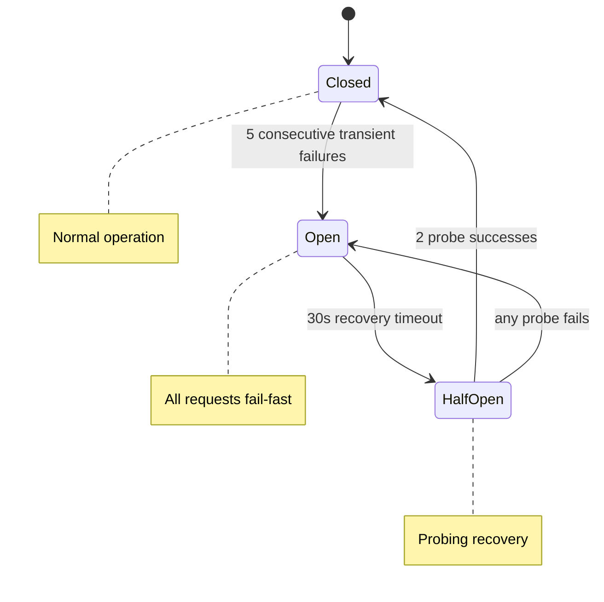

**Transient vs non-transient errors:**
- Transient (count toward threshold): `RequestFailed`, `RateLimited`, `InvalidResponse`, `SessionExpired`, `Http`, `Io`
- Non-transient (never trip breaker): `AuthFailed`, `ContextLengthExceeded`, `ModelNotAvailable`, `Json`

### 6.5 Smart Routing

`SmartRoutingProvider` evaluates 13 complexity dimensions to route requests between a cheap (fast/small) model and the primary (capable) model:

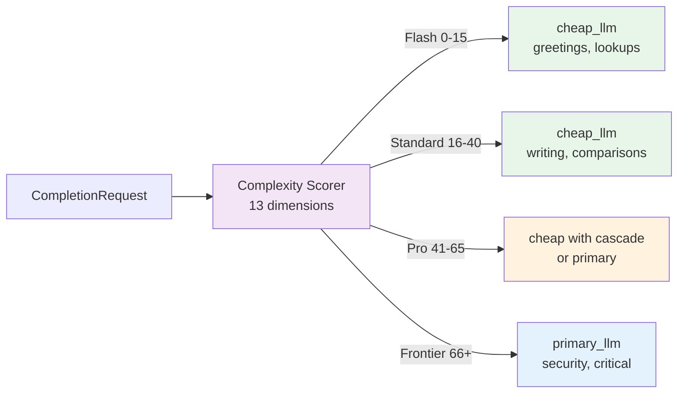

**Complexity tiers:**

| Tier | Score Range | Routing | Examples |
|------|-------------|---------|----------|
| Flash | 0-15 | cheap_llm | Greetings, quick lookups |
| Standard | 16-40 | cheap_llm | Writing, comparisons |
| Pro | 41-65 | cheap with cascade or primary | Multi-step analysis, code review |
| Frontier | 66+ | primary_llm | Security audits, critical decisions |

Pattern overrides provide fast-path routing for obvious cases (greetings -> cheap, security audits -> primary).

---

## 7. Security Model

IronClaw's security model is defense-in-depth, with multiple independent layers.

### 7.1 Security Architecture Overview

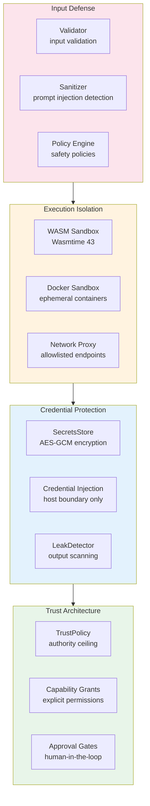

### 7.2 Threat Mitigation Matrix

| Threat | Layer | Mitigation |
|--------|-------|------------|
| Prompt injection | SafetyLayer | Pattern detection, content sanitization, policy enforcement |
| CPU exhaustion (WASM) | WasmToolRuntime | Fuel metering via Wasmtime |
| Memory exhaustion (WASM) | WasmToolRuntime | ResourceLimiter, 10MB default |
| Infinite loops (WASM) | WasmToolRuntime | Epoch interruption + tokio timeout |
| Filesystem access (WASM) | WasmToolRuntime | No WASI FS, only host workspace_read |
| Network access (WASM) | WasmToolRuntime | Allowlisted endpoints only |
| Credential exposure | CredentialInjector | Injection at host boundary only |
| Secret exfiltration | LeakDetector | Scans all outputs before returning to LLM |
| Path traversal | WasmToolRuntime | Validates paths (no `..`, no `/` prefix) |
| WASM tampering | WasmToolRuntime | BLAKE3 hash verification on load |
| Rate abuse | RateLimiter | Per-tool rate limiting |
| Log spam | WasmToolRuntime | Max 1000 entries, 4KB per message |
| Network egress | ironclaw_network | DNS resolution, private target rejection |
| Trust escalation | ironclaw_trust | Host-only trust class construction |

### 7.3 WASM Sandbox Architecture

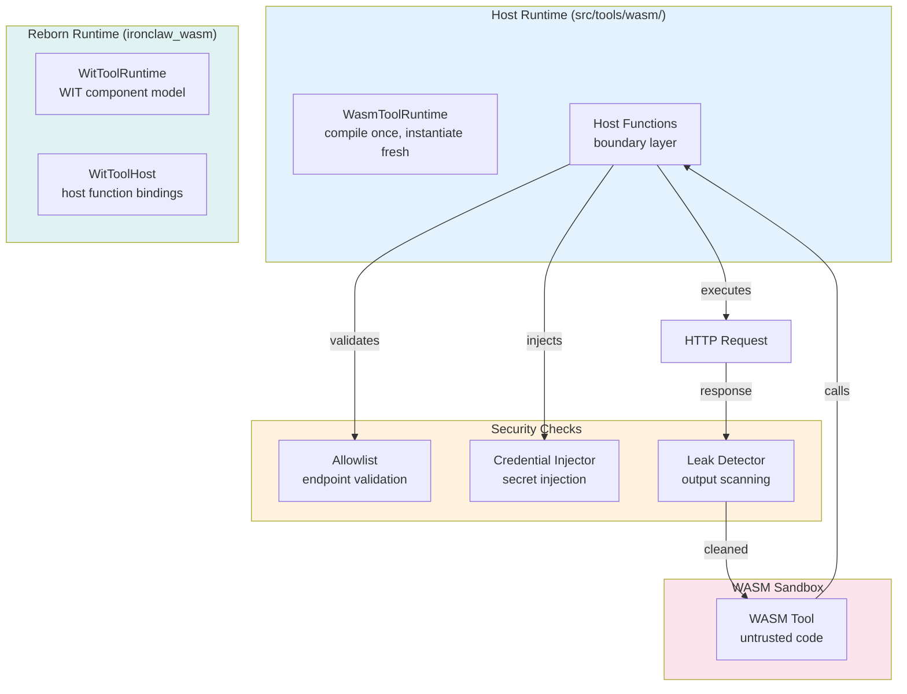

**Note:** IronClaw has two WASM runtimes: the legacy `WasmToolRuntime` (`src/tools/wasm/`) and the Reborn `WitToolRuntime` (`ironclaw_wasm` crate) using the WIT component model. Both share the same security architecture.

**Execution flow:**
1. WASM tool calls host function
2. Allowlist validates endpoint is permitted
3. Credential injector adds auth headers (tool never sees the token)
4. Request executes
5. Leak detector scans response for secret leakage
6. Cleaned output returned to tool

### 7.4 Trust Class System

The `ironclaw_trust` crate enforces a trust-class policy where:

- `FirstParty` and `System` trust classes are constructible only from inside the crate
- User-installed manifests cannot fabricate privileged ceilings
- Trust is an authority **ceiling**, not a grant
- Trust changes invalidate active grants via `InvalidationBus`

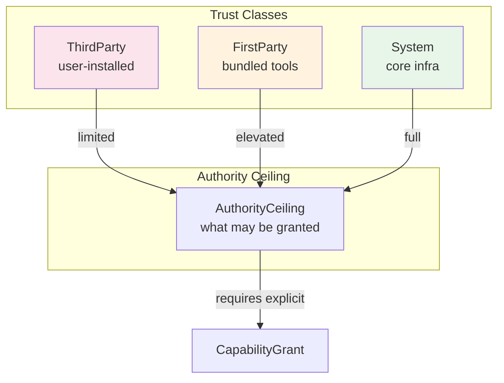

---

## 8. Channel System

### 8.1 Channel Architecture

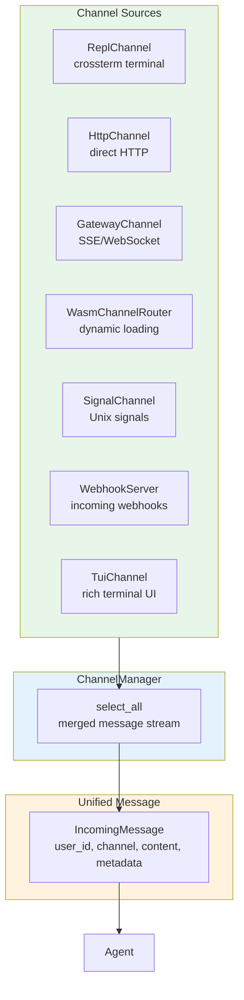

### 8.2 Channel Properties

All channels implement the `Channel` trait and produce `IncomingMessage` with:
- `user_id` — unique user identifier
- `channel` — channel type string
- `content` — message text
- `metadata` — attachments, thread info, group context
- `attachments` — inline file attachments (max 10, max 10MB each)

---

## 9. Extension System

### 9.1 Extension Kinds

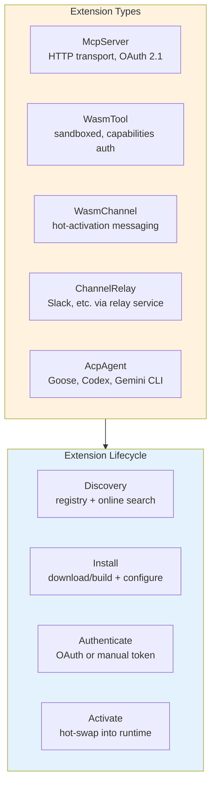

### 9.2 Extension Discovery Flow

```mermaid
sequenceDiagram
    participant User
    participant Agent
    participant EM as ExtensionManager
    participant Reg as Registry
    participant Online as OnlineDiscovery

    User->>Agent: "add telegram"
    Agent->>EM: tool_search("telegram")
    EM->>Reg: search local registry
    Reg-->>EM: found WasmChannel
    EM->>Agent: tool_install("telegram")
    Agent->>EM: install
    EM->>EM: download + validate + configure
    EM->>Agent: authenticate (OAuth flow)
    Agent->>User: "Open this URL to authenticate"
    User-->>Agent: OAuth callback
    EM->>Agent: activated

    Note over Agent: New channel is hot-swapped<br/>into ChannelManager
```

### 9.3 Tool Authentication

Tools declare auth requirements in `capabilities.json`:

**OAuth (browser-based):**
```json
{
  "auth": {
    "secret_name": "notion_api_token",
    "oauth": {
      "authorization_url": "https://api.notion.com/v1/oauth/authorize",
      "token_url": "https://api.notion.com/v1/oauth/token",
      "client_id_env": "NOTION_OAUTH_CLIENT_ID",
      "client_secret_env": "NOTION_OAUTH_CLIENT_SECRET"
    }
  }
}
```

**Auth flow priority:** env_var → OAuth → manual token entry

---

## 10. Memory & Workspace System

### 10.1 Workspace Structure

```mermaid
graph TB
    subgraph Workspace["Workspace (filesystem-like)"]
        ROOT["README.md<br/>Root runbook"]
        MEM["MEMORY.md<br/>Long-term curated memory"]
        HB["HEARTBEAT.md<br/>Periodic checklist"]
        ID["IDENTITY.md<br/>Agent name, nature"]
        SOUL["SOUL.md<br/>Core values"]
        USER["USER.md<br/>User context"]
        
        subgraph Dirs["Directories"]
            CTX["context/<br/>Identity docs"]
            DLY["daily/<br/>Daily logs"]
            PRJ["projects/<br/>Arbitrary structure"]
            SYS[".system/<br/>Settings"]
        end
    end

    subgraph Search["Hybrid Search"]
        FTS["FTS (keyword)<br/>PostgreSQL tsvector / FTS5"]
        VEC["Vector (semantic)<br/>pgvector / libSQL vectors"]
        RRF["Reciprocal Rank Fusion<br/>merged results"]
    end

    Workspace --> Search
    FTS --> RRF
    VEC --> RRF

    style Workspace fill:#e3f2fd
    style Search fill:#fff3e0
```

### 10.2 Memory Document Model (Reborn)

In the Reborn engine, memory is modeled as `MemoryDoc` primitives:

```mermaid
graph LR
    subgraph Scope["MemoryDocumentScope"]
        TI[tenant_id]
        UI[user_id]
        AI[agent_id]
        PI[project_id]
    end

    subgraph Doc["MemoryDoc"]
        DI[DocId<br/>unique identifier]
        DT[DocType<br/>category]
        CT[Content<br/>text + metadata]
    end

    Scope --> Doc

    style Scope fill:#e0f2f1
    style Doc fill:#f3e5f5
```

### 10.3 Embedding Providers

| Provider | Use Case | Auth |
|----------|----------|------|
| OpenAI | `text-embedding-3-small` | API key |
| NEAR AI | NearAI embeddings | Session token |
| Ollama | Local embeddings | None |
| AWS Bedrock | Titan embeddings | AWS credentials |

All providers are wrapped with `CachedEmbeddingProvider` for LRU + TTL caching.

---

## 11. Database Layer

IronClaw supports dual database backends with a trait-based abstraction.

### 11.1 Database Trait Hierarchy

```mermaid
graph TB
    DB["Database<br/>supertrait (~146 async methods)"]
    
    DB --> CS["ConversationStore<br/>12 methods"]
    DB --> JS["JobStore<br/>13 methods"]
    DB --> SB["SandboxStore<br/>13 methods"]
    DB --> RS["RoutineStore<br/>15 methods"]
    DB --> TFS["ToolFailureStore<br/>4 methods"]
    DB --> SS["SettingsStore<br/>8 methods"]
    DB --> WS["WorkspaceStore<br/>13 methods"]
    DB --> RM["run_migrations()"]

    style DB fill:#e3f2fd
    style CS fill:#e8f5e9
    style JS fill:#fff3e0
    style SB fill:#fce4ec
    style RS fill:#f3e5f5
    style TFS fill:#e0f2f1
    style SS fill:#fff3e0
    style WS fill:#e3f2fd
```

### 11.2 Database Sub-Traits

| Sub-trait | Methods | Covers |
|-----------|---------|--------|
| `ConversationStore` | 12 | Conversations, messages |
| `JobStore` | 13 | Agent jobs, actions, LLM calls, estimation |
| `SandboxStore` | 13 | Sandbox jobs, job events |
| `RoutineStore` | 15 | Routines, routine runs |
| `ToolFailureStore` | 4 | Self-repair tracking |
| `SettingsStore` | 8 | Per-user key-value settings |
| `WorkspaceStore` | 13 | Memory documents, chunks, hybrid search |
| `UserStore` | — | User account management |
| `ChannelPairingStore` | — | Channel pairing/ownership |
| `IdentityStore` | — | Identity management |

`Database` adds `run_migrations()` and combines all sub-traits. Leaf consumers depend on the narrowest sub-trait they need.

### 11.3 SQL Dialect Differences

| Feature | PostgreSQL | libSQL |
|---------|-----------|--------|
| UUIDs | `UUID` type | `TEXT` |
| Timestamps | `TIMESTAMPTZ` | `TEXT` (ISO-8601) |
| JSON | `JSONB` | `TEXT` |
| Vectors | `VECTOR` (any dim) | `F32_BLOB(N)` |
| Full-text search | `tsvector` + `ts_rank_cd` | FTS5 + sync triggers |
| Booleans | `BOOLEAN` | `INTEGER` (0/1) |
| Arrays | `TEXT[]` | `TEXT` (JSON-encoded) |

### 11.4 Migrations

- **PostgreSQL**: Refinery-managed `V1__initial.sql` through `V27__root_filesystem_entries_directories.sql` (27 migrations)
- **libSQL**: `INCREMENTAL_MIGRATIONS` in `libsql_migrations.rs` (CREATE IF NOT EXISTS, no ALTER TABLE)

---

## 12. Sandbox System

### 12.1 Docker Sandbox Architecture

```mermaid
graph TB
    subgraph Sandbox["Sandbox System"]
        SM["SandboxManager<br/>coordinates execution"]
        
        subgraph Container["Container Runner"]
            CR["Create container"]
            CE["Execute command"]
            CC["Cleanup"]
        end
        
        subgraph Proxy["Network Proxy"]
            NP["Endpoint Allowlist"]
            CI["Credential Injection"]
            NL["Request Logging"]
        end
    end

    SM --> Container
    SM --> Proxy
    Container <-->|"bidirectional"| Proxy

    subgraph Policies["Sandbox Policies"]
        RO["ReadOnly<br/>read workspace, proxied net"]
        WW["WorkspaceWrite<br/>read/write workspace, proxied net"]
        FA["FullAccess<br/>full host, no sandbox"]
    end

    SM --> Policies

    style Sandbox fill:#e3f2fd
    style Proxy fill:#fff3e0
    style Policies fill:#e8f5e9
```

### 12.2 Sandbox Properties

| Policy | Filesystem | Network | Use Case |
|--------|------------|---------|----------|
| `ReadOnly` | Read workspace | Proxied | Explore code, fetch docs |
| `WorkspaceWrite` | Read/write workspace | Proxied | Build software, run tests |
| `FullAccess` | Full host | Full | Direct execution |

---

## 13. Gateway & Frontend

### 13.1 Gateway Architecture

The `ironclaw_gateway` crate owns the complete frontend served by the web gateway:

```mermaid
graph TB
    subgraph Gateway["ironclaw_gateway"]
        Assets["Embedded Assets<br/>HTML, JS, CSS, i18n"]
        Layout["Layout Config<br/>branding, tabs, features"]
        Widget["Widget System<br/>self-contained components"]
        Bundle["Bundle Assembly<br/>base + workspace customizations"]
    end

    subgraph WebAPI["Web API"]
        SSE["SSE Streaming<br/>real-time events"]
        WS["WebSocket<br/>bidirectional"]
        REST["REST API<br/>OpenAI-compatible"]
        OA["OpenAI Compat<br/>/v1/chat/completions"]
    end

    Gateway --> WebAPI

    style Gateway fill:#e3f2fd
    style WebAPI fill:#e8f5e9
```

### 13.2 Widget System

Widgets are self-contained frontend components that plug into named UI slots:
- Declared via `WidgetManifest` (JSON)
- Scoped CSS via `scope_css()`
- Nonce-based CSP for inline scripts
- Customizable per-tenant via workspace configuration

---

## 14. Skills System

### 14.1 Skill Architecture

```mermaid
graph TB
    subgraph Skills["Skill System"]
        MD["SKILL.md Files<br/>YAML frontmatter + markdown"]
        Parser["Skill Parser<br/>parse_skill_md()"]
        Types["SkillManifest<br/>metadata + criteria"]
        Selector["Skill Selector<br/>scoring + filtering"]
    end

    subgraph Trust["Skill Trust"]
        T1["Trusted<br/>user-placed, full tool access"]
        T2["Installed<br/>registry/external, read-only"]
    end

    subgraph V2Engine["V2 Engine"]
        PY["Python Orchestrator<br/>score_skill()"]
        MD2["MemoryDocs<br/>skill storage"]
        PE["Policy Engine<br/>capability leases"]
    end

    Skills --> Trust
    Trust --> V2Engine

    style Skills fill:#fff3e0
    style Trust fill:#fce4ec
    style V2Engine fill:#e3f2fd
```

### 14.2 V1 vs V2 Skill Processing

| Aspect | V1 (Rust agent) | V2 (Reborn engine) |
|--------|-----------------|-------------------|
| Selection | Rust `prefilter_skills()` | Python `orchestrator/default.py:score_skill()` |
| Storage | Filesystem discovery | MemoryDocs in Store |
| Trust filtering | `src/skills/attenuation.rs` | Policy engine capability leases |
| Gating | Binary/env checks at load time | Not applicable (runtime) |

---

## 15. Orchestration & Scheduling

### 15.1 Job Scheduling

```mermaid
graph TB
    subgraph Scheduler["Scheduler"]
        JM["jobs map<br/>full LLM-driven"]
        SM["subtasks map<br/>tool-exec/background"]
        BL["spawn_batch<br/>parallel execution"]
    end

    subgraph Jobs["Job Types"]
        J1["Job<br/>full LLM-driven background work"]
        J2["ToolExec<br/>single tool execution"]
        J3["Background<br/>long-running process"]
    end

    subgraph Routine["Routine Engine"]
        RT["Routine Types"]
        RT --> Cron["Cron trigger"]
        RT --> Event["Event trigger"]
        RT --> Manual["Manual trigger"]
        RT --> System["System event"]
    end

    Scheduler --> Jobs
    Routine --> Scheduler

    style Scheduler fill:#e3f2fd
    style Jobs fill:#e8f5e9
    style Routine fill:#fff3e0
```

### 15.2 Heartbeat System

The heartbeat system provides proactive background execution:
- Reads `HEARTBEAT.md` from workspace
- Executes checklist items periodically
- Notifies via channel if findings are discovered
- Enables monitoring and maintenance automation

### 15.3 Self-Repair

`self_repair.rs` monitors for:
- Stuck jobs (jobs that haven't progressed)
- Broken tools (tools that consistently fail)
- Automatic recovery attempts

---

## 16. Codebase Analysis

### 16.1 Language & Structure

| Metric | Value |
|--------|-------|
| **Primary Language** | Rust (edition 2024) |
| **Minimum Rust Version** | 1.92 |
| **Workspace Crates** | 29 path crates + root |
| **Total Files** | 1,694 |
| **Code Chunks** | 46,498 |
| **Database Backends** | 2 (PostgreSQL, libSQL) |
| **LLM Providers** | 10+ |
| **Embedding Providers** | 4 (OpenAI, NearAI, Ollama, Bedrock) |
| **WASM Runtime** | Wasmtime 43 (component model) |

### 16.2 Feature Flags

| Feature | Default | Description |
|---------|---------|-------------|
| `postgres` | Yes | PostgreSQL + pgvector |
| `libsql` | Yes | libSQL/Turso embedded |
| `html-to-markdown` | Yes | Document conversion |
| `tui` | Yes | Terminal UI |
| `bedrock` | No | AWS Bedrock LLM + embeddings |
| `integration` | No | Heavy integration tests |
| `replay` | No | Replay-gate snapshot tests |
| `import` | No | OpenClaw import support |

### 16.3 Key Dependencies

| Dependency | Purpose |
|-----------|---------|
| `tokio` | Async runtime (full features) |
| `axum` | HTTP framework (WebSocket support) |
| `wasmtime` | WASM sandbox (component model) |
| `rig-core` | Multi-provider LLM abstraction |
| `reqwest` | HTTP client (rustls TLS) |
| `serde` / `serde_json` | Serialization |
| `clap` | CLI argument parsing |
| `tracing` | Structured logging |
| `aes-gcm` | Secrets encryption |
| `pgvector` | PostgreSQL vector support |
| `libsql` | Embedded SQL database |
| `deadpool-postgres` | PostgreSQL connection pool |
| `bollard` | Docker API client |
| `crossterm` | Terminal manipulation |
| `chrono` | Date/time handling |
| `uuid` | Unique identifiers |
| `rust_decimal` | Precise numeric arithmetic |
| `secrecy` | Secret value wrapping |
| `ed25519-dalek` | Cryptographic signatures |
| `agent-client-protocol` | ACP standard communication |

### 16.4 Excluded from Workspace

The workspace excludes several companion projects:

| Path | Description |
|------|-------------|
| `channels-src/*` | Channel implementations (Discord, Telegram, Slack, WeChat, WhatsApp, Feishu) |
| `tools-src/*` | Tool implementations (GitHub, Gmail, Google Calendar/Docs/Drive/Sheets/Slides, Slack, Telegram) |
| `crates/ironclaw_silk_decoder` | Silk decoder crate |
| `fuzz/` | Fuzz testing harnesses |

---

## 17. Data Flow Diagrams

### 17.1 User Message Processing

```mermaid
sequenceDiagram
    participant User
    participant Channel as ChannelManager
    participant Agent as Agent
    participant Safety as SafetyLayer
    participant LLM as LlmProvider
    participant Tools as ToolRegistry
    participant DB as Database

    User->>Channel: message (any channel)
    Channel->>Agent: IncomingMessage

    Agent->>Agent: SubmissionParser.parse()
    Agent->>Agent: Router.route() (if slash command)
    Agent->>Agent: process_user_input()

    Agent->>Safety: validate input
    Safety-->>Agent: ValidationResult

    loop Agentic Loop
        Agent->>LLM: CompletionRequest
        LLM-->>Agent: CompletionResponse

        alt Tool calls
            Agent->>Safety: validate tool
            Agent->>Tools: execute_tool_with_safety()
            
            alt WASM tool
                Tools->>Tools: WASM sandbox execution
            else MCP tool
                Tools->>Tools: MCP server call
            else Builtin tool
                Tools->>Tools: Direct execution
            end

            Tools-->>Agent: tool result
            Agent->>Safety: sanitize output
            Safety-->>Agent: SanitizedOutput
        end
    end

    Agent->>DB: save conversation
    Agent->>Channel: OutgoingResponse
    Channel->>User: response
```

### 17.2 Extension Installation Flow

```mermaid
sequenceDiagram
    participant User
    participant Agent
    participant EM as ExtensionManager
    participant Reg as ExtensionRegistry
    participant DL as Download/Build
    participant Auth as OAuth/Token

    User->>Agent: "install github tool"
    Agent->>EM: search("github")
    EM->>Reg: lookup
    Reg-->>EM: RegistryEntry (WasmTool)

    Agent->>EM: install("github")
    EM->>DL: download .wasm binary
    DL-->>EM: wasm bytes

    EM->>EM: validate BLAKE3 hash
    EM->>EM: compile Wasmtime module

    EM->>Agent: needs authentication
    Agent->>User: "Please authenticate"
    Agent->>Auth: OAuth flow
    Auth-->>Agent: token

    EM->>EM: store secret in SecretsStore
    EM->>EM: register in ToolRegistry
    EM->>Agent: tool available

    Note over Agent: Tool is now callable<br/>in agentic loop
```

### 17.3 Reborn Engine Execution Flow

```mermaid
sequenceDiagram
    participant Trigger as Trigger Source
    participant Engine as Reborn Engine
    participant Thread as Thread
    participant Gate as GatePipeline
    participant Cap as CapabilityHost
    participant LLM as LlmBackend
    participant Effect as EffectExecutor
    participant Store as Store

    Trigger->>Engine: create Thread
    Engine->>Thread: state = Created
    Engine->>Thread: state = Running

    loop Each Step
        Engine->>Store: load context (MemoryDocs, Project)
        Engine->>LLM: LlmCallConfig → LlmOutput
        LLM-->>Engine: response with actions

        alt Action calls
            Engine->>Gate: evaluate action
            Gate->>Cap: invoke capability
            
            alt Needs approval
                Gate-->>Thread: state = Waiting
                Thread-->>Engine: resume after approval
            end

            Cap->>Effect: execute effect
            Effect-->>Cap: result
            Cap-->>Engine: ActionResult
        end

        Engine->>Store: persist Step + MemoryDocs
    end

    Engine->>Thread: state = Completed
    Engine->>Thread: state = Done
```

---

## Appendix A: Environment Variables

| Variable | Purpose | Default |
|----------|---------|---------|
| `LLM_BACKEND` | LLM provider selection | `nearai` |
| `LLM_BASE_URL` | Custom LLM endpoint | — |
| `LLM_API_KEY` | Custom LLM API key | — |
| `LLM_MODEL` | Custom LLM model name | — |
| `NEARAI_SESSION_TOKEN` | NEAR AI session auth | — |
| `NEARAI_API_KEY` | NEAR AI API key auth | — |
| `OPENAI_API_KEY` | OpenAI provider | — |
| `ANTHROPIC_API_KEY` | Anthropic provider | — |
| `BEDROCK_REGION` | AWS Bedrock region | `us-east-1` |
| `BEDROCK_MODEL` | AWS Bedrock model ID | — |
| `GITHUB_COPILOT_TOKEN` | GitHub Copilot auth | — |
| `OLLAMA_BASE_URL` | Ollama endpoint | — |
| `TINFOIL_API_KEY` | Tinfoil TEE inference | — |
| `DATABASE_URL` | PostgreSQL connection | — |
| `SECRETS_MASTER_KEY` | AES-GCM encryption key | — |
| `IRONCLAW_RECORD_TRACE` | E2E replay trace capture | — |
| `LLM_USE_CODEX_AUTH` | Load credentials from Codex CLI auth.json | `false` |
| `CODEX_AUTH_PATH` | Override Codex auth.json path | `~/.codex/auth.json` |
| `OPENAI_CODEX_MODEL` | OpenAI Codex model name | — |
| `OPENAI_CODEX_CLIENT_ID` | OpenAI Codex OAuth client ID | — |
| `OPENAI_CODEX_API_URL` | OpenAI Codex API base URL override | — |
| `GITHUB_COPILOT_MODEL` | GitHub Copilot model override | — |
| `GITHUB_COPILOT_EXTRA_HEADERS` | Additional Copilot request headers | — |

## Appendix B: Workspace Default Files

| File | Purpose |
|------|---------|
| `README.md` | Root runbook/index |
| `MEMORY.md` | Long-term curated memory |
| `HEARTBEAT.md` | Periodic checklist for proactive execution |
| `IDENTITY.md` | Agent name, nature, vibe |
| `SOUL.md` | Core values |
| `AGENTS.md` | Behavior instructions |
| `USER.md` | User context |
| `TOOLS.md` | Environment-specific tool notes |
| `BOOTSTRAP.md` | First-run ritual (deleted after onboarding) |

---

## Summary

IronClaw is a security-first personal AI assistant built in Rust by NEAR AI, with a fundamentally different architecture from its TypeScript-based sibling OpenClaw.

**Key architectural insights:**

1. **Defense-in-depth security** — WASM sandbox (Wasmtime 43), credential injection at host boundary, leak detection on all outputs, capability-based trust model with `InvalidationBus` for real-time grant revocation.

2. **Reborn engine unification** — Five primitives (Thread, Step, Capability, MemoryDoc, Project) replace ~10 separate abstractions. The `ExecutionGate` pipeline enforces fail-closed pre-execution checks with `Pause`/`Allow`/`Deny` outcomes.

3. **Enterprise-grade LLM resilience** — 10+ providers wrapped in circuit breaker (5 failures -> open -> 30s recovery -> half-open -> 2 probes), exponential backoff retry, per-provider cooldown (300s default), and smart routing across 13 complexity dimensions with 4 tiers.

4. **Dual database backends** — PostgreSQL (pgvector) and libSQL/Turso with 146 async methods across 10 sub-traits. WorkspaceStore supports hybrid FTS + vector search via Reciprocal Rank Fusion.

5. **Extension system** — Five extension kinds (McpServer, WasmTool, WasmChannel, ChannelRelay, AcpAgent) with runtime discovery, BLAKE3 hash verification, OAuth/manual auth flows, and hot-activation.

6. **Dual WASM runtimes** — Legacy `WasmToolRuntime` (`src/tools/wasm/`) and Reborn `WitToolRuntime` (`ironclaw_wasm` crate) both share the same security architecture: fuel metering (500M instructions), 10MB memory limit, 60s timeout, epoch interruption backup.

---

*This document was generated from source code analysis using CocoIndex semantic search and direct source inspection. All diagrams use mermaid format. All claims are traceable to source code evidence.*
