# Research: jcode Architecture

**Date:** 2026-06-12
**Status:** v1 — initial pass
**Source:** `/home/mmacedoeu/_w/ai/jcode` (v0.17.2, working tree dirty on `next`)
**Index:** 56 workspace crates, ~321 `.rs` files under `crates/` (~155k LOC), root `src/` adds ~22.5k LOC
**Mermaid:** All 20 diagrams validated with `mermaid-cli` v8, v10, and latest; safe in `bierner.markdown-mermaid` (uses mermaid ~8) and `Markdown Preview Mermaid Support` (uses mermaid ~10). Node labels use `&#60;` / `&#62;` decimal entities for Rust generic angle brackets.

---

## Table of Contents

1. [Project Overview](#1-project-overview)
2. [System Architecture](#2-system-architecture)
3. [Layer Architecture](#3-layer-architecture)
4. [Crate Topology](#4-crate-topology)
5. [Server Architecture](#5-server-architecture)
6. [Wire Protocol](#6-wire-protocol)
7. [Agent Runtime](#7-agent-runtime)
8. [Tool System](#8-tool-system)
9. [Provider System](#9-provider-system)
10. [Memory System](#10-memory-system)
11. [Swarm System](#11-swarm-system)
12. [TUI / Presentation](#12-tui--presentation)
13. [Ambient Mode](#13-ambient-mode)
14. [Selfdev Mode](#14-selfdev-mode)
15. [Desktop App](#15-desktop-app)
16. [Mobile (iOS / Simulator)](#16-mobile-ios--simulator)
17. [Cross-Cutting Concerns](#17-cross-cutting-concerns)
18. [Performance Characteristics](#18-performance-characteristics)
19. [Data Flow Diagrams](#19-data-flow-diagrams)
20. [State Machines](#20-state-machines)
21. [Failure Modes](#21-failure-modes)
22. [Code Reference Summary](#22-code-reference-summary)

---

## 1. Project Overview

jcode is a multi-session, multi-provider, multi-client TUI-first coding agent harness written in Rust. It targets single-binary distribution across Linux, macOS, and Windows with a primary TUI, an optional desktop (Tauri) app, an iOS host, and a CLI surface. The product is positioned as "the next generation coding agent harness" with explicit focus on multi-session workflows, infinite customizability, and performance.

| Property | Value | Evidence |
|----------|-------|----------|
| **Version** | 0.17.2 (working tree dirty on `next`) | `Cargo.toml:3` |
| **Edition** | Rust 2024 | `Cargo.toml:5` |
| **License** | MIT | `LICENSE` |
| **Binaries** | `jcode`, `test_api`, `jcode-harness`, `session_memory_bench`, `mermaid_side_panel_probe`, `tui_bench` | `Cargo.toml:73-97` |
| **Workspace crates** | 56 (root + 55 in `crates/`) | `Cargo.toml:8-67` |
| **Source files (crates)** | 321 `.rs` files | `find crates -name '*.rs' \| wc -l` |
| **LOC (crates, all paths)** | ~155,240 | aggregated `wc -l` |
| **LOC (root `src/`)** | ~22,508 | aggregated `wc -l` |
| **Server modules** | 47 files in `crates/jcode-app-core/src/server/` | `ls crates/jcode-app-core/src/server/ \| wc -l` |
| **Agent submodules** | 14 files in `crates/jcode-app-core/src/agent/` | `ls crates/jcode-app-core/src/agent/` |
| **Tools** | 33 first-class tools in `tool/mod.rs` (40+ including subtool variants) | `crates/jcode-app-core/src/tool/mod.rs:1-34` |
| **Provider impls** | 13 concrete providers behind `MultiProvider` | `grep '^impl Provider for' crates/` |
| **Wire variants** | 134 variants total (Request + ServerEvent) | `crates/jcode-protocol/src/wire.rs` |
| **Default features** | `pdf`, `embeddings` | `Cargo.toml:243` |
| **Allocator** | jemalloc (with tuned `malloc_conf`) under feature; glibc with `M_ARENA_MAX=4` fallback | `src/main.rs:1-47` |
| **TUI** | ratatui 0.30 + crossterm 0.29 + arboard | `Cargo.toml:186-189` |
| **HTTP** | reqwest 0.12 + rustls (aws_lc_rs) + tokio-tungstenite | `Cargo.toml:111-114` |
| **AWS** | `aws-sdk-bedrockruntime` + `aws-sdk-bedrock` + `aws-sdk-sts` | `Cargo.toml:230-236` |

### 1.1 Design Philosophy

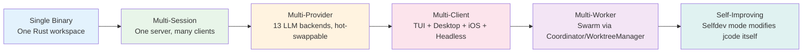
```mermaid
graph LR
    A["Single Binary<br/>One Rust workspace"] --> B["Multi-Session<br/>One server, many clients"]
    B --> C["Multi-Provider<br/>13 LLM backends, hot-swappable"]
    C --> D["Multi-Client<br/>TUI + Desktop + iOS + Headless"]
    D --> E["Multi-Worker<br/>Swarm via Coordinator/WorktreeManager"]
    E --> F["Self-Improving<br/>Selfdev mode modifies jcode itself"]

    style A fill:#e3f2fd
    style B fill:#e8f5e9
    style C fill:#fff3e0
    style D fill:#fce4ec
    style E fill:#f3e5f5
    style F fill:#e0f2f1
```

### 1.2 Key Differentiators

| Dimension | jcode | Notable Peers |
|-----------|-------|---------------|
| **Language** | Rust (single binary, low RSS) | Python/Node (heavier) |
| **Server model** | Single long-lived server, multi-client Unix-socket, hot-reload via `exec` | per-process agents |
| **Providers** | 13 (Anthropic, Claude CLI, OpenAI, OpenRouter, Gemini, Bedrock, Copilot, Cursor, Antigravity, JCode, OpenAI-compatible profiles, …) | 1–3 typical |
| **Tools** | 40+ (file/edit/bash/lsp/mcp/batch/swarm/memory/selfdev/…) | ~10–30 typical |
| **Coordination** | First-class swarm with `Coordinator`/`WorktreeManager` roles and `VersionedPlan` DAG | none / ad-hoc |
| **Self-extension** | `selfdev` mode with a focused prompt set + a `selfdev` tool that can reload via `exec` | none |
| **Ambient mode** | Long-running autonomous cycle with scheduled queue + visible-cycle handoff | none |
| **Memory** | Local ONNX embeddings + memory graph + activity pipeline + journal | none / cloud only |
| **Hot reload** | `/reload` execs the new binary in place; clients auto-reconnect | restart |
| **Desktop** | Tauri-style custom scene engine in `jcode-desktop` | webview wrappers |
| **iOS** | Native iOS host that drives a mobile simulator and embeds the TUI | none |

---

## 2. System Architecture

### 2.1 High-Level Architecture


```mermaid
graph TB
    subgraph Clients["Client Layer (3+ surfaces)"]
        TUI["jcode TUI<br/>ratatui + crossterm<br/>crates/jcode-tui"]
        DESK["Desktop App<br/>jcode-desktop<br/>custom scene engine"]
        IOS["iOS Host<br/>ios/"]
        HEAD["Headless / Harness<br/>test_api, jcode-harness"]
    end

    subgraph IPC["IPC: newline-delimited JSON over Unix socket<br/>~134 Request/ServerEvent variants"]
        MSOCK["Main socket<br/>runtime_dir()/jcode.sock"]
        DSOCK["Debug socket<br/>runtime_dir()/jcode-debug.sock"]
        ASOCK["Agent socket<br/>AI-to-AI (comm)"]
    end

    subgraph Server["Server (jcode serve, detached via setsid)"]
        SR["ServerRuntime<br/>lifecycle + reload + hot-exec"]
        CS["client_session / client_state / client_writer"]
        CC["client_comm (AI-to-AI comm protocol)"]
        SW["swarm / swarm_channels / swarm_persistence"]
        HD["headless (server-driven sessions)"]
        LR["jade_relay (long-poll remote)"]
        RT["reload / reload_state / reload_recovery"]
    end

    subgraph AgentCore["Agent Core (jcode-app-core/src/agent/)"]
        AG["Agent turn loop<br/>turn_execution + turn_loops"]
        ST["Streaming<br/>turn_streaming_broadcast / _mpsc"]
        INT["Interrupts<br/>soft + hard + bg signal"]
        CMP["Compaction<br/>history management"]
        RC["Response recovery<br/>streaming resilience"]
    end

    subgraph ToolLayer["Tool Layer (33+ tools)"]
        TR["Tool Registry<br/>Arc&#60;dyn Tool&#62;"]
        FS["File tools<br/>read/edit/write/multiedit/apply_patch/patch"]
        SH["Shell tools<br/>bash/batch/bg"]
        NET["Network tools<br/>webfetch/websearch/browser"]
        MEM["Memory tool<br/>memory + memory_agent"]
        SWR["Swarm tools<br/>communicate/task/swarm"]
        SD["selfdev tool<br/>in-place modification"]
        MCP["MCP pool<br/>shared across sessions"]
    end

    subgraph Providers["Provider Layer (MultiProvider facade)"]
        MP["MultiProvider<br/>jcode-base/src/provider/mod.rs"]
        PROV["13 concrete Providers<br/>Anthropic/Claude CLI/OpenAI/<br/>OpenRouter/Gemini/Bedrock/<br/>Copilot/Cursor/Antigravity/JCode/<br/>OpenAI-compatible profiles"]
    end

    subgraph Foundation["Foundation (jcode-base, downward-closed)"]
        AUTH["auth (OAuth, account failover)"]
        CFG["config (reload reactions)"]
        SESS["session (persisted on disk)"]
        MSG["message / protocol types"]
        MEMO["memory (graph + journal)"]
        TLM["telemetry / bus / storage"]
    end

    TUI --> MSOCK
    DESK --> MSOCK
    IOS --> MSOCK
    HEAD --> MSOCK
    MSOCK --> SR
    DSOCK --> SR
    ASOCK --> CC
    SR --> CS
    SR --> SW
    SR --> HD
    SR --> LR
    CS --> AgentCore
    CC --> SW
    SW --> AgentCore
    AgentCore --> ToolLayer
    ToolLayer --> Providers
    Providers --> AUTH
    Providers --> CFG
    Server --> Foundation
    ToolLayer --> Foundation
    AgentCore --> Foundation

    style Clients fill:#e3f2fd
    style Server fill:#e8f5e9
    style AgentCore fill:#fff3e0
    style ToolLayer fill:#fce4ec
    style Providers fill:#f3e5f5
    style Foundation fill:#e0f2f1
    style IPC fill:#fff8e1
```

### 2.2 Process Topology

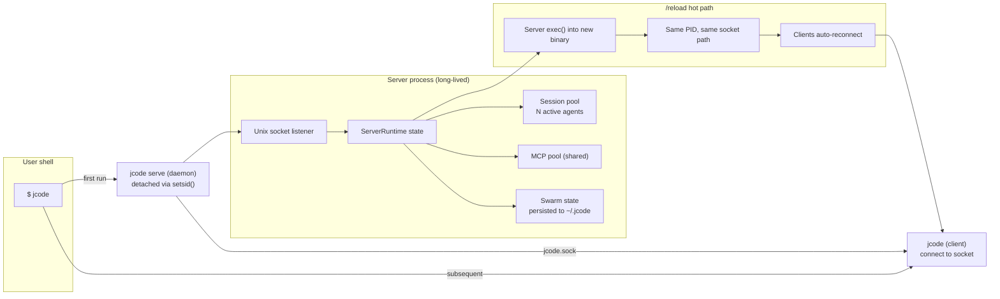
```mermaid
flowchart LR
    subgraph User["User shell"]
        U["$ jcode"]
    end

    U -->|"first run"| S1["jcode serve (daemon)<br/>detached via setsid()"]
    U -->|"subsequent"| S2["jcode (client)<br/>connect to socket"]
    S1 -->|"jcode.sock"| S2

    subgraph Daemon["Server process (long-lived)"]
        D1["Unix socket listener"]
        D2["ServerRuntime state"]
        D3["Session pool<br/>N active agents"]
        D4["MCP pool (shared)"]
        D5["Swarm state<br/>persisted to ~/.jcode"]
    end

    subgraph Reload["/reload hot path"]
        R1["Server exec() into new binary"]
        R2["Same PID, same socket path"]
        R3["Clients auto-reconnect"]
    end

    S1 --> D1
    D1 --> D2
    D2 --> D3
    D2 --> D4
    D2 --> D5
    D2 --> R1
    R1 --> R2
    R2 --> R3
    R3 --> S2
```

### 2.3 Single-Server, Multi-Client Invariant

The product is built around a single long-lived server process that owns **all session state, MCP pool state, swarm state, and provider account state**. Clients (TUI, desktop, iOS, headless) are thin front-ends that connect over a Unix socket and reconnect transparently. This is documented in `docs/SERVER_ARCHITECTURE.md` lines 9–36.

Key consequences:

- The server is **fully detached** from the spawning client via `setsid()`. Killing any client never affects the server or other clients.
- The server gets a random adjective/verb name on startup (e.g., "blazing"). Each session gets an animal noun (e.g., "fox"). Together: "🔥 blazing 🦊 fox". Persisted across reloads via `~/.jcode/servers.json`.
- The server `exec`s into a new binary on `/reload` (same PID, same socket path) so clients auto-reconnect without losing their sessions.
- Idle timeout (default 5 minutes, configurable) shuts the server down when no clients remain.

---

## 3. Layer Architecture

The jcode workspace is split into **four downward-closed layers** so the largest compilation unit (and its peak memory) is roughly halved. Lower layers never reference upper layers. This split is documented in the `Cargo.toml` package descriptions and in the `lib.rs` headers of each layer.

```
┌────────────────────────────────────────────────────────────────────────────┐
│  Layer 4 (root): jcode                                                      │
│  • src/main.rs           — entry point + jemalloc tuning                    │
│  • src/lib.rs            — re-exports jcode_tui::* + cli module            │
│  • src/cli/              — arg parsing, dispatch, login, selfdev, debug     │
├────────────────────────────────────────────────────────────────────────────┤
│  Layer 3 (presentation): jcode-tui                                          │
│  • crates/jcode-tui/src/tui/      — ratatui app, info widgets, side panel  │
│  • crates/jcode-tui/src/video_export.rs — offline replay / TUI video        │
│  • default-features = false so root feature set controls downstream         │
├────────────────────────────────────────────────────────────────────────────┤
│  Layer 2 (application): jcode-app-core                                      │
│  • pub use jcode_base::* — upward-closed re-export                          │
│  • server/         — Unix socket server, client_session, client_comm,      │
│                      swarm, lifecycle, reload, headless, jade_relay        │
│  • tool/           — Registry, file/shell/network/memory/swarm/selfdev      │
│  • agent/          — turn loops, streaming, interrupts, compaction,        │
│                      response recovery, prompts                            │
│  • ambient/        — long-running autonomous cycle                         │
│  • overnight/      — overnight session orchestration                       │
│  • external_auth/, mission/, notifications/, perf/, replay/, restart_*,    │
│    session_*, setup_hints/, ssh_remote/, startup_profile/, update.rs, …    │
├────────────────────────────────────────────────────────────────────────────┤
│  Layer 1 (foundation): jcode-base                                           │
│  • pub mod 60+ foundational modules                                         │
│  • auth/  config/  memory/  message/  protocol/  provider/  session/        │
│    storage/  telemetry/  bus/  side_panel/  skill/  soft_interrupt_store/   │
│    telegram/  transport/  usage/  plan/  sidecar/  …                        │
├────────────────────────────────────────────────────────────────────────────┤
│  Layer 0 (leaf crates): ~50 small focused crates                            │
│  jcode-core, jcode-protocol, jcode-storage, jcode-swarm-core,               │
│  jcode-tool-core, jcode-tool-types, jcode-provider-core,                    │
│  jcode-provider-{openai,openrouter,gemini}, jcode-memory-types,             │
│  jcode-message-types, jcode-session-types, jcode-task-types,                │
│  jcode-plan, jcode-compaction-core, jcode-config-types, …                   │
└────────────────────────────────────────────────────────────────────────────┘
```

### 3.1 Layer Rule: downward-closed

Every lower layer is **downward-closed**: it depends only on crates in the same layer or below. This is enforced both by module organization and by the `pub use` re-export pattern in `jcode-app-core/src/lib.rs:21` and `src/lib.rs:22`. The re-exports preserve every existing `crate::<module>` path across the cli code that was not moved.

The rule is also used to **invert dependencies** that would otherwise create cycles. Five such inversions are wired at startup in `src/cli/startup.rs:24-75`:

| Inversion | Lower → Higher via | Reason |
|-----------|--------------------|--------|
| `provider_catalog` ↔ `auth` | `register_api_key_fallback_resolver` at `startup.rs:33-35` | catalog consults fallback resolvers; auth registers the external-CLI credential scan |
| `safety` → `notifications` | `register_permission_notifier` at `startup.rs:40-46` | safety raises a permission request, notifications delivers it |
| `memory` → `skill` | `register_synthetic_entry_provider` at `startup.rs:51-57` | memory collects synthetic entries, skill registry adapts |
| `server` → `tui` | `register_invalidator` (session_list_cache) at `startup.rs:62-64` | TUI session picker owns cache, server invalidates |
| `server_spawn` → `cli` | `register_default_server_spawner` at `startup.rs:70-75` | CLI owns provider-bootstrap spawn; TUI reconnect loop calls it |

### 3.2 Re-export chain

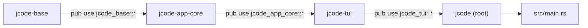
```mermaid
flowchart LR
    A["jcode-base"] -->|"pub use jcode_base::*"| B["jcode-app-core"]
    B -->|"pub use jcode_app_core::*"| C["jcode-tui"]
    C -->|"pub use jcode_tui::*"| D["jcode (root)"]
    D --> E["src/main.rs"]
```

Consequence: every existing `crate::<module>` path (e.g. `crate::config`, `crate::provider`, `crate::tui`) keeps resolving unchanged across all four layers.

---

## 4. Crate Topology

### 4.1 Crate Categories

The 56 workspace crates fall into the following categories (from `Cargo.toml:8-67`):

| Category | Crates | Purpose |
|----------|--------|---------|
| **Root** | `jcode` | binary + cli |
| **Presentation** | `jcode-tui` | TUI / video export |
| **Application** | `jcode-app-core` | server / tool / agent / ambient / overnight |
| **Foundation** | `jcode-base` | provider / auth / config / session / memory / message / telemetry / bus / storage / transport / … |
| **Type-only** | `jcode-memory-types`, `jcode-message-types`, `jcode-session-types`, `jcode-task-types`, `jcode-tool-types`, `jcode-config-types`, `jcode-usage-types`, `jcode-side-panel-types`, `jcode-selfdev-types`, `jcode-ambient-types`, `jcode-auth-types`, `jcode-gateway-types`, `jcode-background-types`, `jcode-batch-types` | Pure data definitions |
| **Provider** | `jcode-provider-core`, `jcode-provider-openai`, `jcode-provider-openrouter`, `jcode-provider-gemini`, `jcode-provider-metadata` | Provider trait, request shaping, model catalog |
| **Protocol** | `jcode-protocol` | wire types, comm format |
| **Swarm** | `jcode-swarm-core` | `SwarmMemberRecord`, `ChannelIndex` |
| **Tool** | `jcode-tool-core` | `Tool` trait, `ToolContext`, `intent_schema_property` |
| **Plan** | `jcode-plan` | `VersionedPlan`, `PlanItem`, `next_runnable_item_ids` |
| **Storage** | `jcode-storage`, `jcode-core` | runtime dir, secret IO, fs hardening |
| **TUI sub-presenters** | `jcode-tui-markdown`, `jcode-tui-messages`, `jcode-tui-mermaid`, `jcode-tui-core`, `jcode-tui-render`, `jcode-tui-style`, `jcode-tui-workspace`, `jcode-tui-account-picker`, `jcode-tui-session-picker`, `jcode-tui-tool-display`, `jcode-tui-usage-overlay` | Modular TUI components |
| **Auth helpers** | `jcode-azure-auth`, `jcode-notify-email` | Azure OAuth, email notifications |
| **Build / dev** | `jcode-build-meta`, `jcode-build-support`, `jcode-compaction-core`, `jcode-import-core`, `jcode-logging`, `jcode-update-core`, `jcode-terminal-launch`, `jcode-terminal-image` | Build metadata, import, logging, update, terminal launch, image rendering |
| **Desktop** | `jcode-desktop` | Tauri-style desktop scene engine |
| **Mobile** | `jcode-mobile-core`, `jcode-mobile-sim` | iOS host + mobile simulator |
| **Embedding** | `jcode-embedding` | Local ONNX/tokenizer embeddings (feature-gated) |
| **PDF** | `jcode-pdf` | PDF parsing (feature-gated) |

### 4.2 Top-10 Largest Crates (by LOC)

| Crate | Files | Approx. LOC |
|-------|-------|-------------|
| `jcode-tui` | 77 in `tui/` | 132,061 (incl. `crates/jcode-tui/src/tui/`) |
| `jcode-base` | 60+ modules | 101,645 |
| `jcode-app-core` | 47 in `server/` + 14 in `agent/` + … | 95,188 |
| `jcode-desktop` | 28 in `src/` | 66,214 |
| `jcode-protocol` | 7 in `src/` | 3,925 |
| `jcode-provider-core` | 9 in `src/` | 3,211 |
| `jcode-core` | 1 | 1,217 |
| `jcode-session-types` | 1 | 938 |
| `jcode-agent-runtime` | 1 | 91 |
| `jcode-tool-core` | 1 | 93 |

(Counts include `crates/<name>/src/**` aggregated; `jcode-app-core` counts include all submodules.)

### 4.3 Crate Dependency Snapshot

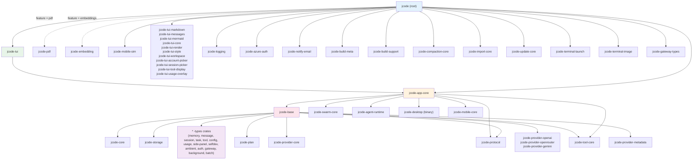
```mermaid
graph TD
    ROOT["jcode (root)"] --> TUI["jcode-tui"]
    ROOT --> APP["jcode-app-core"]
    TUI --> APP
    APP --> BASE["jcode-base"]
    BASE --> CORE["jcode-core"]
    BASE --> STORAGE["jcode-storage"]
    BASE --> TYPES["* -types crates<br/>(memory, message, session, task, tool, config, usage, side-panel, selfdev, ambient, auth, gateway, background, batch)"]
    BASE --> PLAN["jcode-plan"]
    BASE --> PROTOCOL["jcode-protocol"]
    APP --> PROTOCOL
    APP --> SWARM["jcode-swarm-core"]
    APP --> TOOL_CORE["jcode-tool-core"]
    APP --> AGENT_RT["jcode-agent-runtime"]
    BASE --> TOOL_CORE
    BASE --> PROVIDER_CORE["jcode-provider-core"]
    BASE --> PROVIDERS["jcode-provider-openai<br/>jcode-provider-openrouter<br/>jcode-provider-gemini"]
    BASE --> PROVIDER_META["jcode-provider-metadata"]
    ROOT -.->|"feature = pdf"| PDF["jcode-pdf"]
    ROOT -.->|"feature = embeddings"| EMB["jcode-embedding"]
    APP --> DESKTOP["jcode-desktop (binary)"]
    APP --> MOBILE_CORE["jcode-mobile-core"]
    ROOT --> MOBILE_SIM["jcode-mobile-sim"]
    ROOT --> TUI_SUB["jcode-tui-markdown<br/>jcode-tui-messages<br/>jcode-tui-mermaid<br/>jcode-tui-core<br/>jcode-tui-render<br/>jcode-tui-style<br/>jcode-tui-workspace<br/>jcode-tui-account-picker<br/>jcode-tui-session-picker<br/>jcode-tui-tool-display<br/>jcode-tui-usage-overlay"]
    ROOT --> LOGGING["jcode-logging"]
    ROOT --> AZURE["jcode-azure-auth"]
    ROOT --> NOTIFY["jcode-notify-email"]
    ROOT --> BUILD_META["jcode-build-meta"]
    ROOT --> BUILD_SUP["jcode-build-support"]
    ROOT --> COMPACT["jcode-compaction-core"]
    ROOT --> IMPORT["jcode-import-core"]
    ROOT --> UPDATE["jcode-update-core"]
    ROOT --> TERM_LAUNCH["jcode-terminal-launch"]
    ROOT --> TERM_IMG["jcode-terminal-image"]
    ROOT --> GATEWAY["jcode-gateway-types"]

    style ROOT fill:#e3f2fd
    style TUI fill:#e8f5e9
    style APP fill:#fff3e0
    style BASE fill:#fce4ec
    style TYPES fill:#f3e5f5
```

### 4.4 Path Resolution Invariant

Because of the `pub use` re-export chain (`jcode-base` → `jcode-app-core` → `jcode-tui` → root), every legacy `crate::<module>` path resolves identically across the three layers. This is the explicit reason the workspace split exists: it lets the largest compilation unit and its peak memory be roughly halved without forcing a path-rewrite PR.

The trade-off is **two re-export layers** at compile time, which is acceptable because Cargo's incremental compilation treats each layer as its own rustc unit and re-exports are zero-cost at runtime.

---

## 5. Server Architecture

The server is the heart of jcode. It is a long-lived process that owns all session state, the MCP pool, the swarm state, and the provider account state. TUI / desktop / iOS / headless clients are thin front-ends that connect over a Unix socket.

### 5.1 Server Module Topology

`crates/jcode-app-core/src/server.rs` (1,800+ lines) declares 47 submodules:

| Group | Modules |
|-------|---------|
| **Core runtime** | `runtime` (`ServerRuntime`), `state`, `durable_state`, `lifecycle`, `socket`, `reload`, `reload_state`, `reload_recovery`, `reload_trace`, `startup_tests` |
| **Client session** | `client_session`, `client_state`, `client_writer`, `client_actions`, `client_lifecycle`, `client_lifecycle_logging`, `client_disconnect_cleanup`, `client_lightweight_control`, `client_comm_channels`, `client_comm_context`, `client_comm_message` |
| **AI-to-AI comm** | `client_comm` (3 variants), `comm_await`, `comm_control`, `comm_plan`, `comm_session`, `comm_sync` |
| **Swarm** | `swarm`, `swarm_channels`, `swarm_mutation_state`, `swarm_persistence` |
| **Background** | `background_tasks`, `provider_control` |
| **Headless** | `headless` |
| **Long-poll relay** | `jade_relay` |
| **Debug** | `debug`, `debug_ambient`, `debug_command_exec`, `debug_events`, `debug_help`, `debug_jobs`, `debug_server_state`, `debug_session_admin`, `debug_swarm_read`, `debug_swarm_write`, `debug_testers` |
| **Tests** | `client_actions_tests`, `client_comm_tests`, `client_lifecycle_tests`, `client_session_tests`, `client_state_tests`, `comm_control_tests`, `comm_session_tests`, `comm_sync` tests, `comm_plan`, `file_activity_tests`, `provider_control_tests`, `queue_tests`, `reload_tests`, `socket_tests`, `startup_tests`, `swarm_mutation_state_tests`, `swarm_persistence_tests`, `tests` |
| **Await** | `await_members_state` |
| **Util** | `util` |

### 5.2 ServerRuntime

```rust
// crates/jcode-app-core/src/server/runtime.rs
pub(super) struct ServerRuntime { ... }
impl ServerRuntime { ... }
```

`ServerRuntime` is the top-level state container. It is the source of truth for:

- The currently-active client list (one entry per connected socket).
- The session table (`HashMap<SessionId, SessionState>`).
- The MCP pool (shared across all sessions).
- The swarm persistence state.
- The provider account state.
- The active reload state (`reloading`, `reloading_progress`).

### 5.3 Socket Layout


```mermaid
graph LR
    subgraph Sockets["Unix sockets (runtime_dir, mode 0700)"]
        MAIN["jcode.sock<br/>main client ↔ server<br/>newline-delimited JSON"]
        DEBUG["jcode-debug.sock<br/>admin / debug surface"]
    end

    CLIENT["TUI / Desktop / iOS / Headless"] -->|"connect"| MAIN
    DEBUGGER["debug CLI / human"] -->|"connect"| DEBUG
    MAIN --> SR["ServerRuntime<br/>(async tokio loop)"]
    DEBUG --> SR
    SR --> SESS["Session table<br/>(Arc&#60;RwLock&#60;…&#62;&#62;)"]
    SR --> SWARM["Swarm state<br/>(persisted)"]
    SR --> MCP["MCP pool<br/>(shared)"]
    SR --> ACCOUNTS["Provider accounts<br/>(per provider)"]
```

`crates/jcode-storage/src/lib.rs:20-37` resolves the runtime directory as follows:

| Platform | Path |
|----------|------|
| Linux | `$XDG_RUNTIME_DIR` (typically `/run/user/<uid>`) |
| macOS | `$TMPDIR` (per-user) |
| Fallback | `std::env::temp_dir()` (sanitized to `jcode-<uid>`) |
| Override | `$JCODE_RUNTIME_DIR` |

The runtime dir is created with owner-only permissions via `jcode_core::fs::set_directory_permissions_owner_only` (`crates/jcode-storage/src/lib.rs:65-71`).

### 5.4 Server Lifecycle

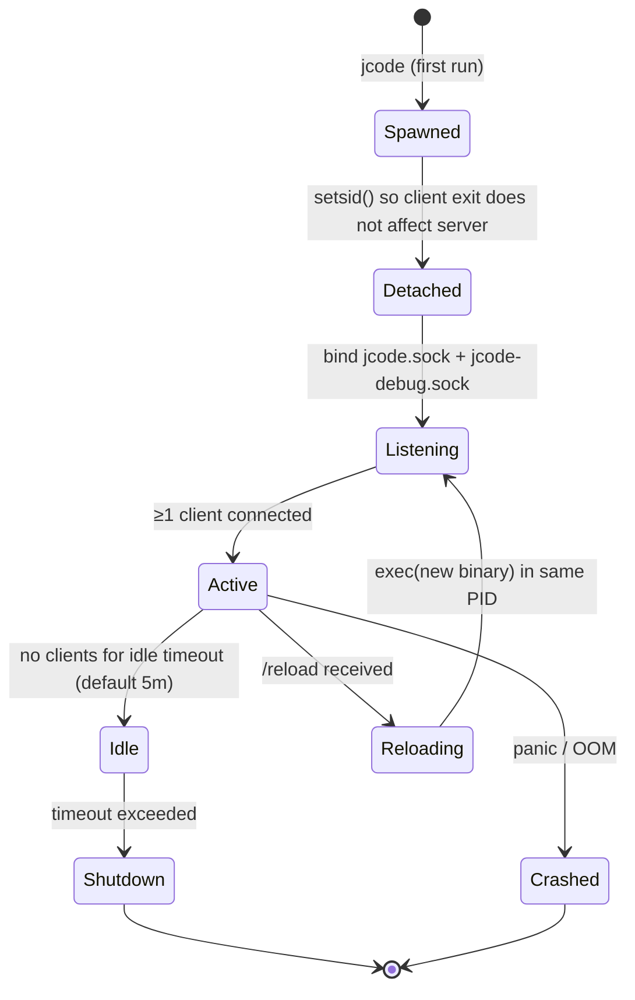
```mermaid
stateDiagram-v2
    [*] --> Spawned: jcode (first run)
    Spawned --> Detached: setsid() so client exit does not affect server
    Detached --> Listening: bind jcode.sock + jcode-debug.sock
    Listening --> Active: ≥1 client connected
    Active --> Idle: no clients for idle timeout (default 5m)
    Idle --> Shutdown: timeout exceeded
    Active --> Reloading: /reload received
    Reloading --> Listening: exec(new binary) in same PID
    Shutdown --> [*]
    Active --> Crashed: panic / OOM
    Crashed --> [*]
```

`docs/SERVER_ARCHITECTURE.md:100-130` documents the `/reload` path:

1. Server receives `Reload { id }` Request on the main socket.
2. Server publishes `Reloading` to all clients.
3. Server `exec`s into the new binary (`execve` on Unix, `_execv` on Windows).
4. Same PID, same socket path. New binary reads persisted state from disk.
5. Clients auto-reconnect with exponential backoff (1s → 2s → 4s … up to 30s).
6. Clients re-bind to the same session ID; session state was persisted before exec.

### 5.5 Client Reconnect Loop

Clients have a built-in reconnect loop (`crates/jcode-tui/src/tui/app/`). When the connection drops:

1. Client shows "Connection lost - reconnecting…".
2. Retries with exponential backoff (1s, 2s, 4s … up to 30s).
3. On reconnect, resumes the same session (session state persists on disk).
4. If the server was reloaded, the client may also `re-exec` itself if a newer client binary is available.

### 5.6 Server Startup Hooks (`jcode serve`)

`src/cli/startup.rs:12-99` (`pub async fn run()`) executes the following ordered initialization before `dispatch::run_main`:

| Order | Step | Source |
|-------|------|--------|
| 1 | `startup_profile::init()` — high-resolution timing | `startup.rs:13` |
| 2 | `terminal::install_panic_hook()` — pretty panic messages | `startup.rs:15` |
| 3 | `logging::init()` + `cleanup_old_logs()` | `startup.rs:18-21` |
| 4 | 5 dependency-inversion registrations (catalog/auth/safety/memory/server) | `startup.rs:24-75` |
| 5 | `platform::raise_nofile_limit_best_effort(8_192)` | `startup.rs:77` |
| 6 | `storage::harden_user_config_permissions()` — owner-only on `~/.jcode` | `startup.rs:80` |
| 7 | `perf::init_background()` | `startup.rs:83` |
| 8 | `telemetry::record_install_if_first_run()` + `record_upgrade_if_needed()` | `startup.rs:86-87` |
| 9 | `parse_and_prepare_args()` + `spawn_background_update_check(&args)` | `startup.rs:90-91` |
| 10 | `dispatch::run_main(args)` — actual command execution | `startup.rs:93` |

### 5.7 Persistence Model

| Surface | Path | Format | Source |
|---------|------|--------|--------|
| Sessions | `~/.jcode/sessions/<id>/` | JSON per session | `session/storage_paths.rs` |
| Server registry | `~/.jcode/servers.json` | JSON (server name ↔ socket) | `SERVER_ARCHITECTURE.md:54` |
| Provider credentials | `~/.config/jcode/credentials.json` (mode 0600) | JSON secret | `storage.rs:harden_secret_file_permissions` |
| Ambient visible cycle | `~/.jcode/ambient/visible_cycle.json` | JSON | `ambient.rs:42-58` |
| MCP config | `~/.jcode/mcp.json` | JSON | `mcp/manager.rs` |
| Telemetry state | `~/.jcode/telemetry.json` | JSON | `telemetry/state_support.rs` |
| Build metadata | embedded in binary | `build.rs` of each crate | `jcode-build-meta` |

`storage::write_json_secret` (`crates/jcode-storage/src/lib.rs:198-205`) uses **owner-only** parent + file permissions on Unix. `storage::write_json_fast` (line 251-253) is the **non-fsync** variant used for frequent saves (e.g. during tool execution) where crash-safety via atomic rename is enough. `append_json_line_fast` (line 368-380) is the append-only journal variant.

### 5.8 Server-Side Subsystems

#### 5.8.1 Headless Mode

`crates/jcode-app-core/src/server/headless.rs` (`create_headless_session`) creates server-driven sessions that do not have a TUI client. These are used for:

- Ambient cycles
- Overnight sessions
- Headless CI / harness runs
- Server-internal long-poll relays (`jade_relay`)

#### 5.8.2 Jade Relay

`crates/jcode-app-core/src/server/jade_relay.rs` is a **long-poll relay** that lets a remote device drive a jcode session over HTTPS. Constants at lines 17-20:

```rust
const RELAY_LONG_POLL_SECONDS: u32 = 20;
const HEARTBEAT_INTERVAL: Duration = Duration::from_secs(30);
const ERROR_BACKOFF: Duration = Duration::from_secs(10);
const MAX_RESPONSE_CHARS: usize = 12_000;
```

The relay is configured from `SafetyConfig` via `RelayListenerConfig::from_safety` (line 36). It exists so the iOS host can drive a jcode server over a remote connection (e.g. when the iOS device is on a different network than the server).

#### 5.8.3 Background Tasks

`crates/jcode-app-core/src/server/background_tasks.rs` handles tool results that are still running when the user issues the next turn. Helpers: `dispatch_background_task_completion`, `dispatch_background_task_progress`, `dispatch_ui_activity`.

The agent exposes a `BackgroundToolSignal` (`crates/jcode-agent-runtime/src/lib.rs:23-24`) that lets callers move a long-running tool to background without holding the agent lock. This is set from outside the agent lock (using `std::sync::Arc<AtomicBool>`) so it can be raised without async context.

---

## 6. Wire Protocol

### 6.1 Transport

- **Wire format:** newline-delimited JSON.
- **Transport:** Unix domain socket on Unix (`jcode.sock`, `jcode-debug.sock`), named pipe on Windows.
- **Two socket types:**
  - **Main socket** — TUI / client ↔ server communication.
  - **Agent socket** — inter-agent AI-to-AI communication (the `comm` system).

The protocol is declared as such in `crates/jcode-protocol/src/lib.rs:1-9`:

```rust
//! Client-server protocol for jcode
//!
//! Uses newline-delimited JSON over Unix socket.
//! Server streams events back to clients during message processing.
//!
//! Socket types:
//! - Main socket: TUI/client communication with agent
//! - Agent socket: Inter-agent communication (AI-to-AI)
```

### 6.2 Request Enum (Client → Server)

The `Request` enum in `crates/jcode-protocol/src/wire.rs` has 67+ variants. Highlights:

| Category | Variants |
|----------|----------|
| **Message lifecycle** | `Message`, `Cancel`, `BackgroundTool`, `SoftInterrupt`, `CancelSoftInterrupts`, `Clear`, `Rewind`, `RewindUndo` |
| **State** | `Ping`, `GetState`, `GetHistory`, `GetModelCatalog`, `GetCompactedHistory`, `Subscribe` |
| **Debug** | `DebugCommand`, `ClientDebugCommand`, `ClientDebugResponse` |
| **Session** | `ResumeSession`, `NotifySession`, `Transcript`, `InputShell`, `RenameSession`, `Split`, `Transfer`, `Compact`, `TriggerMemoryExtraction` |
| **Model** | `CycleModel`, `RefreshModels`, `SetModel`, `SetRoute`, `SetSubagentModel`, `SetReasoningEffort`, `SetServiceTier`, `SetTransport`, `SetPremiumMode`, `SetFeature`, `SetCompactionMode` |
| **Auth** | `NotifyAuthChanged`, `SwitchAnthropicAccount`, `SwitchOpenAiAccount`, `StdinResponse` |
| **Reload** | `Reload` |
| **AI-to-AI comm (16+ variants)** | `AgentRegister`, `AgentTask`, `AgentCapabilities`, `AgentContext`, `CommShare`, `CommRead`, `CommMessage`, `CommList`, `CommListChannels`, `CommChannelMembers`, `CommProposePlan`, `CommApprovePlan`, `CommRejectPlan`, `CommSpawn`, `CommStop`, `CommAssignRole`, `CommSummary`, `CommStatus`, `CommReport`, `CommReadContext`, `CommResyncPlan`, `CommPlanStatus`, `CommAssignTask`, `CommAssignNext`, `CommTaskControl`, `CommSubscribeChannel`, `CommUnsubscribeChannel`, `CommAwaitMembers` |

### 6.3 ServerEvent Enum (Server → Client)

The `ServerEvent` enum has 67+ variants streamed back during message processing. Highlights:

| Category | Variants |
|----------|----------|
| **Streaming text** | `TextDelta { text }`, `TextReplace { text }` |
| **Streaming tool** | `ToolStart`, `ToolInput { delta }`, `ToolExec`, `ToolDone`, `GeneratedImage`, `BatchProgress` |
| **Lifecycle** | `Ack`, `Done`, `Error`, `Pong`, `State`, `Compaction`, `McpStatus`, `CompactedHistory` |
| **Session** | `SessionId`, `SessionCloseRequested`, `SessionRenamed`, `SplitResponse`, `CompactResult` |
| **Reload** | `Reloading`, `ReloadProgress` |
| **Model state** | `ModelChanged`, `ReasoningEffortChanged`, `ServiceTierChanged`, `TransportChanged`, `CompactionModeChanged`, `AvailableModelsUpdated` |
| **Notifications** | `Notification`, `Transcript`, `InputShellResult`, `StdinRequest` |
| **AI-to-AI comm (15+ variants)** | `CommContext`, `CommMembers`, `CommChannels`, `CommSummaryResponse`, `CommStatusResponse`, `CommReportResponse`, `CommPlanStatusResponse`, `CommAssignTaskResponse`, `CommTaskControlResponse`, `CommContextHistory`, `CommSpawnResponse`, `CommAwaitMembersResponse` |
| **Debug** | `DebugResponse`, `ClientDebugRequest` |
| **UI** | `SidePanelState` |
| **History** | `History` |

### 6.4 Comm Format Helpers

`crates/jcode-protocol/src/comm_format.rs` exposes pure formatting functions for the AI-to-AI comm protocol:

- `format_comm_plan_followup(summary: &PlanGraphStatus) -> String`
- `default_comm_cleanup_target_statuses() -> Vec<String>`
- `default_comm_run_await_statuses() -> Vec<String>`
- `default_comm_await_target_statuses() -> Vec<String>`
- `comm_cleanup_candidate_session_ids(...)`
- `format_comm_context_entries(entries: &[ContextEntry]) -> String`
- `duplicate_comm_friendly_names(...)`
- `comm_session_display_suffix(session_id: &str) -> &str`
- `comm_display_friendly_name(...)`
- `format_comm_members(current_session_id, members) -> String`
- `format_comm_tool_summary(target, calls) -> String`
- `format_comm_status_snapshot(snapshot) -> String`
- `format_comm_plan_status(summary) -> String`
- `format_comm_context_history(target, messages) -> String`
- `truncate_comm_completion_report(report) -> String`

### 6.5 Memory Snapshots in Protocol

`crates/jcode-protocol/src/protocol_memory.rs` defines memory-pipeline snapshots that are part of the wire contract:

- `MemoryStateSnapshot` — top-level memory state for a session
- `MemoryPipelineSnapshot` — pipeline phase + step counter
- `MemoryStepResultSnapshot` — last memory step result
- `MemoryStepStatusSnapshot` — per-step status
- `MemoryActivitySnapshot` — recent memory activity

### 6.6 NotificationType

`crates/jcode-protocol/src/notifications.rs` defines `NotificationType` and `FeatureToggle` (re-exported from the protocol crate) which gate which features the TUI renders.

---

## 7. Agent Runtime

The agent runtime lives in `crates/jcode-app-core/src/agent/` and consists of 14 submodules that together implement a turn-based, interruptible, streaming agent loop. The largest three files account for ~4,158 LOC:

| File | LOC | Purpose |
|------|-----|---------|
| `turn_loops.rs` | 1,098 | The main turn loop and tool-execution loop |
| `turn_streaming_mpsc.rs` | 1,279 | Per-client mpsc streaming variant |
| `turn_streaming_broadcast.rs` | 1,014 | Broadcast streaming variant (server-wide) |
| `turn_execution.rs` | 767 | Public turn entry points |
| `compaction.rs`, `environment.rs`, `interrupts.rs`, `messages.rs`, `prompting.rs`, `provider.rs`, `response_recovery.rs`, `status.rs`, `streaming.rs`, `tools.rs`, `utils.rs` | — | Supporting modules |

### 7.1 Agent Public API

`crates/jcode-app-core/src/agent/turn_execution.rs` exposes four turn entry points on `impl Agent`:

```rust
pub async fn run_once(&mut self, user_message: &str) -> Result<()>
pub async fn run_once_capture(&mut self, user_message: &str) -> Result<String>
pub async fn run_once_streaming(
    &mut self,
    user_message: &str,
    event_tx: broadcast::Sender<ServerEvent>,
) -> Result<()>
pub async fn run_once_streaming_mpsc(
    &mut self,
    user_message: &str,
    images: Vec<(String, String)>,
    system_reminder: Option<String>,
    event_tx: mpsc::UnboundedSender<ServerEvent>,
) -> Result<()>
```

### 7.2 Turn Flow

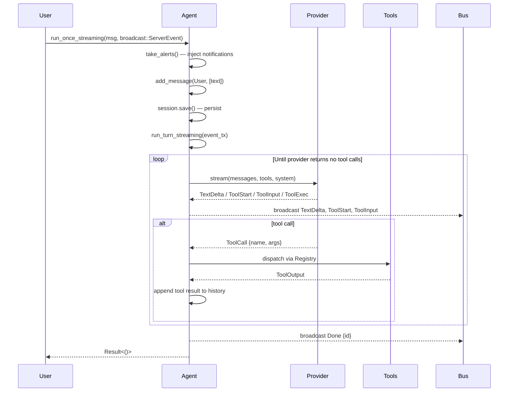
```mermaid
sequenceDiagram
    participant User
    participant Agent
    participant Provider
    participant Tools
    participant Bus

    User->>Agent: run_once_streaming(msg, broadcast::ServerEvent)
    Agent->>Agent: take_alerts() — inject notifications
    Agent->>Agent: add_message(User, [text])
    Agent->>Agent: session.save() — persist
    Agent->>Agent: run_turn_streaming(event_tx)
    loop Until provider returns no tool calls
        Agent->>Provider: stream(messages, tools, system)
        Provider-->>Agent: TextDelta / ToolStart / ToolInput / ToolExec
        Agent-->>Bus: broadcast TextDelta, ToolStart, ToolInput
        alt tool call
            Provider-->>Agent: ToolCall {name, args}
            Agent->>Tools: dispatch via Registry
            Tools-->>Agent: ToolOutput
            Agent->>Agent: append tool result to history
        end
    end
    Agent-->>Bus: broadcast Done {id}
    Agent-->>User: Result<()>
```

### 7.3 Interrupt Model

`crates/jcode-agent-runtime/src/lib.rs` defines the interrupt primitives:

```rust
pub struct SoftInterruptMessage {
    pub content: String,
    pub urgent: bool,
    pub source: SoftInterruptSource,
}
pub enum SoftInterruptSource { User, System, BackgroundTask }

pub type SoftInterruptQueue = Arc<std::sync::Mutex<Vec<SoftInterruptMessage>>>;
pub type BackgroundToolSignal = Arc<std::sync::atomic::AtomicBool>;
pub type GracefulShutdownSignal = Arc<std::sync::atomic::AtomicBool>;

pub struct InterruptSignal {
    flag: Arc<std::sync::atomic::AtomicBool>,
    notify: Arc<tokio::sync::Notify>,
}
```

`InterruptSignal` is the **async-aware** variant that combines `AtomicBool` (sync read) with `tokio::sync::Notify` (async wake). It is used to **eliminate spin-loops during tool execution** — the agent awaits `notified()` instead of polling the flag.

Three interrupt points in the turn loop:

- **Point A (before next tool dispatch):** inject soft interrupts
- **Point B (between tool result and next provider call):** inject urgent interrupts, optionally skip remaining tools
- **Point C (after final response):** commit session state

### 7.4 Compaction

`crates/jcode-app-core/src/agent/compaction.rs` and the underlying `jcode-compaction-core` crate implement history compaction. When the message history exceeds a token threshold, the agent:

1. Summarizes older messages into a compact form.
2. Keeps the most recent N turns verbatim.
3. Persists a marker so the history can be reconstructed if needed.

The wire exposes this as `Request::Compact` / `ServerEvent::CompactResult` / `Request::SetCompactionMode` / `ServerEvent::CompactionModeChanged`.

### 7.5 Streaming Backpressure

`turn_streaming_broadcast.rs` uses `tokio::sync::broadcast::Sender<ServerEvent>` for the server-wide fanout. `turn_streaming_mpsc.rs` uses `tokio::sync::mpsc::UnboundedSender<ServerEvent>` for per-client delivery. Both share `send_stream_keepalive_broadcast` / `send_stream_keepalive_mpsc` / `stream_keepalive_ticker` (from `agent/streaming.rs`) which emit periodic keepalive events so the client UI can render a "thinking…" cursor even when the provider is slow.

### 7.6 Tool-Output Capping

To keep provider request size bounded, `agent/tools.rs` exposes:

- `cap_tool_output_for_history` — truncate a single tool output to the model's context budget.
- `cap_sdk_tool_content_for_history` — cap SDK tool content (separate code path for `apply_patch`, etc.).
- `tool_output_to_content_blocks` — convert `ToolOutput` to a sequence of `ContentBlock` for the next turn.
- `print_tool_summary` — pretty-print a tool summary in the TUI.

### 7.7 Response Recovery

`agent/response_recovery.rs` handles streaming resilience — if a stream is interrupted (network drop, timeout, server reload mid-response), the agent recovers by:

- Detecting the truncated last tool call.
- Re-issuing the request with a marker in the system prompt.
- Repairing the message history so the next provider call is well-formed.

The static `RECOVERED_TEXT_WRAPPED_TOOL_CALLS: AtomicU64` (line 58-59 of `agent.rs`) is incremented on each successful recovery; this is exposed via telemetry.

### 7.8 Prompting

`agent/prompting.rs` builds the system prompt. It pulls from:

- `crates/jcode-base/src/prompt/system_prompt.md` — base system prompt.
- `crates/jcode-base/src/prompt/selfdev_*.txt` — selfdev overlays.
- `crates/jcode-base/src/prompt/mission_continuation.md` — mission-continuation overlay.
- The active skill registry snapshot.
- The active swarm plan (if any).
- The session's recent context (memory recall results).

### 7.9 Status / State

`agent/status.rs` exposes `SessionStatus` (delegates to `jcode-session-types::SessionStatus`) and helpers to read/write the status atomically. It also exposes the per-session "agent info" struct used by the comm subsystem.

### 7.10 Provider Selection

`agent/provider.rs` wires the `Provider` trait (`crates/jcode-provider-core/src/lib.rs`) to the turn loop. The agent picks a route via `provider/selection.rs` (route availability, failover candidates) and then dispatches via `MultiProvider` (`crates/jcode-base/src/provider/mod.rs`).

---

## 8. Tool System

### 8.1 Tool Registry

`crates/jcode-app-core/src/tool/mod.rs` declares a `Registry` of `Arc<dyn Tool>`:

```rust
pub struct Registry {
    tools: Arc<RwLock<HashMap<String, Arc<dyn Tool>>>>,
    skills: Arc<RwLock<SkillRegistry>>,
    compaction: Arc<RwLock<CompactionManager>>,
}

impl Clone for Registry {
    fn clone(&self) -> Self {
        Self {
            tools: self.tools.clone(),
            skills: self.skills.clone(),
            // Each clone gets a fresh CompactionManager to prevent parallel
            // subagents from corrupting each other's message history
            compaction: Arc::new(RwLock::new(CompactionManager::new())),
        }
    }
}
```

The clone semantics are **important**: a fresh `CompactionManager` is created on every clone so that parallel subagents do not corrupt each other's message history, while tools and skills are shared via `Arc`.

### 8.2 Tool Trait

`crates/jcode-tool-core/src/lib.rs` defines the `Tool` trait with re-exports `StdinInputRequest`, `ToolContext`, `ToolExecutionMode` (line 48). `jcode-tool-core::intent_schema_property` is a helper for declaring JSON-schema-style intent properties (line 47). The tool output types live in `jcode-tool-types`:

```rust
pub struct ToolOutput { ... }
pub struct ToolImage { ... }
```

### 8.3 Tool List

33 first-class tools are registered in `tool/mod.rs:1-34`. Some are further sub-tooled (e.g. `selfdev` exposes `launch` / `reload` / `status` / `build_queue`):

| Group | Tools | Source |
|-------|-------|--------|
| **File** | `read`, `read/` (subdir), `edit`, `write`, `multiedit`, `apply_patch`, `patch`, `glob`, `grep`, `ls`, `agentgrep` | `tool/read.rs` + subdir |
| **Shell** | `bash`, `batch`, `bg` | `tool/bash.rs`, `tool/batch.rs`, `tool/bg.rs` |
| **Network** | `webfetch`, `websearch`, `browser` | `tool/webfetch.rs`, `tool/websearch.rs`, `tool/browser.rs` |
| **Search** | `agentgrep` (high-perf), `codesearch`, `conversation_search`, `session_search` | `tool/agentgrep/`, `tool/codesearch.rs` |
| **Memory** | `memory` (recall / store), `memory_agent` (recurring jobs) | `tool/memory.rs` |
| **Swarm / comm** | `communicate` (AI-to-AI), `task` (swarm task), `side_panel` | `tool/communicate.rs`, `tool/task.rs` |
| **Self-extension** | `selfdev` (modify jcode itself) | `tool/selfdev/mod.rs` |
| **Ambient** | `ambient` (long-running autonomous) | `tool/ambient.rs` |
| **MCP** | `mcp` (Model Context Protocol client) | `tool/mcp.rs` |
| **Misc** | `lsp` (LSP queries), `todo`, `goal`, `gmail`, `dictation`, `open`, `invalid`, `debug_socket`, `skill` | `tool/lsp.rs`, `tool/todo.rs`, `tool/goal.rs`, `tool/gmail.rs`, `tool/dictation.rs`, `tool/open.rs`, `tool/invalid.rs`, `tool/debug_socket.rs`, `tool/skill.rs` |

### 8.4 Tool Policy

```rust
#[derive(Clone, Debug, Default)]
struct SessionToolPolicy {
    allowed_tools: Option<HashSet<String>>,
    disabled_tools: HashSet<String>,
}
static SESSION_TOOL_POLICIES: LazyLock<StdRwLock<HashMap<String, SessionToolPolicy>>> = ...;
```

A session can have an `allowed_tools` allowlist and/or a `disabled_tools` blocklist. The default is "all tools allowed, none disabled". `set_session_tool_policy` / `clear_session_tool_policy` are the registry mutators.

### 8.5 Tool Dispatch

Tool dispatch is driven by the provider's emitted `ToolCall`. The flow:

1. The provider returns a `ToolCall { id, name, args }` during a turn.
2. The agent looks up `name` in the `Registry`.
3. If found and allowed by the session policy, the tool is invoked with `ToolContext`.
4. The result is appended to message history as a `ContentBlock::ToolResult` (or whatever the provider expects).
5. The agent continues the turn.

Tools can return images via `ToolImage` (terminal image display) and request stdin via `StdinInputRequest` (e.g. for confirmations).

### 8.6 Selfdev Tool

`tool/selfdev/` is the most unusual tool: it allows the agent to **modify jcode itself**. Submodules:

- `build_queue.rs` — queue of pending selfdev builds.
- `launch.rs` — launch a selfdev cycle.
- `mod.rs` — top-level entry.
- `reload.rs` — trigger a server reload after a selfdev change.
- `status.rs` — report selfdev build status.
- `tests.rs` — tests.

When a selfdev change is applied, the tool chains to `ServerRuntime`'s `/reload` path: the server `exec`s into the new binary, all clients reconnect, and the new behavior takes effect mid-session. This is the basis of the "self-improving" property described in the README.

### 8.7 Communicate Tool (AI-to-AI)

`tool/communicate.rs` (with `transport.rs` submodule) is the bridge to the comm subsystem. It lets an agent:

- `list` — enumerate visible agents and their statuses.
- `read` — read another agent's recent history.
- `message` / `broadcast` — send a message to one or all agents.
- `dm` — direct message a specific session.
- `channel` — manage swarm channels (subscribe, unsubscribe, post).
- `share` — share context (files, memory entries) with another agent.

The comm protocol is exposed as `Comm*` variants on `Request` / `ServerEvent` in `jcode-protocol/src/wire.rs` (see § 6.2).

### 8.8 Agentgrep

`tool/agentgrep/` is jcode's high-performance grep tool (from `agentgrep = { git = "1jehuang/agentgrep.git" }`, `Cargo.toml:228`). Submodules:

- `args.rs` — argument parsing.
- `context.rs` — surrounding-line context.
- `render.rs` — output rendering.

It is the primary search tool and is preferred over `grep` for code-search workloads.

### 8.9 Patch / Apply Patch

`tool/apply_patch.rs` and `tool/patch.rs` are two distinct patch surfaces — `apply_patch` is the OpenAI-style structured patch, `patch` is a unified-diff-style patch. The agent typically uses `apply_patch` for multi-file edits and `edit`/`multiedit` for single-file precise edits.

### 8.10 Bash, Batch, Background

- `bash` — execute a single shell command.
- `batch` — execute a sequence of commands and stream results.
- `bg` — move a long-running command to background; the tool returns a handle, the result arrives via `BackgroundToolSignal` (`crates/jcode-agent-runtime/src/lib.rs:23-24`).

---

## 9. Provider System

### 9.1 Provider Trait

`crates/jcode-provider-core/src/lib.rs` defines the `Provider` trait, re-exported by `jcode-base` as `crate::provider::Provider`. Concrete providers are registered into a `MultiProvider` facade.

### 9.2 MultiProvider Facade

`crates/jcode-base/src/provider/mod.rs` defines `MultiProvider` as a struct holding 9 hot-swappable provider slots:

```rust
pub struct MultiProvider {
    /// Claude/Anthropic (OAuth + API key)
    openai: RwLock<Option<Arc<openai::OpenAIProvider>>>,
    /// GitHub Copilot API provider (direct API, hot-swappable after login)
    copilot_api: RwLock<Option<Arc<copilot::CopilotApiProvider>>>,
    /// Antigravity provider (direct HTTPS, hot-swappable after login)
    antigravity: RwLock<Option<Arc<antigravity::AntigravityProvider>>>,
    /// Gemini provider (hot-swappable after login)
    gemini: RwLock<Option<Arc<gemini::GeminiProvider>>>,
    /// Cursor provider (native/direct API, hot-swappable after login)
    cursor: RwLock<Option<Arc<cursor::CursorCliProvider>>>,
    /// AWS Bedrock provider (native Converse/ConverseStream, IAM/SigV4)
    bedrock: RwLock<Option<Arc<bedrock::BedrockProvider>>>,
    /// OpenRouter API provider
    openrouter: RwLock<Option<Arc<openrouter::OpenRouterProvider>>>,
    /// Direct OpenAI-compatible runtimes keyed by profile id
    openai_compatible_profiles: RwLock<HashMap<String, Arc<openrouter::OpenRouterProvider>>>,
    active_openai_compatible_profile: RwLock<Option<String>>,
    ...
}
```

The slot pattern lets the auth subsystem install a new provider in place when the user logs in, without restarting the agent.

### 9.3 Concrete Providers (13)

`grep '^impl Provider for' crates/` shows 13 concrete `Provider` implementations (and one `MockProvider` for tests, and one `SetModelAuthRefreshMockProvider` for tests, plus the `MultiProvider` facade itself):

| # | Provider | File | Auth | Notes |
|---|----------|------|------|-------|
| 1 | `AnthropicProvider` | `provider/anthropic.rs` | OAuth + API key | Native Anthropic API |
| 2 | `ClaudeProvider` | `provider/claude.rs` | Claude Code CLI | Spawns the Claude CLI as a child process |
| 3 | `OpenAIProvider` | `provider/openai_provider_impl.rs` | API key, OAuth, Azure | Generic OpenAI-protocol |
| 4 | `OpenRouterProvider` | `provider/openrouter_provider_impl.rs` | API key | OpenRouter aggregation |
| 5 | `GeminiProvider` | `provider/gemini.rs` | OAuth | Google Gemini |
| 6 | `BedrockProvider` | `provider/bedrock.rs` | IAM / SigV4, AWS_BEARER_TOKEN_BEDROCK | `aws-sdk-bedrockruntime` Converse/ConverseStream |
| 7 | `CopilotApiProvider` | `provider/copilot.rs` | OAuth | GitHub Copilot direct API |
| 8 | `CursorCliProvider` | `provider/cursor.rs` | OAuth | Cursor native |
| 9 | `AntigravityProvider` | `provider/antigravity.rs` | OAuth | Antigravity HTTPS |
| 10 | `JcodeProvider` | `provider/jcode.rs` | API key | First-party jcode API |
| 11+ | OpenAI-compatible profiles | `openrouter::OpenRouterProvider` reused | per-profile | Arbitrary OpenAI-compatible endpoints |
| 12 | `MultiProvider` (facade) | `provider/mod.rs` | aggregates above | Implements `Provider` and delegates |
| 13 | Test mocks | `provider/gemini_tests.rs`, `provider/tests/auth_refresh.rs` | — | Not production |

### 9.4 Account Failover

`provider/account_failover.rs` and `provider/failover.rs` (`crates/jcode-provider-core/src/failover.rs`) implement **per-provider account failover**. When a request fails with a 429/5xx, the agent:

1. Marks the current account as rate-limited (with a backoff window).
2. Looks up a same-provider account candidate via `same_provider_account_candidates`.
3. Switches the account override via `set_account_override_for_provider`.
4. Retries with the new account.

The `FailoverDecision` struct (`crates/jcode-provider-core/src/failover.rs`) and `ProviderFailoverPrompt` carry the decision across the wire.

### 9.5 OpenAI-Compatible Profiles

The `openai_compatible_profiles` slot (`crates/jcode-base/src/provider/mod.rs`) lets the user add **arbitrary OpenAI-compatible endpoints** (e.g. self-hosted vLLM, local llama.cpp server, third-party aggregators) without writing new code. The profile ID is set via `set_active_compatible_profile` (`provider/registry.rs:58-64`), and the resolved runtime is reused from the `OpenRouterProvider` wire-protocol implementation.

`provider/registry.rs` (`ProviderRegistry<'a>`) centralizes runtime lookup so that "real OpenRouter" and "active OpenAI-compatible profile" do not overwrite each other.

### 9.6 Model Catalog

`provider/models.rs` and `provider/catalog_refresh.rs` maintain the model catalog. The catalog is refreshed on startup and on user request (`Request::RefreshModels`). It exposes:

- `ALL_CLAUDE_MODELS`, `ALL_OPENAI_MODELS` — hardcoded fallback lists.
- `begin_anthropic_model_catalog_refresh`, `begin_openai_model_catalog_refresh` — async refresh entry points.
- `ModelRoute`, `ModelRouteApiMethod` — route definitions.
- `RouteBillingKind`, `RouteCheapnessEstimate`, `RouteCostConfidence`, `RouteCostSource` — cost metadata.
- `dedupe_model_routes`, `explicit_model_provider_prefix`, `model_name_for_provider`, `normalize_copilot_model_name`, `provider_from_model_key` — helpers.

`provider/models_catalog.rs` adds the catalog format details.

### 9.7 Pricing

`provider/pricing.rs` and `provider/models.rs` provide pricing data for cost calculation. The cost is shown in the TUI's usage overlay and used in the route-selection algorithm.

### 9.8 Route Selection

`provider/selection.rs` (`ProviderAvailability`) chooses the active route for a given model name. It consults:

- The user's configured `provider.preserve_reasoning_context` setting.
- The active OpenAI-compatible profile (if any).
- The real OpenRouter runtime (if any).
- The catalog refresh state.

### 9.9 Activation

`provider/activation.rs` controls when a provider is "active" — i.e. the user has logged in and the credentials are valid. Activation can be lazy (first request) or eager (at startup).

### 9.10 Fingerprint

`provider/fingerprint.rs` computes a stable fingerprint of a provider's request shape, used for cache invalidation and tool-result comparison across providers.

---

## 10. Memory System

### 10.1 Memory Pipeline

`crates/jcode-base/src/memory/` is the foundation. It contains 3 active modules plus the higher-level `memory.rs`, `memory_agent.rs`, `memory_graph.rs`, `memory_log.rs`, `memory_prompt.rs`, and the type crate `jcode-memory-types`.

The pipeline has three runtime modules:

| File | Purpose |
|------|---------|
| `memory/activity.rs` | Tracks recent activity (last-used tools, recent files, recent sessions). |
| `memory/cache.rs` | Caches embedding computations and recall results. |
| `memory/pending.rs` | Holds pending memory entries awaiting extraction/commit. |

### 10.2 Memory Graph

`crates/jcode-base/src/memory_graph.rs` (top-level, not in the subdir) is the **typed graph** storage. Types live in `jcode-memory-types/src/graph.rs`:

```rust
pub enum EdgeKind { ... }
pub struct Edge { ... }
pub struct TagEntry { ... }
pub struct ClusterEntry { ... }
pub struct GraphMetadata { ... }
pub struct MemoryGraph { ... }
```

The graph lets memory entries be linked by typed edges (e.g. `derivedFrom`, `relatedTo`, `supersedes`), tagged, and clustered. Clusters are surfaced to the prompt as memory-graph health (`MemoryGraphHealth`, `gather_memory_graph_health` in `crates/jcode-base/src/ambient/prompt.rs`).

### 10.3 Memory Activity Snapshot

`jcode-memory-types/src/lib.rs` defines the activity state used by the pipeline:

```rust
pub struct MemoryActivity { ... }
pub enum StepStatus { ... }
pub struct StepResult { ... }
pub struct PipelineState { ... }
```

These are also re-exported in the protocol as `MemoryActivitySnapshot`, `MemoryPipelineSnapshot`, `MemoryStepResultSnapshot`, `MemoryStepStatusSnapshot`, `MemoryStateSnapshot` (see § 6.5) so the TUI can render the pipeline status.

### 10.4 Embedding

`crates/jcode-embedding/` is **feature-gated** behind `Cargo.toml:243` `default = ["pdf", "embeddings"]`. When enabled, it loads a local ONNX model and tokenizer for embedding-based recall. Memory entries can be recalled by semantic similarity.

When the feature is disabled, `jcode-base` exposes a stub `embedding_stub.rs` and aliases it as `pub use embedding_stub as embedding;` (`crates/jcode-base/src/lib.rs:80-81`).

### 10.5 Memory Agent

`crates/jcode-base/src/memory_agent.rs` is a **recurring background job** that:

1. Watches the activity log.
2. Promotes significant entries into the memory graph.
3. Trims old entries.
4. Recomputes clusters.

It is exposed to the agent as the `memory` and `memory_agent` tools.

### 10.6 Memory Prompt

`crates/jcode-base/src/memory_prompt.rs` formats memory entries for inclusion in the system prompt. It produces a compact representation that the model can use to ground its responses in prior context.

### 10.7 Journal

`crates/jcode-base/src/memory_log.rs` is the append-only journal. `storage::append_json_line_fast` (`crates/jcode-storage/src/lib.rs:368-380`) is used as the IO primitive — fast append, no per-write fsync, but safe against process crashes (atomic at the line level).

### 10.8 Runtime Memory Log

`crates/jcode-base/src/runtime_memory_log.rs` is a **separate, in-memory ring buffer** that tracks very recent activity for the ambient cycle and the prompt builder. It is *not* persisted — it is rebuilt on every process start.

---

## 11. Swarm System

The swarm system is the multi-agent coordination layer. It allows one session ("coordinator") to spawn multiple worker sessions ("agents" or "worktree managers") and coordinate their work via channels and a versioned plan.

### 11.1 Roles

`crates/jcode-swarm-core/src/lib.rs:10-16` defines three first-class roles plus a catch-all:

```rust
pub enum SwarmRole {
    Agent,
    Coordinator,
    WorktreeManager,
    Other(String),
}
```

| Role | Purpose |
|------|---------|
| **Agent** | A worker session that executes one or more plan items. |
| **Coordinator** | A session that owns the plan, dispatches tasks, and aggregates reports. |
| **WorktreeManager** | A session that creates and manages git worktrees for parallel work. |
| **Other** | Extensibility escape hatch. |

The role is set on the `SwarmMemberRecord` and propagates through the comm protocol and the side-panel UI.

### 11.2 Lifecycle Statuses

`crates/jcode-swarm-core/src/lib.rs:58-74` defines 13 lifecycle statuses:

```rust
pub enum SwarmLifecycleStatus {
    Spawned, Ready, Running, RunningStale,
    Completed, Done, Failed, Stopped, Crashed,
    Queued, Blocked, Pending, Todo,
    Other(String),
}
```

- **Spawned → Ready** — initial state.
- **Ready → Running** — agent is processing a task.
- **Running → RunningStale** — heartbeat missed; the server marks the agent as stale.
- **Running → Completed / Done / Failed / Stopped / Crashed** — terminal states.
- **Queued / Blocked / Pending / Todo** — pre-execution states.

### 11.3 Member Record

`crates/jcode-swarm-core/src/lib.rs:137-151` defines the durable portion of a swarm member:

```rust
pub struct SwarmMemberRecord {
    pub session_id: String,
    pub working_dir: Option<PathBuf>,
    pub swarm_id: Option<String>,
    pub swarm_enabled: bool,
    pub status: SwarmLifecycleStatus,
    pub detail: Option<String>,
    pub friendly_name: Option<String>,
    pub report_back_to_session_id: Option<String>,
    pub latest_completion_report: Option<String>,
    pub role: SwarmRole,
    pub is_headless: bool,
}
```

This is **persisted** to `~/.jcode/swarms/<id>/state.json` by `server/swarm_persistence.rs`. On server reload, the persisted state is loaded and the swarm is restored.

### 11.4 Channel Index

`crates/jcode-swarm-core/src/lib.rs:153-273` defines `ChannelIndex`, a **bidirectional index** for swarm channel subscriptions. It supports:

- `subscribe(session_id, swarm_id, channel)` — add a subscription.
- `unsubscribe(session_id, swarm_id, channel)` — remove one.
- `remove_session(session_id)` — remove all subscriptions for a session (on disconnect).
- `members(swarm_id, channel)` — list session IDs subscribed to a channel.
- `channels_for_session(session_id, swarm_id)` — list channels a session is subscribed to (test-only).

The two maps `by_swarm_channel` and `by_session` are kept in sync by all mutators, with explicit tests verifying the invariant (`crates/jcode-swarm-core/src/lib.rs:466-489`).

### 11.5 Completion Reports

`crates/jcode-swarm-core/src/lib.rs:275-336` defines the completion-report flow:

- `SWARM_COMPLETION_REPORT_MARKER` = `"SWARM COMPLETION REPORT REQUIRED"`.
- `MAX_SWARM_COMPLETION_REPORT_CHARS` = 4000.
- `append_swarm_completion_report_instructions(message)` — injects the marker and instructions into a prompt.
- `format_structured_completion_report(message, validation, follow_up)` — formats a report from three fields.
- `normalize_completion_report(report)` — trims, truncates to 4000 chars, and appends a "[Report truncated by jcode before delivery.]" marker.

The agent's system prompt is augmented with the marker before any swarm-enabled task, and the agent is **required** to call the swarm tool with `action="report"` before finishing.

### 11.6 Plan System

`crates/jcode-plan/src/lib.rs` defines the plan data model:

```rust
pub struct PlanItem { ... }
pub struct SwarmTaskProgress { ... }
pub struct SwarmPlanItemSpec { ... }
pub struct SwarmPlanDefinition { ... }
pub struct SwarmExecutionItemState { ... }
pub struct SwarmExecutionState { ... }
pub struct VersionedPlan { items: Vec<PlanItem>, version: u64, ... }
pub struct PlanGraphSummary { ... }
pub enum TaskControlAction { ... }
pub struct AssignmentAffinities { ... }
```

Key helpers:

- `summarize_plan_graph(items: &[PlanItem]) -> PlanGraphSummary` — returns `ready_ids`, `blocked_ids`, `done_ids`.
- `next_runnable_item_ids(items, limit: Option<usize>) -> Vec<String>` — returns up to N runnable item IDs (no upstream blockers).
- `next_unassigned_runnable_item_id(plan: &VersionedPlan) -> Option<String>` — first runnable + unassigned.
- `explicit_task_blocked_reason(plan, task_id) -> Option<String>` — human-readable block reason.
- `assignment_loads(plan) -> HashMap<String, usize>` — number of items per assignee.

The plan is **versioned** (immutable on replace, monotonic version counter) so the coordinator and workers can detect drift.

### 11.7 Swarm State Machines

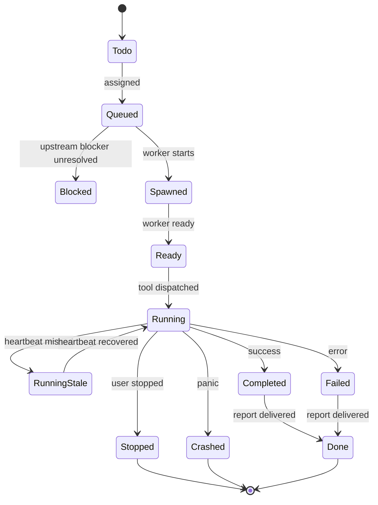
```mermaid
stateDiagram-v2
    [*] --> Todo
    Todo --> Queued: assigned
    Queued --> Blocked: upstream blocker unresolved
    Queued --> Spawned: worker starts
    Spawned --> Ready: worker ready
    Ready --> Running: tool dispatched
    Running --> RunningStale: heartbeat missed
    RunningStale --> Running: heartbeat recovered
    Running --> Completed: success
    Running --> Failed: error
    Running --> Stopped: user stopped
    Running --> Crashed: panic
    Completed --> Done: report delivered
    Failed --> Done: report delivered
    Stopped --> [*]
    Crashed --> [*]
    Done --> [*]
```

### 11.8 Server-Side Swarm Modules

`crates/jcode-app-core/src/server/` contains four swarm-related modules:

| Module | Purpose |
|--------|---------|
| `swarm.rs` | Top-level swarm logic: `broadcast_swarm_plan`, `broadcast_swarm_status`, `record_swarm_event`, `refresh_swarm_task_staleness`, `remove_session_from_swarm`, `rename_plan_participant`, `update_member_status`, `update_member_status_with_report`. Staleness is detected every `swarm_task_sweep_interval` (`pub(super) fn swarm_task_sweep_interval() -> Duration`). |
| `swarm_channels.rs` | Channel subscription helpers: `subscribe_session_to_channel`, `unsubscribe_session_from_channel`, `remove_session_channel_subscriptions`. |
| `swarm_mutation_state.rs` | Per-session mutation lock to prevent concurrent swarm state changes from racing. |
| `swarm_persistence.rs` | Load / save swarm state to `~/.jcode/swarms/<id>/state.json`. |

### 11.9 Comm (AI-to-AI) on Top of Swarm

The `comm` subsystem is the **AI-to-AI protocol** that runs on top of the swarm. It exposes 28 `Comm*` request variants and 14 `Comm*` server-event variants (see § 6.2, § 6.3). The comm subsystem handles:

- **Discovery** — list visible sessions, get capabilities.
- **Messaging** — DM, broadcast, channels.
- **Coordination** — propose / approve / reject plans, spawn, stop, assign role.
- **Status** — summary, status, report, plan status, context history.
- **Tasks** — assign task, assign next, task control, await members.

---

## 12. TUI / Presentation

### 12.1 Stack

- **TUI library:** `ratatui = "0.30"` (`Cargo.toml:186`)
- **Terminal:** `crossterm = "0.29"` with `event-stream` feature (`Cargo.toml:187`)
- **Clipboard:** `arboard = "3"` (`Cargo.toml:188`)
- **Image rendering:** `image = "0.25"` with `png`, `jpeg` only (skip avif/rav1e, exr, gif, tiff) (`Cargo.toml:189`)

### 12.2 Crate Layout

The presentation layer lives in `crates/jcode-tui/`. The crate has `default-features = false` (`Cargo.toml:206`) so the root feature set fully controls downstream features.

```
crates/jcode-tui/src/
├── lib.rs              # re-exports app + video_export
├── tui/                # 77 modules — the actual TUI app
│   ├── mod.rs
│   ├── app.rs          # top-level app state
│   ├── core.rs         # core rendering loop
│   ├── backend.rs      # terminal backend abstraction
│   ├── keybind.rs      # keybinding map
│   ├── color_support.rs
│   ├── account_picker*.rs
│   ├── login_picker.rs
│   ├── session_picker*.rs
│   ├── info_widget*.rs (15 files: graph, memory_render, memory_utils, model, todos, usage, tips, git, overview, text, swarm_background, layout)
│   ├── layout_utils.rs
│   ├── markdown.rs
│   ├── mermaid.rs
│   ├── memory_profile.rs
│   ├── permissions.rs
│   ├── remote_diff.rs
│   ├── screenshot.rs
│   ├── stream_buffer.rs
│   ├── test_harness.rs
│   ├── ui*.rs (40+ files: ui, ui_box, ui_changelog, ui_debug_capture, ui_diagram_pane, ui_diff, ui_file_diff, ui_frame_metrics, ui_header, ui_inline, ui_inline_interactive, ui_input, ui_layout, ui_memory, ui_memory_estimates, ui_messages, ui_messages_cache, ui_onboarding, ui_overlays, ui_pinned, ui_pinned_layout, ui_pinned_mermaid_debug, ui_animations, ui_render, ui_box, ...)
│   └── app/            # command handlers
│       ├── commands.rs, commands_improve.rs, commands_overnight.rs, commands_plan.rs, commands_review.rs
│       ├── auth.rs, auth_account_*.rs
│       ├── input.rs, input_help.rs
│       ├── conversation_state.rs
│       ├── copy_selection.rs
│       ├── debug.rs, debug_bench.rs, debug_cmds.rs, debug_profile.rs, debug_script.rs
│       ├── dictation.rs
│       ├── local.rs
│       └── ...
└── video_export.rs     # offline replay (TUI video export)
```

### 12.3 Presentation Re-Export Pattern

The presentation is structured as **one rustc compilation unit** (jcode-tui) that re-exports the application core (jcode-app-core → jcode-base) so the root crate (cli + bin) re-exports everything via `pub use jcode_tui::*` (`src/lib.rs:22`).

### 12.4 Modular TUI Sub-Crates

Eleven TUI sub-crates isolate frequently-changing presentation logic so they compile as separate rustc units:

| Crate | Purpose |
|-------|---------|
| `jcode-tui-markdown` | Markdown rendering |
| `jcode-tui-messages` | Message list rendering |
| `jcode-tui-mermaid` | Mermaid diagram rendering |
| `jcode-tui-core` | Core TUI primitives |
| `jcode-tui-render` | Render pipeline |
| `jcode-tui-style` | Style/theme |
| `jcode-tui-workspace` | Workspace UI |
| `jcode-tui-account-picker` | Account picker |
| `jcode-tui-session-picker` | Session picker |
| `jcode-tui-tool-display` | Tool call/result display |
| `jcode-tui-usage-overlay` | Usage overlay |

### 12.5 Info Widgets

`crates/jcode-tui/src/tui/info_widget*.rs` provides 15+ info widgets rendered in the bottom bar / side panel:

- `info_widget_overview.rs` — server/session overview
- `info_widget_model.rs` — active model + route
- `info_widget_usage.rs` — token usage
- `info_widget_memory_render.rs` + `info_widget_memory_utils.rs` — memory pipeline status
- `info_widget_graph.rs` — memory graph
- `info_widget_git.rs` — git state of working dir
- `info_widget_todos.rs` — todo list
- `info_widget_tips.rs` — tip of the day
- `info_widget_text.rs` — plain text widget
- `info_widget_swarm_background.rs` — swarm background animation
- `info_widget_layout.rs` — layout
- `info_widget_tests.rs` — widget tests

### 12.6 Side Panel

`crates/jcode-base/src/side_panel.rs` (re-exported) defines `SidePanelSnapshot` (in `jcode-side-panel-types`) which is streamed to the TUI via `ServerEvent::SidePanelState { snapshot: SidePanelSnapshot }` (see § 6.3).

### 12.7 Pinned Pane

`ui_pinned.rs` + `ui_pinned_layout.rs` + `ui_pinned_mermaid_debug.rs` implement a **pinned pane** that can show a mermaid diagram, a file diff, or a memory graph at the bottom of the TUI. The mermaid rendering is provided by `jcode-tui-mermaid` and the diagram pane by `ui_diagram_pane.rs`.

### 12.8 Inline Interactive UI

`ui_inline.rs` + `ui_inline_interactive.rs` + `inline_interactive.rs` (in `app/`) implement the **inline interactive prompts** — e.g. multi-choice questions, "yes / no / cancel" prompts, file-pickers, model-pickers — that appear inline in the message stream.

### 12.9 Onboarding

`ui_onboarding.rs` implements the first-run onboarding flow (auth provider picker, model picker, working dir confirmation).

### 12.10 Video Export

`video_export.rs` provides **offline replay**: the TUI can be re-driven from a saved event log and rendered to a video file (the README links a demo video). This is the same rendering pipeline used for live TUI, just driven by recorded events.

### 12.11 Memory Estimates

`ui_memory_estimates.rs` shows the user an estimate of memory usage per session and per tool, so the user can avoid running out of memory.

### 12.12 Animation / Effects

`ui_animations.rs` + `info_widget_swarm_background.rs` + `desktop/animation.rs` provide subtle background animations (the swarm background widget, the loading cursor) using `tokio::time::interval` and `ratatui`'s `Frame` API.

### 12.13 Layout

`ui_layout.rs` + `layout_utils.rs` + `ui_pinned_layout.rs` implement the responsive layout system. The TUI has three primary panes (chat, info bar, side panel) and a pinned overlay; the layout adapts to terminal size.

### 12.14 Test Harness

`test_harness.rs` provides a programmatic TUI driver for tests. The TUI can be advanced one frame at a time, fed events, and asserted on its rendered output.

---

## 13. Ambient Mode

Ambient mode is a **long-running autonomous cycle** that runs while the user is not actively typing. It wakes up periodically, reads recent activity, and either (a) produces a visible message that interrupts the user, or (b) silently updates memory and goes back to sleep.

### 13.1 Subsystems

`crates/jcode-app-core/src/ambient/` contains 7 submodules:

| File | Purpose |
|------|---------|
| `directives.rs` | User-issued directives for the ambient cycle (e.g. "always check for X"). |
| `manager.rs` | The `AmbientManager` — top-level coordinator. |
| `paths.rs` | Path resolution for ambient state. |
| `persistence.rs` | `AmbientLock` + `ScheduledQueue` (persisted state for the cycle). |
| `prompt.rs` | System prompt builder for ambient cycles. |
| `runner.rs` | The actual cycle executor. |
| `scheduler.rs` | Wakes the runner on schedule. |
| `runner_tests.rs` | Tests. |

`crates/jcode-app-core/src/ambient_runner.rs` re-exports `runner::*` for convenience.

### 13.2 Visible Cycle Handoff

`crates/jcode-app-core/src/ambient.rs:34-58` defines `VisibleCycleContext`:

```rust
pub struct VisibleCycleContext {
    pub system_prompt: String,
    pub initial_message: String,
}

impl VisibleCycleContext {
    pub fn context_path() -> Result<PathBuf> {
        Ok(storage::jcode_dir()?.join("ambient").join("visible_cycle.json"))
    }
    pub fn save(&self) -> Result<()>
    pub fn load() -> Result<Self>
}
```

When an ambient cycle decides to **escalate** to a visible TUI cycle, it writes a `VisibleCycleContext` to `~/.jcode/ambient/visible_cycle.json`. The next TUI run picks this up and shows the message to the user with a marker indicating its ambient origin.

### 13.3 Prompt Builder

`crates/jcode-base/src/ambient/prompt.rs` exposes `build_ambient_system_prompt(...)` which composes:

- The base system prompt.
- The user's directives.
- The memory-graph health (`MemoryGraphHealth`).
- Recent session info (`RecentSessionInfo`).
- Resource budget (`ResourceBudget`).
- Feedback memories (`gather_feedback_memories`).

The function `format_scheduled_session_message` formats the message that is shown in the visible TUI when an ambient cycle escalates.

### 13.4 Scheduler

`scheduler.rs` keeps a **scheduled queue** (`ScheduledQueue`) of pending ambient jobs. The queue is persisted (so it survives server reload). When a job's schedule triggers, the scheduler wakes the runner.

### 13.5 Runner

`runner.rs` executes one ambient cycle:

1. Acquire the `AmbientLock` (prevents two cycles from running concurrently).
2. Build the system prompt.
3. Run a short agent turn (no user message, just an internal "what should I do?" prompt).
4. Either: (a) write a `VisibleCycleContext` and return Escalated, or (b) silently update memory and return Silent.

### 13.6 Overnight Mode

`crates/jcode-app-core/src/overnight.rs` is a related but distinct subsystem: a **long, uninterrupted agent run** that operates while the user is away. It is more aggressive than ambient mode (no scheduled wakeups, just one long run) and is exposed to the user as a TUI command.

---

## 14. Selfdev Mode

### 14.1 What It Is

Selfdev mode lets the agent **modify jcode itself**. The agent is given a focused prompt set (`crates/jcode-base/src/prompt/selfdev_*.txt`), a focused tool set, and the ability to trigger an in-place server reload.

### 14.2 Prompt Overlays

`crates/jcode-base/src/prompt/`:

| File | Purpose |
|------|---------|
| `selfdev_mode.txt` | The base selfdev mode prompt. |
| `selfdev_focus_desktop.txt` | Desktop-specific focus areas. |
| `selfdev_focus_tui.txt` | TUI-specific focus areas. |
| `selfdev_hint.txt` | Hint text for the agent. |
| `mission_continuation.md` | Used when a selfdev cycle continues an in-flight mission. |
| `system_prompt.md` | The base system prompt. |

### 14.3 Selfdev Tool

`crates/jcode-app-core/src/tool/selfdev/` (6 files):

| File | Purpose |
|------|---------|
| `mod.rs` | Top-level entry. |
| `build_queue.rs` | Queue of pending selfdev builds. |
| `launch.rs` | Launch a selfdev cycle. |
| `reload.rs` | Trigger a server reload after a selfdev change. |
| `status.rs` | Report selfdev build status. |
| `tests.rs` | Tests. |

The `reload.rs` submodule chains to the server's `/reload` path — the agent calls the selfdev tool, the tool chains to `ServerRuntime::reload`, the server `exec`s into the new binary, and the new behavior takes effect.

### 14.4 Selfdev Crate

`crates/jcode-selfdev-types` exposes the **types** used by selfdev (status enums, build queue entries, mode flags) so they can be referenced from the protocol and from the TUI without depending on the app core.

### 14.5 Selfdev CLI

`src/cli/selfdev.rs` is the CLI surface for selfdev (init, status, abort, attach). It is wired into the dispatch table in `src/cli/commands.rs`.

### 14.6 Why It Works

The selfdev flow works because:

1. The server is a single process that can be `exec`'d in place.
2. The TUI client auto-reconnects on disconnect.
3. The build artifacts are reproducible (`cargo build` is the only build step).
4. The prompt overlays guide the agent to make minimal, focused changes.
5. The `selfdev` tool exposes the build queue so the user can see what is queued.

---

## 15. Desktop App

### 15.1 Stack

The desktop app lives in `crates/jcode-desktop/`. It is a **native desktop app** built on a **custom scene engine** (not Tauri/webview). 28 source modules in `crates/jcode-desktop/src/`.

### 15.2 Module List

| File | Purpose |
|------|---------|
| `animation.rs` | Animation primitives. |
| `desktop_app_driver.rs` | Top-level app driver. |
| `desktop_benchmark.rs` | Benchmarking. |
| `desktop_config.rs` | Desktop-specific config. |
| `desktop_gallery.rs` | Demo gallery. |
| `desktop_ipc.rs` | IPC to the jcode server. |
| `desktop_issue_browser.rs` | Browse issues from a project tracker. |
| `desktop_issue_cache.rs` | Local issue cache. |
| `desktop_log.rs` | Logging. |
| `desktop_prefs.rs` | User preferences. |
| `desktop_protocol.rs` | Desktop ↔ server protocol (extends `jcode-protocol`). |
| `desktop_rich_text.rs` | Rich text rendering. |
| `desktop_scene.rs` | Scene graph. |
| `desktop_session_events.rs` | Session event stream. |
| `desktop_ui_engine.rs` | UI engine (rendering, hit testing, focus). |
| `desktop_worker_host.rs` | Worker process host. |
| `main.rs` | Binary entry. |
| `main_tests.rs` | Tests. |
| `power_inhibit.rs` | Power inhibit (prevent sleep during long ops). |
| `render_helpers.rs` | Render helpers. |
| `session_data.rs` | Session data model. |
| `session_launch/` | Session launch helpers. |
| `session_launch.rs` | Session launch. |
| `single_session_render/` | Single-session render helpers. |
| `single_session_render.rs` | Single-session render. |
| `single_session.rs` | Single-session mode. |
| `workspace.rs` | Workspace (multi-session). |
| `workspace_tests.rs` | Tests. |

### 15.3 Architecture

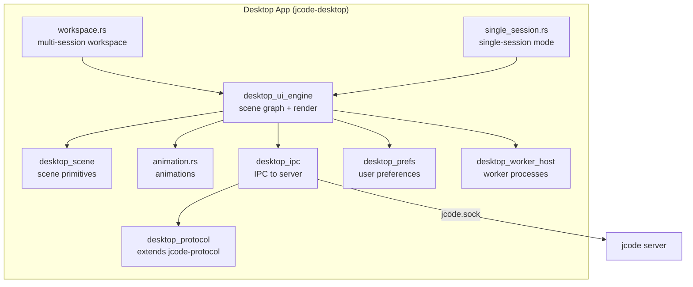
```mermaid
graph TB
    subgraph Desktop["Desktop App (jcode-desktop)"]
        UI["desktop_ui_engine<br/>scene graph + render"]
        SCN["desktop_scene<br/>scene primitives"]
        ANI["animation.rs<br/>animations"]
        WS["workspace.rs<br/>multi-session workspace"]
        SS["single_session.rs<br/>single-session mode"]
        IPC["desktop_ipc<br/>IPC to server"]
        PROTO["desktop_protocol<br/>extends jcode-protocol"]
        PREFS["desktop_prefs<br/>user preferences"]
        WH["desktop_worker_host<br/>worker processes"]
    end

    UI --> SCN
    UI --> ANI
    WS --> UI
    SS --> UI
    UI --> IPC
    IPC --> PROTO
    UI --> PREFS
    UI --> WH
    IPC -->|"jcode.sock"| SR["jcode server"]
```

The desktop app is a **thin client** to the jcode server — it does not duplicate any agent logic. It connects to the same Unix socket as the TUI client, but renders a graphical UI instead of a TUI.

### 15.4 Workspace vs Single-Session

- `single_session.rs` / `single_session_render.rs` — one session, one window.
- `workspace.rs` — multiple sessions, tabs / split views.

The workspace is the default mode for power users; the single-session mode is the simple mode.

---

## 16. Mobile (iOS / Simulator)

### 16.1 Crates

| Crate | Purpose |
|-------|---------|
| `jcode-mobile-core` | iOS host logic. |
| `jcode-mobile-sim` | Mobile simulator (desktop-side). |

### 16.2 iOS Host

The `ios/` directory contains a native iOS app that embeds a UI for driving a jcode session. The iOS app connects to the jcode server via the **jade relay** (`crates/jcode-app-core/src/server/jade_relay.rs`, see § 5.8.2) when on a remote network, or directly to the Unix socket / TCP bridge when on the same network.

The iOS host documents are in `docs/IOS_CLIENT.md` and `docs/MOBILE_IOS_HOST_INTEGRATION.md` and `docs/MOBILE_AGENT_SIMULATOR.md` and `docs/MOBILE_SIMULATOR_WORKFLOW.md` and `docs/MOBILE_SWIFT_AUDIT.md`.

### 16.3 Mobile Simulator

`crates/jcode-mobile-sim/` is a desktop-side **simulator** for the iOS host. It drives a jcode server exactly as the iOS app would, and renders the result in a TUI. It is used for development and testing without needing a real iOS device.

### 16.4 Workflow

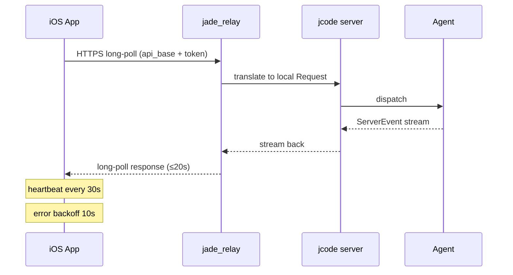
```mermaid
sequenceDiagram
    participant iOS as iOS App
    participant Relay as jade_relay
    participant Server as jcode server
    participant Agent as Agent

    iOS->>Relay: HTTPS long-poll (api_base + token)
    Relay->>Server: translate to local Request
    Server->>Agent: dispatch
    Agent-->>Server: ServerEvent stream
    Server-->>Relay: stream back
    Relay-->>iOS: long-poll response (≤20s)
    Note over iOS: heartbeat every 30s
    Note over iOS: error backoff 10s
```

Constants (from `jade_relay.rs:17-20`):

```rust
const RELAY_LONG_POLL_SECONDS: u32 = 20;
const HEARTBEAT_INTERVAL: Duration = Duration::from_secs(30);
const ERROR_BACKOFF: Duration = Duration::from_secs(10);
const MAX_RESPONSE_CHARS: usize = 12_000;
```

---

## 17. Cross-Cutting Concerns

### 17.1 Allocator Tuning

`src/main.rs:1-47` configures the allocator based on the feature set:

| Configuration | Source |
|---------------|--------|
| `feature = "jemalloc"` | `src/main.rs:1-19` — uses `tikv-jemallocator` with `dirty_decay_ms:1000,muzzy_decay_ms:1000,narenas:4` (or + `prof:true,prof_active:false` for `jemalloc-prof`). |
| `linux && !jemalloc` | `src/main.rs:30-47` — uses glibc with `mallopt(M_ARENA_MAX, 4)` (overridable via `JCODE_GLIBC_ARENA_MAX`). |

The comment at `src/main.rs:5-13` explains the tuning:

> "Tune jemalloc for a long-running server with bursty allocations (e.g. loading and unloading an ~87 MB ONNX embedding model). The defaults (muzzy_decay_ms:0, retain:true, narenas:8*ncpu) caused 1.4 GB RSS in previous testing."

The default of `narenas:4` is for a 17-thread workload. The `dirty_decay_ms` and `muzzy_decay_ms` of 1000ms each return dirty/muzzy pages to the OS after 1s of idle.

### 17.2 TLS

`src/main.rs:51` installs `rustls::crypto::aws_lc_rs::default_provider()` as the default crypto provider. This is required for `aws-sdk-bedrockruntime` which uses `aws-lc-rs`.

### 17.3 macOS Hotkey Listener

`src/main.rs:53-60` intercepts the special `setup-hotkey --listen-macos-hotkey` invocation and runs it on the **real main thread** (required for Carbon `RegisterEventHotKey`). The detection function `is_macos_hotkey_listener_invocation` is at line 70-72, and the helper `args_are_macos_hotkey_listener` is at line 74-78. Tests at line 80-108.

The hotkey is a `global-hotkey = "0.7"` dependency (line 267, `target.'cfg(target_os = "macos")'.dependencies`).

### 17.4 Tokio Runtime

`src/main.rs:62-64` builds a `tokio::runtime::Builder::new_multi_thread().enable_all().build()` and runs `jcode::run().await` on it.

### 17.5 Logging

`crates/jcode-base/src/logging.rs` is initialized in `startup.rs:18` (`logging::init()`) and old logs are cleaned up in `startup.rs:20` (`logging::cleanup_old_logs()`).

### 17.6 Telemetry

`crates/jcode-base/src/telemetry.rs` records first-run install (`record_install_if_first_run`) and upgrade detection (`record_upgrade_if_needed`) at startup (`startup.rs:86-87`). The `telemetry/` subdir contains `lifecycle.rs`, `state_support.rs`, and `tests.rs`.

### 17.7 Update Check

A background update check is spawned at `startup.rs:91` (`spawn_background_update_check(&args)`). The implementation is in `crates/jcode-app-core/src/update.rs` and `crates/jcode-update-core/`.

### 17.8 Platform Hardening

`crates/jcode-base/src/platform.rs` (used at `startup.rs:77`) calls `raise_nofile_limit_best_effort(8_192)`. This raises the `RLIMIT_NOFILE` to at least 8,192 file descriptors so the server can hold many concurrent client sockets and MCP connections.

`storage::harden_user_config_permissions()` (`startup.rs:80`) sets owner-only permissions on `~/.config/jcode` and `~/.jcode`.

### 17.9 Config Reload Reactions

`startup.rs:24-28` wires two config-reload reactions:

```rust
crate::config::on_config_reloaded(|| crate::auth::AuthStatus::invalidate_cache());
crate::config::on_config_reloaded(|| crate::bus::Bus::global().publish_models_updated());
```

When the config cache reloads (e.g. user edited `config.json`), the auth-status cache is invalidated and a `models-updated` event is broadcast on the bus.

### 17.10 Bus

`crates/jcode-base/src/bus.rs` is the **in-process event bus**. Key types (from grep):

```rust
pub enum ToolStatus { ... }
pub struct ToolEvent { ... }
pub struct TodoEvent { ... }
pub struct ToolSummaryState { ... }
pub struct ToolSummary { ... }
pub struct SubagentStatus { ... }
pub struct ManualToolCompleted { ... }
pub enum FileOp { ... }
pub struct FileTouch { ... }
pub struct LoginCompleted { ... }
```

The bus is used for cross-module events that do not need to cross the process boundary (vs. `ServerEvent` which does).

### 17.11 Process Title

`crates/jcode-base/src/process_title.rs` sets the process title (`proctitle = "0.1"`, `Cargo.toml:140`) so the server shows up in `ps`/`top` with a meaningful name like "jcode-server".

### 17.12 Performance / Resource Budget

`crates/jcode-app-core/src/perf.rs` provides background resource monitoring. It is initialized in `startup.rs:83` (`perf::init_background()`).

`crates/jcode-base/src/process_memory.rs` exposes the current process's memory usage for the TUI's memory estimates widget (`ui_memory_estimates.rs`).

`crates/jcode-app-core/src/telemetry_state.rs` and `telemetry_tests.rs` provide the telemetry state for ambient / overnight modes.

### 17.13 Build Profiles

`Cargo.toml:269-296` defines five profiles:

| Profile | `opt-level` | `debug` | `codegen-units` | `incremental` | `lto` |
|---------|-------------|---------|------------------|----------------|-------|
| `release` | 1 | 0 | 256 | true | — |
| `release-lto` | 1 (inherits) | 0 (inherits) | 16 | false | thin |
| `selfdev` | 0 | — | — | — | — |
| `dev` | — | 0 | — | true | — |
| `test` | — | 0 | 256 | true | — |

The release profile is optimized for **fast compile + low RSS** (not maximum perf), while `release-lto` is the stable distribution build with thin LTO and 16 codegen units.

---

## 18. Performance Characteristics

### 18.1 RSS (from README)

The README documents the following RSS numbers (1 active session, local embedding on):

| Tool | RSS | Comparison |
|------|-----|------------|
| jcode (local embedding off) | 27.8 MB | baseline |
| jcode | 167.1 MB | 6.0× more RAM |

(README is at `README.md:58-100`.)

### 18.2 Compile Performance

The workspace is split to keep the largest rustc unit's peak memory bounded. The `compile_performance_plan.md` doc is at `docs/COMPILE_PERFORMANCE_PLAN.md`.

### 18.3 Boot Time

`startup.rs:13-96` is wrapped in `startup_profile::init()` / `mark(...)` calls that print per-step timings on stderr. The marks are: `panic_hook`, `logging_init`, `log_cleanup`, `nofile_limit`, `perm_harden`, `perf_init`, `telemetry_check`.

### 18.4 Async Runtime

`tokio = "1"` with `fs`, `io-std`, `io-util`, `macros`, `net`, `process`, `rt-multi-thread`, `signal`, `sync`, `time` features (`Cargo.toml:107`). Multi-thread runtime with all features enabled.

---

## 19. Data Flow Diagrams

### 19.1 First-Run vs Subsequent-Run

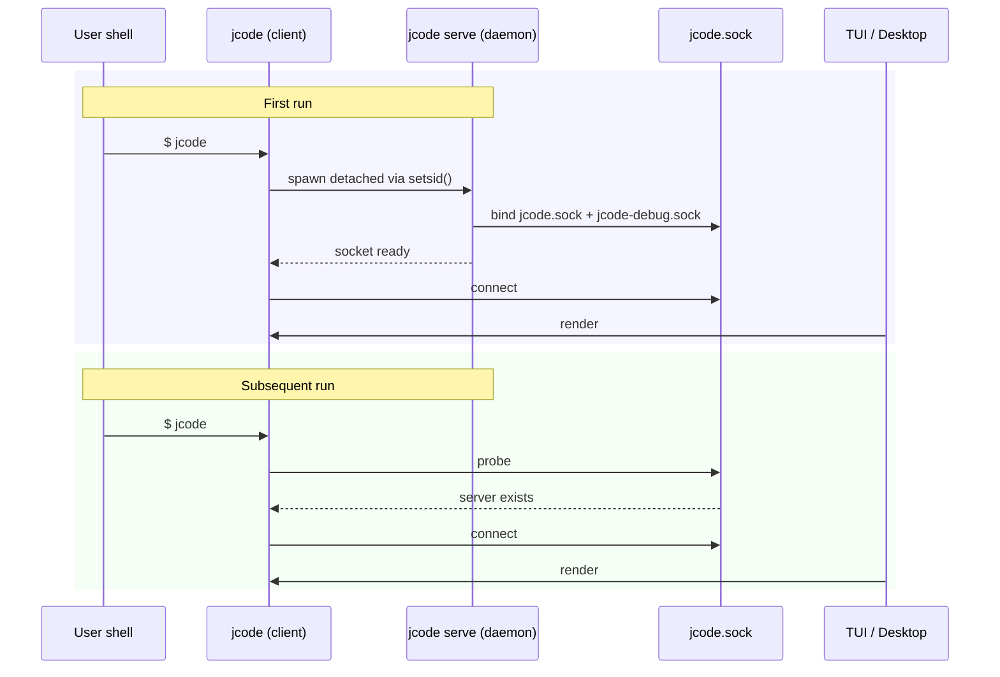
```mermaid
sequenceDiagram
    participant U as User shell
    participant C as jcode (client)
    participant S as jcode serve (daemon)
    participant SOC as jcode.sock
    participant TUI as TUI / Desktop

    rect rgb(245, 245, 255)
    Note over U,S: First run
    U->>C: $ jcode
    C->>S: spawn detached via setsid()
    S->>SOC: bind jcode.sock + jcode-debug.sock
    S-->>C: socket ready
    C->>SOC: connect
    TUI->>C: render
    end

    rect rgb(245, 255, 245)
    Note over U,S: Subsequent run
    U->>C: $ jcode
    C->>SOC: probe
    SOC-->>C: server exists
    C->>SOC: connect
    TUI->>C: render
    end
```

### 19.2 Message Flow (TUI → Server → Provider → TUI)

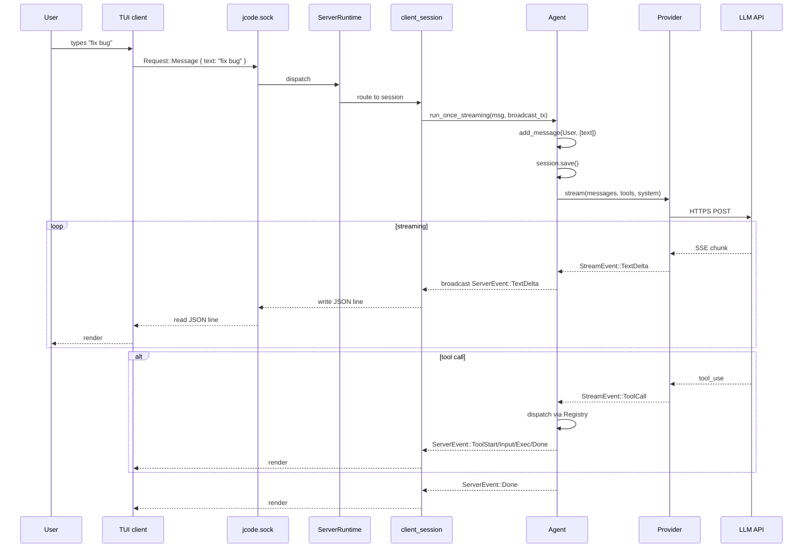
```mermaid
sequenceDiagram
    participant U as User
    participant TUI as TUI client
    participant SOC as jcode.sock
    participant SR as ServerRuntime
    participant CS as client_session
    participant AG as Agent
    participant PROV as Provider
    participant LLM as LLM API

    U->>TUI: types "fix bug"
    TUI->>SOC: Request::Message { text: "fix bug" }
    SOC->>SR: dispatch
    SR->>CS: route to session
    CS->>AG: run_once_streaming(msg, broadcast_tx)
    AG->>AG: add_message(User, [text])
    AG->>AG: session.save()
    AG->>PROV: stream(messages, tools, system)
    PROV->>LLM: HTTPS POST
    loop streaming
        LLM-->>PROV: SSE chunk
        PROV-->>AG: StreamEvent::TextDelta
        AG-->>CS: broadcast ServerEvent::TextDelta
        CS-->>SOC: write JSON line
        SOC-->>TUI: read JSON line
        TUI-->>U: render
    end
    alt tool call
        LLM-->>PROV: tool_use
        PROV-->>AG: StreamEvent::ToolCall
        AG->>AG: dispatch via Registry
        AG-->>CS: ServerEvent::ToolStart/Input/Exec/Done
        CS-->>TUI: render
    end
    AG-->>CS: ServerEvent::Done
    CS-->>TUI: render
```

### 19.3 Server Hot Reload (`/reload`)

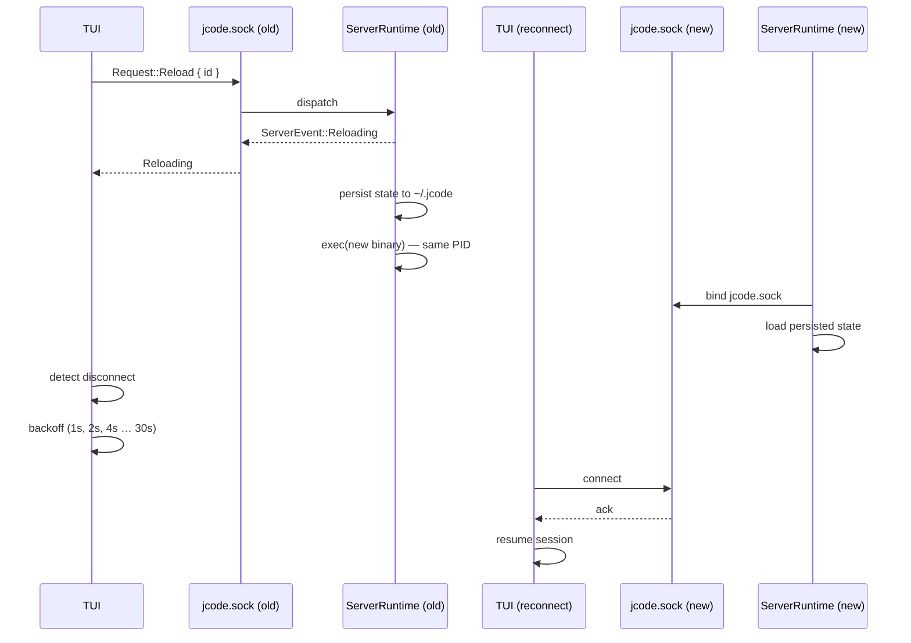
```mermaid
sequenceDiagram
    participant TUI as TUI
    participant SOC1 as jcode.sock (old)
    participant SR as ServerRuntime (old)
    participant TUI2 as TUI (reconnect)
    participant SOC2 as jcode.sock (new)
    participant SR2 as ServerRuntime (new)

    TUI->>SOC1: Request::Reload { id }
    SOC1->>SR: dispatch
    SR-->>SOC1: ServerEvent::Reloading
    SOC1-->>TUI: Reloading
    SR->>SR: persist state to ~/.jcode
    SR->>SR: exec(new binary) — same PID
    SR2->>SOC2: bind jcode.sock
    SR2->>SR2: load persisted state
    TUI->>TUI: detect disconnect
    TUI->>TUI: backoff (1s, 2s, 4s … 30s)
    TUI2->>SOC2: connect
    SOC2-->>TUI2: ack
    TUI2->>TUI2: resume session
```

### 19.4 Swarm Task Assignment (Coordinator → Worker)

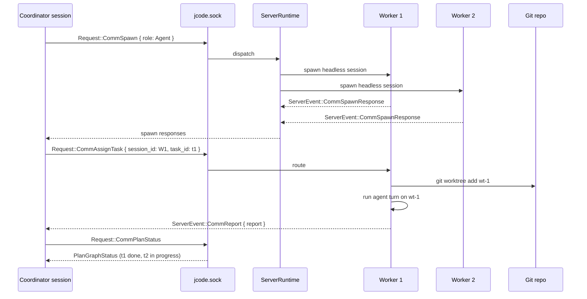
```mermaid
sequenceDiagram
    participant COORD as Coordinator session
    participant SOCK as jcode.sock
    participant SR as ServerRuntime
    participant W1 as Worker 1
    participant W2 as Worker 2
    participant REPO as Git repo

    COORD->>SOCK: Request::CommSpawn { role: Agent }
    SOCK->>SR: dispatch
    SR->>W1: spawn headless session
    SR->>W2: spawn headless session
    W1-->>SR: ServerEvent::CommSpawnResponse
    W2-->>SR: ServerEvent::CommSpawnResponse
    SR-->>COORD: spawn responses
    COORD->>SOCK: Request::CommAssignTask { session_id: W1, task_id: t1 }
    SOCK->>W1: route
    W1->>REPO: git worktree add wt-1
    W1->>W1: run agent turn on wt-1
    W1-->>COORD: ServerEvent::CommReport { report }
    COORD->>SOCK: Request::CommPlanStatus
    SOCK-->>COORD: PlanGraphStatus (t1 done, t2 in progress)
```

### 19.5 Ambient Cycle

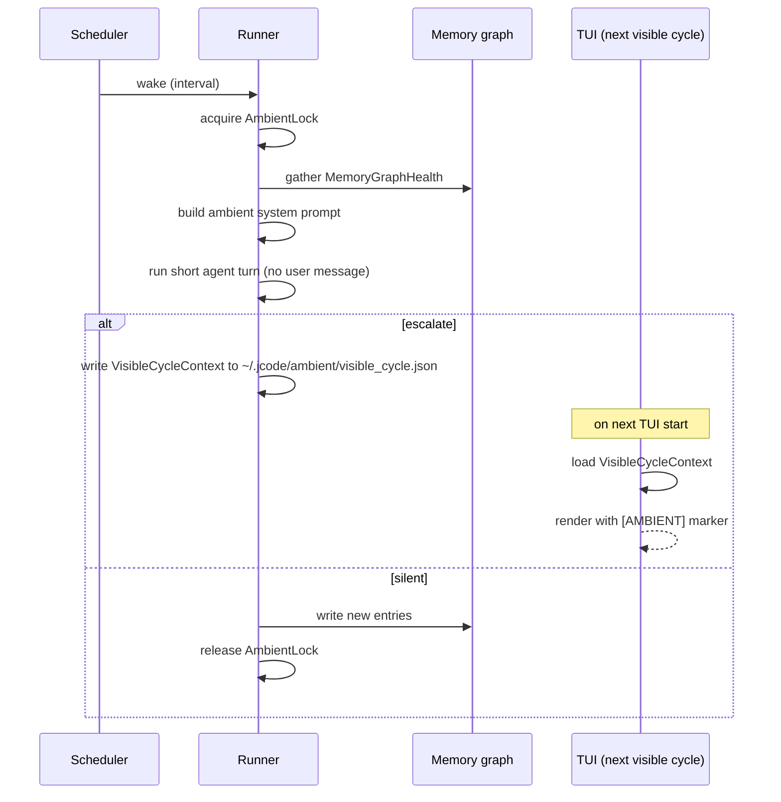
```mermaid
sequenceDiagram
    participant SCH as Scheduler
    participant RUN as Runner
    participant MG as Memory graph
    participant TUI as TUI (next visible cycle)

    SCH->>RUN: wake (interval)
    RUN->>RUN: acquire AmbientLock
    RUN->>MG: gather MemoryGraphHealth
    RUN->>RUN: build ambient system prompt
    RUN->>RUN: run short agent turn (no user message)
    alt escalate
        RUN->>RUN: write VisibleCycleContext to ~/.jcode/ambient/visible_cycle.json
        Note over TUI: on next TUI start
        TUI->>TUI: load VisibleCycleContext
        TUI-->>TUI: render with [AMBIENT] marker
    else silent
        RUN->>MG: write new entries
        RUN->>RUN: release AmbientLock
    end
```

### 19.6 Selfdev Reload

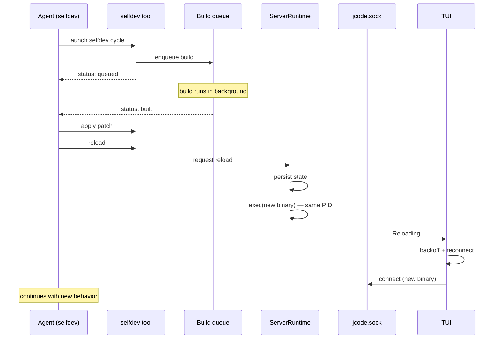
```mermaid
sequenceDiagram
    participant AG as Agent (selfdev)
    participant SDT as selfdev tool
    participant BQ as Build queue
    participant SR as ServerRuntime
    participant SOC as jcode.sock
    participant TUI as TUI

    AG->>SDT: launch selfdev cycle
    SDT->>BQ: enqueue build
    SDT-->>AG: status: queued
    Note over BQ: build runs in background
    BQ-->>AG: status: built
    AG->>SDT: apply patch
    AG->>SDT: reload
    SDT->>SR: request reload
    SR->>SR: persist state
    SR->>SR: exec(new binary) — same PID
    SOC-->>TUI: Reloading
    TUI->>TUI: backoff + reconnect
    TUI->>SOC: connect (new binary)
    Note over AG: continues with new behavior
```

---

## 20. State Machines

### 20.1 Server Lifecycle

See § 5.4 for the mermaid state diagram. Summary:

```
Spawned → Detached (setsid) → Listening (bind) → Active (≥1 client) → Idle (no clients) → Shutdown
                                                                     → Reloading (exec) → Listening
```

### 20.2 Agent Turn

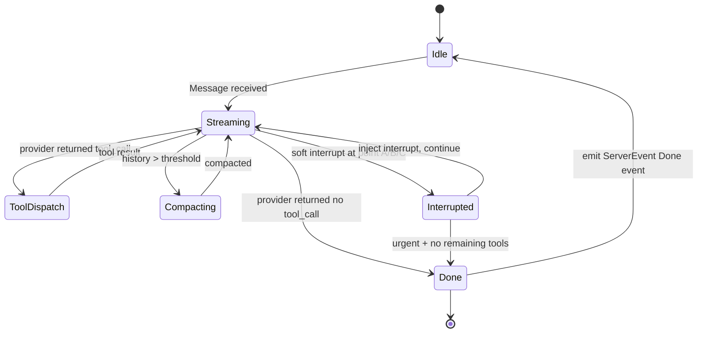
```mermaid
stateDiagram-v2
    [*] --> Idle
    Idle --> Streaming: Message received
    Streaming --> ToolDispatch: provider returned tool_call
    ToolDispatch --> Streaming: tool result
    Streaming --> Compacting: history > threshold
    Compacting --> Streaming: compacted
    Streaming --> Done: provider returned no tool_call
    Streaming --> Interrupted: soft interrupt at point A/B/C
    Interrupted --> Streaming: inject interrupt, continue
    Interrupted --> Done: urgent + no remaining tools
    Done --> Idle: emit ServerEvent Done event
    Done --> [*]
```

### 20.3 Swarm Member Lifecycle

See § 11.7. Summary:

```
Todo → Queued → Spawned → Ready → Running → (Completed|Done|Failed|Stopped|Crashed)
                                              ↘ RunningStale (recoverable)
Queued → Blocked (upstream blocker)
```

### 20.4 Tool Dispatch

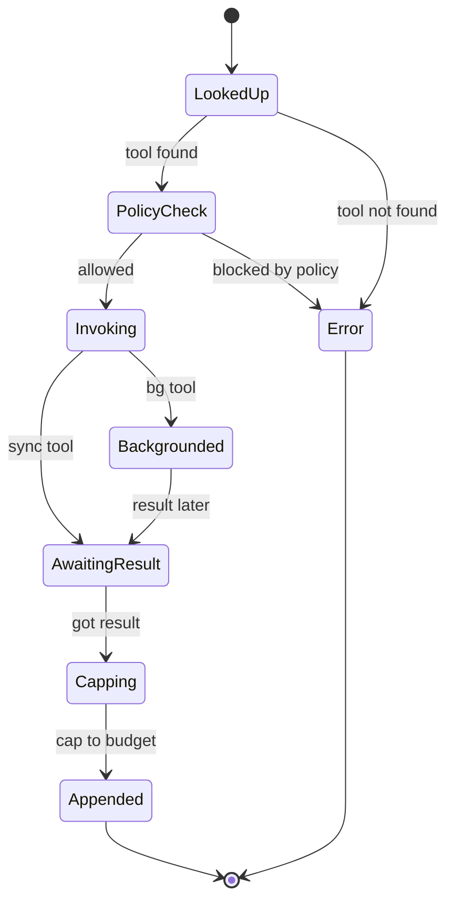
```mermaid
stateDiagram-v2
    [*] --> LookedUp
    LookedUp --> PolicyCheck: tool found
    LookedUp --> Error: tool not found
    PolicyCheck --> Invoking: allowed
    PolicyCheck --> Error: blocked by policy
    Invoking --> AwaitingResult: sync tool
    Invoking --> Backgrounded: bg tool
    AwaitingResult --> Capping: got result
    Capping --> Appended: cap to budget
    Appended --> [*]
    Backgrounded --> AwaitingResult: result later
    Error --> [*]
```

### 20.5 Provider Account Failover

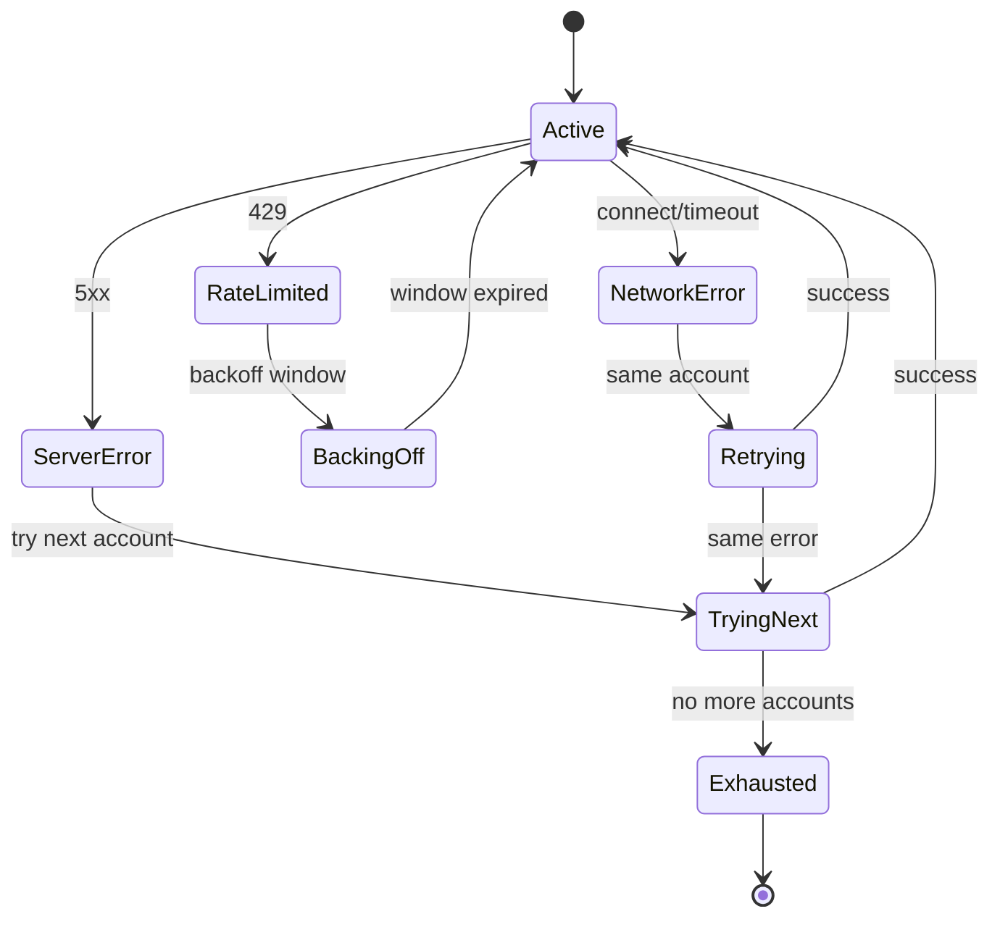
```mermaid
stateDiagram-v2
    [*] --> Active
    Active --> RateLimited: 429
    Active --> ServerError: 5xx
    Active --> NetworkError: connect/timeout
    RateLimited --> BackingOff: backoff window
    BackingOff --> Active: window expired
    ServerError --> TryingNext: try next account
    TryingNext --> Active: success
    TryingNext --> Exhausted: no more accounts
    NetworkError --> Retrying: same account
    Retrying --> Active: success
    Retrying --> TryingNext: same error
    Exhausted --> [*]
```

---

## 21. Failure Modes

| Failure | Detection | Mitigation | Source |
|---------|-----------|------------|--------|
| Corrupt session JSON | `serde_json::Error` on load | Auto-recover from `.bak` (atomic rename), copy back to primary | `storage::read_json_with_recovery_handler` (`crates/jcode-storage/src/lib.rs:331-364`) |
| Server reload mid-response | Disconnect on client | `response_recovery.rs` re-issues request with marker; `RECOVERED_TEXT_WRAPPED_TOOL_CALLS` counter | `agent/response_recovery.rs` |
| Rate limit (429) | HTTP 429 from provider | `account_failover.rs` switches to next account | `crates/jcode-base/src/provider/account_failover.rs` |
| Provider 5xx | HTTP 5xx | Same as above; also retry with backoff | `crates/jcode-base/src/provider/failover.rs` |
| Network drop | Stream disconnect | Stream keepalive ticker; client reconnects | `agent/streaming.rs` |
| Server idle 5 min | No clients | Server shuts down gracefully; state persisted | `lifecycle.rs`, `SERVER_ARCHITECTURE.md:85` |
| Open file limit | `EMFILE` | `raise_nofile_limit_best_effort(8_192)` at startup | `startup.rs:77`, `platform.rs` |
| User config world-readable | `ls -l` reveals it | `harden_user_config_permissions()` at startup | `startup.rs:80` |
| External auth file is symlink | `symlink_metadata` reveals it | `validate_external_auth_file` rejects symlinks | `storage/lib.rs:161-188` |
| Embedding model load OOM | High RSS spike | jemalloc tuning (`dirty_decay_ms:1000`) | `src/main.rs:5-19` |
| Selfdev build fails | `cargo build` exit ≠ 0 | Selfdev tool reports failure to user; no reload | `tool/selfdev/status.rs` |
| Swarm task heartbeat lost | `now_unix_ms() - last_heartbeat > stale_after` | Mark `RunningStale`, then `Failed` if no recovery | `server/swarm.rs` constants `swarm_task_heartbeat_interval`, `swarm_task_stale_after` |
| `JCODE_HOME` set but `runtime_dir` not | `jcode_dir()` checks `JCODE_HOME` | Sandbox all paths under it | `storage/lib.rs:73-141` |
| macOS hotkey listener loses run loop | Hotkey silently dead | Intercept invocation before tokio runtime, run on main thread | `src/main.rs:53-60` |
| Concurrent swarm mutations | Two coordinators update same plan | `swarm_mutation_state.rs` per-session mutation lock | `server/swarm_mutation_state.rs` |
| Agent lock held during tool | Long tool blocks agent | `BackgroundToolSignal` + soft interrupt queue | `crates/jcode-agent-runtime/src/lib.rs:23-27` |
| Tool result exceeds budget | Provider errors | `cap_tool_output_for_history` truncates to model context | `agent/tools.rs` |
| Compaction lost context | History summarized too aggressively | `VersionedPlan`-style marker persisted; recovery via `Request::GetCompactedHistory` | `agent/compaction.rs` + `compaction-core` crate |
| Stale `~/.jcode/servers.json` | Old server name entries | Auto-cleanup on startup | `SERVER_ARCHITECTURE.md:54` |

---

## 22. Code Reference Summary

### 22.1 Entry Points

| Surface | File | Purpose |
|---------|------|---------|
| Binary | `src/main.rs:49` | `fn main() -> Result<()>` — jemalloc/glibc config, TLS, tokio runtime, `jcode::run().await` |
| Library | `src/lib.rs:29` | `pub async fn run() -> Result<()>` — delegates to `cli::startup::run` |
| Startup | `src/cli/startup.rs:12` | `pub async fn run()` — 10-step ordered initialization, then `dispatch::run_main` |
| App core | `crates/jcode-app-core/src/lib.rs:21` | `pub use jcode_base::*` — re-export chain |
| Base | `crates/jcode-base/src/lib.rs:20-79` | 60+ foundational modules |
| TUI | `crates/jcode-tui/src/lib.rs` | re-exports `tui` + `video_export` |

### 22.2 Key Types by Crate

| Crate | Key Types |
|-------|-----------|
| `jcode-protocol` | `Request`, `ServerEvent`, `NotificationType`, `FeatureToggle`, `HistoryMessage`, `MemoryStateSnapshot`, `MemoryPipelineSnapshot`, `PlanGraphStatus`, `AgentInfo`, `AgentStatusSnapshot`, `SwarmMemberStatus`, `AwaitedMemberStatus` |
| `jcode-message-types` | `Message`, `Role`, `ContentBlock`, `ToolCall`, `ToolDefinition`, `InputShellResult`, `StreamEvent`, `CacheControl` |
| `jcode-tool-types` | `ToolOutput`, `ToolImage` |
| `jcode-tool-core` | `Tool` trait, `ToolContext`, `ToolExecutionMode`, `StdinInputRequest`, `intent_schema_property` |
| `jcode-session-types` | `SessionStatus`, `SessionImproveMode`, `GitState`, `EnvSnapshot`, `StoredMemoryInjection`, `StoredMessage`, `RenderedMessage`, `RenderedCompactedHistoryInfo`, `RenderedImage`, `RenderedImageSource` |
| `jcode-memory-types` | `MemoryGraph`, `Edge`, `EdgeKind`, `TagEntry`, `ClusterEntry`, `GraphMetadata`, `MemoryActivity`, `StepStatus`, `StepResult`, `PipelineState` |
| `jcode-task-types` | `BatchProgress` (and other task types) |
| `jcode-config-types` | (config types) |
| `jcode-usage-types` | (usage types) |
| `jcode-side-panel-types` | `SidePanelSnapshot`, `snapshot_is_empty` |
| `jcode-selfdev-types` | (selfdev types) |
| `jcode-ambient-types` | (ambient types) |
| `jcode-auth-types` | (auth types) |
| `jcode-gateway-types` | (gateway types) |
| `jcode-background-types` | (background task types) |
| `jcode-batch-types` | `BatchProgress` |
| `jcode-plan` | `PlanItem`, `VersionedPlan`, `SwarmTaskProgress`, `SwarmPlanItemSpec`, `SwarmPlanDefinition`, `SwarmExecutionItemState`, `SwarmExecutionState`, `PlanGraphSummary`, `TaskControlAction`, `AssignmentAffinities`, `summarize_plan_graph`, `next_runnable_item_ids`, `next_unassigned_runnable_item_id`, `assignment_loads`, `explicit_task_blocked_reason` |
| `jcode-swarm-core` | `SwarmRole`, `SwarmLifecycleStatus`, `SwarmMemberRecord`, `ChannelIndex`, `append_swarm_completion_report_instructions`, `format_structured_completion_report`, `normalize_completion_report`, `completion_notification_message`, `truncate_detail`, `summarize_plan_items`, `SWARM_COMPLETION_REPORT_MARKER`, `MAX_SWARM_COMPLETION_REPORT_CHARS` |
| `jcode-agent-runtime` | `SoftInterruptMessage`, `SoftInterruptSource`, `SoftInterruptQueue`, `BackgroundToolSignal`, `GracefulShutdownSignal`, `InterruptSignal`, `StreamError` |
| `jcode-storage` | `runtime_dir`, `jcode_dir`, `logs_dir`, `app_config_dir`, `user_home_path`, `harden_user_config_permissions`, `harden_secret_file_permissions`, `validate_external_auth_file`, `ensure_dir`, `write_text_secret`, `write_json`, `write_json_secret`, `write_json_fast`, `read_json`, `read_json_with_recovery_handler`, `append_json_line_fast`, `StorageRecoveryEvent`, `active_pids::*` |
| `jcode-provider-core` | `Provider` trait, `EventStream`, `ModelCapabilities`, `ModelCatalogRefreshSummary`, `ModelRoute`, `ModelRouteApiMethod`, `NativeCompactionResult`, `NativeToolResult`, `NativeToolResultSender`, `PremiumMode`, `ProviderFailoverPrompt`, `ProviderAvailability`, `FailoverDecision`, `RuntimeKey`, `RouteBillingKind`, `RouteCheapnessEstimate`, `RouteCostConfidence`, `RouteCostSource`, `RouteSelection`, `CHEAPNESS_REFERENCE_INPUT_TOKENS`, `CHEAPNESS_REFERENCE_OUTPUT_TOKENS`, `DEFAULT_CONTEXT_LIMIT`, `ALL_CLAUDE_MODELS`, `ALL_OPENAI_MODELS`, `JCODE_USER_AGENT`, `dedupe_model_routes`, `explicit_model_provider_prefix`, `model_name_for_provider`, `normalize_copilot_model_name`, `provider_from_model_key`, `shared_http_client`, `summarize_model_catalog_refresh`, `parse_failover_prompt_message` |

### 22.3 Module Counts (Quick Reference)

| Layer / Surface | Files |
|-----------------|-------|
| Root `src/` | ~10 (main, lib, cli/*, bin/*) |
| `crates/jcode-tui/src/tui/` | 77 |
| `crates/jcode-tui/src/tui/app/` | 40+ |
| `crates/jcode-app-core/src/server/` | 47 |
| `crates/jcode-app-core/src/agent/` | 14 |
| `crates/jcode-app-core/src/tool/` | 33 first-class |
| `crates/jcode-app-core/src/ambient/` | 7 |
| `crates/jcode-base/src/` | 60+ modules |
| `crates/jcode-base/src/provider/` | 20+ |
| `crates/jcode-base/src/memory/` | 3 runtime + higher-level modules in `memory.rs`, `memory_agent.rs`, `memory_graph.rs`, `memory_log.rs`, `memory_prompt.rs` |
| `crates/jcode-base/src/auth/` | 10+ |
| `crates/jcode-base/src/config/` | 4 |
| `crates/jcode-base/src/mcp/` | 5 |
| `crates/jcode-base/src/protocol/` | 2 (re-exports + notifications) |
| `crates/jcode-desktop/src/` | 28 |
| `crates/jcode-base/src/transport/` | 3 (mod + unix + windows) |
| `crates/jcode-protocol/src/` | 5 (lib, wire, comm_format, notifications, protocol_memory, protocol_tests) |

### 22.4 Where to Find Things

| You want to find… | Look in… |
|--------------------|----------|
| The turn loop | `crates/jcode-app-core/src/agent/turn_execution.rs`, `turn_loops.rs`, `turn_streaming_*.rs` |
| The provider trait | `crates/jcode-provider-core/src/lib.rs` |
| The provider list | `crates/jcode-base/src/provider/mod.rs` (`MultiProvider`) |
| The server main loop | `crates/jcode-app-core/src/server/runtime.rs` (`ServerRuntime`) |
| The wire types | `crates/jcode-protocol/src/wire.rs` |
| The TUI | `crates/jcode-tui/src/tui/mod.rs` → `app.rs` → `core.rs` |
| The interrupt model | `crates/jcode-agent-runtime/src/lib.rs` |
| The swarm types | `crates/jcode-swarm-core/src/lib.rs` |
| The plan DAG | `crates/jcode-plan/src/lib.rs` |
| The memory types | `crates/jcode-memory-types/src/{lib.rs,graph.rs}` |
| The session types | `crates/jcode-session-types/src/lib.rs` |
| The tool trait | `crates/jcode-tool-core/src/lib.rs` |
| The desktop app | `crates/jcode-desktop/src/main.rs` → `desktop_app_driver.rs` → `desktop_ui_engine.rs` |
| The iOS host | `ios/` |
| The startup sequence | `src/cli/startup.rs` |
| The CLI dispatch | `src/cli/dispatch.rs` |
| The CLI commands | `src/cli/commands.rs` |
| The login flow | `src/cli/login.rs` + `src/cli/login/*` |
| The selfdev CLI | `src/cli/selfdev.rs` |
| The update check | `crates/jcode-app-core/src/update.rs` |
| The performance plan | `docs/COMPILE_PERFORMANCE_PLAN.md` |
| The server architecture | `docs/SERVER_ARCHITECTURE.md` |
| The swarm architecture | `docs/SWARM_ARCHITECTURE.md` |
| The multi-session architecture | `docs/MULTI_SESSION_CLIENT_ARCHITECTURE.md` |
| The memory architecture | `docs/MEMORY_ARCHITECTURE.md` |
| The memory budget | `docs/MEMORY_BUDGET.md` |
| The iOS client | `docs/IOS_CLIENT.md` |

---

## Appendix A: Recent Changes (working tree, branch `next`)

Working tree is dirty on `next`. The git session header shows:

```
M crates/octo-telegram-onboard-core/src/output.rs        (unrelated cleanup)
D missions/open/0850ab-a-telegram-auth-onboarding.md    (mission closed)
?? .jcode/skills/adversarial-audit/                      (new skill)
?? .jcode/skills/rust-ci-check/                          (new skill)
?? re                                                    (untracked scratch dir)
```

The two new skills are workspace-local skills for the Jcode harness:

- `adversarial-audit` — cross-references an adversarial code review document against actual source code to determine which findings are fixed vs still open.
- `rust-ci-check` — runs the full Rust quality gate (cargo fmt, clippy, test) for one or more crates.

These are part of the Jcode harness and not part of the public jcode distribution.

---

## Appendix B: Glossary

| Term | Definition |
|------|------------|
| **Turn** | One user message + the agent's full response (which may include multiple provider calls and tool dispatches). |
| **Subagent** | A short-lived agent spawned by a parent agent to handle a subtask. |
| **Coordinator** | A swarm role: a session that owns the plan and dispatches tasks to agents. |
| **WorktreeManager** | A swarm role: a session that creates and manages git worktrees. |
| **Visible Cycle** | An ambient cycle that decides to escalate and show its message to the user. |
| **Server** | The long-lived `jcode serve` process that owns all session state. |
| **Daemon** | Synonym for "server" in jcode's context. |
| **TUI** | Terminal UI (ratatui/crossterm). |
| **MCP** | Model Context Protocol (Anthropic's standard for tool integration). |
| **Selfdev** | A mode where the agent modifies jcode itself. |
| **Ambient** | A mode where the agent runs long-running background cycles. |
| **Swarm** | Multiple cooperating sessions coordinated by a coordinator. |
| **Channel** | A pub/sub topic for swarm members (e.g. "build", "tests"). |
| **Plan** | A versioned DAG of tasks (`PlanItem` nodes). |
| **Jade Relay** | The long-poll HTTPS relay for the iOS host (`jade_relay.rs`). |
| **OpenAI-Compatible Profile** | An arbitrary OpenAI-protocol endpoint that jcode can talk to. |
| **Hot Reload** | The `/reload` command that execs the new binary in place. |
| **Jemalloc** | The default allocator (when feature enabled), tuned for low RSS. |
| **Reconnect Loop** | The client-side loop that handles disconnects with exponential backoff. |

---

_Document generated 2026-06-12 from `/home/mmacedoeu/_w/ai/jcode` at version 0.17.2, branch `next`, dirty working tree. All file references use the form `path:line` for direct verification._
