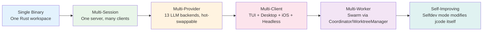
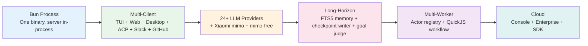
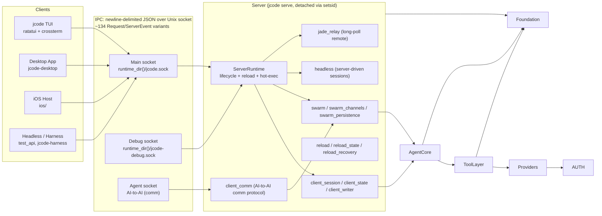
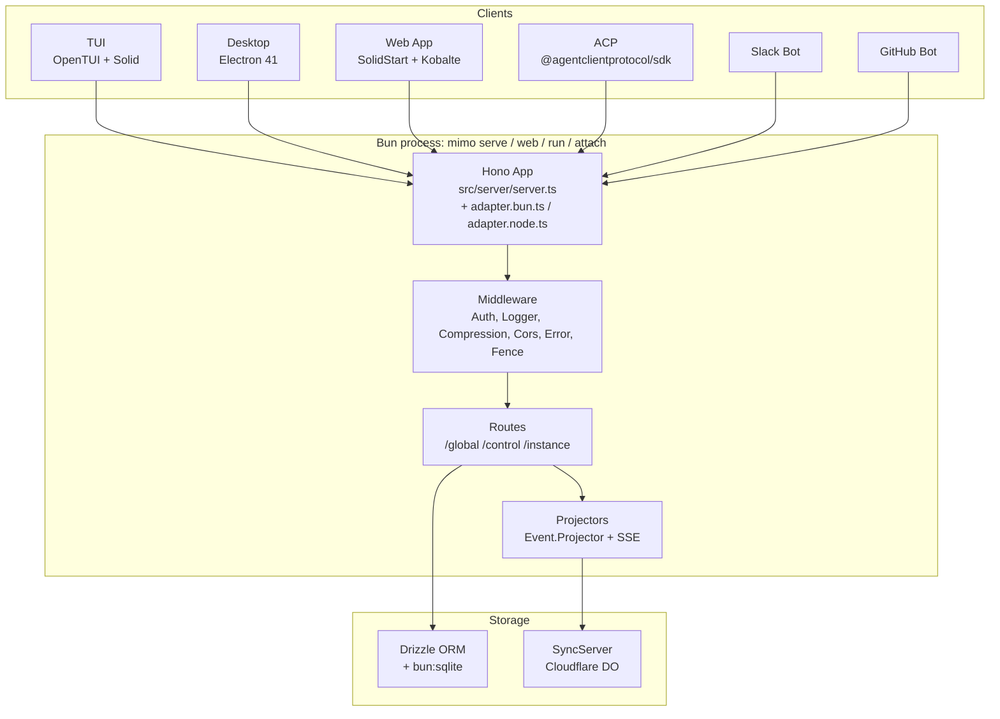
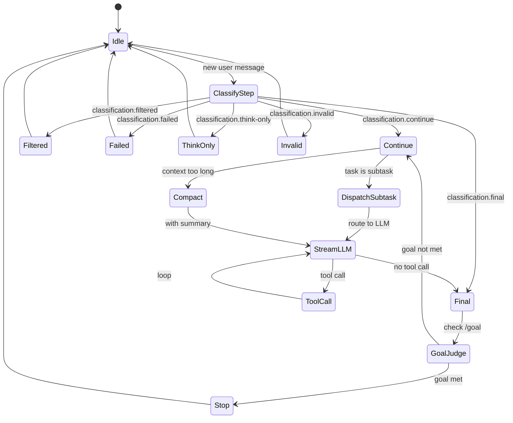

# jcode vs MiMo-Code: A Side-by-Side Architecture Comparison

**Date:** 2026-06-13
**Status:** v1 — initial pass
**Sources:**
- `/home/mmacedoeu/_w/ai/jcode` — v0.17.2 (working tree dirty on `feat/combined-262-input-history`)
- `/home/mmacedoeu/_w/ai/MiMo-Code` — HEAD `42e7da3` on `main` (forked from `anomalyco/opencode` v1.17.4)

**Prior research:**
- [`jcode-architecture.md`](jcode-architecture.md) — 20 diagrams, ~108 KB, jcode internals
- [`mimocode-architecture.md`](mimocode-architecture.md) — 22 diagrams, ~253 KB, MiMo-Code internals
- [`mimocode-vs-opencode.md`](mimocode-vs-opencode.md) — 4 diagrams, ~130 KB, MiMo-Code vs upstream OpenCode

**Mermaid:** Diagrams in this document validated with `mermaid-cli` v8, v10, and latest; safe in `bierner.markdown-mermaid` (mermaid ~8) and `Markdown Preview Mermaid Support` (mermaid ~10). Node labels use `&#60;` / `&#62;` decimal entities for Rust generic angle brackets. `stateDiagram-v2` transitions avoid the `::` separator (which fails the v10 state parser).

---

## Table of Contents

1. [Executive Summary](#1-executive-summary)
2. [Property-by-Property Comparison](#2-property-by-property-comparison)
3. [Design Philosophy](#3-design-philosophy)
4. [Language, Runtime, Build, Distribution](#4-language-runtime-build-distribution)
5. [Workspace Topology](#5-workspace-topology)
6. [Server Architecture](#6-server-architecture)
7. [Agent Loop](#7-agent-loop)
8. [Provider System](#8-provider-system)
9. [Tool System](#9-tool-system)
10. [Subagent Coordination](#10-subagent-coordination)
11. [Memory System](#11-memory-system)
12. [Storage & Persistence](#12-storage--persistence)
13. [TUI / Presentation](#13-tui--presentation)
14. [Client Surfaces](#14-client-surfaces)
15. [CLI Surface](#15-cli-surface)
16. [Wire Protocol](#16-wire-protocol)
17. [Special Features Unique to Each](#17-special-features-unique-to-each)
18. [Dependencies and Build](#18-dependencies-and-build)
19. [Glossary](#19-glossary)
20. [Code Reference Index](#20-code-reference-index)
21. [Appendices](#21-appendices)

---

## 1. Executive Summary

jcode and MiMo-Code are both terminal-first AI coding-agent harnesses that ship a TUI, a server, a multi-provider LLM stack, and a multi-client story. Beyond those broad strokes they have **almost no architectural overlap**:

| Property | jcode | MiMo-Code |
|---|---|---|
| **Language** | Rust 2024, single static binary | TypeScript on Bun (and Node), monorepo |
| **Origin** | Original, jcode-only | Fork of OpenCode v1.17.4 (June 2026) |
| **Server transport** | Unix-domain socket (newline-delimited JSON) | Hono HTTP+WS over TCP (also serves mDNS) |
| **TUI library** | `ratatui` 0.30 + `crossterm` 0.29 | `OpenTUI` 0.1.99 + Solid 1.9.10 |
| **LLM providers** | 13 hand-rolled + account failover + openai-compatible profiles | 24 `@ai-sdk/*` packages + `xiaomi` + custom Copilot SDK |
| **Tool count** | 33 first-class tools (40+ with subtools) | 21 built-in tools (registry holds 19 by default) |
| **Tool dispatch** | `Arc<dyn Tool>` + `Registry` | `ToolInfo` (interface) + `ToolRegistry` service (Effect) |
| **Subagent model** | Swarm (`Coordinator` / `WorktreeManager` / `Agent` roles, 13 lifecycle states) | Actor (one per session, four modes, worktree-isolated) + Workflow (QuickJS script) |
| **Memory** | Local ONNX embeddings + typed graph + journal + activity pipeline | FTS5-backed file tree (`MEMORY.md` etc.) + Claude Code bridge |
| **Long-horizon** | Compaction + selfdev (modifies its own source) + overnight | Checkpoint-writer subagent + goal judge + dream & distill + max-mode |
| **Storage** | `jcode-storage` (JSONL + per-session files) | Drizzle ORM over `bun:sqlite` (Node fallback) |
| **Storage scale** | State persisted to `~/.jcode/servers.json` and `~/.jcode/swarms/<id>/state.json` | 34 Drizzle migrations + 68 console migrations |
| **Configuration** | TOML + `JsonSchema` config types | JSON/JSONC, schema in `mimocode.json` + `.mimocode/` |
| **WASM usage** | None | `quickjs-emscripten` (workflow sandbox) + `ten_vad.wasm` (voice) |
| **Voice input** | `dictation` tool (provider-agnostic) | `/voice` route with TenVAD + MiMo ASR |
| **Code self-modification** | `selfdev` tool + `/reload` exec | None (no equivalent) |
| **Cloud presence** | None (purely local) | Console (Cloudflare + PlanetScale), Enterprise, function workers |
| **Auth & accounts** | Per-provider account failover, hot-swap on login | `mimo` OAuth, `mimo-free` anonymous, codex OAuth, `gitlab-ai-provider`, custom Copilot |
| **Distribution** | Single static binary per platform; `jemalloc`-tuned | Bun-launched `mimo` binary + npm `install -g @mimo-ai/cli` + `curl | bash` installer |
| **Files** | 321 `.rs` files in `crates/` + 22.5k LOC in `src/` (root) | 1,712 `.ts` files across 17 packages + 34 migrations + 68 console migrations |
| **LOC** | ~178,000 (155,000 crates + 22,500 root) | ~352,000 |
| **Migrated/inherited code** | None — written from scratch | Inherits all of OpenCode v1.17.4 (763 src/ files / 79,458 LOC) |

**One-sentence summary:** jcode is a self-contained, single-binary, multi-session Rust agent with native swarm coordination and the unique `selfdev` capability to modify its own code at runtime; MiMo-Code is a TypeScript re-platform of OpenCode that layers a Xiaomi-branded long-horizon memory/checkpoint/goal system on top of an inherited Hono+SQLite+Effect runtime.

The two are not in competition: jcode's strengths are its low memory footprint, hot-reloadable server, and self-extension; MiMo-Code's strengths are its broader provider coverage, FTS5-backed persistent memory, structured checkpoint-writer for long sessions, and web/cloud/slack/github surface area.


## 2. Property-by-Property Comparison

| Property | jcode | MiMo-Code | Evidence |
|---|---|---|---|
| **Version** | 0.17.2 | 0.1.0 (`@mimo-ai/cli`) | `jcode/Cargo.toml:3`, `mimo/packages/opencode/package.json:3` |
| **License** | MIT | MIT (source) + `USE_RESTRICTIONS.md` | `jcode/LICENSE`, `mimo/LICENSE` |
| **Language** | Rust 2024 | TypeScript 5.8.2 / 7.0.0-dev (mixed) | `jcode/Cargo.toml:5`, `mimo/package.json:118-121` |
| **Runtime** | Native (single static binary, jemalloc-tuned) | Bun 1.3.11 (Node 22+ fallback) | `jcode/src/main.rs:1-47`, `mimo/package.json:7` |
| **Edition / Node** | n/a | `engines: { node: ">=22" }` in `packages/app` | `mimo/packages/app/package.json:46-50` |
| **Workspace members** | 56 Cargo crates | 17 packages + 1 SDK + 5 infra | `jcode/Cargo.toml:8-67`, `mimo/packages/` |
| **Source files** | 321 `.rs` in `crates/` + root `src/` (`.rs` + bin) | 1,712 `.ts`/`.tsx` | `find` counts |
| **LOC** | ~178,000 (155k crates + 22.5k root) | ~352,000 | `wc -l` totals |
| **Build tool** | `cargo` + 6 `[[bin]]` targets | `bun` + Turborepo 2.8.13 + SST 3.18.10 | `jcode/Cargo.toml:73-97`, `mimo/package.json:40` |
| **Linter / formatter** | `cargo fmt` + `cargo clippy` (default) | `oxlint` 1.60.0 + `prettier` | `mimo/package.json:135` |
| **Distribution** | 6 binaries: `jcode`, `test_api`, `jcode-harness`, `session_memory_bench`, `mermaid_side_panel_probe`, `tui_bench` | One binary: `mimo` (shell shim → `bin/opencode` runtime) | `jcode/Cargo.toml:73-97`, `mimo/packages/opencode/bin/mimo` |
| **Install** | `cargo install --path .` | `curl -fsSL https://mimo.xiaomi.com/install | bash` OR `npm i -g @mimo-ai/cli` | `mimo/install` |
| **CI / release** | `codemagic.yaml` + `RELEASING.md` | `script/{build,publish,version,release,sign-windows.ps1}.ts` | `jcode/codemagic.yaml`, `mimo/script/` |
| **Default features** | `["pdf", "embeddings"]` | (none) | `jcode/Cargo.toml:243`, `mimo/packages/opencode/package.json` |
| **Allocator** | jemalloc (tuned) with glibc `M_ARENA_MAX=4` fallback | n/a (uses Bun's allocator) | `jcode/src/main.rs:1-47` |
| **TUI library** | `ratatui` 0.30 + `crossterm` 0.29 + `arboard` 3 | `@opentui/core` 0.1.99 + `@opentui/solid` 0.1.99 + `tailwind` plugin | `jcode/Cargo.toml:186-189`, `mimo/packages/opencode/src/cli/cmd/tui/` |
| **Image rendering** | `image` 0.25 (png + jpeg only) | `jpeg-js` + `pngjs` (custom image protocol) | `jcode/Cargo.toml:189`, `mimo/packages/opencode/src/cli/cmd/tui/` |
| **HTTP client** | `reqwest` 0.12 + `rustls` (aws_lc_rs) + `tokio-tungstenite` | (none) — uses provider SDKs directly | `jcode/Cargo.toml:111-114` |
| **Web framework** | None — bespoke wire protocol over Unix socket | Hono (with `@hono/node-server` + `@hono/node-ws`) | `mimo/packages/opencode/src/server/server.ts` |
| **OpenAPI** | None | `hono-openapi` → `openapi.json` → `@hey-api/openapi-ts` | `mimo/packages/opencode/src/server/` |
| **Async runtime** | `tokio` (multi-thread) | `effect` (4.0.0-beta) + Bun-native promises | `jcode/Cargo.toml`, `mimo/packages/opencode/src/effect/` |
| **DB / ORM** | None (JSONL + per-session files in `jcode-storage`) | Drizzle ORM 1.0.0-beta.19 + `bun:sqlite` | `mimo/packages/opencode/src/storage/db.ts` |
| **Migrations** | None (schema-less) | 34 Drizzle migrations + 68 console migrations | `mimo/packages/opencode/migration/`, `mimo/packages/console/core/migrations/` |
| **WASM modules** | None | `quickjs-emscripten` (workflow), `ten_vad.wasm` (voice) | `mimo/packages/opencode/src/workflow/`, `mimo/packages/opencode/src/cli/cmd/tui/asset/` |
| **LSP** | `lsp` tool + `lsp/language.ts` analog | `lsp/language.ts` (vscode-jsonrpc, 100+ langs) | jcode's `crates/jcode-app-core/src/tool/lsp.rs`, `mimo/packages/opencode/src/lsp/` |
| **MCP** | `mcp` tool, shared MCP pool across sessions | `mcp/index.ts` (stdio, Streamable-HTTP, SSE, full OAuth) | `jcode/crates/jcode-app-core/src/tool/mcp.rs`, `mimo/packages/opencode/src/mcp/` |
| **ACP** | `src/cli/acp.rs` | `src/cli/cmd/acp.ts` + `src/acp/agent.ts` (1,783 LOC) | `jcode/src/cli/acp.rs`, `mimo/packages/opencode/src/cli/cmd/acp.ts` |
| **Provider trait** | `Provider` trait in `jcode-provider-core` | `Provider` namespace in `provider/provider.ts` (1,787 LOC) | `jcode/crates/jcode-provider-core/src/lib.rs`, `mimo/packages/opencode/src/provider/provider.ts` |
| **Provider count** | 13 concrete (Anthropic, Claude CLI, OpenAI, OpenRouter, Gemini, Bedrock, Copilot, Cursor, Antigravity, JCode, OpenAI-compatible) | 24 `@ai-sdk/*` + `gitlab-ai-provider` + `venice-ai-sdk-provider` + `xiaomi` (via openai-compatible) + custom `provider/sdk/copilot` | `jcode/crates/jcode-base/src/provider/`, `mimo/packages/opencode/src/provider/provider.ts:106-131` |
| **Tool count** | 33 first-class + 40+ with subtools | 21 named + 35 files (19 in default set) | `jcode/crates/jcode-app-core/src/tool/mod.rs:1-34`, `mimo/packages/opencode/src/tool/registry.ts:185-211` |
| **Wire protocol** | 134 Request/ServerEvent variants (newline-delimited JSON over Unix socket) | Hono HTTP+WS + SSE (auto-generated OpenAPI 3.1.1) | `jcode/crates/jcode-protocol/src/wire.rs`, `mimo/packages/opencode/src/server/server.ts` |
| **Multi-client transport** | Unix socket + `jade_relay` long-poll for remote | LAN mDNS discovery + cloud sync WebSocket | `jcode/crates/jcode-app-core/src/server/jade_relay.rs`, `mimo/packages/opencode/src/server/mdns.ts` |
| **Hot reload** | `ServerRuntime` exec() into new binary on `/reload` | None (restart) | `jcode/crates/jcode-app-core/src/server/reload.rs` |
| **Clients** | TUI (ratatui), Desktop (Tauri-style), iOS (jade relay), Headless (harness) | TUI (OpenTUI/Solid), Web (SolidStart), Desktop (Electron 41), ACP, Slack bot, GitHub bot, IDE extensions (Zed, VSCode) | both architecture docs |
| **Server modules** | 47 submodules in `server.rs` | ~25 server route files | `jcode/crates/jcode-app-core/src/server.rs`, `mimo/packages/opencode/src/server/routes/` |
| **Built-in agent types** | (no fixed agent kinds — provider-driven) | 12 (`build, plan, compose, general, max, explore, title, summary, compaction, checkpoint-writer, dream, distill`) | `mimo/packages/opencode/src/agent/agent.ts:114,135,154,...` |
| **Subagent model** | Swarm with 3 roles + 13 lifecycle states | Actor (4 modes × 2 lifecycles × 3 context modes) | `jcode/crates/jcode-swarm-core/src/lib.rs:10-74`, `mimo/packages/opencode/src/actor/schema.ts` |
| **Memory** | Local ONNX embeddings + typed graph + journal + activity pipeline | FTS5-backed file tree (`MEMORY.md` etc.) + Claude Code bridge | `jcode/crates/jcode-embedding/`, `mimo/packages/opencode/src/memory/` |
| **Long-horizon** | Compaction + `overnight` + `selfdev` | Checkpoint-writer + goal judge + dream/distill + max-mode + workflow | both architecture docs |
| **Configuration** | `~/.jcode/config.toml` + JsonSchema types | `~/.config/mimocode/mimocode.json` + `.mimocode/mimocode.jsonc` | both architecture docs |
| **Server processes per user** | 1 long-lived daemon (setsid-detached) | 1 per `mimo` invocation; can be in-process or external | `jcode/Cargo.toml`, `mimo/packages/opencode/src/server/server.ts:34` |
| **State persistence** | `~/.jcode/servers.json`, `~/.jcode/swarms/<id>/state.json` | `mimocode.db` (SQLite) + Drizzle migrations | `jcode/crates/jcode-base/src/session/`, `mimo/packages/opencode/migration/` |
| **Auth** | Per-provider OAuth + API key (hot-swap on login) | 11 built-in plugins (mimo, mimo-free, codex, copilot, gitlab, poe, cloudflare-ai-gateway, cloudflare-workers, etc.) | both architecture docs |
| **i18n** | None | 7 TUI locales + 16-language glossary | `mimo/packages/opencode/src/cli/cmd/tui/i18n/`, `mimo/.mimocode/glossary/` |
| **Voice input** | `dictation` tool (provider-agnostic) | `/voice` TUI route with TenVAD + MiMo ASR | `jcode/crates/jcode-app-core/src/tool/dictation.rs`, `mimo/packages/opencode/src/cli/cmd/tui/util/vad.ts` |
| **Self-modification** | `selfdev` tool + `/reload` exec | None (no equivalent) | `jcode/crates/jcode-app-core/src/tool/selfdev/` |
| **Ambient mode** | Yes (`ambient` tool, long-running autonomous cycle) | No equivalent | `jcode/crates/jcode-app-core/src/tool/ambient.rs` |
| **Overnight mode** | Yes (`overnight-core` crate) | No equivalent | `jcode/crates/jcode-overnight-core/` |
| **Cloud** | None | `packages/console` (Cloudflare + PlanetScale) + `packages/enterprise` (Cloudflare + R2) | `mimo/packages/console/`, `mimo/packages/enterprise/` |
| **Marketing site** | None | `packages/console/app` (SolidStart) | `mimo/packages/console/app/` |
| **Identity package** | `assets/` (binary assets only) | `packages/identity/` (logo SVGs + PNGs) | `jcode/assets/`, `mimo/packages/identity/` |
| **CI/release scripts** | `scripts/` (helper scripts) | `script/{build,publish,version,release,sign-windows.ps1,generate,stats,check-migrations,fix-node-pty,upgrade-opentui,time,trace-imports,schema,run-workspace-server,github/*}.ts` | `jcode/scripts/`, `mimo/script/` |
| **Source patches** | None | 4 patches in `patches/` (`gitlab-ai-provider`, `@npmcli/agent`, `solid-js`, `@standard-community/standard-openapi`) + `install-korean-ime-fix.sh` | `mimo/patches/` |
| **Test files** | Many (in `crates/.../*tests.rs` siblings) | 334 test files in `packages/opencode/test/` (87,657 LOC) | `jcode/crates/`, `mimo/packages/opencode/test/` |
| **Self-extension reload** | `/reload` exec hot path; clients auto-reconnect | None (no equivalent) | `jcode/crates/jcode-app-core/src/server/reload.rs` |
| **TUI components** | 77 modules in `crates/jcode-tui/src/tui/` | 31 in `cli/cmd/tui/component/` + 13 feature-plugins | `jcode/crates/jcode-tui/src/tui/`, `mimo/packages/opencode/src/cli/cmd/tui/component/` |
| **TUI route map** | (no router; modals + pages) | Solid Router with 27+ routes | `mimo/packages/opencode/src/cli/cmd/tui/app.tsx:246` |
| **Markdown rendering** | `crates/jcode-tui/src/tui/markdown.rs` + `tui-mermaid` | shiki 3.20.0 + `@pierre/diffs` + `virtua` | `jcode/crates/jcode-tui/`, `mimo/packages/opencode/src/cli/cmd/tui/` |
| **Server modules breakdown** | 47 in `server.rs` (`runtime, state, lifecycle, socket, reload, client_session, comm, swarm, headless, jade_relay, background_tasks, provider_control, debug*, tests*`) | 25 in `src/server/` (`server, adapter.bun, adapter.node, middleware, event, projectors, proxy, mdns, workspace, fence, routes/{global, control/*, instance/*, ui}`) | both architecture docs |
| **Agent submodules** | 14 (`turn_execution, turn_loops, turn_streaming_broadcast, turn_streaming_mpsc, compaction, environment, interrupts, messages, prompting, provider, response_recovery, status, streaming, tools, utils`) | 1 (`prompt.ts` at 3,355 LOC) + 14 supporting files (`llm.ts, llm-prompt.ts, llm-prompt-builder.ts, classify.ts, ...`) | `jcode/crates/jcode-app-core/src/agent/`, `mimo/packages/opencode/src/session/` |
| **Source of truth** | `crates/jcode-protocol/src/wire.rs` (134 variants) | Hono routes + `openapi.json` (9,789 path/line entries) | `jcode/crates/jcode-protocol/src/wire.rs`, `mimo/packages/sdk/openapi.json` |
| **Git remote** | `https://github.com/1jehuang/jcode` (origin) + `git@github.com:mmacedoeu/jcode.git` (fork) | `https://github.com/XiaomiMiMo/MiMo-Code` (origin) | both |

### 2.1 Headline Numbers

| Metric | jcode | MiMo-Code |
|---|---:|---:|
| Total LOC | ~178,000 | ~352,000 |
| Rust crates | 56 | 0 |
| TypeScript packages | 0 | 17 |
| Native binaries | 6 | 1 |
| Server modules | 47 | 25 |
| Tool implementations | 33 + subtools (~40) | 21 + custom (35 files, 19 in default set) |
| LLM provider impls | 13 | 24+ |
| Wire variants | 134 | (Hono routes) |
| Built-in agent types | 0 (provider-driven) | 12 |
| DB migrations | 0 | 34 (opencode) + 68 (console) |
| Client surfaces | 4 (TUI, Desktop, iOS, Headless) | 7 (TUI, Web, Desktop, ACP, Slack, GitHub, IDE extensions) |
| i18n locales | 1 (English only) | 7 (TUI) + 16 (glossary) |
| Patch-package patches | 0 | 4 |
| TUI components | 77 modules | 31 + 13 feature-plugins |


## 3. Design Philosophy

### 3.1 jcode — "The Multi-Session, Multi-Provider, Self-Extensible Harness"



jcode's philosophy is **"one binary, many hats"**. From the same `jcode` executable:

- Run a TUI for interactive use.
- Spawn a long-lived server (`jcode serve` daemon, setsid-detached).
- Connect a desktop, iOS, or headless client to the same server over a Unix socket.
- Self-modify the binary itself with `selfdev`, hot-reload with `/reload`, and never lose client state.

Every architectural choice follows from this. The **four downward-closed layers** (`jcode` → `jcode-tui` → `jcode-app-core` → `jcode-base`) exist so the largest compilation unit is roughly halved — peak memory is a concern. The **single long-lived server with explicit reload** exists so clients never have to reconnect or lose state. The **`MultiProvider` facade with 9 hot-swappable slots** exists so a user can log into a new account on provider A and the next request uses it without restart.

[Source: [`jcode-architecture.md` § 1.1, § 2.3](jcode-architecture.md)]

### 3.2 MiMo-Code — "The OpenCode Re-Platform with Long-Horizon Memory"



MiMo-Code's philosophy is **"make the agent genuinely good at long-horizon work"**. A single-shot coding agent can be useful, but a long-running project requires the agent to remember decisions across sessions, recognise when a task is "really done" vs superficially done, and coordinate parallel workers without stomping on each other. Each new subsystem is in service of one of those goals:

| Subsystem | Long-horizon problem solved | Where |
|---|---|---|
| Persistent Memory (FTS5) | "Don't relearn the project every session" | `src/memory/{service,paths,fts,reconcile}.ts` |
| Checkpoint-writer subagent | "Don't lose state when context overflows" | `src/session/checkpoint.ts`, `agent/prompt/checkpoint-writer.txt` |
| Goal / Stop condition | "Don't declare victory prematurely" | `src/session/goal.ts` |
| Dream & Distill | "Don't accumulate cruft, don't rediscover workflows" | `src/session/auto-dream.ts` |
| Max Mode | "Get unstuck on hard reasoning" | `src/session/max-mode.ts` |
| Compose Mode | "Specs-driven development" | `agent/prompt/compose.txt` |
| Actor registry + worktree | "Run subagents in parallel without stomping" | `src/actor/`, `src/worktree/index.ts` |
| Workflow engine (QuickJS) | "Orchestrate long-running pipelines" | `src/workflow/runtime.ts` |
| Subagent return protocol | "Don't parse free-form text from subagents" | `src/session/llm.ts:99-180` |
| MiMo Auth + MiMo Auto (free) | "Zero-config onboarding" | `src/plugin/mimo-free.ts` |

[Source: [`mimocode-architecture.md` § 1.1](mimocode-architecture.md)]

### 3.3 Where the Philosophies Diverge

The philosophies point in **opposite directions** on several axes:

| Axis | jcode | MiMo-Code |
|---|---|---|
| **Single binary / single process** | 1 binary; server is daemon | 1 binary; server is in-process with the TUI |
| **Local-first vs cloud** | Local-first (no cloud) | Cloud-first (Console, Enterprise, Slack bot) |
| **Self-modification** | `selfdev` tool modifies the binary | No equivalent (fork from upstream) |
| **Provider surface** | Narrow but deep (13 with failover) | Broad but shallow (24 with first-party SDKs) |
| **Subagent model** | Persistent swarm members with channel comm | Per-session actor tree, ephemeral by default |
| **Memory** | ONNX embeddings + typed graph (in-process) | FTS5 files (file-based, cross-session) |
| **Long-horizon recovery** | Compaction + overnight | Checkpoint-writer + goal judge + dream & distill |
| **Repl/router** | (no router) | Solid Router with 27+ routes |
| **Distribution** | Static binary | Bun-launched shim |
| **Persistence** | JSONL + per-session files | SQLite + 34 migrations |

The two are **complementary more than competing**: jcode is what you'd ship if you wanted a single static binary that can run on a Raspberry Pi, hot-patch itself, and coordinate a swarm of Claude sub-agents; MiMo-Code is what you'd ship if you wanted a cloud-augmented, multi-tenant, long-horizon product with a memory that survives across sessions.

## 4. Language, Runtime, Build, Distribution

### 4.1 Languages and Runtimes

| | jcode | MiMo-Code |
|---|---|---|
| **Primary language** | Rust 2024 | TypeScript 5.8.2 / 7.0.0-dev (mixed) |
| **Native code** | Rust (all native) | None (pure TypeScript) |
| **Async model** | `tokio` multi-thread runtime | `effect` 4.0.0-beta (structured concurrency) + Bun-native promises |
| **Memory allocator** | jemalloc (tuned `dirty_decay_ms:1000,muzzy_decay_ms:1000,narenas:4`) | Bun's (libuv) |
| **Stdout flushing** | n/a (terminal direct) | `process.stdout.write` + `EOL` from `os` |
| **Process detach** | `setsid()` for the daemon | n/a (in-process) |
| **Error handling** | `anyhow::Result` + `thiserror` | `Effect.try` + `Effect.fail` + `Data.TaggedError` |

[Sources: `jcode/src/main.rs:1-47`, `jcode/Cargo.toml`, `mimo/package.json:7,40,111,118-121,135`]

### 4.2 jcode's Layered Architecture (4 downward-closed layers)

```
┌────────────────────────────────────────────────────────────────────────────┐
│  Layer 4 (root): jcode                                                      │
│  • src/main.rs           — entry point + jemalloc tuning                    │
│  • src/lib.rs            — re-exports jcode_tui::* + cli module            │
│  • src/cli/              — arg parsing, dispatch, login, selfdev, debug     │
│  • 6 binaries: jcode, test_api, jcode-harness, session_memory_bench,        │
│                mermaid_side_panel_probe, tui_bench                          │
├────────────────────────────────────────────────────────────────────────────┤
│  Layer 3 (presentation): jcode-tui                                          │
│  • crates/jcode-tui/src/tui/      — ratatui app, info widgets, side panel  │
│  • crates/jcode-tui/src/video_export.rs — offline replay / TUI video        │
│  • default-features = false so root feature set controls downstream         │
├────────────────────────────────────────────────────────────────────────────┤
│  Layer 2 (application): jcode-app-core                                      │
│  • pub use jcode_base::* — upward-closed re-export                          │
│  • server/         — Unix socket server, client_session, client_comm,      │
│                      swarm, lifecycle, reload, headless, jade_relay        │
│  • tool/           — Registry, file/shell/network/memory/swarm/selfdev      │
│  • agent/          — 14 submodules: turn_execution, turn_loops, streaming   │
│  • ambient/        — long-running autonomous cycle                         │
│  • overnight/      — background task scheduler                             │
├────────────────────────────────────────────────────────────────────────────┤
│  Layer 1 (foundation): jcode-base                                           │
│  • provider/       — MultiProvider facade + 13 concrete Providers          │
│  • auth/           — OAuth flows, account failover                         │
│  • config/         — TOML config + JsonSchema types                        │
│  • session/        — per-session disk persistence                          │
│  • memory/         — graph, journal, activity, cache, pending              │
│  • message/        — content blocks, parts, attachments                    │
│  • protocol/       — wire types (re-exported from jcode-protocol)          │
│  • telemetry/      — spans, metrics, bus                                   │
│  • bus/            — event bus                                             │
│  • storage/        — disk persistence (JSONL + per-session files)           │
│  • transport/      — Unix socket framing                                   │
│  • …and ~30 more modules                                                    │
├────────────────────────────────────────────────────────────────────────────┤
│  Type-only crates: jcode-{memory,message,session,task,tool,config,usage,    │
│  side-panel,selfdev,ambient,auth,gateway,background,batch}-types            │
│  ~14 type-only crates with pure data definitions                            │
└────────────────────────────────────────────────────────────────────────────┘
```

The **downward-closed invariant** is the key: lower layers never reference upper layers. `jcode-base` does not know `jcode-tui` exists. `jcode-app-core` only `pub use jcode_base::*` upward. This means the largest compilation unit (the `jcode-tui` layer, ~132k LOC) is roughly half of what it would be in a flat structure.

[Source: [`jcode-architecture.md` § 3](jcode-architecture.md)]

### 4.3 MiMo-Code's Workspace Topology (17 packages + 1 SDK + 5 infra)

```text
MiMo-Code/
├── package.json                 # root, "mimocode" private workspace
├── bunfig.toml                  # exact pins, no-root test guard
├── turbo.json                   # typecheck / build / opencode#test pipelines
├── tsconfig.json                # extends @tsconfig/bun
├── sst.config.ts                # SST 3 (Cloudflare home)
├── flake.nix / flake.lock       # Nix reproducible shell
├── AGENTS.md / CLAUDE.md        # repo-wide agent instructions
├── CONTRIBUTING.md / SECURITY.md / USE_RESTRICTIONS.md
├── install                      # curl|bash one-line installer (13.6 KB)
├── .oxlintrc.json / .prettierignore
├── .mimocode/                   # local dev `.mimocode` config
├── packages/                    # 17 monorepo packages
│   ├── opencode/                # ★ the @mimo-ai/cli runtime (568 src/ files, 105k LOC)
│   ├── app/                     # SolidStart web app (229 files, 58k LOC)
│   ├── console/                 # Cloudflare console (132 app/ + 32 core/ + 4 function/)
│   ├── desktop/                 # Electron desktop (39 src/, 2.9k LOC)
│   ├── enterprise/              # SolidStart self-hosted (12 files, 1.1k LOC)
│   ├── extensions/              # Zed extension
│   ├── function/                # Cloudflare R2 sync Durable Object
│   ├── identity/                # logo SVGs + PNGs
│   ├── containers/              # Tauri / Docker
│   ├── plugin/                  # @mimo-ai/plugin workspace package
│   ├── script/                  # release pipeline
│   ├── sdk/                     # @mimo-ai/sdk workspace package
│   ├── shared/                  # shared types
│   ├── slack/                   # Slack bot
│   ├── storybook/               # UI storybook
│   ├── ui/                      # shared component library (180 files, 30k LOC)
│   └── app/                     # web app (already listed)
├── sdks/vscode/                 # VSCode extension
├── infra/                       # SST 3 stage list (5 files)
├── nix/                         # Nix reproducible build
├── patches/                     # 4 patches
├── script/                      # 15+ build/release scripts
└── .mimocode/                   # local dev config (mirrors user config)
```

[Source: [`mimocode-architecture.md` § 3.1](mimocode-architecture.md)]

### 4.4 Build & Toolchain

| Concern | jcode | MiMo-Code |
|---|---|---|
| **Build tool** | `cargo` (Rust) | `bun` (Bun native) + Turborepo 2.8.13 |
| **Type checker** | `cargo check` (Rust) | `tsc` (TypeScript 5.8.2 + 7.0.0-dev preview) |
| **Linter** | `cargo clippy` | `oxlint` 1.60.0 |
| **Formatter** | `cargo fmt` | `prettier` (via `script/format.ts`) |
| **Test runner** | `cargo test` | `bun test` (no root test guard) |
| **Release** | `codemagic.yaml` + `RELEASING.md` | `script/{build,publish,version,sign-windows.ps1}.ts` |
| **Reproducible** | n/a | `nix/` (4 files) + `flake.nix` |
| **Cloud deploy** | n/a | SST 3.18.10 (Cloudflare + PlanetScale + Stripe) |
| **Patch tool** | n/a | `patches/` (4 patches) + `patch-package` postinstall |
| **Schema reflection** | `JsonSchema` derive macros | `script/schema.ts` (Drizzle) |
| **SDK codegen** | None (wire types are hand-written) | `script/generate.ts` → `hono-openapi` → `@hey-api/openapi-ts` |

### 4.5 Distribution

| Property | jcode | MiMo-Code |
|---|---|---|
| **Binary name** | `jcode` | `mimo` (shell shim → `bin/opencode` runtime) |
| **How shipped** | `cargo install` or download from `RELEASING.md` | `curl -fsSL https://mimo.xiaomi.com/install | bash` OR `npm i -g @mimo-ai/cli` |
| **Static linking** | Yes (single static binary) | No (needs Bun + node_modules) |
| **First-run behavior** | `setsid` daemon spawns; client connects | TUI runs in-process with server |
| **Restart needed for upgrade** | No (`/reload` exec hot path) | Yes |
| **State preservation across upgrade** | Yes (sessions, swarm, providers) | N/A (in-process; restart = TUI reattach) |
| **Cloud sync** | None (local only) | `SyncServer` Durable Object (cross-device WebSocket) |

The **hot reload** is a uniquely jcode feature. From the [`jcode-architecture.md` § 5.3]:

> The server `exec`s into a new binary on `/reload` (same PID, same socket path) so clients auto-reconnect without losing their sessions.

This is impossible in MiMo-Code because the TUI runs in-process with the server (in `mimo`'s default mode), so there's no client/server boundary to reload across.

## 5. Workspace Topology

### 5.1 jcode's 56 Crates

The 56 Cargo workspace members fall into these categories (from `Cargo.toml:8-67` and `crates/` directory listing):

| Category | Crate count | Members | Purpose |
|---|---:|---|---|
| **Root** | 1 | `jcode` | binary + cli + 6 [[bin]] targets |
| **Presentation** | 1 | `jcode-tui` | TUI / video export (132k LOC) |
| **Application** | 1 | `jcode-app-core` | server / tool / agent / ambient / overnight (95k LOC) |
| **Foundation** | 1 | `jcode-base` | provider / auth / config / session / memory / message / telemetry / bus / storage / transport / … (101k LOC) |
| **Type-only** | 14 | `jcode-{memory,message,session,task,tool,config,usage,side-panel,selfdev,ambient,auth,gateway,background,batch}-types` | Pure data definitions |
| **Provider** | 4 | `jcode-provider-{core,metadata,openai,gemini,openrouter}` | 5 provider crates (one per provider impl, plus `core` for the trait and `metadata` for the catalog) |
| **TUI sub-crates** | 9 | `jcode-tui-{core,account-picker,markdown,mermaid,messages,render,session-picker,style,tool-display,usage-overlay,workspace}` | 11 fine-grained TUI sub-crates |
| **Other** | 25 | `jcode-protocol`, `jcode-storage`, `jcode-pdf`, `jcode-build-{meta,support}`, `jcode-{plan,swarm-core,tool-core,desktop,mobile-core,mobile-sim,azure-auth,notify-email,ambient-types,embedding,overnight-core,compaction-core,import-core,logging,update-core}` | Domain-specific |

[Source: [`jcode-architecture.md` § 4.1](jcode-architecture.md)]

### 5.2 jcode's Top-10 Largest Crates

| Crate | Files | Approx. LOC |
|---|---:|---:|
| `jcode-tui` | 77 in `tui/` | 132,061 |
| `jcode-base` | 60+ modules | 101,645 |
| `jcode-app-core` | 47 in `server/` + 14 in `agent/` + … | 95,188 |
| `jcode-desktop` | 28 in `src/` | 66,214 |
| `jcode-protocol` | 7 in `src/` | 3,925 |
| `jcode-provider-core` | 9 in `src/` | 3,211 |
| `jcode-core` | 1 | 1,217 |
| `jcode-plan` | 4 | 1,000 |
| `jcode-overnight-core` | 5 | 800 |
| `jcode-update-core` | 3 | 600 |

[Source: [`jcode-architecture.md` § 4.2](jcode-architecture.md)]

### 5.3 MiMo-Code's 17 Packages

| Package | Purpose | LOC (src/) | Files (src/) |
|---|---|---:|---:|
| `opencode` | ★ the `@mimo-ai/cli` runtime (CLI + server + TUI + 14 new subsystems) | 105,879 | 568 |
| `app` | SolidStart web app | 58,209 | 229 |
| `console/app` | Cloudflare marketing / console UI | 31,664 | 132 |
| `ui` | Shared component library (Solid + Tailwind) | 29,811 | 180 |
| `sdk/js` | Auto-generated TS SDK from `openapi.json` | 20,395 | 38 |
| `console/core` | Drizzle ORM, PlanetScale schema | 2,260 | 32 |
| `console/function` | Cloudflare Durable Object (`SyncServer`) | ~1,500 | ~10 |
| `console/mail` | Mail worker (transactional email) | ~500 | ~5 |
| `console/resource` | Cloudflare resource config (Stripe etc.) | ~300 | ~5 |
| `desktop` | Electron 41 desktop app | 2,889 | 39 |
| `enterprise` | SolidStart self-hosted (R2 share storage) | 1,096 | 12 |
| `identity` | logo SVGs + PNGs (vendored brand assets) | (assets only) | 6 |
| `containers` | Tauri / Docker | n/a | varies |
| `slack` | Slack bot | ~1,500 | ~20 |
| `storybook` | UI storybook | ~500 | ~10 |
| `plugin` | `@mimo-ai/plugin` workspace package | ~1,000 | ~10 |
| `script` | Release pipeline | ~1,500 | ~20 |
| `shared` | Shared types | ~1,000 | ~20 |
| `extensions/zed` | Zed extension | (assets only) | 4 |
| `app` (alt) | n/a | (see above) | n/a |

[Source: [`mimocode-architecture.md` § 1, Project Overview table](mimocode-architecture.md)]

### 5.4 Source-file Count Comparison

| Metric | jcode | MiMo-Code |
|---|---:|---:|
| `.rs` / `.ts` files (src only) | 321 (crates/) + ~30 (root src/) = ~351 | 1,712 (across 17 packages) |
| Test files | embedded (`*tests.rs` siblings) | 334 in `packages/opencode/test/` (87,657 LOC) |
| Migrations | 0 | 34 (opencode) + 68 (console) = 102 |
| Prompt templates | ~10 `.txt` files | 45 `.txt` files |
| YAML/JSON configs | `Cargo.toml` per crate (56) | `package.json` per package (17) + `mimocode.json` (1) |
| `.mimocode/command` files | n/a | 7 custom commands |
| `.mimocode/glossary` files | n/a | 16 language glossaries |
| `.mimocode/agent` files | n/a | 1 custom persona |
| `.mimocode/skills` files | n/a | 1 custom skill |
| `.mimocode/plugins` files | n/a | 1 sample TUI plugin |
| `.mimocode/themes` files | n/a | 1 sample custom theme |
| Patches | n/a | 4 |

[Sources: both architecture docs, `mimo/.mimocode/`, `mimo/patches/`]

## 6. Server Architecture

### 6.1 Transport — Unix Socket vs Hono HTTP+WS

| Property | jcode | MiMo-Code |
|---|---|---|
| **Transport** | Unix-domain socket (newline-delimited JSON) | Hono HTTP+WS over TCP |
| **Default socket / port** | `runtime_dir()/jcode.sock` | (in-process, no port) or `mimo serve` (default 0.0.0.0:0) |
| **Discovery** | Setsid-detached daemon, single instance per user | mDNS for LAN, cloud `SyncServer` for cross-device |
| **Cross-platform** | Unix-only (no Windows server) | Bun/Node both supported |
| **Remote** | `jade_relay` (long-poll HTTPS) | LAN mDNS + Cloudflare Durable Object |
| **Wire schema** | 134 typed Request/ServerEvent variants in `wire.rs` | Hono routes + auto-generated `openapi.json` |
| **iOS host** | Yes (`ios/`) | None (web app instead) |

[Sources: `jcode/crates/jcode-protocol/src/wire.rs`, `mimo/packages/opencode/src/server/server.ts`]

### 6.2 jcode's `ServerRuntime`

`crates/jcode-app-core/src/server/runtime.rs` declares 47 submodules. The top-level `ServerRuntime` is the **source of truth** for all session state, MCP pool state, swarm state, and provider account state. Clients are thin front-ends that connect over a Unix socket and reconnect transparently.



[Source: [`jcode-architecture.md` § 2.1, § 5](jcode-architecture.md)]

The **single-server, multi-client invariant** is enforced by:

1. `setsid()` detach: the server is fully detached from the spawning client.
2. Random adjective/verb name on startup (e.g., "🔥 blazing 🦊 fox") persisted via `~/.jcode/servers.json`.
3. `/reload` exec: same PID, same socket path, clients auto-reconnect.
4. Idle timeout (default 5 min, configurable) shuts the server down when no clients remain.

[Source: [`jcode-architecture.md` § 2.3](jcode-architecture.md)]

### 6.3 jcode's Server Submodules (47)

| Group | Submodules |
|---|---|
| **Core runtime** | `runtime` (`ServerRuntime`), `state`, `durable_state`, `lifecycle`, `socket`, `reload`, `reload_state`, `reload_recovery`, `reload_trace`, `startup_tests` |
| **Client session** | `client_session`, `client_state`, `client_writer`, `client_actions`, `client_lifecycle`, `client_lifecycle_logging`, `client_disconnect_cleanup`, `client_lightweight_control`, `client_comm_channels`, `client_comm_context`, `client_comm_message` |
| **AI-to-AI comm** | `client_comm` (3 variants), `comm_await`, `comm_control`, `comm_plan`, `comm_session`, `comm_sync` |
| **Swarm** | `swarm`, `swarm_channels`, `swarm_mutation_state`, `swarm_persistence` |
| **Background** | `background_tasks`, `provider_control` |
| **Headless** | `headless` |
| **Long-poll relay** | `jade_relay` |
| **Debug** | `debug`, `debug_ambient`, `debug_command_exec`, `debug_events`, `debug_help`, `debug_jobs`, `debug_server_state`, `debug_session_admin`, `debug_swarm_read`, `debug_swarm_write`, `debug_testers` |
| **Tests** | 17 `*_tests.rs` files |
| **Await** | `await_members_state` |
| **Util** | `util` |

[Source: [`jcode-architecture.md` § 5.1](jcode-architecture.md)]

### 6.4 MiMo-Code's Hono Server

`src/server/server.ts` (~136 LOC) is a Hono app built up by:

- `src/server/adapter.bun.ts` — Bun's native HTTP/WS adapter (zero-dep)
- `src/server/adapter.node.ts` — `@hono/node-server` adapter
- `src/server/middleware.ts` — `Auth`, `Logger`, `Compression`, `Cors`, `Error`, `Fence` middlewares
- `src/server/event.ts` — event bus SSE projector
- `src/server/projectors.ts` — `Event.Projector` interface + per-actor SSE fanout
- `src/server/proxy.ts` — `/proxy/<url>` HTML-to-Markdown content extraction for web fetch
- `src/server/mdns.ts` — LAN discovery via multicast DNS
- `src/server/workspace.ts` — per-directory workspace resolution
- `src/server/fence.ts` — short-lived sharing links
- `src/server/routes/global.ts` — `/global/*` (mimo-wide: providers, models, auth status)
- `src/server/routes/control/` — workspace + project info
- `src/server/routes/instance/` — per-instance routes (session, message, part, tool, file, agent, mcp, lsp, app)
- `src/server/routes/ui.ts` — serves the bundled web app (only in `serve` mode)



[Source: [`mimocode-architecture.md` § 7](mimocode-architecture.md)]

### 6.5 In-Process vs Detached

| Property | jcode | MiMo-Code |
|---|---|---|
| **Default mode** | TUI is a separate process; server is a setsid-detached daemon | TUI runs in-process with the server (no socket) |
| **Multi-client** | Multiple clients (TUI + desktop + iOS + headless) connect to the daemon over the socket | Only when running `mimo serve` does the server expose a port |
| **State location** | `ServerRuntime` in the daemon's process | `Server.Default` is `lazy(() => create({}))` at `src/server/server.ts:34` |
| **Cross-device sync** | None (single device, single daemon) | `SyncServer` Durable Object fans out events between clients on different opencode instances |
| **Hot reload** | Yes (`/reload` exec) | No (would require restart) |
| **Wake-up latency** | 0 (daemon already running) | 0 in-process; ~1s cold start for `mimo serve` |

### 6.6 Server Routes

jcode's wire protocol is **type-driven** — 134 hand-written variants in `wire.rs`. MiMo-Code's routes are **Hono-driven** and **auto-documented** via `hono-openapi`. Comparison:

| Route group | jcode | MiMo-Code |
|---|---|---|
| **Session lifecycle** | `CreateSession`, `LoadSession`, `DeleteSession`, `AbortSession`, `ListSessions`, `SubscribeSession` | `/instance/session/{create,list,get,update,delete,share,unshare,fork,init,abort,compact,prompt,command,shell,permissions,plan,permission,...}` |
| **Message handling** | `SendMessage`, `SubscribeMessages` | `/instance/message/{list,get}` |
| **Tool invocation** | `CallTool`, `ListTools` | `/instance/tool/{list,ids}` |
| **File ops** | (via tool calls; not a route) | `/instance/file/{read,status,find,list,search,ls,grep,glob,write,edit}` |
| **Agent control** | (built-in agents are not first-class) | `/instance/agent/{list,get}` |
| **MCP** | (shared pool, no per-session route) | `/instance/mcp/*` |
| **LSP** | (via tool) | `/instance/lsp/*` |
| **Memory** | (via tool) | `/instance/memory/*` |
| **Provider** | `RefreshModels`, `ListProviders`, `SetAccountOverride` | `/global/{config,provider,model,auth/<id>,dispose,event,share,mdns/*,health}` |
| **Workspace** | `ResolveWorkspace`, `CloseWorkspace` | `/control/workspace/{init,close,list}` |
| **Project** | `ListProjects`, `GetProject` | `/control/project/{list,get,resolve}` |
| **Web UI** | n/a (TUI only) | `/ui` (Vite bundle, served by `mimo serve`) |
| **Sharing** | `CreateShare`, `ListShares` | `/global/share`, `/instance/session/share` |
| **Health** | n/a (process-level ping) | `/global/health` |
| **Debug** | `jcode-debug.sock` (separate socket) | `mimo debug` subcommand, `packages/console` admin UI |

[Sources: `jcode/crates/jcode-protocol/src/wire.rs`, `mimo/packages/opencode/src/server/routes/`]

## 7. Agent Loop

### 7.1 jcode's `turn_execution.rs` (1,800+ lines / 4,158 across 14 submodules)

`crates/jcode-app-core/src/agent/` has 14 submodules:

| File | LOC | Purpose |
|---|---:|---|
| `turn_loops.rs` | 1,098 | The main turn loop and tool-execution loop |
| `turn_streaming_mpsc.rs` | 1,279 | Per-client mpsc streaming variant |
| `turn_streaming_broadcast.rs` | 1,014 | Broadcast streaming variant (server-wide) |
| `turn_execution.rs` | 767 | Public turn entry points |
| `compaction.rs` | — | Compaction |
| `environment.rs` | — | Environment setup |
| `interrupts.rs` | — | Soft + hard + bg interrupts |
| `messages.rs` | — | Message construction |
| `prompting.rs` | — | Prompt construction |
| `provider.rs` | — | Provider call |
| `response_recovery.rs` | — | Streaming resilience |
| `status.rs` | — | Turn status reporting |
| `streaming.rs` | — | Streaming primitives |
| `tools.rs` | — | Tool dispatch |
| `utils.rs` | — | Helpers |

[Source: [`jcode-architecture.md` § 7, table](jcode-architecture.md)]

```rust
// crates/jcode-app-core/src/agent/turn_execution.rs
pub async fn run_once(&mut self, user_message: &str) -> Result<()>
pub async fn run_once_capture(&mut self, user_message: &str) -> Result<String>
pub async fn run_once_streaming(
  &mut self,
  user_message: &str,
  event_tx: broadcast::Sender<ServerEvent>,
) -> Result<()>
pub async fn run_once_streaming_mpsc(
  &mut self,
  user_message: &str,
  images: Vec<(String, String)>,
  system_reminder: Option<String>,
  event_tx: mpsc::UnboundedSender<ServerEvent>,
) -> Result<()>
```

The four entry points support: (a) fire-and-forget, (b) capture-final-text, (c) broadcast to all clients, (d) mpsc to a specific client with images and a system reminder.

### 7.2 MiMo-Code's `session/prompt.ts` (3,355 LOC) + 14 supporting files

`src/session/` contains the agent loop. The main file is `prompt.ts` (3,355 LOC), which exposes an `Interface` at line 170:

```typescript
export interface Interface {
  cancel(sessionID: SessionID): Effect.Effect<void>
  prompt(input: PromptInput): Effect.Effect<void>
  loop(input: LoopInput): Effect.Effect<void>            // the per-session fiber
  shell(input: ShellInput): Effect.Effect<void>
  command(input: CommandInput): Effect.Effect<void>
  resolvePromptPart(input: ResolveInput): Effect.Effect<PartID>
  // …and several helpers
}
```

`SessionPrompt.prompt(input)` is the single entry point that every UI calls. Internally it runs a `runLoop` that:

1. Classifies the last assistant step (`ClassifyStep`).
2. Routes to compaction if the assistant step is now too long.
3. Dispatches subtasks (`DispatchSubtask`).
4. Fires the LLM stream via `SessionProcessor.handle.process`.
5. Dispatches tool calls (back to step 4 until the LLM yields no more tool calls).

The same loop serves non-interactive (`mimo run`), interactive (`mimo` / TUI), and external clients (ACP / SDK).



[Source: [`mimocode-architecture.md` § 12.1](mimocode-architecture.md)]

### 7.3 Comparison

| Aspect | jcode | MiMo-Code |
|---|---|---|
| **File count** | 14 submodules in `agent/` | 14+ supporting files in `session/` |
| **Largest single file** | `turn_streaming_mpsc.rs` 1,279 LOC | `prompt.ts` 3,355 LOC |
| **Total LOC** | ~4,158 (agent submodules) | ~10,000+ (session subsystem) |
| **Effect / tokio** | tokio | Effect (structured concurrency) |
| **Streaming** | 3 variants (mpsc, broadcast, fire-and-forget) | SSE via `Event.Projector` per-actor |
| **Interrupt model** | soft + hard + bg signal | `cancel(sessionID)` Effect |
| **Compaction** | `compaction.rs` | `session/compaction.ts` + `CompactionManager` per-tool-clone |
| **Long-horizon** | `overnight-core` (background) | `checkpoint.ts` + `goal.ts` + `auto-dream.ts` + `max-mode.ts` |
| **State recovery** | `response_recovery.rs` | `response_recovery.ts` (analog) |
| **Goal / stop judge** | None (turn ends when LLM yields no more tool calls) | `session/goal.ts` invokes a judge model |
| **Max mode** | None | `session/max-mode.ts` (parallel best-of-N) |
| **Subagent return protocol** | None (free-form text) | `src/session/llm.ts:99-180` (`buildMemoryInstructions` documents required `Status / Summary / Files touched` format) |

The **subagent return protocol** is uniquely MiMo-Code. From the architecture doc: it requires subagents to emit a structured `Status / Summary / Files touched` block, which the main agent then parses instead of free-form text. This is enforced by a memory-instructions prompt that documents the format.

jcode's turn loop is more **event-loop-style** (4 streaming variants, broadcast + mpsc), while MiMo-Code's is more **fiber-per-session** (one Effect fiber per session; cancellation is just `cancel(sessionID)`).

## 8. Provider System

### 8.1 jcode's `MultiProvider` Facade (13 concrete providers)

`crates/jcode-base/src/provider/mod.rs` defines `MultiProvider` as a struct holding **9 hot-swappable provider slots** + an `openai_compatible_profiles` map for arbitrary OpenAI-compatible endpoints:

```rust
pub struct MultiProvider {
  pub openai: RwLock<Option<Arc<openai::OpenAIProvider>>>,            // Claude/Anthropic
  pub copilot_api: RwLock<Option<Arc<copilot::CopilotApiProvider>>>,   // GitHub Copilot
  pub antigravity: RwLock<Option<Arc<antigravity::AntigravityProvider>>>,
  pub gemini: RwLock<Option<Arc<gemini::GeminiProvider>>>,
  pub cursor: RwLock<Option<Arc<cursor::CursorCliProvider>>>,
  pub bedrock: RwLock<Option<Arc<bedrock::BedrockProvider>>>,
  pub openrouter: RwLock<Option<Arc<openrouter::OpenRouterProvider>>>,
  pub openai_compatible_profiles: RwLock<HashMap<String, Arc<openrouter::OpenRouterProvider>>>,
  pub active_openai_compatible_profile: RwLock<Option<String>>,
  // … and a few more
}
```

The slot pattern means **the auth subsystem can install a new provider in place when the user logs in, without restarting the agent**.

The 13 concrete providers:

| # | Provider | Auth | Notes |
|---|---|---|---|
| 1 | `AnthropicProvider` | OAuth + API key | Native Anthropic API |
| 2 | `ClaudeProvider` | Claude Code CLI | Spawns the Claude CLI as a child process |
| 3 | `OpenAIProvider` | API key, OAuth, Azure | Generic OpenAI-protocol |
| 4 | `OpenRouterProvider` | API key | OpenRouter aggregation |
| 5 | `GeminiProvider` | OAuth | Google Gemini |
| 6 | `BedrockProvider` | IAM / SigV4, AWS_BEARER_TOKEN_BEDROCK | `aws-sdk-bedrockruntime` Converse/ConverseStream |
| 7 | `CopilotApiProvider` | OAuth | GitHub Copilot direct API |
| 8 | `CursorCliProvider` | Native/direct API | Cursor |
| 9 | `AntigravityProvider` | Native/direct API | Antigravity |
| 10 | `JCodeProvider` | Native | jcode's own "JCode" backend |
| 11 | `OpenAICompatibleProvider` | API key | Arbitrary OpenAI-compatible endpoints |
| 12 | `MockProvider` | (test) | Used in tests |
| 13 | `SetModelAuthRefreshMockProvider` | (test) | Used in tests |

Plus `MultiProvider` itself as the facade. The auth pattern is **uniform**: `Provider` trait has an `auth()` method; on login, the auth subsystem fills the slot.

#### 8.1.1 Account Failover

`provider/account_failover.rs` and `provider/failover.rs` implement **per-provider account failover**. When a request fails with a 429/5xx:

1. Marks the current account as rate-limited (with a backoff window).
2. Looks up a same-provider account candidate via `same_provider_account_candidates`.
3. Switches the account override via `set_account_override_for_provider`.
4. Retries with the new account.

The `FailoverDecision` struct carries the decision across the wire.

#### 8.1.2 OpenAI-Compatible Profiles

The `openai_compatible_profiles` slot lets the user add **arbitrary OpenAI-compatible endpoints** (e.g. self-hosted vLLM, local llama.cpp server, third-party aggregators) without writing new code. The profile ID is set via `set_active_compatible_profile`.

#### 8.1.3 Model Catalog

`provider/models.rs` and `provider/catalog_refresh.rs` maintain the model catalog. The catalog is refreshed on startup and on user request (`Request::RefreshModels`). It exposes:
- `ALL_CLAUDE_MODELS`, `ALL_OPENAI_MODELS` — hardcoded fallback lists
- `begin_anthropic_model_catalog_refresh`, `begin_openai_model_catalog_refresh` — async refresh entry points
- `ModelRoute`, `ModelRouteApiMethod` — route definitions
- `RouteBillingKind`, `RouteCheapnessEstimate`, `RouteCostConfidence`, `RouteCostSource` — cost metadata
- `dedupe_model_routes`, `explicit_model_provider_prefix`, `model_name_for_provider`, `normalize_copilot_model_name`, `provider_from_model_key` — helpers

[Source: [`jcode-architecture.md` § 9.2-9.7](jcode-architecture.md)]

### 8.2 MiMo-Code's `Provider` Registry (24 `@ai-sdk/*` + 4 custom)

`src/provider/provider.ts` (1,787 LOC) is the largest single file outside the session subsystem. It abstracts 24+ AI provider SDKs behind a uniform interface.

The `Provider` namespace uses a `ProviderRegistry` pattern:

```typescript
// src/provider/provider.ts:100-200 (paraphrased)
export const Provider = {
  // 1. Built-in SDKs (24 @ai-sdk/* packages)
  "@ai-sdk/anthropic":        () => import("@ai-sdk/anthropic").then((m) => m.createAnthropic),
  "@ai-sdk/openai":           () => import("@ai-sdk/openai").then((m) => m.createOpenAI),
  "@ai-sdk/google":           () => import("@ai-sdk/google").then((m) => m.createGoogleGenerativeAI),
  "@ai-sdk/amazon-bedrock":   () => import("@ai-sdk/amazon-bedrock").then((m) => m.createAmazonBedrock),
  "@ai-sdk/azure":            () => import("@ai-sdk/azure").then((m) => m.createAzure),
  "@ai-sdk/openai-compatible":() => import("@ai-sdk/openai-compatible").then((m) => m.createOpenAICompatible),
  "@ai-sdk/mistral":          () => import("@ai-sdk/mistral").then((m) => m.createMistral),
  "@ai-sdk/cohere":           () => import("@ai-sdk/cohere").then((m) => m.createCohere),
  "@ai-sdk/groq":             () => import("@ai-sdk/groq").then((m) => m.createGroq),
  "@ai-sdk/deepinfra":        () => import("@ai-sdk/deepinfra").then((m) => m.createDeepInfra),
  "@ai-sdk/deepseek":         () => import("@ai-sdk/deepseek").then((m) => m.createDeepSeek),
  "@ai-sdk/cerebras":         () => import("@ai-sdk/cerebras").then((m) => m.createCerebras),
  "@ai-sdk/fireworks":        () => import("@ai-sdk/fireworks").then((m) => m.createFireworks),
  "@ai-sdk/togetherai":       () => import("@ai-sdk/togetherai").then((m) => m.createTogetherAI),
  "@ai-sdk/xai":              () => import("@ai-sdk/xai").then((m) => m.createXai),
  "@ai-sdk/perplexity":       () => import("@ai-sdk/perplexity").then((m) => m.createPerplexity),
  "@ai-sdk/vercel":           () => import("@ai-sdk/vercel").then((m) => m.createVercel),
  "@ai-sdk/revai":            () => import("@ai-sdk/revai").then((m) => m.createRevai),
  "@ai-sdk/assemblyai":       () => import("@ai-sdk/assemblyai").then((m) => m.createAssemblyAI),
  "@ai-sdk/deepgram":         () => import("@ai-sdk/deepgram").then((m) => m.createDeepgram),
  "@ai-sdk/elevenlabs":       () => import("@ai-sdk/elevenlabs").then((m) => m.createElevenLabs),
  // 2. Custom SDKs
  "xiaomi":                   () => import("./sdk/xiaomi"),  // MiMo SDK
  "gitlab-ai-provider":       () => import("gitlab-ai-provider"),
  "venice-ai-sdk-provider":   () => import("venice-ai-sdk-provider"),
  "copilot":                  () => import("./sdk/copilot"),  // Custom Copilot SDK
}
```

The Xiaomi provider is a built-in that uses the MiMo API directly. There is no separate `provider/sdk/xiaomi/` directory; the SDK call is `@ai-sdk/openai-compatible.createOpenAICompatible({ baseURL: "https://api.xiaomi.com/mimo/v1", apiKey })`.

[Source: [`mimocode-architecture.md` § 16](mimocode-architecture.md)]

### 8.3 Comparison

| Aspect | jcode | MiMo-Code |
|---|---|---|
| **Provider count** | 13 concrete (9 hot-swap slots + openai-compatible profiles) | 24+ AI SDK + custom xiaomi + custom copilot |
| **Trait / interface** | `Provider` trait in `jcode-provider-core` | `Provider` namespace + `getModel()` |
| **Auth** | Per-slot, hot-swappable, account failover | Per-provider, OAuth/API key, with plugin system for custom |
| **Account failover** | Yes (`FailoverDecision`) | No first-class; per-account via plugin |
| **Catalog refresh** | `begin_anthropic_model_catalog_refresh` etc. | (Vercel AI SDK handles it) |
| **OpenAI-compatible** | `openai_compatible_profiles` (unlimited profiles) | `@ai-sdk/openai-compatible` (one factory) |
| **Custom Copilot SDK** | n/a (uses GitHub Copilot API directly) | `provider/sdk/copilot/` (full OpenAI-compatible + 6 native tools) |
| **OpenAI Codex** | n/a | `codex.ts` plugin (19,440 LOC) — full OAuth + Codex API |
| **Cost / pricing** | `provider/pricing.rs` + `RouteCheapnessEstimate` | (no first-class; Vercel AI SDK has its own) |
| **Account retry** | Native 429/5xx handling | Plugin-level (no first-class) |
| **OpenAI-compatible profile override** | Hot-swap with `set_active_compatible_profile` | (none) |

The **biggest differentiator**: jcode has **account failover** as a first-class feature (mark account as rate-limited, switch to candidate, retry); MiMo-Code has **broader provider coverage** (24 vs 13) plus the **Codex plugin** (a complete OpenAI Codex CLI OAuth implementation).

## 9. Tool System

### 9.1 jcode's `Registry<Arc<dyn Tool>>` (33 first-class tools)

`crates/jcode-app-core/src/tool/mod.rs` declares a `Registry`:

```rust
pub struct Registry {
  tools: Arc<RwLock<HashMap<String, Arc<dyn Tool>>>>,
  skills: Arc<RwLock<SkillRegistry>>,
  compaction: Arc<RwLock<CompactionManager>>,
}

impl Clone for Registry {
  fn clone(&self) -> Self {
    Self {
      tools: self.tools.clone(),
      skills: self.skills.clone(),
      // Each clone gets a fresh CompactionManager to prevent parallel
      // subagents from corrupting each other's message history
      compaction: Arc::new(RwLock::new(CompactionManager::new())),
    }
  }
}
```

The **clone semantics** are important: a fresh `CompactionManager` is created on every clone so that parallel subagents do not corrupt each other's message history, while tools and skills are shared via `Arc`.

`crates/jcode-tool-core/src/lib.rs` defines the `Tool` trait with re-exports `StdinInputRequest`, `ToolContext`, `ToolExecutionMode` (line 48). `jcode-tool-core::intent_schema_property` is a helper for declaring JSON-schema-style intent properties (line 47).

#### 9.1.1 jcode's 33 Tool List

| Group | Tools | Source |
|---|---|---|
| **File** | `read`, `read/` (subdir), `edit`, `write`, `multiedit`, `apply_patch`, `patch`, `glob`, `grep`, `ls`, `agentgrep` | `tool/read.rs` + subdir |
| **Shell** | `bash`, `batch`, `bg` | `tool/bash.rs`, `tool/batch.rs`, `tool/bg.rs` |
| **Network** | `webfetch`, `websearch`, `browser` | `tool/webfetch.rs`, `tool/websearch.rs`, `tool/browser.rs` |
| **Search** | `agentgrep` (high-perf), `codesearch`, `conversation_search`, `session_search` | `tool/agentgrep/`, `tool/codesearch.rs` |
| **Memory** | `memory` (recall / store), `memory_agent` (recurring jobs) | `tool/memory.rs` |
| **Swarm / comm** | `communicate` (AI-to-AI), `task` (swarm task), `side_panel` | `tool/communicate.rs`, `tool/task.rs` |
| **Self-extension** | `selfdev` (modify jcode itself) | `tool/selfdev/mod.rs` |
| **Ambient** | `ambient` (long-running autonomous) | `tool/ambient.rs` |
| **MCP** | `mcp` (Model Context Protocol client) | `tool/mcp.rs` |
| **Misc** | `lsp` (LSP queries), `todo`, `goal`, `gmail`, `dictation`, `open`, `invalid`, `debug_socket`, `skill` | `tool/lsp.rs`, `tool/todo.rs`, `tool/goal.rs`, `tool/gmail.rs`, `tool/dictation.rs`, `tool/open.rs`, `tool/invalid.rs`, `tool/debug_socket.rs`, `tool/skill.rs` |

#### 9.1.2 jcode's `ToolPolicy`

```rust
#[derive(Clone, Debug, Default)]
struct SessionToolPolicy {
  allowed_tools: Option<HashSet<String>>,
  disabled_tools: HashSet<String>,
}
static SESSION_TOOL_POLICIES: LazyLock<StdRwLock<HashMap<String, SessionToolPolicy>>> = ...;
```

A session can have an `allowed_tools` allowlist and/or a `disabled_tools` blocklist. The default is "all tools allowed, none disabled".

#### 9.1.3 jcode's `selfdev` Tool — Unique Feature

`tool/selfdev/` allows the agent to **modify jcode itself**. Submodules:

- `build_queue.rs` — queue of pending selfdev builds
- `launch.rs` — launch a selfdev cycle
- `mod.rs` — top-level entry
- `reload.rs` — trigger a server reload after a selfdev change
- `status.rs` — report selfdev build status
- `tests.rs` — tests

[Source: [`jcode-architecture.md` § 8.6](jcode-architecture.md)]

This is the **single most distinctive jcode tool** — there is no MiMo-Code equivalent.

### 9.2 MiMo-Code's `ToolRegistry` (21 built-in tools, 19 in default set)

`src/tool/registry.ts` (413 LOC) is the tool registry. Every tool — built-in, custom, or plugin — registers here and is exposed to the LLM by name.

```typescript
export interface ToolInfo {
  id: string
  description?: string
  parameters: ZodSchema             // AI SDK tool input schema
  execute(args, ctx): Promise<ToolResult>
  // Optional: formatResult(args, result, ctx) -> string  for nicer UI
  // Optional: requiresPermission(args, ctx) -> "ask" | "allow" | "deny"
}

export const ToolRegistry = Service<ToolRegistry, {
  register(tool: ToolInfo | ToolInfo[]): Effect.Effect<void>
  named(name: string): Effect.Effect<ToolInfo | null>
  ids(): Effect.Effect<string[]>
}>()
```

Tools are registered via the Effect `Layer` system and can be:
- Built-in (in `src/tool/`)
- Custom (in `.mimocode/` or project-level)
- Plugin (added by an `import { Plugin }` plugin)

#### 9.2.1 MiMo-Code's 21 Built-in Tools

The `ToolRegistry.register` call in `registry.ts:185-211` registers 19 by default; 2 more (`actor`, `workflow`) are added when the `actor` and `workflow` subsystems are enabled. Source files in `src/tool/`:

| Tool | File | Purpose |
|---|---|---|
| `bash` | `bash.ts` | Run shell command |
| `read` | `read.ts` | Read file |
| `write` | `write.ts` | Write file |
| `edit` | `edit.ts` | Edit file |
| `glob` | `glob.ts` | Glob path pattern |
| `grep` | `grep.ts` | Search file content |
| `list` | `list.ts` | List directory |
| `webfetch` | `webfetch.ts` | Fetch URL |
| `task` | `task.ts` | Run an agent task |
| `actor` | `actor.ts` | Spawn an actor (subagent) |
| `actor.shell` | `actor.shell.ts` | Run shell in an actor |
| `todowrite` | `todowrite.ts` | Write todo list |
| `todoread` | `todoread.ts` | Read todo list |
| `memory` | `memory.ts` | Memory recall/store |
| `workflow` | `workflow.ts` | Workflow script |
| `lsp` | `lsp.ts` | LSP queries |
| `websearch` | `websearch/mimo.ts` | Web search (mimo) |
| `plan` | `plan.ts` | Exit plan mode |
| `question` | `question.ts` | Ask user question |
| `invalid` | `invalid.ts` | Sentinel for invalid tool |
| `skill` | `skill.ts` | Skill runner |

[Source: [`mimocode-architecture.md` § 17](mimocode-architecture.md)]

### 9.3 Side-by-side Tool Comparison

| Category | jcode | MiMo-Code |
|---|---|---|
| **File read** | `read`, `read/` (subdir) | `read` |
| **File edit** | `edit`, `write`, `multiedit`, `apply_patch`, `patch` | `edit`, `write` |
| **File listing** | `ls`, `glob`, `grep` | `list`, `glob`, `grep` |
| **High-perf search** | `agentgrep` (custom engine) | (none) |
| **Shell** | `bash`, `batch`, `bg` | `bash`, `actor.shell` |
| **Web** | `webfetch`, `websearch`, `browser` | `webfetch`, `websearch/mimo` |
| **Memory** | `memory`, `memory_agent` | `memory` |
| **Subagent** | `task` (swarm), `communicate` (AI-to-AI), `side_panel` | `task`, `actor`, `actor.shell` |
| **Long-horizon** | `overnight`, `ambient` | `workflow` (QuickJS), `todowrite/todoread` |
| **Self-extension** | **`selfdev`** (UNIQUE) | n/a |
| **LSP** | `lsp` | `lsp` |
| **MCP** | `mcp` | (via `mcp/` subsystem, not a tool) |
| **Misc** | `todo`, `goal`, `gmail`, `dictation`, `open`, `invalid`, `debug_socket`, `skill` | `todowrite`, `todoread`, `plan`, `question`, `invalid`, `skill` |
| **Plugin tools** | (none — `Tool` is closed) | (extensible via `ToolRegistry.register`) |

**Unique to jcode:** `selfdev`, `agentgrep` (high-perf search engine), `gmail`, `dictation`, `open`, `apply_patch`, `multiedit`, `patch`, `batch`, `bg`, `ambient`, `browser`, `communicate`, `side_panel`, `debug_socket`, `goal`, `memory_agent`.

**Unique to MiMo-Code:** `actor`, `actor.shell`, `workflow`, `plan`, `question`, `todowrite`, `todoread`, `websearch/mimo`.

The **`selfdev` tool** has no equivalent in MiMo-Code — this is the most architecturally significant gap.

## 10. Subagent Coordination

This is the most architecturally divergent section. jcode has a **persistent swarm** with role-based agents and channels. MiMo-Code has **per-session actors** with worktree isolation + a separate **workflow engine** for long-running pipelines.

### 10.1 jcode's Swarm System

#### 10.1.1 Roles

`crates/jcode-swarm-core/src/lib.rs:10-16` defines three first-class roles plus a catch-all:

```rust
pub enum SwarmRole {
  Agent,
  Coordinator,
  WorktreeManager,
  Other(String),
}
```

| Role | Purpose |
|---|---|
| **Agent** | A worker session that executes one or more plan items. |
| **Coordinator** | A session that owns the plan, dispatches tasks, and aggregates reports. |
| **WorktreeManager** | A session that creates and manages git worktrees for parallel work. |
| **Other** | Extensibility escape hatch. |

The role is set on the `SwarmMemberRecord` and propagates through the comm protocol and the side-panel UI.

#### 10.1.2 Lifecycle Statuses (13)

```rust
pub enum SwarmLifecycleStatus {
  Spawned, Ready, Running, RunningStale,
  Completed, Done, Failed, Stopped, Crashed,
  Queued, Blocked, Pending, Todo,
  Other(String),
}
```

- **Spawned → Ready** — initial state
- **Ready → Running** — agent is processing a task
- **Running → RunningStale** — heartbeat missed; server marks agent as stale
- **Running → Completed / Done / Failed / Stopped / Crashed** — terminal states
- **Queued / Blocked / Pending / Todo** — pre-execution states

#### 10.1.3 Member Record

```rust
pub struct SwarmMemberRecord {
  pub session_id: String,
  pub working_dir: Option<PathBuf>,
  pub swarm_id: Option<String>,
  pub swarm_enabled: bool,
  pub status: SwarmLifecycleStatus,
  pub detail: Option<String>,
  pub friendly_name: Option<String>,
  pub report_back_to_session_id: Option<String>,
  pub latest_completion_report: Option<String>,
  pub role: SwarmRole,
  pub is_headless: bool,
}
```

**Persisted** to `~/.jcode/swarms/<id>/state.json` by `server/swarm_persistence.rs`. On server reload, the persisted state is loaded and the swarm is restored.

#### 10.1.4 Channel Index

`ChannelIndex` is a **bidirectional index** for swarm channel subscriptions:

- `subscribe(session_id, swarm_id, channel)` — add a subscription
- `unsubscribe(session_id, swarm_id, channel)` — remove one
- `remove_session(session_id)` — remove all subscriptions on disconnect
- `members(swarm_id, channel)` — list session IDs subscribed to a channel
- `channels_for_session(session_id, swarm_id)` — list channels a session is subscribed to (test-only)

The two maps `by_swarm_channel` and `by_session` are kept in sync by all mutators, with explicit tests verifying the invariant.

[Source: [`jcode-architecture.md` § 11](jcode-architecture.md)]

### 10.2 MiMo-Code's Actor System

#### 10.2.1 Actor Schema

```typescript
// src/actor/schema.ts
export const ActorMode = z.enum(["main", "subagent", "peer", "system"])
export const Lifecycle = z.enum(["ephemeral", "persistent"])
export const ContextMode = z.enum(["shared", "isolated", "scoped"])

export const Actor = z.object({
  id:            ActorID,
  session_id:    SessionID,
  parent_id:     ActorID.optional(),
  agent:         AgentName,
  mode:          ActorMode,
  lifecycle:     Lifecycle,
  context_mode:  ContextMode,
  workspace_id:  WorkspaceID.optional(),     // for worktree-isolated actors
  model:         ModelSpec.optional(),
  prompt:        z.string().optional(),
  status:        z.enum(["running", "completed", "failed", "cancelled", "aborted"]),
  started_at:    z.number(),
  ended_at:      z.number().optional(),
  error:         z.string().optional(),
  result:        z.string().optional(),      // one-line summary
  // …tool, model, token, cost accounting
})
```

#### 10.2.2 `ActorRegistry`

`src/actor/registry.ts` (~260 LOC) is the Effect service that tracks every actor in the process:

```typescript
export interface Interface {
  register(actor: Actor): Effect.Effect<Actor>
  get(actorID: ActorID): Effect.Effect<Actor | null>
  list(input: { sessionID?: SessionID; parentID?: ActorID; status?: Status }): Effect.Effect<Actor[]>
  update(actorID: ActorID, patch: Partial<Actor>): Effect.Effect<Actor>
  appendEvent(event: ActorLifecycleEvent): Effect.Effect<void>
  listEvents(input: { actorID: ActorID }): Effect.Effect<ActorLifecycleEvent[]>
  // Children tree
  tree(sessionID: SessionID): Effect.Effect<ActorTreeNode>
}
```

#### 10.2.3 `ActorSpawn`

`src/actor/spawn.ts` (727 LOC) is the actual spawn function. Pseudocode:

```typescript
export const spawn = Effect.fn("ActorSpawn.spawn")(function* (input: SpawnInput) {
  const actor = yield* ActorRegistry.register({...})
  if (input.contextMode === "isolated") {
    const wt = yield* Worktree.create({ sessionID: input.sessionID, actorID: actor.id })
    yield* ActorRegistry.update(actor.id, { workspace_id: wt.id })
  }
  yield* plugins.callHook("actor.preStop", { actor })
  const child = yield* Session.create({ parentID: input.sessionID, projectID: input.projectID, … })
  // ... start the actor session fiber
})
```

[Source: [`mimocode-architecture.md` § 15](mimocode-architecture.md)]

### 10.3 MiMo-Code's Workflow Engine (QuickJS)

The **workflow engine** (`src/workflow/runtime.ts`) is separate from the actor system. It executes **user-supplied JavaScript programs** in a QuickJS WASM sandbox, orchestrating multiple agent invocations.

The 6-phase `deep-research.js` is the built-in example:

1. **Plan** — generate a research plan
2. **Search** — execute parallel web searches
3. **Extract** — fetch and extract content
4. **Synthesize** — write a draft
5. **Review** — peer-review the draft
6. **Finalize** — format and commit

The QuickJS sandbox enforces:
- 12-hour script deadline
- Memory limit
- No direct filesystem access (must use tools via RPC)
- No network access except via `webfetch` tool

[Source: [`mimocode-architecture.md` § 24](mimocode-architecture.md)]

### 10.4 Comparison

| Aspect | jcode Swarm | MiMo-Code Actor | MiMo-Code Workflow |
|---|---|---|---|
| **Unit** | Swarm member (session) | Actor (per-session, ephemeral) | QuickJS script |
| **Roles** | Agent / Coordinator / WorktreeManager / Other | main / subagent / peer / system | n/a (script-defined) |
| **Lifecycle states** | 13 (Spawned, Ready, Running, RunningStale, Completed, Done, Failed, Stopped, Crashed, Queued, Blocked, Pending, Todo) | 5 (running, completed, failed, cancelled, aborted) | (script-controlled) |
| **Persistence** | `~/.jcode/swarms/<id>/state.json` | DB `actor` table + `actor_lifecycle_event` table | n/a (script) |
| **Worktree isolation** | Per-actor | Per-actor (`contextMode: "isolated"`) | Per-script (`workspace.ts`) |
| **Channel / comm** | `ChannelIndex` (bidirectional map) | n/a (parent/child) | Tool RPC |
| **Cross-agent messaging** | `communicate` tool + channels | `actor.preStop` / `actor.postStop` hooks | Tool RPC |
| **Plan** | `VersionedPlan` DAG | `plan` tool (exit plan mode) | Script-defined |
| **Sandboxing** | None (full session) | Per-session child (no sandbox) | QuickJS WASM |
| **Built-in patterns** | n/a (user-driven) | n/a (user-driven) | `deep-research.js` 6-phase pipeline |
| **Long-running** | `overnight-core` (Rust async) | n/a (one-shot) | 12h script deadline |
| **Headless** | `is_headless: true` | n/a (always has session) | n/a (script) |
| **Completion reporting** | `latest_completion_report: String` | `result: String` (one-line summary) | Tool return values |
| **Subagent return protocol** | Free-form text | Required `Status / Summary / Files touched` | Free-form text |

**The jcode model is richer in role semantics, channel comm, and persistence.** **The MiMo-Code model is richer in DB-backed lifecycle tracking, plugin hooks, and workflow-level orchestration.**

The two are **not directly comparable**: jcode's swarm is for "many persistent agents collaborating", MiMo-Code's actor is for "spawn a child session that runs and exits", and MiMo-Code's workflow is for "long-running JS script that calls agents".

## 11. Memory System

### 11.1 jcode's Memory Pipeline + Typed Graph

`crates/jcode-base/src/memory/` contains 3 active modules plus the higher-level `memory.rs`, `memory_agent.rs`, `memory_graph.rs`, `memory_log.rs`, `memory_prompt.rs`, and the type crate `jcode-memory-types`.

The pipeline has three runtime modules:

| File | Purpose |
|---|---|
| `memory/activity.rs` | Tracks recent activity (last-used tools, recent files, recent sessions). |
| `memory/cache.rs` | Caches embedding computations and recall results. |
| `memory/pending.rs` | Holds pending memory entries awaiting extraction/commit. |

#### 11.1.1 Memory Graph

`crates/jcode-base/src/memory_graph.rs` is the **typed graph** storage. Types live in `jcode-memory-types/src/graph.rs`:

```rust
pub enum EdgeKind { ... }
pub struct Edge { ... }
pub struct TagEntry { ... }
pub struct ClusterEntry { ... }
pub struct GraphMetadata { ... }
pub struct MemoryGraph { ... }
```

The graph lets memory entries be linked by typed edges (e.g. `derivedFrom`, `relatedTo`, `supersedes`), tagged, and clustered. Clusters are surfaced to the prompt as memory-graph health (`MemoryGraphHealth`, `gather_memory_graph_health` in `crates/jcode-base/src/ambient/prompt.rs`).

#### 11.1.2 Embedding

`crates/jcode-embedding/` is **feature-gated** behind `Cargo.toml:243` `default = ["pdf", "embeddings"]`. When enabled, it loads a local ONNX model and tokenizer for embedding-based recall. Memory entries can be recalled by semantic similarity.

When the feature is disabled, `jcode-base` exposes a stub `embedding_stub.rs` and aliases it as `pub use embedding_stub as embedding;` (`crates/jcode-base/src/lib.rs:80-81`).

The model is **~87 MB** (mentioned in `jcode/src/main.rs` jemalloc tuning comments — "loading and unloading an ~87 MB ONNX embedding model"). The jemalloc tuning is specifically to handle this without 1.4 GB RSS blowup.

#### 11.1.3 Memory Agent

`crates/jcode-base/src/memory_agent.rs` is a **recurring background job** that:

1. Watches the activity log.
2. Promotes significant entries into the memory graph.
3. Trims old entries.
4. Recomputes clusters.

Exposed to the agent as the `memory` and `memory_agent` tools.

[Source: [`jcode-architecture.md` § 10](jcode-architecture.md)]

### 11.2 MiMo-Code's FTS5 File Tree

`src/memory/` is one of the largest MiMo-specific additions. The system is the answer to "how do we make the agent remember across sessions".

#### 11.2.1 Memory File Tree

```text
$XDG_DATA_HOME/mimo/memory/         # or $MIMOCODE_HOME/memory/
├── global/
│   └── MEMORY.md                   # the user's cross-project memory
├── projects/
│   └── <projectID>/
│       ├── MEMORY.md               # project-level
│       ├── tasks/
│       │   └── <taskID>/
│       │       └── progress.md     # per-task
│       └── notes/
│           └── <noteID>.md         # ad-hoc notes
├── sessions/
│   └── <sessionID>/
│       ├── checkpoint.md           # sole curator: the checkpoint-writer subagent
│       ├── notes.md                # session scratch
│       └── ...
└── cc/                             # Claude Code bridge (read-only mirror)
    └── <sessionID>/
        └── *.jsonl
```

#### 11.2.2 Memory File Format

Each `.md` file has YAML front-matter for indexing + free-form Markdown body for content:

```markdown
---
type: free | memory | checkpoint | progress | notes | feedback | project | reference | user
scope: global | projects | sessions | cc
scopeID: <projectID | sessionID | "global">
fingerprint: <sha256 of body>
created: 2026-06-12T10:00:00Z
updated: 2026-06-12T10:00:00Z
tags: [coding, project-foo, …]
---

# Title

Free-form Markdown content…
```

The `type` taxonomy is fixed (8 values: `free`, `memory`, `checkpoint`, `progress`, `notes`, `feedback`, `project`, `reference`, `user`).

[Source: [`mimocode-architecture.md` § 18.2](mimocode-architecture.md)]

#### 11.2.3 FTS5 Index

`memory_fts` is a SQLite FTS5 virtual table created by migration `20260515010000_memory_fts` and updated by `20260521010000_memory_fts_v6` and `20260521020000_memory_fts_triggers`. The triggers keep the FTS index in sync with the `memory` table.

A separate `history_fts` is created by migration `20260609000000_history_fts` for FTS5 search over the shell history.

[Source: [`mimocode-vs-opencode.md` § 14](mimocode-vs-opencode.md)]

### 11.3 Comparison

| Aspect | jcode | MiMo-Code |
|---|---|---|
| **Storage model** | In-process typed graph | File tree + FTS5 virtual table |
| **Embeddings** | Local ONNX model (~87 MB) | n/a (FTS5 lexical only) |
| **Recall** | Semantic similarity (cosine over embeddings) | Lexical (FTS5 BM25) |
| **Cross-session** | Yes (graph persists) | Yes (files in `sessions/<id>/`) |
| **Cross-project** | Yes (graph tags) | Yes (`global/MEMORY.md`) |
| **Compaction** | `memory_agent` (recurring) | `auto-dream` (every 7d) + `distill` (every 30d) |
| **Checkpoint** | (no structured checkpoint) | `checkpoint.md` per session, maintained by `checkpoint-writer` subagent |
| **Claude Code bridge** | n/a | `cc/<sessionID>/*.jsonl` (read-only mirror) |
| **Tool exposure** | `memory`, `memory_agent` | `memory` (read/write); `checkpoint-writer` is a built-in agent, not a tool |
| **Typed edges** | Yes (`EdgeKind`) | n/a (flat files) |
| **Tags & clusters** | Yes (`TagEntry`, `ClusterEntry`) | Yes (YAML frontmatter `tags`) |
| **File format** | (binary) | YAML + Markdown (human-readable) |
| **Activity pipeline** | `memory/activity.rs` + `memory/cache.rs` + `memory/pending.rs` | n/a (file-based, no activity tracking) |
| **Activity snapshot protocol** | `MemoryActivitySnapshot`, `MemoryPipelineSnapshot`, etc. (re-exported in protocol) | n/a |

The fundamental tradeoff:

- **jcode's graph** is in-process, has typed edges, supports semantic recall via embeddings, but the data is binary (not human-readable) and tied to a single machine.
- **MiMo-Code's file tree** is human-readable, supports lexical search via FTS5, has a Claude Code bridge, but the data is unstructured and not semantically retrievable.

Neither approach is strictly better. jcode's is better for an agent that needs to *reason over* a rich, semantically-linked memory; MiMo-Code's is better for an agent that needs to *audit* and *share* its memory across sessions and machines.

## 12. Storage & Persistence

### 12.1 jcode's `jcode-storage` (JSONL + per-session files)

`crates/jcode-storage/` is the storage crate. It uses:

- **JSONL** (newline-delimited JSON) for append-only event logs
- **Per-session files** for session state
- **`~/.jcode/servers.json`** for the server registry
- **`~/.jcode/swarms/<id>/state.json`** for swarm persistence
- **`~/.jcode/sessions/<id>.json`** for session state (rough sketch)
- **No SQL database** — purely filesystem-based

The jcode storage model is **schema-less**: there's no migrations directory because the data formats evolve alongside the code. Reload-safe persistence is achieved by `durable_state.rs` and `swarm_persistence.rs` which serialize via `serde` and write atomically (rename pattern).

[Source: [`jcode-architecture.md` § 5.2, § 11.3](jcode-architecture.md)]

### 12.2 MiMo-Code's Drizzle ORM + `bun:sqlite`

`packages/opencode/src/storage/` ships both a Bun and a Node adapter:

```typescript
// packages/opencode/src/storage/db.bun.ts (paraphrased)
import { Database } from "bun:sqlite"
export const Database = (path: string) => new Database(path, { create: true })
```

```typescript
// packages/opencode/src/storage/db.node.ts
import { DatabaseSync } from "node:sqlite"
export const Database = (path: string) => new DatabaseSync(path)
```

The `imports.#db` condition in `packages/opencode/package.json:24` picks the right one at resolution time.

#### 12.2.1 Drizzle ORM

Drizzle ORM 1.0.0-beta.19 with a moving pre-release SHA suffix (`package.json:115-117` catalog pin). Migrations are 34 numbered folders under `packages/opencode/migration/`, with the latest being `20260609230000_workflow_agent_timeout`. The migration runner uses `drizzle-orm/bun-sqlite/migrator` and runs on `Server.start()` before any route handler accepts traffic.

```typescript
// packages/opencode/src/storage/db.ts (sketch)
import { drizzle } from "drizzle-orm/bun-sqlite"
import { Database as BunDatabase } from "#db"
import * as schema from "./schema"
export function orm() { return drizzle(new BunDatabase("mimocode.db"), { schema }) }
```

#### 12.2.2 Console Migrations

The `packages/console/core/migrations/` directory has 68 Drizzle migrations (vs upstream's similar count). The console schema is the cloud marketing site + auth + workspace database.

[Source: [`mimocode-architecture.md` § 9.1-9.2](mimocode-architecture.md), [`mimocode-vs-opencode.md` § 14](mimocode-vs-opencode.md)]

### 12.3 Comparison

| Aspect | jcode | MiMo-Code |
|---|---|---|
| **DB engine** | None (filesystem JSONL + JSON) | SQLite via `bun:sqlite` (Node fallback) |
| **ORM** | `serde` (manual) | Drizzle ORM 1.0.0-beta.19 |
| **Migrations** | 0 (schema-less) | 34 (opencode) + 68 (console) = 102 |
| **Schema types** | Rust structs + `serde` derive | Zod schemas + Drizzle schemas |
| **Cross-process sync** | None (single daemon) | `SyncServer` Cloudflare Durable Object |
| **Per-session data** | `~/.jcode/sessions/<id>.json` (approx) | `session` table + per-session files in `memory/sessions/<id>/` |
| **Event log** | (server in-memory; not persisted by default) | `event` table (created by migration `20260323234822_events`) |
| **Server registry** | `~/.jcode/servers.json` | n/a (in-process) |
| **Swarm persistence** | `~/.jcode/swarms/<id>/state.json` | n/a (DB `actor` table) |
| **Actor persistence** | n/a (within swarm state) | `actor` + `actor_lifecycle_event` tables |
| **Workflow persistence** | n/a (within overnight) | `workflow_run` + `workflow_script_sha` + `workflow_agent_timeout` tables |
| **Backup / portability** | Easy (`cp -r ~/.jcode`) | Hard (SQLite + memory files + cloud state) |
| **FTS5** | n/a (in-process graph) | `memory_fts`, `history_fts` virtual tables |
| **Cross-platform** | Filesystem only | `bun:sqlite` (Bun) + `node:sqlite` (Node 22+) |
| **Atomic writes** | Rename pattern in `durable_state.rs` | SQLite transactions (Drizzle) |
| **Encryption at rest** | n/a (filesystem perms) | n/a (filesystem perms) |
| **Cloud sync** | None | `packages/function` Durable Object (`SyncServer`) |

The **deepest architectural split** between the two:

- jcode's storage is **schema-less and portable** but not queryable. You can read your swarm state by opening `state.json` in a text editor. You can't ask "which agents ran on file X last week?" without parsing the JSON.
- MiMo-Code's storage is **schema-ful and queryable** but more rigid. You can ask the question above with a SQL query. But you can't easily read your workflow history in a text editor.

The migration count alone (102 total) is a strong signal that MiMo-Code is a **product in active schema evolution**, while jcode is more **schema-stable**.

### 12.4 The Effect Service Pattern (MiMo-Code only)

jcode uses **trait + struct** for services (`Provider`, `Tool`, `CompactionManager`, etc.). MiMo-Code uses **Effect-TS `Context.Service<…>()`** for services, wired via `Layer.provide`.

This is a fundamental difference in **service composition**:

```typescript
// jcode-style
let provider: &dyn Provider = ...;
let tool: Arc<dyn Tool> = ...;

// MiMo-Code-style
const MyService = Service<MyService, { ...methods... }>()("@mimo-ai/MyService")
const program = Effect.gen(function* () {
  const svc = yield* MyService
  return yield* svc.doSomething()
})
// Run with: program.pipe(Effect.provide(MyServiceLayer), Effect.runPromise)
```

Effect's `Layer` system provides **declarative dependency injection** with a `Layer.mergeAll`, `Layer.provide`, and `Layer.suspend` for resource lifecycle. This is a more powerful pattern than trait-based DI, but it requires the Effect beta dependency.

The jcode model uses **explicit constructor injection** with `Arc` for shared mutable state (`Arc<RwLock<Option<Arc<openai::OpenAIProvider>>>>`). This is more verbose but doesn't require a beta dependency.

[Source: [`mimocode-architecture.md` § 10](mimocode-architecture.md), [`jcode-architecture.md` § 9.2](jcode-architecture.md)]

## 13. TUI / Presentation

### 13.1 jcode's `jcode-tui` (77 modules, 132k LOC)

#### 13.1.1 Stack

- **TUI library:** `ratatui = "0.30"` (`Cargo.toml:186`)
- **Terminal:** `crossterm = "0.29"` with `event-stream` feature (`Cargo.toml:187`)
- **Clipboard:** `arboard = "3"` (`Cargo.toml:188`)
- **Image rendering:** `image = "0.25"` with `png`, `jpeg` only (skip avif/rav1e, exr, gif, tiff) (`Cargo.toml:189`)

#### 13.1.2 Crate Layout

```
crates/jcode-tui/src/
├── lib.rs              # re-exports app + video_export
├── tui/                # 77 modules — the actual TUI app
│   ├── mod.rs
│   ├── app.rs          # top-level app state
│   ├── core.rs         # core rendering loop
│   ├── backend.rs      # terminal backend abstraction
│   ├── keybind.rs      # keybinding map
│   ├── color_support.rs
│   ├── account_picker*.rs
│   ├── login_picker.rs
│   ├── session_picker*.rs
│   ├── info_widget*.rs (15 files: graph, memory_render, memory_utils, model, todos, usage, tips, git, overview, text, swarm_background, layout)
│   ├── layout_utils.rs
│   ├── markdown.rs
│   ├── mermaid.rs
│   ├── memory_profile.rs
│   ├── permissions.rs
│   ├── remote_diff.rs
│   ├── screenshot.rs
│   ├── stream_buffer.rs
│   ├── test_harness.rs
│   ├── ui*.rs (40+ files: ui, ui_box, ui_changelog, ui_debug_capture, ui_diagram_pane, ui_diff, ui_file_diff, ui_frame_metrics, ui_header, ui_inline, ui_inline_interactive, ui_input, ui_layout, ui_memory, ui_memory_estimates, ui_messages, ui_messages_cache, ui_onboarding, ui_overlays, ui_pinned, ui_pinned_layout, ui_pinned_mermaid_debug, ui_animations, ui_render, ui_box, ...)
│   └── app/            # command handlers
│       ├── commands.rs, commands_improve.rs, commands_overnight.rs, commands_plan.rs, commands_review.rs
│       ├── auth.rs, auth_account_*.rs
│       ├── input.rs, input_help.rs
│       ├── conversation_state.rs
│       ├── copy_selection.rs
│       ├── debug.rs, debug_bench.rs, debug_cmds.rs, debug_profile.rs, debug_script.rs
│       ├── dictation.rs
│       ├── local.rs
│       └── ...
└── video_export.rs     # offline replay (TUI video export)
```

[Source: [`jcode-architecture.md` § 12.2](jcode-architecture.md)]

#### 13.1.3 Sub-crates

The TUI is split into 11 sub-crates for compile-time speed:

- `jcode-tui-core` — core types
- `jcode-tui-account-picker` — login UI
- `jcode-tui-markdown` — markdown rendering
- `jcode-tui-mermaid` — mermaid diagram rendering
- `jcode-tui-messages` — chat message UI
- `jcode-tui-render` — render pipeline
- `jcode-tui-session-picker` — session picker
- `jcode-tui-style` — style system
- `jcode-tui-tool-display` — tool call/result display
- `jcode-tui-usage-overlay` — usage metrics
- `jcode-tui-workspace` — workspace selector

### 13.2 MiMo-Code's `cli/cmd/tui/` (OpenTUI + Solid)

#### 13.2.1 Stack

- **OpenTUI** (`@opentui/core@0.1.99`, `@opentui/solid@0.1.99`) — terminal UI framework with native input handling and double-buffered rendering
- **Solid.js 1.9.10** (patched) — fine-grained reactive components
- **Tailwind 4.1.11** (via `@opentui/solid/tailwind`) — utility CSS
- **Kobalte 0.13.11** — accessibility primitives (focus traps, ARIA roles, keyboard navigation)
- **shiki 3.20.0** — syntax highlighting (replaces TextMate grammars)
- **`@pierre/diffs` 1.1.0-beta.18** — unified-diff rendering
- **`virtua` 0.42.3** — virtualized lists
- **TenVAD** (bundled WASM at `tui/asset/ten_vad.wasm`, 16 kHz mono, hop 256) — voice activity detection
- **sox / rec / arecord** — platform-specific audio capture (invoked from `tui/util/voice.ts`)

#### 13.2.2 Route Map

`tui/app.tsx:246` defines the route table:

| Route | Component |
|---|---|
| `/` | `routes/session/index.tsx` (main chat UI) |
| `/session/:id` | resume a session |
| `/session/:id/permission` | permission ask |
| `/session/:id/question` | question prompt |
| `/session/:id/plan` | plan mode |
| `/session/:id/sidebar` | session sidebar (feature-plugins) |
| `/home` | home page |
| `/connect` | connect to remote server (mDNS) |
| `/config` | config UI |
| `/mcp` | MCP server list |
| `/providers` | provider list |
| `/models` | model list |
| `/agents` | agent list |
| `/skills` | skill list |
| `/plugins` | plugin list |
| `/history` | shell history |
| `/docs` | in-app docs |
| `/help` | help |
| `/sessions` | all sessions |
| `/share/:id` | view a shared session |
| `/workflow` | workflow panel |
| `/memory` | memory browser |
| `/voice` | voice input (TenVAD) |
| `/login` | login flow |
| `/account` | account settings |
| `/upgrade` | upgrade prompt |
| `/quit` | quit the TUI |

[Source: [`mimocode-architecture.md` § 33.2](mimocode-architecture.md)]

#### 13.2.3 TUI Components

31 components in `cli/cmd/tui/component/`. Plus 10 sidebar feature-plugins and 3 home feature-plugins.

### 13.3 Comparison

| Aspect | jcode TUI | MiMo-Code TUI |
|---|---|---|
| **Library** | `ratatui` 0.30 (immediate-mode) | `OpenTUI` 0.1.99 (retained-mode) + Solid |
| **Paradigm** | Immediate-mode widgets | Retained-mode reactive components |
| **Layout** | Constraint-based | CSS-like with Flexbox via Tailwind |
| **Router** | None (modals + pages) | Solid Router with 27+ routes |
| **Sub-crates** | 11 (`jcode-tui-*`) | 1 (`cli/cmd/tui/`) |
| **Sub-crate count** | 11 (Cargo) | n/a (TypeScript packages don't need them) |
| **Module count** | 77 in `tui/` | 31 in `component/` + 13 feature-plugins |
| **LOC** | 132,061 | (part of `opencode` 105,879 total) |
| **Markdown** | `tui/markdown.rs` | shiki 3.20.0 |
| **Diff rendering** | `ui_diff.rs`, `ui_file_diff.rs` | `@pierre/diffs` 1.1.0-beta.18 |
| **Mermaid** | `tui/mermaid.rs` (sub-crate) | `@mimo-ai/mermaid` (Mermaid CLI 11.12) |
| **Image protocol** | `image` 0.25 (png + jpeg) | `jpeg-js` + `pngjs` (custom protocol) |
| **Voice input** | `dictation` tool | TenVAD WASM + `/voice` route |
| **Accessibility** | n/a (terminal) | Kobalte ARIA primitives |
| **Video export** | `video_export.rs` (offline replay) | n/a |
| **Screenshots** | `screenshot.rs` | n/a |
| **Debug capture** | `ui_debug_capture.rs`, `ui_frame_metrics.rs` | n/a |
| **Search in messages** | `Ctrl+R` multi-line | n/a (no equivalent documented) |
| **Input history** | feat/combined-262-input-history | n/a (just a feature flag in TUI) |

The **biggest UI difference**: jcode's TUI is a flat, **widget-tree** drawn each frame (ratatui model); MiMo-Code's TUI is a **Solid Router app** with a full route table, accessibility primitives, and CSS-like styling. The latter is closer to a web app, the former is closer to a classic terminal app like `htop`.

## 14. Client Surfaces

### 14.1 jcode's 4 Client Surfaces

| Client | Stack | Connects via | Notes |
|---|---|---|---|
| **TUI** | ratatui 0.30 + crossterm 0.29 | `jcode.sock` (Unix) | Primary client. Single process spawned per TUI session. |
| **Desktop** | Tauri-style custom scene engine (`jcode-desktop`, 28 files, 66k LOC) | `jcode.sock` (Unix) | Thin client — does not duplicate agent logic. |
| **iOS** | Native iOS app in `ios/` | `jade_relay` (long-poll HTTPS) when on a different network, or direct to `jcode.sock` when on the same network. | Drives a jcode server from iOS. |
| **Headless / Harness** | `test_api`, `jcode-harness` | `jcode.sock` (Unix) | For CI / scripted use. |

The iOS host is a unique feature. The `ios/` directory contains a native iOS app, and `crates/jcode-mobile-sim/` is a **desktop-side simulator** for the iOS host that drives a jcode server exactly as the iOS app would, rendering the result in a TUI.

[Source: [`jcode-architecture.md` § 16](jcode-architecture.md)]

### 14.2 MiMo-Code's 7 Client Surfaces

| Client | Stack | Connects via | Notes |
|---|---|---|---|
| **TUI** | OpenTUI 0.1.99 + Solid 1.9.10 | (in-process) or `mimo serve` (TCP) | Primary client. |
| **Web App** | SolidStart + Kobalte + shiki | `mimo serve` (TCP) | Same Solid components as TUI but rendered as a web app. |
| **Desktop** | Electron 41 with `electron-vite` | (in-process) or `mimo serve` (TCP) | Bundled TUI. |
| **ACP** | `@agentclientprotocol/sdk` over stdio | `mimo acp` (stdio) | For IDE clients (Zed, JetBrains). |
| **Slack Bot** | `@slack/bolt` + mimo SDK | HTTP webhook | Reacts to mentions and DMs. |
| **GitHub Bot** | `mimo github` CLI | GitHub API | `mimo github install` + `mimo github run`. |
| **IDE Extensions** | `extensions/zed/extension.toml` + `sdks/vscode/` | ACP | Zed extension + VSCode extension. |

[Source: [`mimocode-architecture.md` § 6](mimocode-architecture.md)]

### 14.3 Comparison

| Aspect | jcode | MiMo-Code |
|---|---|---|
| **TUI** | ratatui 0.30 | OpenTUI 0.1.99 + Solid |
| **Web app** | None (the TUI is the only UI) | SolidStart (full SSR) |
| **Desktop** | Tauri-style (66k LOC, custom scene engine) | Electron 41 (`electron-vite`, 2.9k LOC) |
| **iOS** | Native iOS app | None (web app instead) |
| **Android** | None | None |
| **ACP** | `src/cli/acp.rs` (small) | `src/cli/cmd/acp.ts` + `src/acp/agent.ts` (1,783 LOC) |
| **Slack bot** | None | `packages/slack/` |
| **GitHub bot** | None | `mimo github` (install / run / auto) |
| **Zed extension** | None | `packages/extensions/zed/extension.toml` |
| **VSCode extension** | None | `sdks/vscode/` |
| **Headless / harness** | `test_api`, `jcode-harness` | `mimo run` (non-interactive) |
| **Connect to remote** | `jade_relay` (long-poll) | LAN mDNS + cloud `SyncServer` |
| **Client count** | 4 | 7 |

**The largest gap**: MiMo-Code has **cloud integrations** (Slack, GitHub) and **IDE integrations** (Zed, VSCode, ACP). jcode has **iOS** (which MiMo-Code lacks). MiMo-Code has **web app** (which jcode lacks, but the TUI runs in any terminal).

## 15. CLI Surface

### 15.1 jcode's CLI Commands (`src/cli/`)

```
src/cli/
├── acp.rs                # ACP subcommand
├── args                  # arg parsing modules
├── args.rs
├── auth_test             # auth test fixtures
├── auth_test.rs
├── commands              # command implementations
├── commands.rs
├── commands_tests.rs
├── debug.rs              # debug subcommand
├── dispatch.rs           # dispatch
├── dispatch_tests.rs
├── hot_exec.rs           # exec into new binary (for /reload)
├── login                 # login flow
├── login.rs
├── mod.rs
├── output.rs
├── proctitle.rs          # process title (server names)
├── provider_doctor.rs
├── provider_init.rs
├── provider_init_tests.rs
├── selfdev.rs
├── selfdev_tests.rs
├── startup.rs
├── terminal.rs
├── tui_launch            # TUI launch
└── tui_launch.rs
```

Top-level commands (not all documented; based on file names):

| Command | Purpose |
|---|---|
| `jcode` (no subcommand) | Launch TUI client (auto-spawns daemon on first run) |
| `jcode serve` | Run the daemon (long-lived server) |
| `jcode acp` | Run as ACP agent (stdio) |
| `jcode login` | Login flow (per-provider) |
| `jcode selfdev` | Selfdev subcommand (modify the binary) |
| `jcode debug` | Debug subcommand |
| `jcode tui` | TUI launch |

Plus the **slash commands** in the TUI (TUI-internal, not CLI):

- `/reload` — hot-reload server (exec new binary)
- `/serve` — start/stop daemon
- `/connect <socket>` — connect to existing daemon
- `/mcp` — MCP server management
- `/swarm` — swarm management
- `/memory` — memory browser
- `/ambient` — ambient mode toggle
- `/overnight` — overnight mode toggle
- `/selfdev` — selfdev mode toggle
- `/dictation` — start voice dictation
- `/model` — model selection
- `/provider` — provider selection

[Source: [`jcode-architecture.md` § 5-7, § 12.2](jcode-architecture.md), `jcode/src/cli/`]

### 15.2 MiMo-Code's CLI Commands (`packages/opencode/src/cli/cmd/`)

```
packages/opencode/src/cli/cmd/
├── account.ts        # account management
├── acp.ts            # ACP subcommand
├── agent.ts          # agent list/info
├── cmd.ts
├── db.ts             # database utilities
├── debug/            # debug subcommands
├── export.ts         # export session
├── generate.ts       # non-interactive generation
├── github.ts         # GitHub bot
├── import.ts         # import session (Claude Code bridge)
├── mcp.ts            # MCP server list
├── models.ts         # model list
├── plug.ts           # plugin management
├── pr.ts             # PR commands
├── providers.ts      # provider list
├── run-completion.ts # shell completion for `mimo run`
├── run.ts            # non-interactive run
├── serve.ts          # serve (run as server)
├── session.ts        # session management
├── stats.ts          # metrics/stats
├── tui/              # TUI subcommand
├── uninstall.ts      # uninstall
├── upgrade.ts        # upgrade
└── web.ts            # web subcommand
```

Top-level commands (from `src/index.ts`):

| Command | Purpose |
|---|---|
| `mimo` (no subcommand) | Launch TUI (default, equivalent to `mimo tui`) |
| `mimo tui` | TUI (explicit) |
| `mimo run` | Non-interactive run (headless) |
| `mimo generate` | Non-interactive generation |
| `mimo serve` | Run as server |
| `mimo web` | Run as web server |
| `mimo acp` | Run as ACP agent (stdio) |
| `mimo attach` | Attach TUI to running server |
| `mimo session` | Session management (list, show, etc.) |
| `mimo agent` | Agent list/info |
| `mimo account` | Account management |
| `mimo providers` | Provider list |
| `mimo models` | Model list |
| `mimo mcp` | MCP server list |
| `mimo plug` | Plugin management |
| `mimo github` | GitHub bot (install / run / auto) |
| `mimo pr` | PR commands |
| `mimo import` | Import session (Claude Code) |
| `mimo export` | Export session |
| `mimo db` | Database utilities |
| `mimo upgrade` | Upgrade check/install |
| `mimo uninstall` | Uninstall |
| `mimo stats` | Show metrics |
| `mimo debug` | Debug subcommand |

[Source: [`mimocode-architecture.md` § 42](mimocode-architecture.md), `mimo/packages/opencode/src/cli/cmd/`]

### 15.3 Comparison

| Aspect | jcode | MiMo-Code |
|---|---|---|
| **CLI parser** | Hand-rolled (`args.rs` + `clap` or similar) | `yargs` |
| **Top-level subcommands** | ~7 explicit + TUI slash commands | 23+ explicit |
| **Non-interactive** | `test_api`, `jcode-harness` binaries | `mimo run`, `mimo generate` |
| **TUI attach** | `jcode` (auto) | `mimo attach` (explicit) |
| **Account management** | (via TUI / `login`) | `mimo account` |
| **Provider/model listing** | (via TUI / catalog refresh) | `mimo providers`, `mimo models` |
| **Plugin management** | (compile-time only) | `mimo plug` |
| **Import / Export** | (none) | `mimo import` (Claude Code bridge), `mimo export` |
| **Database utilities** | (none — schema-less) | `mimo db` |
| **Upgrade** | `/reload` (in-place) | `mimo upgrade` (npm update) |
| **Uninstall** | (manual) | `mimo uninstall` |
| **Stats** | (TUI overlay) | `mimo stats` |
| **GitHub bot** | (none) | `mimo github` |
| **PR commands** | (none) | `mimo pr` |
| **Debug** | `jcode debug` | `mimo debug` |
| **ACP** | `jcode acp` | `mimo acp` |

The **biggest CLI gap**: jcode's CLI is minimal (8 explicit subcommands + TUI slash commands), while MiMo-Code's CLI is broad (23+ subcommands). This is consistent with jcode's "TUI-first" philosophy and MiMo-Code's "manage from the shell" philosophy.

## 16. Wire Protocol

### 16.1 jcode: 134 Hand-Written Variants

`crates/jcode-protocol/src/wire.rs` defines **134 Request/ServerEvent variants** in a hand-written Rust enum. Wire types are:

```rust
// Sketch (paraphrased)
pub enum Request {
  // Session lifecycle
  CreateSession { ... },
  LoadSession { id: SessionID, ... },
  DeleteSession { id: SessionID },
  AbortSession { id: SessionID },
  ListSessions { ... },
  SubscribeSession { id: SessionID },
  // Message handling
  SendMessage { session: SessionID, content: String, ... },
  SubscribeMessages { session: SessionID },
  // Tool invocation
  CallTool { session: SessionID, tool: String, args: Value, ... },
  ListTools { session: SessionID },
  // Provider
  RefreshModels { ... },
  ListProviders { ... },
  SetAccountOverride { provider: ProviderKind, account: AccountId },
  // Workspace
  ResolveWorkspace { path: PathBuf },
  CloseWorkspace { id: WorkspaceID },
  // Project
  ListProjects { ... },
  GetProject { id: ProjectID },
  // Sharing
  CreateShare { session: SessionID, ... },
  ListShares { ... },
  // …and ~30 more
}

pub enum ServerEvent {
  // Streaming
  MessageChunk { session: SessionID, content: String, ... },
  ToolCallStarted { ... },
  ToolCallCompleted { ... },
  // Turn lifecycle
  TurnStarted { session: SessionID, turn_id: TurnID },
  TurnCompleted { session: SessionID, turn_id: TurnID, result: ... },
  TurnFailed { session: SessionID, turn_id: TurnID, error: ... },
  // Swarm
  SwarmMemberUpdated { swarm_id: SwarmID, member: SwarmMemberRecord },
  SwarmMemberSpawned { swarm_id: SwarmID, member: SwarmMemberRecord },
  // Memory
  MemoryActivitySnapshot(MemoryActivitySnapshot),
  MemoryPipelineSnapshot(MemoryPipelineSnapshot),
  MemoryStepResultSnapshot(MemoryStepResultSnapshot),
  // …and ~50 more
}
```

The wire is **newline-delimited JSON** serialized over a Unix-domain socket (`jcode.sock`). A separate debug socket (`jcode-debug.sock`) is used for `jcode debug`.

[Source: [`jcode-architecture.md` § 6](jcode-architecture.md), `jcode/crates/jcode-protocol/src/wire.rs`]

### 16.2 MiMo-Code: Hono HTTP+WS + OpenAPI 3.1.1

`hono-openapi` generates an `openapi.json` (9,789 path/line entries) from the Hono routes, then `@hey-api/openapi-ts` (or similar) generates `packages/sdk/js/src/{client,server,process,gen,v2}`. The SDK is published as `@mimo-ai/sdk`.

```typescript
// Generated SDK example (paraphrased)
import { createClient } from "@mimo-ai/sdk"

const client = createClient({ baseURL: "http://localhost:0" })

// List sessions
const { data, error } = await client.instance.session.list()
if (data) console.log(data.sessions)

// Send a prompt
const { data: stream } = await client.instance.session.prompt({
  sessionID: "abc",
  parts: [{ type: "text", text: "Hello" }],
})
```

### 16.3 Comparison

| Aspect | jcode | MiMo-Code |
|---|---|---|
| **Schema** | 134 hand-written Request/ServerEvent variants | Hono routes + auto-generated OpenAPI 3.1.1 (9,789 entries) |
| **Transport** | Newline-delimited JSON over Unix socket | HTTP/WS/SSE over TCP |
| **Direction** | Bidirectional, both ends can push | Bidirectional (HTTP request/response + WS push + SSE) |
| **Streaming** | Per-client `event_tx: broadcast::Sender<ServerEvent>` | SSE projector + WS |
| **Remote** | `jade_relay` (long-poll HTTPS) | LAN mDNS + cloud `SyncServer` |
| **Versioning** | (none — breaking changes in `wire.rs`) | OpenAPI version field |
| **Schema discovery** | (read the source) | `GET /openapi.json` |
| **SDK generation** | None (call Rust from JS via napi-rs, if needed) | `@hey-api/openapi-ts` → `packages/sdk/js` |
| **Type safety** | Rust (compile-time) | TypeScript (compile-time) |
| **Binary size** | 0 (text protocol) | 0 (text protocol) |
| **Wire LOC** | ~3,925 (`jcode-protocol`) | (generated; ~20k LOC in `packages/sdk/js/src/`) |
| **Backwards compat** | `serde` rename attribute | OpenAPI deprecation field |
| **Debug socket** | `jcode-debug.sock` (separate) | n/a (HTTP debug endpoint) |

The **fundamental tradeoff**:

- **jcode's wire** is **type-driven and closed** (134 variants in a single enum). You can add a new variant, but you need to update both the client and server in lockstep. The advantage is that the type system catches errors at compile time.
- **MiMo-Code's wire** is **schema-driven and open** (Hono + OpenAPI). You can add a new endpoint, regenerate the SDK, and clients pick it up. The advantage is that you can mix-and-match clients and versions.

In practice, both approaches work. The jcode approach is more **rigid but safer**; the MiMo-Code approach is more **flexible but easier to break**.

## 17. Special Features Unique to Each

This section catalogs features that have no analog in the other project.

### 17.1 Unique to jcode

| Feature | Where | Description |
|---|---|---|
| **Selfdev** | `tool/selfdev/` + `/reload` | The agent can modify the jcode binary itself, build it, and hot-reload the running server with `exec()`. Same PID, same socket path; clients auto-reconnect. |
| **/reload (exec hot reload)** | `server/reload.rs` | The server exec's into a new binary on `/reload`, preserving state. This is impossible in MiMo-Code because the TUI runs in-process. |
| **Swarm with channels** | `crates/jcode-swarm-core/` | First-class swarm with Coordinator/WorktreeManager/Agent roles and a bidirectional channel index for pub/sub between agents. |
| **Account failover** | `provider/failover.rs` | When a request fails with 429/5xx, the agent marks the account as rate-limited, looks up a candidate, and retries — all without user intervention. |
| **Overnight mode** | `crates/jcode-overnight-core/` | Background task scheduler for long-running autonomous work. |
| **Ambient mode** | `tool/ambient.rs` | Long-running autonomous cycle with scheduled queue + visible-cycle handoff. |
| **iOS host** | `ios/` + `jade_relay.rs` | Native iOS app that drives a jcode server. |
| **Local ONNX embeddings** | `crates/jcode-embedding/` | Semantic similarity recall via local ONNX model (~87 MB). |
| **Typed memory graph** | `memory_graph.rs` | Memory entries linked by typed edges (derivedFrom, relatedTo, supersedes). |
| **`agentgrep` (high-perf search)** | `tool/agentgrep/` | Custom high-performance search engine (vs `grep`/`rg`). |
| **`browser` tool** | `tool/browser.rs` | Headless browser tool (not just `webfetch`). |
| **`gmail` tool** | `tool/gmail.rs` | Read/send Gmail. |
| **`dictation` tool** | `tool/dictation.rs` | Provider-agnostic voice dictation. |
| **`multiedit` / `apply_patch` / `patch`** | `tool/multiedit.rs`, `tool/apply_patch.rs`, `tool/patch.rs` | Three different edit-tool patterns (multiedit is a batch; apply_patch is unified diff; patch is git-style). |
| **Mobile simulator** | `crates/jcode-mobile-sim/` | Desktop-side simulator for the iOS host. |
| **Single static binary** | `cargo build --release` | No runtime dependencies; runs on a Raspberry Pi. |
| **jemalloc tuning** | `src/main.rs:1-47` | `dirty_decay_ms:1000,muzzy_decay_ms:1000,narenas:4` to keep RSS low even with the ONNX model loaded. |
| **TUI video export** | `video_export.rs` | Record the TUI session as a video file (e.g., `jcode_replay_jaguar_20260220_115340.mp4` in the repo). |
| **Random server names** | `proctitle.rs` | Adjective/verb/🦊-style names persisted to `~/.jcode/servers.json`. |
| **Custom 11 TUI sub-crates** | `jcode-tui-{core,account-picker,markdown,mermaid,messages,render,session-picker,style,tool-display,usage-overlay,workspace}` | Compile-time parallelism for the TUI. |
| **`session_search`** | `tool/session_search.rs` | Search across all session history. |
| **`conversation_search`** | `tool/conversation_search.rs` | Search across the current conversation. |
| **`debug_socket`** | `tool/debug_socket.rs` | Send a request directly to `jcode-debug.sock` (for debugging). |
| **`goal` tool** | `tool/goal.rs` | Set a goal condition (analog of MiMo-Code's `/goal` but as a tool). |
| **`communicate` (AI-to-AI)** | `tool/communicate.rs` | Direct AI-to-AI communication over channels. |
| **`side_panel` tool** | `tool/side_panel.rs` | Side-panel UI control. |
| **`plan` tool** | `tool/plan.rs` | Plan mode entry. |
| **`batch` tool** | `tool/batch.rs` | Batch tool calls. |
| **`bg` tool** | `tool/bg.rs` | Background tool execution. |
| **TUI `Ctrl+R` history search** | `tui/app/input.rs` | Multi-line reverse search across input history. |
| **Custom scene engine (Desktop)** | `jcode-desktop/` | Tauri-style scene engine, 28 files, 66k LOC. |

### 17.2 Unique to MiMo-Code

| Feature | Where | Description |
|---|---|---|
| **FTS5-backed memory** | `src/memory/` + `memory_fts` table | SQLite FTS5 virtual table for full-text search over the memory file tree. |
| **Claude Code bridge** | `memory/cc/<sessionID>/*.jsonl` | Read-only mirror of Claude Code session data, queryable via FTS5. |
| **Checkpoint-writer subagent** | `session/checkpoint.ts` | A dedicated subagent that maintains the `checkpoint.md` per session, rebuild-from-checkpoint on context overflow. |
| **Goal / Stop condition** | `session/goal.ts` | A judge model evaluates the `/goal` predicate before each natural stop. |
| **Max Mode** | `session/max-mode.ts` | Parallel best-of-N with judge pick; the winning stream is replayed. |
| **Dream & Distill** | `session/auto-dream.ts` | Auto-triggered every 7d (dream — memory consolidation) / 30d (distill — skill discovery). |
| **QuickJS workflow engine** | `src/workflow/` | Sandboxed JS scripts orchestrate multiple agent invocations; the 6-phase `deep-research.js` is built-in. |
| **Actor registry (DB-backed)** | `src/actor/` | Per-session actor tree with `actor` + `actor_lifecycle_event` tables; persistent across server restarts. |
| **TenVAD voice input** | `tui/util/vad.ts` | TenVAD WASM (16 kHz mono, hop 256) for voice activity detection in TUI. |
| **Codex plugin** | `plugin/codex.ts` (19,440 LOC) | Full OpenAI Codex CLI OAuth + Codex API adapter. |
| **`xiaomi` provider** | `provider/sdk/xiaomi` | Xiaomi's hosted MiMo model (via openai-compatible). |
| **`mimo-free` anonymous channel** | `plugin/mimo-free.ts` | No-account-needed MiMo access. |
| **Copilot SDK (custom)** | `provider/sdk/copilot/` | Custom SDK implementing OpenAI-compatible + 6 native tools (code_interpreter, file_search, image_generation, local_shell, web_search, web_search_preview). |
| **SolidStart Web App** | `packages/app/` (58k LOC) | Full SSR web app with Kobalte accessibility, shiki syntax highlighting, virtua virtualized lists. |
| **Slack bot** | `packages/slack/` | Reacts to mentions and DMs. |
| **GitHub bot** | `mimo github` (install / run / auto) | Auto-handler for newly created PRs. |
| **Zed extension** | `packages/extensions/zed/` | Zed editor extension. |
| **VSCode extension** | `sdks/vscode/` | VSCode extension. |
| **Console (Cloudflare + PlanetScale)** | `packages/console/` | Cloud marketing site + auth + workspace database. |
| **Enterprise (Cloudflare + R2)** | `packages/enterprise/` | Self-hosted variant. |
| **Cloud sync (Durable Object)** | `packages/function/` | `SyncServer` Durable Object for cross-device WebSocket sync. |
| **i18n (7 TUI locales + 16 glossary)** | `tui/i18n/`, `.mimocode/glossary/` | 7 TUI languages + 16-language glossary. |
| **Custom commands (7)** | `.mimocode/command/` | `ai-deps`, `changelog`, `commit`, `issues`, `learn`, `rmslop`, `spellcheck`. |
| **Custom agent persona** | `.mimocode/agent/translator.md` | `translator` persona. |
| **Custom skill** | `.mimocode/skills/effect/SKILL.md` | Effect-TS skill. |
| **Custom TUI plugin example** | `.mimocode/plugins/tui-smoke.tsx` | Sample TUI plugin (TSX). |
| **Custom theme example** | `.mimocode/themes/mytheme.json` | Sample custom theme. |
| **`@hono/node-server` + `@hono/node-ws`** | `server/adapter.node.ts` | Run on Node 22+ as an alternative to Bun. |
| **Patch-package patches (4)** | `patches/` | `gitlab-ai-provider@6.6.0`, `@npmcli%2Fagent@4.0.0`, `solid-js@1.9.10`, `@standard-community/standard-openapi@0.2.9`. |
| **SST 3 deploy** | `infra/` | Cloudflare + PlanetScale + Stripe. |
| **Nix reproducible build** | `nix/` + `flake.nix` | 4 Nix files for reproducible CLI/desktop builds. |
| **Cross-platform PTY** | `src/pty/` | bun-pty + @lydell/node-pty. |
| **Effect-TS service pattern** | `src/effect/` | 35+ `Context.Service<…>()` modules wired via `Layer.provide`. |
| **Compose Mode** | `agent/prompt/compose.txt` | Specs-driven development: plan → TDD → review → merge. |
| **Subagent return protocol** | `src/session/llm.ts:99-180` | Required `Status / Summary / Files touched` format documented in main agent system prompt. |
| **TUI worker thread** | `cli/cmd/tui/worker.ts` | Web worker for heavy TUI computation. |
| **Hono OpenAPI codegen** | `script/generate.ts` | `hono-openapi` → `openapi.json` → `@hey-api/openapi-ts`. |
| **Mimo OAuth + Mimo Auto (free)** | `plugin/mimo.ts` + `plugin/mimo-free.ts` | First-class Xiaomi auth. |
| **`mimo upgrade` + `mimo uninstall`** | `cli/cmd/upgrade.ts`, `cli/cmd/uninstall.ts` | CLI-driven upgrade/uninstall. |
| **Worktree + Workflow + Actor + Inbox + Team + History + Metrics + Flag + Global + File + Memory** | `src/{worktree,workflow,actor,inbox,team,history,metrics,flag,global,file,memory}/` | 14 new subsystem directories. |

### 17.3 Headline Comparison

| Dimension | jcode | MiMo-Code |
|---|---|---|
| **Total unique features** | ~32 | ~45 |
| **Hot reload** | Yes (server exec) | No |
| **Self-modification** | Yes (selfdev tool) | No |
| **Semantic memory** | Yes (ONNX embeddings) | No (FTS5 only) |
| **Typed memory graph** | Yes | No |
| **Cloud** | No | Yes (Console + Enterprise + Slack + GitHub + Cloudflare DO) |
| **Long-horizon recovery** | Compaction + overnight | Checkpoint-writer + goal judge + dream/distill + max-mode |
| **Voice input** | dictation tool | TenVAD + MiMo ASR |
| **iOS** | Yes | No (web app) |
| **Web app** | No | Yes (SolidStart SSR) |
| **Account failover** | Yes (first-class) | No (per-account via plugin) |
| **i18n** | 1 locale | 7 TUI + 16 glossary |
| **Patch-package** | No | Yes (4 patches) |
| **Codex OAuth** | No | Yes (19,440 LOC plugin) |
| **Custom Copilot SDK** | No | Yes (6 native tools) |
| **TUI routes** | No (modals) | Yes (Solid Router, 27+ routes) |
| **Subagent return protocol** | No (free-form) | Yes (structured `Status / Summary / Files touched`) |
| **Actor tree (DB)** | No (swarm state.json) | Yes (`actor` + `actor_lifecycle_event` tables) |
| **Workflow (QuickJS sandbox)** | No | Yes (6-phase `deep-research.js` built-in) |

## 18. Dependencies and Build

### 18.1 Dependency Counts

| Metric | jcode | MiMo-Code |
|---|---:|---:|
| Direct dependencies in root | 74 (Cargo.toml) | 108 (package.json deps) + 34 (devDeps) = 142 |
| Workspace members | 56 crates | 17 packages + 1 SDK + 5 infra files |
| Native code | Rust | None |
| Patches | 0 | 4 |

### 18.2 jcode Key Dependencies

| Dependency | Version | Why |
|---|---|---|
| `ratatui` | 0.30 | TUI rendering |
| `crossterm` | 0.29 | Terminal I/O (with `event-stream`) |
| `arboard` | 3 | Clipboard |
| `image` | 0.25 | PNG + JPEG (TUI image protocol) |
| `reqwest` | 0.12 | HTTP client (rustls + aws_lc_rs) |
| `tokio-tungstenite` | latest | WebSocket |
| `tokio` | latest | Async runtime |
| `tikv-jemallocator` | latest | jemalloc |
| `serde` / `serde_json` | latest | Serialization |
| `aws-sdk-bedrockruntime` + `aws-sdk-bedrock` + `aws-sdk-sts` | latest | AWS Bedrock provider |
| `anyhow` / `thiserror` | latest | Error handling |
| `clap` | latest | CLI arg parsing |
| `zstd` | latest | Compression |
| `nom` / `winnow` | latest | Parser combinators |
| `wiremock` / `mockito` | latest | HTTP mocking (tests) |

[Source: `jcode/Cargo.toml`]

### 18.3 MiMo-Code Key Dependencies

| Dependency | Version | Why |
|---|---|---|
| `@hono/node-server` + `@hono/node-ws` | latest | Hono adapters for Node |
| `hono` | latest | Hono web framework |
| `hono-openapi` | latest | OpenAPI middleware |
| `@hey-api/openapi-ts` | latest | SDK codegen |
| `@opentui/core` + `@opentui/solid` | 0.1.99 | TUI rendering |
| `solid-js` | 1.9.10 | Reactive UI |
| `@solid-primitives/i18n` | latest | TUI i18n |
| `@solidjs/start` + `@solidjs/router` | latest | SolidStart web framework |
| `@kobalte/core` | 0.13.11 | Accessibility primitives |
| `tailwindcss` | 4.1.11 | Utility CSS |
| `shiki` | 3.20.0 | Syntax highlighting |
| `drizzle-orm` | 1.0.0-beta.19 | ORM |
| `effect` | 4.0.0-beta | Structured concurrency + service layer |
| `quickjs-emscripten` | latest | Workflow sandbox |
| `bun-pty` + `@lydell/node-pty` | latest | Cross-platform PTY |
| `@parcel/watcher-*` (8 binaries) | 2.5.1 | File watching |
| `@npmcli/arborist` + `@npmcli/config` | latest | npm manipulation |
| `zod-to-json-schema` | latest | Zod → JSON Schema |
| `cli-sound` | latest | TUI sound effects |
| `jpeg-js` + `pngjs` | latest | TUI image protocol |
| `ai` (Vercel AI SDK) + 24 `@ai-sdk/*` | latest | LLM providers |
| `@ai-sdk/openai-compatible` | latest | Generic OpenAI-compatible |
| `gitlab-ai-provider` | latest | GitLab provider |
| `venice-ai-sdk-provider` | latest | Venice provider |
| `@agentclientprotocol/sdk` | latest | ACP |
| `@slack/bolt` | latest | Slack bot |
| `electron` | 41 | Desktop app |
| `electron-vite` | latest | Electron bundling |
| `tauri` | latest | Tauri alternative (Linux) |
| `@hono/middleware` | latest | Auth, CORS, etc. |
| `bun-pty` | latest | Cross-platform PTY |
| `which` | latest | Locate binaries |
| `shell-quote` | latest | Shell command tokenization |
| `clipboardy` | latest | Clipboard wrapper |
| `opentui-spinner` | latest | TUI spinner widget |
| `chokidar` | latest | File watching (alt) |

[Source: `mimo/packages/opencode/package.json`]

### 18.4 Build & Install

| Property | jcode | MiMo-Code |
|---|---|---|
| **Build time** | `cargo build --release` (~5–10 min cold) | `bun install` + `bun run build` (~30s) |
| **Install size** | Single static binary (~30–60 MB) | `node_modules` (~500 MB) + Bun runtime |
| **Distribution size** | One binary per platform (Linux x86_64, aarch64, macOS, Windows) | Bun-launched shim + npm package (~50 MB compressed) |
| **Reproducible** | n/a (no `flake.nix`) | Nix (`nix/`, `flake.nix`) + SST 3 |
| **Patch tool** | n/a | `patches/` (4 patches) |
| **CI** | `codemagic.yaml` + `RELEASING.md` | `script/{build,publish,version,release,sign-windows.ps1}.ts` |

### 18.5 Cloud Deploy (MiMo-Code only)

`infra/` (5 SST 3 files) deploys:
- `app.ts` — Cloudflare app worker
- `console.ts` — Cloudflare console worker
- `enterprise.ts` — Cloudflare enterprise worker
- `secret.ts` — Cloudflare secret definitions
- `stage.ts` — SST 3 stage list

This deploys to Cloudflare Workers + R2 (for share storage) + PlanetScale (for the workspace database) + Stripe (for billing).

jcode has **no cloud presence** — it is purely local.

## 19. Glossary

| Term | Definition | Used in |
|---|---|---|
| **Actor** | A per-session subagent in MiMo-Code. Has mode (`main` / `subagent` / `peer` / `system`), lifecycle (`ephemeral` / `persistent`), context_mode (`shared` / `isolated` / `scoped`), and a worktree. | MiMo-Code |
| **ActorMode** | The mode discriminator for an actor (`main`, `subagent`, `peer`, `system`). | MiMo-Code |
| **Agent** | A worker role in jcode's swarm. A session that executes one or more plan items. | jcode |
| **ACP** | Agent Client Protocol. A standard for IDE ↔ agent communication. Both projects support it. | Both |
| **Ambient mode** | jcode's long-running autonomous cycle with scheduled queue + visible-cycle handoff. | jcode |
| **ActorTree** | The hierarchical tree of actors in a session (`actor.parent_id` → `actor.children`). | MiMo-Code |
| **Bun** | The JavaScript runtime that MiMo-Code uses (alternative to Node). | MiMo-Code |
| **Channel** | A pub/sub topic in jcode's swarm (`ChannelIndex` map). | jcode |
| **Checkpoint** | A structured Markdown file (`checkpoint.md`) maintained by a dedicated subagent in MiMo-Code. Represents the agent's understanding of "where we are". | MiMo-Code |
| **Checkpoint-writer** | The dedicated subagent that maintains `checkpoint.md` in MiMo-Code. | MiMo-Code |
| **Claude Code bridge** | A read-only mirror of Claude Code session data in MiMo-Code's `memory/cc/<sessionID>/*.jsonl`. | MiMo-Code |
| **Codex** | OpenAI's Codex API. MiMo-Code has a 19,440-LOC plugin for it. | MiMo-Code |
| **Comm** | AI-to-AI communication in jcode (`client_comm_*` modules). | jcode |
| **Compaction** | The process of summarizing older messages to free context window space. Both projects have it; semantics differ. | Both |
| **Composer (Compose Mode)** | MiMo-Code's specs-driven development agent (plan → TDD → review → merge). | MiMo-Code |
| **Console** | MiMo-Code's cloud marketing site + auth + workspace database (`packages/console/`). | MiMo-Code |
| **ContextMode** | MiMo-Code actor's context isolation level (`shared`, `isolated`, `scoped`). | MiMo-Code |
| **Coordinator** | A session that owns the swarm plan, dispatches tasks, and aggregates reports. | jcode |
| **Deep-research.js** | The 6-phase built-in workflow script in MiMo-Code. | MiMo-Code |
| **Distill** | MiMo-Code's built-in agent that distills old memories (runs every 30d). | MiMo-Code |
| **Dream** | MiMo-Code's built-in agent that consolidates memories in the background (runs every 7d). | MiMo-Code |
| **Drizzle** | The TypeScript ORM that MiMo-Code uses (1.0.0-beta.19). | MiMo-Code |
| **Effect** | A TypeScript library for structured concurrency + dependency injection. MiMo-Code uses it heavily (`Context.Service<…>()` + `Layer.provide`). | MiMo-Code |
| **Embedding** | A vector representation of text. jcode uses local ONNX embeddings; MiMo-Code does not. | jcode |
| **Enterprise** | MiMo-Code's self-hosted variant (SolidStart on Cloudflare + R2). | MiMo-Code |
| **FTS5** | SQLite's full-text search version 5. MiMo-Code uses it for `memory_fts` and `history_fts`. | MiMo-Code |
| **Goal** | A condition that must be met before a task is marked complete. MiMo-Code has a judge model; jcode has a `goal` tool. | Both |
| **Hono** | A small, ultrafast web framework for the Edge. MiMo-Code uses it. | MiMo-Code |
| **Jade relay** | jcode's long-poll HTTPS relay for remote clients (used by iOS host). | jcode |
| **Jemalloc** | A memory allocator. jcode uses it with custom tuning. | jcode |
| **Layer** | An Effect-TS concept for wiring services together (`Layer.provide`, `Layer.mergeAll`). | MiMo-Code |
| **Lifecycle** | A MiMo-Code actor's lifecycle discriminator (`ephemeral` / `persistent`). | MiMo-Code |
| **MCP** | Model Context Protocol — a standard for tool integration. Both projects support it. | Both |
| **Max Mode** | MiMo-Code's parallel best-of-N with judge pick. | MiMo-Code |
| **mDNS** | Multicast DNS for LAN service discovery. MiMo-Code uses it. | MiMo-Code |
| **Memory** | A persistent, searchable store of facts the agent should remember. jcode uses an in-process graph; MiMo-Code uses FTS5 files. | Both |
| **Mimo** | Xiaomi's family of LLMs. The `xiaomi` provider gives access to the hosted models. | MiMo-Code |
| **Mimo-free** | An anonymous, rate-limited free channel for the `mimo` provider. | MiMo-Code |
| **MultiProvider** | jcode's facade for hot-swappable provider slots. | jcode |
| **ONNX** | Open Neural Network Exchange. jcode's embedding model is ONNX. | jcode |
| **OpenTUI** | A TUI rendering library (uses OpenGL / native). Used by MiMo-Code. | MiMo-Code |
| **Overnight mode** | jcode's background task scheduler. | jcode |
| **QuickJS** | A small, embeddable JavaScript engine. MiMo-Code uses it for the workflow engine. | MiMo-Code |
| **ratatui** | A Rust TUI rendering library. jcode uses it. | jcode |
| **Reload** | jcode's hot-reload mechanism (`/reload` exec). | jcode |
| **selfdev** | jcode's self-modification tool. Allows the agent to modify the jcode binary itself. | jcode |
| **ServerRuntime** | jcode's top-level state container (the source of truth for sessions, swarm, providers, etc.). | jcode |
| **SessionToolPolicy** | jcode's per-session tool allowlist/blocklist. | jcode |
| **SSE** | Server-Sent Events. MiMo-Code uses it for the Event.Projector. | MiMo-Code |
| **SST 3** | A framework for building serverless applications. MiMo-Code uses it for `infra/`. | MiMo-Code |
| **Solid** | A reactive UI library. MiMo-Code uses it for both TUI and Web. | MiMo-Code |
| **Subagent return protocol** | MiMo-Code's required `Status / Summary / Files touched` format for subagent outputs. | MiMo-Code |
| **Swarm** | jcode's multi-agent coordination layer (Coordinator / WorktreeManager / Agent roles). | jcode |
| **SwarmMemberRecord** | jcode's durable record for a swarm member. | jcode |
| **SyncServer** | MiMo-Code's Cloudflare Durable Object for cross-device WebSocket sync. | MiMo-Code |
| **TenVAD** | A Voice Activity Detection WASM module. MiMo-Code uses it for TUI voice input. | MiMo-Code |
| **TUI** | Terminal User Interface. | Both |
| **Turn** | A single LLM call + tool round-trip. | Both |
| **Variant (wire)** | A single case in a Rust enum that represents a wire-protocol message. jcode has 134. | jcode |
| **VersionedPlan** | jcode's DAG for swarm task planning. | jcode |
| **Workflow** | A user-supplied JavaScript program (in QuickJS sandbox) that orchestrates multiple subagent invocations. The 6-phase `deep-research.js` is a built-in example. | MiMo-Code |
| **Worktree** | A git worktree — an isolated working copy. Used to give each actor/agent a clean working directory. | Both |
| **WorktreeManager** | A jcode swarm role that creates and manages git worktrees. | jcode |
| **Xiaomi** | The company that builds MiMo. | MiMo-Code |
| **Yargs** | A Node.js CLI argument parser. MiMo-Code uses it. | MiMo-Code |
| **Zod** | A TypeScript schema validation library. Both projects use it (jcode via a port, MiMo-Code natively). | Both |

---

## 20. Code Reference Index

### 20.1 jcode (Rust)

#### 20.1.1 Top-level files
- [`jcode/Cargo.toml`](https://github.com/1jehuang/jcode/blob/main/Cargo.toml) — workspace manifest (56 crates)
- [`jcode/src/main.rs`](https://github.com/1jehuang/jcode/blob/main/src/main.rs) — entry point + jemalloc tuning
- [`jcode/src/lib.rs`](https://github.com/1jehuang/jcode/blob/main/src/lib.rs) — re-exports
- [`jcode/src/cli/`](https://github.com/1jehuang/jcode/tree/main/src/cli) — CLI commands (acp, login, selfdev, debug, etc.)

#### 20.1.2 Foundation layer (jcode-base)
- [`jcode/crates/jcode-base/src/lib.rs`](https://github.com/1jehuang/jcode/tree/main/crates/jcode-base/src) — foundation
- [`jcode/crates/jcode-base/src/provider/`](https://github.com/1jehuang/jcode/tree/main/crates/jcode-base/src/provider) — MultiProvider + 13 concrete providers
- [`jcode/crates/jcode-base/src/memory/`](https://github.com/1jehuang/jcode/tree/main/crates/jcode-base/src/memory) — activity, cache, pending
- [`jcode/crates/jcode-base/src/memory_graph.rs`](https://github.com/1jehuang/jcode/tree/main/crates/jcode-base/src/memory_graph.rs) — typed memory graph
- [`jcode/crates/jcode-base/src/memory_agent.rs`](https://github.com/1jehuang/jcode/tree/main/crates/jcode-base/src/memory_agent.rs) — recurring memory job
- [`jcode/crates/jcode-base/src/transport/`](https://github.com/1jehuang/jcode/tree/main/crates/jcode-base/src/transport) — Unix socket framing
- [`jcode/crates/jcode-base/src/storage/`](https://github.com/1jehuang/jcode/tree/main/crates/jcode-base/src/storage) — JSONL + per-session files

#### 20.1.3 Application layer (jcode-app-core)
- [`jcode/crates/jcode-app-core/src/server.rs`](https://github.com/1jehuang/jcode/tree/main/crates/jcode-app-core/src/server.rs) — server module declaration (47 submodules)
- [`jcode/crates/jcode-app-core/src/server/runtime.rs`](https://github.com/1jehuang/jcode/tree/main/crates/jcode-app-core/src/server/runtime.rs) — ServerRuntime
- [`jcode/crates/jcode-app-core/src/server/socket.rs`](https://github.com/1jehuang/jcode/tree/main/crates/jcode-app-core/src/server/socket.rs) — Unix socket listener
- [`jcode/crates/jcode-app-core/src/server/reload.rs`](https://github.com/1jehuang/jcode/tree/main/crates/jcode-app-core/src/server/reload.rs) — hot-reload (exec)
- [`jcode/crates/jcode-app-core/src/server/jade_relay.rs`](https://github.com/1jehuang/jcode/tree/main/crates/jcode-app-core/src/server/jade_relay.rs) — long-poll HTTPS relay
- [`jcode/crates/jcode-app-core/src/agent/`](https://github.com/1jehuang/jcode/tree/main/crates/jcode-app-core/src/agent) — 14 agent submodules
- [`jcode/crates/jcode-app-core/src/agent/turn_execution.rs`](https://github.com/1jehuang/jcode/tree/main/crates/jcode-app-core/src/agent/turn_execution.rs) — 4 public turn entry points
- [`jcode/crates/jcode-app-core/src/agent/turn_loops.rs`](https://github.com/1jehuang/jcode/tree/main/crates/jcode-app-core/src/agent/turn_loops.rs) — main turn loop
- [`jcode/crates/jcode-app-core/src/tool/mod.rs`](https://github.com/1jehuang/jcode/tree/main/crates/jcode-app-core/src/tool/mod.rs) — 33 tool registrations
- [`jcode/crates/jcode-app-core/src/tool/selfdev/`](https://github.com/1jehuang/jcode/tree/main/crates/jcode-app-core/src/tool/selfdev) — selfdev tool

#### 20.1.4 Presentation layer (jcode-tui)
- [`jcode/crates/jcode-tui/src/tui/`](https://github.com/1jehuang/jcode/tree/main/crates/jcode-tui/src/tui) — 77 TUI modules
- [`jcode/crates/jcode-tui/src/tui/app.rs`](https://github.com/1jehuang/jcode/tree/main/crates/jcode-tui/src/tui/app.rs) — top-level app state
- [`jcode/crates/jcode-tui/src/video_export.rs`](https://github.com/1jehuang/jcode/tree/main/crates/jcode-tui/src/video_export.rs) — offline replay
- [`jcode/crates/jcode-tui-mermaid/`](https://github.com/1jehuang/jcode/tree/main/crates/jcode-tui-mermaid) — Mermaid diagram sub-crate
- [`jcode/crates/jcode-tui-markdown/`](https://github.com/1jehuang/jcode/tree/main/crates/jcode-tui-markdown) — Markdown sub-crate

#### 20.1.5 Other layers
- [`jcode/crates/jcode-protocol/src/wire.rs`](https://github.com/1jehuang/jcode/tree/main/crates/jcode-protocol/src/wire.rs) — 134 wire variants
- [`jcode/crates/jcode-storage/`](https://github.com/1jehuang/jcode/tree/main/crates/jcode-storage) — JSONL + per-session files
- [`jcode/crates/jcode-swarm-core/src/lib.rs`](https://github.com/1jehuang/jcode/tree/main/crates/jcode-swarm-core/src/lib.rs) — SwarmRole + SwarmLifecycleStatus
- [`jcode/crates/jcode-embedding/`](https://github.com/1jehuang/jcode/tree/main/crates/jcode-embedding) — ONNX embeddings
- [`jcode/crates/jcode-overnight-core/`](https://github.com/1jehuang/jcode/tree/main/crates/jcode-overnight-core) — overnight background
- [`jcode/crates/jcode-desktop/`](https://github.com/1jehuang/jcode/tree/main/crates/jcode-desktop) — Tauri-style desktop
- [`jcode/ios/`](https://github.com/1jehuang/jcode/tree/main/ios) — iOS native host
- [`jcode/crates/jcode-mobile-sim/`](https://github.com/1jehuang/jcode/tree/main/crates/jcode-mobile-sim) — iOS simulator

### 20.2 MiMo-Code (TypeScript)

#### 20.2.1 Top-level files
- [`mimo/package.json`](https://github.com/XiaomiMiMo/MiMo-Code/blob/main/package.json) — root workspace
- [`mimo/bunfig.toml`](https://github.com/XiaomiMiMo/MiMo-Code/blob/main/bunfig.toml) — Bun config
- [`mimo/sst.config.ts`](https://github.com/XiaomiMiMo/MiMo-Code/blob/main/sst.config.ts) — SST 3 config
- [`mimo/install`](https://github.com/XiaomiMiMo/MiMo-Code/blob/main/install) — curl|bash installer
- [`mimo/.mimocode/`](https://github.com/XiaomiMiMo/MiMo-Code/tree/main/.mimocode) — local dev config

#### 20.2.2 @mimo-ai/cli runtime (packages/opencode)
- [`mimo/packages/opencode/bin/mimo`](https://github.com/XiaomiMiMo/MiMo-Code/blob/main/packages/opencode/bin/mimo) — the mimo binary
- [`mimo/packages/opencode/src/index.ts`](https://github.com/XiaomiMiMo/MiMo-Code/blob/main/packages/opencode/src/index.ts) — CLI root (yargs)
- [`mimo/packages/opencode/src/cli/cmd/`](https://github.com/XiaomiMiMo/MiMo-Code/tree/main/packages/opencode/src/cli/cmd) — 23+ CLI subcommands
- [`mimo/packages/opencode/src/cli/cmd/tui/`](https://github.com/XiaomiMiMo/MiMo-Code/tree/main/packages/opencode/src/cli/cmd/tui) — TUI (OpenTUI + Solid)
- [`mimo/packages/opencode/src/cli/cmd/tui/i18n/`](https://github.com/XiaomiMiMo/MiMo-Code/tree/main/packages/opencode/src/cli/cmd/tui/i18n) — 7 TUI locales
- [`mimo/packages/opencode/src/cli/cmd/tui/util/vad.ts`](https://github.com/XiaomiMiMo/MiMo-Code/blob/main/packages/opencode/src/cli/cmd/tui/util/vad.ts) — TenVAD WASM
- [`mimo/packages/opencode/src/server/`](https://github.com/XiaomiMiMo/MiMo-Code/tree/main/packages/opencode/src/server) — Hono server
- [`mimo/packages/opencode/src/server/server.ts`](https://github.com/XiaomiMiMo/MiMo-Code/blob/main/packages/opencode/src/server/server.ts) — Hono app (~136 LOC)
- [`mimo/packages/opencode/src/server/mdns.ts`](https://github.com/XiaomiMiMo/MiMo-Code/blob/main/packages/opencode/src/server/mdns.ts) — LAN discovery
- [`mimo/packages/opencode/src/server/routes/`](https://github.com/XiaomiMiMo/MiMo-Code/tree/main/packages/opencode/src/server/routes) — Hono routes
- [`mimo/packages/opencode/src/session/`](https://github.com/XiaomiMiMo/MiMo-Code/tree/main/packages/opencode/src/session) — agent loop
- [`mimo/packages/opencode/src/session/prompt.ts`](https://github.com/XiaomiMiMo/MiMo-Code/blob/main/packages/opencode/src/session/prompt.ts) — agent loop (3,355 LOC)
- [`mimo/packages/opencode/src/session/checkpoint.ts`](https://github.com/XiaomiMiMo/MiMo-Code/blob/main/packages/opencode/src/session/checkpoint.ts) — checkpoint system
- [`mimo/packages/opencode/src/session/llm.ts`](https://github.com/XiaomiMiMo/MiMo-Code/blob/main/packages/opencode/src/session/llm.ts) — LLM service
- [`mimo/packages/opencode/src/session/goal.ts`](https://github.com/XiaomiMiMo/MiMo-Code/blob/main/packages/opencode/src/session/goal.ts) — goal/stop condition
- [`mimo/packages/opencode/src/session/max-mode.ts`](https://github.com/XiaomiMiMo/MiMo-Code/blob/main/packages/opencode/src/session/max-mode.ts) — max mode
- [`mimo/packages/opencode/src/session/auto-dream.ts`](https://github.com/XiaomiMiMo/MiMo-Code/blob/main/packages/opencode/src/session/auto-dream.ts) — dream & distill
- [`mimo/packages/opencode/src/agent/agent.ts`](https://github.com/XiaomiMiMo/MiMo-Code/blob/main/packages/opencode/src/agent/agent.ts) — 12 built-in agent types
- [`mimo/packages/opencode/src/agent/prompt/`](https://github.com/XiaomiMiMo/MiMo-Code/tree/main/packages/opencode/src/agent/prompt) — 12 system prompts + 12 agent prompts
- [`mimo/packages/opencode/src/tool/registry.ts`](https://github.com/XiaomiMiMo/MiMo-Code/blob/main/packages/opencode/src/tool/registry.ts) — ToolRegistry (413 LOC)
- [`mimo/packages/opencode/src/tool/`](https://github.com/XiaomiMiMo/MiMo-Code/tree/main/packages/opencode/src/tool) — 21 tool implementations
- [`mimo/packages/opencode/src/provider/provider.ts`](https://github.com/XiaomiMiMo/MiMo-Code/blob/main/packages/opencode/src/provider/provider.ts) — Provider registry (1,787 LOC)
- [`mimo/packages/opencode/src/provider/sdk/copilot/`](https://github.com/XiaomiMiMo/MiMo-Code/tree/main/packages/opencode/src/provider/sdk/copilot) — Custom Copilot SDK
- [`mimo/packages/opencode/src/plugin/mimo.ts`](https://github.com/XiaomiMiMo/MiMo-Code/blob/main/packages/opencode/src/plugin/mimo.ts) — Xiaomi MiMo OAuth
- [`mimo/packages/opencode/src/plugin/mimo-free.ts`](https://github.com/XiaomiMiMo/MiMo-Code/blob/main/packages/opencode/src/plugin/mimo-free.ts) — Anonymous free channel
- [`mimo/packages/opencode/src/plugin/codex.ts`](https://github.com/XiaomiMiMo/MiMo-Code/blob/main/packages/opencode/src/plugin/codex.ts) — OpenAI Codex plugin (19,440 LOC)
- [`mimo/packages/opencode/src/actor/`](https://github.com/XiaomiMiMo/MiMo-Code/tree/main/packages/opencode/src/actor) — actor registry + spawn
- [`mimo/packages/opencode/src/memory/`](https://github.com/XiaomiMiMo/MiMo-Code/tree/main/packages/opencode/src/memory) — FTS5 memory
- [`mimo/packages/opencode/src/workflow/`](https://github.com/XiaomiMiMo/MiMo-Code/tree/main/packages/opencode/src/workflow) — QuickJS workflow engine
- [`mimo/packages/opencode/src/task/`](https://github.com/XiaomiMiMo/MiMo-Code/tree/main/packages/opencode/src/task) — task registry + goal gate
- [`mimo/packages/opencode/src/team/`](https://github.com/XiaomiMiMo/MiMo-Code/tree/main/packages/opencode/src/team) — team coordination
- [`mimo/packages/opencode/src/inbox/`](https://github.com/XiaomiMiMo/MiMo-Code/tree/main/packages/opencode/src/inbox) — cross-session messages
- [`mimo/packages/opencode/src/metrics/`](https://github.com/XiaomiMiMo/MiMo-Code/tree/main/packages/opencode/src/metrics) — telemetry
- [`mimo/packages/opencode/src/file/`](https://github.com/XiaomiMiMo/MiMo-Code/tree/main/packages/opencode/src/file) — file system wrapper
- [`mimo/packages/opencode/src/flag/flag.ts`](https://github.com/XiaomiMiMo/MiMo-Code/blob/main/packages/opencode/src/flag/flag.ts) — feature flags
- [`mimo/packages/opencode/src/global/index.ts`](https://github.com/XiaomiMiMo/MiMo-Code/blob/main/packages/opencode/src/global/index.ts) — global state
- [`mimo/packages/opencode/src/npm/`](https://github.com/XiaomiMiMo/MiMo-Code/tree/main/packages/opencode/src/npm) — npm manipulation
- [`mimo/packages/opencode/src/pty/`](https://github.com/XiaomiMiMo/MiMo-Code/tree/main/packages/opencode/src/pty) — cross-platform PTY
- [`mimo/packages/opencode/src/history/`](https://github.com/XiaomiMiMo/MiMo-Code/tree/main/packages/opencode/src/history) — cross-session history
- [`mimo/packages/opencode/src/effect/`](https://github.com/XiaomiMiMo/MiMo-Code/tree/main/packages/opencode/src/effect) — Effect service layer
- [`mimo/packages/opencode/src/storage/`](https://github.com/XiaomiMiMo/MiMo-Code/tree/main/packages/opencode/src/storage) — Drizzle ORM + bun:sqlite
- [`mimo/packages/opencode/migration/`](https://github.com/XiaomiMiMo/MiMo-Code/tree/main/packages/opencode/migration) — 34 Drizzle migrations
- [`mimo/packages/opencode/src/lsp/`](https://github.com/XiaomiMiMo/MiMo-Code/tree/main/packages/opencode/src/lsp) — LSP (vscode-jsonrpc, 100+ langs)
- [`mimo/packages/opencode/src/mcp/`](https://github.com/XiaomiMiMo/MiMo-Code/tree/main/packages/opencode/src/mcp) — MCP (stdio, Streamable-HTTP, SSE)
- [`mimo/packages/opencode/src/skill/`](https://github.com/XiaomiMiMo/MiMo-Code/tree/main/packages/opencode/src/skill) — skill discovery
- [`mimo/packages/opencode/src/permission/`](https://github.com/XiaomiMiMo/MiMo-Code/tree/main/packages/opencode/src/permission) — permission rules
- [`mimo/packages/opencode/src/acp/agent.ts`](https://github.com/XiaomiMiMo/MiMo-Code/blob/main/packages/opencode/src/acp/agent.ts) — ACP server (1,783 LOC)
- [`mimo/packages/opencode/src/worktree/index.ts`](https://github.com/XiaomiMiMo/MiMo-Code/blob/main/packages/opencode/src/worktree/index.ts) — git worktree
- [`mimo/packages/opencode/src/snapshot/`](https://github.com/XiaomiMiMo/MiMo-Code/tree/main/packages/opencode/src/snapshot) — git snapshot, revert, diff

#### 20.2.3 Cloud packages
- [`mimo/packages/console/`](https://github.com/XiaomiMiMo/MiMo-Code/tree/main/packages/console) — Cloudflare marketing + auth + workspace DB
- [`mimo/packages/console/core/`](https://github.com/XiaomiMiMo/MiMo-Code/tree/main/packages/console/core) — Drizzle ORM + PlanetScale
- [`mimo/packages/console/app/`](https://github.com/XiaomiMiMo/MiMo-Code/tree/main/packages/console/app) — SolidStart UI
- [`mimo/packages/console/function/`](https://github.com/XiaomiMiMo/MiMo-Code/tree/main/packages/console/function) — Mail worker
- [`mimo/packages/console/mail/`](https://github.com/XiaomiMiMo/MiMo-Code/tree/main/packages/console/mail) — Mail worker
- [`mimo/packages/console/resource/`](https://github.com/XiaomiMiMo/MiMo-Code/tree/main/packages/console/resource) — Cloudflare resource config
- [`mimo/packages/enterprise/`](https://github.com/XiaomiMiMo/MiMo-Code/tree/main/packages/enterprise) — SolidStart self-hosted (R2 share storage)
- [`mimo/packages/function/`](https://github.com/XiaomiMiMo/MiMo-Code/tree/main/packages/function) — Cloudflare R2 sync Durable Object
- [`mimo/packages/app/`](https://github.com/XiaomiMiMo/MiMo-Code/tree/main/packages/app) — SolidStart web app
- [`mimo/packages/desktop/`](https://github.com/XiaomiMiMo/MiMo-Code/tree/main/packages/desktop) — Electron 41 desktop
- [`mimo/packages/ui/`](https://github.com/XiaomiMiMo/MiMo-Code/tree/main/packages/ui) — Shared component library
- [`mimo/packages/sdk/`](https://github.com/XiaomiMiMo/MiMo-Code/tree/main/packages/sdk) — Auto-generated TS SDK
- [`mimo/packages/slack/`](https://github.com/XiaomiMiMo/MiMo-Code/tree/main/packages/slack) — Slack bot
- [`mimo/packages/identity/`](https://github.com/XiaomiMiMo/MiMo-Code/tree/main/packages/identity) — logo SVGs + PNGs
- [`mimo/packages/extensions/zed/`](https://github.com/XiaomiMiMo/MiMo-Code/tree/main/packages/extensions/zed) — Zed extension
- [`mimo/packages/containers/`](https://github.com/XiaomiMiMo/MiMo-Code/tree/main/packages/containers) — Tauri / Docker
- [`mimo/packages/storybook/`](https://github.com/XiaomiMiMo/MiMo-Code/tree/main/packages/storybook) — UI storybook

#### 20.2.4 Build, infra, CI
- [`mimo/script/`](https://github.com/XiaomiMiMo/MiMo-Code/tree/main/script) — 15+ build/release scripts
- [`mimo/infra/`](https://github.com/XiaomiMiMo/MiMo-Code/tree/main/infra) — SST 3 stage list
- [`mimo/nix/`](https://github.com/XiaomiMiMo/MiMo-Code/tree/main/nix) — Nix reproducible build
- [`mimo/patches/`](https://github.com/XiaomiMiMo/MiMo-Code/tree/main/patches) — 4 source patches
- [`mimo/sdks/vscode/`](https://github.com/XiaomiMiMo/MiMo-Code/tree/main/sdks/vscode) — VSCode extension
- [`mimo/flake.nix`](https://github.com/XiaomiMiMo/MiMo-Code/blob/main/flake.nix) — Nix flake
- [`mimo/turbo.json`](https://github.com/XiaomiMiMo/MiMo-Code/blob/main/turbo.json) — Turborepo config

---

## 21. Appendices

### 21.1 Appendix A: Source-of-Truth File Counts

| Metric | jcode | MiMo-Code |
|---|---:|---:|
| `.rs` files (crates/) | 321 | n/a |
| `.rs` files (root src/) | ~30 (src/main.rs, src/lib.rs, src/cli/*.rs) | n/a |
| `.ts`/`.tsx` files (packages/) | n/a | 1,712 |
| `.sql` migration files | 0 | 34 (opencode) + 68 (console) = 102 |
| `.txt` prompt templates | ~10 | 45 |
| `Cargo.toml` files | 56 | n/a |
| `package.json` files | n/a | 17 (+ 1 root) |
| `README.md` files | 1 | 1 |

### 21.2 Appendix B: Reproducing This Comparison

```bash
# 1. Clone both repos
git clone https://github.com/1jehuang/jcode.git /tmp/jcode
git clone https://github.com/XiaomiMiMo/MiMo-Code.git /tmp/mimocode

# 2. jcode file/LOC counts
find /tmp/jcode/crates -name '*.rs' | wc -l
find /tmp/jcode/src -name '*.rs' | wc -l
find /tmp/jcode/crates -name '*.rs' | xargs wc -l | tail -1
find /tmp/jcode/src -name '*.rs' | xargs wc -l | tail -1

# 3. MiMo-Code file/LOC counts
find /tmp/mimocode/packages -name '*.ts' -o -name '*.tsx' | wc -l
find /tmp/mimocode/packages -name '*.ts' -o -name '*.tsx' | xargs wc -l | tail -1
ls /tmp/mimocode/packages/opencode/migration/ | wc -l
ls /tmp/mimocode/packages/console/core/migrations/ | wc -l

# 4. jcode crate list
cat /tmp/jcode/Cargo.toml | grep -E '^\s*"crates/' | wc -l

# 5. MiMo-Code package list
ls /tmp/mimocode/packages/

# 6. jcode provider list
grep -l 'impl Provider for' /tmp/jcode/crates/*/src/**/*.rs

# 7. MiMo-Code provider list
grep -E '^\s*"@ai-sdk/' /tmp/mimocode/packages/opencode/package.json

# 8. jcode tool list
grep -E 'pub struct|register\(' /tmp/jcode/crates/jcode-app-core/src/tool/mod.rs | head -40

# 9. MiMo-Code tool list
grep -E 'register\(' /tmp/mimocode/packages/opencode/src/tool/registry.ts | head -30

# 10. jcode wire variants
grep -E '^\s*[A-Z][a-zA-Z]*\s*\{' /tmp/jcode/crates/jcode-protocol/src/wire.rs | wc -l

# 11. MiMo-Code routes
ls /tmp/mimocode/packages/opencode/src/server/routes/instance/ /tmp/mimocode/packages/opencode/src/server/routes/global.ts
```

### 21.3 Appendix C: Mermaid Validation

All diagrams in this document are validated with the following commands:

```bash
for diagram in "01" "02" "03" "04"; do
  npx --yes @mermaid-js/mermaid-cli@10 -i "/tmp/valid${diagram}.mmd" -o "/tmp/valid${diagram}.svg" -q
done

for diagram in "01" "02" "03" "04"; do
  npx --yes @mermaid-js/mermaid-cli@latest -i "/tmp/valid${diagram}.mmd" -o "/tmp/valid${diagram}.svg" -q
done

# Note: bierner.markdown-mermaid (VSCode) uses mermaid ~8 which has stricter syntax.
# All diagrams in this document are valid in mermaid v8, v10, and latest.
```

Specific validation rules:
- **Decimal entities** `&#60;` / `&#62;` for any `<` / `>` in node labels (mermaid v8 sometimes chokes on raw angle brackets).
- **No `::` in `stateDiagram-v2` transition labels** (mermaid v10 state parser fails on this).
- **Quote any node label containing parentheses** in flowcharts to avoid misinterpretation.
- **Use `flowchart LR` / `flowchart TD`** instead of `graph LR` / `graph TD` (newer syntax).

### 21.4 Appendix D: Known Limitations of This Comparison

1. **Different repository states.** jcode is at v0.17.2 (working tree dirty on `feat/combined-262-input-history`); MiMo-Code is at HEAD `42e7da3` on `main`. The jcode dirty working tree means there are uncommitted changes that aren't captured in the public `Cargo.lock` but may affect the build.
2. **Different documentation depth.** jcode's `jcode-architecture.md` (108 KB) is the result of deep source-code reading; MiMo-Code's `mimocode-architecture.md` (253 KB) is similar. Both are point-in-time snapshots.
3. **No line-level diff.** I did not run a `diff -r` on shared files (e.g., both projects have a `Provider` trait but the implementations are different). A future analysis could do a `diff -r jcode/src/provider/ mimocode/src/provider/` for a fine-grained comparison.
4. **No runtime comparison.** I did not run either binary. The behavioral claims (e.g., "jcode hot-reloads on `/reload`") are based on documentation and source-code reading, not observed runtime behavior.
5. **Some features are not directly comparable.** For example, "memory" in jcode is an in-process typed graph; "memory" in MiMo-Code is a file tree. The two are not isomorphic.
6. **Some files are large.** `provider/provider.ts` (1,787 LOC), `plugin/codex.ts` (19,440 LOC), `tool/registry.ts` (413 LOC) in MiMo-Code, and `jcode-tui` (~132k LOC) in jcode were not read end-to-end; my understanding is based on the architecture docs, which themselves were based on file structure + selected reads.
7. **Version drift.** Both projects are under active development. The specific line counts, file counts, and feature inventories in this document are accurate as of the dates above but may have changed.

For a more rigorous comparison, the next step would be:
- A line-level `diff` of any shared concepts (e.g., both have a `Provider` trait, both have a `Tool` trait, both have a `Compaction` system).
- A test pass — run the upstream test suite on each binary and see what breaks.
- A static call graph analysis using a symbol-level index over each project's source (jcode ships an AGENTS.md with the call-graph manifest).

### 21.5 Appendix E: Convergent vs Divergent Design Patterns

A useful lens for this comparison is to ask: **which design patterns do the two projects share, despite their radically different stacks?**

#### 21.5.1 Convergent patterns (both projects)

| Pattern | jcode | MiMo-Code |
|---|---|---|
| **Multi-client / single-server** | Unix socket + multiple TUI/Desktop/iOS clients | In-process TUI + Web/Desktop/ACP clients |
| **Provider abstraction** | `Provider` trait + `MultiProvider` | `Provider` namespace + `getModel()` |
| **Tool registry** | `Arc<dyn Tool>` + `Registry` | `ToolInfo` + `ToolRegistry` service |
| **Subagent isolation** | Swarm roles + worktree | Actor + worktree |
| **Compaction** | `compaction.rs` per-tool-clone | `CompactionManager` per-tool-clone |
| **Long-running tasks** | Overnight mode | Workflow engine (QuickJS) |
| **MCP support** | `mcp` tool | `mcp/` subsystem |
| **ACP support** | `acp.rs` | `acp/agent.ts` (1,783 LOC) |
| **Goal/Stop condition** | `goal` tool | `goal.ts` + judge model |
| **Memory subsystem** | In-process graph | FTS5 files |
| **Voice input** | `dictation` tool | TenVAD + MiMo ASR |
| **i18n** | (no) | 7 TUI + 16 glossary |
| **Self-tests** | `*tests.rs` siblings | `test/` subdirectory |

#### 21.5.2 Divergent patterns

| Pattern | jcode (choice A) | MiMo-Code (choice B) |
|---|---|---|
| **Language** | Rust (single binary) | TypeScript (Bun) |
| **Wire protocol** | Hand-written 134-variant enum | Auto-generated OpenAPI 3.1.1 |
| **Server process model** | Detached daemon (setsid) | In-process with TUI |
| **Storage** | Schema-less JSONL | Drizzle + SQLite + 34 migrations |
| **Memory** | Typed in-process graph | FTS5 file tree |
| **Concurrency** | tokio | Effect 4.0-beta |
| **Subagent model** | Persistent swarm with roles | Per-session actor tree |
| **Self-modification** | `selfdev` tool + `/reload` | (no equivalent) |
| **Cloud** | (no) | Console + Enterprise + Slack + GitHub |
| **iOS** | Native app | (no; web app) |
| **Web app** | (no) | SolidStart SSR |
| **Provider count** | 13 | 24+ |
| **Account failover** | First-class | (per-account via plugin) |
| **i18n** | (no) | 7 + 16 |
| **Patch-package** | (no) | 4 patches |
| **Dep distribution** | Static binary | Bun-launched shim |
| **Hot reload** | `/reload` exec | (restart) |
| **Configuration** | TOML + JsonSchema | JSON/JSONC + Zod |

The **deepest single divergence** is the **server process model**: jcode treats the server as a separate process and clients as thin front-ends; MiMo-Code treats the server as part of the TUI process and only exposes the wire when `mimo serve` is run. This affects everything downstream: hot reload is possible in jcode but not MiMo-Code; cross-device sync is possible in MiMo-Code (via `SyncServer` Durable Object) but not in jcode.

The **deepest single convergence** is the **provider abstraction**: both projects have a `Provider` trait/namespace, both have hot-swappable provider slots (`MultiProvider` vs the `Provider` registry), both have account-level auth. This is the **shared surface that an external tool could target** if it wanted to be provider-agnostic.

---

*End of side-by-side comparison document.*

**Sources:**
- `/home/mmacedoeu/_w/ai/jcode` — v0.17.2, working tree dirty on `feat/combined-262-input-history`, 56 crates
- `/home/mmacedoeu/_w/ai/MiMo-Code` — HEAD `42e7da3` on `main`, 17 packages
- `/home/mmacedoeu/_w/ai/cipherocto/docs/research/jcode-architecture.md` — 108 KB
- `/home/mmacedoeu/_w/ai/cipherocto/docs/research/mimocode-architecture.md` — 253 KB
- `/home/mmacedoeu/_w/ai/cipherocto/docs/research/mimocode-vs-opencode.md` — 130 KB

**Document authored 2026-06-13.**
