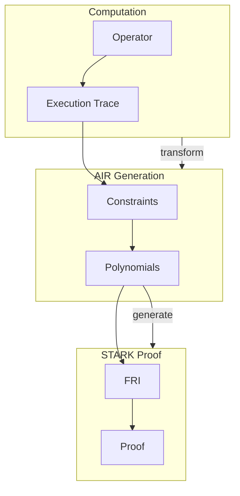
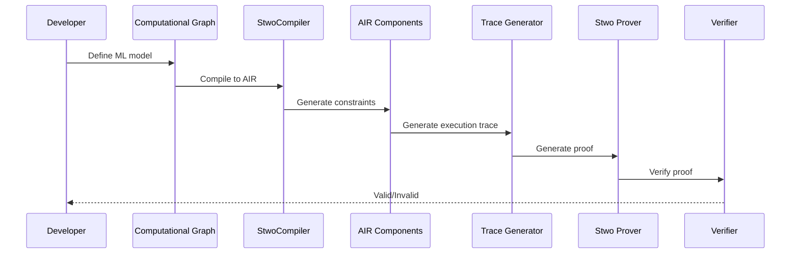

# Research: LuminAIR AIR (Algebraic Intermediate Representation)

## Overview

LuminAIR uses **Algebraic Intermediate Representation (AIR)** to prove computational graph integrity. Unlike Cairo programs (used by Stoolap), LuminAIR compiles ML operators directly to AIR without Cairo compilation.

## What is AIR?

**AIR (Algebraic Intermediate Representation)** is a constraint-based system for STARK proofs:



### Key AIR Concepts

| Concept         | Description                                 |
| --------------- | ------------------------------------------- |
| **Trace**       | Execution record (values at each step)      |
| **Constraints** | Mathematical relations between trace values |
| **Polynomials** | Trace interpolated to polynomials           |
| **Components**  | AIR modules for specific operations         |

## LuminAIR AIR Components

### Current Operators (11 Primitive)

| Operator       | Component             | Purpose                     |
| -------------- | --------------------- | --------------------------- |
| **Add**        | `AddComponent`        | Element-wise addition       |
| **Mul**        | `MulComponent`        | Element-wise multiplication |
| **Recip**      | `RecipComponent`      | Reciprocal (1/x)            |
| **Sin**        | `SinComponent`        | Sine with lookup table      |
| **Exp2**       | `Exp2Component`       | 2^x with lookup table       |
| **Log2**       | `Log2Component`       | log2(x) with lookup table   |
| **Sqrt**       | `SqrtComponent`       | Square root                 |
| **Mod**        | `RemComponent`        | Modulo/remainder            |
| **LessThan**   | `LessThanComponent`   | Comparison                  |
| **SumReduce**  | `SumReduceComponent`  | Sum all elements            |
| **MaxReduce**  | `MaxReduceComponent`  | Find maximum                |
| **Contiguous** | `ContiguousComponent` | Memory layout               |

### Planned (Fused) Operators

| Operator    | Description           |
| ----------- | --------------------- |
| **MatMul**  | Matrix multiplication |
| **SoftMax** | Softmax function      |
| **ReLU**    | Rectified linear unit |

## Component Architecture

### Structure of an AIR Component

Each LuminAIR component implements:

```rust
pub struct SomeEval {
    log_size: u32,           // Trace size (log2)
    lut_log_size: u32,       // Lookup table size (if applicable)
    node_elements: NodeElements,  // Graph node info
    lookup_elements: LookupElements,  // Lookup data
}

impl FrameworkEval for SomeEval {
    // 1. Return trace size
    fn log_size(&self) -> u32 { ... }

    // 2. Return max constraint degree
    fn max_constraint_log_degree_bound(&self) -> u32 { ... }

    // 3. Evaluate constraints
    fn evaluate<E: EvalAtRow>(&self, mut eval: E) -> E {
        // Consistency constraints
        // Transition constraints
        // Interaction constraints (LogUp)
    }
}
```

### Constraint Types

#### 1. Consistency Constraints

Ensure trace values are consistent:

```rust
// Example: output = input1 + input2
eval.eval_fixed_add(lhs_val.clone(), rhs_val.clone(), out_val.clone());
```

#### 2. Transition Constraints

Ensure state transitions are valid:

```rust
// Example: if not last index, next index = current + 1
let not_last = E::F::one() - is_last_idx;
eval.add_constraint(not_last * (next_idx - idx - E::F::one()));
```

#### 3. Interaction Constraints (LogUp)

Ensure data flow between operators:

```rust
// Connect output of one operator to input of another
eval.add_to_relation(RelationEntry::new(
    &self.node_elements,
    lhs_mult.into(),
    &[lhs_val, lhs_id],
));
eval.finalize_logup();
```

## Example: Add Component

### Code Structure

```rust
// crates/air/src/components/add/component.rs

pub struct AddEval {
    log_size: u32,
    node_elements: NodeElements,
}

impl FrameworkEval for AddEval {
    fn evaluate<E: EvalAtRow>(&self, mut eval: E) -> E {
        // Trace masks (allocate columns)
        let node_id = eval.next_trace_mask();
        let lhs_id = eval.next_trace_mask();
        let rhs_id = eval.next_trace_mask();
        let idx = eval.next_trace_mask();
        let is_last_idx = eval.next_trace_mask();

        // Values
        let lhs_val = eval.next_trace_mask();
        let rhs_val = eval.next_trace_mask();
        let out_val = eval.next_trace_mask();

        // Multiplicities (for LogUp)
        let lhs_mult = eval.next_trace_mask();
        let rhs_mult = eval.next_trace_mask();
        let out_mult = eval.next_trace_mask();

        // ┌─────────────────────────────┐
        // │   Consistency Constraints   │
        // └─────────────────────────────┘

        // is_last_idx must be 0 or 1
        eval.add_constraint(
            is_last_idx.clone() * (is_last_idx.clone() - E::F::one())
        );

        // output = lhs + rhs
        eval.eval_fixed_add(lhs_val.clone(), rhs_val.clone(), out_val.clone());

        // ┌────────────────────────────┐
        // │   Transition Constraints   │
        // └────────────────────────────┘

        // Same node/tensor IDs, index increments

        // ┌─────────────────────────────┐
        // │   Interaction Constraints   │
        // └─────────────────────────────┘

        // LogUp: connect to other operators via multiplicities
        eval.add_to_relation(RelationEntry::new(
            &self.node_elements,
            lhs_mult.into(),
            &[lhs_val, lhs_id],
        ));

        eval.finalize_logup();

        eval
    }
}
```

### Constraint Summary

| Constraint    | Formula                                  | Purpose              |
| ------------- | ---------------------------------------- | -------------------- |
| is_last_valid | `is_last * (is_last - 1) = 0`            | Binary flag check    |
| add_correct   | `out - lhs - rhs = 0`                    | Addition correctness |
| same_node     | `(1-is_last) * (next_node - node) = 0`   | Node continuity      |
| same_lhs      | `(1-is_last) * (next_lhs - lhs) = 0`     | LHS continuity       |
| same_rhs      | `(1-is_last) * (next_rhs - rhs) = 0`     | RHS continuity       |
| index_inc     | `(1-is_last) * (next_idx - idx - 1) = 0` | Index progression    |

## Data Flow: LogUp

### What is LogUp?

**LogUp (Lookup Argument via Univariate Polynomials)** ensures data flows correctly between operators:

```mermaid
flowchart LR
    subgraph OP1["Operator A (output)"]
        O[out_val] -->|yield = N| M1[Multiplicity N]
    end

    subgraph OP2["Operator B (input)")]
        I[input_val] -->|consume = 1| M2[Multiplicity 1]
    end

    M1 -->|verified| LOGUP[LogUp Protocol]
    M2 -->|verified| LOGUP

    LOGUP --> PROOF[ZK Proof]
```

### Multiplicity Rules

| Scenario       | Multiplicity | Example                                  |
| -------------- | ------------ | ---------------------------------------- |
| Output yielded | Positive     | Tensor used by 2 consumers → yield=2     |
| Input consumed | Negative     | Operation reads from tensor → consume=-1 |
| Graph input    | Zero         | Initial tensor, no prior operation       |
| Graph output   | Zero         | Final result, no subsequent operation    |

## Lookup Tables (LUT)

Some operations use **lookup tables** for efficiency:

### Operations with LUTs

| Operation      | Lookup Table   | Purpose                 |
| -------------- | -------------- | ----------------------- |
| **Sin**        | sin(x) values  | Fast sine approximation |
| **Exp2**       | 2^x values     | Fast exponential        |
| **Log2**       | log2(x) values | Fast logarithm          |
| **RangeCheck** | 0..N range     | Bounds checking         |

### LUT Implementation

```rust
// Example: Sin with lookup
pub struct SinEval {
    log_size: u32,
    lut_log_size: u32,  // Lookup table size
    node_elements: NodeElements,
    lookup_elements: SinLookupElements,
}

// Uses lookup to verify sin computation
// without computing sin in the circuit
```

## Trace Structure

### Execution Trace

The trace records computation state at each step:

```rust
pub type TraceEval = ColumnVec<CircleEvaluation<SimdBackend, BaseField, BitReversedOrder>>;
```

### Column Layout

| Column Type             | Description          |
| ----------------------- | -------------------- |
| **Trace columns**       | Computation values   |
| **Mask columns**        | Index, IDs, flags    |
| **Interaction columns** | LogUp multiplicities |

## Proving Pipeline

### Full Flow



### Code Example

```rust
use luminair_graph::{graph::LuminairGraph, StwoCompiler};
use luminal::prelude::*;

fn main() -> Result<(), Box<dyn std::error::Error>> {
    // 1. Build computational graph
    let mut cx = Graph::new();
    let a = cx.tensor((2, 2)).set(vec![1.0, 2.0, 3.0, 4.0]);
    let b = cx.tensor((2, 2)).set(vec![10.0, 20.0, 30.0, 40.0]);
    let c = a * b;
    let mut d = (c + a).retrieve();

    // 2. Compile to AIR (StwoCompiler)
    cx.compile(<(GenericCompiler, StwoCompiler)>::default(), &mut d);

    // 3. Generate execution trace
    let trace = cx.gen_trace()?;

    // 4. Generate proof
    let proof = cx.prove(trace)?;

    // 5. Verify
    cx.verify(proof)?;

    Ok(())
}
```

## Comparison: Cairo vs Direct AIR

| Aspect          | Stoolap (Cairo)   | LuminAIR (Direct AIR)   |
| --------------- | ----------------- | ----------------------- |
| **Compilation** | SQL → Cairo       | ML Graph → AIR          |
| **Prover**      | stwo-cairo-prover | stwo (direct)           |
| **On-chain**    | ✅ Yes            | ❌ Not yet              |
| **Flexibility** | Fixed (SQL ops)   | Extensible (components) |
| **Performance** | ~25-28s proving   | Variable by model       |
| **Complexity**  | Lower (pre-built) | Higher (custom AIR)     |

## Why Direct AIR is Faster

1. **No Cairo compilation overhead**
2. **Specialized constraints** for ML operations
3. **SIMD backend** for parallel trace generation
4. **Lookup tables** avoid expensive computations in-circuit

## For CipherOcto

### When to Use Direct AIR

- **Off-chain verification** (fast, no on-chain needed)
- **ML inference proofs** (LuminAIR domain)
- **Custom operators** not expressible in Cairo

### When Cairo is Better

- **On-chain verification** required
- **Starknet integration** needed
- **Proven ecosystem** with existing programs

---

## References

- LuminAIR AIR Components: `crates/air/src/components/`
- Stwo Constraint Framework: `stwo_constraint_framework`
- LogUp Protocol: https://eprint.iacr.org/2022/1530
- STARKs: https://starkware.co/stark/

---

**Research Status:** Complete
**Related:** [Stoolap vs LuminAIR Comparison](./stoolap-luminair-comparison.md)
