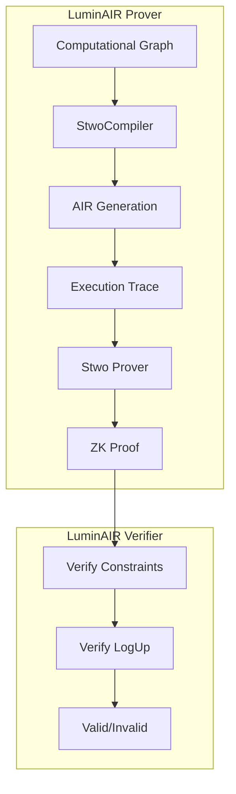
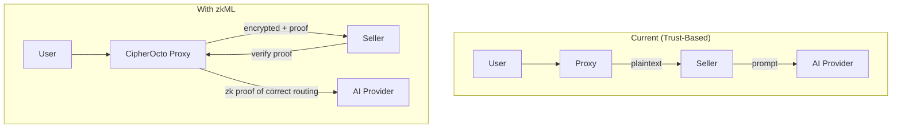
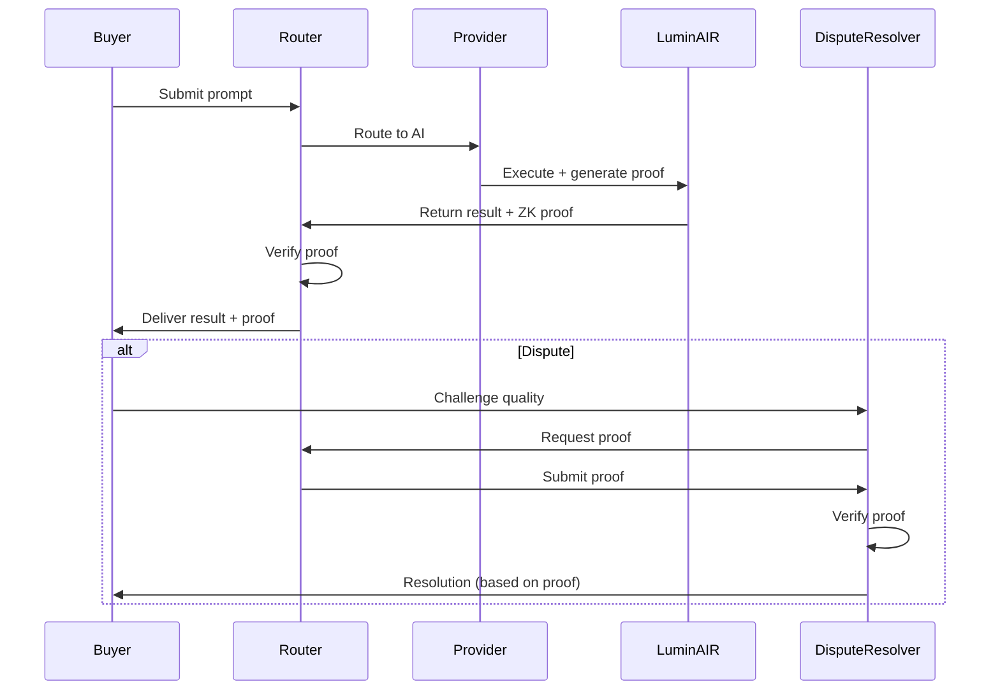
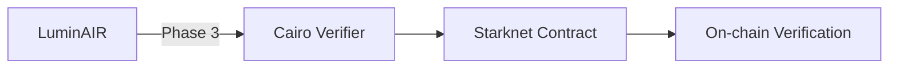
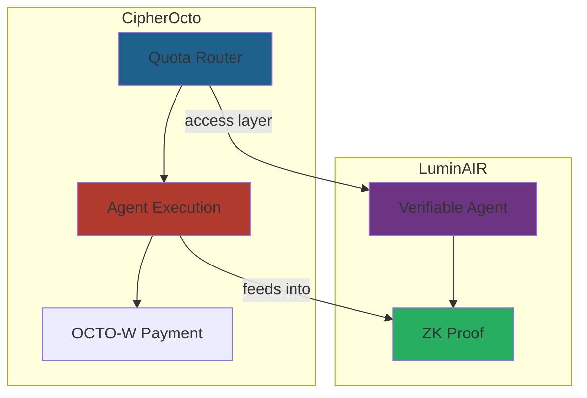
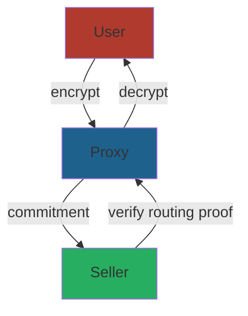

# Research: LuminAIR Analysis for CipherOcto Integration

## Executive Summary

This research analyzes LuminAIR (by Giza) and explores how its zkML solutions can enhance CipherOcto's architecture. LuminAIR provides cryptographic proofs for ML computation integrity using Circle STARKs (Stwo prover), enabling verifiable AI agents, trustless inference, and privacy-preserving ML.

## Problem Statement

CipherOcto faces challenges that LuminAIR's approach could address:

1. **Privacy limitation**: Sellers see prompt content (trust-based model)
2. **Dispute resolution**: Relies on automated signals + reputation
3. **Verification gap**: No cryptographic proof of correct execution
4. **Agent trust**: No way to prove agents executed correctly

## LuminAIR Deep Dive

### Core Technology

| Component           | Technology                                  | Purpose                                    |
| ------------------- | ------------------------------------------- | ------------------------------------------ |
| **Proof System**    | Circle STARKs                               | Scalable, transparent, post-quantum secure |
| **Prover**          | Stwo (Starkware)                            | Ultra-efficient proof generation           |
| **Arithmetization** | AIR (Algebraic Intermediate Representation) | Computational graph → polynomials          |
| **Verification**    | Rust + Cairo (planned)                      | On-chain verification                      |
| **Field**           | M31 (highly efficient prime field)          | Fast computation                           |

### Architecture



### Key Innovations

#### 1. AIR (Algebraic Intermediate Representation)

- Each operator maps to specific AIR constraints
- Local constraints ensure operation correctness
- LogUp lookup argument ensures data flow integrity

#### 2. Circle STARKs (Stwo)

- More efficient than traditional STARKs
- Uses M31 prime field for speed
- SIMD backend for parallelization
- GPU acceleration planned (Icicle-Stwo)

#### 3. Verification Options

| Verification Type    | Status     | Use Case                   |
| -------------------- | ---------- | -------------------------- |
| **Rust verifier**    | ✅ Current | Off-chain verification     |
| **WASM verifier**    | 🔜 Phase 2 | Browser-based verification |
| **On-chain (Cairo)** | 🔜 Phase 3 | Starknet verification      |
| **EigenLayer AVS**   | 🔜 Phase 3 | Decentralized verification |

### Use Cases from LuminAIR

| Use Case                   | Description                                  |
| -------------------------- | -------------------------------------------- |
| **Verifiable DeFi Agents** | zk-proved trading decisions                  |
| **Trustless Inference**    | On-chain ML without re-execution             |
| **Privacy-Preserving ML**  | Selective disclosure of model inputs/outputs |
| **Scientific Computing**   | Black-Scholes PINNs with proofs              |
| **Healthcare**             | Verifiable diagnosis assistance              |

---

## CipherOcto Integration Opportunities

### 1. Privacy Upgrade Path (Selective Disclosure)

**Current Problem**: Sellers see prompt content - trust assumption

**LuminAIR Solution**: zkML with selective disclosure



**Proposal for CipherOcto**:

- Encrypt prompt at proxy layer
- Generate zk proof that routing was correct without revealing content
- Seller verifies proof without seeing actual prompt
- Use Stwo/Circle STARKs for efficiency

**Implementation Phases**:
| Phase | Approach | Complexity |
|-------|----------|------------|
| Phase 1 | Basic encryption | Low |
| Phase 2 | Proof of routing (no content) | Medium |
| Phase 3 | Full selective disclosure | High |

### 2. Verifiable Quality / Dispute Resolution

**Current Problem**: RFC-0900 (Economics) disputes rely on signals + reputation

**LuminAIR Solution**: Proof of correct execution



**Lightweight Proofs for MVE**:

- Not full zkML - just prove output shape/validity
- Latency proof: timestamp + hash of request/response
- Correct routing proof: prove X routed to Y without revealing prompt

**Integration with RFC-0900 (Economics)**:

```rust
struct ExecutionProof {
    input_hash: FieldElement,      // Hash of encrypted input
    output_hash: FieldElement,     // Hash of output
    model_type: String,            // e.g., "gpt-4"
    latency_ms: u64,               // Execution time
    timestamp: u64,                // When executed
    proof: CircleStarkProof,       // ZK proof
}

impl ExecutionProof {
    fn verify(&self) -> bool {
        // Verify Circle STARK proof
        // Check latency within acceptable bounds
        // Verify output shape matches model
    }
}
```

### 3. Starknet/Cairo Alignment

**Current State**: RFC-0102 (Numeric/Math) already uses Starknet ECDSA, Poseidon hashing

**LuminAIR Planned**: On-chain Cairo verifier



**CipherOcto Advantage**:

- Already on Starknet/Cairo - natural fit
- Can implement LuminAIR-style proofs without migration
- Stoolap uses same ecosystem (STWO integration)

**Proposed Integration**:

```cairo
// Starknet contract for quota proof verification
#[starknet::contract]
mod QuotaProofVerifier {
    fn verify_octo_routing_proof(
        proof: CircleStarkProof,
        input_hash: felt252,
        output_hash: felt252,
        provider: felt252,
    ) -> bool {
        // Verify the proof that OCTO-W was correctly routed
        // No need to reveal actual prompt content
    }
}
```

### 4. Agent Verifiability

**Narrative Alignment**: Both projects target "verifiable intelligence"



**Positioning**:

- CipherOcto's quota router = access layer
- LuminAIR-style proofs = verification layer
- Combined = "verifiable autonomous agents"

---

## New Use Cases for CipherOcto

Based on LuminAIR analysis, new opportunities emerge:

### 1. Verifiable AI Agents (DeFi)

**Use Case**: Trading agents with provable decision history

```rust
struct VerifiableTradingAgent {
    // Standard agent capabilities
    agent: Agent,

    // ZK enhancements
    decision_proofs: Vec<DecisionProof>,
}

struct DecisionProof {
    market_data_hash: FieldElement,
    decision_hash: FieldElement,
    reasoning_hash: FieldElement,  // Not full reasoning - just hash
    timestamp: u64,
    proof: CircleStarkProof,
}
```

**Integration with Quota Router**:

- Agent pays OCTO-W for inference
- Generates proof of correct execution
- On-chain verification for transparency

### 2. Privacy-Preserving Query Routing

**Use Case**: Confidential prompts with verifiable routing



**Properties**:

- Seller verifies routing without seeing prompt
- ZK proof demonstrates correct execution
- Selective disclosure: reveal only when needed

### 3. Provable Quality of Service

**Use Case**: SLA enforcement with cryptographic guarantees

| Metric              | Proof Type       | On-chain Settleable |
| ------------------- | ---------------- | ------------------- |
| Latency             | Timestamp + hash | ✅                  |
| Output validity     | Shape check      | ✅                  |
| Model execution     | zkML proof       | ✅                  |
| Routing correctness | Merkle path      | ✅                  |

---

## Implementation Recommendations

### Phase 1: Immediate (MVE Enhancement)

| Enhancement        | Description                          | Effort |
| ------------------ | ------------------------------------ | ------ |
| **Latency proofs** | Timestamp + hash for timing disputes | Low    |
| **Output hashing** | Hash outputs for later verification  | Low    |
| **Routing logs**   | Merkle-tree of routing decisions     | Medium |

### Phase 2: Near-term (Post-MVE)

| Enhancement           | Description                                  | Effort |
| --------------------- | -------------------------------------------- | ------ |
| **Basic zkML**        | Prove model executed without revealing input | Medium |
| **WASM verifier**     | Browser-based proof verification             | Medium |
| **Starknet verifier** | On-chain proof settlement                    | Medium |

### Phase 3: Future (Full Integration)

| Enhancement              | Description                        | Effort |
| ------------------------ | ---------------------------------- | ------ |
| **Full zkML**            | Complete inference verification    | High   |
| **EigenLayer AVS**       | Decentralized verification network | High   |
| **Selective disclosure** | User-controlled data release       | High   |

---

## Technical Stack Alignment

| Component        | CipherOcto     | LuminAIR           | Alignment         |
| ---------------- | -------------- | ------------------ | ----------------- |
| **Blockchain**   | Starknet       | Starknet (planned) | ✅ Perfect        |
| **ZK Prover**    | Stoolap STWO   | Stwo               | ✅ Same ecosystem |
| **Signature**    | Starknet ECDSA | Circle STARKs      | ✅ Complementary  |
| **Language**     | Rust           | Rust               | ✅ Compatible     |
| **Verification** | Cairo (future) | Cairo (planned)    | ✅ Aligned        |

---

## Risk Assessment

| Risk                           | Severity | Mitigation                    |
| ------------------------------ | -------- | ----------------------------- |
| zkML overhead too high for MVE | Medium   | Start with lightweight proofs |
| Integration complexity         | Medium   | Phase approach                |
| Stoolap + LuminAIR overlap     | Low      | Different focus (DB vs ML)    |
| Performance at scale           | Medium   | GPU acceleration later        |

---

## Conclusion

LuminAIR's zkML approach offers significant opportunities for CipherOcto:

1. **Privacy**: Upgrade from trust-based to cryptographic
2. **Disputes**: Replace reputation with proof-based resolution
3. **Alignment**: Starknet/Cairo ecosystem already aligned
4. **Narrative**: "Verifiable intelligence" positions both projects

**Recommended Actions**:

- [ ] Create RFC for zkML Integration
- [ ] Prototype lightweight proof of routing
- [ ] Evaluate Stoolap + Stwo integration
- [ ] Plan on-chain verifier for Phase 3

---

## References

- LuminAIR: https://github.com/gizatechxyz/LuminAIR
- Stwo: https://github.com/starkware-libs/stwo
- Circle STARKs Paper: https://eprint.iacr.org/2024/278
- LogUp Protocol: https://eprint.iacr.org/2022/1530
- Stoolap: https://github.com/CipherOcto/stoolap

---

**Research Status:** Complete
**Recommended Action:** Create RFC for zkML Integration
