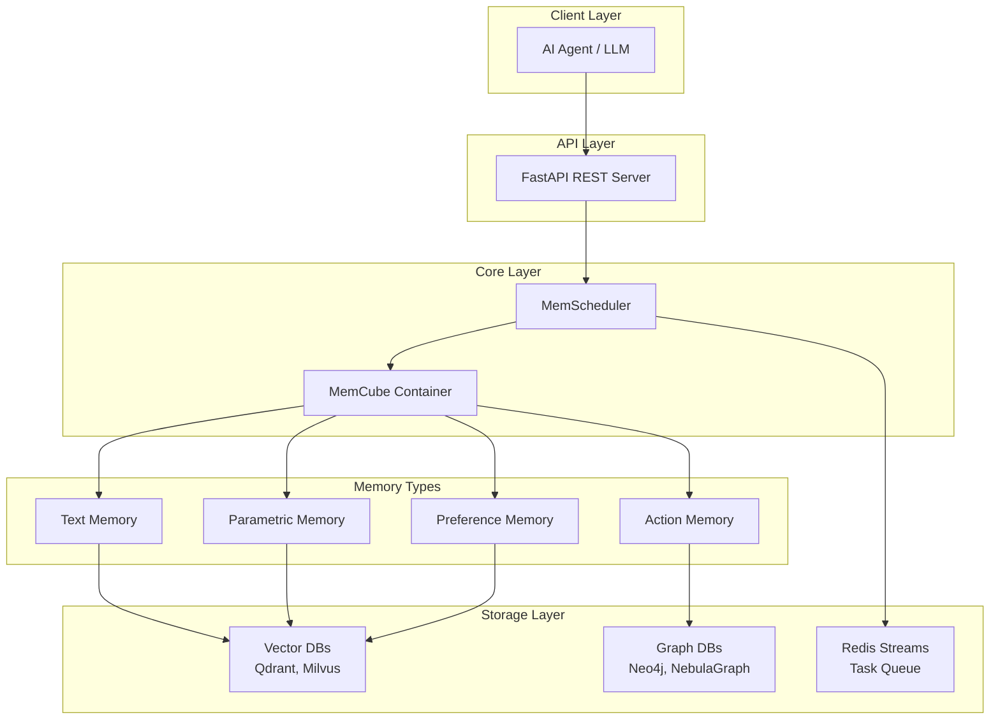
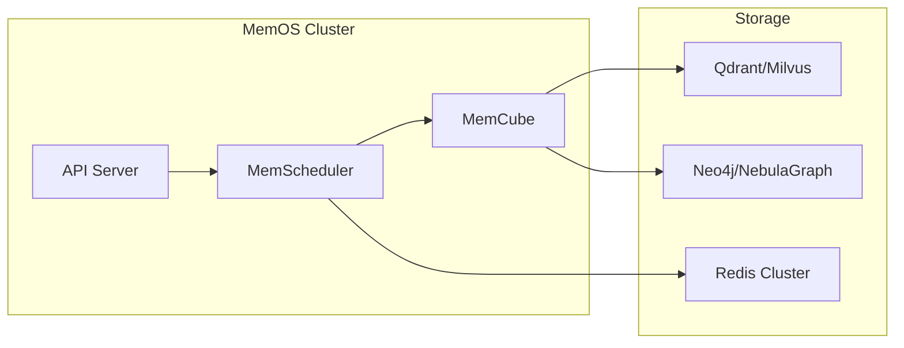

# MemOS Research Report

**Project**: MemOS - Memory Operating System for AI Systems
**Location**: https://github.com/MemTensor/MemOS
**Date**: March 2026
**Status**: Research Complete

---

## Executive Summary

MemOS (Memory Operating System) is a production-grade memory management system designed specifically for Large Language Models (LLMs) and AI agents. It provides a unified abstraction layer for storing, retrieving, and managing long-term memory across heterogeneous storage backends.

### Key Performance Metrics

| Metric | Improvement vs OpenAI Memory |
|--------|------------------------------|
| Accuracy | **+43.70%** |
| Memory Token Savings | **35.24%** |

MemOS was published on arXiv as "MemOS: A Memory OS for AI System" and represents a significant advancement in AI memory architecture.

---

## 1. Architecture Overview

MemOS employs a layered architecture that separates concerns between memory types, storage backends, and access patterns:



### Design Principles

1. **Unified Abstraction**: Single interface for heterogeneous storage
2. **Type-Specific Handling**: Four distinct memory types for different data characteristics
3. **Async-First**: Non-blocking operations via Redis Streams
4. **Production-Ready**: FastAPI REST API for easy integration

---

## 2. Core Components

### 2.1 MemCube

MemCube serves as the central container that orchestrates all memory types. It provides a unified API for:

- Registering and managing different memory types
- Coordinating storage operations across backends
- Handling cross-memory queries and relationships

### 2.2 MemScheduler

The MemScheduler is an asynchronous task scheduling system built on Redis Streams. It handles:

- Background memory consolidation tasks
- Scheduled cleanup and garbage collection
- Priority-based task execution
- Distributed locking for consistency

### 2.3 API Layer

The API layer is built with FastAPI and provides:

- RESTful endpoints for CRUD operations
- Vector search capabilities
- Memory management endpoints
- Health and monitoring endpoints

---

## 3. Memory Types

MemOS distinguishes between four distinct memory types, each optimized for different data characteristics:

### 3.1 Text Memory

**Purpose**: Store conversational context, documents, and general text data.

**Characteristics**:
- High-volume text storage
- Semantic search via vector embeddings
- Supports long-form content

**Storage**: Vector databases (Qdrant, Milvus)

### 3.2 Action Memory

**Purpose**: Record agent actions, decisions, and execution traces.

**Characteristics**:
- Temporal ordering important
- Causal relationships between actions
- Graph-like structure for action chains

**Storage**: Graph databases (Neo4j, NebulaGraph)

### 3.3 Parametric Memory

**Purpose**: Store learned parameters, weights, and model-specific data.

**Characteristics**:
- Structured numerical data
- Requires efficient similarity search
- Updated frequently

**Storage**: Vector databases (Qdrant, Milvus)

### 3.4 Preference Memory

**Purpose**: Capture user preferences, settings, and behavioral patterns.

**Characteristics**:
- Key-value style access patterns
- User-specific data isolation
- Frequently read, occasionally written

**Storage**: Vector databases with metadata indexing

---

## 4. Storage Layer

### 4.1 Vector Databases

MemOS supports multiple vector databases for embedding storage and similarity search:

| Database | Use Case | Strengths |
|----------|----------|-----------|
| **Qdrant** | Primary vector store | Rust-based, high performance, cloud-native |
| **Milvus** | Large-scale vector operations | Horizontal scaling, distributed |

### 4.2 Graph Databases

For action memory and relationship-heavy data:

| Database | Use Case | Strengths |
|----------|----------|-----------|
| **Neo4j** | Action tracing | Mature, Cypher query language |
| **NebulaGraph** | High-scale graphs | Distributed, Facebook-origin |

### 4.3 Redis Streams

Used for the MemScheduler task queue:
- Async task processing
- Distributed message passing
- Task persistence and replay

---

## 5. API & Integration

### 5.1 REST API Endpoints

The FastAPI server exposes endpoints for:

```
POST   /memory          # Store new memory
GET    /memory/{id}     # Retrieve memory by ID
SEARCH /memory/search   # Vector similarity search
DELETE /memory/{id}     # Delete memory
GET    /health          # Health check
```

### 5.2 Client Integration

MemOS provides client libraries for easy integration with AI agents:
- Python SDK
- HTTP API for language-agnostic access
- WebSocket support for streaming updates

---

## 6. Deployment

### 6.1 Typical Deployment Stack



### 6.2 Scaling Considerations

- **Horizontal**: Add more API instances behind load balancer
- **Storage**: Scale vector/graph databases independently
- **Async Processing**: Increase Redis/worker count for throughput

---

## 7. Evaluation

### 7.1 Performance Results

MemOS demonstrates significant improvements over baseline solutions:

| Metric | Result |
|--------|--------|
| Accuracy Improvement | **+43.70%** vs OpenAI Memory |
| Token Efficiency | **35.24%** memory token savings |

### 7.2 Key Success Factors

1. **Type Separation**: Distinct handling per memory type improves retrieval precision
2. **Graph Integration**: Action memory benefits from relationship modeling
3. **Async Architecture**: Redis Streams enables low-latency responses

---

## 8. Conclusion

MemOS represents a sophisticated approach to AI memory management. By separating concerns across four memory types and leveraging purpose-built storage systems, it achieves substantial improvements in accuracy and efficiency.

The architecture demonstrates that generic memory solutions cannot match specialized systems that understand the distinct characteristics of different memory types. The combination of vector similarity search, graph relationships, and async processing creates a robust foundation for production AI systems requiring persistent memory.

---

## References

- arXiv: MemOS: A Memory OS for AI System
- Project Repository: https://github.com/MemTensor/MemOS
