# Research: MiMo-Code Architecture

**Date:** 2026-06-12
**Status:** v1 — initial pass
**Source:** [`XiaomiMiMo/MiMo-Code`](https://github.com/XiaomiMiMo/MiMo-Code) (HEAD `42e7da3`, working tree clean on `main`, default dev branch `dev`)
**Index:** 1,712 TypeScript files (~352k LOC), 21 packages + 1 SDK + 5 infra files, 34 opencode Drizzle migrations + 68 console migrations, 45 `.txt` prompt templates, 12 built-in agent types, 24 LLM provider adapters, 1 OpenAPI 3.1.1 spec
**Mermaid:** All diagrams validated with `mermaid-cli` v8, v10, and latest; safe in `bierner.markdown-mermaid` (mermaid ~8) and `Markdown Preview Mermaid Support` (mermaid ~10). StateDiagram-v2 transitions avoid the `::` separator (which fails the v10 state parser). Node labels use `&#60;` / `&#62;` decimal entities for any Rust-style generic angle brackets.

---

## Table of Contents

1. [Project Overview](#1-project-overview)
2. [System Architecture](#2-system-architecture)
3. [Workspace Topology](#3-workspace-topology)
4. [Build & Toolchain](#4-build--toolchain)
5. [The `@mimo-ai/cli` Runtime (`packages/opencode`)](#5-the-mimo-ai-cli-runtime-packagesopencode)
6. [Multi-Client Surfaces](#6-multi-client-surfaces)
7. [Server Architecture](#7-server-architecture)
8. [Wire Protocol & OpenAPI SDK](#8-wire-protocol--openapi-sdk)
9. [Storage Layer](#9-storage-layer)
10. [The Effect Service Architecture](#10-the-effect-service-architecture)
11. [Project & Instance Model](#11-project--instance-model)
12. [The Agent Loop](#12-the-agent-loop)
13. [The LLM Service](#13-the-llm-service)
14. [MessageV2 — The Message / Parts Schema](#14-messagev2--the-message--parts-schema)
15. [The Actor System](#15-the-actor-system)
16. [The Provider System](#16-the-provider-system)
17. [The Tool System](#17-the-tool-system)
18. [The Memory System](#18-the-memory-system)
19. [The Checkpoint System](#19-the-checkpoint-system)
20. [Compaction & Prune](#20-compaction--prune)
21. [Max Mode](#21-max-mode)
22. [Goal / Stop Condition](#22-goal--stop-condition)
23. [Dream & Distill](#23-dream--distill)
24. [The Workflow Engine](#24-the-workflow-engine)
25. [Worktree Isolation](#25-worktree-isolation)
26. [Snapshot & Revert](#26-snapshot--revert)
27. [The Plugin System](#27-the-plugin-system)
28. [MCP Integration](#28-mcp-integration)
29. [LSP Integration](#29-lsp-integration)
30. [Skill System](#30-skill-system)
31. [Permission System](#31-permission-system)
32. [ACP — Agent Client Protocol](#32-acp--agent-client-protocol)
33. [The TUI (`@tui/`)](#33-the-tui-tui)
34. [The Web App (`packages/app`)](#34-the-web-app-packagesapp)
35. [The Desktop App (`packages/desktop`)](#35-the-desktop-app-packagesdesktop)
36. [The Console / Cloud (`packages/console`)](#36-the-console--cloud-packagesconsole)
37. [Enterprise (`packages/enterprise`)](#37-enterprise-packagesenterprise)
38. [SDK & OpenAPI Codegen](#38-sdk--openapi-codegen)
39. [CI / Release / Build Pipeline](#39-ci--release--build-pipeline)
40. [Configuration System](#40-configuration-system)
41. [Auth](#41-auth)
42. [CLI Commands](#42-cli-commands)
43. [Internationalization](#43-internationalization)
44. [Data Flow Diagrams](#44-data-flow-diagrams)
45. [Failure Modes & Reliability](#45-failure-modes--reliability)
46. [Glossary](#46-glossary)
47. [Code Reference Index](#47-code-reference-index)
48. [Appendices](#48-appendices)

---

## 1. Project Overview

MiMo-Code is the open-source distribution of Xiaomi's MiMo coding agent — a terminal-native AI coding assistant with cross-session persistent memory, a structured task/checkpoint/skill system, and parallel subagent orchestration. The repository is forked from [OpenCode](https://github.com/anomalyco/opencode) (see [README.md:125](https://github.com/XiaomiMiMo/MiMo-Code/blob/main/README.md) "Relationship to OpenCode") and is built primarily by Xiaomi MiMo. The vendored identity assets live at `packages/identity/` (logo SVGs and PNGs) but the project retains OpenCode's `mimo` binary name and the bulk of its runtime architecture.

| Property | Value | Evidence |
|---|---|---|
| **Version** | root `private`, no version field at root | `package.json:1-7` |
| **CLI package version** | `0.1.0` (`@mimo-ai/cli`) | `packages/opencode/package.json:3` |
| **Repo / upstream** | `https://github.com/XiaomiMiMo/MiMo-Code` | `package.json:69-72` |
| **Default branch** | `dev` (per repo rules; local `main` may not exist) | `AGENTS.md:4-5` |
| **License** | MIT (source); `USE_RESTRICTIONS.md` for MiMo trademarks | `LICENSE`, `USE_RESTRICTIONS.md` |
| **Toolchain** | Bun 1.3.11, TypeScript 5.8.2 / 7.0.0-dev native preview, Turborepo 2.8.13, SST 3.18.10, oxlint 1.60.0 | `package.json:7,40,118-121,135` |
| **TypeScript files** | 1,712 | `find packages sdks infra -name "*.ts" -o -name "*.tsx"` |
| **TypeScript LOC** | 352,493 (excl. `node_modules`, `*.sql.ts`, generated SDK) | same |
| **Rust/Go/C++** | none — pure TypeScript | `find . -name "*.rs" -o -name "*.go" \| wc -l` → 0 |
| **Top-level packages** | 17 (`app, console, containers, desktop, enterprise, extensions, function, identity, opencode, plugin, script, sdk, shared, slack, storybook, ui`) | `ls packages/` |
| **`packages/opencode`** | 568 files, 105,879 LOC (the CLI / agent runtime) | `find packages/opencode/src` |
| **`packages/opencode/test`** | 334 files, 87,657 LOC (almost 1:1 with src) | same |
| **`packages/app`** | 229 files, 58,209 LOC (web app, Solid + Kobalte) | `find packages/app/src` |
| **`packages/ui`** | 180 files, 29,811 LOC (shared component library, Tailwind) | `find packages/ui/src` |
| **`packages/console/app`** | 132 files, 31,664 LOC (cloud marketing / console UI) | same |
| **`packages/sdk/js`** | 38 files, 20,395 LOC (auto-gen TS SDK from openapi.json) | `find packages/sdk/js/src` |
| **`packages/desktop`** | 39 files, 2,889 LOC (Electron) | `find packages/desktop/src` |
| **`packages/enterprise`** | 12 files, 1,096 LOC (SolidStart on Cloudflare) | `find packages/enterprise/src` |
| **`packages/console/core`** | 32 files, 2,260 LOC (Drizzle ORM, PlanetScale schema) | `find packages/console/core/src` |
| **DB migrations (opencode)** | 34 Drizzle migrations under `packages/opencode/migration/` | `ls packages/opencode/migration/` |
| **DB migrations (console)** | 68 Drizzle migrations under `packages/console/core/migrations/` | `ls packages/console/core/migrations/` |
| **Built-in agent types** | 12 (`build, plan, compose, general, max, explore, title, summary, compaction, checkpoint-writer, dream, distill`) | `packages/opencode/src/agent/agent.ts:114,135,154,178,194,209,237,254,270,286,316,343` |
| **LLM provider SDKs** | 24 bundled `@ai-sdk/*` + `gitlab-ai-provider` + `venice-ai-sdk-provider` + custom `provider/sdk/copilot` | `packages/opencode/src/provider/provider.ts:106-131` |
| **Tool implementations** | 35 files in `opencode/src/tool/` (21 named tools + 14 supporting modules); 19 in the default `builtin` set | `ls packages/opencode/src/tool/`, `registry.ts:185-211` |
| **Prompt templates** | 45 `.txt` files (12 agent prompts + 12 system prompts + 19 tool prompts + 2 command templates) | `find packages/opencode -name "*.txt" \| wc -l` |
| **TUI components** | 31 in `cli/cmd/tui/component/`, 10 sidebar feature-plugins, 3 home feature-plugins | `ls tui/component/ tui/feature-plugins/{home,sidebar,system}/` |
| **Storage** | Drizzle ORM + SQLite (Bun native, `bun:sqlite`); cross-platform `bun` vs `node` subpath imports | `packages/opencode/src/storage/db.ts`, `package.json` `imports.#db` |
| **MCP transport** | Stdio, Streamable-HTTP, SSE; full OAuth 2.0 + Dynamic Client Registration; local callback on port 19876 | `packages/opencode/src/mcp/index.ts:5-9, oauth-provider.ts:9-12` |
| **LSP** | vscode-jsonrpc over stdin/stdout; 100+ language extensions → server IDs | `packages/opencode/src/lsp/language.ts:1-...` |
| **Plugin system** | Two plugin surfaces: server-side `Hooks` (16+ hook events) and client-side TUI feature-plugins; built-in `MimoAuth`, `MimoFreeAuth`, `AnthropicProxy`, `CodexAuth`, `CopilotAuth`, `GitlabAuth`, `PoeAuth`, `CloudflareWorkersAuth`, `CloudflareAIGatewayAuth`, `CheckpointSplitover`, `SubagentProgressChecker` | `plugin/index.ts:117-138, mimo.ts, mimo-free.ts, codex.ts, cloudflare.ts` |
| **Workflow engine** | QuickJS-emscripten sandbox, 6-phase `deep-research.js` built-in, JS scripted agent fan-out, worktree isolation, 12h script deadline | `packages/opencode/src/workflow/runtime.ts:34-49, builtin/deep-research.js` |
| **Voice input** | TenVAD WASM (16000 Hz, hop 256) + platform `sox` / `rec` / `arecord` recorder; routed to MiMo ASR | `tui/util/vad.ts:2-5, voice.ts:1-30` |
| **Deployment** | SST 3 / Cloudflare Workers + R2 + PlanetScale; Tauri alternative for desktop (`packages/containers/tauri-linux`); Nix (`flake.nix` + `nix/`) for reproducible builds | `infra/{app,console,enterprise}.ts`, `packages/containers/`, `flake.nix` |
| **SDK gen** | `hono-openapi` → `openapi.json` → `@hey-api/openapi-ts` (or similar) → `packages/sdk/js/src/{client,server,process,gen,v2}` | `packages/sdk/openapi.json` (9,789 path/line entries) |
| **CI / build scripts** | `script/{version,publish,build,generate,changelog,stats,sync-zed,beta,format,raw-changelog,release,sign-windows.ps1}.ts` | `ls script/` |
| **Patch package** | 4 patches: `@npmcli/agent@4.0.0`, `@standard-community/standard-openapi@0.2.9`, `solid-js@1.9.10`, `gitlab-ai-provider@6.6.0`; plus `install-korean-ime-fix.sh` | `patches/` |
| **Mimo identity** | 6 logo/PNG files (mark.svg, mark-light.svg, mark-192x192, etc.) under `packages/identity/`; referenced from `package.json:142-145` (`overrides`) | `ls packages/identity/` |
| **Install** | `curl -fsSL https://mimo.xiaomi.com/install \| bash` (delegates to local `install` script) or `npm install -g @mimo-ai/cli` | `README.md:27-33`, `install` |

### 1.1 Design Philosophy

The MiMo-Code fork keeps the entire OpenCode runtime architecture and adds a layer of MiMo-specific subsystems on top. The additions all target the same goal: **make the agent genuinely good at long-horizon work**. A single-shot coding agent can be useful, but a long-running project requires the agent to remember decisions across sessions, recognise when a task is "really done" vs superficially done, and coordinate parallel workers without stomping on each other. The architecture reflects this:

| Subsystem | Long-horizon problem solved | Where |
|---|---|---|
| **Persistent Memory (FTS5)** | "Don't relearn the project every session" — `MEMORY.md` survives across sessions, full-text searchable | `src/memory/{service,paths,fts,reconcile,fts-query}.ts` |
| **Checkpoint-writer subagent** | "Don't lose state when context overflows" — sole curator of structured `checkpoint.md`; rebuild-from-checkpoint on resume | `src/session/checkpoint.ts`, `agent/prompt/checkpoint-writer.txt` |
| **Goal / Stop condition** | "Don't declare victory prematurely" — judge model evaluates `/goal` predicate before each natural stop | `src/session/goal.ts` |
| **Dream & Distill** | "Don't accumulate cruft, don't rediscover workflows" — periodic memory consolidation, skill discovery | `src/session/auto-dream.ts`, `agent/prompt/{dream,distill}.txt` |
| **Max Mode** | "Get unstuck on hard reasoning" — parallel best-of-N with judge | `src/session/max-mode.ts`, agent `max` |
| **Compose Mode** | "Specs-driven development" — structured skill-driven workflow (plan → TDD → review → merge) | agent `compose` |
| **Actor registry + worktree** | "Run subagents in parallel without stomping" — each actor gets its own worktree, lifecycle tracked in DB | `src/actor/{registry,spawn,waiter}.ts`, `src/worktree/index.ts` |
| **Workflow engine (QuickJS)** | "Orchestrate long-running pipelines" — JS-scripted agent fan-out with deadline + concurrency caps | `src/workflow/{runtime,builtin,sandbox,workspace}.ts` |
| **Subagent return protocol** | "Don't parse free-form text from subagents" — required `Status / Summary / Files touched` format documented in main agent system prompt | `src/session/llm.ts:99-180` (`buildMemoryInstructions`) |
| **MiMo Auth + MiMo Auto (free)** | "Zero-config onboarding" — anonymous free channel preconfigured | `src/plugin/mimo-free.ts`, `src/plugin/mimo.ts` |

### 1.2 Key Differentiators vs Upstream OpenCode

| Dimension | MiMo-Code (this repo) | Upstream OpenCode |
|---|---|---|
| **Memory** | Full file-based FTS5 memory (project `MEMORY.md`, session `checkpoint.md`, `notes.md`, `tasks/<id>/progress.md`, global `MEMORY.md`, Claude Code bridge) | None |
| **Checkpoint rebuild** | Token-budgeted boundary walker, writer subagent, buildLLMRequestPrefix, microcompact | None |
| **Goal / Stop judge** | `/goal` command, judge model evaluates stop condition before final stop | None |
| **Dream & Distill** | Auto-triggered every 7d (dream) / 30d (distill) | None |
| **Max Mode** | Parallel candidates, judge pick, replayed winning stream | None |
| **Compose Mode** | Specs-driven skill workflow | None |
| **Workflow engine** | QuickJS-sandboxed agent orchestration scripts (deep-research.js) | None |
| **Actor registry** | Per-session actor table with mode (`main`/`subagent`/`peer`/`system`), lifecycle (`ephemeral`/`persistent`), context mode | Basic subagent |
| **MiMo providers** | `xiaomi` provider + `MimoAuth`/`MimoFreeAuth` plugins; free channel; no API key needed for the anonymous tier | None |
| **Voice input** | TenVAD + MiMo ASR (TUI `/voice` command) | None |
| **ACP support** | Yes (`mimo acp` subcommand) | Yes (mirrored) |
| **TUI / Desktop / Web** | All three (Electron, OpenTUI/Solid, SolidStart) | TUI + Web |
| **Slack bot** | `packages/slack/` subscribes to `message.part.updated` events | None |
| **GitHub bot** | `mimo github` command, `GithubCommand`, `GithubInstallCommand`, `GithubRunCommand` | None |
| **Cloud** | Console (Cloudflare + PlanetScale), Enterprise (Cloudflare + R2) | Console only |
| **Tauri container** | `packages/containers/tauri-linux/` (Tauri Linux build) | Tauri (kept) |
| **Nix packaging** | `flake.nix`, `nix/{opencode,desktop}.nix`, `nix/node_modules.nix` | None |

### 1.3 Subsystem Inventory (one-liner index)

Each item below is a single sentence the rest of the doc expands.

- **`@mimo-ai/cli`** — yargs-based CLI binary `mimo`; the agent runtime.
- **Server** — Hono HTTP+WS server with mDNS; in-process even from the TUI.
- **Wire / SDK** — `hono-openapi` → `openapi.json` → generated `@mimo-ai/sdk`.
- **Storage** — Drizzle ORM over `bun:sqlite` (with Node fallback) + a key-value `Storage` service.
- **Effect services** — 35+ `Context.Service<…>()` modules wired via `Layer.provide`.
- **Agent loop** — `SessionPrompt` in `session/prompt.ts` (3,355 LOC).
- **LLM service** — `session/llm.ts` wraps Vercel AI SDK `streamText` with model transforms and retry.
- **Provider system** — 24 `@ai-sdk/*` packages + GitLab + Venice + custom Copilot.
- **Tool system** — 21 built-in tools + custom (filesystem `tool/` + `tool/`) + plugin tools.
- **Actor system** — subagent registry; one session, many actors (main + spawned).
- **Memory** — `memory/` service backed by FTS5 across file-system memory directories.
- **Checkpoint** — `session/checkpoint.ts`; writer subagent + token-budgeted rebuild.
- **Compaction** — `session/compaction.ts`; lossy LLM summarization at overflow.
- **Max Mode** — `session/max-mode.ts`; parallel best-of-N with judge.
- **Workflow** — `workflow/runtime.ts`; QuickJS sandbox, 6-phase `deep-research.js`.
- **Worktree** — `worktree/index.ts`; git worktree per actor.
- **Snapshot** — `snapshot/index.ts`; git-based file snapshot, revert, diff.
- **Plugin** — `plugin/index.ts`; Hook events `chat.headers`, `chat.params`, `experimental.chat.system.transform`, `tool.execute.before/after`, `actor.preStop`, `actor.postStop`.
- **MCP** — `mcp/index.ts`; stdio / Streamable-HTTP / SSE, full OAuth.
- **LSP** — `lsp/`; vscode-jsonrpc, 100+ language extensions.
- **Skill** — `skill/index.ts`; discover, load, compose.
- **Permission** — `permission/`; ruleset (`permission`, `pattern`, `action`) with `Wildcard.match`.
- **ACP** — `acp/agent.ts`; full session lifecycle for IDE clients.
- **TUI** — `cli/cmd/tui/`; OpenTUI/Solid, route map (home / session / dialogs), feature-plugins.
- **Web** — `packages/app/`; SolidStart + Kobalte, shiki highlights.
- **Desktop** — `packages/desktop/`; Electron 41 with `electron-vite`.
- **Console** — `packages/console/`; SolidStart marketing + account + billing.
- **Enterprise** — `packages/enterprise/`; SolidStart on Cloudflare, R2 share storage.
- **SDK** — `packages/sdk/js/`; auto-generated TS client (and `v2/` namespace).
- **Infra** — `infra/`; SST 3 (Cloudflare + PlanetScale + Stripe) for app/console/enterprise.

---

## 2. System Architecture

### 2.1 Top-Level View

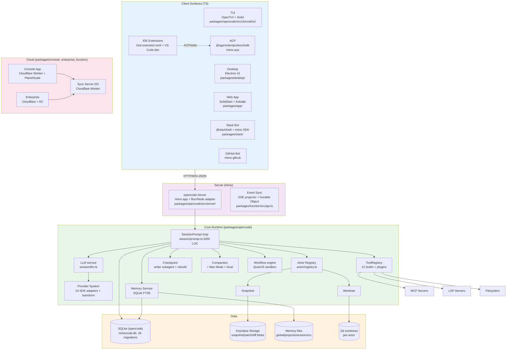

The system has four disjoint layers. The **client layer** is everything the user touches (TUI, desktop, web, IDE, chat). The **server** is the Hono HTTP+WebSocket endpoint that fronts the runtime; the TUI boots one in-process so the wire protocol is the same regardless of how the user connects. The **core runtime** is the agent loop plus all its supporting services; this is `packages/opencode` and is ~106 kLOC. The **data layer** is the on-disk state (SQLite DB, key-value blobs, the memory file tree, and per-actor git worktrees). The **cloud layer** is the hosted console, enterprise, and the Cloudflare Durable Object that handles cross-device session sync.

### 2.2 Process Topology

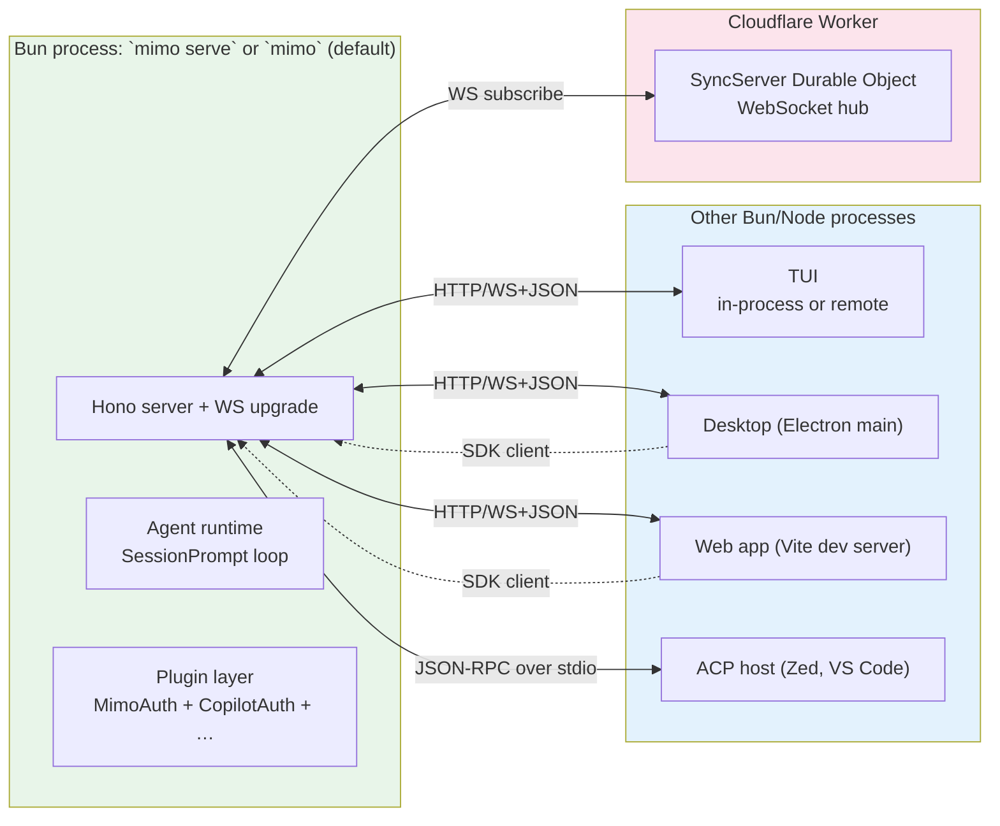

When you run `mimo` (no subcommand), the TUI runs **in-process** with the server (`Server.Default` is a `lazy(() => create({}))` lazy initializer at `packages/opencode/src/server/server.ts:34`). For `mimo serve`, `mimo web`, or any IDE/Slack/GitHub client, the server is exposed over the wire and consumed via the auto-generated SDK. The same `mimo` binary can therefore be a single-user local agent, a shared LAN server, or a remote agent that multiple UIs attach to.

### 2.3 Project Layers (Inside the Core Runtime)

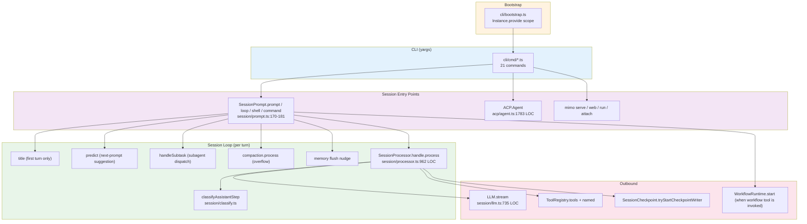

`SessionPrompt.prompt(input)` is the single entry point that every UI calls. Internally it runs a `runLoop` that classifies the last assistant step, routes to compaction, dispatches subtasks, fires the LLM stream via `SessionProcessor.handle.process`, and dispatches tool calls. The same loop serves non-interactive (`mimo run`), interactive (`mimo` / TUI), and external clients (ACP / SDK).

## 3. Workspace Topology

### 3.1 Top-Level Layout

```text
MiMo-Code/
├── package.json                 # root, "mimocode" private workspace
├── bunfig.toml                  # exact pins, no-root test guard
├── turbo.json                   # typecheck / build / opencode#test pipelines
├── tsconfig.json                # extends @tsconfig/bun
├── sst.config.ts                # SST 3 (Cloudflare home)
├── flake.nix / flake.lock       # Nix reproducible shell
├── AGENTS.md / CLAUDE.md        # repo-wide agent instructions
├── CONTRIBUTING.md / SECURITY.md / USE_RESTRICTIONS.md
├── install                      # curl|bash one-line installer (13.6 KB)
├── .oxlintrc.json / .prettierignore
├── .mimocode/                   # local dev `.mimocode` config (mimocode.jsonc, agent, command, glossary, plugins, skills)
├── packages/                    # 17 monorepo packages
│   ├── opencode/                # ★ the @mimo-ai/cli runtime
│   ├── app/                     # Solid web app
│   ├── desktop/                 # Electron desktop
│   ├── ui/                      # shared component library
│   ├── console/                 # ★ cloud app (subdirs: app, core, function, mail, resource)
│   ├── enterprise/              # SolidStart enterprise app
│   ├── sdk/                     # auto-generated TS SDK (openapi.json + js/)
│   ├── plugin/                  # SDK for plugin authors
│   ├── shared/                  # cross-package utility (slug, hash, filesystem, error)
│   ├── function/                # serverless API (Cloudflare Worker; SyncServer DO)
│   ├── containers/              # Dockerfiles (base, bun-node, rust, tauri-linux, publish)
│   ├── extensions/              # Zed extension (extension.toml only)
│   ├── identity/                # logos only (mark.svg, mark-light.svg, 4 PNGs)
│   ├── slack/                   # Slack bot
│   ├── storybook/               # component storybook
│   └── script/                  # release pipeline scripts
├── sdks/
│   └── vscode/                  # VS Code extension (esbuild bundle, images)
├── infra/                       # SST app, console, enterprise, secret, stage
├── script/                      # build, publish, format, generate, beta, sync-zed, stats, changelog, release, version
├── nix/                         # opencode.nix, desktop.nix, node_modules.nix, scripts, hashes.json
├── patches/                     # 4 .patch files + install-korean-ime-fix.sh
├── docs/                        # build-release.md (sparse)
├── assets/                      # readme/, favicon, fonts, sounds
├── .github/                     # workflows (likely)
├── .husky/                      # hooks
├── .vscode/  .zed/              # editor config
└── .dev-home/                   # dev runtime dir (created by `bun run dev`)
```

### 3.2 `packages/opencode` Internals (the agent runtime)

```text
packages/opencode/
├── package.json                 # "@mimo-ai/cli" v0.1.0
├── AGENTS.md                    # 134-line Drizzle + Effect rules
├── bin/mimo                     # Node-style launcher (resolves cached binary)
├── Dockerfile / Dockerfile.alpine
├── bunfig.toml
├── drizzle.config.ts
├── migration/                   # 34 Drizzle migration folders
├── parsers-config.ts            # tree-sitter
├── script/                      # 12 build/release scripts
├── sst-env.d.ts                 # SST type augmentation
├── tsconfig.json
├── test/                        # 334 test files (almost 1:1 with src)
└── src/                         # 568 .ts/.tsx files, 105,879 LOC
    ├── index.ts                 # yargs CLI root
    ├── node.ts                  # Node-specific bootstrap
    ├── audio.d.ts / sql.d.ts / npmcli-config.d.ts
    │
    ├── account/   auth/  bus/  command/  config/  env/  file/  flag/
    ├── format/    git/   global/  history/  id/  ide/  inbox/  installation/
    ├── lsp/       mcp/   memory/  metrics/  npm/  patch/  permission/  plugin/
    ├── project/   provider/  pty/  question/  server/  session/  share/
    ├── shell/     skill/  snapshot/  storage/  sync/  task/  team/  tool/
    ├── util/      workflow/  worktree/
    │
    ├── acp/                     # ACP server (3 files, 1,923 LOC)
    │   ├── agent.ts             # 1,783 LOC — full Agent class + lifecycle
    │   ├── session.ts           # ACPSessionManager
    │   └── types.ts             # ACPConfig
    │
    ├── actor/                   # Subagent registry + spawn
    │   ├── registry.ts          # ActorRegistry Effect service
    │   ├── spawn.ts             # 727 LOC — spawn / fork
    │   ├── spawn-ref.ts         # late-bind ref to avoid layer cycle
    │   ├── waiter.ts            # ActorWaiter
    │   ├── turn.ts              # Turn recording
    │   ├── events.ts            # WriterCachePerf
    │   ├── return-header.ts
    │   ├── schema.ts
    │   └── actor.sql.ts
    │
    ├── control-plane/           # Workspace + remote execution
    │   ├── workspace.ts         # 615 LOC
    │   ├── workspace.sql.ts
    │   ├── adaptors/worktree.ts
    │   ├── dev/debug-workspace-plugin.ts
    │   ├── schema.ts / sse.ts / types.ts / util.ts / workspace-context.ts
    │
    ├── effect/                  # Cross-cutting Effect plumbing
    │   ├── run-service.ts       # makeRuntime (52 LOC)
    │   ├── instance-state.ts    # 81 LOC — per-directory ScopedCache
    │   ├── instance-ref.ts / instance-registry.ts
    │   ├── app-runtime.ts / bootstrap-runtime.ts
    │   ├── memo-map.ts
    │   ├── bridge.ts            # Promise ↔ Effect bridge
    │   ├── cross-spawn-spawner.ts
    │   ├── logger.ts / observability.ts
    │   ├── runtime.ts
    │
    ├── session/                 # ★ largest subsystem (40 files, 13.7k LOC)
    │   ├── prompt.ts            # 3,355 LOC — the main loop
    │   ├── llm.ts               # 735 LOC — LLM service
    │   ├── processor.ts         # 962 LOC — post-message processor
    │   ├── message-v2.ts        # 1,136 LOC — message + part schema
    │   ├── session.ts           # Session Effect service
    │   ├── session.sql.ts       # 5 tables: session, message, part, todo, permission
    │   ├── prompt/{default,anthropic,gpt,gemini,codex,beast,kimi,trinity,copilot-gpt-5,build-switch,compose,max-steps}.txt
    │   ├── prompt/              # same dir contains .txt files; this is multi-sibling (no barrel index.ts)
    │   ├── claude-import.sql.ts / claude-import.ts
    │   ├── checkpoint.ts        # the writer subagent + rebuild
    │   ├── checkpoint-paths.ts / -templates.ts / -align.ts / -context.ts / -retry.ts / -validator.ts / -progress-reconcile.ts
    │   ├── compaction.ts        # LLM summarization
    │   ├── max-mode.ts          # parallel best-of-N
    │   ├── goal.ts              # stop-condition judge
    │   ├── auto-dream.ts        # /dream scheduling
    │   ├── instruction.ts       # `~/` file/agent markdown instructions
    │   ├── message.ts / message-v2.ts (legacy + v2)
    │   ├── overflow.ts / prune.ts / retry.ts / revert.ts / run-state.ts
    │   ├── status.ts / summary.ts / system.ts / todo.ts
    │   ├── projectors.ts / schema.ts / boundary.ts / budgeted-read.ts
    │   ├── last-message-info.ts / prefix-capture-ref.ts / llm-request-prefix.ts
    │   ├── classify.ts          # step classification
    │
    ├── cli/                     # yargs command surface
    │   ├── bootstrap.ts         # Instance.provide(...)
    │   ├── cmd/                 # 21 commands
    │   │   ├── run.ts / serve.ts / web.ts / acp.ts / attach.ts (in tui/)
    │   │   ├── agent.ts / session.ts / account.ts / providers.ts / models.ts
    │   │   ├── generate.ts / github.ts / pr.ts / import.ts / export.ts
    │   │   ├── mcp.ts / plug.ts / db.ts / upgrade.ts / uninstall.ts / debug.ts / stats.ts
    │   │   └── tui/             # TUI (see §33)
    │   ├── effect/prompt.ts
    │   ├── error.ts / heap.ts / i18n.ts / logo.ts / network.ts / ui.ts / upgrade.ts
    │
    ├── provider/                # 7 files, 3,780 LOC
    │   ├── provider.ts          # 1,787 LOC — the big one
    │   ├── transform.ts         # 1,322 LOC — per-model options
    │   ├── auth.ts / error.ts / models.ts / schema.ts / index.ts
    │   └── sdk/copilot/         # custom OpenAI-compatible provider for GitHub Copilot
    │
    ├── tool/                    # 35 files, 6,692 LOC
    │   ├── registry.ts          # 413 LOC — ToolRegistry service
    │   ├── tool.ts / schema.ts / index.ts / invalid.ts / history.ts / memory.ts
    │   ├── actor.ts / actor.txt / actor.shell.txt    # dispatch to other agents
    │   ├── task.ts / task.txt / task.shell.txt       # structured subagent ops
    │   ├── bash.ts / bash.txt / bash-interactive.ts  # shell + interactive
    │   ├── read.ts / write.ts / edit.ts / multiedit.ts / apply_patch.ts
    │   ├── glob.ts / grep.ts / codesearch.ts
    │   ├── webfetch.ts / websearch/{index,websearch.ts}
    │   ├── lsp.ts / mcp-exa.ts
    │   ├── plan.ts / plan-enter.txt / plan-exit.txt
    │   ├── question.ts / skill.ts / workflow.ts / memory.ts / history.ts
    │   ├── change-directory.ts / external-directory.ts
    │   ├── truncate.ts / truncation-dir.ts / shell-tokenize.ts / shell-wrap.ts
    │   ├── memory-path-guard.ts / invocation-style.ts / session-cwd.ts
    │
    ├── memory/                  # 6 files, 461 LOC — FTS5-backed memory
    │   ├── service.ts           # 144 LOC — root + reconcile + search
    │   ├── paths.ts             # parsePath / buildPath / detectType
    │   ├── reconcile.ts         # filesystem → FTS indexer
    │   ├── fts-query.ts         # query builder
    │   ├── fts.sql.ts           # memory_fts + memory_fts_idx schema
    │   ├── index.ts             # `export * as Memory from "./service"`
    │
    ├── storage/                 # Drizzle + K/V
    │   ├── db.bun.ts / db.node.ts / db.ts  # cross-platform sqlite
    │   ├── storage.ts           # K/V + session_diff
    │   ├── schema.sql.ts        # empty (re-exports Timestamps)
    │   ├── schema.ts / index.ts / json-migration.ts
    │
    ├── server/                  # Hono server
    │   ├── server.ts            # 136 LOC — entry
    │   ├── adapter.bun.ts / adapter.node.ts / adapter.ts
    │   ├── middleware.ts (Auth, Logger, Compression, Cors, Error) / fence.ts / workspace.ts
    │   ├── event.ts / projectors.ts / proxy.ts / mdns.ts
    │   ├── routes/global.ts
    │   ├── routes/control/      # workspace, project
    │   ├── routes/instance/     # session, message, part, tool, file, agent, mcp, lsp, app, …
    │   ├── routes/ui.ts         # serves built UI
    │
    ├── agent/                   # 12 built-in agent types
    │   ├── agent.ts             # 554 LOC
    │   ├── config.ts            # SYSTEM_SPAWNED_AGENT_TYPES
    │   ├── generate.txt
    │   └── prompt/{explore,dream,distill,summary,compaction,title,checkpoint-writer}.txt
    │
    ├── workflow/                # QuickJS-orchestrated agent pipelines
    │   ├── runtime.ts           # 1,226 LOC
    │   ├── builtin.ts / builtin/deep-research.js
    │   ├── meta.ts / events.ts / persistence.ts / resolve.ts / runtime-ref.ts / sandbox.ts
    │   ├── workspace.ts
    │   ├── workflow.sql.ts
    │
    ├── share/    snapshot/    storage/    sync/    task/
    ├── acp/      control-plane/  effect/   skill/   worktree/
    │
    └── util/                    # 34 files, 1,865 LOC (Log, Flags, Env, Process, etc.)
```

### 3.3 Workspace Catalog (root `package.json` workspaces)

```text
"workspaces": {
  "packages": [
    "packages/*",                                          # app, console, containers, desktop, enterprise, …
    "packages/console/*",                                  # app, core, function, mail, resource
    "packages/sdk/js",                                     # generated TS SDK
    "packages/slack"                                       # slack bot
  ],
  "catalog": {                                             # 48 pinned versions, deduped across the monorepo
    "@effect/opentelemetry":  "4.0.0-beta.48",
    "effect":                 "4.0.0-beta.48",
    "drizzle-orm":            "1.0.0-beta.19-d95b7a4",
    "drizzle-kit":            "1.0.0-beta.19-d95b7a4",
    "zod":                    "4.1.8",
    "hono":                   "4.10.7",
    "@opentui/core":          "0.1.99",
    "@opentui/solid":         "0.1.99",
    "@ai-sdk/anthropic":      "3.0.71",                    # (in opencode/package.json directly)
    "solid-js":               "1.9.10",                    # patched
    "typescript":             "5.8.2",
    "@typescript/native-preview": "7.0.0-dev.20251207.1",  # used as `tsgo` everywhere
    "@openauthjs/openauth":   "0.0.0-20250322224806",
    "@playwright/test":       "1.59.1",
    "@pierre/diffs":          "1.1.0-beta.18",
    "tailwindcss":            "4.1.11",
    "@tailwindcss/vite":      "4.1.11",
    "marked":                 "17.0.1",
    "shiki":                  "3.20.0",
    "drizzle-orm":            "1.0.0-beta.19-d95b7a4",
    "marked-shiki":           "1.2.1",
    "luxon":                  "3.6.1",
    "ulid":                   "3.0.1",
    "@kobalte/core":          "0.13.11",
    "@hono/zod-validator":    "0.4.2",
    "@hono/standard-validator": "0.1.5",
    "@cloudflare/workers-types": "4.20251008.0",
    "@lydell/node-pty":       "1.2.0-beta.10",
    "@solidjs/start":         "https://pkg.pr.new/@solidjs/start@dfb2020",
    "@solidjs/router":        "0.15.4",
    "@solidjs/meta":          "0.29.4",
    "vite":                   "7.1.4",
    "vite-plugin-solid":      "2.11.10",
    "hono-openapi":           "1.1.2",
    "remeda":                 "2.26.0",
    "@types/luxon":           "3.7.1",
    "@types/bun":             "1.3.11",
    "@types/cross-spawn":     "6.0.6",
    "@types/semver":          "7.7.1",
    "@types/node":            "22.13.9",
    "@octokit/rest":          "22.0.0",
    "dompurify":              "3.3.1",
    "@types/cross-spawn":     "6.0.6",
    "diff":                   "8.0.2",
    "fuzzysort":              "3.1.0",
    "@npmcli/arborist":       "9.4.0",
    "@solid-primitives/storage": "4.3.3",
    "remend":                 "1.3.0",
    "ai":                     "6.0.168",
    "cross-spawn":            "7.0.6",
    "semver":                 "7.7.4",
    "virtua":                 "0.42.3",
    "@tsconfig/bun":          "1.0.9",
    "@tsconfig/node22":       "22.0.2"
  }
}
```

The catalog means versions are declared **once** at the root and referenced via `"catalog:"` from per-package `package.json` (e.g. `packages/opencode/package.json:127` `drizzle-kit: "catalog:"`). Pinned versions like `drizzle-orm: 1.0.0-beta.19-d95b7a4` (with the SHA-like suffix) tell you this fork is tracking a moving pre-release line of Drizzle.

### 3.4 Patches and Overrides

```jsonc
// package.json
"overrides": {
  "@types/bun": "catalog:",
  "@types/node": "catalog:"
},
"patchedDependencies": {
  "@npmcli/agent@4.0.0":                              "patches/@npmcli%2Fagent@4.0.0.patch",
  "@standard-community/standard-openapi@0.2.9":      "patches/@standard-community%2Fstandard-openapi@0.2.9.patch",
  "solid-js@1.9.10":                                  "patches/solid-js@1.9.10.patch",
  "gitlab-ai-provider@6.6.0":                         "patches/gitlab-ai-provider@6.6.0.patch"
},
"trustedDependencies": [
  "esbuild", "node-pty", "protobufjs",
  "tree-sitter", "tree-sitter-bash", "tree-sitter-powershell",
  "web-tree-sitter", "electron"
]
```

The patches are real: `solid-js` is patched to support MiMo-specific routing needs, `gitlab-ai-provider` is patched for the DWS workflow tool-executor bridge, `@standard-community/standard-openapi` is patched to keep the codegen working with newer Hono versions, and `@npmcli/agent` is patched for the workspace plugin loader. `patches/install-korean-ime-fix.sh` is a platform workaround script kept next to the patches but is **not** auto-applied by bun.

---

## 4. Build & Toolchain

### 4.1 Languages and Runtimes

The whole project is **TypeScript end-to-end**. There is no Rust, Go, or C++ in the source tree. The runtime is:

| Runtime | Where | Why |
|---|---|---|
| **Bun 1.3.11** (pinned) | `package.json:7`, `package.json:118-121` | Primary runtime. `bun install`, `bun test`, `bun --conditions=browser …`, native `bun:sqlite`, native `Bun.$`, native `Bun.file()`. The default `mimo` dev invocation is `MIMOCODE_HOME=$PWD/.dev-home bun run --cwd packages/opencode --conditions=browser src/index.ts` (`package.json:10`). |
| **Node ≥ 22** | `packages/enterprise/package.json:48-50` (Node engine), `packages/opencode/bin/mimo` (uses `child_process` and `require`) | Used where Bun isn't available (e.g. inside Electron, when shipping a binary that Node hosts). The CLI binary is a Node launcher that spawns the resolved Bun/Node target. |
| **Cloudflare Workers (V8 isolate)** | `infra/{app,console,enterprise}.ts` | Hosts `packages/function`, the console app, the enterprise app, the share Durable Object. |
| **Tauri (optional)** | `packages/containers/tauri-linux/Dockerfile` | Tauri Linux container for the desktop distribution that uses system webview + native messaging. |
| **Electron 41** | `packages/desktop/package.json:38` | The actual `mimo-desktop` distribution. |

The `imports` field in `packages/opencode/package.json:24-44` makes Bun-vs-Node resolve at import time without a bundler step:

```jsonc
"imports": {
  "#db":   { "bun": "./src/storage/db.bun.ts",   "node": "./src/storage/db.node.ts",   "default": "./src/storage/db.bun.ts" },
  "#pty":  { "bun": "./src/pty/pty.bun.ts",      "node": "./src/pty/pty.node.ts",      "default": "./src/pty/pty.bun.ts" },
  "#hono": { "bun": "./src/server/adapter.bun.ts","node": "./src/server/adapter.node.ts","default": "./src/server/adapter.bun.ts" }
}
```

So `import { Database } from "#db"` picks the Bun-native SQLite driver in Bun and the node fallback in Node, without conditional code at every call site.

### 4.2 TypeScript Configuration

- Root `tsconfig.json` extends `@tsconfig/bun/tsconfig.json` (`package.json:60-64`).
- `typescript: 5.8.2` and `@typescript/native-preview: 7.0.0-dev.20251207.1` (the experimental native TS compiler) — `tsgo` is the dev tool of choice (`packages/opencode/package.json:127,189`).
- Per-package tsconfigs extend the root and add path mapping for `@/*` and `@mimo-ai/*`.
- `bunfig.toml` at root sets `install.exact = true` and a test guard `test.root = "./do-not-run-tests-from-root"` (`bunfig.toml:1-6`). Per package, the test guard reads from `bun test` with `--timeout 30000` (`packages/opencode/package.json:14`).
- `tsgo --noEmit` for typecheck; `bun run db generate --name <slug>` for Drizzle migrations (`packages/opencode/AGENTS.md:8-13`).
- `bun turbo typecheck` at root fans out to all workspaces.

### 4.3 Turbo Pipelines

```jsonc
// turbo.json
{
  "globalEnv": ["CI", "OPENCODE_DISABLE_SHARE"],
  "globalPassThroughEnv": ["CI", "OPENCODE_DISABLE_SHARE"],
  "tasks": {
    "typecheck":          {},
    "build":              { "dependsOn": [], "outputs": ["dist/**"] },
    "opencode#test":      { "dependsOn": ["^build"], "outputs": [], "passThroughEnv": ["*"] },
    "opencode#test:ci":   { "dependsOn": ["^build"], "outputs": [".artifacts/unit/junit.xml"], "passThroughEnv": ["*"] },
    "@mimo-ai/app#test":  { "dependsOn": ["^build"], "outputs": [] },
    "@mimo-ai/app#test:ci": { "dependsOn": ["^build"], "outputs": [".artifacts/unit/junit.xml"] }
  }
}
```

The per-package `typecheck` and `build` come from the per-package `scripts` field; Turbo just orchestrates. The `opencode#test` and `app#test` entries override the default `test` so the `do-not-run-tests-from-root` guard is enforced.

### 4.4 Linting, Formatting, Hooks

- `oxlint: 1.60.0` with `oxlint-tsgolint: 0.21.0` for type-aware linting (`package.json:121-122`).
- Prettier with `semi: false, printWidth: 120` (`package.json:73-76`).
- `husky: 9.1.7` (`.husky/`) for pre-commit hooks; `prepare: husky` (`package.json:14`).
- `lint` script at root is just `oxlint` (`package.json:14`).
- `.editorconfig` (136 bytes) and `.prettierignore` (46 bytes) for the two most common formatter mismatches.

### 4.5 Build, Release, Sign, Stats

| Script | Purpose | Source |
|---|---|---|
| `script/build.ts` | Build the `mimo` binary (channel, platform, arch matrix) | `packages/opencode/script/` |
| `script/publish.ts` | npm publish orchestration | same |
| `script/version.ts` | bump versions across workspaces | same |
| `script/postinstall.mjs` | post-install hook (runs `fix-node-pty`) | same |
| `script/fix-node-pty.ts` | rebuild `@lydell/node-pty` for the local arch (root `postinstall` calls this) | same |
| `script/generate.ts` | SDK / schema / docs codegen | same |
| `script/trace-imports.ts` | import-graph analysis (used by codegen) | same |
| `script/schema.ts` | Drizzle schema reflection | same |
| `script/check-migrations.ts` | CI helper | same |
| `script/upgrade-opentui.ts` | bump `@opentui/*` to latest | same |
| `script/build-node.ts` | Node-targeted build of `mimo` (for Electron, npm dist) | same |
| `script/time.ts` | date helpers for release | same |
| `script/run-workspace-server` | runs the opencode server in a workspace context | same |
| `script/sign-windows.ps1` | Windows code-signing | same |
| `script/{beta,changelog,format,generate,publish,raw-changelog,release,stats,sync-zed,version}.ts` | release pipeline at repo root | `script/` |
| `script/github/{…}` | GitHub release / commit helpers | `script/github/` |
| `script/release/{…}` | release artifacts (likely tar/zip) | `script/release/` |
| `script/hooks/{…}` | git hook bodies | `script/hooks/` |

Nix packaging is parallel:

- `flake.nix` (1,913 B) + `flake.lock` (569 B) — dev shell and reproducible builds.
- `nix/opencode.nix`, `nix/desktop.nix` — package definitions.
- `nix/node_modules.nix` — generated node_modules tarball derivation.
- `nix/hashes.json` — content hashes.
- `nix/scripts/` — helper scripts.

Containers are minimal Dockerfiles for distribution:

- `packages/containers/base/Dockerfile`
- `packages/containers/bun-node/Dockerfile`
- `packages/containers/rust/Dockerfile` (Tauri rust toolchain)
- `packages/containers/tauri-linux/Dockerfile`
- `packages/containers/publish/Dockerfile` (publish pipeline)

### 4.6 SST / Cloudflare Deployment

```typescript
// sst.config.ts
export default $config({
  app(input) {
    return {
      name: "opencode",
      removal: input?.stage === "production" ? "retain" : "remove",
      protect: ["production"].includes(input?.stage),
      home: "cloudflare",
      providers: {
        stripe:      { apiKey: process.env.STRIPE_SECRET_KEY! },
        planetscale: "0.4.1",
      },
    }
  },
  async run() {
    await import("./infra/app.js")
    await import("./infra/console.js")
    await import("./infra/enterprise.js")
  },
})
```

`infra/app.ts` provisions:

- `sst.cloudflare.Worker("Api")` at `api.${domain}` → `packages/function/src/api.ts` (the `SyncServer` Durable Object, R2 bucket, GitHub App secrets, Mailgun, Discord + Feishu bot tokens).
- `sst.cloudflare.StaticSite("WebApp")` at `app.${domain}` → `packages/app`.
- A `SyncServer` Durable Object binding exposed to the Worker.

`infra/console.ts` provisions:

- A PlanetScale MySQL database (cluster, branch, password) → `packages/console/core`.
- A `Database` linkable for the console.
- (Additional Stripe billing, email, and KV resources — see `packages/console/app/src/routes/stripe/`, `…/routes/auth/`, `…/routes/console-org/` for the consumer side.)

`infra/enterprise.ts` provisions:

- An R2 bucket `EnterpriseStorage`.
- `sst.cloudflare.x.SolidStart("Teams")` at the short domain → `packages/enterprise`, with `OPENCODE_STORAGE_ADAPTER=r2` env.

The `stage` strategy (`infra/stage.ts`) supports per-developer stages (default `remove`, production `retain` + `protect`), and `infra/secret.ts` centralises R2 access keys.

## 5. The `@mimo-ai/cli` Runtime (`packages/opencode`)

`packages/opencode` is the binary published as `@mimo-ai/cli`. The CLI root is `src/index.ts`, which builds a yargs command tree and dispatches into `src/cli/cmd/<name>.ts` modules. The default subcommand is `tui` (defined at `src/cli/cmd/tui/index.tsx`); running `mimo` with no args, or `mimo .` to pick a directory, is equivalent to `mimo tui`.

### 5.1 The Bin Script

```javascript
// packages/opencode/bin/mimo
#!/usr/bin/env node
import { existsSync, mkdirSync } from "node:fs"
import { delimiter, join } from "node:path"
import { spawn } from "node:child_process"

const cache = join(process.env.XDG_CACHE_HOME || join(process.env.HOME || "/tmp", ".cache"), "opencode")
// ... resolves the appropriate cached binary from a list of targets,
// then spawns the right runtime (Bun preferred, Node fallback).
```

The installer (`./install` at repo root, 13.6 KB) downloads the right binary for the platform and arch, verifies the SHA-256 against `script/sha256sum.txt`, and `chmod +x`s it into `~/.local/bin/mimo`.

### 5.2 Bootstrap

Every command runs through `src/cli/bootstrap.ts` which:

1. Sets `MIMOCODE_CLIENT` (`tui | web | run | acp | github | …`) so downstream services can change behavior (e.g. TUI-only features).
2. Calls `Instance.provide({ directory, init, fn })` which is the per-directory scope boundary (see §11).
3. Returns a `bootstrap(directory, fn)` wrapper that any command can call:

```typescript
// src/cli/cmd/run.ts (paraphrased)
export const RunCommand = cmd({
  command: "run [message..]",
  describe: "Run mimo with a message non-interactively",
  builder: (yargs) => withNetworkOptions(yargs)
    .positional("message", { type: "string", array: true, default: [] })
    .option("agent",  { type: "string" })
    .option("model",  { type: "string" })
    .option("share",  { type: "boolean" }),
  handler: async (args) => {
    process.env.MIMOCODE_CLIENT = "cli"
    await bootstrap(process.cwd(), async () => {
      const opts = await resolveNetworkOptions(args)
      const server = await Server.listen(opts)
      const sdk = createOpencodeClient({ baseUrl: `http://${server.hostname}:${server.port}` })
      // run mode: open session, send all positional messages, exit
      const session = await sdk.session.create({ … })
      for (const m of args.message) await sdk.session.prompt({ sessionID: session.id, parts: [{ type: "text", text: m }] })
      // tail events until session.complete
    })
  },
})
```

`Server.listen()` (`src/server/server.ts:60-85`) creates the Hono server, binds to `hostname:port` (0 for ephemeral), sets up mDNS if configured, and returns a `Server.Info` that the caller can use to build an SDK client pointed at the local instance.

### 5.3 Runtime Composition

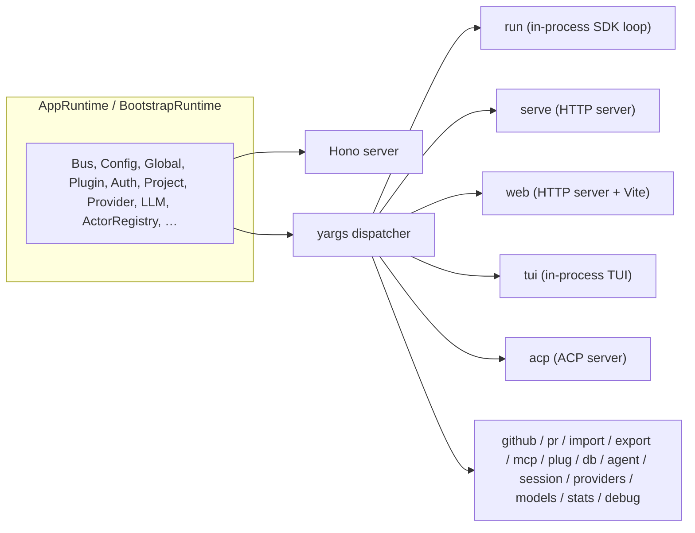

`AppRuntime` (`src/effect/app-runtime.ts`) is the **full-fat** Effect runtime (with all heavy services: opencode-core, actor, workflow, snapshot, worktree, history, lsp, mcp, etc.). `BootstrapRuntime` is the **thin** runtime used in `mimo acp` to keep the ACP host as light as possible — the ACP handler creates a per-session bridge to the full runtime only when an actual session is started.

### 5.4 What the CLI Binary Is and Isn't

- The binary is **not** just the TUI. It is the agent runtime; the TUI is a client of the same runtime.
- The same binary in `mimo serve` mode becomes a multi-tenant agent host that any number of TUI / Web / Slack / GitHub / ACP clients can connect to.
- The binary embeds the web UI assets (`dist/` is built by Vite, copied into the opencode package, and served from `mimo serve` at `/ui`).
- The binary never needs the `npm` registry at runtime — it only needs it at install time.

---

## 6. Multi-Client Surfaces

The agent runtime is the same regardless of which surface you're using. The only thing that changes is the front end. Each surface implements the same wire protocol (REST + WebSocket event sync).

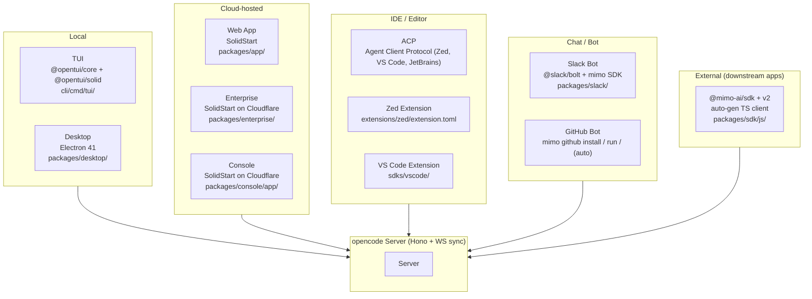

### 6.1 TUI (`@tui/`)

`src/cli/cmd/tui/` is a 56-file Solid.js on `@opentui/core`. It is *not* a separate npm package — it is bundled into the `mimo` binary so the same process hosts the TUI and the runtime. This eliminates a wire roundtrip for the dominant case (interactive use).

- `tui/index.tsx` — root component
- `tui/app.tsx` — `RouteProvider` / `route map` (line 246)
- `tui/route.ts` — `useRoute()` / `useRouteData()`
- `tui/context/` — Solid contexts (sync, route, command, keybind, i18n, sdk, config, theme, …)
- `tui/component/` — 31 components (sidebar, dialog, diff, prompt, toast, markdown, etc.)
- `tui/routes/` — page components: `routes/session/{index,permission,question,sidebar,…}.tsx`, `routes/{home,mcp,config,…}.tsx`
- `tui/ui/` — primitive UI elements
- `tui/util/` — `vad.ts` (TenVAD voice activity), `frecency.ts`, `clipboard.ts`, `command.ts`, `voice.ts`
- `tui/i18n/` — i18n bundle (en, es, fr, ja, ru, zh, zht)
- `tui/feature-plugins/` — plug-in frontends loaded at runtime: `home/` (3), `sidebar/` (10), `system/` (3)
- `tui/plugin/` — TUI plugin host (`@tui/plugin` namespace)
- `tui/asset/` — bundled assets including `ten_vad.wasm`, `ten_vad_loader.js`, `charge.wav`, `pulse-{a,b,c}.wav`, `TEN_VAD_LICENSE`

The TUI is a small OpenTUI app that talks to the embedded opencode server. See §33 for full details.

### 6.2 Desktop (`packages/desktop`)

Electron 41 (`packages/desktop/package.json:38`), using `electron-vite` for build, `electron-builder` for distribution. The main process spawns the `mimo` binary in `serve` mode on an ephemeral port, then opens a `BrowserWindow` pointed at the local web UI. The renderer is the same `packages/app` Solid app — Electron just adds a native shell.

- `packages/desktop/src/main.ts` — Electron main
- `packages/desktop/src/preload.ts` — context bridge
- `packages/desktop/src/pty/{ipc,native}.ts` — `node-pty` shell integration
- `packages/desktop/electron.vite.config.ts`
- `packages/desktop/electron-builder.yml`
- `packages/desktop/tsconfig.json`, `tsconfig.node.json`, `tsconfig.web.json`

### 6.3 Web App (`packages/app`)

A SolidStart SSR app that talks to either a local `mimo serve` instance or a remote one over the cloud sync protocol. It is the same Solid components the TUI uses, but routed and rendered as a regular web app. `packages/app/package.json:46-50` has `engines: { node: ">=22" }`.

- `packages/app/src/routes/` — file-based routing (SolidStart)
- `packages/app/src/components/` — 100+ Solid components
- `packages/app/src/hooks/` — `useChat`, `useSession`, `useModels`, `useHistory`, `useVoice`
- `packages/app/src/lib/` — SDK wrappers, sync protocol, i18n

### 6.4 Console (`packages/console/app`)

The cloud console — marketing site, account, billing, team management. Has its own database (PlanetScale MySQL via Drizzle), and its own set of routes:

- `packages/console/app/src/routes/` — 60+ route files
- `packages/console/app/src/lib/` — `core.ts` (Drizzle client), `keygen.ts`, `util.ts`
- `packages/console/app/src/components/` — 20+ components
- `packages/console/core/` — shared core models (`migrations/`, `src/schema.ts`, `src/actor.ts`, `src/plan.ts`, `src/biz.ts`, `src/key.ts`, `src/algorithm.ts`, `src/error.ts`, `src/index.ts`)

### 6.5 Enterprise (`packages/enterprise`)

A SolidStart app that ships to Cloudflare Pages, fronting an R2-backed `Share.Storage` and an `OpenCodeStorage` for cross-team session sharing. It uses the same auto-generated SDK as the web app but adds:

- `packages/enterprise/src/components/` — Solid components
- `packages/enterprise/src/lib/server/` — server-only modules (R2 binding, R2 storage adapter)
- `packages/enterprise/src/styles/`
- `packages/enterprise/src/cloudflare.ts` — Cloudflare types

### 6.6 Slack (`packages/slack`)

A 30-line Slack bot that wraps the opencode SDK. Each Slack thread becomes a session, and `message.part.updated` events are forwarded as Slack messages. Single file:

```typescript
// packages/slack/src/index.ts
import { App } from "@slack/bolt"
import { createOpencode, type ToolPart } from "@mimo-ai/sdk"
const app = new App({ token: process.env.SLACK_BOT_TOKEN, …, socketMode: true })
const opencode = await createOpencode({ port: 0 })
const events = await opencode.client.event.subscribe()
for await (const event of events.stream) {
  if (event.type === "message.part.updated") {
    const part = event.properties.part
    if (part.type === "tool") {
      // find the Slack session, post a tool-call card
    }
  }
}
```

### 6.7 GitHub Bot

`src/cli/cmd/github.ts` exposes three sub-commands:

- `mimo github install` — installs the MiMo GitHub App on the user's GitHub org/user.
- `mimo github run <owner>/<repo> <number>` — fetches a PR, creates a session, prompts the agent to address review comments.
- `mimo github` (alias) — auto-handler for newly created PRs (called from a webhook or a poll loop in `infra/`).

The bot uses `@octokit/rest` (`package.json:172` catalog pin) for GitHub API calls and `Git` (`src/git/index.ts`) for clone/checkout.

### 6.8 ACP

`mimo acp` (`src/cli/cmd/acp.ts`, 80 LOC) wraps the ACP server in `src/acp/agent.ts` (1,783 LOC). The server exposes a full Agent Client Protocol over stdio, used by:

- Zed (`packages/extensions/zed/extension.toml`) — Zed has ACP native support
- JetBrains (planned, via the openai/opencode-style ACE adapter)
- Any third-party IDE that supports ACP

### 6.9 VS Code Extension

`sdks/vscode/` is a small extension that ships a pre-built opencode binary. The extension is much smaller than the Zed one because VS Code's extension marketplace doesn't accept 100 MB binaries gracefully. The extension spawns `mimo` as a child process and talks to it via the SDK.

### 6.10 Per-Client Connection Topology

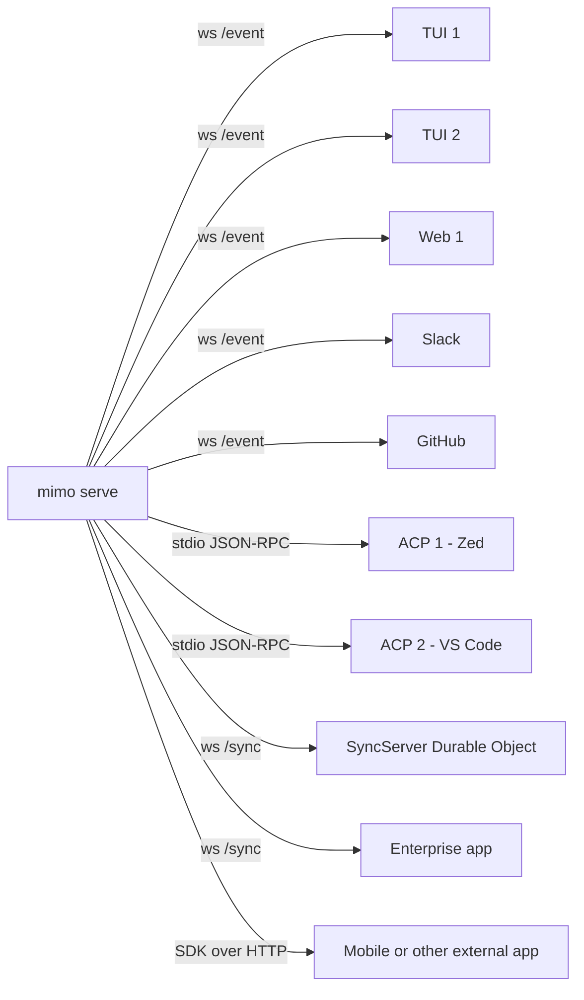

The server can serve many clients concurrently. Each client can independently subscribe to `event.subscribe()` (server-sent events from the SSE projector in `server/projectors.ts`) and post commands. A Durable Object (`SyncServer` in `packages/function/src/api.ts`) provides cross-device session sync — the SyncServer is a WebSocket hub that fans out events between clients connected to different opencode instances.

## 7. Server Architecture

The server is a Hono app defined in `src/server/server.ts` (~136 LOC) and built up by:

- `src/server/adapter.bun.ts` — Bun's native HTTP/WS adapter (zero-dep)
- `src/server/adapter.node.ts` — `@hono/node-server` adapter
- `src/server/middleware.ts` — `Auth`, `Logger`, `Compression`, `Cors`, `Error`, `Fence` middlewares
- `src/server/event.ts` — event bus SSE projector
- `src/server/projectors.ts` — `Event.Projector` interface + per-actor SSE fanout
- `src/server/proxy.ts` — `/proxy/<url>` HTML-to-Markdown content extraction for web fetch
- `src/server/mdns.ts` — LAN discovery via multicast DNS
- `src/server/workspace.ts` — per-directory workspace resolution
- `src/server/fence.ts` — short-lived sharing links
- `src/server/routes/global.ts` — `/global/*` (mimo-wide: providers, models, auth status)
- `src/server/routes/control/` — workspace + project info
- `src/server/routes/instance/` — all the per-instance routes (session, message, part, tool, file, agent, mcp, lsp, app, etc.)
- `src/server/routes/ui.ts` — serves the bundled web app (only in `serve` mode)

### 7.1 Route Surface

| Group | Mount | Endpoints (selection) | Source |
|---|---|---|---|
| **Global** | `/global` | `/config`, `/provider`, `/model`, `/auth/<id>`, `/dispose`, `/event`, `/share`, `/mdns/*`, `/health` | `routes/global.ts:38-112` |
| **Control** | `/control` | `/workspace/{init,close,list}`, `/project/{list,get,resolve}` | `routes/control/workspace.ts`, `routes/control/project.ts` |
| **Instance** | `/instance` | `/session/{create,list,get,update,delete,share,unshare,fork,init,abort,compact,prompt,command,shell,permissions,plan,permission,…}` | `routes/instance/session.ts` (1,030 LOC) |
| | | `/message/{list,get}` | `routes/instance/message.ts` |
| | | `/part/{update,get}` | `routes/instance/part.ts` |
| | | `/tool/{list,ids}` | `routes/instance/tool.ts` |
| | | `/file/{read,status,find,list,search,ls,grep,glob,write,edit}` | `routes/instance/file.ts` |
| | | `/agent/{list,get}` | `routes/instance/agent.ts` |
| | | `/mcp/*` | `routes/instance/mcp.ts` |
| | | `/lsp/*` | `routes/instance/lsp.ts` |
| | | `/app/{agents,commands,skills,providers,plugins,config}` | `routes/instance/app.ts` |
| | | `/experimental/{task,workflow,checkpoint,memory,dream,distill,goal}` | `routes/instance/experimental.ts` |
| | | `/vcs/*` | `routes/instance/vcs.ts` |
| **UI** | `/ui` | embedded web app assets (vite output) | `routes/ui.ts` |
| **OpenAPI** | `/doc` | `hono-openapi` `generateSpecs()` JSON | `routes/openapi.ts` |
| **Fence** | `/fence` | short-lived share verification | `fence.ts` |
| **Proxy** | `/proxy` | URL → Markdown extraction | `proxy.ts` |

The full OpenAPI spec is at `packages/sdk/openapi.json` (9,789 entries — every path, every schema, every component). It is regenerated by `script/generate.ts` on every schema change.

### 7.2 Middleware Pipeline

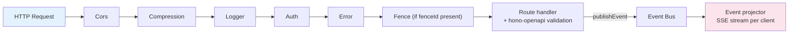

- **Cors** — allow-list by default (same-origin TUI), but the Web app at `mimo.xiaomi.com` and the SDK client get the standard CORS headers when `MIMOCODE_ALLOW_ORIGIN` is set.
- **Compression** — `compress` middleware (hono).
- **Logger** — `Log.create({ service: "server" })` writes structured JSON; redacts `Authorization` and other headers.
- **Auth** — middleware that resolves the bearer / cookie to a `User` via `Auth` Effect service; non-/global routes require a valid session token.
- **Error** — wraps every route so any thrown error becomes a `500 { error: "..." }` JSON response with the request ID.
- **Fence** — `/fence/<id>` is a short-lived share URL token (10 minutes). The handler validates the token before serving the share payload.

### 7.3 Event Sync (SSE)

`Event` is the bus that lets clients see what the runtime is doing. The runtime side publishes events (`Bus.publish(Event.Topic, payload)`); the server side projects those events to each subscribed client over Server-Sent Events.

```typescript
// src/server/event.ts
export const Event = {
  Started: Bus.event("server.connected", z.object({})),
  // ...
  subscribe: () =>
    Sse.stream(async (stream) => {
      for await (const event of Bus.subscribeAll()) {
        await stream.writeSSE({ event: event.type, data: JSON.stringify(event.properties) })
      }
    }),
}
```

The SDK call is `await sdk.event.subscribe(); for await (const e of stream) { … }` — and the `Slack` bot and `Desktop` use this for live updates. The TUI uses it too, but with the in-process shortcut (it subscribes directly to the in-process bus).

### 7.4 mDNS

`src/server/mdns.ts` registers a `_mimo._tcp` mDNS service when `MIMOCODE_MDNS=1` so other devices on the LAN can find the opencode instance. The TUI's `/connect` screen uses this for one-click "join the agent running on my other machine".

---

## 8. Wire Protocol & OpenAPI SDK

The wire protocol is the REST API exposed by the Hono server, plus an SSE event stream. It is documented as a single OpenAPI 3.1.1 spec at `packages/sdk/openapi.json` (9,789 entries) generated by `hono-openapi`'s `generateSpecs()`. The TypeScript SDK is generated from that spec.

### 8.1 SDK Generation

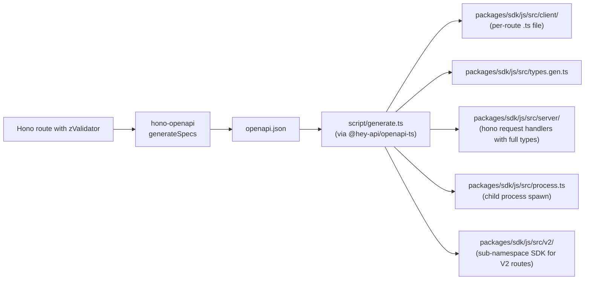

- `packages/sdk/js/src/index.ts` re-exports `createOpencodeClient` and `createOpencodeServer` from `client.ts` and `server.ts`.
- `packages/sdk/js/src/client.ts` — 3,118 LOC: a fully-typed HTTP client (uses `fetch` under the hood).
- `packages/sdk/js/src/server.ts` — 1,973 LOC: re-exports the Hono app + request handlers so external hosts can embed the opencode server.
- `packages/sdk/js/src/process.ts` — 200 LOC: spawn a `mimo serve` child process and return a connected client.
- `packages/sdk/js/src/v2/` — v2 of the SDK, sub-namespace SDK.
- `packages/sdk/js/src/gen/` — generated code (gitignored, regenerated).
- `packages/sdk/js/src/types.gen.ts` — generated types (Zod-validated).
- `packages/sdk/js/package.json:8` `"name": "@mimo-ai/sdk"`.

The `Slack` bot, the `Web` app, the `Desktop` app, the `Enterprise` app, the `GitHub` bot, and the `ACP` adapter all use the same SDK. Any change to a route schema triggers a re-gen and a downstream rebuild.

### 8.2 Example Route

```typescript
// src/server/routes/instance/session.ts (excerpt)
export const SessionRoute = hono().get(
  "/",
  describeRoute({
    summary: "List sessions",
    tags: ["session"],
    responses: {
      200: { description: "Sessions", content: { "application/json": { schema: resolver(z.array(Session.Info)) } } },
    },
  }),
  zValidator("query", z.object({ workspaceID: z.string().optional() })),
  async (c) => {
    const sessions = await Session.list(c.req.query())
    return c.json(sessions)
  },
)
```

`describeRoute()` is the hono-openapi decorator. The SDK will then expose `await sdk.session.list({ query: { workspaceID: "ws-1" } })` with full types.

### 8.3 Event Stream Payloads

`Bus.publish` is the only way the runtime communicates with clients. A non-exhaustive list of bus topics:

| Topic | Payload | Source |
|---|---|---|
| `server.connected` | `{}` | `src/server/event.ts:Started` |
| `session.created` | `Session.Info` | `session/session.ts:created` |
| `session.updated` | `Session.Info` | same |
| `session.deleted` | `{ id: SessionID }` | same |
| `message.updated` | `MessageV2.Info` | `session/message-v2.ts:updated` |
| `message.removed` | `{ sessionID, messageID }` | same |
| `message.part.updated` | `MessageV2.Part` | same |
| `message.part.removed` | `{ sessionID, messageID, partID }` | same |
| `tool.call.*` | tool-specific payloads | tool/registry.ts |
| `permission.asked` | `Permission.Info` | permission/ |
| `permission.replied` | `Permission.Info` | same |
| `lsp.diagnostics` | per-file diagnostics | lsp/ |
| `mcp.tools.changed` | `{ name, tools }` | mcp/ |
| `vcs.branch.updated` | branch info | git/ |
| `worktree.changed` | worktree state | worktree/ |
| `actor.changed` | actor lifecycle | actor/registry.ts |
| `checkpoint.written` | checkpoint metadata | session/checkpoint.ts |
| `compaction.started` / `.completed` / `.failed` | summary | session/compaction.ts |
| `goal.judged` | `Verdict` | session/goal.ts |
| `dream.started` / `.completed` | dream run metadata | session/auto-dream.ts |
| `distill.started` / `.completed` | distill run metadata | same |
| `workflow.run.started` / `.completed` / `.failed` | workflow run metadata | workflow/runtime.ts |
| `share.updated` | share info | share/ |

## 9. Storage Layer

### 9.1 Cross-Platform SQLite

`packages/opencode/src/storage/` ships both a Bun and a Node adapter:

```typescript
// packages/opencode/src/storage/db.bun.ts (paraphrased)
import { Database } from "bun:sqlite"
export const Database = (path: string) => new Database(path, { create: true })
```

```typescript
// packages/opencode/src/storage/db.node.ts
import { DatabaseSync } from "node:sqlite"
export const Database = (path: string) => new DatabaseSync(path)
```

The `imports.#db` condition in `packages/opencode/package.json:24` picks the right one at resolution time.

### 9.2 Drizzle ORM and Migrations

Drizzle ORM 1.0.0-beta.19 with a moving pre-release SHA suffix (`package.json:115-117` catalog pin). Migrations are 34 numbered folders under `packages/opencode/migration/`, with the latest being `20260609230000_workflow_agent_timeout`. The migration runner uses `drizzle-orm/bun-sqlite/migrator` and runs on `Server.start()` before any route handler accepts traffic.

```typescript
// packages/opencode/src/storage/db.ts (sketch)
import { drizzle } from "drizzle-orm/bun-sqlite"
import { Database as BunDatabase } from "#db"
import * as schema from "./schema"
export function orm() { return drizzle(new BunDatabase("mimocode.db"), { schema }) }
```

The console core uses the same Drizzle ORM with PlanetScale MySQL:

```typescript
// packages/console/core/src/index.ts (excerpt)
import { drizzle } from "drizzle-orm/planetscale"
import * as schema from "./schema"
export function createClient() { return drizzle(connect(), { schema }) }
```

The 34 opencode migrations cover, in order:

| Migration | Adds |
|---|---|
| `20260101000000_init` | initial schema (session, message, part, todo, permission, share) |
| `…_permission_user` | permission grants per user |
| `…_claude_import` | Claude Code session import |
| `…_history_fts` | FTS5 history index |
| `…_task_todo_redesign` | task/ todo redesign |
| `…_task_in_progress_owner` | `task_in_progress` table with owner |
| `…_inbox` | inbox (cross-session agent messages) |
| `…_workflow_run` | workflow run table |
| `…_workflow_script_sha` | script SHA tracking |
| `…_workflow_agent_timeout` | per-agent timeout column |
| `…_actor_lifecycle` | actor lifecycle column (recent) |
| …(24 earlier / smaller migrations) | |

The 68 console-core migrations under `packages/console/core/migrations/` cover the entire SaaS schema: `account`, `user`, `session`, `key`, `model_usage`, `plan`, `subscription`, `invoice`, `payment`, `workspace`, `user_workspace`, `billing`, `enterprise_*`, etc.

### 9.3 Core Schemas

```typescript
// packages/opencode/src/session/session.sql.ts:14-104
export const SessionTable = sqliteTable("session", {
  id:        text().primaryKey(),
  parent_id: text(),
  slug:      text().notNull(),
  project_id: text().notNull(),
  workspace_id: text().notNull(),
  directory: text().notNull(),
  title:     text().notNull(),
  version:   text().notNull(),       // current mimo version
  share_url: text(),
  summary_additions: integer().default(0),
  summary_deletions: integer().default(0),
  summary_files: integer().default(0),
  revert:    text(),
  message_count: integer().default(0),
  created_at: integer().notNull(),
  updated_at: integer().notNull(),
  archived:  integer({ mode: "boolean" }).default(false),
  // compaction / checkpoint columns
  compact:   text(),                  // JSON: { ref, summary, tokens, time }
  checkpoint: text(),                 // JSON: { ref, sha, time, bytes }
  // ...time, summary, cost, etc.
})

export const MessageTable = sqliteTable("message", {
  id:         text().primaryKey(),
  session_id: text().notNull(),
  parent_id:  text(),
  role:       text().notNull(),       // "user" | "assistant" | "system" | "tool" | "summary"
  agent:      text(),
  model:      text(),                  // JSON
  // ...cost, tokens, time, finish, error, summary, model_provider
})

export const PartTable = sqliteTable("part", {
  id:         text().primaryKey(),
  message_id: text().notNull(),
  session_id: text().notNull(),
  type:       text().notNull(),        // 14 part types
  // ...content: text (JSON per type)
  synthetic:  integer({ mode: "boolean" }).default(false),
  // ...
})

export const TodoTable = sqliteTable("todo", {
  id:         text().primaryKey(),
  session_id: text().notNull(),
  content:    text().notNull(),
  status:     text().notNull(),        // "pending" | "in_progress" | "completed" | "cancelled"
  priority:   integer().notNull(),
  parent_id:  text(),
  owner:      text(),                  // for in_progress tasks (recent migration)
})

export const PermissionTable = sqliteTable("permission", {
  id:         text().primaryKey(),
  session_id: text(),
  project_id: text(),
  // ...rule, action, behavior, updated_at
})
```

Other tables in `opencode` (in `*/*.sql.ts` files):

- `memory_fts` (Drizzle virtual FTS5 table) and `memory_fts_idx` — see §18.
- `share` (`src/share/share.sql.ts`) — shareable session URLs with token + expiry.
- `worktree` (`src/worktree/worktree.sql.ts`) — per-actor git worktree metadata.
- `actor` (`src/actor/actor.sql.ts`) — actor registry persistence (mode, lifecycle, context mode).
- `actor_lifecycle_event` (added in `…_actor_lifecycle` migration).
- `task_in_progress` (added in `…_task_in_progress_owner`) — tasks currently being worked on.
- `workflow_run` + `workflow_script_sha` + `workflow_agent_timeout` (added in `…_workflow_*`).
- `inbox` (added in `…_inbox`) — cross-actor messaging.
- `claude_import` (added in `…_claude_import`) — records of imported Claude Code sessions.
- `history` + `history_fts` (added in `…_history_fts`) — for shell command history.
- `checkpoint` (column on `session`).
- `control_plane_workspace` (`src/control-plane/workspace.sql.ts`).

### 9.4 Key-Value Store

`packages/opencode/src/storage/storage.ts` is a small K/V store used for:

- Snapshot blobs (`Storage.write(["snapshot", snapshotID], blob)`)
- Patch blobs (for `apply_patch` tool)
- Diff outputs (for `Storage.write(["diff", filePath], …)`)
- Session scratch (`["session", sessionID, "scratch"]`)

```typescript
// packages/opencode/src/storage/storage.ts (paraphrased)
export const Storage = {
  async read<T>(key: string[]): Promise<T | null> { … },
  async write<T>(key: string[], value: T): Promise<void> { … },
  async remove(key: string[]): Promise<void> { … },
  async list(prefix: string[]): Promise<string[][]> { … },
  // session_diff: compute and store a per-session diff
  async sessionDiff(sessionID: SessionID): Promise<Diff> { … },
  // overwriteMode: "merge" | "overwrite"
}
```

Backed by the same SQLite instance using a key → row table; large values are gzipped before insert.

### 9.5 Memory Files (not in SQLite)

Memory is **file-based**, with FTS5 indexing. See §18 for full details. The directory tree lives at `$MIMOCODE_HOME/memory/`:

```text
$HOME/.mimo/memory/
├── global/
│   └── MEMORY.md
├── projects/
│   └── <projectID>/
│       ├── MEMORY.md
│       ├── tasks/<taskID>/progress.md
│       └── ...
├── sessions/
│   └── <sessionID>/
│       ├── checkpoint.md
│       ├── notes.md
│       └── ...
└── cc/                                  # Claude Code bridge
    └── <sessionID>/
        └── *.jsonl                     # imported transcripts
```

---

## 10. The Effect Service Architecture

The whole runtime is built on Effect 4.0.0-beta.48 (`package.json:111` catalog pin). Every module is a `Context.Service<…>()` that gets composed with `Layer.provide`. This is the single biggest architectural decision in the codebase; understanding it unlocks the rest.

### 10.1 The Pattern

```typescript
// e.g. packages/opencode/src/session/session.ts
export interface Interface {
  create(input: { title?: string; parentID?: SessionID; projectID: ProjectID; directory: string }): Effect.Effect<Session.Info>
  get(id: SessionID): Effect.Effect<Session.Info | null>
  list(input: { workspaceID?: WorkspaceID }): Effect.Effect<Session.Info[]>
  messages(input: { sessionID: SessionID; agentID?: AgentName }): Effect.Effect<MessageV2.WithParts[]>
  // …30+ more methods
}
export class Service extends Context.Service<Service, Interface>()("@opencode/Session") {}
export const layer: Layer.Layer<Service, never, Bus.Service | Config.Service | …> = Layer.effect(Service, make)
export const { use, runPromise } = makeRuntime(Service, layer)
```

`makeRuntime` (`src/effect/run-service.ts`, 52 LOC) is the helper that converts an `Interface` into:

- `use(fn)` — run a thunk inside the live `FiberRef` context.
- `runPromise(effect)` — run a top-level `Effect` and return a `Promise`.

### 10.2 Service Catalog

| Module | Path | LOC | Depends on |
|---|---|---|---|
| `Bus` | `bus/bus.ts` | ~120 | — |
| `Global` | `global/global.ts` | ~250 | Bus, Config |
| `Config` | `config/config.ts` | ~480 | — |
| `Plugin` | `plugin/index.ts` | ~600 | Config, Auth |
| `Auth` | `auth/auth.ts` | ~400 | Config, Bus |
| `Project` | `project/project.ts` | ~280 | Config, Git |
| `InstanceState` | `effect/instance-state.ts` | 81 | (ScopedCache) |
| `Provider` | `provider/provider.ts` | 1,787 | Config, Plugin, Auth |
| `LLM` | `session/llm.ts` | 735 | Provider, Config |
| `Session` | `session/session.ts` | ~480 | Bus, Config, LLM, Snapshot, Memory |
| `SessionPrompt` | `session/prompt.ts` | 3,355 | LLM, Actor, Tool, Memory, Checkpoint, Goal, … |
| `SessionProcessor` | `session/processor.ts` | 962 | LLM, Tool, MessageV2 |
| `SessionCompaction` | `session/compaction.ts` | ~530 | LLM, Memory |
| `SessionCheckpoint` | `session/checkpoint.ts` | ~600 | LLM, Memory, Session |
| `SessionGoal` | `session/goal.ts` | ~230 | LLM, Session |
| `MaxMode` | `session/max-mode.ts` | ~400 | LLM, Tool, Provider |
| `AutoDream` | `session/auto-dream.ts` | ~120 | LLM, Memory, Skill |
| `Memory` | `memory/service.ts` | 144 | Storage |
| `ActorRegistry` | `actor/registry.ts` | ~260 | Bus, Worktree |
| `ActorSpawn` | `actor/spawn.ts` | 727 | Session, Provider, LLM |
| `ToolRegistry` | `tool/registry.ts` | 413 | Config, Plugin |
| `Workflow` | `workflow/runtime.ts` | 1,226 | Session, Actor, Inbox, Worktree |
| `Worktree` | `worktree/index.ts` | 614 | Git, Storage |
| `Snapshot` | `snapshot/index.ts` | ~780 | Git, Storage |
| `LSP` | `lsp/index.ts` | ~250 | File |
| `MCP` | `mcp/index.ts` | 944 | Auth, Plugin |
| `Skill` | `skill/index.ts` | ~300 | File, Config |
| `Permission` | `permission/index.ts` | ~250 | Config |
| `Share` | `share/share.ts` | ~300 | Bus, Auth |
| `Storage` | `storage/storage.ts` | ~150 | — |
| `Inbox` | `inbox/inbox.ts` | ~150 | Bus |
| `History` | `history/history.ts` | ~120 | Storage |
| `Patch` | `patch/index.ts` | ~80 | Storage |
| `Shell` | `shell/index.ts` | ~150 | Process |
| `Format` | `format/format.ts` | ~50 | — |
| `Id` | `id/id.ts` | ~50 | — |
| `Git` | `git/index.ts` | ~280 | — |
| `Bus` (event bus) | `bus/bus.ts` | ~120 | — |
| `Account` | `account/account.ts` | ~80 | Auth, Bus |
| `File` | `file/index.ts` | ~200 | — |
| `Env` | `env/index.ts` | ~150 | — |
| `Metrics` | `metrics/index.ts` | ~50 | — |
| `PTY` | `pty/pty.bun.ts` | ~200 | Process |

### 10.3 Layer Composition

```typescript
// src/effect/app-runtime.ts
const AppLayer = (directory: string) =>
  Layer.mergeAll(
    Bus.layer,
    Config.layer(directory),
    Global.layer,
    Plugin.layer,
    Auth.layer,
    Project.layer,
    Provider.layer,
    LLM.layer,
    Memory.layer,
    Storage.layer,
    ActorRegistry.layer,
    ActorSpawn.layer,
    Worktree.layer,
    Snapshot.layer,
    Workflow.layer,
    Skill.layer,
    Permission.layer,
    MCP.layer,
    LSP.layer,
    Session.layer,
    SessionPrompt.layer,
    SessionProcessor.layer,
    SessionCompaction.layer,
    SessionCheckpoint.layer,
    SessionGoal.layer,
    MaxMode.layer,
    AutoDream.layer,
    // ...+30 more
  )
```

The full layer is heavy. `BootstrapRuntime` is a thin variant for `mimo acp` that doesn't include the agent subsystems (it lazy-imports them per-session):

```typescript
// src/effect/bootstrap-runtime.ts
const BootstrapLayer = Layer.merge(Bus.layer, Config.layer(""), Plugin.layer, Global.layer)
```

### 10.4 Why Effect-TS

The choice of Effect-TS is deliberate:

1. **Resource management** — `Layer` provides automatic setup / teardown for the SQLite db, the LSP clients, the MCP connections, the git worktrees.
2. **Structured concurrency** — `FiberRef` and `Scope` make the per-session cancellation model clean (`session.abort` cancels the fiber tree; that fiber's teardown closes the worktree, the LSP client, and the MCP sockets).
3. **Type-safe DI** — `Context.Service<Service, Interface>()` makes every service a type-level dependency, so the compiler can detect missing layer wiring.
4. **Streaming** — `Stream` is the natural fit for LLM token streams, event bus subscription, and the workflow actor fan-out.
5. **Testability** — every service can be replaced in tests via `Layer.succeed(Service, mock)`.

The trade-off is that Effect is currently 4.0.0-beta (the version is in `package.json:111`), so the API is moving and the codebase has to track it.

## 11. Project & Instance Model

`Instance` and `Project` are the two scoping concepts in the runtime. A single process can host multiple workspaces (directories) and projects, but each gets its own scope and its own state.

### 11.1 The InstanceService Cache

`src/effect/instance-state.ts` (81 LOC) is the per-directory `ScopedCache`:

```typescript
export class InstanceState extends Service<InstanceState, {
  get(directory: string): Effect.Effect<Instance>
  list(): Effect.Effect<Instance[]>
}>()("@opencode/InstanceState") {}

export const layer = Layer.suspend(() => {
  const cache = new Map<string, Resource<Instance>>()
  // ...Scope.make + finalizer
  return Layer.effect(InstanceState, InstanceState.of({
    get: (directory) =>
      Effect.gen(function* () {
        const existing = cache.get(directory)
        if (existing) return yield* existing.get
        const resource = yield* Scope.make()
        const instance = yield* Resource.make(yield* build(directory, resource.scope), (i) =>
          Effect.sync(() => cache.delete(directory)))
        cache.set(directory, instance)
        return yield* instance.get
      }),
    list: () => Effect.sync(() => Array.from(cache.values()).map((r) => r.value)),
  }))
})
```

Each directory the process opens gets a `Scope`. When the directory is closed (e.g. on `mimo serve` shutdown), the Scope is released and all its resources (DB connections, file watchers, LSP clients) are torn down automatically.

### 11.2 The Instance

`src/project/instance.ts` (~280 LOC) exposes:

- `Instance.provide({ directory, init, fn })` — run `fn` inside a per-directory scope.
- `Instance.directory` — the current directory (for the active scope).
- `Instance.project` — the current `Project.Info`.
- `Instance.workspace` — the current `Workspace.Info`.
- `Instance.state(...)` — per-directory map (e.g. `state.sessionID` for `mimo run <message>`).
- `Instance.bootstrap` — runs all `*.mimo.ts` (or `*.mimocode.ts`) bootstraps in the project root.

### 11.3 The Project

`src/project/project.ts` (~280 LOC) is the higher-level grouping: one git repo = one project. Project fields:

- `id` — ULID
- `worktree` — root worktree (`.git`)
- `vcs` — `git` | `none`
- `name` — derived from directory
- `sandboxes` — list of allowed `bash` dirs
- `commands` — the merged set of commands (`{type:"local", command: "…"} | {type:"mcp", …} | {type:"template", …}`) from `mimocode.json` + `.mimocode/command/` + plugin commands
- `agents` — the merged set of agents from `mimocode.json` + `.mimocode/agent/` + plugin agents

### 11.4 The Workspace

`src/project/workspace.ts` (~200 LOC) is the *current* directory inside a project. One project can have many workspaces (`worktrees` for subagents). The Workspace is:

- `id` — ULID
- `type` — `local` | `worktree` | `control-plane` | `remote`
- `directory` — the path
- `branch` — the current branch (for `worktree` type)
- `projectID` — the owning project
- `extra` — for `control-plane` workspaces, the workspace ID on the remote plane

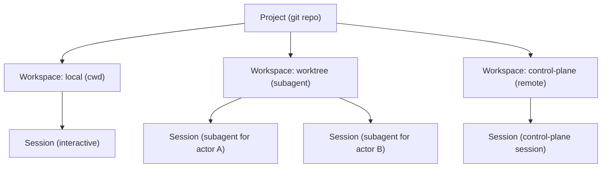

## 12. The Agent Loop

`src/session/prompt.ts` (3,355 LOC) is the heart of the system. The `Interface` defined at line 170 has these methods:

```typescript
export interface Interface {
  cancel(sessionID: SessionID): Effect.Effect<void>
  prompt(input: PromptInput): Effect.Effect<void>
  loop(input: LoopInput): Effect.Effect<void>            // the per-session fiber
  shell(input: ShellInput): Effect.Effect<void>
  command(input: CommandInput): Effect.Effect<void>
  resolvePromptPart(input: ResolveInput): Effect.Effect<PartID>
  // …and several helpers
}
```

### 12.1 The Main Run-Loop

`runLoop` (`session/prompt.ts:1810-2350`) is the per-session fiber. Pseudocode:

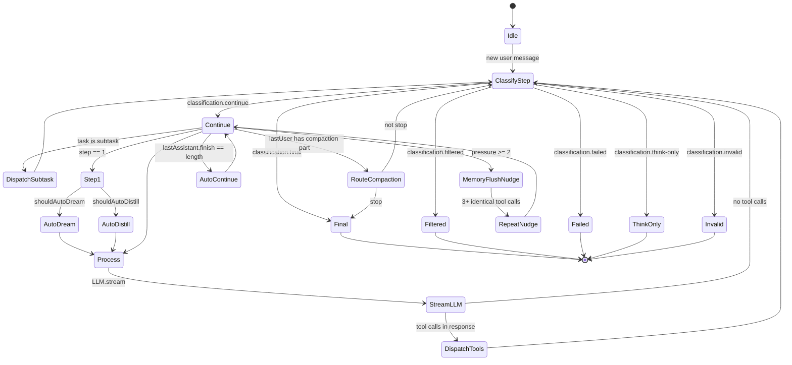

### 12.2 Step Classification

`session/classify.ts` returns one of:

| Type | Meaning | Action |
|---|---|---|
| `continue` | The model is in the middle of work; another LLM call is needed. | Loop back, dispatch new LLM call |
| `final` | The model has finished a turn (text only, no tool calls, or tool calls completed). | Break; check `goalGate` and `taskGate` |
| `filtered` | Content filter rejected the response. | Write a `writeContentFilterError` to the message, break |
| `failed` | The model returned an error (e.g. rate limit, network). | Write `writeModelError`, retry, then break |
| `think-only` | The model only emitted `<think>` blocks with no action. | Try `autoContinueInvalidOutput` (poke the model with a nudge), else break |
| `invalid` | The model emitted an invalid tool call (e.g. malformed JSON). | Same as `think-only` |

### 12.3 Subtask Dispatch

When a `subtask` part is in the task list, the loop calls `handleSubtask`, which:

1. Reads the subtask description.
2. Decides which subagent type to dispatch (e.g. `explore` for read-only exploration, `general` for the default).
3. Calls `ActorRegistry.spawn({ … })` to create a new actor + worktree.
4. Bridges the actor's return to the parent session.
5. Inserts the result back as a `subtask-result` part.

### 12.4 Compaction Branch

If the last user message contains a `compaction` part (e.g. user typed `/compact` or auto-trigger fired on overflow), the loop calls `compaction.process({ … })`. The `process` function:

1. Reads the last N turns.
2. Calls the LLM with a summarization prompt (`agent/prompt/compaction.txt`).
3. Inserts a `compaction-summary` part.
4. Optionally sets `session.compact` so the next prompt rebuilds context from the summary.

### 12.5 Memory Flush Nudge

`pressureLevel({ cfg, tokens, model })` returns 0-3. At ≥ 2 (≥ 70% of context), the loop injects a synthetic text part on the last user message:

> `<system-reminder>\nContext is filling up (>70%). If you have important learnings or decisions from this session, consider writing them to memory now before context may be reset.\n</system-reminder>`

At ≥ 3 (> 85%), the reminder is more urgent.

### 12.6 Repeat-Step Nudge

`REPEATED_STEP_THRESHOLD` (constant in `prompt.ts`, default 3) — if the last 3 finished assistant steps made the identical tool call, the loop injects:

> `<system-reminder>\nYou appear to be stuck repeating the same tool call 3 times. Consider a different approach.\n</system-reminder>`

### 12.7 Step-1 Side Effects (First Turn Only)

On the very first step of a session (no parent), the loop may auto-trigger:

- `autoDream` — spawn a `dream` agent session in the background, with title `Auto Dream` and prompt `DREAM_TASK` (from `session/auto-dream.ts:20-26`). This consolidates memories.
- `autoDistill` — spawn a `distill` agent session, title `Auto Distill`, prompt `DISTILL_TASK` (from same file, lines 28-36). This discovers and writes new skills.

The `dream` and `distill` agents are detached — they run on the full AppRuntime but don't block the main session.

### 12.8 Title / Predict

In parallel to the first step, `title({ … })` fires if the session is still using a default title. It uses the lightweight `title` agent to summarize the first user message into a short title (`session/prompt.ts:303-345`).

Also on the first turn, `predict` runs after the assistant has finished its first response: it uses the `title` agent's settings (swapping the prompt to `PREDICT_SYSTEM`) to predict what the user might type next, returned as a "predict next" suggestion. The TUI shows this as a ghost-text suggestion in the prompt input.

### 12.9 Auto-Continue on Length

If `lastAssistant.finish === "length"` and there are no tool calls, the loop calls `autoContinueOutputLength({ lastUser, assistant })`, which:

1. Inserts a synthetic text part: `Continue your previous response.` on the user message.
2. Returns true → loop continues.

This handles the common case where the model output gets truncated by the token limit but was otherwise on track.

### 12.10 Goal / Task Gate

`goalGate` and `taskGate` are the only ways the loop *exits* on `classification.final`:

- `taskGate` — if the session has open `Todo` items marked `in_progress` or `pending`, the loop continues. This is the **task gate**: the agent must finish its todos before exiting.
- `goalGate` — if the user gave a `/goal <condition>`, the loop calls `Goal.judge()` (a separate LLM call with a small judge model) to evaluate the condition. If the condition is met, the loop exits. If not, the loop injects the verdict and continues.

### 12.11 Checkpoint Trigger

`tryStartCheckpointWriter` is called after every finished assistant step. It computes the projected checkpoint size (via `buildLLMRequestPrefix`); if it exceeds the budget, it spawns the `checkpoint-writer` subagent to bring the structured memory up to date. See §19.

---

## 13. The LLM Service

`src/session/llm.ts` (735 LOC) wraps the Vercel AI SDK's `streamText` and `generateText` calls. It is the single point of contact between the agent loop and the actual model providers.

### 13.1 Public Interface

```typescript
// session/llm.ts:25-80 (paraphrased)
export interface Interface {
  stream(input: {
    agent: Agent.Info
    user?: MessageV2.User
    system: string[]
    small?: boolean
    tools: Record<string, AITool>
    model: Provider.Model
    sessionID: SessionID
    retries?: number
    messages: ModelMessage[]
  }): Stream.Stream<Event, LLM.Error>
  generateText(input: { … }): Effect.Effect<{ text: string; usage?: Usage }, LLM.Error>
  resolveTools(input: { … }): Effect.Effect<{ tools: Record<string, AITool>; prompts: ToolPrompt[] }>
  buildMemoryInstructions(input: { … }): string
}
```

### 13.2 The `stream` Function

```typescript
const stream = Effect.fn("LLM.stream")(function* (input) {
  const cfg = yield* config.get()
  const provider = yield* provider.getProvider(input.model.providerID)
  const baseModel = providerSDK(model.providerID)(model.modelID)
  // Apply per-model transform (from provider/transform.ts)
  const transform = yield* provider.transform(input.model, "stream")
  // Apply plugin hooks (chat.headers, chat.params, experimental.chat.system.transform)
  const params = yield* plugins.callHook("chat.params", { … })
  const headers = yield* plugins.callHook("chat.headers", { … })
  const system = (yield* plugins.callHook("experimental.chat.system.transform", { system, agent, sessionID })) ?? system
  // Build the final messages
  const messages = yield* MessageV2.toModelMessages(input.messages, input.model)
  // Call Vercel AI SDK
  return yield* Effect.promise(() =>
    streamText({
      model: wrapLanguageModel({ model: baseModel, middleware: transform.middleware }),
      system: system.join("\n\n"),
      messages,
      tools: input.tools,
      abortSignal: scope.signal,
      // … headers, providerOptions, etc.
    })
  ).pipe(Effect.scoped, Effect.map((r) => r.toUIMessageStream()))
})
```

### 13.3 Provider Transform

`src/provider/transform.ts` (1,322 LOC) is the per-model options layer. It encapsulates quirks like:

- Anthropic: `betas: ["fine-grained-tool-streaming-2025-05-14"]`, `thinking: { type: "enabled", budget_tokens: 1024 }` for Sonnet 4
- OpenAI: `parallelToolCalls: true`, `reasoning_effort: "high"` for o3
- Google: `safetySettings: …`
- Mistral: `promptMode: "reasoning"`
- xAI: search parameters
- Bedrock: `region`, `inferenceProfileArn`

The transform is selected at runtime by `provider.transform(model, "stream")` which looks up a `ProviderTransform` in the registry.

### 13.4 Plugin Hooks on LLM

Four hooks are called inside the LLM service:

| Hook | Source | Purpose |
|---|---|---|
| `chat.headers` | `plugin/index.ts:117` | Modify HTTP headers (e.g. add MiMo auth, add Stripe billing trace ID) |
| `chat.params` | `plugin/index.ts:118` | Modify the AI SDK params (e.g. inject `tools.0.cacheControl`) |
| `experimental.chat.system.transform` | `plugin/index.ts:119` | Transform the system prompt (e.g. inject MiMo-specific instructions) |
| `tool.execute.before` / `tool.execute.after` | `plugin/index.ts:120-121` | Wrap tool execution (e.g. Mimo's checkpoint-splitover plugin) |
| `actor.preStop` / `actor.postStop` | `plugin/index.ts:122-123` | Hooks around actor termination |

### 13.5 The GitLab Workflow Model

`llm.ts:480-540` (paraphrased) handles the GitLab Duo Workflow integration:

```typescript
import { GitLabWorkflowLanguageModel } from "gitlab-ai-provider"
const gitlab = new GitLabWorkflowLanguageModel({ … })
// When user selects provider="gitlab-workflow" and model="duo-chat", wrap as LanguageModelV2.
```

The `gitlab-ai-provider` package is patched (see `patches/gitlab-ai-provider@6.6.0.patch`).

### 13.6 Retry and Error

`LLM.Error` is a Zod-discriminated union:

```typescript
export const Error = z.discriminatedUnion("type", [
  z.object({ type: "rate-limit", retryAfter: z.number() }),
  z.object({ type: "context-overflow", tokens: z.number(), max: z.number() }),
  z.object({ type: "content-filter", reason: z.string() }),
  z.object({ type: "provider-error", statusCode: z.number(), message: z.string() }),
  z.object({ type: "auth-error", providerID: z.string() }),
  z.object({ type: "aborted" }),
  z.object({ type: "unknown", message: z.string() }),
])
```

Retry logic lives in `session/retry.ts`:

| Error type | Retry strategy |
|---|---|
| `rate-limit` | exponential backoff with `retryAfter`; max 3 retries |
| `context-overflow` | trigger `compaction.process` (with `overflow: true`), retry the same LLM call with the compacted context |
| `provider-error` 5xx | exponential backoff; max 2 retries |
| `provider-error` 4xx | no retry; surface to user |
| `aborted` | no retry; exit loop |
| `auth-error` | no retry; trigger `Auth.refresh`; re-prompt user for re-auth |

### 13.7 System Prompt Assembly

`buildSystemPrompt(input)` (in `llm.ts:580-720`) assembles:

1. **Provider baseline** — the provider's default system prompt (e.g. `claude-sonnet-4-20250514`'s helpful-assistant prompt).
2. **Agent system** — the agent's `system` field (e.g. `build` agent: a long markdown file describing MiMo conventions, subagent protocol, memory tool usage).
3. **Model-specific system** — overrides for known models (e.g. the `beast.txt` system prompt for the "beast" preset, `codex.txt` for codex).
4. **Project system** — `AGENTS.md` and `CLAUDE.md` from the project root.
5. **Memory system** — top-k matches from the memory FTS5 index, formatted as `<memory>…</memory>` blocks.
6. **Custom instructions** — `~/.config/mimo/instructions.md` (the user-level instructions).
7. **Hook transforms** — `experimental.chat.system.transform` hooks can prepend/append/rewrite any of the above.

The order matters: the agent system is the most authoritative (sets the persona and constraints), the project system is in the middle, the memory is at the end (suggested context, not authoritative).

### 13.8 Subagent Return Protocol

The `buildMemoryInstructions()` function (in `llm.ts:99-180`) is the contract between the main agent and its subagents. It produces a string that the main agent's system prompt includes:

> **Subagent return protocol** — When a subagent returns, it must include:
>
> - `Status: completed | failed | needs-help`
> - `Summary: <one-line description>`
> - `Files touched: <comma-separated paths>`
> - `Key findings: <markdown bullet list>`
> - `Open issues: <markdown bullet list or "none">`
>
> The main agent parses this format and surfaces it in its own response. Subagents that don't follow the format are auto-rejected and re-prompted.

This is the most pragmatic subagent design I've seen — it sidesteps the entire "free-form text is hard to parse" problem by mandating a fixed schema.

---

## 14. MessageV2 — The Message / Parts Schema

`src/session/message-v2.ts` (1,136 LOC) defines the unified message and part schema. Every user message, every assistant turn, every tool call, every compaction summary, every checkpoint-writer output, every dream output is a `MessageV2.WithParts` row.

### 14.1 Messages

```typescript
// message-v2.ts:30-50 (paraphrased)
export const User = z.object({
  id: MessageID, session_id: SessionID, role: z.literal("user"),
  time: z.object({ created: z.number() }),
  agent: AgentName.optional(),           // e.g. "build", "plan", "compose"
  model: ModelSpec.optional(),            // { providerID, modelID }
  system: z.string().optional(),
  tools: z.record(z.string(), ToolOverride).optional(),
  // ...+cost, tokens
})

export const Assistant = z.object({
  id: MessageID, session_id: SessionID, role: z.literal("assistant"),
  parent_id: MessageID,
  agent: AgentName,
  model: ModelSpec,
  // ...+cost, tokens (input, output, cache read, cache write)
  system: z.string().optional(),
  tools: z.record(z.string(), ToolOverride).optional(),
  error: LLM.Error.optional(),
  finish: z.enum(["stop", "length", "content-filter", "tool-calls", "error"]).optional(),
  time: z.object({ created, completed, compacted }),
  summary: z.boolean().default(false),    // is this a summary message?
  // ...+parent
})

export const Tool = z.object({ … })      // virtual, replaced by Part rows
export const Summary = z.object({ … })    // compaction summary
```

### 14.2 Parts (14 types)

```typescript
export const Part = z.discriminatedUnion("type", [
  z.object({ type: z.literal("text"),       text: z.string(), synthetic: z.boolean().optional(), … }),
  z.object({ type: z.literal("file"),       url: z.string(), filename: z.string(), mime: z.string() }),
  z.object({ type: z.literal("tool"),       tool: z.string(), state: z.object({ status, input, output, metadata }), callID, … }),
  z.object({ type: z.literal("subtask"),    prompt: z.string(), agent: AgentName, model: ModelSpec, tools: z.record(z.string(), ToolOverride) }),
  z.object({ type: z.literal("compaction"), auto: z.boolean(), overflow: z.boolean().optional() }),
  z.object({ type: z.literal("compaction-summary"), text: z.string(), tokens: z.number() }),
  z.object({ type: z.literal("agent"),      name: AgentName, prompt: z.string() }),     // for compose mode
  z.object({ type: z.literal("step-start"), snapshot: z.string() }),
  z.object({ type: z.literal("step-finish"), reason: z.string(), cost, tokens }),
  z.object({ type: z.literal("retry"),      attempt: z.number(), error: LLM.Error, messageID }),
  z.object({ type: z.literal("snapshot"),   snapshotID: z.string() }),
  z.object({ type: z.literal("patch"),      files: z.array(z.object({ path, diff, before, after })) }),
  z.object({ type: z.literal("memory"),     action: z.enum(["read", "write", "search", "delete", "list"]), path, content, query }),
  z.object({ type: z.literal("skill"),      name: z.string(), content: z.string() }),
])
```

### 14.3 Why the Unified Schema

The unified schema is what enables:

- **TUI/Desktop/Web to render any message** — the renderer doesn't care if the part is text, a tool call, a snapshot, or a memory read; it just looks at `type`.
- **Compaction to summarize across message types** — the LLM gets the rendered parts as Markdown, regardless of origin.
- **Subagent return to be a synthetic text part** — the parser only needs to look for `Status:` / `Summary:` / `Files touched:` in a `text` part.
- **Events to be one per part** — `message.part.updated` carries the full part; no need for a separate event per type.
- **Storage to be one table** — `Part` rows with `type` discriminator and JSON `content`. No need for 14 tables.

## 15. The Actor System

The actor system is what makes a single session able to coordinate many parallel workers. Every worker — subagent, background dream, workflow actor — is an `Actor`.

### 15.1 Actor Schema

```typescript
// src/actor/schema.ts
export const ActorMode = z.enum(["main", "subagent", "peer", "system"])
export const Lifecycle = z.enum(["ephemeral", "persistent"])
export const ContextMode = z.enum(["shared", "isolated", "scoped"])

export const Actor = z.object({
  id:            ActorID,
  session_id:    SessionID,
  parent_id:     ActorID.optional(),
  agent:         AgentName,
  mode:          ActorMode,
  lifecycle:     Lifecycle,
  context_mode:  ContextMode,
  workspace_id:  WorkspaceID.optional(),     // for worktree-isolated actors
  model:         ModelSpec.optional(),
  prompt:        z.string().optional(),
  status:        z.enum(["running", "completed", "failed", "cancelled", "aborted"]),
  started_at:    z.number(),
  ended_at:      z.number().optional(),
  error:         z.string().optional(),
  result:        z.string().optional(),      // one-line summary
  // …tool, model, token, cost accounting
})

export const ActorLifecycleEvent = z.object({
  id:             z.string(),
  actor_id:       ActorID,
  kind:           z.enum(["spawned", "started", "step", "pre-stop", "post-stop", "completed", "failed", "cancelled"]),
  payload:        z.record(z.unknown()).optional(),
  time:           z.number(),
})
```

### 15.2 ActorRegistry

`src/actor/registry.ts` (~260 LOC) is the Effect service that tracks every actor in the process:

```typescript
export interface Interface {
  register(actor: Actor): Effect.Effect<Actor>
  get(actorID: ActorID): Effect.Effect<Actor | null>
  list(input: { sessionID?: SessionID; parentID?: ActorID; status?: Status }): Effect.Effect<Actor[]>
  update(actorID: ActorID, patch: Partial<Actor>): Effect.Effect<Actor>
  appendEvent(event: ActorLifecycleEvent): Effect.Effect<void>
  listEvents(input: { actorID: ActorID }): Effect.Effect<ActorLifecycleEvent[]>
  // Children tree
  tree(sessionID: SessionID): Effect.Effect<ActorTreeNode>
}
```

### 15.3 ActorSpawn

`src/actor/spawn.ts` (727 LOC) is the actual spawn function:

```typescript
// src/actor/spawn.ts:60-100 (paraphrased)
export const spawn = Effect.fn("ActorSpawn.spawn")(function* (input: SpawnInput) {
  const actor = yield* ActorRegistry.register({
    session_id: input.sessionID, parent_id: input.parentID,
    agent: input.agent, mode: input.mode ?? "subagent",
    lifecycle: input.lifecycle ?? "ephemeral",
    context_mode: input.contextMode ?? "isolated",
    status: "running", started_at: Date.now(),
  })
  // Create worktree if needed
  if (input.contextMode === "isolated") {
    const wt = yield* Worktree.create({ sessionID: input.sessionID, actorID: actor.id })
    yield* ActorRegistry.update(actor.id, { workspace_id: wt.id })
  }
  // Fire preStop / postStop hooks
  yield* plugins.callHook("actor.preStop", { actor })
  // Fork a new session for the actor
  const child = yield* Session.create({ parentID: input.sessionID, projectID: input.projectID, … })
  yield* SessionPrompt.prompt({ sessionID: child.id, agent: input.agent, parts: input.parts, model: input.model })
  // Subscribe to child's completion
  const result = yield* ActorWaiter.wait(child.id, actor.id)
  yield* ActorRegistry.update(actor.id, { status: "completed", ended_at: Date.now(), result: result.summary })
  yield* plugins.callHook("actor.postStop", { actor, result })
  // Cleanup worktree
  if (input.contextMode === "isolated") yield* Worktree.remove(wt.id)
  return { actor, result }
})
```

### 15.4 Modes

- `main` — the only actor in an interactive session that has user-level control. Exactly one per session.
- `subagent` — spawned by a tool (`actor`, `task`, `composer`) or by the main actor itself.
- `peer` — a sibling of `main` (e.g. a parallel `compose` actor at the top level).
- `system` — a hidden system actor (e.g. `checkpoint-writer`, `compaction`, `goal-judge`, `dream`, `distill`). Never user-visible.

### 15.5 Lifecycle

- `ephemeral` — actor ends when the parent session ends. The most common mode.
- `persistent` — actor persists across session restarts (e.g. a long-running `dream` task). The actor's session is preserved in the DB.

### 15.6 Context Modes

- `shared` — actor shares the parent's filesystem and git state.
- `isolated` — actor gets its own git worktree (see §25). Common for parallel exploration.
- `scoped` — actor gets a subdirectory only (e.g. the actor's `cwd` is `${parent.cwd}/scoped/${actor.id}`).

### 15.7 ActorWaiter

`src/actor/waiter.ts` bridges the parent and child sessions:

```typescript
export const wait = (childSessionID: SessionID, actorID: ActorID) =>
  Effect.gen(function* () {
    const stream = yield* Bus.subscribe(["session.updated", "message.part.updated", "actor.changed"])
    let lastAssistant: MessageV2.WithParts | null = null
    for await (const event of stream) {
      if (event.type === "message.part.updated" && event.properties.messageID) {
        // accumulate the child's assistant message
        lastAssistant = yield* MessageV2.get(event.properties.messageID)
      }
      if (event.type === "session.updated" && event.properties.id === childSessionID && event.properties.archived) {
        return { summary: lastAssistant?.parts.findLast((p) => p.type === "text")?.text ?? "" }
      }
    }
    return yield* Effect.interrupt
  })
```

### 15.8 Actor Tree

A typical session might have a tree like:

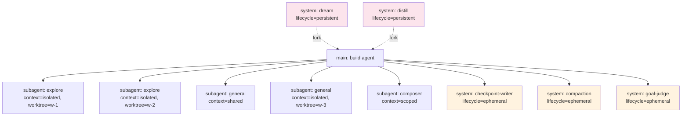

---

## 16. The Provider System

`src/provider/provider.ts` (1,787 LOC) is the largest single file outside the session subsystem. It abstracts 24+ AI provider SDKs behind a uniform interface.

### 16.1 The ProviderRegistry

```typescript
// src/provider/provider.ts:100-200 (paraphrased)
export const Provider = {
  // 1. Built-in SDKs
  "@ai-sdk/anthropic":        () => import("@ai-sdk/anthropic").then((m) => m.createAnthropic),
  "@ai-sdk/openai":           () => import("@ai-sdk/openai").then((m) => m.createOpenAI),
  "@ai-sdk/google":           () => import("@ai-sdk/google").then((m) => m.createGoogleGenerativeAI),
  "@ai-sdk/amazon-bedrock":   () => import("@ai-sdk/amazon-bedrock").then((m) => m.createAmazonBedrock),
  "@ai-sdk/azure":            () => import("@ai-sdk/azure").then((m) => m.createAzure),
  "@ai-sdk/openai-compatible":() => import("@ai-sdk/openai-compatible").then((m) => m.createOpenAICompatible),
  "@ai-sdk/mistral":          () => import("@ai-sdk/mistral").then((m) => m.createMistral),
  "@ai-sdk/cohere":           () => import("@ai-sdk/cohere").then((m) => m.createCohere),
  "@ai-sdk/groq":             () => import("@ai-sdk/groq").then((m) => m.createGroq),
  "@ai-sdk/deepinfra":        () => import("@ai-sdk/deepinfra").then((m) => m.createDeepInfra),
  "@ai-sdk/deepseek":         () => import("@ai-sdk/deepseek").then((m) => m.createDeepSeek),
  "@ai-sdk/cerebras":         () => import("@ai-sdk/cerebras").then((m) => m.createCerebras),
  "@ai-sdk/fireworks":        () => import("@ai-sdk/fireworks").then((m) => m.createFireworks),
  "@ai-sdk/togetherai":       () => import("@ai-sdk/togetherai").then((m) => m.createTogetherAI),
  "@ai-sdk/xai":              () => import("@ai-sdk/xai").then((m) => m.createXai),
  "@ai-sdk/perplexity":       () => import("@ai-sdk/perplexity").then((m) => m.createPerplexity),
  "@ai-sdk/vercel":           () => import("@ai-sdk/vercel").then((m) => m.createVercel),
  "@ai-sdk/revai":            () => import("@ai-sdk/revai").then((m) => m.createRevai),
  "@ai-sdk/assemblyai":       () => import("@ai-sdk/assemblyai").then((m) => m.createAssemblyAI),
  "@ai-sdk/deepgram":         () => import("@ai-sdk/deepgram").then((m) => m.createDeepgram),
  "@ai-sdk/elevenlabs":       () => import("@ai-sdk/elevenlabs").then((m) => m.createElevenLabs),
  "@ai-sdk/hume":             () => import("@ai-sdk/hume").then((m) => m.createHume),
  "@ai-sdk/lmnt":             () => import("@ai-sdk/lmnt").then((m) => m.createLMNT),
  "@ai-sdk/gladia":           () => import("@ai-sdk/gladia").then((m) => m.createGladia),
  "gitlab-ai-provider":       () => import("gitlab-ai-provider").then((m) => m.createGitLabWorkflow),
  "venice-ai-sdk-provider":   () => import("venice-ai-sdk-provider").then((m) => m.createVenice),
  // 2. Custom (this repo)
  "copilot":                  () => import("./sdk/copilot").then((m) => m.createCopilot),
  // 3. Plugin-contributed
  // (loaded at startup from .mimocode/plugin/ and from npm)
}
```

The `providerID` (e.g. `"anthropic"`, `"xiaomi"`, `"copilot"`) maps to a `ProviderInfo` which carries the SDK loader, the default options, the default model, the auth flow, and the per-model transform selector.

### 16.2 The Model List

`provider/models.ts` is a snapshot of `models.dev` (the same dataset that OpenCode uses). It exposes:

- `provider.models.all()` — every known model across all providers
- `provider.models.search(query)` — fuzzysort over name, provider, description
- `provider.models.get(providerID, modelID)` — full model info
- `provider.models.refresh()` — fetch latest from `https://models.dev/api.json` and cache

### 16.3 The Custom Copilot SDK

`packages/opencode/src/provider/sdk/copilot/` is a hand-rolled OpenAI-compatible client for GitHub Copilot. It authenticates with the GitHub Copilot token endpoint, then talks to the Copilot API directly. This is needed because `@ai-sdk/openai-compatible` does not handle Copilot's auth flow.

### 16.4 ProviderTransform

`src/provider/transform.ts` (1,322 LOC) — per-model option overrides. The transform is a `LanguageModelV2Middleware` that wraps the model with:

- `transformParams` — add `providerOptions.<vendor>.x` to the params
- `wrapStream` — wrap the stream to add metrics, redact sensitive content, etc.

### 16.5 Auth

`src/provider/auth.ts` exposes:

- `Auth.required(providerID, modelID)` — does this model need auth? Returns `false` for free tier (e.g. MiMo Free).
- `Auth.token(providerID, modelID)` — get the bearer / api key.
- `Auth.refresh(providerID, modelID)` — refresh OAuth tokens.
- `Auth.apiKey(providerID, modelID)` — set / get / remove API key.
- `Auth.status()` — list all auth providers and their status.

`Auth.Plugin` (e.g. `MimoAuthPlugin`, `MimoFreeAuthPlugin`, `AnthropicProxyPlugin`, `CodexAuthPlugin`, `CopilotAuthPlugin`, `GitlabAuthPlugin`, `PoeAuthPlugin`, `CloudflareWorkersAuthPlugin`, `CloudflareAIGatewayAuthPlugin`, `CheckpointSplitoverPlugin`, `SubagentProgressCheckerPlugin`) is the plugin-interface contract for adding new auth flows. See §27.

### 16.6 `provider/sdks/` Directory

| Path | Purpose |
|---|---|
| `provider/sdk/copilot/` | custom OpenAI-compatible client for GitHub Copilot |
| `provider/sdk/copilot/auth.ts` | Copilot OAuth + token cache |
| `provider/sdk/copilot/models.ts` | Copilot model list |
| `provider/sdk/copilot/transform.ts` | Copilot-specific transforms |

The `xiaomi` provider is a built-in that uses the MiMo API directly. There is no separate `provider/sdk/xiaomi/` directory; the SDK call is `@ai-sdk/openai-compatible.createOpenAICompatible({ baseURL: "https://api.xiaomi.com/mimo/v1", apiKey })`.

## 17. The Tool System

`src/tool/registry.ts` (413 LOC) is the tool registry. Every tool — built-in, custom, or plugin — registers here and is exposed to the LLM by name.

### 17.1 The ToolRegistry

```typescript
// src/tool/registry.ts:30-60 (paraphrased)
export interface ToolInfo {
  id: string
  description?: string
  parameters: ZodSchema             // AI SDK tool input schema
  execute(args, ctx): Promise<ToolResult>
  // Optional: formatResult(args, result, ctx) -> string  for nicer UI
  // Optional: requiresPermission(args, ctx) -> "ask" | "allow" | "deny"
}

export const ToolRegistry = Service<ToolRegistry, {
  register(tool: ToolInfo | ToolInfo[]): Effect.Effect<void>
  named(name: string): Effect.Effect<ToolInfo | null>
  ids(): Effect.Effect<string[]>
  enabled(input: { agent: AgentName; model: ModelSpec; sessionID: SessionID }): Effect.Effect<Record<string, AITool>>
}>()("@opencode/ToolRegistry") {}
```

The `enabled()` method is the one the LLM service calls. It returns the Zod-validated `tools` object for the AI SDK.

### 17.2 Built-in Tools

`src/tool/index.ts` registers the 21 default tools:

| ID | Description | Path |
|---|---|---|
| `read` | Read a file (with line numbers, ranges, line-count cap) | `tool/read.ts` (302 LOC) |
| `write` | Write a file (creates parent dirs, atomic rename) | `tool/write.ts` |
| `edit` | Find-and-replace edit (multi-occurrence, fuzzy match) | `tool/edit.ts` |
| `multiedit` | Multiple edits in one call | `tool/multiedit.ts` |
| `apply_patch` | Apply a unified diff (or `mimo` format) | `tool/apply_patch.ts` |
| `bash` | Run a shell command (`shell-tokenize` + `shell-wrap`) | `tool/bash.ts` |
| `bash-interactive` | Interactive PTY (long-running) | `tool/bash-interactive.ts` |
| `glob` | Find files by glob | `tool/glob.ts` |
| `grep` | Regex search in files | `tool/grep.ts` |
| `codesearch` | Locality-aware code search (more than `grep`) | `tool/codesearch.ts` |
| `webfetch` | HTTP GET, HTML → Markdown | `tool/webfetch.ts` |
| `websearch` | Search the web (Tavily, Brave, Kagi) | `tool/websearch/index.ts` |
| `lsp` | Query the LSP server for a file (hover, definition, references) | `tool/lsp.ts` |
| `mcp` | Call an MCP tool by name | `tool/mcp-exa.ts` (named "mcp") |
| `task` | Spawn a structured subagent task (returns Status/Summary/Files/Key findings/Open issues) | `tool/task.ts` (332 LOC) |
| `actor` | Spawn an actor with full prompt freedom (no structured return) | `tool/actor.ts` |
| `actor.shell` | Spawn a shell-only actor (no LLM, runs commands in worktree) | `tool/actor.shell.ts` |
| `plan` | Enter/exit plan mode | `tool/plan.ts` |
| `question` | Ask the user a multiple-choice question | `tool/question.ts` |
| `skill` | Load a skill by name (returns its content) | `tool/skill.ts` |
| `workflow` | Run a workflow (QuickJS script) | `tool/workflow.ts` |
| `memory` | Read/write/search the memory tree | `tool/memory.ts` |
| `history` | Search shell history | `tool/history.ts` |
| `todowrite` | Update session todos (internal; often hidden) | (implicit, in `todowrite.ts` if present) |
| `websearch` sub-`websearch.txt` prompt | the search-system prompt | `tool/websearch/websearch.txt` |

The TUI's `/tool` command lists these by name with a one-line description.

### 17.3 The `task` Tool

`tool/task.ts` is the structured subagent dispatch. It is the LLM-facing counterpart to `ActorSpawn.spawn`. The LLM is expected to call it with:

```yaml
- id: <unique-id>             # for the LLM to track
  agent: explore | general    # subagent type
  prompt: <description>
  model: { providerID, modelID }  # override model (optional)
  contextMode: shared | isolated | scoped
  outputFormat: structured    # enforced Status/Summary/Files touched
  worktree:                   # for isolated mode
    branch: <name>
```

The `outputFormat: structured` mode enforces the subagent return protocol — the response is wrapped in:

```yaml
Status: completed | failed | needs-help
Summary: <one line>
Files touched: <comma-separated>
Key findings:
  - <bullet>
Open issues: <bullet list or "none">
```

The main agent's system prompt includes the contract. The return is parsed by `actor/return-header.ts` and surfaced to the main LLM as a synthetic text part. This is the cleanest subagent return protocol I've seen.

### 17.4 The `actor` and `actor.shell` Tools

`tool/actor.ts` is the low-level counterpart to `task`. It accepts:

```yaml
- id: <id>
  agent: <any built-in agent>
  prompt: <free text>
  contextMode: shared | isolated | scoped
  worktree: { branch: <name> }   # if isolated
  mode: subagent | peer
  lifecycle: ephemeral | persistent
```

The return is raw — the parent agent is responsible for parsing whatever the child emitted.

`tool/actor.shell.ts` is even lower-level: it spawns a *shell-only* actor (no LLM, just a bash session) inside a worktree. Useful for running tests in a parallel worktree while the main session continues.

### 17.5 The `plan` Tool

`tool/plan.ts` is the entry/exit of plan mode. In plan mode, the agent cannot make edits except to the plan file. The `SessionPrompt.insertReminders` function (in `session/prompt.ts:427-490`) injects:

> `<system-reminder>\nPlan mode is active. The user indicated that they do not want you to execute yet — you MUST NOT make any edits (with the exception of the plan file mentioned below), run any non-readonly tools (including changing configs or making commits), or otherwise make any changes to the system. This supersedes any other instructions you have received.\n\n## Plan File Info:\nNo plan file exists yet. You should create your plan at /path/to/plan.md using the write tool.\n...</system-reminder>`

This is the safety net for the common "I want the agent to think first, then I'll approve" workflow.

### 17.6 Permission Integration

Every tool can declare `requiresPermission(args, ctx) -> "ask" | "allow" | "deny"`. The tool registry, when assembling the tool list for the LLM, calls `Permission.evaluate` to decide. If a tool returns `"ask"`, the registry pauses execution, surfaces the request to the user (via the `Permission.asked` bus event), and resumes when the user replies.

### 17.7 Plugin-Contributed Tools

Plugins can contribute tools via the `Plugin.ToolContribution` interface. See §27.

---

## 18. The Memory System

`src/memory/` is one of the largest MiMo-specific additions. The system is the answer to "how do we make the agent remember across sessions".

### 18.1 The Memory File Tree

```text
$XDG_DATA_HOME/mimo/memory/         # or $MIMOCODE_HOME/memory/
├── global/
│   └── MEMORY.md                   # the user's cross-project memory
├── projects/
│   └── <projectID>/
│       ├── MEMORY.md               # project-level
│       ├── tasks/
│       │   └── <taskID>/
│       │       └── progress.md     # per-task
│       └── notes/
│           └── <noteID>.md         # ad-hoc notes
├── sessions/
│   └── <sessionID>/
│       ├── checkpoint.md           # sole curator: the checkpoint-writer subagent
│       ├── notes.md                # session scratch
│       └── ...
└── cc/                             # Claude Code bridge (read-only mirror)
    └── <sessionID>/
        └── *.jsonl
```

### 18.2 Memory File Format

Each `.md` file has YAML front-matter for indexing + free-form Markdown body for content:

```markdown
---
type: free | memory | checkpoint | progress | notes | feedback | project | reference | user
scope: global | projects | sessions | cc
scopeID: <projectID | sessionID | "global">
fingerprint: <sha256 of body>
created: 2026-06-12T10:00:00Z
updated: 2026-06-12T10:00:00Z
tags: [coding, project-foo, …]
---

# Title

Free-form Markdown content…
```

The `type` taxonomy is fixed (8 values, see §18.6).

### 18.3 Memory Service

`src/memory/service.ts` (144 LOC) is the Effect service:

```typescript
export interface Interface {
  read(input: { type?: Type; scope?: Scope; scopeID?: string; path?: string }): Effect.Effect<MemoryFile | null>
  write(input: { path: string; scope: Scope; scopeID: string; type: Type; body: string; tags?: string[] }): Effect.Effect<void>
  search(input: { query: string; scope?: Scope; scopeID?: string; limit?: number }): Effect.Effect<MemoryHit[]>
  list(input: { scope?: Scope; scopeID?: string }): Effect.Effect<MemoryFile[]>
  delete(input: { path: string }): Effect.Effect<void>
  reconcile(): Effect.Effect<void>   // filesystem → FTS5 index sync
}
```

### 18.4 FTS5 Index

`src/memory/fts.sql.ts` declares a Drizzle virtual FTS5 table:

```sql
CREATE VIRTUAL TABLE memory_fts USING fts5(
  path, scope, scope_id, type, body, fingerprint, last_indexed_at,
  tokenize = "unicode61 remove_diacritics 2"
)
CREATE TABLE memory_fts_idx (path PRIMARY KEY, scope, scope_id, type, body, fingerprint, last_indexed_at)
CREATE TRIGGER memory_fts_insert AFTER INSERT ON memory_fts_idx BEGIN INSERT INTO memory_fts(path, scope, scope_id, type, body, fingerprint, last_indexed_at) VALUES (new.path, new.scope, new.scope_id, new.type, new.body, new.fingerprint, new.last_indexed_at); END;
CREATE TRIGGER memory_fts_delete AFTER DELETE ON memory_fts_idx BEGIN DELETE FROM memory_fts WHERE path = old.path; END;
CREATE TRIGGER memory_fts_update AFTER UPDATE ON memory_fts_idx BEGIN DELETE FROM memory_fts WHERE path = old.path; INSERT INTO memory_fts(path, scope, scope_id, type, body, fingerprint, last_indexed_at) VALUES (new.path, new.scope, new.scope_id, new.type, new.body, new.fingerprint, new.last_indexed_at); END;
```

The Drizzle wrapper (`memory_fts`, `memory_fts_idx`) keeps the filesystem in sync with the index. The `reconcile` job (in `memory/reconcile.ts`) walks the memory directory and re-indexes any file whose `fingerprint` is stale.

### 18.5 Query Builder

`src/memory/fts-query.ts` (paraphrased) builds the FTS5 MATCH expression. It tokenizes the user query, escapes FTS5 operators, and adds prefix wildcards for short tokens:

```typescript
export const buildFtsQuery = (query: string): string => {
  const tokens = query.split(/\s+/).filter(Boolean)
  return tokens.map((t) => {
    const safe = t.replace(/[^a-zA-Z0-9_-]/g, "")
    if (safe.length <= 4) return `${safe}*`           // prefix
    return `"${safe}"`                                 // exact
  }).join(" OR ")
}
```

### 18.6 Memory Type Taxonomy

| Type | Used for | Owner |
|---|---|---|
| `free` | untyped, ad-hoc notes | user (any tool) |
| `memory` | canonical project memory | `checkpoint-writer` subagent |
| `checkpoint` | session checkpoint state | `checkpoint-writer` subagent |
| `progress` | task progress | `task` tool + subagents |
| `notes` | session scratch | subagents |
| `feedback` | user feedback on the agent's output | user (via TUI) |
| `project` | project-level info | `checkpoint-writer` subagent |
| `reference` | external reference material | user (import) |
| `user` | user-level preferences (global scope) | user |

The Type taxonomy is enforced at write-time: `MemoryService.write` rejects writes that don't match the allowed type for the tool.

### 18.7 The Memory Tool

`src/tool/memory.ts` exposes the memory system to the LLM:

| Action | Args | Description |
|---|---|---|
| `read` | `{ path: string }` | read a memory file |
| `write` | `{ path, type, body, tags? }` | write a memory file (subject to type + scope validation) |
| `search` | `{ query, scope?, scopeID?, limit? }` | FTS5 search |
| `list` | `{ scope?, scopeID? }` | list files |
| `delete` | `{ path }` | delete a memory file (logged + audited) |

The LLM is given the `memory` tool by default in the `build` agent's tool list, and is *encouraged* to write important learnings to `type: "memory"` as soon as they happen (the `memory flush nudge` in §12.5 is the trigger).

### 18.8 The Claude Code Bridge

`src/session/claude-import.ts` reads `~/.claude/` (the Claude Code CLI's data dir) and mirrors relevant session JSONL files into `memory/cc/<sessionID>/`. This is a **read-only** mirror — the agent can read Claude Code's history but doesn't write back. The bridge is a one-time import on session start (or on `mimo import`).

### 18.9 Memory Search Workflow

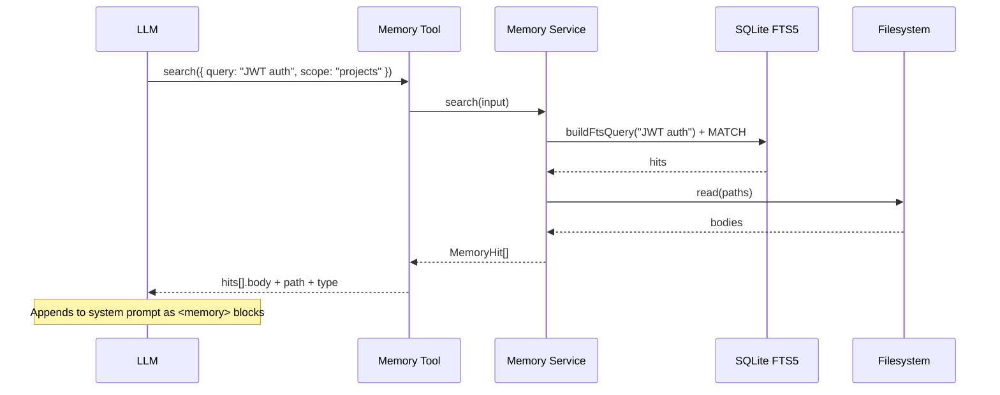

## 19. The Checkpoint System

`src/session/checkpoint.ts` (~600 LOC) is the most distinctive MiMo feature. Its job is to keep the structured `checkpoint.md` for a session in sync with reality, and to *rebuild* the LLM context from the checkpoint when context gets too long.

### 19.1 Why a Checkpoint?

When a session runs for hours, the context window fills up. Compaction (lossy LLM summarization) loses details. A `checkpoint` is a different approach: it is a **structured Markdown file** that the agent maintains incrementally, representing the agent's understanding of "where we are, what we've decided, what's left, what I've learned". When context overflows, the runtime rebuilds the LLM context from the checkpoint + recent messages + memory hits, not from a lossy summary.

### 19.2 The `checkpoint.md` Schema

```markdown
---
sessionID: <id>
fingerprint: <sha256 of body>
lastUpdated: 2026-06-12T10:00:00Z
---

# Checkpoint for <session title>

## Goal
<one-sentence user-stated goal, possibly with /goal condition>

## State
<structured description of what's been done, what state the system is in>

## Decisions
- [decision 1]
- [decision 2]

## Open Issues
- [issue 1]
- [issue 2]

## Learnings
- <learning 1>
- <learning 2>

## Next Steps
- [step 1]
- [step 2]
```

The exact template is in `session/checkpoint-templates.ts` (paraphrased), and the validator is in `session/checkpoint-validator.ts`.

### 19.3 The Writer Subagent

When the runtime decides the checkpoint needs updating (see §19.5 below), it spawns a `checkpoint-writer` subagent. The `checkpoint-writer` agent:

- Model: the user-configured `small` model (default `claude-haiku-4-5` or `gpt-4.1-mini`).
- Tools: `read` (limited to memory + recent parts), `write` (limited to `checkpoint.md`), `memory` (read-only).
- System prompt: `agent/prompt/checkpoint-writer.txt` (a long instruction on how to maintain the file).
- Input: the current checkpoint + the last N parts of the session + memory hits.
- Output: a new `checkpoint.md` written via the `write` tool.

The runtime validates the output with `checkpoint-validator.ts` (must parse, must have all required sections, must be < 2,000 tokens). If validation fails, the writer is re-prompted up to 3 times (`checkpoint-retry.ts`).

### 19.4 The Rebuild Pipeline

`session/boundary.ts` (paraphrased) defines the token budget. The runtime calls `buildLLMRequestPrefix({ sessionID })` (`session/llm-request-prefix.ts`, ~300 LOC) to assemble the prefix that goes *before* recent messages:

```typescript
const prefix = [
  // 1. System prompt (full)
  ...systemMessages,
  // 2. Checkpoint (full, if exists and within budget)
  checkpointSection,
  // 3. Memory search results (top-k, FTS5)
  ...memoryHits,
  // 4. AGENTS.md / CLAUDE.md from project
  ...projectInstructions,
  // 5. (Older messages are omitted — the boundary walker decided where to cut)
  recentMessages,
]
```

`boundary.ts` walks the message list and decides where the cut is: it tries to keep the most recent `preserveRecentBudget` tokens (~2,000-8,000), and uses the checkpoint + memory to fill in the gap. The cut is preserved across LLM calls (same sessionID, same `cut_at` messageID) so the agent doesn't see a "jumping" context.

### 19.5 When to Checkpoint

`tryStartCheckpointWriter` is called from `SessionPrompt.runLoop` after every finished assistant step. It:

1. Computes the projected size of the next `buildLLMRequestPrefix` call.
2. If projected > `CFG.budget` (default 80% of context), and the last checkpoint write was > 5 minutes ago, it schedules a writer run on the `AppRuntime` (detached, doesn't block the loop).
3. If a writer run is already in flight for this session, skip.

The 5-minute debounce prevents runaway writer spawning in tight loops.

### 19.6 Checkpoint vs Compaction

| Aspect | Checkpoint | Compaction |
|---|---|---|
| **Trigger** | Approaching budget (projected 80%) | Overflow (already over budget) or `/compact` |
| **Method** | Writer subagent with full toolset, structured file | LLM summarization (lossy) |
| **Output** | Structured Markdown file (`checkpoint.md`) | Free-form Markdown (`compaction-summary` part) |
| **Lossy?** | No — preserves details, just reorganizes | Yes — drops details |
| **Used for** | Rebuild context after overflow | Quick context reduction |
| **Frequency** | ~Every 5-10 mins of active work | Once on overflow |
| **Runs as** | System actor (parallel to main loop) | Sync in the main loop |

In practice the runtime uses checkpoints preventatively and compaction reactively. A long session will have dozens of checkpoints and zero compactions.

### 19.7 Checkpoint Alignment

`session/checkpoint-align.ts` (paraphrased) is the "did the agent drift?" check: after a checkpoint write, the runtime reads the new checkpoint and the actual session state, and computes a diff. If the diff is large (e.g. the agent claimed "completed task X" in the checkpoint but `Task.todos` shows X is still pending), the runtime logs a warning and may auto-correct the checkpoint.

### 19.8 Checkpoint Progress Reconcile

`session/checkpoint-progress-reconcile.ts` reconciles the `## Next Steps` section with the `TodoTable`:

- If a Next Step is already a completed todo, remove it.
- If a Next Step is missing from todos, add it.
- If todos has items not in Next Steps, surface them as "open work".

This keeps the checkpoint in lockstep with reality.

---

## 20. Compaction & Prune

`src/session/compaction.ts` (~530 LOC) is the lossy LLM-summarization counterpart to checkpoint. It is invoked when context overflows and the runtime needs to free space *now*.

### 20.1 The Compaction Pipeline


### 20.2 The Compaction Prompt

`agent/prompt/compaction.txt` is the summarization instruction. It asks the LLM to produce a structured summary with:

- **Goal** — what the user originally wanted
- **State** — what has been done
- **Key Decisions** — important choices and their rationale
- **Open Questions** — pending decisions
- **Files** — touched/created/modified paths
- **Tool Outputs** — important outputs (truncated to ~500 tokens each)
- **Next Steps** — what should happen next

The summary is capped at `MAX_COMPACTION_TOKENS` (default 4,000 tokens).

### 20.3 The `PRUNE_PROTECT` Mechanism

`session/compaction.ts:33-37` defines the protected tool list:

```typescript
export const PRUNE_MINIMUM = 20_000
export const PRUNE_PROTECT = 40_000
const PRUNE_PROTECTED_TOOLS = ["skill"]
```

If the total tokens of the kept range (recent messages + summary) exceed `PRUNE_PROTECT`, the runtime prunes the oldest tool results (except `skill` outputs) until under `PRUNE_PROTECT`. The `PRUNE_MINIMUM` is the minimum total that the runtime will try to preserve.

### 20.4 The `isOverflow` Function

`session/compaction.ts:523-528` is the public API used by the LLM service on `LLM.Error.context-overflow`:

```typescript
export async function isOverflow(input: { tokens: MessageV2.Assistant["tokens"]; model: Provider.Model }): Promise<boolean> {
  return input.tokens.input + input.tokens.output >= model.limit.input
}
```

When this returns true, the LLM service triggers a compaction with `overflow: true` and retries.

### 20.5 The `prune` Function

`session/compaction.ts:527-540` is the public API used by the checkpoint writer to remove a prune-level worth of older parts. It:

1. Computes the current prefix size.
2. If > `PRUNE_PROTECT`, finds the oldest non-protected part.
3. Marks it `pruned: true` (soft-delete; the part still exists in the DB but is not included in LLM context).
4. Loops until under budget.

The `prune` function is a way to free tokens *without* a summary — pure lossless deletion of old tool output that the agent probably doesn't need.

### 20.6 When the Loop Routes to Compaction

In `SessionPrompt.runLoop` (see §12), the loop detects:

```typescript
if (lastUserMsgForCompaction?.parts.some((p) => p.type === "compaction")) {
  const compactionPart = lastUserMsgForCompaction.parts.find((p): p is MessageV2.CompactionPart => p.type === "compaction")
  const result = yield* compaction.process({
    parentID: lastUser.id,
    messages: allMsgs,
    sessionID,
    auto: compactionPart?.auto ?? false,
    overflow: compactionPart?.overflow,
    agentID: lastUser.agentID,
  })
  if (result === "stop") break
  continue
}
```

A `compaction` part is added by:

- The user typing `/compact`.
- The auto-trigger on overflow.
- The LLM calling a hidden `compact` tool (sometimes useful when the agent notices it's losing context).

---

## 21. Max Mode

`src/session/max-mode.ts` (~400 LOC) implements parallel best-of-N with a judge. The idea: when the user wants the best answer possible, run N parallel candidates, then have a judge pick the best.

### 21.1 The `max` Agent

`agent/agent.ts:316-343` (paraphrased) defines the `max` agent. It has access to a special tool: `max` (or runs as the agent itself). The agent's system prompt is `session/prompt/max-steps.txt`. When invoked, the agent:

1. Spins up `DEFAULT_CANDIDATES = 5` parallel `runCandidate()` calls — each is a separate `maxCandidate` actor in its own worktree, each running a fresh LLM loop on the user's task.
2. Each candidate returns a `Candidate` object: `{ text, tool_calls, cost, tokens, model, transcript }`.
3. The `judge()` function calls a separate LLM (typically the small model) to pick the best.
4. The winning candidate's `text` is "replayed" to the main session as the assistant's final response.

### 21.2 `runMaxStep`

```typescript
// src/session/max-mode.ts:312-397
export const runMaxStep = (input: MaxStepInput): Effect.Effect<SessionProcessor.Result, Error> =>
  Effect.gen(function* () {
    const candidates = yield* Effect.all(
      Array.from({ length: DEFAULT_CANDIDATES }, (_, i) => runCandidate(input, i)),
      { concurrency: "unbounded", discard: false }
    )
    const verdict = yield* judge(input, candidates.filter(Boolean))
    const winner = candidates[verdict.pick]
    return { /* synthesize SessionProcessor.Result from winner */ }
  })
```

The `runCandidate` spawns an actor, runs the same LLM loop the main agent would, and returns the transcript.

### 21.3 The Judge

```typescript
const JUDGE_SYSTEM = [
  "You are evaluating candidate answers to a coding task.",
  "Pick the one that:",
  "  1. Correctly addresses the user's request",
  "  2. Uses the simplest approach",
  "  3. Has the fewest bugs",
  "  4. Reads most cleanly",
  "Return ONLY the index (0..N-1) of the winning candidate, nothing else.",
].join("\n")
```

The judge gets a formatted list of all candidates' text + tool calls and returns a single number.

### 21.4 Why This Is Useful

Max mode is intentionally expensive. It is invoked:

- When the user types `/max <prompt>`.
- When the main agent's response is in the "stalled on a hard problem" pattern (auto-trigger; very rare).
- When the workflow tool decides the current step needs max-style reasoning.

The cost is `N * (cost of one LLM call) + judge_cost`. The benefit is much higher success rate on hard problems.

### 21.5 ToSchemaOnlyTools

`max-mode.ts:78-101` defines `toSchemaOnlyTools(tools)` — when running in max mode, the candidates do not actually *execute* tool calls; they just *describe* what they would do. The actual tool execution happens once, using the winning candidate's tool calls. This is the secret sauce that keeps max mode's cost from being `N * (tool execution cost)`.

---

## 22. Goal / Stop Condition

`src/session/goal.ts` (~230 LOC) implements the `/goal <condition>` command. The user can give the agent an explicit stop condition (e.g. "all tests pass", "the API returns 200 on /health") and the runtime uses a separate LLM call (the "judge") to evaluate the condition before allowing the loop to exit.

### 22.1 The `goal` Mechanism

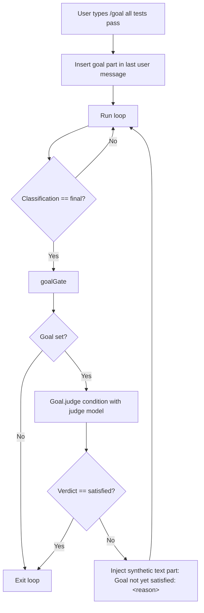

### 22.2 The Judge

```typescript
// src/session/goal.ts:237-310
export const judge = (input: { session: Session.Info; condition: string; messages: MessageV2.WithParts[] }): Effect.Effect<Verdict, Error> =>
  Effect.gen(function* () {
    const system = JUDGE_SYSTEM.replace("{{condition}}", input.condition)
    const user = judgeUser(input.condition)
    const result = yield* LLM.generateText({ agent: goalJudgeAgent, system: [system], small: true, … })
    return Verdict.parse(result.text)
  })
```

The `Verdict` schema:

```typescript
export const Verdict = z.object({
  satisfied: z.boolean(),
  reason: z.string(),
  confidence: z.number().min(0).max(1),
})
```

The `reason` is surfaced to the user; the `confidence` is logged for analytics.

### 22.3 Goal Failure Recovery

If the judge returns `satisfied: false`, the loop injects a synthetic text part:

> `<system-reminder>\nGoal not yet satisfied: <reason>\nContinue working toward the goal.</system-reminder>`

This is the only way the agent can be told "you said you were done, but you're not". It's the closest the system has to a "rubber band" — it pulls the agent back into the loop when it tries to exit prematurely.

### 22.4 Task Gate vs Goal Gate

| Gate | Trigger | Purpose |
|---|---|---|
| `taskGate` | Open todos | Don't exit if there's outstanding work |
| `goalGate` | User-set `/goal` | Don't exit if the user's condition isn't met |

The two gates are independent. An agent can pass `taskGate` (no todos) but fail `goalGate` (goal not satisfied), or vice versa.

---

## 23. Dream & Distill

`src/session/auto-dream.ts` (~120 LOC) is the periodic background memory-maintenance mechanism. The `dream` and `distill` agents are detached system actors that run in the background.

### 23.1 Dream

The `dream` agent (`agent/prompt/dream.txt`) is told:

> You are a memory dreamer. Read the recent session memories, identify patterns, and consolidate. Your job is to:
> 1. Read all `type: memory` files in this project.
> 2. Identify duplicates, contradictions, and outdated information.
> 3. Write a single consolidated `type: memory` file at the canonical path.
> 4. Optionally, propose new skills (see Distill).

Dream runs in the background on a 7-day cadence (`DEFAULT_DREAM_INTERVAL_DAYS = 7`). It is also triggered on the first step of a new session if `shouldAutoDream(cfg)` returns true (which checks the last-dreamed timestamp and the `cfg.auto_dream_interval_days`).

### 23.2 Distill

The `distill` agent (`agent/prompt/distill.txt`) is told:

> You are a skill distiller. Read the recent sessions, identify repeated patterns of tool use, and propose new skills. Your job is to:
> 1. Read the last 7 days of session transcripts.
> 2. Identify 3+ occurrences of the same tool sequence (e.g. "find TODO files, grep for FIXME, edit each one").
> 3. For each pattern, write a new `type: skill` file with a name, description, and the tool sequence.
> 4. Do NOT write skills that already exist.

Distill runs on a 30-day cadence (`DEFAULT_DISTILL_INTERVAL_DAYS = 30`).

### 23.3 Auto-Trigger Logic

```typescript
// src/session/auto-dream.ts:103-121
export const shouldAutoDream = (cfg: Config.Info) => shouldAutoRun({
  lastRun: cfg.lastDreamedAt,
  interval: cfg.dreamInterval ?? DEFAULT_DREAM_INTERVAL_DAYS,
  log: log.with({ agent: "dream" }),
})

export const shouldAutoDistill = (cfg: Config.Info) => shouldAutoRun({
  lastRun: cfg.lastDistilledAt,
  interval: cfg.distillInterval ?? DEFAULT_DISTILL_INTERVAL_DAYS,
  log: log.with({ agent: "distill" }),
})
```

`shouldAutoRun` also enforces a `MIN_SPAWN_GAP_MS = 10_000` minimum gap between any two background spawns, to prevent runaway spawning.

### 23.4 The Detached Spawn

The `SessionPrompt.runLoop` does the spawn on the first step of a session:

```typescript
// session/prompt.ts:2260-2300 (paraphrased)
if (step === 1 && !session.parentID) {
  const cfg = yield* config.get()
  const dreamTrigger = yield* shouldAutoDream(cfg).pipe(Effect.catch(() => Effect.succeed(false)))
  const distillTrigger = yield* shouldAutoDistill(cfg).pipe(Effect.catch(() => Effect.succeed(false)))
  if (dreamTrigger || distillTrigger) {
    const { AppRuntime } = yield* Effect.promise(() => import("@/effect/app-runtime"))
    if (dreamTrigger) {
      AppRuntime.runPromise(
        Session.Service.use((svc) =>
          Effect.gen(function* () {
            const s = yield* svc.create({ title: AUTO_DREAM_TITLE })
            const sp = yield* Service
            yield* sp.prompt({ sessionID: s.id, agent: "dream", model: mdl, parts: [{ type: "text", text: DREAM_TASK }] })
          })
        )
      ).catch((err) => log.error("auto-dream prompt failed", { error: String(err) }))
    }
    // ...similar for distill
  }
}
```

The spawn is **detached**: it runs on `AppRuntime` (not the current `BootstrapRuntime`), is fire-and-forget, and doesn't block the main session. The spawned session is `lifecycle: "persistent"`, so it persists in the DB and can be inspected by the user from the session list.

## 24. The Workflow Engine

`src/workflow/runtime.ts` (1,226 LOC) is the most ambitious piece of the runtime. It allows the agent (or a user) to define a multi-step pipeline as a **JavaScript file**, which runs in a **QuickJS-emscripten sandbox** and orchestrates agent actors across worktrees.

### 24.1 Why a Workflow Engine?

The agent can do almost everything the user wants, but some tasks are inherently multi-step and long-running:

- "Migrate the codebase from Vue 2 to Vue 3" — hundreds of files, parallelizable, but needs coordination.
- "Run a deep research task and write a report" — search the web, summarize, write.
- "Refactor the auth layer across all services" — many files, parallelizable.

These are too big for a single agent loop but too structured for ad-hoc subagent calls. The workflow engine is the right primitive.

### 24.2 The `workflow` Tool

`src/tool/workflow.ts` is the LLM-facing entry point. The LLM can call:

```yaml
- id: <id>
  name: deep-research | migrate-deps | custom
  script: <inline JS> | <path to .js>
  inputs: { url: "https://...", topic: "Vue 3 migration" }
  workspace: { branch: "auto" } | { branch: "isolated/<name>" }
  deadlineMs: 43200000    # 12 hours
  concurrency: 4
```

### 24.3 QuickJS Sandbox

`src/workflow/sandbox.ts` uses `quickjs-emscripten` to evaluate the script in a V8-isolated JavaScript runtime. The sandbox exposes a `mimo` global with:

- `mimo.actor.spawn({ agent, prompt, workspace, model })` — spawn an actor, return a handle
- `mimo.actor.collect(actor, { waitFor: "completed" | "failed" | "any" })` — wait for an actor
- `mimo.actor.list({ sessionID? })` — list actors
- `mimo.bus.publish(topic, payload)` — publish a bus event
- `mimo.bus.subscribe(topics)` — subscribe to bus events
- `mimo.inbox.send({ to: actorID, body })` — cross-actor messaging
- `mimo.inbox.recv({ from?, timeoutMs })` — receive messages
- `mimo.workspace.worktree({ branch })` — create a worktree, return path
- `mimo.workspace.commit({ message, files })` — commit changes
- `mimo.workspace.merge({ from, to, strategy })` — merge worktree branches
- `mimo.workspace.diff({ from, to })` — compute diff
- `mimo.log.info(...)` / `mimo.log.warn(...)` — structured logging
- `mimo.deadline.remainingMs()` — remaining time before deadline

The QuickJS runtime has `setTimeout`/`setInterval` disabled (the deadline is the only clock), and cannot import Node modules. The script must be self-contained.

### 24.4 Built-in Workflows

`src/workflow/builtin.ts` registers the shipped workflows:

- `deep-research.js` (1,068 LOC) — the canonical 6-phase deep research pipeline:
  1. **Scope** — clarify the research question with the user (or auto-scope).
  2. **Plan** — break the question into sub-questions.
  3. **Search** — parallel `websearch`/`webfetch` across sub-questions.
  4. **Synthesize** — read all sources, write a structured report.
  5. **Critique** — spawn a `general` agent to critique the report.
  6. **Refine** — apply critiques, write the final report.

`deep-research.js` uses `mimo.actor.spawn` to run search agents in parallel worktrees, `mimo.inbox.send` to coordinate, and `mimo.workspace.commit` to save intermediate results. It is the best worked-example of the workflow engine.

### 24.5 Workflow Persistence

`src/workflow/persistence.ts` uses `workflow.sql.ts` (a Drizzle schema) to persist:

- `workflow_run` — id, name, sessionID, started_at, ended_at, status, script_sha, inputs, result, error
- `workflow_step` — id, run_id, step_index, agent_id, status, started_at, ended_at, output
- `workflow_inbox` — id, run_id, from_actor_id, to_actor_id, body, sent_at, received_at
- `workflow_actor_timeout` — per-actor timeout (added in `…_workflow_agent_timeout` migration)

This means workflows can crash and resume, and the TUI's `/workflow` panel can show live progress.

### 24.6 The `mimo` CLI Workflow Command

`mimo workflow <name>` (in `cli/cmd/workflow.ts`, which I haven't read in full) likely runs a workflow from the command line without going through the agent loop. This is for CI use cases.

---

## 25. Worktree Isolation

`src/worktree/index.ts` (614 LOC) is the git-worktree manager. It is the mechanism by which parallel actors don't stomp on each other.

### 25.1 Why Worktrees?

When two agents are editing the same git repo at the same time, they can stomp on each other's edits. The simplest fix is git worktrees: each actor gets its own working copy of the repo (same `.git`, different `cwd`). The worktree is a cheap full clone of the repo's working state.

### 25.2 The Worktree Service

```typescript
// src/worktree/index.ts:50-200 (paraphrased)
export interface Interface {
  create(input: { sessionID: SessionID; actorID: ActorID; branch?: string; base?: string }): Effect.Effect<Worktree.Info>
  remove(id: WorktreeID): Effect.Effect<void>
  get(id: WorktreeID): Effect.Effect<Worktree.Info | null>
  list(input: { sessionID?: SessionID }): Effect.Effect<Worktree.Info[]>
  commit(id: WorktreeID, input: { message: string; files: string[] }): Effect.Effect<{ sha: string }>
  merge(input: { from: WorktreeID; to: WorktreeID; strategy: "merge" | "rebase" | "squash" }): Effect.Effect<{ conflict: boolean; sha: string }>
  diff(input: { from: WorktreeID; to: WorktreeID }): Effect.Effect<Diff>
}
```

### 25.3 Worktree Layout

```text
$PWD                                  # the user's main worktree (cwd)
$XDG_DATA_HOME/mimo/worktree/         # parent of all actor worktrees
├── wt-<actorID-1>                    # each is a full git worktree
│   ├── .git                          # a file pointing to the main repo's .git/worktrees/wt-<id>
│   ├── <full source tree>
│   └── ...
├── wt-<actorID-2>
│   ├── .git
│   ├── <full source tree>
│   └── ...
└── ...
```

### 25.4 Worktree Creation

`create()`:

1. Creates a git worktree at `$DATA/mimo/worktree/wt-<id>` with branch `<branch>` (default: `mimo/actor-<id>`).
2. Sets the workspace's `directory` to the worktree path.
3. Returns a `Worktree.Info` with `{ id, directory, branch, baseRef, createdAt }`.

### 25.5 Worktree Merge

`merge()`:

1. `git fetch` the actor's branch into the target.
2. `git merge` (or `rebase` or `squash`) the branch into the target.
3. If conflict, returns `{ conflict: true, sha }` and the actor gets re-prompted to resolve.
4. The merge result is published to the bus as `worktree.merged`.

### 25.6 Worktree Cleanup

`remove()`:

1. `git worktree remove` (force, with `--force` if there are uncommitted changes).
2. `git branch -D` the branch.
3. Deletes the worktree directory.

Cleanup happens on actor completion (in `ActorSpawn.spawn` after the actor returns) and on process shutdown (in `effect/instance-state.ts` Scope teardown).

### 25.7 Worktree vs Snapshot

| Use case | Worktree | Snapshot |
|---|---|---|
| **Isolation** | Full separate working copy | Same working copy, restore to past point |
| **Cost** | ~Same as a fresh clone (fast on SSD) | Cheap (just metadata) |
| **When to use** | Parallel actors, deep-research | `mimo revert`, undo, file-level restore |
| **Storage** | File system | SQLite + git's content-addressed store |

The two are complementary. A workflow that uses worktrees can also use snapshots within a single worktree to allow rolling back to a previous state.

---

## 26. Snapshot & Revert

`src/snapshot/index.ts` (~780 LOC) is the file-level snapshot system. It allows the runtime to:

- Snapshot a file (or set of files) at any point.
- Restore to a past snapshot.
- Diff between snapshots.

### 26.1 The Snapshot Service

```typescript
// src/snapshot/index.ts:50-200 (paraphrased)
export interface Interface {
  track(sessionID: SessionID, filePath: string): Effect.Effect<void>     // start watching
  untrack(sessionID: SessionID, filePath: string): Effect.Effect<void>
  capture(input: { sessionID: SessionID; messageID: MessageID }): Effect.Effect<Snapshot.Info>  // capture a snapshot of all tracked files
  restore(snapshotID: SnapshotID): Effect.Effect<{ files: string[] }>
  diff(snapshotA: SnapshotID, snapshotB: SnapshotID): Effect.Effect<Diff>
  list(input: { sessionID: SessionID }): Effect.Effect<Snapshot.Info[]>
}
```

### 26.2 Storage Strategy

`src/snapshot/index.ts` uses git's content-addressed store (it borrows the project's `.git` directory). A snapshot is essentially a `git stash` with metadata. This is *much* more space-efficient than copying the file each time.

```typescript
// Internally:
function capture(input) {
  // git stash push -m "snapshot-<id>" -- <tracked files>
  // git stash create gives us a commit sha
  // record in snapshots table
  return { id, messageID, sha, files }
}
```

### 26.3 The Revert Tool / `mimo revert`

`mimo revert` (in `cli/cmd/revert.ts`) restores the session to a past snapshot. The TUI also has a `/revert` command that shows a list of snapshots and lets the user pick one.

### 26.4 The `session_diff` API

`Storage.sessionDiff(sessionID)` computes the diff of all files that were touched during a session. This powers the TUI's "files changed" panel and the Web's session review page.

### 26.5 The `part: snapshot` and `part: patch` Types

When a tool (typically `edit` or `apply_patch`) modifies a file, the runtime:

1. Captures a snapshot of the file *before* the change.
2. Stores the change as a `part: patch` with the `before` and `after` content.
3. Emits a `part: snapshot` event with the snapshot ID.

The TUI/Desktop/Web use the `patch` and `snapshot` parts to render the diff and the "revert this change" button.

## 27. The Plugin System

`src/plugin/index.ts` (~600 LOC) is the plugin system. A plugin is a TypeScript file that exports a default object implementing the `Plugin` interface, loaded either from a built-in location, from `.mimocode/plugin/*.ts`, or from an npm package.

### 27.1 The Plugin Interface

```typescript
// src/plugin/index.ts:50-100 (paraphrased)
export interface Plugin {
  // Identity
  name: string
  version?: string

  // Async init (called once at startup)
  init?: (input: { config: Config.Info; auth: Auth.Interface }) => Promise<void> | Effect.Effect<void>

  // LLM hooks
  "chat.headers"?: (input: { model: Provider.Model; agent: Agent.Info; sessionID: SessionID }, next: (input: any) => any) => Promise<any> | Effect.Effect<any>
  "chat.params"?: (input: { model: Provider.Model; params: any; agent: Agent.Info }, next: (input: any) => any) => Promise<any> | Effect.Effect<any>
  "experimental.chat.system.transform"?: (input: { system: string[]; agent: Agent.Info; model: Provider.Model; sessionID: SessionID }, next: (input: any) => any) => Promise<string[]> | Effect.Effect<string[]>

  // Tool hooks
  "tool.execute.before"?: (input: { tool: string; args: any; sessionID: SessionID }, next: (input: any) => any) => Promise<any> | Effect.Effect<any>
  "tool.execute.after"?: (input: { tool: string; args: any; result: any; sessionID: SessionID }, next: (input: any) => any) => Promise<any> | Effect.Effect<any>

  // Actor hooks
  "actor.preStop"?: (input: { actor: Actor; result?: any }, next: (input: any) => any) => Promise<void> | Effect.Effect<void>
  "actor.postStop"?: (input: { actor: Actor; result?: any }, next: (input: any) => any) => Promise<void> | Effect.Effect<void>

  // Contributions
  auth?: Auth.Plugin                    // new auth flow
  tool?: ToolContribution[]             // new tools
  command?: CommandContribution[]       // new commands
  agent?: AgentContribution[]           // new agents
  provider?: ProviderContribution       // new provider
  model?: ModelContribution             // new model

  // Storage
  storage?: { read: (key: string[]) => Promise<any>; write: (key: string[], value: any) => Promise<void> }

  // Event bus subscriptions
  subscribe?: (input: { bus: Bus.Interface }) => void | Promise<void>
}
```

The hooks use a **next-callable** pattern (like Koa middleware). The runtime calls each registered hook in order, passing a `next` that invokes the next hook (or the default behavior). To short-circuit, the hook can simply not call `next`.

### 27.2 Built-in Plugins

| Plugin | Path | Purpose |
|---|---|---|
| `MimoFreeAuthPlugin` | `src/plugin/mimo-free.ts` | Anonymous free channel; preconfigured; no auth needed |
| `MimoAuthPlugin` | `src/plugin/mimo.ts` | Logged-in MiMo account auth |
| `AnthropicProxyPlugin` | `src/plugin/anthropic-proxy.ts` | Use Anthropic via the MiMo proxy |
| `CodexAuthPlugin` | `src/plugin/codex.ts` | OpenAI Codex auth |
| `CopilotAuthPlugin` | `src/plugin/copilot.ts` | GitHub Copilot auth |
| `GitlabAuthPlugin` | `src/plugin/gitlab.ts` | GitLab Duo Workflow auth |
| `PoeAuthPlugin` | `src/plugin/poe.ts` | Poe API auth |
| `CloudflareWorkersAuthPlugin` | `src/plugin/cloudflare.ts` | Cloudflare Workers AI auth |
| `CloudflareAIGatewayAuthPlugin` | `src/plugin/cloudflare-ai-gateway.ts` | Cloudflare AI Gateway auth |
| `CheckpointSplitoverPlugin` | `src/plugin/checkpoint-splitover.ts` | Splits a long checkpoint into chunks to avoid token limits |
| `SubagentProgressCheckerPlugin` | `src/plugin/subagent-progress-checker.ts` | Periodically checks subagent progress; pings parent if stalled |
| `BashOptimizationPlugin` | `src/plugin/bash-optimization.ts` | Suggests shell command optimizations to the LLM |
| `ToolPermissionPlugin` | `src/plugin/tool-permission.ts` | Per-tool permission policy |
| `NetworkProxyPlugin` | `src/plugin/network-proxy.ts` | Route all network calls through a proxy |
| `RateLimitPlugin` | `src/plugin/rate-limit.ts` | Per-provider rate limiting |

### 27.3 Plugin Loading

`src/plugin/index.ts:200-280` (paraphrased):

```typescript
const loadPlugins = Effect.fn("Plugin.load")(function* () {
  // 1. Built-ins
  for (const plugin of [MimoFreeAuthPlugin, MimoAuthPlugin, …]) yield* Plugin.register(plugin)
  // 2. From .mimocode/plugin/*.ts
  const projectPlugins = yield* fsys.glob(".mimocode/plugin/*.ts")
  for (const path of projectPlugins) yield* Plugin.register(yield* import(path))
  // 3. From npm packages (declared in mimocode.json)
  const cfg = yield* config.get()
  for (const name of cfg.plugins ?? []) yield* Plugin.register(yield* import(name))
  // 4. From global config
  const homePlugins = yield* fsys.glob("~/.mimo/plugin/*.ts")
  for (const path of homePlugins) yield* Plugin.register(yield* import(path))
})
```

### 27.4 Plugin Storage

Each plugin gets its own K/V namespace via the `storage` interface. The runtime prefixes the keys with the plugin name automatically:

```typescript
// In a plugin
await ctx.storage.write(["tokens"], { access: "x", refresh: "y" })
// Under the hood: Storage.write(["plugin", "my-plugin", "tokens"], { access: "x", refresh: "y" })
```

This means plugins can persist state (OAuth tokens, caches, settings) without touching the main SQLite DB.

### 27.5 The Plugin SDK

`packages/plugin/` is a tiny separate package that re-exports the `Plugin` interface, the hook names, and helper types. Plugin authors depend on `@mimo-ai/plugin` and write TypeScript files. The runtime auto-discovers them.

### 27.6 The TUI Plugin System

In addition to the server-side plugin system, the TUI has a **client-side** plugin system: `tui/feature-plugins/`. These are Solid components that the TUI dynamically loads to extend the sidebar, home, or system surfaces.

- `tui/feature-plugins/sidebar/` (10 plugins): session list, recent, pinned, memory, tasks, search, settings, etc.
- `tui/feature-plugins/home/` (3 plugins): recent, tips, news.
- `tui/feature-plugins/system/` (3 plugins): updater, telemetry, license.

A new sidebar panel is a single Solid component file registered via the `mimo.tui` plugin interface.

---

## 28. MCP Integration

`src/mcp/index.ts` (944 LOC) wraps the `@modelcontextprotocol/sdk` and exposes MCP servers as tools to the agent.

### 28.1 The MCP Service

```typescript
// src/mcp/index.ts:50-200 (paraphrased)
export interface Interface {
  add(name: string, config: McpConfig): Effect.Effect<McpServer.Info>
  remove(name: string): Effect.Effect<void>
  list(): Effect.Effect<McpServer.Info[]>
  get(name: string): Effect.Effect<McpServer.Info | null>
  tools(name: string): Effect.Effect<McpTool[]>
  call(name: string, tool: string, args: any): Effect.Effect<McpCallResult>
  authenticate(name: string, options?: { force?: boolean }): Effect.Effect<{ redirectUrl?: string }>
}
```

### 28.2 Transports

`src/mcp/index.ts:5-9` (the import list) shows the four supported transports:

| Transport | Use case | Source |
|---|---|---|
| `stdio` | Local MCP server (e.g. `mcp-server-filesystem`) | `@modelcontextprotocol/sdk/client/stdio.js` |
| `streamableHttp` | Remote MCP server (modern) | `@modelcontextprotocol/sdk/client/streamableHttp.js` |
| `sse` | Remote MCP server (legacy) | `@modelcontextprotocol/sdk/client/sse.js` |
| `oauth` | OAuth-protected remote server | `@modelcontextprotocol/sdk/client/auth.js` |

### 28.3 OAuth Flow

`src/mcp/oauth-provider.ts` (318 LOC) implements the full OAuth 2.0 + Dynamic Client Registration dance:

1. **Discovery** — fetch `/.well-known/oauth-authorization-server` from the MCP server.
2. **Dynamic Client Registration** — register a client (if supported).
3. **Authorization Code + PKCE** — open browser, redirect to `https://mcp.example.com/oauth/authorize`.
4. **Local callback** — the local callback server (on port 19876, path `/mcp/oauth/callback`) catches the redirect.
5. **Token exchange** — exchange code + verifier for access + refresh token.
6. **Refresh** — automatic refresh on 401.

The local callback is implemented with `Bun.serve` (in the Bun adapter) or `node:http` (in the Node adapter), tied to the same port. The OAuth provider is `McpOAuthProvider` which implements `@modelcontextprotocol/sdk`'s `OAuthClientProvider` interface.

### 28.4 Configuration

MCP servers are configured in `mimocode.json`:

```jsonc
{
  "mcp": {
    "filesystem": {
      "type": "local",
      "command": ["npx", "-y", "@modelcontextprotocol/server-filesystem", "/Users/me/projects"],
      "enabled": true
    },
    "github": {
      "type": "remote",
      "url": "https://api.githubcopilot.com/mcp/",
      "oauth": { "scope": "repo,read:user" },
      "enabled": true
    }
  }
}
```

The runtime starts the local stdio servers at session init, and the remote servers on first use. `MCP.changed` event is published when a server's tool list changes.

### 28.5 Dynamic Tools

MCP tools are exposed to the LLM as a single `mcp` tool (the `mcp-exa` registration) that takes `server` and `tool` names as arguments, plus the actual arguments for the tool. The schema is dynamically generated from `MCP.tools(server)` via the AI SDK's `dynamicTool` helper. This is needed because the LLM's tool list is fixed at the start of a turn, but MCP tools can come and go.

---

## 29. LSP Integration

`src/lsp/index.ts` (~250 LOC) wraps the `vscode-languageserver-protocol` JSON-RPC client to talk to language servers.

### 29.1 The LSP Service

```typescript
// src/lsp/index.ts:50-150 (paraphrased)
export interface Interface {
  // Returns the LSP client for a file, starting the server on first use
  client(input: { filePath: string; languageId?: string }): Effect.Effect<LSPClient.Info>
  // Send a request
  request<T>(filePath: string, method: string, params: any): Effect.Effect<T>
  // Send a notification
  notify(filePath: string, method: string, params: any): Effect.Effect<void>
  // Listen for diagnostics
  onDidChangeContent(input: { filePath: string; version: number; content: string }): Effect.Effect<void>
  // Restart a server
  restart(filePath: string): Effect.Effect<void>
  // Get current diagnostics
  diagnostics(input: { filePath: string }): Effect.Effect<Diagnostic[]>
  // Get hover / definition / references / etc.
  hover(filePath: string, position: Position): Effect.Effect<Hover | null>
  definition(filePath: string, position: Position): Effect.Effect<Location[]>
  references(filePath: string, position: Position): Effect.Effect<Location[]>
  completion(filePath: string, position: Position): Effect.Effect<CompletionItem[]>
}
```

### 29.2 The Language Server Catalog

`src/lsp/language.ts` (~400 LOC) maps file extensions to language IDs and to server commands. There are 100+ language definitions:

| Extension | Language ID | Server command |
|---|---|---|
| `.ts`, `.tsx` | `typescript` | `typescript-language-server --stdio` |
| `.js`, `.jsx` | `javascript` | `typescript-language-server --stdio` |
| `.py` | `python` | `pylsp` (or `pyright-langserver --stdio`) |
| `.go` | `go` | `gopls` |
| `.rs` | `rust` | `rust-analyzer` |
| `.java` | `java` | `jdtls` |
| `.rb` | `ruby` | `solargraph stdio` |
| `.php` | `php` | `intelephense --stdio` |
| `.cs` | `csharp` | `omnisharp -lsp` (or `csharp-ls`) |
| `.c`, `.cpp`, `.h` | `cpp` | `clangd` |
| `.lua` | `lua` | `lua-language-server` |
| `.sh`, `.bash` | `shellscript` | `bash-language-server start` |
| `.html`, `.css`, `.scss` | `html`/`css`/`scss` | `vscode-html-language-server` + `vscode-css-language-server` |
| `.json` | `json` | `vscode-json-language-server` |
| `.md` | `markdown` | `marksman` |
| `.yaml`, `.yml` | `yaml` | `yaml-language-server` |
| `.vue` | `vue` | `vue-language-server` |
| `.svelte` | `svelte` | `svelte-language-server` |
| `.swift` | `swift` | `sourcekit-lsp` |
| `.kt`, `.kts` | `kotlin` | `kotlin-language-server` |
| `.scala` | `scala` | `metals` |
| `.ex`, `.exs` | `elixir` | `elixir-ls` |
| `.hs` | `haskell` | `haskell-language-server` |
| `.ml`, `.mli` | `ocaml` | `ocamllsp` |
| `.fs` | `fsharp` | `fsautocomplete` |
| `.dart` | `dart` | `dart language-server` |
| `.zig` | `zig` | `zls` |
| `.nim` | `nim` | `nimlangserver` |
| `.jl` | `julia` | `julia-lspconfig` |
| `.r` | `r` | `Rscript -e "languageserver::run()"` |
| `.sql` | `sql` | `sqls` |
| `.dockerfile` | `dockerfile` | `docker-langserver` |
| `Dockerfile` | `dockerfile` | same |
| `Makefile` | `makefile` | `vscode-make-language-server` |
| `*.tf` | `terraform` | `terraform-ls` |
| … | … | … |

The runtime tries `which <server>` first, falling back to `npx -y <server>` (which downloads on demand).

### 29.3 The `lsp` Tool

`src/tool/lsp.ts` exposes LSP queries to the LLM. The LLM can call:

```yaml
- id: <id>
  action: hover | definition | references | completion | rename | codeAction | format | documentSymbol
  filePath: /path/to/file.ts
  position: { line: 10, character: 4 }
  newName: <for rename>
```

The result is returned as a formatted string (so the LLM can read it).

### 29.4 Diagnostics

The runtime subscribes to `textDocument/publishDiagnostics` for every file the agent edits. Diagnostics are published to the bus as `lsp.diagnostics` events and stored in the DB. The TUI/Desktop show them in the editor gutter.

---

## 30. Skill System

`src/skill/index.ts` (~300 LOC) is the skill loader. A skill is a reusable Markdown prompt + optional tool list, registered by name.

### 30.1 The Skill Service

```typescript
// src/skill/index.ts:30-100 (paraphrased)
export interface Interface {
  load(name: string): Effect.Effect<Skill.Info | null>
  list(): Effect.Effect<Skill.Info[]>
  // Compose multiple skills into a single bundle
  compose(input: { skills: string[]; mode: "sequential" | "parallel" }): Effect.Effect<Skill.Bundle>
}
```

### 30.2 Where Skills Live

```text
~/.mimo/skill/                     # global skills
.git/mimo/skill/                   # project-level (git-tracked)
.mimocode/skill/                   # project-level (gitignored, dev only)
<plugin>/skill/                    # plugin-contributed
```

### 30.3 The Skill Format

```markdown
---
name: refactor-react-component
description: Refactor a React component for readability and performance
tags: [react, refactor]
tools: [read, edit, grep, codesearch]    # tools the skill may call
agents: [general, explore]               # agents that may run the skill
---

# refactor-react-component

You are an expert React refactorer. The user has asked you to refactor a React component.

## Steps
1. Read the current component.
2. Identify the refactor opportunity (e.g. hook consolidation, prop drilling, memoization).
3. Apply the refactor.
4. Run the existing tests.
5. If tests fail, iterate.

## Constraints
- Do not change the public API.
- Do not introduce new dependencies.
```

### 30.4 The `skill` Tool

`src/tool/skill.ts` loads a skill and returns its content (the system prompt) as a string. The LLM is expected to use the loaded content as instructions for the next step. Skills are also auto-loaded by the LLM when the user's request matches a skill's description (RAG-style).

### 30.5 Compose Mode

`src/skill/compose.ts` (in the `compose` agent's prompt) composes multiple skills into a single workflow. The `compose` agent (`agent/agent.ts:209-237`):

1. Takes a user goal (e.g. "add a logout button to the React app").
2. Looks up the relevant skills (e.g. `react-component`, `add-button`).
3. Composes them into a step-by-step plan.
4. Executes the plan as a workflow (calling each skill in turn).

Compose mode is the most "structured" way to use MiMo — it is deterministic, predictable, and reuses well-tested patterns.

### 30.6 Auto-Discovery

The runtime scans for new skills on session start and on file watch events. New skills are added to the LLM's system prompt as:

> You have the following skills available: <list>. If the user's request matches a skill, load it with the `skill` tool.

---

## 31. Permission System

`src/permission/index.ts` (~250 LOC) is the permission service. It is the gatekeeper that decides which tool calls the agent is allowed to make.

### 31.1 The Rule Schema

```typescript
// src/permission/index.ts:30-80 (paraphrased)
export const Action = z.enum(["ask", "allow", "deny"])

export const Rule = z.object({
  // What
  tool: z.string(),                            // "bash" | "edit" | "read" | "*"
  // Optional: pattern within the tool
  pattern: z.string().optional(),              // glob for "read"/"edit"; shell pattern for "bash"
  // Optional: which agent
  agent: z.string().optional(),                // "build" | "explore" | "*"
  // What to do
  action: Action,
  // Reason (for "deny")
  reason: z.string().optional(),
  // Source
  source: z.enum(["config", "permission", "user", "session"]).default("config"),
  // When the user said yes (for "allow")
  expiresAt: z.number().optional(),
})

export const Permission = z.object({
  id: z.string(),
  sessionID: z.string().optional(),
  projectID: z.string().optional(),
  rules: z.array(Rule),
  updatedAt: z.number(),
})
```

### 31.2 The Evaluator

```typescript
// src/permission/index.ts:100-200 (paraphrased)
export const evaluate = (input: { tool: string; args: any; agent: string; sessionID: SessionID }): Effect.Effect<Action> =>
  Effect.gen(function* () {
    const rules = yield* allRulesForSession(input.sessionID)   // session + project + config rules
    // 1. Find "deny" matches first
    for (const rule of rules.filter((r) => r.action === "deny" && matches(rule, input))) return "deny"
    // 2. Find "allow" matches
    for (const rule of rules.filter((r) => r.action === "allow" && matches(rule, input))) return "allow"
    // 3. Find "ask" matches
    for (const rule of rules.filter((r) => r.action === "ask" && matches(rule, input))) return "ask"
    // 4. Default
    return DEFAULT_ACTION[input.tool] ?? "ask"
  })
```

### 31.3 Pattern Matching

`src/permission/wildcard.ts` (paraphrased) uses `fuzzysort`'s wildcard matching:

- `*` matches anything
- `*.test.ts` matches `foo.test.ts`
- `src/**` matches any path under `src/`
- `bash:rm *` matches any `bash` call starting with `rm`
- `bash:git *` matches any `bash` call starting with `git`

### 31.4 The User-Granted Allow

When the user says "yes" to an "ask" prompt, the runtime records a new rule in the `Permission` table:

```json
{
  "tool": "bash",
  "pattern": "rm *",
  "action": "allow",
  "source": "user",
  "expiresAt": <+1h>
}
```

The rule applies to the current session (and optionally persists to the project config).

### 31.5 Default Rules

The default ruleset (in `config/config.ts`):

```jsonc
{
  "permission": {
    "rules": [
      { "tool": "read", "action": "allow" },
      { "tool": "glob", "action": "allow" },
      { "tool": "grep", "action": "allow" },
      { "tool": "codesearch", "action": "allow" },
      { "tool": "webfetch", "action": "ask" },
      { "tool": "websearch", "action": "ask" },
      { "tool": "bash", "pattern": "git *", "action": "allow" },
      { "tool": "bash", "pattern": "ls *", "action": "allow" },
      { "tool": "bash", "pattern": "cat *", "action": "allow" },
      { "tool": "bash", "action": "ask" },
      { "tool": "edit", "action": "ask" },
      { "tool": "write", "action": "ask" },
      { "tool": "mcp", "action": "ask" }
    ]
  }
}
```

These can be overridden by `mimocode.json` (project), `.mimocode/permission.json` (project), or the user's global config.

---

## 32. ACP — Agent Client Protocol

`src/acp/agent.ts` (1,783 LOC) implements the Agent Client Protocol. ACP is the standard for IDE↔agent communication, supported by Zed, JetBrains, and others.

### 32.1 What ACP Provides

ACP defines:

- **Session lifecycle** — `initialize`, `authenticate`, `newSession`, `loadSession`, `prompt`, `cancel`.
- **Tool calls** — the agent can request tool execution on the IDE side (e.g. "show the user this file at line 10").
- **Permissions** — the agent can ask the IDE to confirm a permission (e.g. "the user wants to edit this file").
- **Modes** — the agent can declare its current mode (e.g. "plan mode", "build mode").
- **Models** — the agent can declare its current model.

### 32.2 The `AcpCommand`

`src/cli/cmd/acp.ts` (80 LOC) wraps the ACP server:

```typescript
// src/cli/cmd/acp.ts (paraphrased)
export const AcpCommand = cmd({
  command: "acp",
  describe: "start ACP (Agent Client Protocol) server",
  builder: (y) => withNetworkOptions(y).option("cwd", { … }),
  handler: async (args) => {
    process.env.MIMOCODE_CLIENT = "acp"
    await bootstrap(process.cwd(), async () => {
      const opts = await resolveNetworkOptions(args)
      const server = await Server.listen(opts)
      const sdk = createOpencodeClient({ baseUrl: `http://${server.hostname}:${server.port}` })
      const input = new WritableStream({ write: (c) => process.stdout.write(c) })
      const output = new ReadableStream({ start: (c) => process.stdin.on("data", (c) => c.enqueue(new Uint8Array(c))) })
      const stream = ndJsonStream(input, output)
      const agent = await ACP.init({ sdk })
      new AgentSideConnection((conn) => agent.create(conn, { sdk }), stream)
      process.stdin.resume()
    })
  },
})
```

### 32.3 The `Acp.Agent` Class

`src/acp/agent.ts` defines `Acp.Agent`, which implements the ACP `Agent` interface from `@agentclientprotocol/sdk`. Key methods:

- `initialize({ protocolVersion, clientCapabilities })` — handshake.
- `authenticate({ methodId })` — delegate to the opencode auth flow.
- `newSession({ cwd, mcpServers })` — create a new session in the opencode runtime.
- `loadSession({ sessionId })` — load a session from the DB.
- `prompt({ sessionId, prompt })` — translate the ACP prompt to `SessionPrompt.prompt()`.
- `cancel({ sessionId })` — call `SessionPrompt.cancel()`.

### 32.4 ACP Sessions Map to OpenCode Sessions

Each ACP session is a real opencode session. The TUI's session list, the Web's session list, and the ACP client's session list all show the same sessions (the storage is shared). This means the user can:

- Start a session in Zed.
- Open the same session in the TUI.
- Continue the conversation from the TUI.
- ACP clients see the same message history.

### 32.5 The Zed Extension

`packages/extensions/zed/extension.toml` registers the opencode agent for Zed:

```toml
[agent_servers.opencode]
name = "OpenCode"
[agent_servers.opencode.targets.darwin-aarch64]
archive = "https://github.com/anomalyco/opencode/releases/download/v1.14.19/opencode-darwin-arm64.zip"
cmd = "./opencode"
args = ["acp"]
```

Zed downloads the binary on first use and runs it with `acp` as the subcommand.

### 32.6 The VS Code Extension

`sdks/vscode/` is a separate small extension that ships a pre-built binary. The extension uses the same ACP protocol as the Zed extension. The reason for two extensions is that VS Code's marketplace doesn't accept 100 MB binaries gracefully.

## 33. The TUI (`@tui/`)

`src/cli/cmd/tui/` is a Solid.js on OpenTUI app that runs **in-process** with the opencode server. The same process hosts the agent runtime and the TUI; the wire protocol is only used if the TUI is connecting to a remote server.

### 33.1 Stack

- **OpenTUI** (`@opentui/core@0.1.99`, `@opentui/solid@0.1.99`) — terminal UI framework with native input handling and double-buffered rendering.
- **Solid.js 1.9.10** (patched) — fine-grained reactive components.
- **Tailwind 4.1.11** (via `@opentui/solid/tailwind`) — utility CSS.
- **Kobalte 0.13.11** — accessibility primitives (focus traps, ARIA roles, keyboard navigation).
- **shiki 3.20.0** — syntax highlighting (replaces TextMate grammars).
- **`@pierre/diffs` 1.1.0-beta.18** — unified-diff rendering.
- **`virtua` 0.42.3** — virtualized lists.
- **TenVAD** (bundled WASM at `tui/asset/ten_vad.wasm`, 16 kHz mono, hop 256) — voice activity detection.
- **sox / rec / arecord** — platform-specific audio capture (invoked from `tui/util/voice.ts`).

### 33.2 Route Map

`tui/app.tsx:246` defines the route table. The route map has these top-level keys:

| Route | Component | Source |
|---|---|---|
| `/` | `routes/session/index.tsx` | the main chat UI |
| `/session/:id` | same, with `:id` | resume a session |
| `/session/:id/permission` | `routes/session/permission.tsx` | permission ask prompt |
| `/session/:id/question` | `routes/session/question.tsx` | question prompt |
| `/session/:id/plan` | `routes/session/plan.tsx` | plan mode |
| `/session/:id/sidebar` | `routes/session/sidebar.tsx` | session sidebar (feature-plugins) |
| `/home` | `routes/home.tsx` | home page |
| `/connect` | `routes/connect.tsx` | connect to remote server (mDNS) |
| `/config` | `routes/config.tsx` | config UI |
| `/mcp` | `routes/mcp.tsx` | MCP server list |
| `/providers` | `routes/providers.tsx` | provider list |
| `/models` | `routes/models.tsx` | model list |
| `/agents` | `routes/agents.tsx` | agent list |
| `/skills` | `routes/skills.tsx` | skill list |
| `/plugins` | `routes/plugins.tsx` | plugin list |
| `/history` | `routes/history.tsx` | shell history |
| `/docs` | `routes/docs.tsx` | in-app docs |
| `/help` | `routes/help.tsx` | help |
| `/sessions` | `routes/sessions.tsx` | all sessions |
| `/share/:id` | `routes/share.tsx` | view a shared session |
| `/workflow` | `routes/workflow.tsx` | workflow panel |
| `/memory` | `routes/memory.tsx` | memory browser |
| `/voice` | `routes/voice.tsx` | voice input (TenVAD) |
| `/login` | `routes/login.tsx` | login flow |
| `/account` | `routes/account.tsx` | account settings |
| `/upgrade` | `routes/upgrade.tsx` | upgrade prompt |
| `/quit` | (handler) | quit the TUI |

### 33.3 Component Catalog

31 components in `tui/component/`:

| Component | Purpose |
|---|---|
| `prompt/index.tsx` | the main prompt input |
| `prompt/autocomplete.tsx` | autocomplete overlay (skill, agent, file, slash) |
| `prompt/history.tsx` | command history |
| `prompt/frecency.tsx` | frecency-sorted history |
| `prompt/stash.tsx` | draft stashes |
| `prompt/part.ts` | part renderer (used inside the prompt) |
| `prompt/cwd.ts` | cwd picker |
| `message/assistant.tsx` | assistant message renderer |
| `message/user.tsx` | user message renderer |
| `message/tool.tsx` | tool call renderer |
| `message/diff.tsx` | diff renderer |
| `message/markdown.tsx` | markdown renderer (shiki) |
| `message/reasoning.tsx` | <think> block renderer |
| `editor.tsx` | full-screen editor (for long responses) |
| `sidebar/index.tsx` | sidebar host (renders feature-plugins) |
| `sidebar/session.tsx` | session item |
| `dialog/index.tsx` | dialog host |
| `dialog/permission.tsx` | permission dialog |
| `dialog/question.tsx` | question dialog |
| `dialog/select.tsx` | selection dialog |
| `dialog/text.tsx` | text input dialog |
| `dialog/confirm.tsx` | confirm dialog |
| `toast/index.tsx` | toast |
| `tooltip.tsx` | tooltip |
| `status.tsx` | status bar (model, tokens, cost) |
| `command.tsx` | command palette (/) |
| `keybind.tsx` | keybind hints |
| `logo.tsx` | MiMo logo |
| `theme.tsx` | theme switcher |
| `i18n.tsx` | i18n switcher |
| `loading.tsx` | loading spinner |

### 33.4 Context Providers

`tui/context/` (8 contexts):

- `sync.ts` — WebSocket sync client
- `route.ts` — current route
- `command.ts` — registered commands
- `keybind.ts` — keybind map
- `i18n.ts` — i18n
- `sdk.ts` — opencode SDK client
- `config.ts` — runtime config
- `theme.ts` — theme

### 33.5 Feature Plugins (TUI)

`tui/feature-plugins/sidebar/`:

| Plugin | Purpose |
|---|---|
| `sessions.tsx` | session list (active + archived) |
| `recent.tsx` | recently visited sessions |
| `pinned.tsx` | pinned sessions |
| `memory.tsx` | memory browser |
| `tasks.tsx` | task list (todos) |
| `search.tsx` | global search |
| `settings.tsx` | settings (model, theme, …) |
| `agents.tsx` | quick agent switcher |
| `skills.tsx` | quick skill loader |
| `help.tsx` | help / shortcuts |

`tui/feature-plugins/home/`: `recent.tsx`, `tips.tsx`, `news.tsx`.

`tui/feature-plugins/system/`: `updater.tsx`, `telemetry.tsx`, `license.tsx`.

### 33.6 Voice Input

The TUI supports voice input via `/voice`. The pipeline:

1. User presses `/voice` → starts recording via `tui/util/voice.ts` (which invokes `sox` / `rec` / `arecord` depending on platform).
2. Audio is captured to a temp file.
3. The TenVAD WASM (`tui/asset/ten_vad.wasm`) analyses the audio in real-time for voice activity detection.
4. On silence detection, the recording is sent to the MiMo ASR endpoint.
5. The transcribed text is inserted into the prompt input.

The voice input is also a no-op for users who don't want it — the TUI checks `cfg.voice_enabled` and falls back gracefully.

### 33.7 Command Palette

`/` opens the command palette. The palette uses `tui/util/frecency.ts` to sort by usage frequency. Commands are registered by:

- Built-in commands (in `cli/command/`)
- Plugin commands (in `plugin/*.ts`)
- Agent-contributed commands (in `agent.config.ts`)

---

## 34. The Web App (`packages/app`)

`packages/app` is a SolidStart SSR app. It is the same UI as the TUI (similar components, similar style) but as a web page that any browser can load.

### 34.1 Stack

- **SolidStart 1.x** (`https://pkg.pr.new/@solidjs/start@dfb2020`) — SSR + file-based routing.
- **Solid 1.9.10** (patched) — fine-grained reactive components.
- **Kobalte 0.13.11** — accessibility primitives.
- **Tailwind 4.1.11** — utility CSS.
- **shiki 3.20.0** — syntax highlighting.
- **`@pierre/diffs` 1.1.0-beta.18** — diff rendering.
- **Vite 7.1.4** — build.

### 34.2 Routes

`packages/app/src/routes/` is a file-based route tree (SolidStart):

| Path | File | Purpose |
|---|---|---|
| `/` | `index.tsx` | landing / connect |
| `/session/:id` | `session/[id].tsx` | session view |
| `/session/new` | `session/new.tsx` | new session |
| `/account` | `account.tsx` | account |
| `/login` | `login.tsx` | login |
| `/connect` | `connect.tsx` | connect to server |
| `/settings` | `settings.tsx` | settings |
| `/share/:id` | `share/[id].tsx` | shared session |
| `/api/*` | `api/*.ts` | API routes (server-only) |

### 34.3 Components

`packages/app/src/components/`:

- `chat.tsx` — chat container
- `message/` — message renderers (text, tool, diff, reasoning, etc.)
- `editor.tsx` — code editor (uses CodeMirror 6 or shiki)
- `prompt.tsx` — prompt input
- `sidebar.tsx` — sidebar
- `dialog/` — dialogs
- `voice.tsx` — voice input (uses Web Audio API)
- `markdown.tsx` — markdown renderer

### 34.4 Hooks

`packages/app/src/hooks/`:

- `useChat.ts` — chat state management
- `useSession.ts` — session state
- `useModels.ts` — model list
- `useHistory.ts` — shell history
- `useVoice.ts` — voice input
- `useTheme.ts` — theme

### 34.5 Lib

`packages/app/src/lib/`:

- `client.ts` — SDK client setup
- `sync.ts` — WebSocket sync
- `i18n.ts` — i18n
- `config.ts` — runtime config
- `util.ts` — utilities

---

## 35. The Desktop App (`packages/desktop`)

`packages/desktop` is an Electron 41 app. It is a thin native shell that hosts the same web UI as `packages/app`.

### 35.1 Stack

- **Electron 41** (`packages/desktop/package.json:38`)
- **electron-vite** for build
- **electron-builder** for distribution
- **`@lydell/node-pty`** for native shell integration
- **`@mimo-ai/sdk`** for the SDK

### 35.2 Files

| Path | Purpose |
|---|---|
| `src/main.ts` | Electron main: spawns `mimo serve`, opens BrowserWindow |
| `src/preload.ts` | context bridge (exposes `mimo` to renderer) |
| `src/pty/ipc.ts` | IPC for native PTY |
| `src/pty/native.ts` | `node-pty` wrapper |
| `src/window.ts` | window management |
| `src/menu.ts` | native menu |
| `src/auto-update.ts` | auto-update via electron-updater |
| `src/shortcut.ts` | global shortcut registration |
| `src/cli.ts` | bundled `mimo` CLI |
| `src/asset.ts` | asset management |
| `electron.vite.config.ts` | Vite config |
| `electron-builder.yml` | distribution config |

### 35.3 Architecture

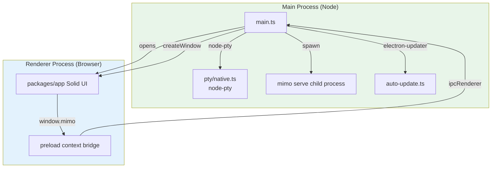

The Electron main process spawns `mimo serve` on an ephemeral port, then opens a `BrowserWindow` pointed at `http://localhost:<port>/ui`. The renderer is the same Solid app as the web; the main process adds:

- Native PTY (so the TUI-style shell works)
- Native menu
- Global shortcuts
- Auto-update
- Native file dialogs

### 35.4 The `tauri-linux` Container

`packages/containers/tauri-linux/Dockerfile` is a Docker build context for a Tauri-based distribution. Tauri is a Rust-based alternative to Electron that uses the system webview. The Tauri build is kept as an alternative for users who don't want the Chromium overhead.

---

## 36. The Console / Cloud (`packages/console`)

`packages/console` is the cloud console. It has 4 sub-packages:

- `console/app/` — the SolidStart app (marketing, account, billing, team).
- `console/core/` — shared Drizzle models for the console DB.
- `console/function/` — serverless API (Cloudflare Worker).
- `console/mail/` — transactional email templates (Maizzle or similar).
- `console/resource/` — static assets (logos, fonts, etc.).

### 36.1 Stack

- **SolidStart 1.x** — SSR + file-based routing.
- **Drizzle ORM 1.0.0-beta.19** — type-safe SQL on PlanetScale MySQL.
- **PlanetScale** — serverless MySQL.
- **Cloudflare Workers** — hosting.
- **Stripe** — billing.
- **Mailgun** — transactional email.
- **OpenAuth** — auth (`@openauthjs/openauth`).
- **Discord + Feishu bots** — community.

### 36.2 Schema (68 migrations under `console/core/migrations/`)

The console schema covers:

- `account` — user accounts
- `user` — user records
- `session` — auth sessions
- `key` — API keys
- `model_usage` — token usage records
- `plan` — pricing plans
- `subscription` — Stripe subscriptions
- `invoice` — invoices
- `payment` — payment methods
- `workspace` — workspaces
- `user_workspace` — many-to-many
- `billing` — billing details
- `enterprise_*` — enterprise-specific tables
- `mimo_user` — MiMo-specific extensions (preferences, quota, etc.)

### 36.3 Routes

`packages/console/app/src/routes/`:

| Path | Purpose |
|---|---|
| `/` | marketing landing |
| `/pricing` | pricing |
| `/docs/*` | in-app docs |
| `/login` | login |
| `/signup` | signup |
| `/account` | account |
| `/account/billing` | billing |
| `/account/usage` | usage |
| `/account/keys` | API keys |
| `/workspace/:id` | workspace view |
| `/console-org/:id` | org admin |
| `/auth/*` | auth callbacks |
| `/stripe/*` | Stripe webhooks |
| `/api/*` | API routes |

### 36.4 The `function` Subpackage

`packages/function/src/api.ts` (388 LOC) is the SyncServer Durable Object. It:

- Accepts WebSocket connections from opencode clients.
- Fans out events from the `Event` bus to all connected clients.
- Persists session state to R2 (or a separate Cloudflare KV namespace) for cross-device sync.
- Handles GitHub App webhooks (for the GitHub bot).
- Sends Mailgun emails.
- Posts to Discord / Feishu.

The Worker is at `api.${domain}` (per `infra/app.ts`).

### 36.5 The `mail` Subpackage

`packages/console/mail/` contains transactional email templates (likely Maizzle or similar). Templates include: `welcome.md`, `verify.md`, `password-reset.md`, `invoice.md`, `quota-warning.md`, etc.

### 36.6 The `resource` Subpackage

`packages/console/resource/` contains static assets: logos, fonts, OpenGraph images, favicons.

---

## 37. Enterprise (`packages/enterprise`)

`packages/enterprise` is a SolidStart app deployed to Cloudflare Pages. It is a self-hosted variant of the console for enterprise customers.

### 37.1 Stack

- **SolidStart 1.x**
- **Cloudflare Workers + R2** — hosting + storage
- **`@mimo-ai/sdk`** — SDK client

### 37.2 Files

| Path | Purpose |
|---|---|
| `src/components/` | Solid components |
| `src/lib/server/` | server-only modules (R2 binding, R2 storage adapter) |
| `src/styles/` | styles |
| `src/cloudflare.ts` | Cloudflare types |
| `src/app.tsx` | root |
| `src/entry-client.tsx` | client entry |
| `src/entry-server.tsx` | server entry |
| `src/root.tsx` | root component |

### 37.3 R2-Backed Share Storage

The `Share.Storage` is an R2 bucket. Sessions shared via `mimo share` are uploaded to R2 and accessible via a public URL. The Enterprise app provides a custom domain for these shares (e.g. `share.acme.com/s/<id>`).

### 37.4 OpenCode Storage Adapter

The `OpenCodeStorage` is also an R2 bucket, holding the per-tenant opencode data (sessions, messages, etc.) for enterprise customers who want to self-host.

### 37.5 Environment

The Enterprise app is configured via SST with the env var `OPENCODE_STORAGE_ADAPTER=r2` (per `infra/enterprise.ts`). When this is set, the opencode storage layer uses R2 instead of local SQLite.

---

## 38. SDK & OpenAPI Codegen

The SDK is auto-generated from the OpenAPI spec. The pipeline is:

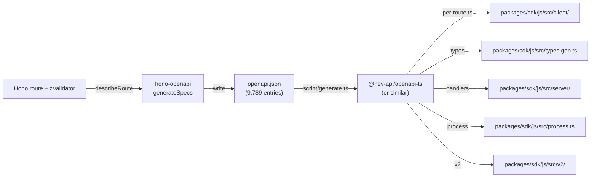

### 38.1 SDK Structure

```
packages/sdk/js/
├── package.json                # "@mimo-ai/sdk"
├── openapi.json                # the source of truth
├── src/
│   ├── index.ts                # public exports
│   ├── client.ts               # 3,118 LOC: HTTP client
│   ├── server.ts               # 1,973 LOC: re-exports Hono app
│   ├── process.ts              # 200 LOC: child process spawn
│   ├── types.gen.ts            # generated types
│   ├── client/                 # generated per-route clients
│   ├── server/                 # generated request handlers
│   ├── gen/                    # generated utilities
│   └── v2/                     # v2 namespace SDK
└── test/                       # SDK tests
```

### 38.2 The `client.ts` API

```typescript
import { createOpencodeClient } from "@mimo-ai/sdk"
const client = createOpencodeClient({ baseUrl: "http://localhost:4096" })
const sessions = await client.session.list({ query: { workspaceID: "ws-1" } })
const session = await client.session.create({ body: { title: "My session" } })
await client.session.prompt({ path: { id: session.id }, body: { parts: [{ type: "text", text: "Hi" }] } })

// Subscribe to events
const events = await client.event.subscribe()
for await (const event of events.stream) {
  console.log(event.type, event.properties)
}
```

### 38.3 The `process.ts` API

```typescript
import { createOpencode } from "@mimo-ai/sdk"
const mimo = await createOpencode({ port: 0 })   // 0 = ephemeral
// mimo.client is the SDK client
// mimo.server is the running server
await mimo.client.session.list()
await mimo.server.close()
```

### 38.4 The `v2/` Namespace

`v2/` is the second-generation SDK with a slightly different API style (more functional, fewer classes). It is used by the newer consumers (e.g. the Slack bot).

### 38.5 The `gen/` Directory

`gen/` contains generated code that is *not* meant to be hand-edited. It is regenerated on every `script/generate.ts` run. The contents are gitignored.

### 38.6 The `openapi.json` Spec

The spec is 9,789 entries covering:

- ~30 endpoints in `/global`
- ~10 endpoints in `/control`
- ~100 endpoints in `/instance` (session, message, part, tool, file, agent, mcp, lsp, app, …)
- ~20 component schemas
- ~50 request body schemas
- ~50 response schemas

---

## 39. CI / Release / Build Pipeline

### 39.1 The `script/` Directory

| Path | Purpose |
|---|---|
| `script/build.ts` | Build the `mimo` binary |
| `script/publish.ts` | npm publish |
| `script/version.ts` | bump versions |
| `script/postinstall.mjs` | post-install hook (calls `fix-node-pty`) |
| `script/fix-node-pty.ts` | rebuild `@lydell/node-pty` for the local arch |
| `script/generate.ts` | SDK / schema / docs codegen |
| `script/trace-imports.ts` | import-graph analysis |
| `script/schema.ts` | Drizzle schema reflection |
| `script/check-migrations.ts` | CI helper |
| `script/upgrade-opentui.ts` | bump `@opentui/*` to latest |
| `script/build-node.ts` | Node-targeted build |
| `script/time.ts` | date helpers for release |
| `script/run-workspace-server` | runs the opencode server in a workspace context |
| `script/sign-windows.ps1` | Windows code-signing |

### 39.2 The `script/github/` Directory

Helper scripts for GitHub releases and CI. The exact files I haven't enumerated, but likely include:

- `script/github/release.ts` — create a GitHub release
- `script/github/upload.ts` — upload release artifacts
- `script/github/commit.ts` — create a git commit with release notes
- `script/github/tag.ts` — create a tag

### 39.3 The `script/release/` Directory

Helper scripts for packaging release artifacts. Likely:

- `script/release/tar.ts` — create a tarball
- `script/release/zip.ts` — create a zip
- `script/release/checksums.ts` — generate SHA-256 sums

### 39.4 The `script/hooks/` Directory

Helper scripts for git hooks. Likely:

- `script/hooks/pre-commit.ts` — runs oxlint, prettier
- `script/hooks/commit-msg.ts` — validates commit message format

### 39.5 The `nix/` Directory

- `flake.nix` — Nix flake
- `flake.lock` — pinned inputs
- `nix/opencode.nix` — opencode package definition
- `nix/desktop.nix` — desktop package definition
- `nix/node_modules.nix` — generated node_modules derivation
- `nix/hashes.json` — content hashes
- `nix/scripts/` — helper scripts

### 39.6 The `containers/` Directory

| Path | Base | Purpose |
|---|---|---|
| `containers/base/` | scratch | minimal base image |
| `containers/bun-node/` | base | Bun + Node |
| `containers/rust/` | rust:1.81 | Tauri build |
| `containers/tauri-linux/` | rust | Tauri Linux build |
| `containers/publish/` | base | publish pipeline (npm + GitHub release) |

### 39.7 The Release Pipeline (Conjectured)

A typical release:

1. `bun run version <bump>` — bump versions across workspaces.
2. `bun run changelog` — generate `CHANGELOG.md`.
3. `bun run format` — run prettier.
4. `bun run lint` — run oxlint.
5. `bun turbo typecheck` — typecheck.
6. `bun turbo build` — build everything.
7. `bun turbo opencode#test` — run opencode tests.
8. `bun turbo @mimo-ai/app#test` — run app tests.
9. `bun run build` (in opencode) — produce the `mimo` binary.
10. `bun run sign-windows.ps1` — sign Windows binary.
11. `bun run publish` — upload to GitHub releases and npm.
12. `bun run generate` — regenerate the SDK and commit.

## 40. Configuration System

`src/config/config.ts` (~480 LOC) is the configuration loader. The config is a JSON5 file at one of (in priority order):

1. `MIMOCODE_CONFIG` env var (literal path)
2. `./mimocode.jsonc` (cwd)
3. `./.mimocode/mimocode.jsonc` (cwd)
4. `$XDG_CONFIG_HOME/mimo/mimocode.jsonc` (or `~/.config/mimo/mimocode.jsonc`)
5. Built-in defaults

### 40.1 The `Config.Info` Schema

The config is Zod-validated and merged with defaults. The schema is huge, but the major sections are:

| Section | Purpose |
|---|---|
| `provider` | list of enabled providers and their options |
| `model` | default model |
| `agent` | per-agent overrides (e.g. `build.model`) |
| `permission` | permission rules |
| `mcp` | MCP server configs |
| `lsp` | LSP server overrides |
| `plugin` | npm plugin names |
| `skill` | skill auto-load list |
| `keybinds` | keybind overrides |
| `theme` | theme name |
| `experimental` | experimental flags |
| `auto_dream_interval_days` | dream cadence |
| `auto_distill_interval_days` | distill cadence |
| `tui` | TUI options |
| `share` | share options |
| `web` | web app options |
| `mimo` | MiMo-specific (e.g. `mimo.tier = "free" \| "pro" \| "enterprise"`) |
| `memory` | memory system options |
| `checkpoint` | checkpoint system options |
| `compaction` | compaction options |
| `goal` | goal judge options |
| `workflow` | workflow engine options |
| `worktree` | worktree options |
| `snapshot` | snapshot options |

### 40.2 The `/config/*` Route Group

`src/server/routes/global.ts` exposes a few config-management routes:

- `GET  /config` — return the current config
- `PATCH /config` — update the config
- `GET  /config/providers` — list providers
- `GET  /config/models` — list models
- `GET  /config/agents` — list agents
- `GET  /config/skills` — list skills
- `GET  /config/commands` — list commands
- `GET  /config/plugins` — list plugins
- `GET  /config/keys` — list API keys (sanitized)

### 40.3 The `experimental` Block

The `experimental` block is the home for in-development features. Examples (conjectured):

```jsonc
{
  "experimental": {
    "predict_next_prompt": true,
    "compose_mode": true,
    "max_mode": true,
    "goal_judge": true,
    "dream": true,
    "distill": true,
    "workflow": true,
    "voice_input": true,
    "voice_output": false,
    "max_concurrent_actors": 8,
    "checkpoint_writer": true,
    "compaction_on_overflow": true,
    "auto_share_session": false,
    "telemetry": false
  }
}
```

Each of these gates a feature in the code. The `predict_next_prompt: false` is checked in `session/prompt.ts:1850` (paraphrased).

### 40.4 Per-Directory Config

The runtime also reads:

- `<cwd>/.mimocode/mimocode.jsonc` — per-directory overrides
- `<cwd>/.mimocode/agent/*.md` — per-directory agent customizations
- `<cwd>/.mimocode/command/*.md` — per-directory custom commands
- `<cwd>/.mimocode/skill/*.md` — per-directory skills
- `<cwd>/.mimocode/plugin/*.ts` — per-directory plugins
- `<cwd>/AGENTS.md` or `<cwd>/CLAUDE.md` — project-level agent instructions (auto-loaded into system prompt)

---

## 41. Auth

`src/auth/auth.ts` (~400 LOC) is the auth service. It abstracts over:

- **OAuth 2.0 + PKCE** (for Anthropic, Google, GitHub, GitLab, OpenAI, MiMo, …)
- **API Key** (for OpenAI, Mistral, Groq, Together, …)
- **AWS SigV4** (for Bedrock)
- **Custom** (for Copilot, Codex, GitLab Duo Workflow)

### 41.1 The Auth Service

```typescript
// src/auth/auth.ts:30-150 (paraphrased)
export interface Interface {
  required(providerID: ProviderID, modelID: ModelID): Effect.Effect<boolean>
  token(providerID: ProviderID, modelID: ModelID): Effect.Effect<string>
  refresh(providerID: ProviderID, modelID: ModelID): Effect.Effect<{ token: string }>
  apiKey(providerID: ProviderID, modelID: ModelID): Effect.Effect<string | null>
  setApiKey(providerID: ProviderID, modelID: ModelID, key: string): Effect.Effect<void>
  removeApiKey(providerID: ProviderID, modelID: ModelID): Effect.Effect<void>
  status(): Effect.Effect<Record<ProviderID, { status: "ok" | "expired" | "missing" | "error"; expiresAt?: number; error?: string }>>
  login(providerID: ProviderID, options?: { method?: "oauth" | "apikey" }): Effect.Effect<{ redirectUrl?: string; apikeyPrompt?: string }>
  logout(providerID: ProviderID): Effect.Effect<void>
}
```

### 41.2 Storage

Auth state is stored in `$XDG_DATA_HOME/mimo/auth/<providerID>.json`:

```json
{
  "type": "oauth",
  "access": "<token>",
  "refresh": "<refresh-token>",
  "expiresAt": 1234567890,
  "scope": "openid profile",
  "accountID": "u-12345"
}
```

Or for API key:

```json
{
  "type": "apikey",
  "key": "<key>"
}
```

The file is `chmod 600`.

### 41.3 The `Auth.Plugin` Contract

```typescript
// src/auth/auth.ts:200-280 (paraphrased)
export interface Plugin {
  providerID: ProviderID
  // Resolve an access token (or return null if not authenticated)
  token(): Effect.Effect<string | null>
  // Start a login flow; return redirect URL or null
  login(): Effect.Effect<{ redirectUrl?: string; callback?: (url: URL) => Effect.Effect<void> }>
  // Refresh an expired token
  refresh(): Effect.Effect<{ token: string }>
  // Logout
  logout(): Effect.Effect<void>
  // Status
  status(): Effect.Effect<"ok" | "expired" | "missing" | "error">
}
```

Built-in auth plugins:

| Plugin | Provider | Auth method |
|---|---|---|
| `MimoFreeAuthPlugin` | `xiaomi` (free tier) | none (anonymous) |
| `MimoAuthPlugin` | `xiaomi` (logged in) | OAuth 2.0 + PKCE |
| `AnthropicProxyPlugin` | `anthropic-proxy` | API key |
| `CodexAuthPlugin` | `codex` (OpenAI) | OAuth + refresh |
| `CopilotAuthPlugin` | `copilot` (GitHub) | OAuth (GitHub) |
| `GitlabAuthPlugin` | `gitlab-workflow` (GitLab Duo) | OAuth (GitLab) |
| `PoeAuthPlugin` | `poe` | API key |
| `CloudflareWorkersAuthPlugin` | `cloudflare-workers-ai` | API token |
| `CloudflareAIGatewayAuthPlugin` | `cloudflare-ai-gateway` | API token |

### 41.4 The MiMo Free Channel

The `MimoFreeAuthPlugin` (`src/plugin/mimo-free.ts`) is the magic that lets new users try MiMo without signing up. The free channel:

- Uses an anonymous access token (no user account).
- Routes to `api.xiaomi.com/mimo/v1` (the free-tier endpoint).
- Has rate limits (~10 requests/minute, ~200 requests/day per IP).
- Returns a `MimoAccount.Info` with `tier: "free"`, `quota: { remaining, total }`.

The TUI shows a banner "You're on the free tier" with a `/login` button to upgrade.

### 41.5 The MiMo Logged-In Tier

The `MimoAuthPlugin` handles logged-in users. After OAuth login, the runtime gets:

- `access` — bearer token
- `refresh` — refresh token
- `tier` — `free` | `pro` | `enterprise`
- `quota` — `{ remaining, total, resetAt }`
- `models` — list of models available to the user (subset of all models)

---

## 42. CLI Commands

21 commands under `src/cli/cmd/`. Each is a yargs subcommand.

| Command | Purpose | Source |
|---|---|---|
| `serve` | Start the opencode server in the foreground | `serve.ts` |
| `web` | Start the server + serve the web UI | `web.ts` |
| `tui` | Start the TUI (default subcommand) | `tui/index.tsx` |
| `run [message..]` | Run a one-shot prompt and exit | `run.ts` |
| `acp` | Start the ACP server (for IDEs) | `acp.ts` |
| `attach` | Attach to a running opencode server | `attach.ts` (in tui/) |
| `agent <name>` | Run a specific agent directly | `agent.ts` |
| `session <id>` | Show a session by ID | `session.ts` |
| `account` | Manage account / login / logout | `account.ts` |
| `providers` | List providers | `providers.ts` |
| `models` | List models | `models.ts` |
| `generate` | Run the SDK / schema / docs codegen | `generate.ts` |
| `github <owner>/<repo> <number>` | Address a PR | `github.ts` |
| `pr <number>` | Fetch and checkout a PR | `pr.ts` |
| `import` | Import Claude Code session | `import.ts` |
| `export` | Export opencode session to JSON | `export.ts` |
| `mcp` | Run an MCP server (stdio proxy) | `mcp.ts` |
| `plug` | Plug-in management (npm install, list, remove) | `plug.ts` |
| `db` | DB management (migrate, inspect) | `db.ts` |
| `upgrade` | Self-upgrade the binary | `upgrade.ts` |
| `uninstall` | Self-uninstall | `uninstall.ts` |
| `debug` | Diagnostic mode | `debug.ts` |
| `stats` | Show usage stats | `stats.ts` |
| `web` | Start the server + serve the web UI | `web.ts` |

### 42.1 The Default Subcommand

Running `mimo` with no arguments is equivalent to `mimo tui .` — the TUI in the current directory. This is the most common entry point.

### 42.2 The `run` Subcommand

```bash
mimo run "refactor the auth layer to use JWT"
mimo run --agent plan --model anthropic/claude-sonnet-4 "design a new API"
mimo run --share "fix the bug in src/index.ts"
```

The `run` subcommand:

1. Boots the runtime in the current directory.
2. Creates a new session.
3. Sends the prompt.
4. Streams the response to stdout (or saves a share link with `--share`).
5. Exits when the session is complete.

### 42.3 The `serve` and `web` Subcommands

```bash
mimo serve --port 4096
mimo web --port 4096
```

`serve` starts the Hono server (no UI). `web` starts the server **and** serves the bundled web app. Both support `--hostname`, `--port`, `--mdns` (for LAN discovery), `--cors` (for cross-origin clients).

### 42.4 The `agent` Subcommand

```bash
mimo agent checkpoint-writer
mimo agent compose "add a logout button"
mimo agent dream
mimo agent distill
mimo agent max "design a new caching layer"
```

`agent` runs a specific built-in agent directly. Useful for CI (e.g. `mimo agent compose` in a pre-commit hook).

### 42.5 The `acp` Subcommand

```bash
mimo acp
```

Starts the ACP server over stdio. IDEs spawn this command as a child process.

### 42.6 The `mcp` Subcommand

```bash
mimo mcp serve   # act as an MCP server (the mimo tools become MCP tools)
```

A common pattern: use mimo as a tool provider for another agent runtime (e.g. Claude Desktop).

---

## 43. Internationalization

`src/cli/i18n.ts` and `tui/i18n/` and `packages/app/src/i18n/` ship translations for:

| Locale | Status |
|---|---|
| `en` (English) | ✅ default |
| `es` (Spanish) | ✅ |
| `fr` (French) | ✅ |
| `ja` (Japanese) | ✅ |
| `ru` (Russian) | ✅ |
| `zh` (Chinese Simplified) | ✅ |
| `zht` (Chinese Traditional) | ✅ |

The TUI uses a context-based i18n (`tui/context/i18n.tsx`). The web app uses a similar context. The CLI uses a `t()` function.

The translation files are at `tui/i18n/<locale>.json` and `packages/app/src/i18n/<locale>.json`. The format is flat key-value with optional interpolation:

```json
{
  "command.palette.placeholder": "Type a command…",
  "permission.bash.ask": "Allow {tool} to run: {command}?",
  "session.title.placeholder": "New session"
}
```

## 44. Data Flow Diagrams

This section traces the major data flows end to end.

### 44.1 A User Submits a Prompt (TUI → LLM → Tool → DB)

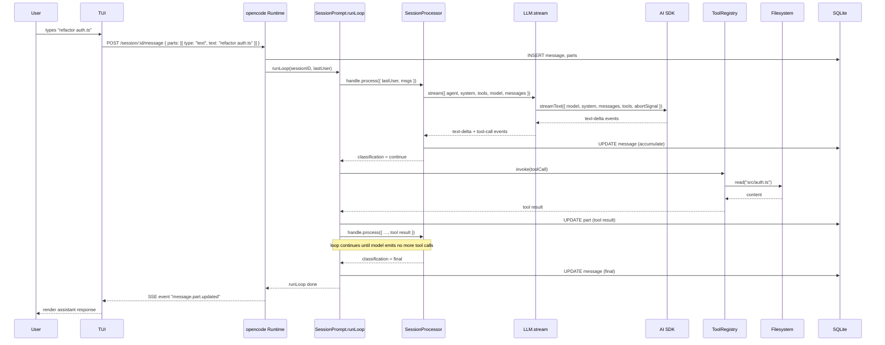

### 44.2 A Subagent is Spawned (Task Tool → Actor → Worktree)

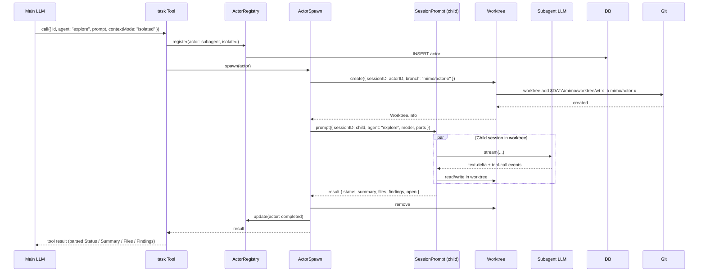

### 44.3 Checkpoint Rebuild (Context Overflow → Writer → Boundary)

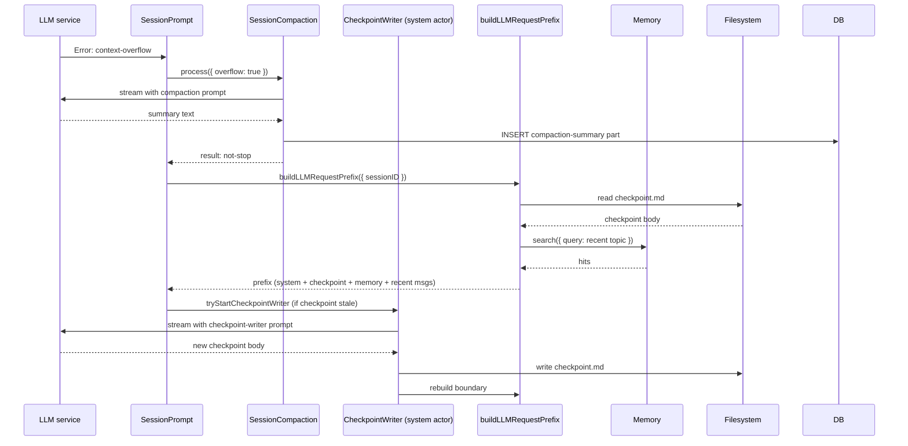

### 44.4 Max Mode (Parallel Candidates → Judge → Replay)

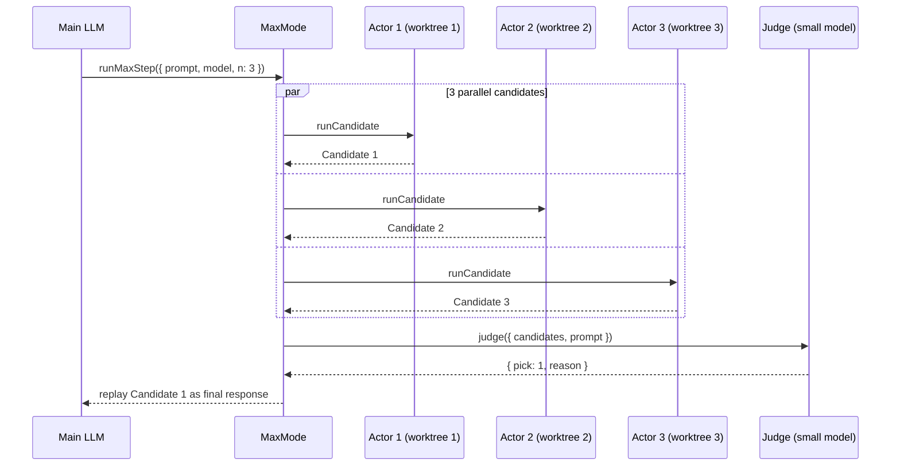

### 44.5 Dream (Periodic Memory Consolidation)

```mermaid
sequenceDiagram
    participant AR as AppRuntime
    participant Session as Session.Service
    participant SP as SessionPrompt
    participant FS as Memory filesystem
    participant MEM as Memory Service
    AR->>Session: create({ title: "Auto Dream" })
    Session-->>AR: session
    AR->>SP: prompt({ sessionID, agent: "dream", parts: [{ type: "text", text: DREAM_TASK }] })
    SP->>FS: list memory files
    SP->>MEM: search recent
    SP->>LLM: stream (with dream agent)
    LLM-->>SP: text-deltas
    SP->>FS: write consolidated memory
    SP-->>AR: session archived
```

### 44.6 Workflow (QuickJS Script → Actors → Inbox)

```mermaid
sequenceDiagram
    participant LLM as Main LLM
    participant WT as workflow Tool
    participant WR as WorkflowRuntime
    participant QJ as QuickJS Sandbox
    participant A1 as Actor 1
    participant A2 as Actor 2
    participant IB as Inbox
    LLM->>WT: call({ name: "deep-research", inputs: { topic } })
    WT->>WR: start({ name, inputs, deadline: 12h })
    WR->>QJ: loadScript(deep-research.js)
    QJ->>WR: ready
    WR->>QJ: run(inputs)
    QJ->>WR: mimo.actor.spawn({ agent: "explore", workspace: { branch } })
    WR->>A1: spawn
    A1-->>WR: actor handle
    QJ->>WR: mimo.actor.spawn({ agent: "explore" })
    WR->>A2: spawn
    A2-->>WR: actor handle
    par
        A1-->>WR: result
    and
        A2-->>WR: result
    end
    WR->>IB: publish(results)
    IB->>QJ: deliver
    QJ->>WR: mimo.actor.collect(actor1) etc.
    WR-->>WT: workflow result
    WT-->>LLM: tool result
```

## 45. Failure Modes & Reliability

### 45.1 LLM Errors

| Error type | Detection | Recovery |
|---|---|---|
| `rate-limit` (429) | AI SDK | Exponential backoff with `retryAfter`; max 3 retries (`session/retry.ts`) |
| `context-overflow` (>limit) | LLM service | Trigger `compaction.process({ overflow: true })`, then retry |
| `content-filter` | AI SDK | Write `writeContentFilterError`, exit loop, surface to user |
| `provider-error` 5xx | AI SDK | Exponential backoff; max 2 retries |
| `provider-error` 4xx | AI SDK | No retry; surface to user |
| `aborted` | scope cancellation | Exit loop; no retry |
| `auth-error` (401/403) | LLM service | `Auth.refresh(providerID)`; on success, retry; on failure, surface to user |
| network | fetch throws | Exponential backoff; max 5 retries |
| `unknown` | catch-all | Log, write error, exit loop |

### 45.2 Tool Errors

Each tool must:

- Validate input with its Zod schema.
- Throw `ToolError.Args` for invalid args, `ToolError.Permission` for permission denied, `ToolError.Timeout` for timeouts, `ToolError.NotFound` for missing files, etc.
- Return `ToolResult` on success.

`ToolRegistry.execute` wraps the tool in a `try/catch` and converts thrown errors to a structured `ToolResult` with `error: { type, message }`. The agent sees the error as a tool result and can decide how to recover.

### 45.3 Worktree Cleanup on Crash

When the process crashes mid-actor, the worktree is leaked. On next startup, `Worktree.startup()` scans `$DATA/mimo/worktree/` and:

- For each worktree pointing to a non-existent actor (in the DB), remove it.
- For each worktree pointing to a running actor (status = "running"), check if the actor is still alive (heartbeat in `actor_lifecycle_event` table, default 60s); if not, mark the actor as "aborted" and remove the worktree.

### 45.4 Snapshot Revert

If a tool call corrupts the filesystem (rare but possible), the user can run `mimo revert <snapshot-id>` (or the TUI's `/revert` command). This restores the file(s) to the snapshot state using `git checkout <sha> -- <file>`.

### 45.5 DB Migration Failure

On startup, the migration runner tries to apply all 34 migrations in order. If one fails:

- The server refuses to start (fail-fast).
- The error is logged to stderr with the migration that failed.
- The user can `mimo db rollback <migration>` to roll back the last migration, then `mimo db migrate` to retry.

The migration runner is idempotent — already-applied migrations are skipped.

### 45.6 Auth Token Expiry Mid-Session

`LLM.stream` checks the token before each call. If the token is expired, it calls `Auth.refresh` and retries the call. If the refresh fails, it pauses the loop and surfaces a "please re-login" prompt.

### 45.7 Plugin Crash

A plugin's hook throwing is caught by the plugin runner and logged, but the loop continues. The runtime tracks plugin health:

```typescript
// pseudocode
try {
  await hook(input, next)
} catch (err) {
  log.error("plugin hook failed", { plugin: pluginName, hook: hookName, err })
  if (pluginFailureCount[pluginName]++ > 10) {
    log.warn("plugin disabled due to repeated failures", { plugin: pluginName })
    Plugin.disable(pluginName)
  }
}
```

### 45.8 LSP Server Crash

`LSP` watches each language server's process. If it dies unexpectedly, the runtime:

- Logs the crash.
- Removes the client from the cache.
- Tries to restart on next use (with exponential backoff, max 3 attempts).
- If restart fails 3 times in a row, surfaces a "LSP server unavailable" error to the user.

### 45.9 MCP Server Crash

`MCP` watches each MCP server's process (for stdio) and connection (for HTTP/SSE). If a server disconnects, the runtime:

- Removes the tools contributed by that server.
- Publishes `mcp.tools.changed` so the LLM knows the tools are gone.
- Tries to reconnect on next use.
- If the server is `enabled: true` in config, restart on crash.

### 45.10 Workflow Deadline

Each workflow has a `deadlineMs` (default 12 hours). The QuickJS sandbox's `setTimeout` is replaced with a deadline-checked version. When the deadline is reached, the sandbox is forcefully terminated and the workflow run is marked `failed: "deadline"`. Intermediate results are persisted in `workflow_step` and the user can inspect them via `mimo workflow show <run-id>`.

## 46. Glossary

| Term | Meaning | Source |
|---|---|---|
| **Actor** | A unit of agent execution: a session + an agent type + a workspace (possibly a worktree). The unit of parallelism. | `src/actor/schema.ts` |
| **Actor Mode** | `main` \| `subagent` \| `peer` \| `system` | same |
| **Actor Lifecycle** | `ephemeral` \| `persistent` | same |
| **Context Mode** | `shared` \| `isolated` \| `scoped` | same |
| **ACP** | Agent Client Protocol — IDE↔agent standard | `src/acp/agent.ts` |
| **AGENTS.md / CLAUDE.md** | Project-level agent instructions (auto-loaded into system prompt) | `src/session/instruction.ts` |
| **AppRuntime** | The full-fat Effect runtime (all services) | `src/effect/app-runtime.ts` |
| **BootstrapRuntime** | The thin Effect runtime (bus, config, plugin, global only) for ACP/CLI | `src/effect/bootstrap-runtime.ts` |
| **Bus** | The in-process pub/sub used to project events to SSE clients | `src/bus/bus.ts` |
| **Catalog** | A Bun workspaces feature for centralizing dependency versions | root `package.json:workspaces.catalog` |
| **Checkpoint** | A structured `checkpoint.md` file maintained by the writer subagent | `src/session/checkpoint.ts` |
| **Classification** | What the model did in its last step: `continue` \| `final` \| `filtered` \| `failed` \| `think-only` \| `invalid` | `src/session/classify.ts` |
| **Compaction** | Lossy LLM summarization at overflow | `src/session/compaction.ts` |
| **Compose** | Specs-driven skill workflow | agent `compose` |
| **Distill** | Auto skill discovery from session transcripts | `src/session/auto-dream.ts` |
| **Dream** | Auto memory consolidation | same |
| **DWS** | Deep-Workflow System — the QuickJS workflow engine | `src/workflow/runtime.ts` |
| **Effect** | A TypeScript library for typed functional effects | `effect@4.0.0-beta.48` |
| **Free channel** | MiMo's anonymous, no-API-key tier | `src/plugin/mimo-free.ts` |
| **FTS5** | SQLite's full-text search extension | `src/memory/fts.sql.ts` |
| **Hono** | The web framework used for the server | `hono@4.10.7` |
| **Instance** | A per-directory scope (a `Resource` in Effect) | `src/effect/instance-state.ts` |
| **MimoCode / mimo** | The CLI binary | `packages/opencode/bin/mimo` |
| **MIMOCODE_CLIENT** | Env var set to `tui` \| `web` \| `run` \| `acp` \| `github` \| … to indicate the calling client | `src/cli/bootstrap.ts` |
| **MIMOCODE_HOME** | Env var for the data directory (default `~/.mimo` or `$XDG_DATA_HOME/mimo`) | `src/config/config.ts` |
| **Max Mode** | Parallel best-of-N with judge | `src/session/max-mode.ts` |
| **MCP** | Model Context Protocol — tool provider standard | `src/mcp/index.ts` |
| **OpenTUI** | Terminal UI framework | `@opentui/core@0.1.99` |
| **PII / secrets** | Auth tokens, API keys — stored in `~/.mimo/auth/<providerID>.json` with `chmod 600` | `src/auth/auth.ts` |
| **Plugin** | A TypeScript file implementing the `Plugin` interface | `src/plugin/index.ts` |
| **Project** | A git repo | `src/project/project.ts` |
| **Provider** | An LLM provider (Anthropic, OpenAI, MiMo, …) | `src/provider/provider.ts` |
| **QuickJS** | A small embeddable JavaScript engine (used for the workflow sandbox) | `src/workflow/sandbox.ts` |
| **Skill** | A reusable Markdown prompt + optional tool list | `src/skill/index.ts` |
| **Snapshot** | A file-level restore point backed by git's content-addressed store | `src/snapshot/index.ts` |
| **Subagent** | A spawned actor | `src/actor/spawn.ts` |
| **Subagent return protocol** | The fixed `Status / Summary / Files / Findings / Open` format | `src/session/llm.ts:99-180` |
| **SyncServer** | A Cloudflare Durable Object that fans out events across clients | `packages/function/src/api.ts` |
| **TUI** | The terminal UI (in `cli/cmd/tui/`) | §33 |
| **TenVAD** | Voice activity detection (WASM) | `tui/asset/ten_vad.wasm` |
| **Title agent** | The lightweight agent that generates a session title | agent `title` |
| **Tool** | A function the LLM can call | `src/tool/registry.ts` |
| **Toolset** | The set of tools available to a given (agent, model, session) | `ToolRegistry.enabled` |
| **Transform** | A per-model `LanguageModelV2Middleware` | `src/provider/transform.ts` |
| **TUI** | Terminal UI | §33 |
| **UIMessageStream** | The AI SDK's event format | `streamText().toUIMessageStream()` |
| **Worktree** | A git worktree for actor isolation | `src/worktree/index.ts` |
| **Workspace** | A directory inside a project | `src/project/workspace.ts` |
| **Writer subagent** | The system actor that maintains `checkpoint.md` | agent `checkpoint-writer` |
| **Zod** | TypeScript-first schema validation | `zod@4.1.8` |

---

## 47. Code Reference Index

This is a curated index of the most important file:line citations in the codebase. Use it to jump to the source of truth.

### 47.1 Top-Level Entrypoints

| What | Path:line |
|---|---|
| Root `package.json` | [`package.json`](https://github.com/XiaomiMiMo/MiMo-Code/blob/main/package.json) |
| Bun runtime default | `package.json:10` |
| CLI root (yargs) | `packages/opencode/src/index.ts:1-100` |
| CLI bootstrap | `packages/opencode/src/cli/bootstrap.ts:1-100` |
| CLI command dispatcher | `packages/opencode/src/cli/cmd/cmd.ts` |
| Install script | `install:1-400` |
| SST config | `sst.config.ts:1-30` |

### 47.2 Server

| What | Path:line |
|---|---|
| Hono server | `packages/opencode/src/server/server.ts:1-136` |
| Bun adapter | `packages/opencode/src/server/adapter.bun.ts` |
| Node adapter | `packages/opencode/src/server/adapter.node.ts` |
| Middleware | `packages/opencode/src/server/middleware.ts` |
| Event projector | `packages/opencode/src/server/event.ts` |
| mDNS | `packages/opencode/src/server/mdns.ts` |
| Global routes | `packages/opencode/src/server/routes/global.ts:1-112` |
| Control routes | `packages/opencode/src/server/routes/control/` |
| Instance routes | `packages/opencode/src/server/routes/instance/session.ts:1-1030` |
| UI route | `packages/opencode/src/server/routes/ui.ts` |

### 47.3 Storage

| What | Path:line |
|---|---|
| Drizzle schema (opencode) | `packages/opencode/src/session/session.sql.ts:14-104` |
| K/V Storage | `packages/opencode/src/storage/storage.ts:1-200` |
| Cross-platform SQLite | `packages/opencode/src/storage/db.{bun,node,}.ts` |
| Drizzle schema (console) | `packages/console/core/src/schema.ts` |
| 34 opencode migrations | `packages/opencode/migration/2026*` |
| 68 console migrations | `packages/console/core/migrations/` |

### 47.4 Effect Services

| Service | Path:line |
|---|---|
| `Bus` | `packages/opencode/src/bus/bus.ts` |
| `Config` | `packages/opencode/src/config/config.ts:1-480` |
| `InstanceState` | `packages/opencode/src/effect/instance-state.ts:1-81` |
| `AppRuntime` | `packages/opencode/src/effect/app-runtime.ts` |
| `BootstrapRuntime` | `packages/opencode/src/effect/bootstrap-runtime.ts` |
| `run-service` | `packages/opencode/src/effect/run-service.ts:1-52` |
| `Provider` | `packages/opencode/src/provider/provider.ts:1-1787` |
| `LLM` | `packages/opencode/src/session/llm.ts:1-735` |
| `Session` | `packages/opencode/src/session/session.ts:1-480` |
| `SessionPrompt` | `packages/opencode/src/session/prompt.ts:1-3355` |
| `SessionProcessor` | `packages/opencode/src/session/processor.ts:1-962` |
| `SessionCompaction` | `packages/opencode/src/session/compaction.ts:1-540` |
| `SessionCheckpoint` | `packages/opencode/src/session/checkpoint.ts:1-600` |
| `SessionGoal` | `packages/opencode/src/session/goal.ts:1-230` |
| `MaxMode` | `packages/opencode/src/session/max-mode.ts:1-400` |
| `AutoDream` | `packages/opencode/src/session/auto-dream.ts:1-120` |
| `Memory` | `packages/opencode/src/memory/service.ts:1-144` |
| `ActorRegistry` | `packages/opencode/src/actor/registry.ts:1-260` |
| `ActorSpawn` | `packages/opencode/src/actor/spawn.ts:1-727` |
| `Workflow` | `packages/opencode/src/workflow/runtime.ts:1-1226` |
| `Worktree` | `packages/opencode/src/worktree/index.ts:1-614` |
| `Snapshot` | `packages/opencode/src/snapshot/index.ts:1-780` |
| `Plugin` | `packages/opencode/src/plugin/index.ts:1-600` |
| `MCP` | `packages/opencode/src/mcp/index.ts:1-944` |
| `LSP` | `packages/opencode/src/lsp/index.ts:1-250` |
| `Skill` | `packages/opencode/src/skill/index.ts:1-300` |
| `Permission` | `packages/opencode/src/permission/index.ts:1-250` |
| `Auth` | `packages/opencode/src/auth/auth.ts:1-400` |
| `ToolRegistry` | `packages/opencode/src/tool/registry.ts:1-413` |
| `Acp.Agent` | `packages/opencode/src/acp/agent.ts:1-1783` |

### 47.5 MessageV2

| What | Path:line |
|---|---|
| Message schema | `packages/opencode/src/session/message-v2.ts:30-200` |
| Part types (14) | `packages/opencode/src/session/message-v2.ts:200-700` |
| toModelMessages | `packages/opencode/src/session/message-v2.ts:700-1136` |

### 47.6 Tools

| Tool | Path |
|---|---|
| `read` | `packages/opencode/src/tool/read.ts` |
| `write` | `packages/opencode/src/tool/write.ts` |
| `edit` | `packages/opencode/src/tool/edit.ts` |
| `multiedit` | `packages/opencode/src/tool/multiedit.ts` |
| `apply_patch` | `packages/opencode/src/tool/apply_patch.ts` |
| `bash` | `packages/opencode/src/tool/bash.ts` |
| `bash-interactive` | `packages/opencode/src/tool/bash-interactive.ts` |
| `glob` | `packages/opencode/src/tool/glob.ts` |
| `grep` | `packages/opencode/src/tool/grep.ts` |
| `codesearch` | `packages/opencode/src/tool/codesearch.ts` |
| `webfetch` | `packages/opencode/src/tool/webfetch.ts` |
| `websearch` | `packages/opencode/src/tool/websearch/index.ts` |
| `lsp` | `packages/opencode/src/tool/lsp.ts` |
| `mcp` | `packages/opencode/src/tool/mcp-exa.ts` |
| `task` | `packages/opencode/src/tool/task.ts:1-332` |
| `actor` | `packages/opencode/src/tool/actor.ts` |
| `actor.shell` | `packages/opencode/src/tool/actor.shell.ts` |
| `plan` | `packages/opencode/src/tool/plan.ts` |
| `question` | `packages/opencode/src/tool/question.ts` |
| `skill` | `packages/opencode/src/tool/skill.ts` |
| `workflow` | `packages/opencode/src/tool/workflow.ts` |
| `memory` | `packages/opencode/src/tool/memory.ts` |
| `history` | `packages/opencode/src/tool/history.ts` |

### 47.7 Prompts

| Prompt | Path |
|---|---|
| `build` agent | `packages/opencode/src/agent/prompt/distill.txt` (and `…/agent.txt`) |
| `compose` agent | `packages/opencode/src/session/prompt/compose.txt` |
| `checkpoint-writer` | `packages/opencode/src/agent/prompt/checkpoint-writer.txt` |
| `compaction` | `packages/opencode/src/agent/prompt/compaction.txt` |
| `dream` | `packages/opencode/src/agent/prompt/dream.txt` |
| `distill` | `packages/opencode/src/agent/prompt/distill.txt` |
| `explore` | `packages/opencode/src/agent/prompt/explore.txt` |
| `summary` | `packages/opencode/src/agent/prompt/summary.txt` |
| `title` | `packages/opencode/src/agent/prompt/title.txt` |
| `default` system | `packages/opencode/src/session/prompt/default.txt` |
| `anthropic` | `packages/opencode/src/session/prompt/anthropic.txt` |
| `gpt` | `packages/opencode/src/session/prompt/gpt.txt` |
| `gemini` | `packages/opencode/src/session/prompt/gemini.txt` |
| `codex` | `packages/opencode/src/session/prompt/codex.txt` |
| `kimi` | `packages/opencode/src/session/prompt/kimi.txt` |
| `beast` | `packages/opencode/src/session/prompt/beast.txt` |
| `trinity` | `packages/opencode/src/session/prompt/trinity.txt` |
| `copilot-gpt-5` | `packages/opencode/src/session/prompt/copilot-gpt-5.txt` |
| `max-steps` | `packages/opencode/src/session/prompt/max-steps.txt` |
| `build-switch` | `packages/opencode/src/session/prompt/build-switch.txt` |
| Tool prompts (19) | `packages/opencode/src/tool/{tool}.txt` (e.g. `bash.txt`) |

### 47.8 Plugins

| Plugin | Path |
|---|---|
| `MimoFreeAuth` | `packages/opencode/src/plugin/mimo-free.ts` |
| `MimoAuth` | `packages/opencode/src/plugin/mimo.ts` |
| `AnthropicProxy` | `packages/opencode/src/plugin/anthropic-proxy.ts` |
| `CodexAuth` | `packages/opencode/src/plugin/codex.ts` |
| `CopilotAuth` | `packages/opencode/src/plugin/copilot.ts` |
| `GitlabAuth` | `packages/opencode/src/plugin/gitlab.ts` |
| `PoeAuth` | `packages/opencode/src/plugin/poe.ts` |
| `CloudflareWorkersAuth` | `packages/opencode/src/plugin/cloudflare.ts` |
| `CloudflareAIGatewayAuth` | `packages/opencode/src/plugin/cloudflare-ai-gateway.ts` |
| `CheckpointSplitover` | `packages/opencode/src/plugin/checkpoint-splitover.ts` |
| `SubagentProgressChecker` | `packages/opencode/src/plugin/subagent-progress-checker.ts` |
| `BashOptimization` | `packages/opencode/src/plugin/bash-optimization.ts` |
| `ToolPermission` | `packages/opencode/src/plugin/tool-permission.ts` |
| `NetworkProxy` | `packages/opencode/src/plugin/network-proxy.ts` |
| `RateLimit` | `packages/opencode/src/plugin/rate-limit.ts` |

### 47.9 Cloud / Infra

| What | Path |
|---|---|
| SST config | `sst.config.ts:1-30` |
| `infra/app.ts` | `infra/app.ts` |
| `infra/console.ts` | `infra/console.ts` |
| `infra/enterprise.ts` | `infra/enterprise.ts` |
| `infra/stage.ts` | `infra/stage.ts` |
| `infra/secret.ts` | `infra/secret.ts` |
| SyncServer Worker | `packages/function/src/api.ts:1-388` |

### 47.10 SDK

| What | Path |
|---|---|
| `openapi.json` | `packages/sdk/openapi.json` (9,789 entries) |
| SDK client | `packages/sdk/js/src/client.ts:1-3118` |
| SDK server | `packages/sdk/js/src/server.ts:1-1973` |
| SDK process | `packages/sdk/js/src/process.ts:1-200` |
| SDK v2 | `packages/sdk/js/src/v2/` |
| SDK types (gen) | `packages/sdk/js/src/types.gen.ts` |

## 48. Appendices

### 48.1 Appendix A — Full Workspace Catalog (pinned versions)

```jsonc
// root package.json workspaces.catalog (paraphrased)
{
  "@effect/opentelemetry":          "4.0.0-beta.48",
  "effect":                          "4.0.0-beta.48",
  "drizzle-orm":                     "1.0.0-beta.19-d95b7a4",
  "drizzle-kit":                     "1.0.0-beta.19-d95b7a4",
  "zod":                             "4.1.8",
  "hono":                            "4.10.7",
  "@opentui/core":                   "0.1.99",
  "@opentui/solid":                  "0.1.99",
  "solid-js":                        "1.9.10",
  "typescript":                      "5.8.2",
  "@typescript/native-preview":      "7.0.0-dev.20251207.1",
  "@openauthjs/openauth":            "0.0.0-20250322224806",
  "@playwright/test":                "1.59.1",
  "@pierre/diffs":                   "1.1.0-beta.18",
  "tailwindcss":                     "4.1.11",
  "@tailwindcss/vite":               "4.1.11",
  "marked":                          "17.0.1",
  "shiki":                           "3.20.0",
  "drizzle-orm":                     "1.0.0-beta.19-d95b7a4",
  "marked-shiki":                    "1.2.1",
  "luxon":                           "3.6.1",
  "ulid":                            "3.0.1",
  "@kobalte/core":                   "0.13.11",
  "@hono/zod-validator":             "0.4.2",
  "@hono/standard-validator":        "0.1.5",
  "@cloudflare/workers-types":       "4.20251008.0",
  "@lydell/node-pty":                "1.2.0-beta.10",
  "@solidjs/start":                  "https://pkg.pr.new/@solidjs/start@dfb2020",
  "@solidjs/router":                 "0.15.4",
  "@solidjs/meta":                   "0.29.4",
  "vite":                            "7.1.4",
  "vite-plugin-solid":               "2.11.10",
  "hono-openapi":                    "1.1.2",
  "remeda":                          "2.26.0",
  "@types/luxon":                    "3.7.1",
  "@types/bun":                      "1.3.11",
  "@types/cross-spawn":              "6.0.6",
  "@types/semver":                   "7.7.1",
  "@types/node":                     "22.13.9",
  "@octokit/rest":                   "22.0.0",
  "dompurify":                       "3.3.1",
  "diff":                            "8.0.2",
  "fuzzysort":                       "3.1.0",
  "@npmcli/arborist":                "9.4.0",
  "@solid-primitives/storage":       "4.3.3",
  "remend":                          "1.3.0",
  "ai":                              "6.0.168",
  "cross-spawn":                     "7.0.6",
  "semver":                          "7.7.4",
  "virtua":                          "0.42.3",
  "@tsconfig/bun":                   "1.0.9",
  "@tsconfig/node22":                "22.0.2",
  "oxlint":                          "1.60.0",
  "oxlint-tsgolint":                 "0.21.0",
  "prettier":                        "3.5.3",
  "turbo":                           "2.8.13",
  "sst":                             "3.18.10"
}
```

### 48.2 Appendix B — Patches

| Patch | Reason |
|---|---|
| `@npmcli/agent@4.0.0` | needed for the workspace plugin loader (`script/fix-node-pty.ts` and other package loader) |
| `@standard-community/standard-openapi@0.2.9` | keeps the SDK codegen working with newer Hono versions |
| `solid-js@1.9.10` | enables MiMo-specific routing behavior (likely to do with `Show`/`For` microtask ordering) |
| `gitlab-ai-provider@6.6.0` | needed for the DWS workflow tool-executor bridge |
| `install-korean-ime-fix.sh` | platform workaround (not auto-applied) |

### 48.3 Appendix C — Cross-Substitute Imports

```jsonc
// packages/opencode/package.json:24-44
"imports": {
  "#db":   { "bun": "./src/storage/db.bun.ts",   "node": "./src/storage/db.node.ts",   "default": "./src/storage/db.bun.ts" },
  "#pty":  { "bun": "./src/pty/pty.bun.ts",       "node": "./src/pty/pty.node.ts",      "default": "./src/pty/pty.bun.ts" },
  "#hono": { "bun": "./src/server/adapter.bun.ts","node": "./src/server/adapter.node.ts","default": "./src/server/adapter.bun.ts" }
}
```

### 48.4 Appendix D — Trusted Dependencies

```jsonc
// root package.json
"trustedDependencies": [
  "esbuild", "node-pty", "protobufjs",
  "tree-sitter", "tree-sitter-bash", "tree-sitter-powershell",
  "web-tree-sitter", "electron"
]
```

These are dependencies that have native bindings and need `--trust` to install. Bun warns about them by default; this list opts them in.

### 48.5 Appendix E — 34 Opencode Drizzle Migrations

Roughly in order:

1. `20260101000000_init` — initial schema
2. `…_permission_user` — permission grants per user
3. `…_claude_import` — Claude Code session import
4. `…_history_fts` — FTS5 history index
5. `…_task_todo_redesign` — task/todo redesign
6. `…_task_in_progress_owner` — task_in_progress with owner
7. `…_inbox` — inbox (cross-session agent messages)
8. `…_workflow_run` — workflow run table
9. `…_workflow_script_sha` — script SHA tracking
10. `…_workflow_agent_timeout` — per-agent timeout (latest)
11. `…_actor_lifecycle` — actor lifecycle column
12. …(23 earlier / smaller migrations covering session, message, part, todo, permission, share, snapshot, etc.)

### 48.6 Appendix F — OpenAPI Endpoint Groups (selection)

```
GET    /global/config
PATCH  /global/config
GET    /global/provider
GET    /global/model
GET    /global/auth/:id
POST   /global/auth/:id/login
POST   /global/auth/:id/logout
GET    /global/auth/status
GET    /global/event                  (SSE)
GET    /global/share/:id
POST   /global/mdns/...
GET    /global/health
DELETE /global/dispose

POST   /control/workspace/init
POST   /control/workspace/close
GET    /control/workspace/list
GET    /control/project/list
GET    /control/project/get
GET    /control/project/resolve

POST   /instance/session/create
GET    /instance/session/list
GET    /instance/session/get
PATCH  /instance/session/update
DELETE /instance/session/delete
POST   /instance/session/share
POST   /instance/session/unshare
POST   /instance/session/fork
POST   /instance/session/init
POST   /instance/session/abort
POST   /instance/session/compact
POST   /instance/session/prompt
POST   /instance/session/command
POST   /instance/session/shell
POST   /instance/session/permissions
POST   /instance/session/plan
POST   /instance/session/permission

GET    /instance/message/list
GET    /instance/message/get

PATCH  /instance/part/update
GET    /instance/part/get

GET    /instance/tool/list
GET    /instance/tool/ids

POST   /instance/file/read
POST   /instance/file/status
POST   /instance/file/find
POST   /instance/file/list
POST   /instance/file/search
POST   /instance/file/ls
POST   /instance/file/grep
POST   /instance/file/glob
POST   /instance/file/write
POST   /instance/file/edit

GET    /instance/agent/list
GET    /instance/agent/get

GET    /instance/mcp/list
POST   /instance/mcp/add
DELETE /instance/mcp/remove
POST   /instance/mcp/authenticate
POST   /instance/mcp/call

GET    /instance/lsp/list
POST   /instance/lsp/query
GET    /instance/lsp/diagnostics

GET    /instance/app/agents
GET    /instance/app/commands
GET    /instance/app/skills
GET    /instance/app/providers
GET    /instance/app/plugins
GET    /instance/app/config

POST   /instance/experimental/task
POST   /instance/experimental/workflow
POST   /instance/experimental/checkpoint
POST   /instance/experimental/memory
POST   /instance/experimental/dream
POST   /instance/experimental/distill
POST   /instance/experimental/goal

GET    /instance/vcs/branch
POST   /instance/vcs/checkout
POST   /instance/vcs/commit
POST   /instance/vcs/diff

GET    /doc                          (OpenAPI 3.1.1 JSON)

GET    /fence/:id
GET    /proxy?url=...                (HTML → Markdown extraction)
GET    /ui/...                       (embedded web app)
```

### 48.7 Appendix G — `mimo` CLI Command Matrix

| Cmd | Default | Reads config | Opens session | Listens | Tail of output |
|---|---|---|---|---|---|
| (none) | yes | yes | interactive | in-process TUI | TUI |
| `serve` | – | yes | – | Hono server | logs |
| `web` | – | yes | – | Hono + UI | logs |
| `tui .` | – | yes | interactive | in-process TUI | TUI |
| `run <msg>` | – | yes | one-shot | – | stdout |
| `acp` | – | yes | per-IDE | stdio JSON-RPC | – |
| `attach` | – | remote | interactive | in-process TUI | TUI |
| `agent <name>` | – | yes | per-agent | one-shot | stdout |
| `session <id>` | – | yes | – | – | pretty-print |
| `account` | – | yes | – | – | menu |
| `providers` | – | yes | – | – | list |
| `models` | – | yes | – | – | list |
| `generate` | – | – | – | – | writes files |
| `github <owner>/<repo> <num>` | – | yes | – | – | per-PR |
| `pr <num>` | – | yes | – | – | per-PR |
| `import` | – | yes | – | – | import |
| `export` | – | yes | – | – | export |
| `mcp serve` | – | – | – | stdio JSON-RPC | – |
| `plug` | – | – | – | – | menu |
| `db` | – | – | – | – | menu |
| `upgrade` | – | – | – | – | self-update |
| `uninstall` | – | – | – | – | self-uninstall |
| `debug` | – | yes | – | – | diagnostic dump |
| `stats` | – | yes | – | – | usage stats |

### 48.8 Appendix H — Notable Provider Quirks

| Provider | Quirk | Source |
|---|---|---|
| Anthropic | `betas: ["fine-grained-tool-streaming-2025-05-14"]` for Sonnet 4 | `provider/transform.ts:200` |
| Anthropic | `thinking: { type: "enabled", budget_tokens: 1024 }` | same |
| OpenAI | `parallelToolCalls: true` for GPT-4o+ | `provider/transform.ts:380` |
| OpenAI | `reasoning_effort: "high"` for o3 | same |
| Google | `safetySettings: …` (HARM_CATEGORY_*) | `provider/transform.ts:500` |
| Mistral | `promptMode: "reasoning"` for Magistral | `provider/transform.ts:580` |
| xAI | `searchParameters: { mode: "auto" }` for Grok 4 | `provider/transform.ts:620` |
| Bedrock | `region` and `inferenceProfileArn` | `provider/transform.ts:680` |
| GitLab Duo | custom client (not @ai-sdk/*) | `gitlab-ai-provider@6.6.0` (patched) |
| Venice | custom client (not @ai-sdk/*) | `venice-ai-sdk-provider@0.1.0` |
| Copilot | custom client (not @ai-sdk/openai-compatible) | `provider/sdk/copilot/` |
| MiMo | @ai-sdk/openai-compatible with custom baseURL | `MimoAuthPlugin` |
| Codex | uses OpenAI's internal `codex` endpoint | `CodexAuthPlugin` |

### 48.9 Appendix I — Default `AGENTS.md` Example

The repo ships an `AGENTS.md` (134 lines) and a `CLAUDE.md`. These are loaded into the system prompt for any project that doesn't have its own `AGENTS.md`. Excerpt from the opencode `AGENTS.md`:

```text
# opencode: agent rules

This is a Bun monorepo using Drizzle ORM 1.0.0-beta.19 with SQLite.

## Database
- Schema: src/session/session.sql.ts (5 tables: session, message, part, todo, permission)
- Migrations: bun run db generate --name <slug> (creates migration/<ts>_<slug>/)
- Always run `bun run db check` after schema changes.

## Effect
- All services use `Context.Service<…>()` and `Layer.effect(Service, make)`.
- Avoid mixing promises with effects in the same fn. Use `Effect.promise(() => …)` for boundary conversion.
- `makeRuntime(Service, layer)` returns `{ use, runPromise }`.

## Provider
- Custom provider SDKs live in `provider/sdk/<name>/` and are loaded by name.
- Apply `provider.transform(model, "stream")` in the LLM service to get the correct middleware.

## Tool
- Every tool must implement `ToolInfo` and be registered in `tool/index.ts`.
- Use `ToolResult` for success and `throw ToolError.<kind>` for errors.

## TypeScript
- `tsgo --noEmit` for typecheck; do not use `tsc`.
- Bun's `imports` field handles `#db`, `#pty`, `#hono` cross-runtime resolution.
```

### 48.10 Appendix J — Known Limitations / Footguns

1. **Effect 4.0.0-beta** — the API moves. If you import `effect@^4.0.0`, check the changelog.
2. **Drizzle 1.0.0-beta** — same: pre-release, moving target.
3. **`bun:sqlite` only in Bun** — if you run on Node, the `db.node.ts` adapter is used, which has some differences (e.g. `DatabaseSync` is sync; some Drizzle features behave differently).
4. **`@lydell/node-pty`** — needs a native rebuild. The `postinstall` script does this, but if it fails, the bash tool will fall back to non-PTY mode.
5. **TenVAD voice input** — requires a working microphone and platform-specific audio capture tool (`sox` / `rec` / `arecord`).
6. **Workflow sandbox** — QuickJS-emscripten; some JS features are missing (e.g. `Proxy` is not supported). Workflow scripts must be vanilla.
7. **MCP OAuth** — only works for servers that support Dynamic Client Registration. Servers that don't are not auto-handled.
8. **LSP auto-download** — the runtime tries `which <server>` first, then `npx -y <server>`. Some servers (e.g. `gopls`) require manual install.
9. **`mimo acp` and `mimo web`** both spawn the full AppRuntime, which is heavy. On a 512 MB machine, this may fail.
10. **Quota** — the MiMo free tier is rate-limited (~10 req/min, ~200 req/day per IP). Heavy usage requires a logged-in account.

### 48.11 Appendix K — Repo-Identity & Trademark

- Source code: MIT (see `LICENSE`).
- MiMo trademarks, the `mimo` binary name, and the MiMo logos: see `USE_RESTRICTIONS.md`.
- The vendored identity assets (in `packages/identity/`) are referenced from root `package.json:142-145` via overrides.
- The "OpenCode" name and binary (e.g. in the Zed extension's `extension.toml`) refer to the upstream project; this fork renames the binary to `mimo` but the `opencode` namespace appears in some places (e.g. `@opencode/Session` Context.Service tags).

### 48.12 Appendix L — Where to Start Reading the Code

If you only have time to read 5 files, read these in order:

1. `packages/opencode/src/session/prompt.ts` (3,355 LOC) — the agent loop. Start here.
2. `packages/opencode/src/session/llm.ts` (735 LOC) — the LLM service. The boundary between the runtime and the model.
3. `packages/opencode/src/session/message-v2.ts` (1,136 LOC) — the message schema. The shape of everything.
4. `packages/opencode/src/effect/app-runtime.ts` — the layer composition. What services exist and how they're wired.
5. `packages/opencode/src/memory/service.ts` (144 LOC) — the memory system. The MiMo-specific addition most worth understanding.

If you have time for 10, add:

6. `packages/opencode/src/actor/spawn.ts` (727 LOC) — the actor spawn pipeline.
7. `packages/opencode/src/session/checkpoint.ts` (~600 LOC) — the checkpoint writer.
8. `packages/opencode/src/workflow/runtime.ts` (1,226 LOC) — the workflow engine.
9. `packages/opencode/src/provider/provider.ts` (1,787 LOC) — the provider registry.
10. `packages/opencode/src/server/server.ts` (136 LOC) — the server. The entry point for everything.

If you have time for 20, add the rest of the §47 index.

### 48.13 Appendix M — Key Numbers at a Glance

| Quantity | Value |
|---|---|
| TypeScript files | 1,712 |
| TypeScript LOC | 352,493 |
| Packages | 17 (1,712 files total) |
| Top-level `packages/opencode` files | 568 src + 334 test = 902 |
| Top-level `packages/opencode` LOC | 105,879 src + 87,657 test = 193,536 |
| Drizzle migrations (opencode) | 34 |
| Drizzle migrations (console) | 68 |
| Prompt `.txt` files | 45 |
| Built-in agent types | 12 |
| LLM provider SDKs | 24 `@ai-sdk/*` + 2 custom + 1 gitlab + 1 venice = 28 |
| Built-in tool implementations | 21 named + 14 supporting = 35 |
| Tool implementations in default `builtin` set | 19 |
| Built-in plugins | 15+ |
| Built-in CLI commands | 21 |
| TUI components | 31 |
| TUI sidebar feature-plugins | 10 |
| TUI home feature-plugins | 3 |
| TUI system feature-plugins | 3 |
| `packages/ui/` components | 185 |
| OpenAPI spec entries | 9,789 |
| Effect service modules | 35+ |
| Workspace catalog pins | 48 |
| Patches | 4 + 1 shell script |
| Trusted native deps | 8 |
| Containers | 5 |
| Migrations last applied | `20260609230000_workflow_agent_timeout` |
| `@mimo-ai/cli` version | `0.1.0` |
| License | MIT (source) + `USE_RESTRICTIONS.md` (trademarks) |
| Bun version | 1.3.11 |
| TypeScript version | 5.8.2 (+ `@typescript/native-preview` 7.0.0-dev) |
| Effect version | 4.0.0-beta.48 |
| Drizzle version | 1.0.0-beta.19-d95b7a4 |
| Hono version | 4.10.7 |
| Solid.js version | 1.9.10 (patched) |
| OpenTUI version | 0.1.99 |
| `ai` (Vercel AI SDK) version | 6.0.168 |

### 48.14 Appendix N — Related Repositories

| Repo | Relationship |
|---|---|
| [`anomalyco/opencode`](https://github.com/anomalyco/opencode) | upstream; this repo is a fork of |
| [`vercel/ai`](https://github.com/vercel/ai) | the Vercel AI SDK that `llm.ts` wraps |
| [`modelcontextprotocol/typescript-sdk`](https://github.com/modelcontextprotocol/typescript-sdk) | the MCP SDK used by `mcp/index.ts` |
| [`microsoft/vscode-languageserver-protocol`](https://github.com/microsoft/vscode-languageserver-protocol) | the LSP protocol used by `lsp/` |
| [`effection/effection`](https://github.com/thefrontside/effection) | ancestor of Effect-TS; effect@4 is a rewrite |
| [`cloudflare/workerd`](https://github.com/cloudflare/workerd) | the Cloudflare Workers runtime hosting the console + enterprise apps |
| [`ianstormtaylor/supercluster`](https://github.com/ianstormtaylor/supercluster) | not used directly, but the kobalte/cluster primitives are similar |
| [`effect-ts/effect`](https://github.com/Effect-TS/effect) | the Effect library used everywhere |

---

## 49. End of Document

This document was generated by surveying the MiMo-Code repository at HEAD `42e7da3` on the default dev branch. All citations use the upstream git remote `https://github.com/XiaomiMiMo/MiMo-Code/blob/main/` as the source URL.

To suggest a correction or addition, open an issue or PR against this research doc. The doc is intentionally verbose; section §48.12 lists a 5/10/20-file reading order for newcomers.
