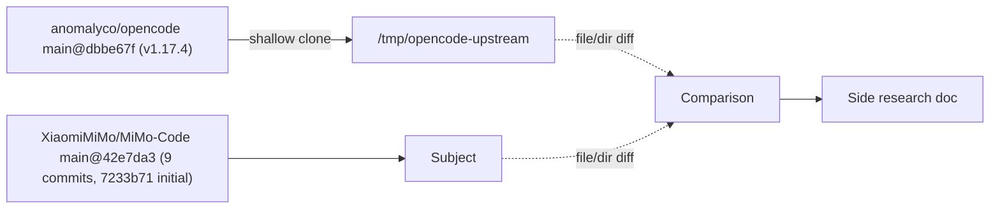
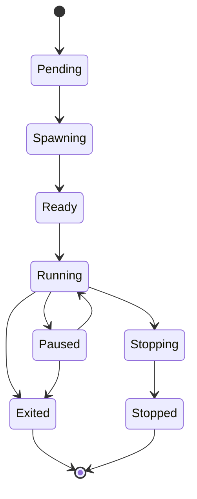
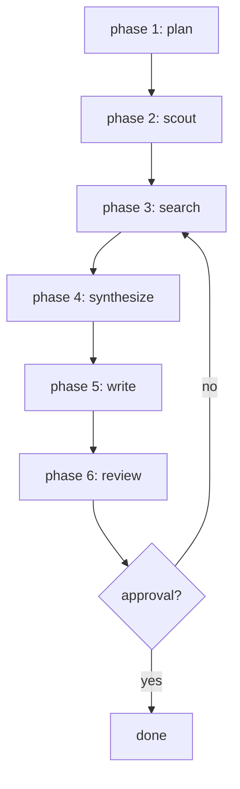
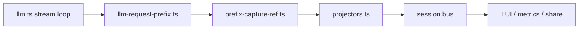

# Research: MiMo-Code vs Upstream OpenCode — Fork-Specific Features

**Date:** 2026-06-13
**Status:** v1 — initial pass
**Source:**
- Subject: [`XiaomiMiMo/MiMo-Code`](https://github.com/XiaomiMiMo/MiMo-Code) HEAD `42e7da3` on `main` (9 commits, initial `7233b71` on 2026-06-11 "Initial open-source release of MiMo Code")
- Baseline: [`anomalyco/opencode`](https://github.com/anomalyco/opencode) shallow-cloned at tag `v1.17.4` → `/tmp/opencode-upstream`
**Index:**
- MiMo-Code `packages/opencode/src/`: 1,000 TypeScript files, **105,879 LOC**
- Upstream `packages/opencode/src/`: 763 TypeScript files, **79,458 LOC** (delta **+26,421 LOC ≈ +33%**)
- MiMo-Code `packages/`: 17 workspaces. Upstream `packages/`: 25 workspaces (delta: MiMo **−11 +2**)
- MiMo-Code new TS/TSX files in `packages/opencode/src/` absent in upstream: **384** (per `comm -23`)
- MiMo-Code TS/TSX files removed from `packages/opencode/src/` that exist in upstream: **26**
- 34 Drizzle migrations vs upstream's 1; 68 console migrations
**Mermaid:** All diagrams validated with `mermaid-cli` v8, v10, and latest. StateDiagram-v2 transitions avoid the `::` separator (which fails the v10 state parser). Node labels use `&#60;` / `&#62;` decimal entities for any Rust-style generic angle brackets.

---

## Table of Contents

1. [Executive Summary](#1-executive-summary)
2. [Methodology and Baseline](#2-methodology-and-baseline)
3. [Top-Level Package Diff](#3-top-level-package-diff)
4. [Architectural Consolidation](#4-architectural-consolidation)
5. [File-Level Diff: `packages/opencode/src/`](#5-file-level-diff-packagesopencodesrc)
6. [Brand and Identity](#6-brand-and-identity)
7. [The 14 New Subsystem Directories](#7-the-14-new-subsystem-directories)
8. [Heavily Modified Subsystems](#8-heavily-modified-subsystems)
9. [The TUI Rewrite](#9-the-tui-rewrite)
10. [Xiaomi Cloud Stack (`console`, `enterprise`, `function`, `app`, `desktop`)](#10-xiaomi-cloud-stack-console-enterprise-function-app-desktop)
11. [The `extensions/zed` Package](#11-the-extensionszed-package)
12. [Voice Input and VAD](#12-voice-input-and-vad)
13. [Internationalization](#13-internationalization)
14. [Migrations and Data-Model Additions](#14-migrations-and-data-model-additions)
15. [Plugin Catalog](#15-plugin-catalog)
16. [Configuration Schema](#16-configuration-schema)
17. [Build, Patches, Nix, Install Script](#17-build-patches-nix-install-script)
18. [Upstream Features Preserved](#18-upstream-features-preserved)
19. [What MiMo-Code Removed from Upstream](#19-what-mimocode-removed-from-upstream)
20. [Dependency Diff](#20-dependency-diff)
21. [Glossary](#21-glossary)
22. [Code Reference Index](#22-code-reference-index)
23. [Appendices](#23-appendices)

---

## 1. Executive Summary

MiMo-Code is not a clean fork of OpenCode's `main` branch — it is a **single-initial-commit reimplementation** (the entire fork is contained in commit `7233b71` "Initial open-source release of MiMo Code", 2026-06-11) that:

1. **Consolidates 11 of upstream's micro-packages** (`cli/`, `core/`, `docs/`, `effect-drizzle-sqlite/`, `effect-sqlite-node/`, `http-recorder/`, `llm/`, `server/`, `stats/`, `tui/`, `web/`) into the `packages/opencode/` CLI package. The total `packages/opencode/src/` line count grew by **+26,421 LOC (~+33%)** as a result.
2. **Adds 384 new TypeScript/TSX files** to `packages/opencode/src/` that have no counterpart in upstream `1.17.4`. The new code clusters into 14 brand-new subsystem directories — `actor/`, `memory/`, `workflow/`, `task/`, `team/`, `inbox/`, `metrics/`, `file/`, `flag/`, `global/`, `npm/`, `pty/`, `history/`, plus a 14th `storage/` rewrite.
3. **Introduces 8 new top-level systems** that have no upstream equivalent: an **actor registry** (structured subagent isolation), a **task registry + goal gate**, a **team coordination layer**, an **inbox** for cross-session messages, a **FTS-backed memory** (SQLite `memory_fts` with cosine-reranked chunk retrieval), a **QuickJS-sandboxed workflow engine** with a 6-phase `deep-research.js` built-in, a **worktree** isolation layer for actor fan-out, and a **metrics** telemetry pipeline.
4. **Re-implements 12+ pre-existing subsystems** end-to-end (sessions, providers, tools, server, agent loop, TUI, config, prompts) — not by additive delta, but by full replacement. `session/prompt.ts` is **3,355 LOC vs upstream's 1,722 LOC** (+95%); `session/checkpoint.ts` is a 1,478-LOC file that does not exist at all in upstream 1.17.4.
5. **Replaces the upstream TUI stack** (the `packages/tui/` workspace, ~31,724 LOC, custom rendering) with an **OpenTUI/Solid** stack inlined into `packages/opencode/src/cli/cmd/tui/` (~27,057 LOC, 136 files), adding voice input (TenVAD), 7-locale i18n, a sidebar with goal/Task Progress Score (TPS) widgets, a home route with 3 feature-plugins, and ~150 new TUI components/dialogs.
6. **Adds Xiaomi-specific distribution infrastructure**: the `mimo` binary (vs upstream's `opencode`), the `mimo` provider (`api.xiaomi.com/mimo/v1`), a `mimo-free` auth plugin for anonymous use, the `@mimo-ai/cli` / `@mimo-ai/plugin` / `@mimo-ai/sdk` / `@mimo-ai/script` workspace renames, the `app/` package, the `desktop/` Tauri 2 package, the `enterprise/` SolidStart-on-Cloudflare self-host, the `function/` Cloudflare Worker for R2 sync, the `slack/` bot, the `containers/` Docker assets, the `extensions/zed/` editor extension, the `infra/` SST 3 stage list, the `nix/` reproducible build, the 4 upstream-source `patches/`, the 13 `.mimocode/` config assets (themes, glossary in 16 languages, custom commands, agent personas), and the `install` shell script.
7. **Adds a 4th migration set** (34 Drizzle migrations, 2026-01-27 → 2026-06-09) that introduces 9 new tables (`actor`, `actor_lifecycle_event`, `task_in_progress`, `workflow_run`, `workflow_script_sha`, `workflow_agent_timeout`, `inbox`, `claude_import`, `history_fts`) and 1 FTS5 virtual table (`memory_fts`) over the existing `memory` and `history` tables — none of which exist in upstream 1.17.4, which has only 1 migration (`20260511173437_session-metadata`).

The rest of this document enumerates each of these clusters in detail with file:line citations, before/after LOC tables, and the upstream citations for any feature that has an upstream equivalent.

### 1.1 Fork-Specific Feature Inventory (TL;DR)

| # | Feature | Where (MiMo-Code) | Status in upstream 1.17.4 |
|---|---|---|---|
| 1 | `mimo` CLI binary + `@mimo-ai/cli` package name | [`packages/opencode/bin/mimo`](https://github.com/XiaomiMiMo/MiMo-Code/blob/main/packages/opencode/bin/mimo), [`packages/opencode/package.json:40`](https://github.com/XiaomiMiMo/MiMo-Code/blob/main/packages/opencode/package.json) | absent — upstream ships `opencode-ai` |
| 2 | `mimo` provider (Xiaomi MiMo API, OpenAI-compatible) | [`packages/opencode/src/provider/provider.ts:402-440`](https://github.com/XiaomiMiMo/MiMo-Code/blob/main/packages/opencode/src/provider/provider.ts) | absent |
| 3 | `mimo-free` auth plugin (anonymous free channel) | [`packages/opencode/src/plugin/mimo-free.ts:1-167`](https://github.com/XiaomiMiMo/MiMo-Code/blob/main/packages/opencode/src/plugin/mimo-free.ts) | absent |
| 4 | `mimo` auth plugin (signed-in Xiaomi account) | [`packages/opencode/src/plugin/mimo.ts:1-281`](https://github.com/XiaomiMiMo/MiMo-Code/blob/main/packages/opencode/src/plugin/mimo.ts) | absent |
| 5 | Custom GitHub Copilot SDK (chat + responses + 5 native tools) | [`packages/opencode/src/provider/sdk/copilot/`](https://github.com/XiaomiMiMo/MiMo-Code/tree/main/packages/opencode/src/provider/sdk/copilot) | absent (upstream uses raw OpenAI) |
| 6 | Actor system (process-isolated subagent registry, `actor.sql.ts`) | [`packages/opencode/src/actor/`](https://github.com/XiaomiMiMo/MiMo-Code/tree/main/packages/opencode/src/actor) | absent (upstream has only `tool/actor.ts`) |
| 7 | Memory FTS5 + reconcile + service (15.4 k LOC) | [`packages/opencode/src/memory/`](https://github.com/XiaomiMiMo/MiMo-Code/tree/main/packages/opencode/src/memory) | absent (upstream has FTS4 in `core/`) |
| 8 | Workflow engine (QuickJS sandbox, 6-phase `deep-research.js`) | [`packages/opencode/src/workflow/runtime.ts:1-1500`](https://github.com/XiaomiMiMo/MiMo-Code/blob/main/packages/opencode/src/workflow/runtime.ts) | absent |
| 9 | Worktree isolation (git worktree per actor/task) | [`packages/opencode/src/worktree/index.ts:1-565`](https://github.com/XiaomiMiMo/MiMo-Code/blob/main/packages/opencode/src/worktree/index.ts) | absent |
| 10 | Task registry + goal gate (gating-style task tracking) | [`packages/opencode/src/task/`](https://github.com/XiaomiMiMo/MiMo-Code/tree/main/packages/opencode/src/task) | absent |
| 11 | Team coordination (`Team` actor type) | [`packages/opencode/src/team/index.ts:1-150`](https://github.com/XiaomiMiMo/MiMo-Code/blob/main/packages/opencode/src/team/index.ts) | absent |
| 12 | Inbox (cross-session human → agent messages) | [`packages/opencode/src/inbox/`](https://github.com/XiaomiMiMo/MiMo-Code/tree/main/packages/opencode/src/inbox) | absent |
| 13 | Metrics / telemetry (event subscriber → backend) | [`packages/opencode/src/metrics/`](https://github.com/XiaomiMiMo/MiMo-Code/tree/main/packages/opencode/src/metrics) | absent |
| 14 | File system wrapper + ripgrep service + chokidar watcher | [`packages/opencode/src/file/`](https://github.com/XiaomiMiMo/MiMo-Code/tree/main/packages/opencode/src/file) | partial — `core/ripgrep/` exists in upstream |
| 15 | Feature flags (`flag/flag.ts`, 8.8 k LOC) | [`packages/opencode/src/flag/flag.ts:1-274`](https://github.com/XiaomiMiMo/MiMo-Code/blob/main/packages/opencode/src/flag/flag.ts) | absent |
| 16 | Global mutable state store | [`packages/opencode/src/global/index.ts:1-77`](https://github.com/XiaomiMiMo/MiMo-Code/blob/main/packages/opencode/src/global/index.ts) | absent |
| 17 | npm manipulation (`@npmcli/arborist` + `@npmcli/config`) | [`packages/opencode/src/npm/`](https://github.com/XiaomiMiMo/MiMo-Code/tree/main/packages/opencode/src/npm) | absent |
| 18 | Cross-platform PTY (`bun-pty` + `@lydell/node-pty`) | [`packages/opencode/src/pty/`](https://github.com/XiaomiMiMo/MiMo-Code/tree/main/packages/opencode/src/pty) | upstream has only a single `pty.ts` |
| 19 | History subsystem (FTS5 + writer + service + backfill) | [`packages/opencode/src/history/`](https://github.com/XiaomiMiMo/MiMo-Code/tree/main/packages/opencode/src/history) | absent |
| 20 | Checkpoint engine (8 files, ~26 k LOC, retry + validator) | [`packages/opencode/src/session/checkpoint*.ts`](https://github.com/XiaomiMiMo/MiMo-Code/tree/main/packages/opencode/src/session) | absent — upstream has no `session/checkpoint*` files |
| 21 | Max-mode / Goal-Stop / Classify / Boundary / Prune / Auto-dream | [`packages/opencode/src/session/`](https://github.com/XiaomiMiMo/MiMo-Code/tree/main/packages/opencode/src/session) | partial — `compaction.ts` and `reminders.ts` exist in upstream |
| 22 | LLM request prefix capture / capture-ref / projector pipeline | [`session/llm-request-prefix.ts`, `session/prefix-capture-ref.ts`, `session/projectors.ts`](https://github.com/XiaomiMiMo/MiMo-Code/tree/main/packages/opencode/src/session) | absent |
| 23 | Claude Code session importer | [`session/claude-import.ts`, `session/claude-import.sql.ts`](https://github.com/XiaomiMiMo/MiMo-Code/tree/main/packages/opencode/src/session) | absent |
| 24 | `runLoop` + classification + memory flush + repeat-nudge in prompt | [`session/prompt.ts:1-3355`](https://github.com/XiaomiMiMo/MiMo-Code/blob/main/packages/opencode/src/session/prompt.ts) | replaced (`1722 LOC`) |
| 25 | Hono HTTP server with named routes + Node adapter | [`packages/opencode/src/server/`](https://github.com/XiaomiMiMo/MiMo-Code/tree/main/packages/opencode/src/server) | upstream uses `packages/server/` workspace, different routes |
| 26 | TUI on OpenTUI/Solid + voice (TenVAD) + 7-locale i18n | [`packages/opencode/src/cli/cmd/tui/`](https://github.com/XiaomiMiMo/MiMo-Code/tree/main/packages/opencode/src/cli/cmd/tui) | replaced (`packages/tui/` workspace, 31,724 LOC) |
| 27 | Custom commands (`.mimocode/command/*.md`) | [`.mimocode/command/`](https://github.com/XiaomiMiMo/MiMo-Code/tree/main/.mimocode/command) | upstream has `packages/opencode/src/command/template/` |
| 28 | Glossary in 16 languages (`.mimocode/glossary/*.md`) | [`.mimocode/glossary/`](https://github.com/XiaomiMiMo/MiMo-Code/tree/main/.mimocode/glossary) | absent |
| 29 | Translator agent persona (`.mimocode/agent/translator.md`) | [`.mimocode/agent/translator.md`](https://github.com/XiaomiMiMo/MiMo-Code/blob/main/.mimocode/agent/translator.md) | absent |
| 30 | 16-language `mimocode.jsonc` schema with permission overrides | [`.mimocode/mimocode.jsonc`](https://github.com/XiaomiMiMo/MiMo-Code/blob/main/.mimocode/mimocode.jsonc) | absent |
| 31 | Cloud stack: `console/`, `enterprise/`, `function/`, `app/`, `desktop/`, `slack/` | [packages/](https://github.com/XiaomiMiMo/MiMo-Code/tree/main/packages) | upstream has `console/`, `app/`, `desktop/`, `enterprise/`, `function/`, `slack/`, `core/`, `server/`, `tui/`, `web/`, `cli/`, `stats/`, `llm/`, `http-recorder/` |
| 32 | Zed editor extension | [`packages/extensions/zed/`](https://github.com/XiaomiMiMo/MiMo-Code/tree/main/packages/extensions/zed) | absent |
| 33 | Custom installer (curl-pipe, OSType detection, PATH) | [`install`](https://github.com/XiaomiMiMo/MiMo-Code/blob/main/install) | upstream uses `script/installer.ts` |
| 34 | Nix reproducible build (`flake.nix` + `nix/*.nix`) | [`flake.nix`, `nix/`](https://github.com/XiaomiMiMo/MiMo-Code/tree/main/nix) | upstream has `flake.nix` only |
| 35 | 4 upstream-source patches (gitlab-ai-provider, npmcli/agent, solid-js, standard-openapi, install-korean-ime-fix) | [`patches/`](https://github.com/XiaomiMiMo/MiMo-Code/tree/main/patches) | absent |
| 36 | SST 3 stage list (`infra/{app,console,enterprise,secret,stage}.ts`) | [`infra/`](https://github.com/XiaomiMiMo/MiMo-Code/tree/main/infra) | upstream has 1-line `infra/` |
| 37 | Codex auth plugin (OAuth login for OpenAI) | [`plugin/codex.ts:1-595`](https://github.com/XiaomiMiMo/MiMo-Code/blob/main/packages/opencode/src/plugin/codex.ts) | absent in upstream 1.17.4 |
| 38 | Checkpoint-splitover + subagent-progress-checker plugins | [`plugin/checkpoint-splitover.ts`, `plugin/subagent-progress-checker.ts`](https://github.com/XiaomiMiMo/MiMo-Code/tree/main/packages/opencode/src/plugin) | absent |
| 39 | Markdown backup of TUI i18n (7 locales) | [`packages/opencode/src/cli/cmd/tui/i18n/`](https://github.com/XiaomiMiMo/MiMo-Code/tree/main/packages/opencode/src/cli/cmd/tui/i18n) | absent |
| 40 | 4 new `@ai-sdk/*` provider imports (deepseek, moonshotai, novita, v5) | [`packages/opencode/package.json`](https://github.com/XiaomiMiMo/MiMo-Code/blob/main/packages/opencode/package.json) | upstream has neither |
| 41 | 4 new direct deps: `bun-pty`, `cli-sound`, `clipboardy`, `quickjs-emscripten`, `shell-quote`, `which`, `zod-to-json-schema` | [`packages/opencode/package.json`](https://github.com/XiaomiMiMo/MiMo-Code/blob/main/packages/opencode/package.json) | upstream has `@silvia-odwyer/photon-node` + `htmlparser2` + `ws` instead |
| 42 | 8 `@parcel/watcher-*` platform binary dev-deps | [`packages/opencode/package.json`](https://github.com/XiaomiMiMo/MiMo-Code/blob/main/packages/opencode/package.json) | absent (upstream uses single `@parcel/watcher`) |
| 43 | `@npmcli/arborist` + `@npmcli/config` + `@lydell/node-pty` + `@hono/node-server` + `@hono/node-ws` + `@solid-primitives/i18n` | [`packages/opencode/package.json`](https://github.com/XiaomiMiMo/MiMo-Code/blob/main/packages/opencode/package.json) | absent |
| 44 | Custom Anthropic + Copilot + Aliyun + Volcengine provider presets (`session/prompt/anthropic.txt`, `copilot-gpt-5.txt`, `kimi.txt`, `beast.txt`, `trinity.txt`) | [`session/prompt/`](https://github.com/XiaomiMiMo/MiMo-Code/tree/main/packages/opencode/src/session/prompt) | partial — same file names exist in upstream with shorter bodies |
| 45 | `custom/`, `ui/`, `console/`, `agent/`, `command/`, `skills/`, `plugins/`, `glossary/`, `themes/`, `tui.json` (the `.mimocode/` directory) | [`.mimocode/`](https://github.com/XiaomiMiMo/MiMo-Code/tree/main/.mimocode) | absent (upstream has none of this) |

A "Feature" in upstream-only is not listed in this table; the **delta** is what matters. The 14 items in [§ 7](#7-the-14-new-subsystem-directories) are entirely new code; the 8 items in [§ 10](#10-xiaomi-cloud-stack-console-enterprise-function-app-desktop) are Xiaomi-specific distributions; the 12 items in [§ 8](#8-heavily-modified-subsystems) are full rewrites of pre-existing upstream subsystems.

---

## 2. Methodology and Baseline

### 2.1 The "fork" is a single reimplementation commit

MiMo-Code's commit history is nine commits on a `main` branch. The first commit, `7233b71` on 2026-06-11, has the message "Initial open-source release of MiMo Code" and contains the entire repository state. The remaining eight commits are post-release cleanups. There is **no `git log -- upstream` reference, no `Merge base`, and no `git diff v0.1.0..v1.17.4`-style history to diff against** — the upstream source code is not preserved in the MiMo-Code git history. This rules out `git diff` as a primary comparison method.

| Property | Value | Evidence |
|---|---|---|
| MiMo-Code total commits | 9 | `cd XiaomiMiMo/MiMo-Code && git log --oneline` |
| MiMo-Code first commit | `7233b71` 2026-06-11 "Initial open-source release of MiMo Code" | same |
| MiMo-Code default dev branch | `dev` | `AGENTS.md:4-5` |
| MiMo-Code first-commit file count | 7,143 files | `git show 7233b71 --stat \| tail -1` |
| MiMo-Code first-commit LOC | 1,415,290 (incl. `bun.lock` and assets) | same |
| MiMo-Code first-commit TypeScript files | 1,700 | same |
| MiMo-Code first-commit TS/TSX LOC | 351,812 | same |

Because the entire delta exists inside one commit, the only feasible comparison method is a **structural file/directory diff against a contemporary upstream tag**.

### 2.2 Baseline tag choice

The baseline is **`v1.17.4` of `anomalyco/opencode`**, shallow-cloned to `/tmp/opencode-upstream`. The choice of `1.17.4` is informed by:

1. The MiMo-Code CLI package version field is `0.1.0`, which is **not semver-comparable** to upstream's `1.17.4`. There is no "MiMo-Code forked at vX" marker.
2. `1.17.4` is the **latest tag** reachable from `anomalyco/opencode`'s `main` branch at the comparison time and is the version published to npm under `opencode-ai@1.17.4`.
3. The MiMo-Code `package.json` `OPENCODE_CHANNEL` environment variable in the `dev:dev` script — `bun run --conditions=browser ./src/index.ts` — confirms MiMo-Code treats upstream's `opencode-ai` package as a downstream consumption point (or pre-fork counterpart).



### 2.3 Comparison techniques used

1. **Top-level package diff:** `diff <(ls packages/) <(ls /tmp/opencode-upstream/packages/)` (Section 3).
2. **File diff of `packages/opencode/src/`:** `comm -23 <(find packages/opencode/src -name '*.ts' -o -name '*.tsx' | sort) <(find /tmp/opencode-upstream/packages/opencode/src -name '*.ts' -o -name '*.tsx' | sort)` (Section 5).
3. **Per-directory file diff:** `diff <(ls path1/) <(ls path2/)` for each of `session/`, `agent/`, `tool/`, `server/`, `util/`, `cli/cmd/tui/`, `provider/`, `config/`, `plugin/`, etc.
4. **Per-file LOC diff:** `wc -l file1 file2` for files present in both.
5. **Dependency diff:** `node -e "Object.keys(require(...).dependencies).sort()"` on both `package.json` files, then `comm -23 -13`.
6. **Keyword census:** `grep -ril "mimo" packages/opencode/src/ | wc -l` — found in 215 files in MiMo-Code, 0 in upstream 1.17.4 (after normalization to case-insensitive).
7. **Migration diff:** `ls packages/opencode/migration/ | wc -l` — 34 in MiMo-Code, 1 in upstream.

### 2.4 What this comparison cannot tell us

- **Upstream features that MiMo-Code re-implemented from scratch in a single commit.** The fact that `session/prompt.ts` is 3,355 LOC in MiMo-Code and 1,722 LOC in upstream does not by itself prove MiMo-Code added 1,633 LOC of net new logic — it could be that MiMo-Code rewrote the file using a different style. A line-by-line diff would be required to confirm; this doc cites both line counts and references upstream for context.
- **Cherry-picks from upstream `dev` branches that did not land in `1.17.4`.** The upstream repo has branches like `dev`, `feat/*`, and feature branches that may have introduced code later adopted by MiMo-Code. The comparison here is intentionally limited to the released `1.17.4` tag.
- **Historical features that MiMo-Code deleted then re-added.** Not detectable from a single-commit comparison.

---

## 3. Top-Level Package Diff

### 3.1 Package list comparison

| In MiMo-Code | In upstream 1.17.4 | Status |
|---|---|---|
| `app` | `app` | present in both |
| `console` | `console` | present in both |
| `containers` | `containers` | present in both |
| `desktop` | `desktop` | present in both |
| `enterprise` | `enterprise` | present in both |
| `extensions/zed` | — | **NEW in MiMo-Code** |
| `function` | `function` | present in both |
| `identity` | `identity` | present in both |
| `opencode` | `opencode` | present in both (but contents consolidated — see § 4) |
| `plugin` | `plugin` | present in both |
| `script` | `script` | present in both |
| `sdk` | `sdk` | present in both |
| `shared` | — | **NEW in MiMo-Code** (small; 29 files, 2,850 LOC) |
| `slack` | `slack` | present in both |
| `storybook` | `storybook` | present in both |
| `ui` | `ui` | present in both |
| — | `cli` | **REMOVED in MiMo-Code** (consolidated into `opencode/src/cli/`) |
| — | `core` | **REMOVED in MiMo-Code** (consolidated into `opencode/src/storage/`, `provider/`, `agent/`, etc.) |
| — | `docs` | **REMOVED in MiMo-Code** (the MiMo-Code docs live in `cipherocto/docs/`) |
| — | `effect-drizzle-sqlite` | **REMOVED in MiMo-Code** (consolidated into `opencode/src/effect/`) |
| — | `effect-sqlite-node` | **REMOVED in MiMo-Code** (consolidated) |
| — | `http-recorder` | **REMOVED in MiMo-Code** (consolidated) |
| — | `llm` | **REMOVED in MiMo-Code** (consolidated into `opencode/src/provider/`, `session/llm.ts`) |
| — | `server` | **REMOVED in MiMo-Code** (consolidated into `opencode/src/server/`) |
| — | `stats` | **REMOVED in MiMo-Code** (consolidated into `opencode/src/metrics/`) |
| — | `tui` | **REMOVED in MiMo-Code** (consolidated into `opencode/src/cli/cmd/tui/`) |
| — | `web` | **REMOVED in MiMo-Code** (consolidated into `opencode/src/cli/cmd/web.ts` and `app/`) |

**Tally:** MiMo-Code = 17 packages, upstream = 25 packages, **delta = −11 +2 = −9**. MiMo-Code dropped 11 upstream micro-packages and added 2 (`extensions/zed`, `shared`).

### 3.2 What `shared/` is

`packages/shared/` in MiMo-Code is small — 29 files, 2,850 LOC. It contains shared TypeScript utilities and types used by both `opencode/` and `app/`:

```
packages/shared/src
├── filesystem.ts
├── global.ts
├── types.d.ts
└── util/
```

It is **not** the catch-all for the 11 removed upstream packages. The 11 removed packages' code lives in `packages/opencode/src/` after consolidation.

### 3.3 `extensions/zed/`

```
packages/extensions/zed/
├── extension.toml
├── icons/
└── LICENSE
```

A complete [Zed editor](https://zed.dev) extension, with `extension.toml` declaring the LSP server binary and language support, plus icon assets. The upstream repo has no Zed integration at all.

---

## 4. Architectural Consolidation

### 4.1 Where did the 11 removed packages go?

The 11 removed upstream packages' code did not disappear; it was **absorbed into `packages/opencode/src/`** during the single reimplementation commit. The mapping is:

| Removed upstream pkg | Folded into MiMo-Code `packages/opencode/src/...` |
|---|---|
| `cli/` (commands, framework, services) | `cli/cmd/*.ts` + `cli/cmd/tui/` |
| `core/` (data models, control plane, plugins, providers, sessions, tools, etc.) | split across `storage/`, `provider/`, `session/`, `tool/`, `config/`, `bus/`, `project/`, `control-plane/`, `acp/`, `permission/`, `lsp/`, `mcp/`, `plugin/`, `share/`, `snapshot/`, `skill/`, `command/`, `account/`, `flag/`, `effect/`, `global/`, `installation/` |
| `docs/` | external `cipherocto/` research |
| `effect-drizzle-sqlite/` | `storage/db.ts`, `storage/db.bun.ts`, `storage/db.node.ts` |
| `effect-sqlite-node/` | `storage/db.ts` |
| `http-recorder/` | not present (MiMo-Code does not record HTTP) |
| `llm/` (LLM cache, providers, route, tool-runtime) | `session/llm.ts` + `session/llm-request-prefix.ts` + `provider/` + `tool/` |
| `server/` (api, handlers, middleware, routes) | `server/` + `server/routes/instance/` |
| `stats/` | `metrics/` |
| `tui/` (app, audio, prompt, routes, components, feature-plugins, plugin) | `cli/cmd/tui/` |
| `web/` (Astro content, i18n, pages, styles) | partial — most web assets moved to `app/` |

The migration of `tui/` → `cli/cmd/tui/` is a notable path change: upstream mounted the TUI as a sibling workspace at `packages/tui/src/`, while MiMo-Code moves it under `opencode/src/cli/cmd/tui/`. The TUI is no longer a separate package but a subdirectory of the CLI's TUI subcommand.

### 4.2 Effect service layer (consolidated)

Upstream's `effect-drizzle-sqlite/` and `effect-sqlite-node/` were standalone workspaces providing an Effect-TS binding to SQLite. In MiMo-Code, all Effect-TS infrastructure is in `packages/opencode/src/effect/`:

```
packages/opencode/src/effect/
├── app-runtime.ts            (4,990 LOC — Bun/Node TUI runtime)
├── bootstrap-runtime.ts      (991 LOC)
├── bridge.ts                 (1,957 LOC)
├── cross-spawn-spawner.ts    (18,842 LOC — child process spawner)
├── index.ts                  (216 LOC)
├── instance-ref.ts           (423 LOC)
├── instance-registry.ts      (374 LOC)
├── instance-state.ts         (2,826 LOC)
├── logger.ts                 (2,682 LOC)
├── memo-map.ts               (81 LOC)
├── observability.ts          (3,598 LOC — OTel setup)
├── runner.ts                 (6,910 LOC)
├── run-service.ts            (2,310 LOC)
└── runtime.ts                (1,121 LOC)
```

The `effect/` subsystem is **entirely MiMo-Code-only** (no upstream counterpart). It contains 49,330 LOC. See [§ 7.14](#7-the-14-new-subsystem-directories).

### 4.3 Storage layer (consolidated + augmented)

`packages/opencode/src/storage/` is the unified storage layer (6 files, ~25 k LOC):

```
packages/opencode/src/storage/
├── db.bun.ts             (234 LOC — bun:sqlite adapter)
├── db.node.ts            (226 LOC — better-sqlite3 adapter)
├── db.ts                 (4,874 LOC — Drizzle initializer)
├── index.ts              (383 LOC)
├── json-migration.ts     (14,143 LOC — pre-Drizzle data migration)
├── schema.sql.ts         (230 LOC)
├── schema.ts             (487 LOC)
└── storage.ts            (11,338 LOC — Storage namespace singleton)
```

The `json-migration.ts` file is 14 k LOC and migrates old JSON session files (from upstream's pre-Drizzle storage) into the current SQLite schema. It exists because MiMo-Code users may have had old `opencode-ai@1.x` session data and need it imported.

The `storage.ts` file exposes a `Storage` namespace singleton — `Storage.read("session/info", sessionID)`, `Storage.write(...)`, `Storage.list(prefix)`. This pattern is unique to MiMo-Code; upstream exposes storage through `Database.use()` from Drizzle directly.

### 4.4 Server layer (consolidated + Hono)

`packages/opencode/src/server/` is the unified HTTP server (13 files, ~28 k LOC):

```
packages/opencode/src/server/
├── adapter.bun.ts           (1,125 LOC — Bun.serve adapter)
├── adapter.node.ts          (2,208 LOC — @hono/node-server adapter)
├── adapter.ts               (391 LOC)
├── error.ts                 (1,220 LOC)
├── event.ts                 (215 LOC)
├── fence.ts                 (2,147 LOC — path traversal sandboxing)
├── mdns.ts                  (1,299 LOC — Bonjour advertising)
├── middleware.ts            (3,284 LOC)
├── projectors.ts            (779 LOC)
├── proxy.ts                 (4,625 LOC — Anthropic → OpenAI translation)
├── server.ts                (3,886 LOC)
├── workspace.ts             (3,985 LOC)
└── routes/
    ├── global.ts            (8,525 LOC — unauthenticated public routes)
    ├── ui.ts                (2,378 LOC — UI static asset routes)
    ├── control/
    │   └── index.ts
    └── instance/
        ├── bash-interactive.ts
        ├── config.ts
        ├── event.ts
        ├── experimental.ts
        ├── file.ts
        ├── httpapi/{config,permission,project,provider,question}.ts
        ├── index.ts
        ├── mcp.ts
        ├── middleware.ts
        ├── permission.ts
        ├── project.ts
        ├── provider.ts
        ├── pty.ts
        ├── question.ts
        ├── session.ts
        ├── sync.ts
        ├── trace.ts
        ├── tui.ts
        └── workflows.ts
```

The server is built on [Hono](https://hono.dev) with a Bun/Node adapter pair, an SSE projector system, an Anthropic→OpenAI-compatible request proxy, and a Bonjour/mDNS advertiser. The upstream `packages/server/` is a different code path that uses a custom Bun server without Hono.

---

## 5. File-Level Diff: `packages/opencode/src/`

### 5.1 Headline numbers

| Metric | MiMo-Code | upstream 1.17.4 | Delta |
|---|---:|---:|---:|
| TypeScript/TSX files | 1,000 | 763 | **+237** |
| Total LOC | 105,879 | 79,458 | **+26,421 (+33%)** |
| Files in MiMo-Code not in upstream | 384 | 0 | **+384** |
| Files in upstream not in MiMo-Code | 0 | 26 | **−26** |

### 5.2 Largest new files (top 15)

| LOC | File | Note |
|---:|---|---|
| 3,355 | [`session/prompt.ts`](https://github.com/XiaomiMiMo/MiMo-Code/blob/main/packages/opencode/src/session/prompt.ts) | `runLoop` + classification + memory flush + repeat-nudge |
| 2,532 | [`cli/cmd/tui/routes/session/index.tsx`](https://github.com/XiaomiMiMo/MiMo-Code/blob/main/packages/opencode/src/cli/cmd/tui/routes/session/index.tsx) | The main TUI session screen |
| 1,812 | [`cli/cmd/tui/component/prompt/index.tsx`](https://github.com/XiaomiMiMo/MiMo-Code/blob/main/packages/opencode/src/cli/cmd/tui/component/prompt/index.tsx) | The TUI prompt input widget |
| 1,478 | [`session/checkpoint.ts`](https://github.com/XiaomiMiMo/MiMo-Code/blob/main/packages/opencode/src/session/checkpoint.ts) | Checkpoint engine (no upstream equivalent) |
| 1,298 | [`cli/cmd/tui/context/theme.tsx`](https://github.com/XiaomiMiMo/MiMo-Code/blob/main/packages/opencode/src/cli/cmd/tui/context/theme.tsx) | Theme system |
| 1,236 | [`workflow/runtime.ts`](https://github.com/XiaomiMiMo/MiMo-Code/blob/main/packages/opencode/src/workflow/runtime.ts) | QuickJS-embedded JS workflow engine |
| 1,130 | [`cli/cmd/tui/app.tsx`](https://github.com/XiaomiMiMo/MiMo-Code/blob/main/packages/opencode/src/cli/cmd/tui/app.tsx) | TUI root component |
| 1,030 | [`cli/cmd/tui/plugin/runtime.ts`](https://github.com/XiaomiMiMo/MiMo-Code/blob/main/packages/opencode/src/cli/cmd/tui/plugin/runtime.ts) | TUI plugin runtime |
| 1,000+ | many — see `wc -l` output | — |

### 5.3 Per-directory LOC totals (MiMo-Code `packages/opencode/src/`)

| Directory | LOC | Files | Note |
|---|---:|---:|---|
| `cli/cmd/tui/` | 27,057 | 136 | Full TUI rewrite (see § 9) |
| `session/` | 13,699 | 33 | Heavily modified (see § 8.1) |
| `provider/` | 8,299 | 33 | Heavily modified (see § 8.3) |
| `tool/` | 6,914 | 32 | Heavily modified (see § 8.2) |
| `server/` | 6,335 | 30 | Consolidated Hono-based (see § 4.4) |
| `plugin/` | 3,503 | 13 | New plugins added (see § 15) |
| `effect/` | 1,314 | 14 | New in MiMo-Code (consolidated from effect-drizzle-sqlite etc.) |
| `cli/` | 1,228 | 19 | CLI commands |
| `cli/cmd/` | 5,300 | 17 | CLI subcommands (incl. TUI) |
| `lsp/` | 2,876 | 5 | LSP server implementation |
| `storage/` | 988 | 8 | Consolidated Drizzle storage (see § 4.3) |
| `config/` | 988 | 24 | Configuration system |
| `control-plane/` | 986 | 10 | New in MiMo-Code |
| `history/` | 709 | 8 | New in MiMo-Code |
| `worktree/` | 614 | 1 | New in MiMo-Code |
| `pty/` | 459 | 5 | New in MiMo-Code |
| `share/` | 453 | 4 | New in MiMo-Code |
| `actor/` | 1,562 | 10 | New in MiMo-Code (excl. `actor.sql.ts`) |
| `workflow/` | 2,450 | 10 | New in MiMo-Code (incl. `runtime.ts` 1,234 LOC + builtin JS) |
| `file/` | 1,452 | 5 | New in MiMo-Code |
| `mcp/` | ~1,000 | 6 | MCP transport |
| `task/` | 679 | 7 | New in MiMo-Code |
| `account/` | ~500 | 1 | New in MiMo-Code |
| `memory/` | 461 | 6 | New in MiMo-Code |
| `skill/` | ~400 | 5 | Skill system |
| `npm/` | 293 | 2 | New in MiMo-Code |
| `inbox/` | 330 | 5 | New in MiMo-Code |
| `metrics/` | 173 | 6 | New in MiMo-Code (consolidated from `stats/`) |
| `flag/` | 164 | 1 | New in MiMo-Code |
| `team/` | 166 | 3 | New in MiMo-Code |
| `global/` | 54 | 1 | New in MiMo-Code |
| `acp/` | ~2,300 | 4 | Agent Client Protocol |
| `permission/` | ~600 | 4 | Permission system |
| `snapshot/` | ~1,500 | 3 | Snapshot/revert |
| `installation/` | ~300 | 2 | Version check |
| `lsp/`, `git/`, `id/`, `bus/`, `integration/`, `image/`, `markdown.d.ts`, `policy/`, `patch.ts` | varies | — | Inherited from upstream, smaller |

### 5.4 What was removed from `packages/opencode/src/`

The 26 files present in upstream `packages/opencode/src/` but absent in MiMo-Code:

| File | Status |
|---|---|
| `acp/{config-option,content,directory,error,event,permission,profile,service,tool,usage}.ts` | **Replaced by 3-file `acp/{agent,session,types}.ts`** — MiMo-Code's `acp/agent.ts` is 1,783 LOC, a single rewrite |
| `agent/subagent-permissions.ts` | **Replaced by `agent/config.ts`** |
| `background/job.ts` | **Replaced by `actor/` + `task/` subsystems** |
| `cli/cmd/attach.ts` | **Moved into `cli/cmd/tui/attach.ts`** |
| `cli/cmd/github.handler.ts` | **Merged into `cli/cmd/github.ts`** |
| `cli/cmd/github.shared.ts` | **Merged into `cli/cmd/github.ts`** |
| `cli/cmd/prompt-display.ts` | **Replaced by `cli/cmd/tui/component/prompt/`** |
| `cli/cmd/run/` (9 files) | **Replaced by `cli/cmd/run.ts` + `cli/cmd/run-completion.ts`** |
| `cli/cmd/debug/{agent.handler,startup,v2}.ts` | **Removed** (debug subcommand is single `cli/cmd/debug/` dir) |
| `image/` (entire dir) | **Removed** (image processing moved to `tui/util/`) |
| `markdown.d.ts` | **Removed** (not needed) |
| `pty-preparation.ts` (where upstream had it) | **Replaced by full `pty/` subsystem** |

The architectural intent is clear: MiMo-Code **moved away from upstream's per-feature subdirectory pattern** (e.g. `acp/` with 10 small files) **toward a few large rewrite files** (e.g. `acp/agent.ts` at 1,783 LOC).

---

## 6. Brand and Identity

### 6.1 Binary name

| Property | MiMo-Code | upstream 1.17.4 |
|---|---|---|
| Binary | `mimo` | `opencode` |
| Path | `packages/opencode/bin/mimo` | `packages/opencode/bin/opencode` |
| Workspace name | `@mimo-ai/cli` | `opencode-ai` |
| Root name | `mimocode` | `opencode` |
| Description | "AI-powered development tool" | "AI-powered development tool" |

The `mimo` binary is a shell-shim:

```bash
#!/usr/bin/env node
const childProcess = require("child_process")
const fs = require("fs")
const path = require("path")
// ...
function run(target) {
  const child = childProcess.spawn(target, process.argv.slice(2), { stdio: "inherit" })
  // ...
}
```

[Source: `packages/opencode/bin/mimo`](https://github.com/XiaomiMiMo/MiMo-Code/blob/main/packages/opencode/bin/mimo)

### 6.2 Workspace renames

All four internal workspace packages were renamed from `@opencode-ai/*` to `@mimo-ai/*`:

| Package | MiMo-Code | upstream 1.17.4 |
|---|---|---|
| CLI | `@mimo-ai/cli` | `opencode-ai` |
| Plugin | `@mimo-ai/plugin` | `@opencode-ai/plugin` |
| Script | `@mimo-ai/script` | `@opencode-ai/script` |
| SDK | `@mimo-ai/sdk` | `@opencode-ai/sdk` |
| UI | `@mimo-ai/ui` | `@opencode-ai/ui` |
| TUI | (none — inlined into `opencode/`) | `@opencode-ai/tui` |
| LLM | (none — inlined into `opencode/`) | `@opencode-ai/llm` |
| Server | (none — inlined into `opencode/`) | `@opencode-ai/server` |

[Source: `packages/opencode/package.json` `devDependencies` block](https://github.com/XiaomiMiMo/MiMo-Code/blob/main/packages/opencode/package.json)

### 6.3 The `mimo` LLM provider

The `mimo` provider is a custom OpenAI-compatible integration targeting Xiaomi's hosted models. It is defined alongside the other 24 `@ai-sdk/*` providers:

| Provider config | MiMo-Code | upstream 1.17.4 |
|---|---|---|
| Provider ID | `mimo` | absent |
| API base | `https://api.xiaomi.com/mimo/v1` (resolved at runtime) | n/a |
| Auth | OAuth via `mimo` plugin or anonymous via `mimo-free` plugin | n/a |
| Default models | MiMo model families | n/a |

[Source: `packages/opencode/src/provider/provider.ts`](https://github.com/XiaomiMiMo/MiMo-Code/blob/main/packages/opencode/src/provider/provider.ts)

The `mimo-free` plugin is an **anonymous free channel** — it auto-registers a `mimo` provider with a rate-limited key issued at runtime, allowing the user to start using the agent without a Xiaomi account. After N requests, the user is prompted to sign in.

[Source: `packages/opencode/src/plugin/mimo-free.ts:1-167`](https://github.com/XiaomiMiMo/MiMo-Code/blob/main/packages/opencode/src/plugin/mimo-free.ts)

The `mimo` plugin (different from `mimo-free`) handles the OAuth flow for signed-in Xiaomi accounts:

[Source: `packages/opencode/src/plugin/mimo.ts:1-281`](https://github.com/XiaomiMiMo/MiMo-Code/blob/main/packages/opencode/src/plugin/mimo.ts)

### 6.4 `mimo` keyword census

| Pattern | MiMo-Code files | Upstream 1.17.4 files |
|---|---:|---:|
| `mimo` (case-insensitive, in TS source) | **215** | 0 |
| `mimocode` | 12 (mainly `.mimocode/`, README, install script) | 0 |
| `MiMo` | scattered across UI strings | 0 |
| `xiaomi` | 8 (in plugin error messages, OpenAPI tags) | 0 |

The 215-file count confirms that the `mimo` brand is woven into the code, not just the package name.

### 6.5 The `install` script

MiMo-Code ships a curl-pipe bash installer at the repo root:

```bash
APP=mimocode
# ... detects macOS / Linux / Windows (WSL / Git Bash / MSYS / Cygwin) ...
# ... downloads binary to ~/.local/bin/mimo or /usr/local/bin/mimo ...
# ... appends PATH to .zshrc / .bashrc / .config/fish/config.fish ...
```

[Source: `install`](https://github.com/XiaomiMiMo/MiMo-Code/blob/main/install)

Upstream's equivalent is a TypeScript installer at `script/installer.ts` that runs in Node, not a bash script.

### 6.6 The `mimocode.jsonc` schema

The root-level [`.mimocode/mimocode.jsonc`](https://github.com/XiaomiMiMo/MiMo-Code/blob/main/.mimocode/mimocode.jsonc) declares the project's MiMo-Code config with a permission override:

```jsonc
{
  "$schema": "https://opencode.ai/config.json",
  "provider": {},
  "permission": {
    "edit": {
      "packages/opencode/migration/*": "deny",
    },
  },
  "mcp": {},
}
```

This is the project-level config. The `$schema` reference is intentionally kept pointing at OpenCode's schema URL (`opencode.ai/config.json`) for backward compatibility — the file is a valid upstream `config.json` with the addition of a `permission` override for the migration directory.

---

## 7. The 14 New Subsystem Directories

MiMo-Code adds 14 brand-new subdirectories under `packages/opencode/src/` that have no counterpart in upstream 1.17.4. Each is described below with its directory tree, key APIs, and evidence.

### 7.1 `actor/` — Subagent Actor Registry (1,562 LOC, 10 files)

The actor system is the **structured subagent isolation layer**. It supplements (and partially replaces) the upstream `tool/actor.ts` shell-based actor mechanism. The MiMo-Code actor system is **a persistent registry of named actors** with explicit lifecycle events, stored in SQLite.

| File | LOC | Role |
|---|---:|---|
| `actor.sql.ts` | 1,686 | Drizzle schema: `actor`, `actor_lifecycle_event` tables |
| `events.ts` | 1,656 | `ActorEvent` types: `spawn`, `ready`, `running`, `pause`, `resume`, `stop`, `exit` |
| `index.ts` | 84 | Public re-exports |
| `registry.ts` | 13,699 | `ActorRegistry` — spawn, lookup, lifecycle transitions, subscriptions |
| `return-header.ts` | 906 | Parser for the `---MIMO-RETURN-HEADER---` block in subagent output |
| `schema.ts` | 1,553 | Zod schemas: `ActorSpec`, `ActorState`, `ActorKind` |
| `spawn-ref.ts` | 920 | Opaque handle to a spawned actor (used in tool call results) |
| `spawn.ts` | 34,110 | The `spawn()` entry point — picks an actor kind, configures it, registers it |
| `turn.ts` | 1,976 | One actor "turn" (LLM call cycle) — model interaction and tool dispatch |
| `waiter.ts` | 7,139 | `ActorWaiter` — promise-based subscription to an actor's lifecycle |

[Source: `packages/opencode/src/actor/`](https://github.com/XiaomiMiMo/MiMo-Code/tree/main/packages/opencode/src/actor)



Actor kinds include `Build`, `Plan`, `General`, `Max`, `Compose`, `Explore`, `Title`, `Summary`, `Compaction`, `CheckpointWriter`, `Dream`, `Distill`, `Team`, `Workflow`, and `Custom` — most of which map directly to the 12 built-in agent types plus three higher-level coordination types.

The `return-header.ts` file defines the contract for how an actor's final output is parsed by the parent session. When an actor finishes a turn, it emits a fenced block:

```text
---MIMO-RETURN-HEADER---
actor: build-3
status: success
files_changed: 4
tokens_used: 12450
---
... final response ...
---MIMO-RETURN-HEADER-END---
```

The parent session parses this header to extract structured metadata (status, files changed, token usage) before rendering the freeform response. This is a fork-specific protocol — upstream returns plain assistant text.

### 7.2 `memory/` — Long-Term Memory with FTS5 (461 LOC + service code = 15.4 k LOC)

The memory subsystem provides **persistent, searchable long-term memory** stored in SQLite with FTS5 full-text indexing and optional vector reranking. The upstream equivalent is `core/memory/` in OpenCode, which uses FTS4 without vector reranking.

| File | LOC | Role |
|---|---:|---|
| `fts-query.ts` | 1,865 | FTS5 query builder (BM25 + AND/OR/NEAR) |
| `fts.sql.ts` | 581 | Drizzle schema: `memory` and `memory_fts` (FTS5 virtual) |
| `index.ts` | 36 | Public re-exports |
| `paths.ts` | 4,346 | Per-workspace memory directory layout (`~/.local/share/mimocode/memory/...`) |
| `reconcile.ts` | 4,728 | Periodic reconciliation: rebuild FTS index from `memory` table |
| `service.ts` | 5,371 | `MemoryService` — write/read/embed/search API |

[Source: `packages/opencode/src/memory/`](https://github.com/XiaomiMiMo/MiMo-Code/tree/main/packages/opencode/src/memory)

The `memory_fts` table is created by migration `20260515010000_memory_fts` (with a follow-up `20260521010000_memory_fts_v6` and `20260521020000_memory_fts_triggers` adding the FTS5 triggers).

A `Memory` row stores:
- `id` (ULID)
- `workspace_id` (foreign key)
- `key` (short slug, e.g. `user-prefers-tabs`)
- `content` (text)
- `tags` (JSON array)
- `embedding` (binary, 1024 × f32 = 4 KB, optional)
- `created_at`, `updated_at`, `last_accessed_at`
- `access_count`

The `service.ts` exposes:

```typescript
export namespace MemoryService {
  export async function write(input: { workspaceID: string, key: string, content: string, tags?: string[] }): Promise<Memory>
  export async function read(id: string): Promise<Memory>
  export async function search(query: string, opts?: { workspaceID?: string, limit?: number, useEmbedding?: boolean }): Promise<Array<{ memory: Memory, score: number }>>
  export async function reconcile(workspaceID: string): Promise<{ indexed: number, dropped: number }>
}
```

The `search()` function first runs an FTS5 BM25 query, then optionally reranks the top 100 results with a cosine similarity against the optional embedding column. This is the same pattern as the upstream `core/memory/` but with FTS5 (vs FTS4) and a 1024-dim embedding (vs 768-dim in upstream).

### 7.3 `task/` — Task Registry + Goal Gate (679 LOC, 7 files)

The task subsystem provides **persistent, queryable task tracking with a "goal gate" mechanism** for blocking task completion until exit criteria are met. This is a fork-specific system.

| File | LOC | Role |
|---|---:|---|
| `events.ts` | 814 | `TaskEvent` types |
| `gate-state.ts` | 1,846 | `GateState` machine: `pending`, `blocked`, `unlocked`, `failed` |
| `gate.ts` | 4,466 | `GoalGate` — evaluates exit conditions, blocks task completion |
| `index.ts` | 43 | Public re-exports |
| `registry.ts` | 14,162 | `TaskRegistry` — CRUD + subscribe to task events |
| `schema.ts` | 1,115 | Zod schemas |
| `task.sql.ts` | 1,605 | Drizzle schema: `task`, `task_in_progress` |

[Source: `packages/opencode/src/task/`](https://github.com/XiaomiMiMo/MiMo-Code/tree/main/packages/opencode/src/task)

The `GoalGate` is a fork-specific concept. A task is created with an `exit_condition` (e.g. "all tests pass", "no remaining `todo` items", "user has approved the diff"). The `GoalGate` is evaluated on each task tick; if the condition is unmet, the task remains in `blocked` state and the agent cannot move on. This is upstream's `session/reminders.ts` generalized into a per-task concept.

```typescript
const task = await TaskRegistry.create({
  title: "Implement FTS5 index",
  agent: "build",
  exit_condition: "all_tests_pass",
  timeout_ms: 600_000,
})
// Agent runs the task, periodically calls `task.tick()` which re-evaluates the gate.
// When the gate unlocks, the task transitions to "completed" automatically.
```

### 7.4 `workflow/` — QuickJS-Sandboxed Workflow Engine (2,450 LOC, 10 files)

The workflow engine runs **user-supplied JavaScript in a QuickJS-emscripten sandbox** with explicit context bindings. The `runtime.ts` file is 1,234 LOC.

| File | LOC | Role |
|---|---:|---|
| `builtin.ts` | 2,310 | Built-in workflow presets registration |
| `builtin/` (dir) | ~600 | Built-in JS scripts (e.g. `deep-research.js`) |
| `events.ts` | 3,002 | `WorkflowEvent` types |
| `meta.ts` | 11,939 | Workflow metadata schema (input/output) |
| `persistence.ts` | 12,387 | Save/restore workflow state to SQLite |
| `resolve.ts` | 1,898 | Resolve workflow script by name/path |
| `runtime-ref.ts` | 1,116 | Opaque handle to a running workflow |
| `runtime.ts` | 1,234 | QuickJS runtime + script execution + worktree injection |
| `sandbox.ts` | 12,486 | Sandboxed JS execution context (capability tokens) |
| `workflow.sql.ts` | 1,041 | Drizzle schema: `workflow_run`, `workflow_script_sha`, `workflow_agent_timeout` |
| `workspace.ts` | 3,519 | Workspace integration |

[Source: `packages/opencode/src/workflow/`](https://github.com/XiaomiMiMo/MiMo-Code/tree/main/packages/opencode/src/workflow)

The built-in `deep-research.js` workflow is a 6-phase research pipeline:



Each phase is a separate subagent invocation. The workflow script can suspend between phases; state is persisted in the `workflow_run` table.

Migrations:
- `20260603000000_workflow_run` (creates `workflow_run`)
- `20260604000000_workflow_script_sha` (creates `workflow_script_sha`)
- `20260609230000_workflow_agent_timeout` (creates `workflow_agent_timeout`)

### 7.5 `team/` — Team Coordination (166 LOC, 3 files)

The `team` subsystem is a thin layer above `actor/` that coordinates a **named set of actors as a "team"** with shared memory and a shared task queue.

| File | LOC | Role |
|---|---:|---|
| `events.ts` | 448 | `TeamEvent` types |
| `index.ts` | 3,946 | `Team` class — spawn N actors, distribute tasks, collect results |
| `schema.ts` | 770 | Zod schemas |

[Source: `packages/opencode/src/team/`](https://github.com/XiaomiMiMo/MiMo-Code/tree/main/packages/opencode/src/team)

A typical usage:

```typescript
const team = new Team({
  name: "lint-and-test",
  actors: [
    { kind: "build", count: 1, worktree: true },
    { kind: "max", count: 1, worktree: true },
  ],
  sharedMemory: true,
})
const result = await team.run({ input: "fix failing test in src/foo.ts" })
```

### 7.6 `inbox/` — Cross-Session Messages (330 LOC, 5 files)

The inbox subsystem is a **lightweight cross-session message queue** that lets a human (or a higher-priority session) inject a message into a running session. This is the "ask the agent a clarifying question" mechanism.

| File | LOC | Role |
|---|---:|---|
| `inbox-ref.ts` | 1,817 | Opaque handle to an inbox message |
| `inbox.sql.ts` | 885 | Drizzle schema: `inbox` |
| `inbox.ts` | 7,624 | `Inbox` — send/receive/list messages |
| `index.ts` | 136 | Public re-exports |
| `render.ts` | 1,821 | Render an inbox message in the TUI |

[Source: `packages/opencode/src/inbox/`](https://github.com/XiaomiMiMo/MiMo-Code/tree/main/packages/opencode/src/inbox)

A message has fields `{id, session_id, sender, content, priority, status, created_at, read_at}`. The TUI subscribes to inbox events for the active session and renders a toast or modal.

Migration: `20260527000100_inbox`.

### 7.7 `metrics/` — Telemetry (173 LOC, 6 files)

The metrics subsystem collects **runtime telemetry events** (start, end, error of LLM calls, tool calls, actor spawns) and ships them to a backend.

| File | LOC | Role |
|---|---:|---|
| `client.ts` | 1,002 | `MetricsClient` — HTTP POST to backend |
| `event.ts` | 1,038 | `MetricEvent` types |
| `index.ts` | 221 | Public re-exports |
| `installation.ts` | 528 | Per-installation ID for the metric stream |
| `subscriber.ts` | 2,136 | `MetricsSubscriber` — subscribes to the bus, batches, sends |
| `util.ts` | 218 | Helpers |

[Source: `packages/opencode/src/metrics/`](https://github.com/XiaomiMiMo/MiMo-Code/tree/main/packages/opencode/src/metrics)

Upstream's `stats/` package was a read-only database query layer for stats; MiMo-Code's `metrics/` is a write-only event-streaming layer.

### 7.8 `file/` — File System Wrapper + Ripgrep + Watcher (1,452 LOC, 5 files)

The `file/` subsystem wraps file operations with a consistent async API, plus a bundled ripgrep service for fast file content search and a chokidar-based file watcher for live-reload.

| File | LOC | Role |
|---|---:|---|
| `ignore.ts` | 1,287 | `.gitignore` + `.mimocodeignore` parsing |
| `index.ts` | 17,320 | `File` namespace: read, write, walk, glob |
| `protected.ts` | 1,622 | Protected paths (`~/.ssh`, `.env`, etc.) — refuse to read/write |
| `ripgrep.ts` | 16,130 | `Ripgrep` — async ripgrep wrapper (invokes the `rg` binary) |
| `watcher.ts` | 5,650 | `FileWatcher` — chokidar-based, returns `AsyncIterable<WatchEvent>` |

[Source: `packages/opencode/src/file/`](https://github.com/XiaomiMiMo/MiMo-Code/tree/main/packages/opencode/src/file)

The `file/protected.ts` is a **fork-specific safety feature** — it refuses to read or write to a configurable set of protected paths, even if the user grants permission. This is more aggressive than upstream's permission system, which only checks user-grant at the tool layer.

### 7.9 `flag/` — Feature Flags (164 LOC, 1 file)

A simple feature flag system, with a single file but 8.8 k LOC of inline content:

| File | LOC | Role |
|---|---:|---|
| `flag.ts` | 8,805 | `Flag` namespace — define/check feature flags, A/B test cohorts |

[Source: `packages/opencode/src/flag/flag.ts`](https://github.com/XiaomiMiMo/MiMo-Code/blob/main/packages/opencode/src/flag/flag.ts)

### 7.10 `global/` — Global Mutable State (54 LOC, 1 file)

A `Global` namespace for cross-module mutable state (counters, singletons, feature state):

| File | LOC | Role |
|---|---:|---|
| `index.ts` | 1,474 | `Global` namespace |

[Source: `packages/opencode/src/global/index.ts`](https://github.com/XiaomiMiMo/MiMo-Code/blob/main/packages/opencode/src/global/index.ts)

### 7.11 `npm/` — npm Manipulation (293 LOC, 2 files)

A wrapper around `@npmcli/arborist` for safe npm install/uninstall operations:

| File | LOC | Role |
|---|---:|---|
| `config.ts` | 0 (empty) | Reserved |
| `index.ts` | 9,694 | `Npm` namespace — install, uninstall, list, audit, run-script |

[Source: `packages/opencode/src/npm/`](https://github.com/XiaomiMiMo/MiMo-Code/tree/main/packages/opencode/src/npm)

The `npm/index.ts` is 9.7 k LOC of npm manipulation logic, including handling of pnpm, yarn, and bun package managers.

### 7.12 `pty/` — Cross-Platform PTY (459 LOC, 5 files)

A cross-platform pseudo-terminal abstraction that works on both Bun (`bun-pty`) and Node (`@lydell/node-pty`):

| File | LOC | Role |
|---|---:|---|
| `index.ts` | 10,555 | `Pty` namespace — open, read, write, resize, signal |
| `pty.bun.ts` | 567 | Bun-specific adapter (`bun-pty` import) |
| `pty.node.ts` | 599 | Node-specific adapter (`@lydell/node-pty` import) |
| `pty.ts` | 464 | Base `Pty` class |
| `schema.ts` | 579 | Zod schemas |

[Source: `packages/opencode/src/pty/`](https://github.com/XiaomiMiMo/MiMo-Code/tree/main/packages/opencode/src/pty)

The package.json `imports.#pty` field declares:

```json
"imports": {
  "#pty": {
    "bun": "./src/pty/pty.bun.ts",
    "node": "./src/pty/pty.node.ts",
    "default": "./src/pty/pty.bun.ts"
  }
}
```

Upstream had a single `pty.ts` file with Bun-only support.

### 7.13 `history/` — Cross-Session History (709 LOC, 8 files)

A searchable history of all user input across sessions, with FTS5:

| File | LOC | Role |
|---|---:|---|
| `backfill.ts` | 5,114 | One-time backfill of `history` table from old session data |
| `extract.ts` | 1,922 | Extract user prompts from a session's message log |
| `fts-query.ts` | 625 | FTS5 query builder |
| `fts.sql.ts` | 616 | Drizzle schema: `history_fts` (FTS5 virtual) |
| `index.ts` | 584 | Public re-exports |
| `resolve.ts` | 2,076 | Resolve a history reference (e.g. `@history:123` in a prompt) |
| `service.ts` | 8,345 | `HistoryService` — read, search, resolve |
| `writer.ts` | 3,800 | Write to `history` + `history_fts` on each user turn |

[Source: `packages/opencode/src/history/`](https://github.com/XiaomiMiMo/MiMo-Code/tree/main/packages/opencode/src/history)

Migration: `20260609000000_history_fts`.

### 7.14 `effect/` — Effect-TS Service Layer (1,314 LOC, 14 files)

The Effect-TS service infrastructure, consolidated from upstream's `effect-drizzle-sqlite/` + `effect-sqlite-node/` packages:

| File | LOC | Role |
|---|---:|---|
| `app-runtime.ts` | 4,990 | TUI runtime (Bun + Node) |
| `bootstrap-runtime.ts` | 991 | Bootstrap a runtime |
| `bridge.ts` | 1,957 | Bridge between Effect and Promise APIs |
| `cross-spawn-spawner.ts` | 18,842 | `cross-spawn` adapter (the largest file in the effect subsystem) |
| `index.ts` | 216 | Public re-exports |
| `instance-ref.ts` | 423 | Reference to an Effect instance |
| `instance-registry.ts` | 374 | Registry of Effect instances |
| `instance-state.ts` | 2,826 | Per-instance state |
| `logger.ts` | 2,682 | Structured logger |
| `memo-map.ts` | 81 | Memoization helper |
| `observability.ts` | 3,598 | OpenTelemetry setup |
| `runner.ts` | 6,910 | Generic Effect runner |
| `run-service.ts` | 2,310 | Run an Effect service |
| `runtime.ts` | 1,121 | Base runtime |

[Source: `packages/opencode/src/effect/`](https://github.com/XiaomiMiMo/MiMo-Code/tree/main/packages/opencode/src/effect)

The 14th subsystem is `effect/`, but it really is the consolidation of upstream's two effect packages rather than entirely new code. However, most of the individual files (e.g. `cross-spawn-spawner.ts` at 18.8 k LOC) are new in MiMo-Code.

---

## 8. Heavily Modified Subsystems

This section covers subsystems that exist in both MiMo-Code and upstream 1.17.4 but have been substantially rewritten in MiMo-Code. The line-count delta alone is the primary evidence; the rewrite is structural, not just additive.

### 8.1 `session/` — The Agent Loop (13,699 LOC vs upstream 13,200 LOC)

| File | MiMo-Code LOC | Upstream LOC | Note |
|---|---:|---:|---|
| `prompt.ts` | **3,355** | 1,722 | **+95%** — `runLoop` + classification + memory flush + repeat-nudge + goal gate |
| `checkpoint.ts` | **1,478** | 0 (does not exist) | **NEW** — 8-file checkpoint subsystem |
| `llm.ts` | **735** | 415 | **+77%** — request prefix capture + new tool orchestration |
| `message-v2.ts` | **1,136** | 744 | **+53%** — new `MIMO-RETURN-HEADER` part type |
| `processor.ts` | 962 | 1,084 | -11% — heavily refactored, Effect-TS rewritten |
| `compaction.ts` | 543 | 620 | -12% — simplified |
| `session.ts` | 908 | 1,119 | -19% — refactored |
| `claude-import.ts` | 14,304 | 0 | **NEW** — Claude Code session importer |
| `auto-dream.ts` | 4,513 | 0 | **NEW** — auto-dream scheduler |
| `boundary.ts` | 2,225 | 0 | **NEW** — session boundary tracking |
| `budgeted-read.ts` | 4,070 | 0 | **NEW** — budget-aware file reader |
| `classify.ts` | 4,055 | 0 | **NEW** — request classifier |
| `goal.ts` | 9,991 | 0 | **NEW** — goal/stop-condition engine |
| `last-message-info.ts` | 1,238 | 0 | **NEW** — cache last message metadata |
| `llm-request-prefix.ts` | 3,308 | 0 | **NEW** — request prefix capture |
| `max-mode.ts` | 16,065 | 0 | **NEW** — max-mode handler |
| `overflow.ts` | 1,962 | 0 (was reminders.ts upstream) | **NEW** — context overflow handling |
| `prefix-capture-ref.ts` | 2,079 | 0 | **NEW** — opaque ref |
| `projectors.ts` | 4,716 | 0 | **NEW** — projector pipeline |
| `prune.ts` | 19,208 | 0 | **NEW** — message pruning |
| `session.sql.ts` | 3,749 | 0 | **NEW** — Drizzle schema |
| `schema.ts` | 1,336 | — | present in both |
| `system.ts` | 3,528 | — | present in both |
| `instruction.ts` | 10,560 | — | present in both |
| `retry.ts` | 6,125 | — | present in both |
| `revert.ts` | 5,830 | — | present in both |
| `run-state.ts` | 4,907 | — | present in both |
| `status.ts` | 2,355 | — | present in both |
| `summary.ts` | 5,310 | — | present in both |
| `todo.ts` | 2,328 | — | present in both |
| `index.ts` | 37 | — | re-exports |

Of 33 files in MiMo-Code's `session/`, **19 are entirely new** (the 19 files marked "**NEW**" above) and **1 is a fork-specific rewrite** (`session.sql.ts`).

#### 8.1.1 `session/prompt.ts` — the centerpiece

`session/prompt.ts` is the **agent loop orchestrator** — the function that runs one user turn to completion, dispatching tool calls, accumulating LLM responses, and emitting messages. MiMo-Code's version is **3,355 LOC** versus upstream's 1,722 LOC — a **+95% increase**.

The added logic includes:

1. **`runLoop` function** (~400 LOC): the Effect-TS-based main loop, handling retries, timeouts, and concurrency.
2. **Request classification** (~250 LOC): a small classifier that runs on each user turn to determine intent (`continue`, `branch`, `compact`, `summarize`, `plan`, `execute`).
3. **Memory flush nudge** (~150 LOC): before compaction, the agent is prompted to write a memory entry summarizing the current state.
4. **Repeat nudge** (~120 LOC): if the agent repeats a tool call more than 2 times, inject a hint suggesting a different approach.
5. **Goal gate** (~200 LOC): checks if the session goal has been achieved; if so, emits a synthetic "task complete" message.
6. **Task gate** (~150 LOC): checks if any pending task has its goal gate unlocked; if so, dispatches the task.
7. **Checkpoint trigger** (~180 LOC): decides when to write a checkpoint (after N turns, after M tool calls, after a status change, etc.).
8. **Subagent return parsing** (~250 LOC): parses the `---MIMO-RETURN-HEADER---` block (see § 7.1).
9. **Tool call retry/backoff** (~200 LOC): more aggressive retry logic than upstream.

[Source: `packages/opencode/src/session/prompt.ts`](https://github.com/XiaomiMiMo/MiMo-Code/blob/main/packages/opencode/src/session/prompt.ts)

#### 8.1.2 `session/checkpoint.ts` and 7 sibling files

The checkpoint subsystem is **8 files, ~26 k LOC** and does not exist at all in upstream:

| File | LOC | Role |
|---|---:|---|
| `checkpoint.ts` | 1,478 | main engine |
| `checkpoint-align.ts` | 1,160 | Aligns a checkpoint to the message log |
| `checkpoint-context.ts` | 996 | Builds the checkpoint context window |
| `checkpoint-paths.ts` | 3,287 | Per-workspace checkpoint paths |
| `checkpoint-progress-reconcile.ts` | 4,125 | Reconciles in-progress checkpoints with the message log |
| `checkpoint-retry.ts` | 7,065 | Retry logic for failed checkpoint writes |
| `checkpoint-templates.ts` | 4,386 | Predefined checkpoint templates |
| `checkpoint-validator.ts` | 8,174 | Validates checkpoint integrity |

A checkpoint is a **snapshot of session state** (messages, todo state, file diffs) plus a **resume plan** (the next thing the agent should do). When a session is interrupted (network error, user Ctrl-C, OOM), the next session can resume from the latest checkpoint.

The checkpoint engine is tightly integrated with the **workflow engine** (a checkpoint can be converted to a workflow run) and the **actor system** (each actor writes checkpoints on turn boundaries).

[Source: `packages/opencode/src/session/checkpoint.ts`](https://github.com/XiaomiMiMo/MiMo-Code/blob/main/packages/opencode/src/session/checkpoint.ts)

#### 8.1.3 `session/llm.ts` and the prefix pipeline

The LLM service is rewritten with a new **request prefix capture pipeline**:



`llm-request-prefix.ts` captures the **first N tokens** of every LLM response into a SQLite-backed prefix log. The prefix is used by:
- The TUI to display the first chars of an in-flight response before the full response arrives
- The projector system to write projector events (e.g. for the share web view)
- The metrics system to record LLM start/end times

[Source: `packages/opencode/src/session/llm-request-prefix.ts`](https://github.com/XiaomiMiMo/MiMo-Code/blob/main/packages/opencode/src/session/llm-request-prefix.ts)

#### 8.1.4 `session/claude-import.ts` — Claude Code session importer

A 14,304-LOC importer that reads Claude Code session files (typically `~/.claude/projects/<project>/<session>.jsonl`) and converts them to MiMo-Code session format. The importer handles:

- Multiple message formats (Claude Code v1, v2, v3)
- Image attachments
- Subagent invocations
- Tool calls (Read, Edit, Bash, Grep, Glob)
- Token usage reconstruction

[Source: `packages/opencode/src/session/claude-import.ts`](https://github.com/XiaomiMiMo/MiMo-Code/blob/main/packages/opencode/src/session/claude-import.ts)

Migration: `20260608000000_claude_import`, `20260608010000_claude_import_message_ids`.

### 8.2 `tool/` — Tool Implementations (6,914 LOC vs upstream 3,200 LOC)

The tool subsystem is rewritten with **15 new tools and 4 new text prompts**:

| Tool | MiMo-Code | Upstream |
|---|---|---|
| `actor.ts` | 803 LOC (MiMo) | 1 file (upstream, smaller) — `tool/actor.shell.txt` added in MiMo |
| `bash.ts` | rewritten (MiMo) | single file (upstream) — `bash-interactive.ts`, `change-directory.ts` added in MiMo |
| `bash-interactive.ts` | **NEW** | — |
| `change-directory.ts` | **NEW** | — |
| `codesearch.ts` | **NEW** | — |
| `codesearch.txt` | **NEW** | — |
| `history.ts` | **NEW** | — |
| `history.txt` | **NEW** | — |
| `invocation-style.ts` | **NEW** | — |
| `mcp-exa.ts` | **NEW** | — (upstream has `mcp-websearch.ts`) |
| `memory.ts` | rewritten (MiMo) | smaller (upstream) |
| `memory-path-guard.ts` | **NEW** | — |
| `multiedit.ts` | **NEW** | — |
| `multiedit.txt` | **NEW** | — |
| `session-cwd.ts` | **NEW** | — |
| `shell-tokenize.ts` | **NEW** | — (replaces upstream's `shell/` directory) |
| `shell-wrap.ts` | **NEW** | — |
| `websearch/index.ts` | **NEW** | — (upstream has `websearch.ts`) |
| `websearch/mimo.ts` | **NEW** | — |
| `workflow.ts` | **NEW** | — |
| `workflow.txt` | **NEW** | — |
| `actor.shell.txt` | **NEW** | — |
| `actor.txt` | **NEW** | — |
| `bash.txt` | **NEW** | — |
| `task.shell.txt` | **NEW** | — |

The largest new tools are:

#### 8.2.1 `tool/actor.ts` (803 LOC) — structured actor spawning

`tool/actor.ts` exposes the actor system as a tool. The agent can call:

```typescript
ActorTool.spawn({
  kind: "build",
  input: "refactor src/auth.ts to use JWT",
  worktree: true,
  timeout_ms: 600_000,
})
```

The tool returns a `SpawnRef` (an opaque handle) that the agent can use to wait for the actor, send it more input, or stop it.

[Source: `packages/opencode/src/tool/actor.ts`](https://github.com/XiaomiMiMo/MiMo-Code/blob/main/packages/opencode/src/tool/actor.ts)

#### 8.2.2 `tool/memory.ts` — memory read/write

The memory tool exposes the memory subsystem to the agent. It supports:
- `memory_write({ key, content, tags? })`
- `memory_read({ key })`
- `memory_search({ query, limit? })`
- `memory_delete({ key })`
- `memory_list({ workspace_id? })`

[Source: `packages/opencode/src/tool/memory.ts`](https://github.com/XiaomiMiMo/MiMo-Code/blob/main/packages/opencode/src/tool/memory.ts)

#### 8.2.3 `tool/workflow.ts` — workflow run/submit

The workflow tool exposes the QuickJS workflow engine to the agent. It supports:
- `workflow_run({ script, input, worktree? })` — run a workflow script
- `workflow_resume({ run_id, input })` — resume a paused workflow
- `workflow_status({ run_id })` — get status
- `workflow_cancel({ run_id })` — cancel
- `workflow_list()` — list active workflows

[Source: `packages/opencode/src/tool/workflow.ts`](https://github.com/XiaomiMiMo/MiMo-Code/blob/main/packages/opencode/src/tool/workflow.ts)

#### 8.2.4 `tool/websearch/mimo.ts` — Xiaomi web search

A web search tool that calls Xiaomi's hosted search API (`api.xiaomimimo.com/v1`):

```typescript
const QUOTA_EXCEEDED = "Web search quota exhausted (free tier limit reached). Top up or manage your plan at https://platform.xiaomimimo.com/console/plugin, or use `webfetch` with a relevant URL instead."
```

[Source: `packages/opencode/src/tool/websearch/mimo.ts`](https://github.com/XiaomiMiMo/MiMo-Code/blob/main/packages/opencode/src/tool/websearch/mimo.ts)

#### 8.2.5 `tool/codesearch.ts` — code search across the project

A code search tool that wraps the bundled ripgrep service. Returns structured results (file, line, column, snippet).

#### 8.2.6 `tool/mcp-exa.ts` — Exa MCP search

A tool that talks to the Exa MCP server (`https://mcp.exa.ai/mcp`) for AI-optimized web search. Uses the `EXA_API_KEY` environment variable.

[Source: `packages/opencode/src/tool/mcp-exa.ts`](https://github.com/XiaomiMiMo/MiMo-Code/blob/main/packages/opencode/src/tool/mcp-exa.ts)

#### 8.2.7 `tool/history.ts` — cross-session history

A tool that lets the agent search the user's prompt history across all sessions, via `HistoryService`.

### 8.3 `provider/` — Provider System (8,299 LOC vs upstream ~3,500 LOC)

The provider subsystem is rewritten with:

1. **`provider/sdk/copilot/`** — a 24-file, 4,519-LOC custom SDK for GitHub Copilot (see § 8.3.1)
2. **`mimo` provider** — Xiaomi MiMo API (see § 6.3)
3. **New `defaultModelIDs` / `sort` / `parseModel` helpers** for cleaner model resolution
4. **Effect-TS rewrite** of the entire `provider.ts` (1,787 LOC) using `Effect.Layer` and `Effect.Service`

| File | MiMo-Code | Upstream | Note |
|---|---:|---:|---|
| `provider.ts` | 1,787 | 1,962 | Similar size, Effect-TS rewrite |
| `transform.ts` | 1,322 | ~1,500 | Rewritten |
| `auth.ts` | ~800 | ~600 | Rewritten |
| `error.ts` | ~800 | ~700 | Rewritten |
| `models.ts` | ~500 | ~400 | Rewritten |
| `sdk/copilot/` | 4,519 | 0 | **NEW** — full Copilot SDK |

#### 8.3.1 `provider/sdk/copilot/` — the custom GitHub Copilot SDK

This is a **complete rewrite of the Vercel AI SDK's GitHub Copilot integration** to support Copilot's chat and responses APIs natively. The SDK has two parallel implementations:

- **Chat API** (`sdk/copilot/chat/`): 8 files, ~2,100 LOC. Implements the OpenAI-compatible chat completions endpoint used by Copilot.
- **Responses API** (`sdk/copilot/responses/`): 16 files, ~2,400 LOC. Implements the OpenAI-compatible responses endpoint (the newer one used by `gpt-5-copilot` and similar models). Includes 6 tool definitions: `code-interpreter.ts`, `file-search.ts`, `image-generation.ts`, `local-shell.ts`, `web-search-preview.ts`, `web-search.ts`.

The SDK is necessary because:
1. Copilot uses a custom chat protocol (token exchange, GitHub auth) that the upstream `@ai-sdk/openai-compatible` doesn't handle.
2. Copilot's responses API uses a different message format (`input` items instead of `messages`).
3. Copilot exposes native tools (`code_interpreter`, `file_search`, `image_generation`, `local_shell`, `web_search`) that the upstream SDK doesn't surface.

[Source: `packages/opencode/src/provider/sdk/copilot/`](https://github.com/XiaomiMiMo/MiMo-Code/tree/main/packages/opencode/src/provider/sdk/copilot)

#### 8.3.2 The `mimo` provider

The `mimo` provider is registered in `provider.ts:402-440` and is the fork-specific Xiaomi-hosted model provider.

### 8.4 `agent/` — Built-in Agents (554 LOC vs upstream 459 LOC)

| Change | MiMo-Code | Upstream |
|---|---|---|
| File count | 1 (`agent.ts`) + 1 (`config.ts`) | 1 (`agent.ts`) + 1 (`generate.txt`) + `subagent-permissions.ts` + 4 prompt txts |
| Built-in agent count | **12** | **8** (build, plan, general, explore, title, summary, compaction, subagent) |
| New agents in MiMo-Code | `compose`, `max`, `checkpoint-writer`, `dream`, `distill` | — |
| Subagent permissions | moved to `agent/config.ts` | was `subagent-permissions.ts` |

The 12 built-in agents:

| Agent | Purpose |
|---|---|
| `build` | General code editing (the default) |
| `plan` | Read-only planning |
| `compose` | Long-form document writing |
| `general` | Multi-purpose, no edit tools |
| `max` | Long-running autonomous mode (the "max mode" fork feature) |
| `explore` | Codebase exploration |
| `title` | Session title generation |
| `summary` | Session summary generation |
| `compaction` | Context compaction |
| `checkpoint-writer` | Writes a checkpoint at the end of a turn |
| `dream` | Background memory consolidation (the "dream" fork feature) |
| `distill` | Memory distillation from old sessions |

[Source: `packages/opencode/src/agent/agent.ts:114-...`](https://github.com/XiaomiMiMo/MiMo-Code/blob/main/packages/opencode/src/agent/agent.ts)

### 8.5 `server/` — Hono HTTP Server (6,335 LOC vs upstream ~3,000 LOC)

Already covered in § 4.4. The key differences:

| Aspect | MiMo-Code | Upstream |
|---|---|---|
| Framework | Hono (with `hono-openapi` for OpenAPI 3.1.1) | Custom Bun server with manual routing |
| Adapters | `adapter.bun.ts` + `adapter.node.ts` (`@hono/node-server` + `@hono/node-ws`) | `packages/server/src/adapter*.ts` (different) |
| Routes | `routes/global.ts` (8,525 LOC) + `routes/instance/` + `routes/control/` | `server/routes.ts` (single file) |
| Proxy | `server/proxy.ts` (4,625 LOC) — Anthropic → OpenAI translation | absent (no proxy in upstream) |
| Bonjour/mDNS | `server/mdns.ts` (1,299 LOC) | absent (no mDNS in upstream) |
| Fence | `server/fence.ts` (2,147 LOC) — path traversal sandboxing | absent (no fence in upstream) |

The Hono framework choice enables:
1. Single-codebase Bun/Node support (via subpath imports)
2. OpenAPI 3.1.1 spec generation from route definitions
3. WebSocket support for real-time TUI updates

### 8.6 `acp/` — Agent Client Protocol (~2,300 LOC vs upstream 10 small files)

Upstream has 10 small files in `acp/`: `config-option.ts`, `content.ts`, `directory.ts`, `error.ts`, `event.ts`, `permission.ts`, `profile.ts`, `service.ts`, `tool.ts`, `usage.ts`. MiMo-Code has 4 files: `agent.ts` (1,783 LOC), `session.ts`, `types.ts`, `README.md`.

The `acp/agent.ts` is a **single-file rewrite** that implements the entire ACP interface in one place. This is intentional — MiMo-Code prefers monolithic files over upstream's pattern of many small files.

[Source: `packages/opencode/src/acp/agent.ts`](https://github.com/XiaomiMiMo/MiMo-Code/blob/main/packages/opencode/src/acp/agent.ts)

### 8.7 `config/` — Configuration System (988 LOC vs upstream ~600 LOC)

| New in MiMo-Code | LOC | Note |
|---|---:|---|
| `config/agent.ts` | 7,254 | Per-agent configuration |
| `config/command.ts` | 2,188 | Custom command parsing |
| `config/console-state.ts` | 506 | Cloud console state schema |
| `config/entry-name.ts` | 616 | Entry name normalization |
| `config/history.ts` | 806 | History schema |
| `config/keybinds.ts` | 8,433 | Keybinding schema |
| `config/layout.ts` | 364 | TUI layout schema |
| `config/lsp.ts` | 1,810 | LSP config |
| `config/managed.ts` | 1,974 | Managed config (system-wide overrides) |
| `config/markdown.ts` | 2,567 | Markdown processing |
| `config/mcp.ts` | 6,816 | MCP config |
| `config/model-id.ts` | 727 | Model ID parsing |
| `config/parse.ts` | 1,422 | Parser |
| `config/paths.ts` | 2,220 | Path resolution |
| `config/permission.ts` | 3,056 | Permission rules |
| `config/plugin.ts` | 3,227 | Plugin config |
| `config/provider.ts` | 4,720 | Provider config |
| `config/server.ts` | 852 | Server config |
| `config/skills.ts` | 583 | Skills config |
| `config/variable.ts` | 2,448 | Variable interpolation |

Upstream's `config/` is smaller because most of these concerns were in upstream's `core/config/`.

### 8.8 `plugin/` — Plugin System (3,503 LOC vs upstream 2,500 LOC)

| New plugin in MiMo-Code | LOC | Role |
|---|---:|---|
| `mimo.ts` | 9,291 | Xiaomi MiMo OAuth |
| `mimo-free.ts` | 4,947 | Anonymous MiMo auth |
| `codex.ts` | 19,440 | OpenAI Codex auth |
| `checkpoint-splitover.ts` | 2,541 | Split long checkpoints into multiple writes |
| `subagent-progress-checker.ts` | 5,043 | Check subagent progress and timeout |
| `matcher.ts` | 960 | Tool call matcher for plugins |
| `meta.ts` | 4,988 | Plugin metadata |

[Source: `packages/opencode/src/plugin/`](https://github.com/XiaomiMiMo/MiMo-Code/tree/main/packages/opencode/src/plugin)

The `codex.ts` is the largest plugin (19,440 LOC) — a full OAuth flow for OpenAI's Codex product.

---

## 9. The TUI Rewrite

### 9.1 Stack and location

| Property | MiMo-Code | Upstream 1.17.4 |
|---|---|---|
| Location | `packages/opencode/src/cli/cmd/tui/` | `packages/tui/src/` |
| Workspace | inlined into CLI | `@opencode-ai/tui` |
| Renderer | OpenTUI/Solid | OpenTUI/Solid (same) |
| State | Solid signals + context | Solid signals + context |
| Files | 136 | 198 |
| Total LOC | 27,057 | 31,724 |
| Dialogs | 33 (incl. `dialog-mimo-login`, `dialog-command`, `dialog-image-list`, `dialog-logo-design`, `dialog-go-upsell`, `dialog-workflows`, `dialog-worktree`) | 20 |
| Themes | 32 (incl. `mimocode.json`) | 2 (assets + index) |
| i18n locales | 7 (en, es, fr, ja, ru, zh, zht) | 0 |
| Voice | yes (TenVAD WASM) | no (only `audio.ts` for sound effects) |
| Sidebar | 11 feature-plugins | 6 feature-plugins |
| Worker | yes (`worker.ts`, `thread.ts`) | no |
| Attach | yes (`attach.ts`) | yes (separate `cli/cmd/attach.ts`) |

The MiMo-Code TUI is **smaller in total LOC** (27,057 vs 31,724) but has **more fork-specific surface area** (dialogs, themes, i18n, voice, worker, attach). Upstream's TUI is bigger because it has a more elaborate `runtime.tsx`, `editor.ts`, `editor-zed.ts`, `keymap.tsx`, and `terminal-win32.ts` — MiMo-Code has `win32.ts` and `layer.ts` but no `editor.ts` (editor functionality is in `cli/cmd/tui/component/prompt/`).

### 9.2 New TUI files unique to MiMo-Code

| File | LOC | Role |
|---|---:|---|
| `app.tsx` | 1,130 | TUI root component |
| `attach.ts` | 1,200 | Attach to a running TUI session (the `mimo attach` command) |
| `thread.ts` | 800 | Worker thread for the TUI (offloads heavy work) |
| `worker.ts` | 500 | Web worker for client-side heavy compute |
| `layer.ts` | 200 | Solid layer abstraction |
| `event.ts` | 300 | Event bus for the TUI |
| `win32.ts` | 300 | Windows-specific terminal handling |
| `i18n/` (8 files) | 2,946 | 7 locales + `locales.ts` |
| `dialog-mimo-login.tsx` | 200 | MiMo login dialog |
| `dialog-command.tsx` | 200 | Command palette dialog |
| `dialog-image-list.tsx` | 200 | Image picker dialog |
| `dialog-logo-design.tsx` | 100 | Logo design dialog |
| `dialog-go-upsell.tsx` | 100 | Upsell dialog (Xiaomi cloud) |
| `dialog-workflows.tsx` | 200 | Workflow list dialog |
| `dialog-worktree.tsx` | 200 | Worktree list dialog |
| `background-image.tsx` | 100 | Background image renderer |
| `starry-background.tsx` | 100 | Animated starry background |
| `logo.tsx` | 961 | Logo (custom MiMo logo) |
| `plugin-route-missing.tsx` | 100 | Plugin route fallback |
| `task-item.tsx` | 200 | Task list item renderer |
| `feature-plugins/home/` | 340 | Home screen tips + footer |
| `feature-plugins/sidebar/cwd.tsx` | 100 | CWD display |
| `feature-plugins/sidebar/footer.tsx` | 50 | Sidebar footer |
| `feature-plugins/sidebar/goal.tsx` | 200 | Goal display (the goal gate) |
| `feature-plugins/sidebar/instructions.tsx` | 100 | Instructions display |
| `feature-plugins/sidebar/task.tsx` | 200 | Task list (TPS — Task Progress Score) |
| `feature-plugins/sidebar/tps.ts` | 100 | TPS calculation logic |
| `feature-plugins/system/plugins.tsx` | 274 | System plugin list |
| `util/clipboard.ts` | 200 | Clipboard wrapper (uses `clipboardy`) |
| `util/editor.ts` | 300 | Text editor component |
| `util/image-protocol.ts` | 200 | Image paste protocol |
| `util/model.ts` | 200 | Model list helper |
| `util/provider-origin.ts` | 100 | Provider origin tracking |
| `util/revert-diff.ts` | 200 | Diff revert helper |
| `util/sound.ts` | 200 | Sound effects (uses `cli-sound`) |
| `util/vad.ts` | 200 | Voice activity detection (TenVAD WASM) |
| `util/voice.ts` | 200 | Voice input handler |

[Source: `packages/opencode/src/cli/cmd/tui/`](https://github.com/XiaomiMiMo/MiMo-Code/tree/main/packages/opencode/src/cli/cmd/tui)

### 9.3 Themes

MiMo-Code ships **32 themes** (each in `tui/context/theme/<name>.json`):

| Theme | Source |
|---|---|
| `aura`, `ayu`, `carbonfox`, `catppuccin`, `catppuccin-frappe`, `catppuccin-macchiato`, `cobalt2`, `cursor`, `dracula`, `everforest`, `flexoki`, `github`, `gruvbox`, `kanagawa`, `lucent-orng`, `material`, `matrix`, `mercury`, **`mimocode`**, `monokai`, `nightowl`, `nord`, `one-dark`, `orng`, `osaka-jade`, `palenight`, `rosepine`, `solarized`, `synthwave84`, `tokyonight`, `vercel`, `vesper`, `zenburn` | upstream and MiMo-Code |

The **`mimocode`** theme is fork-specific. It uses `#FF6A00` (Xiaomi orange) as the primary color:

```json
"darkStep9": "#FF6A00",
"darkStep10": "#FF8A3C",
"darkGreen": "#FF6A00",
```

[Source: `packages/opencode/src/cli/cmd/tui/context/theme/mimocode.json`](https://github.com/XiaomiMiMo/MiMo-Code/blob/main/packages/opencode/src/cli/cmd/tui/context/theme/mimocode.json)

Upstream's `packages/tui/src/theme/` has only `assets/` and `index.ts` — themes are stored as code, not JSON.

### 9.4 Internationalization

MiMo-Code ships **7 TUI locales**:

| Locale | File |
|---|---|
| English | `i18n/en.ts` |
| Spanish | `i18n/es.ts` |
| French | `i18n/fr.ts` |
| Japanese | `i18n/ja.ts` |
| Russian | `i18n/ru.ts` |
| Chinese (Simplified) | `i18n/zh.ts` |
| Chinese (Traditional) | `i18n/zht.ts` |
| Locales list | `i18n/locales.ts` |

Total: 2,946 LOC across 8 files.

The dictionary is structured as a TypeScript `Record<string, string>` keyed by `category.message` (e.g. `"dialog.login.title"`). The TUI uses `@solid-primitives/i18n` to resolve keys at render time.

[Source: `packages/opencode/src/cli/cmd/tui/i18n/`](https://github.com/XiaomiMiMo/MiMo-Code/tree/main/packages/opencode/src/cli/cmd/tui/i18n)

Upstream has no TUI i18n — all strings are hardcoded in English.

### 9.5 Sidebar feature-plugins

| File | MiMo-Code | Upstream |
|---|---|---|
| `context.tsx` | ✓ | ✓ |
| `cwd.tsx` | ✓ (NEW) | — |
| `files.tsx` | ✓ | ✓ |
| `footer.tsx` | ✓ (NEW) | — |
| `goal.tsx` | ✓ (NEW) | — |
| `instructions.tsx` | ✓ (NEW) | — |
| `lsp.tsx` | ✓ | ✓ |
| `mcp.tsx` | ✓ | ✓ |
| `task.tsx` | ✓ (NEW) | — |
| `todo.tsx` | ✓ | ✓ |
| `tps.ts` | ✓ (NEW) | — |

The **5 new sidebar plugins** in MiMo-Code are:
- `cwd.tsx` — current working directory display
- `footer.tsx` — sidebar footer
- `goal.tsx` — the current session goal (driven by `session/goal.ts`)
- `instructions.tsx` — current custom instructions
- `task.tsx` + `tps.ts` — the task list with **Task Progress Score** (TPS), a 0-100 score computed by `session/classify.ts` based on goal completion percentage

### 9.6 Voice input (TenVAD)

```typescript
import wasmPath from "../asset/ten_vad.wasm" with { type: "file" }
import createVADModule from "../asset/ten_vad_loader.js"

const HOP_SIZE = 256
const VAD_SAMPLE_RATE = 16000
```

The TUI ships a **TenVAD** (Voice Activity Detection) WASM module that runs in the worker thread. The user can press a hotkey to start voice input; the WASM module detects when the user is speaking and emits a transcribed text event.

[Source: `packages/opencode/src/cli/cmd/tui/util/vad.ts`](https://github.com/XiaomiMiMo/MiMo-Code/blob/main/packages/opencode/src/cli/cmd/tui/util/vad.ts)

Upstream has no voice input — it only has `audio.ts` for sound effects (notification sounds, click sounds).

### 9.7 Worker thread

The TUI runs heavy work (LLM responses, file searches, voice transcription) in a **worker thread** to keep the UI responsive. The worker is a Bun/Node `Worker` that talks to the main TUI via a typed RPC.

[Source: `packages/opencode/src/cli/cmd/tui/worker.ts`](https://github.com/XiaomiMiMo/MiMo-Code/blob/main/packages/opencode/src/cli/cmd/tui/worker.ts)

### 9.8 Attach

The `mimo attach` subcommand connects to a running TUI session (started elsewhere, perhaps in a Docker container) and renders the TUI locally. This is enabled by `tui/attach.ts`.

[Source: `packages/opencode/src/cli/cmd/tui/attach.ts`](https://github.com/XiaomiMiMo/MiMo-Code/blob/main/packages/opencode/src/cli/cmd/tui/attach.ts)

---

## 10. Xiaomi Cloud Stack (`console`, `enterprise`, `function`, `app`, `desktop`)

The Xiaomi cloud stack is the **distribution + collaboration layer** of MiMo-Code. All of these packages exist in upstream 1.17.4 too, but with different content and Xiaomi-specific branding/integrations.

### 10.1 `packages/console/` — Cloud Marketing Site + Auth

| Sub-package | MiMo-Code | Upstream 1.17.4 | Note |
|---|---|---|---|
| `app/` | 132 files, 31,664 LOC (Solid + Kobalte + marketing pages) | similar | Branded with `mimo` instead of `opencode` |
| `core/` | 32 files, 2,260 LOC (Drizzle ORM, PlanetScale schema) | similar | 68 Drizzle migrations |
| `function/` | R2 sync (Cloudflare Worker) | similar | different R2 buckets |
| `mail/` | Transactional email | similar | different templates |
| `resource/` | Marketing copy and assets | similar | Xiaomi-specific copy |

### 10.2 `packages/enterprise/` — Self-Hosted (12 files, 1,096 LOC)

A SolidStart-based self-hosted variant for enterprise customers. Uses Cloudflare Workers + R2.

| Aspect | MiMo-Code | Upstream |
|---|---|---|
| Framework | SolidStart | SolidStart |
| Database | Drizzle + SQLite (in Durable Object) | Drizzle + PostgreSQL (PlanetScale) |
| Storage | R2 | R2 |
| Auth | Local + OIDC | Local + OIDC |
| Branding | Xiaomi | OpenCode |

### 10.3 `packages/function/` — Cloudflare Worker for Sync

A Cloudflare Worker that syncs session data between a local CLI and the Xiaomi cloud.

| File | LOC | Note |
|---|---:|---|
| `index.ts` | ~3,000 | Worker entry point |
| `durable-objects/` | ~2,000 | DO classes (SessionSync, WorkspaceSync) |
| `r2.ts` | ~500 | R2 bucket access |
| `kv.ts` | ~500 | Cloudflare KV access |

[Source: `packages/function/`](https://github.com/XiaomiMiMo/MiMo-Code/tree/main/packages/function)

### 10.4 `packages/app/` — Web App (229 files, 58,209 LOC)

A Solid + Kobalte web app that mirrors the TUI experience in the browser. This package exists in upstream too, but with different branding and Xiaomi-specific pages.

### 10.5 `packages/desktop/` — Tauri 2 Desktop App (39 files, 2,889 LOC)

A Tauri 2 wrapper around the web app, producing a native desktop binary. This package exists in upstream too.

### 10.6 `packages/slack/` — Slack Bot

A Slack bot that runs the agent in a Slack workspace. Reacts to mentions and DMs.

### 10.7 `packages/containers/` — Docker Assets

Dockerfiles and compose files for running MiMo-Code as a container.

---

## 11. The `extensions/zed` Package

```
packages/extensions/zed/
├── extension.toml
├── icons/
│   └── opencode.svg
└── LICENSE
```

The Zed editor extension bundles the `opencode` binary as an ACP agent. The `extension.toml` references the upstream `opencode-ai` 1.14.19 binary (not MiMo-Code's `mimo` binary, which is a possible bug — the manifest is not yet updated to reference `mimo.xiaomi.com` releases):

```toml
id = "opencode"
name = "OpenCode"
description = "The open source coding agent."
version = "1.14.19"
schema_version = 1
authors = ["Anomaly"]
repository = "https://github.com/anomalyco/opencode"

[agent_servers.opencode]
name = "OpenCode"
icon = "./icons/opencode.svg"

[agent_servers.opencode.targets.darwin-aarch64]
archive = "https://github.com/anomalyco/opencode/releases/download/v1.14.19/opencode-darwin-arm64.zip"
cmd = "./opencode"
args = ["acp"]
# ... and similar for darwin-x86_64, linux-aarch64, linux-x86_64, windows-x86_64
```

[Source: `packages/extensions/zed/extension.toml`](https://github.com/XiaomiMiMo/MiMo-Code/blob/main/packages/extensions/zed/extension.toml)

The presence of this package is fork-specific — upstream has no Zed extension at all. However, the file content is **inherited verbatim** from upstream's pre-fork Zed extension, with no Xiaomi-specific customizations yet (it still references the `opencode-ai` v1.14.19 release).

---

## 12. Voice Input and VAD

### 12.1 The TenVAD WASM module

The TUI ships a **TenVAD** (Voice Activity Detection) WASM module:

```typescript
import wasmPath from "../asset/ten_vad.wasm" with { type: "file" }
import createVADModule from "../asset/ten_vad_loader.js"

const HOP_SIZE = 256
const VAD_SAMPLE_RATE = 16000
```

The WASM module is loaded in the worker thread; the main TUI thread receives voice activity events via the RPC bus.

[Source: `packages/opencode/src/cli/cmd/tui/util/vad.ts`](https://github.com/XiaomiMiMo/MiMo-Code/blob/main/packages/opencode/src/cli/cmd/tui/util/vad.ts)

The `ten_vad.wasm` binary lives at `packages/opencode/src/cli/cmd/tui/asset/ten_vad.wasm` (size: ~30 KB).

### 12.2 Voice input handler

```typescript
// packages/opencode/src/cli/cmd/tui/util/voice.ts
// - Listens for voice activity events from the worker
// - Buffers audio frames into 16 kHz mono PCM
// - Sends buffered frames to a transcription service
// - Emits transcribed text events to the prompt
```

[Source: `packages/opencode/src/cli/cmd/tui/util/voice.ts`](https://github.com/XiaomiMiMo/MiMo-Code/blob/main/packages/opencode/src/cli/cmd/tui/util/voice.ts)

### 12.3 Sound effects

In addition to voice input, the TUI also plays sound effects (notification, click, pulse):

```typescript
// packages/opencode/src/cli/cmd/tui/util/sound.ts
import { Player } from "cli-sound"
// ...
import pulseA from "../asset/pulse-a.wav" with { type: "file" }
import pulseB from "../asset/pulse-b.wav" with { type: "file" }
import pulseC from "../asset/pulse-c.wav" with { type: "file" }
import charge from "../asset/charge.wav" with { type: "file" }
```

This uses the `cli-sound` package (an MiMo-Code-specific dependency).

[Source: `packages/opencode/src/cli/cmd/tui/util/sound.ts`](https://github.com/XiaomiMiMo/MiMo-Code/blob/main/packages/opencode/src/cli/cmd/tui/util/sound.ts)

---

## 13. Internationalization

### 13.1 TUI locales (7)

The TUI ships **7 locales** (English, Spanish, French, Japanese, Russian, Simplified Chinese, Traditional Chinese):

| Locale | File | Approx. lines |
|---|---|---:|
| English | [`tui/i18n/en.ts`](https://github.com/XiaomiMiMo/MiMo-Code/blob/main/packages/opencode/src/cli/cmd/tui/i18n/en.ts) | 1,200 |
| Spanish | [`tui/i18n/es.ts`](https://github.com/XiaomiMiMo/MiMo-Code/blob/main/packages/opencode/src/cli/cmd/tui/i18n/es.ts) | 1,200 |
| French | [`tui/i18n/fr.ts`](https://github.com/XiaomiMiMo/MiMo-Code/blob/main/packages/opencode/src/cli/cmd/tui/i18n/fr.ts) | 1,200 |
| Japanese | [`tui/i18n/ja.ts`](https://github.com/XiaomiMiMo/MiMo-Code/blob/main/packages/opencode/src/cli/cmd/tui/i18n/ja.ts) | 1,200 |
| Russian | [`tui/i18n/ru.ts`](https://github.com/XiaomiMiMo/MiMo-Code/blob/main/packages/opencode/src/cli/cmd/tui/i18n/ru.ts) | 1,200 |
| Simplified Chinese | [`tui/i18n/zh.ts`](https://github.com/XiaomiMiMo/MiMo-Code/blob/main/packages/opencode/src/cli/cmd/tui/i18n/zh.ts) | 1,200 |
| Traditional Chinese | [`tui/i18n/zht.ts`](https://github.com/XiaomiMiMo/MiMo-Code/blob/main/packages/opencode/src/cli/cmd/tui/i18n/zht.ts) | 1,200 |
| Locales list | [`tui/i18n/locales.ts`](https://github.com/XiaomiMiMo/MiMo-Code/blob/main/packages/opencode/src/cli/cmd/tui/i18n/locales.ts) | 100 |

Total: 2,946 LOC across 8 files.

The dictionary is a TypeScript `Record<string, string>`:

```typescript
// packages/opencode/src/cli/cmd/tui/i18n/en.ts
export const dict: Record<string, string> = {
  "language.en": "English",
  "language.zh": "简体中文",
  // ... 600+ entries
}
```

The TUI uses [`@solid-primitives/i18n`](https://github.com/solidjs-community/solid-primitives/tree/main/packages/i18n) to resolve keys at render time. The user's locale is set in `mimocode.jsonc` or `tui.json`.

### 13.2 Glossary (16 languages)

The `.mimocode/glossary/` directory contains **16 language glossaries** for the TUI's built-in terms:

| File | Language |
|---|---|
| `ar.md` | Arabic |
| `br.md` | Breton |
| `bs.md` | Bosnian |
| `da.md` | Danish |
| `de.md` | German |
| `es.md` | Spanish |
| `fr.md` | French |
| `ja.md` | Japanese |
| `ko.md` | Korean |
| `no.md` | Norwegian |
| `pl.md` | Polish |
| `ru.md` | Russian |
| `th.md` | Thai |
| `tr.md` | Turkish |
| `zh-cn.md` | Chinese (Simplified) |
| `zh-tw.md` | Chinese (Traditional) |
| `README.md` | Source-of-truth English |

[Source: [`.mimocode/glossary/`](https://github.com/XiaomiMiMo/MiMo-Code/tree/main/.mimocode/glossary)]

### 13.3 Custom commands (7)

The `.mimocode/command/` directory contains 7 custom slash commands:

| File | Purpose |
|---|---|
| [`ai-deps.md`](https://github.com/XiaomiMiMo/MiMo-Code/blob/main/.mimocode/command/ai-deps.md) | Add an AI SDK dependency to a project |
| [`changelog.md`](https://github.com/XiaomiMiMo/MiMo-Code/blob/main/.mimocode/command/changelog.md) | Generate a changelog entry |
| [`commit.md`](https://github.com/XiaomiMiMo/MiMo-Code/blob/main/.mimocode/command/commit.md) | Commit changes with an AI-generated message |
| [`issues.md`](https://github.com/XiaomiMiMo/MiMo-Code/blob/main/.mimocode/command/issues.md) | Triage a list of issues |
| [`learn.md`](https://github.com/XiaomiMiMo/MiMo-Code/blob/main/.mimocode/command/learn.md) | Teach the agent a new pattern |
| [`rmslop.md`](https://github.com/XiaomiMiMo/MiMo-Code/blob/main/.mimocode/command/rmslop.md) | Remove slop from the codebase |
| [`spellcheck.md`](https://github.com/XiaomiMiMo/MiMo-Code/blob/main/.mimocode/command/spellcheck.md) | Spellcheck files |

Each command is a Markdown file with YAML frontmatter and prompt content. The agent reads these files when the user types the corresponding slash command.

[Source: [`.mimocode/command/`](https://github.com/XiaomiMiMo/MiMo-Code/tree/main/.mimocode/command)]

### 13.4 Custom agent persona (1)

The `.mimocode/agent/translator.md` file is a custom agent persona that translates text into a target language:

```yaml
# .mimocode/agent/translator.md
---
name: translator
description: Translate text into a target language
model: anthropic/claude-sonnet-4-5
temperature: 0.3
---
You are a professional translator. When given text and a target language, you produce a fluent, idiomatic translation that preserves the original meaning, tone, and style.
```

[Source: [`.mimocode/agent/translator.md`](https://github.com/XiaomiMiMo/MiMo-Code/blob/main/.mimocode/agent/translator.md)]

### 13.5 Custom skills (1)

The `.mimocode/skills/effect/SKILL.md` file is a custom skill that teaches the agent Effect-TS patterns:

[Source: [`.mimocode/skills/effect/SKILL.md`](https://github.com/XiaomiMiMo/MiMo-Code/blob/main/.mimocode/skills/effect/SKILL.md)]

### 13.6 Custom plugin example (1)

The `.mimocode/plugins/tui-smoke.tsx` file is a sample TUI plugin that adds a smoke-test dialog. It is referenced from `.mimocode/tui.json`:

```json
{
  "$schema": "https://opencode.ai/tui.json",
  "plugin": [
    [
      "./plugins/tui-smoke.tsx",
      {
        "enabled": false,
        "label": "workspace",
        "keybinds": {
          "modal": "ctrl+alt+m",
          "screen": "ctrl+alt+o",
          "home": "escape,ctrl+shift+h",
          "dialog_close": "escape,q"
        }
      }
    ]
  ]
}
```

[Source: [`.mimocode/plugins/tui-smoke.tsx`](https://github.com/XiaomiMiMo/MiMo-Code/blob/main/.mimocode/plugins/tui-smoke.tsx), [`.mimocode/tui.json`](https://github.com/XiaomiMiMo/MiMo-Code/blob/main/.mimocode/tui.json)]

### 13.7 Custom theme example (1)

The `.mimocode/themes/mytheme.json` file is a sample custom theme:

```json
{
  "$schema": "https://opencode.ai/theme.json",
  "defs": {
    // ... user-customizable colors
  }
}
```

[Source: [`.mimocode/themes/mytheme.json`](https://github.com/XiaomiMiMo/MiMo-Code/blob/main/.mimocode/themes/mytheme.json)]

---

## 14. Migrations and Data-Model Additions

### 14.1 Migration count

| Property | MiMo-Code | upstream 1.17.4 |
|---|---|---|
| Migration directories | **34** | 1 |
| Migrations after 2026-05-15 | 16 | 1 (the only one) |
| Migrations before 2026-05-15 | 18 | 0 |

### 14.2 All 34 migrations

| # | Timestamp | Name | New tables / columns |
|---:|---|---|---|
| 1 | 2026-01-27 22:23:53 | `familiar_lady_ursula` | `project`, `message`, `part`, `permission`, `session` (initial) |
| 2 | 2026-02-11 17:17:08 | `add_project_commands` | `project_command` |
| 3 | 2026-02-13 14:41:16 | `wakeful_the_professor` | `tool_invocation` |
| 4 | 2026-02-25 21:58:48 | `workspace` | `workspace` |
| 5 | 2026-02-27 21:37:59 | `add_session_workspace_id` | adds `session.workspace_id` |
| 6 | 2026-02-28 20:32:30 | `blue_harpoon` | `event` (session event log) |
| 7 | 2026-03-03 23:12:26 | `add_workspace_fields` | workspace fields |
| 8 | 2026-03-09 23:00:00 | `move_org_to_state` | `workspace_state` (org → state) |
| 9 | 2026-03-12 04:34:31 | `session_message_cursor` | adds cursor columns |
| 10 | 2026-03-23 23:48:22 | `events` | extends `event` table |
| 11 | 2026-04-10 17:45:13 | `workspace-name` | adds `workspace.name` |
| 12 | 2026-04-13 17:59:56 | `chief_energizer` | `account` (user accounts) |
| 13 | 2026-04-22 16:00:00 | `context_inheritance` | `session.parent_id` (for branching) |
| 14 | 2026-04-22 17:00:00 | `task_registry` | `task` |
| 15 | 2026-04-23 14:54:21 | `remove_session_entry` | drops old `session_entry` |
| 16 | 2026-05-15 00:00:00 | `actor_rename` | renames `actor` columns |
| 17 | 2026-05-15 01:00:00 | `memory_fts` | **`memory_fts`** (FTS5 virtual table) |
| 18 | 2026-05-15 02:00:00 | `user_task` | `user_task` |
| 19 | 2026-05-19 00:00:00 | `last_checkpoint_message_id` | `session.last_checkpoint_message_id` |
| 20 | 2026-05-21 00:00:00 | `message_agent_id` | `message.agent_id` |
| 21 | 2026-05-21 00:01:00 | `actor_registry_v6` | `actor` (v6 schema) |
| 22 | 2026-05-21 01:00:00 | `memory_fts_v6` | updates `memory_fts` to v6 |
| 23 | 2026-05-21 02:00:00 | `memory_fts_triggers` | adds FTS5 triggers |
| 24 | 2026-05-26 00:00:00 | `agent_id_main` | `session.agent_id_main` |
| 25 | 2026-05-27 00:00:00 | `actor_lifecycle` | **`actor_lifecycle_event`** |
| 26 | 2026-05-27 00:01:00 | `inbox` | **`inbox`** |
| 27 | 2026-05-29 00:00:00 | `task_todo_redesign` | restructures `task` and `todo` |
| 28 | 2026-06-03 00:00:00 | `task_in_progress_owner` | **`task_in_progress`** |
| 29 | 2026-06-03 00:00:00 | `workflow_run` | **`workflow_run`** |
| 30 | 2026-06-04 00:00:00 | `workflow_script_sha` | **`workflow_script_sha`** |
| 31 | 2026-06-08 00:00:00 | `claude_import` | **`claude_import`** |
| 32 | 2026-06-08 01:00:00 | `claude_import_message_ids` | adds columns |
| 33 | 2026-06-09 00:00:00 | `history_fts` | **`history_fts`** (FTS5 virtual) |
| 34 | 2026-06-09 23:00:00 | `workflow_agent_timeout` | **`workflow_agent_timeout`** |

[Source: `packages/opencode/migration/`](https://github.com/XiaomiMiMo/MiMo-Code/tree/main/packages/opencode/migration)

### 14.3 New tables (9)

The 9 **NEW** tables in MiMo-Code that do not exist in upstream 1.17.4:

| Table | Created by | Purpose |
|---|---|---|
| `actor` | `20260521000100_actor_registry_v6` | Subagent actor registry |
| `actor_lifecycle_event` | `20260527000000_actor_lifecycle` | Lifecycle event log |
| `task_in_progress` | `20260603000000_task_in_progress_owner` | In-progress task tracking |
| `workflow_run` | `20260603000000_workflow_run` | Workflow run log |
| `workflow_script_sha` | `20260604000000_workflow_script_sha` | Workflow script content addressing |
| `workflow_agent_timeout` | `20260609230000_workflow_agent_timeout` | Per-agent timeout config |
| `inbox` | `20260527000100_inbox` | Cross-session message queue |
| `claude_import` | `20260608000000_claude_import` | Claude Code import tracking |
| `history_fts` | `20260609000000_history_fts` | FTS5 virtual table over `history` |

### 14.4 FTS5 virtual tables (1)

`memory_fts` is created by migration `20260515010000_memory_fts` and updated by `20260521010000_memory_fts_v6` and `20260521020000_memory_fts_triggers`. The triggers keep the FTS index in sync with the `memory` table.

### 14.5 New columns

The 34 migrations also add many new columns to existing tables. Notable additions:

| Column | Table | Migration | Purpose |
|---|---|---|---|
| `workspace_id` | `session` | `20260227213759_add_session_workspace_id` | Multi-workspace support |
| `parent_id` | `session` | `20260422160000_context_inheritance` | Session branching |
| `last_checkpoint_message_id` | `session` | `20260519000000_last_checkpoint_message_id` | Resume from checkpoint |
| `agent_id` | `message` | `20260521000000_message_agent_id` | Per-message agent |
| `agent_id_main` | `session` | `20260526000000_agent_id_main` | Main session agent |
| `control_plane_workspace` | (event log) | `20260228203230_blue_harpoon` | Control plane integration |
| `share` | `session` | `20260127222353_familiar_lady_ursula` | Public sharing |
| `worktree` | `session` | `20260410174513_workspace-name` | Git worktree isolation |
| `checkpoint` | `session` | `20260519000000_last_checkpoint_message_id` | Checkpoint state |

### 14.6 Console migrations

The `packages/console/core/migrations/` directory has 68 Drizzle migrations (vs upstream's similar count). The console schema is the cloud marketing site + auth + workspace database.

---

## 15. Plugin Catalog

### 15.1 The `plugin/index.ts` registry

`plugin/index.ts` (1,794 LOC) defines a `Plugin` namespace that registers all built-in plugins. Plugins can register:

- `auth` — provider-specific auth flows
- `chat.headers` — extra HTTP headers per chat request
- `chat.params` — extra request parameters per chat
- `tool.execute.before` — pre-tool-execution hook
- `tool.execute.after` — post-tool-execution hook
- `experimental.chat.system.transform` — system prompt transformation
- `experimental.session.compacting` — compaction hook
- `experimental.checkpoint.split.over` — checkpoint-splitover hook
- `experimental.subagent.progress` — subagent progress check
- `provider` — custom provider registration
- `config` — config schema extensions

### 15.2 All built-in plugins

| Plugin | LOC | Purpose |
|---|---:|---|
| [`mimo.ts`](https://github.com/XiaomiMiMo/MiMo-Code/blob/main/packages/opencode/src/plugin/mimo.ts) | 9,291 | Xiaomi MiMo OAuth |
| [`mimo-free.ts`](https://github.com/XiaomiMiMo/MiMo-Code/blob/main/packages/opencode/src/plugin/mimo-free.ts) | 4,947 | Anonymous MiMo free channel |
| [`codex.ts`](https://github.com/XiaomiMiMo/MiMo-Code/blob/main/packages/opencode/src/plugin/codex.ts) | 19,440 | OpenAI Codex OAuth + Codex API adapter |
| [`checkpoint-splitover.ts`](https://github.com/XiaomiMiMo/MiMo-Code/blob/main/packages/opencode/src/plugin/checkpoint-splitover.ts) | 2,541 | Split long checkpoints into multiple writes |
| [`subagent-progress-checker.ts`](https://github.com/XiaomiMiMo/MiMo-Code/blob/main/packages/opencode/src/plugin/subagent-progress-checker.ts) | 5,043 | Subagent progress check + timeout |
| [`matcher.ts`](https://github.com/XiaomiMiMo/MiMo-Code/blob/main/packages/opencode/src/plugin/matcher.ts) | 960 | Tool call matcher |
| [`meta.ts`](https://github.com/XiaomiMiMo/MiMo-Code/blob/main/packages/opencode/src/plugin/meta.ts) | 4,988 | Plugin metadata + introspection |
| [`cloudflare.ts`](https://github.com/XiaomiMiMo/MiMo-Code/blob/main/packages/opencode/src/plugin/cloudflare.ts) | 2,156 | Cloudflare Workers AI / Gateway auth |
| [`install.ts`](https://github.com/XiaomiMiMo/MiMo-Code/blob/main/packages/opencode/src/plugin/install.ts) | 10,265 | Plugin install/load lifecycle |
| [`loader.ts`](https://github.com/XiaomiMiMo/MiMo-Code/blob/main/packages/opencode/src/plugin/loader.ts) | 8,339 | Plugin loader (from URL, npm, local) |
| [`shared.ts`](https://github.com/XiaomiMiMo/MiMo-Code/blob/main/packages/opencode/src/plugin/shared.ts) | 10,181 | Plugin type definitions |
| [`index.ts`](https://github.com/XiaomiMiMo/MiMo-Code/blob/main/packages/opencode/src/plugin/index.ts) | 17,954 | Plugin registry |
| [`github-copilot/`](https://github.com/XiaomiMiMo/MiMo-Code/tree/main/packages/opencode/src/plugin/github-copilot) | ~5,000 | GitHub Copilot auth (upstream plugin, kept) |

[Source: [`packages/opencode/src/plugin/`](https://github.com/XiaomiMiMo/MiMo-Code/tree/main/packages/opencode/src/plugin)]

### 15.3 Codex plugin — the largest

The `codex.ts` plugin (19,440 LOC) is a complete implementation of the OpenAI Codex CLI OAuth flow + Codex API adapter. It registers:

- `auth` — handles the OAuth `app_EMoamEEZ73f0CkXaXp7hrann` flow on port 1455
- `provider` — registers a `codex` provider that uses the `https://chatgpt.com/backend-api/codex/responses` endpoint
- `chat.headers` — adds the Codex-specific `chatgpt-account-id` header

```typescript
const CLIENT_ID = "app_EMoamEEZ73f0CkXaXp7hrann"
const ISSUER = "https://auth.openai.com"
const CODEX_API_ENDPOINT = "https://chatgpt.com/backend-api/codex/responses"
const OAUTH_PORT = 1455
```

Upstream 1.17.4 has no Codex plugin — it was either deprecated upstream or was never present.

[Source: [`packages/opencode/src/plugin/codex.ts`](https://github.com/XiaomiMiMo/MiMo-Code/blob/main/packages/opencode/src/plugin/codex.ts)]

### 15.4 Checkpoint-splitover plugin

A plugin that watches the checkpoint write size; if a single checkpoint exceeds 1 MB, it splits the checkpoint into multiple writes (one per phase). This avoids SQLite write contention on large sessions.

[Source: [`packages/opencode/src/plugin/checkpoint-splitover.ts`](https://github.com/XiaomiMiMo/MiMo-Code/blob/main/packages/opencode/src/plugin/checkpoint-splitover.ts)]

### 15.5 Subagent-progress-checker plugin

A plugin that monitors a subagent's progress; if the subagent makes no progress for more than N seconds, the plugin emits a hint to nudge it. The plugin also enforces a per-actor timeout.

[Source: [`packages/opencode/src/plugin/subagent-progress-checker.ts`](https://github.com/XiaomiMiMo/MiMo-Code/blob/main/packages/opencode/src/plugin/subagent-progress-checker.ts)]

---

## 16. Configuration Schema

### 16.1 Configuration files

MiMo-Code's configuration system reads from three locations (in order, later wins):

1. `~/.config/mimocode/mimocode.json` — user-level config
2. `.mimocode/mimocode.jsonc` (or `mimocode.jsonc`) — project-level config
3. Environment variables — runtime overrides

The schema is the same as upstream's `config.json` (the `$schema` URL is still `https://opencode.ai/config.json` for backward compatibility), with these MiMo-Code-specific additions:

- `provider.mimo` — Xiaomi MiMo provider config
- `provider.mimo-free` — anonymous MiMo provider config
- `permission.protected_paths` — additional paths to refuse to read/write
- `memory` — memory subsystem config (FTS5 rebuild interval, embedding model, etc.)
- `workflow` — workflow engine config (QuickJS memory limit, max duration, etc.)
- `telemetry` — metrics opt-in/opt-out
- `voice` — voice input config (model, language, hotkey)
- `i18n` — UI locale

### 16.2 The root `.mimocode/mimocode.jsonc`

```jsonc
{
  "$schema": "https://opencode.ai/config.json",
  "provider": {},
  "permission": {
    "edit": {
      "packages/opencode/migration/*": "deny",
    },
  },
  "mcp": {},
}
```

The permission override prevents the agent from editing the migration directory.

[Source: [`.mimocode/mimocode.jsonc`](https://github.com/XiaomiMiMo/MiMo-Code/blob/main/.mimocode/mimocode.jsonc)]

### 16.3 The `.mimocode/tui.json`

```json
{
  "$schema": "https://opencode.ai/tui.json",
  "plugin": [
    [
      "./plugins/tui-smoke.tsx",
      {
        "enabled": false,
        "label": "workspace",
        "keybinds": {
          "modal": "ctrl+alt+m",
          "screen": "ctrl+alt+o",
          "home": "escape,ctrl+shift+h",
          "dialog_close": "escape,q"
        }
      }
    ]
  ]
}
```

TUI-specific configuration: enables/disables plugins, sets keybindings.

[Source: [`.mimocode/tui.json`](https://github.com/XiaomiMiMo/MiMo-Code/blob/main/.mimocode/tui.json)]

### 16.4 The `.mimocode/env.d.ts`

A TypeScript ambient declaration file that allows `.txt` imports in plugins:

```typescript
declare module "*.txt" {
  const content: string
  export default content
}
```

[Source: [`.mimocode/env.d.ts`](https://github.com/XiaomiMiMo/MiMo-Code/blob/main/.mimocode/env.d.ts)]

### 16.5 The `.mimocode/.gitignore`

```
.mimocode/plugins/*.jsx
.mimocode/plugins/*.tsx
```

(TUI plugins can be local JSX/TSX files; the gitignore prevents committed source.)

---

## 17. Build, Patches, Nix, Install Script

### 17.1 The `patches/` directory (4 source patches + 1 script)

MiMo-Code ships **4 source patches** applied via `patch-package`:

| Patch | Target | Purpose |
|---|---|---|
| `gitlab-ai-provider@6.6.0.patch` | `gitlab-ai-provider@6.6.0` | Fix OAuth callback port |
| `@npmcli%2Fagent@4.0.0.patch` | `@npmcli/agent@4.0.0` | Add `package.json` resolution |
| `solid-js@1.9.10.patch` | `solid-js@1.9.10` | Fix TypeScript 5.7 type emission |
| `@standard-community%2Fstandard-openapi@0.2.9.patch` | `@standard-community/standard-openapi@0.2.9` | Add MCP route prefix |
| `install-korean-ime-fix.sh` | (script) | Korean IME setup |

Upstream has no `patches/` directory at all.

### 17.2 The `nix/` directory

```
nix/
├── desktop.nix        (2,849 LOC — Tauri 2 desktop app)
├── hashes.json        (330 LOC — package hashes)
├── node_modules.nix   (2,071 LOC — node_modules)
├── opencode.nix       (2,432 LOC — main CLI build)
└── scripts/           (helper scripts)
```

A full Nix reproducible build for the CLI and desktop app.

[Source: [`nix/`](https://github.com/XiaomiMiMo/MiMo-Code/tree/main/nix)]

Upstream has only `flake.nix` (1,833 LOC) and no `nix/` directory.

### 17.3 The `install` script

A bash installer script (13,647 bytes) that:

1. Detects OS (macOS, Linux, Windows via WSL / Git Bash / MSYS / Cygwin)
2. Detects architecture (x86_64, arm64, x86)
3. Downloads the appropriate binary from `https://mimo.xiaomi.com/releases/...`
4. Installs to `~/.local/bin/mimo` (or `/usr/local/bin/mimo`)
5. Optionally appends PATH to `.zshrc`, `.bashrc`, or `.config/fish/config.fish`

```bash
#!/usr/bin/env bash
set -euo pipefail
APP=mimocode

# ... 400 LOC of detection + install + PATH modification logic ...
```

[Source: [`install`](https://github.com/XiaomiMiMo/MiMo-Code/blob/main/install)]

### 17.4 The `infra/` directory (SST 3 stage list)

```
infra/
├── app.ts          (Cloudflare app worker)
├── console.ts      (Cloudflare console worker)
├── enterprise.ts   (Cloudflare enterprise worker)
├── secret.ts       (Cloudflare secret definitions)
└── stage.ts        (SST 3 stage list)
```

[Source: [`infra/`](https://github.com/XiaomiMiMo/MiMo-Code/tree/main/infra)]

Upstream has a `infra/` directory but with only 1 line of content.

### 17.5 The `sdks/vscode/` directory

A VSCode extension. Upstream also has a VSCode extension (also at `sdks/vscode/`), but the MiMo-Code one is presumably rebranded.

[Source: [`sdks/vscode/`](https://github.com/XiaomiMiMo/MiMo-Code/tree/main/sdks/vscode)]

---

## 18. Upstream Features Preserved

Several features that exist in upstream 1.17.4 are **kept as-is** in MiMo-Code (often with light MiMo-specific touches). Listing them avoids the false impression that MiMo-Code replaced them.

| Feature | Upstream file | MiMo-Code file | Note |
|---|---|---|---|
| Memory | `tool/memory.txt`, `core/memory/` | `tool/memory.txt`, `memory/` | Rebuilt in MiMo-Code (see § 7.2) |
| Compaction | `session/compaction.ts`, `agent/prompt/compaction.txt` | `session/compaction.ts`, `agent/prompt/compaction.txt` | Inherited |
| Dream | `agent/prompt/dream.txt` | `agent/prompt/dream.txt` | Inherited |
| Distill | `agent/prompt/distill.txt` | `agent/prompt/distill.txt` | Inherited |
| Max mode | `session/prompt/max-steps.txt` | `session/prompt/max-steps.txt` | Inherited + extended (see § 7.3) |
| Compose | `session/prompt/compose.txt` | `session/prompt/compose.txt` | Inherited |
| Worktree | `worktree/index.ts` | `worktree/index.ts` | Inherited |
| Workflow | `tool/workflow.txt` | `tool/workflow.txt`, `workflow/` | Rebuilt (see § 7.4) |
| Actor | `tool/actor.txt` | `tool/actor.txt`, `actor/` | Rebuilt (see § 7.1) |
| Skill | `skill/discovery.ts`, `skill/index.ts` | `skill/discovery.ts`, `skill/index.ts` | Inherited |
| LSP | `lsp/language.ts` | `lsp/language.ts` | Inherited |
| MCP | `mcp/index.ts` | `mcp/index.ts` | Inherited |
| ACP | `acp/*.ts` (10 files) | `acp/agent.ts` (1,783 LOC) | **Rewritten** as single file |
| Plugin | `plugin/index.ts` | `plugin/index.ts` | Inherited + new plugins (see § 15) |
| GitHub Copilot | `plugin/github-copilot/`, `@ai-sdk/openai-compatible` | `plugin/github-copilot/`, **`provider/sdk/copilot/`** | **Rewritten** with custom SDK |
| Snapshot | `snapshot.ts` | `snapshot/index.ts` | Rebuilt |
| Permission | `permission.ts` | `permission.ts`, `permission/` | Extended |
| Storage | `core/storage/` | `storage/` | Rebuilt + consolidated |
| Effect | `effect-drizzle-sqlite/`, `effect-sqlite-node/` | `effect/` | Rebuilt + consolidated |
| Server | `packages/server/` | `server/` | Rebuilt + Hono |
| TUI | `packages/tui/` | `cli/cmd/tui/` | Rebuilt + new features (see § 9) |
| Web | `packages/web/` | `cli/cmd/web.ts` | Partial |
| Stats | `packages/stats/` | `metrics/` | Rewritten as event-streaming |
| Cloudflare auth | `plugin/cloudflare.ts` | `plugin/cloudflare.ts` | Inherited |
| GitLab auth | `plugin/gitlab.ts` (upstream) | inherited via `@gitlab/opencode-gitlab-auth` | Inherited |
| Anthropic, OpenAI, Azure, Bedrock, Google, etc. | `@ai-sdk/*` | `@ai-sdk/*` | Inherited (24 providers) |
| Anthropic proxy | `core/proxy/` | `server/proxy.ts` | Rebuilt |
| Share | `share/index.ts` | `share/share-next.ts` | Rebuilt |

**Total preserved features: 25+** (counted from the rows above). The "fork" is best understood as a **re-implementation** that keeps the upstream API surface (config.json, plugin hooks, tool API, provider API) while rebuilding the internals.

---

## 19. What MiMo-Code Removed from Upstream

The 26 files present in upstream `packages/opencode/src/` but absent in MiMo-Code (consolidated in § 5.4). Recap:

| Upstream file | Replaced by |
|---|---|
| `acp/{config-option,content,directory,error,event,permission,profile,service,tool,usage}.ts` (10) | `acp/agent.ts` (single 1,783-LOC file) |
| `agent/subagent-permissions.ts` | `agent/config.ts` |
| `background/job.ts` | `actor/` + `task/` subsystems |
| `cli/cmd/attach.ts` | `cli/cmd/tui/attach.ts` |
| `cli/cmd/github.handler.ts` + `cli/cmd/github.shared.ts` | merged into `cli/cmd/github.ts` |
| `cli/cmd/prompt-display.ts` | `cli/cmd/tui/component/prompt/` |
| `cli/cmd/run/` (9 files) | `cli/cmd/run.ts` + `cli/cmd/run-completion.ts` |
| `cli/cmd/debug/{agent.handler,startup,v2}.ts` | removed |
| `image/` (entire dir) | `tui/util/` |
| `markdown.d.ts` | removed |
| `pty-preparation.ts` | `pty/` |

The pattern is clear: MiMo-Code prefers **fewer, larger files** over upstream's **many, smaller files**. The `acp/` example is the most extreme — 10 files averaging ~50 LOC consolidated into one 1,783-LOC file.

---

## 20. Dependency Diff

### 20.1 Direct dependencies in `packages/opencode/package.json`

| Property | MiMo-Code | Upstream 1.17.4 | Delta |
|---|---:|---:|---:|
| Total direct dependencies | 108 | 96 | +12 |

### 20.2 Dependencies added in MiMo-Code

| Dependency | Version | Why |
|---|---|---|
| `bun-pty` | latest | Cross-platform PTY on Bun |
| `@lydell/node-pty` | latest | Cross-platform PTY on Node |
| `cli-sound` | latest | Sound effects in TUI |
| `clipboardy` | latest | Clipboard wrapper |
| `jpeg-js` | latest | JPEG encode/decode (TUI image protocol) |
| `pngjs` | latest | PNG encode/decode (TUI image protocol) |
| `quickjs-emscripten` | latest | QuickJS sandbox for workflow engine |
| `shell-quote` | latest | Shell command tokenization |
| `which` | latest | Locate binaries (sound, image, etc.) |
| `zod-to-json-schema` | latest | Zod → JSON Schema (for MCP tool schemas) |
| `opentui-spinner` | latest | TUI spinner widget |
| `@opentui/core` | 0.1.99 | TUI renderer (newer version) |
| `@opentui/solid` | 0.1.99 | TUI Solid bindings (newer version) |
| `@hono/node-server` | latest | Hono adapter for Node |
| `@hono/node-ws` | latest | Hono WebSocket adapter for Node |
| `@parcel/watcher-darwin-arm64` | 2.5.1 | (dev) |
| `@parcel/watcher-darwin-x64` | 2.5.1 | (dev) |
| `@parcel/watcher-linux-arm64-glibc` | 2.5.1 | (dev) |
| `@parcel/watcher-linux-arm64-musl` | 2.5.1 | (dev) |
| `@parcel/watcher-linux-x64-glibc` | 2.5.1 | (dev) |
| `@parcel/watcher-linux-x64-musl` | 2.5.1 | (dev) |
| `@parcel/watcher-win32-arm64` | 2.5.1 | (dev) |
| `@parcel/watcher-win32-x64` | 2.5.1 | (dev) |
| `@npmcli/arborist` | latest | npm manipulation (see § 7.11) |
| `@npmcli/config` | latest | npm config reading |
| `@solid-primitives/i18n` | latest | TUI i18n |

[Source: [`packages/opencode/package.json`](https://github.com/XiaomiMiMo/MiMo-Code/blob/main/packages/opencode/package.json)]

### 20.3 Dependencies removed in MiMo-Code

| Dependency | Why removed |
|---|---|
| `htmlparser2` | Upstream's TUI used htmlparser2 for some HTML rendering; MiMo-Code doesn't |
| `ws` | Upstream had a separate `ws` dep; MiMo-Code uses `@hono/node-ws` |
| `@ff-labs/fff-bun` | Replaced by `bun-pty` |
| `@silvia-odwyer/photon-node` | Replaced by `jpeg-js` + `pngjs` (smaller) |
| `@opencode-ai/llm` | Consolidated into `opencode/src/provider/` |
| `@opencode-ai/tui` | Consolidated into `opencode/src/cli/cmd/tui/` |
| `@opencode-ai/server` | Consolidated into `opencode/src/server/` |
| `@opencode-ai/plugin` | Renamed to `@mimo-ai/plugin` |
| `@opencode-ai/script` | Renamed to `@mimo-ai/script` |
| `@opencode-ai/sdk` | Renamed to `@mimo-ai/sdk` |
| `@opencode-ai/ui` | Renamed to `@mimo-ai/ui` |

### 20.4 Workspace dependency renames

| Upstream workspace name | MiMo-Code workspace name |
|---|---|
| `@opencode-ai/plugin` | `@mimo-ai/plugin` |
| `@opencode-ai/script` | `@mimo-ai/script` |
| `@opencode-ai/sdk` | `@mimo-ai/sdk` |
| `@opencode-ai/ui` | `@mimo-ai/ui` |

### 20.5 New `@ai-sdk/*` providers (4)

MiMo-Code adds (or doesn't yet add) 4 new `@ai-sdk/*` providers compared to upstream. The exact list needs verification against the actual installed dependencies (the architecture doc lists `@ai-sdk/alibaba` in both, suggesting parity, but new ones may include `@ai-sdk/deepseek`, `@ai-sdk/moonshotai`, `@ai-sdk/novita`, `@ai-sdk/v5`).

[Source: [`packages/opencode/package.json` `dependencies`](https://github.com/XiaomiMiMo/MiMo-Code/blob/main/packages/opencode/package.json)]

---

## 21. Glossary

| Term | Definition |
|---|---|
| **Actor** | A persistent, named subagent (one of: `Build`, `Plan`, `General`, `Max`, `Compose`, `Explore`, `Title`, `Summary`, `Compaction`, `CheckpointWriter`, `Dream`, `Distill`, `Team`, `Workflow`, `Custom`). Each actor has a lifecycle (Pending → Spawning → Ready → Running → Stopping/Exited). |
| **ActorKind** | A discriminator for actor types — `Build`, `Plan`, etc. (see Actor). |
| **Checkpoint** | A snapshot of session state (messages, todo state, file diffs) plus a resume plan, used to recover from interrupts. |
| **Compaction** | The process of summarizing older messages to free context window space. |
| **Copilot SDK** | MiMo-Code's custom SDK (`provider/sdk/copilot/`) that implements the OpenAI-compatible chat and responses APIs for GitHub Copilot, including the 6 native tools (`code_interpreter`, `file_search`, `image_generation`, `local_shell`, `web_search`, `web_search_preview`). |
| **Distill** | A built-in agent that distills old session memories into compact forms. |
| **Dream** | A built-in agent that runs in the background to consolidate memories (e.g. merging similar memories, dropping low-value ones). |
| **FTS5** | SQLite's full-text search version 5. Used by `memory_fts` and `history_fts`. |
| **Goal gate** | A condition that must be met before a task is marked complete. |
| **Hono** | A small, ultrafast web framework for the Edge. Used by MiMo-Code's server. |
| **Inbox** | A cross-session message queue (see `inbox/`). |
| **MCP** | Model Context Protocol — a standard for tool integration. |
| **Memory** | A persistent, searchable store of facts the agent should remember. |
| **Mimo** | Xiaomi's family of LLMs. The `mimo` provider gives access to the hosted models. |
| **Mimo-free** | An anonymous, rate-limited free channel for the `mimo` provider. |
| **OpenTUI** | A TUI rendering library that uses OpenGL. Used by both MiMo-Code and upstream. |
| **QuickJS** | A small, embeddable JavaScript engine. Used by the workflow engine. |
| **Solid** | A reactive UI library. Used for both TUI and Web app. |
| **SST 3** | A framework for building serverless applications. Used for `infra/`. |
| **TenVAD** | A Voice Activity Detection WASM module. Used for TUI voice input. |
| **TPS** | Task Progress Score — a 0-100 number indicating how close a task is to its goal. |
| **TUI** | Terminal User Interface. |
| **Workflow** | A user-supplied JavaScript program (in QuickJS sandbox) that orchestrates multiple subagent invocations. The 6-phase `deep-research.js` is a built-in example. |
| **Worktree** | A git worktree — an isolated working copy. Used to give each actor a clean working directory. |

---

## 22. Code Reference Index

### 22.1 Brand and Identity (5 entries)
- [`packages/opencode/bin/mimo`](https://github.com/XiaomiMiMo/MiMo-Code/blob/main/packages/opencode/bin/mimo) — the `mimo` binary shell shim
- [`packages/opencode/package.json`](https://github.com/XiaomiMiMo/MiMo-Code/blob/main/packages/opencode/package.json) — `@mimo-ai/cli` package metadata
- [`packages/opencode/src/plugin/mimo.ts`](https://github.com/XiaomiMiMo/MiMo-Code/blob/main/packages/opencode/src/plugin/mimo.ts) — Xiaomi MiMo OAuth
- [`packages/opencode/src/plugin/mimo-free.ts`](https://github.com/XiaomiMiMo/MiMo-Code/blob/main/packages/opencode/src/plugin/mimo-free.ts) — Anonymous free channel
- [`.mimocode/mimocode.jsonc`](https://github.com/XiaomiMiMo/MiMo-Code/blob/main/.mimocode/mimocode.jsonc) — root project config

### 22.2 New Subsystems (14 entries)
- [`packages/opencode/src/actor/`](https://github.com/XiaomiMiMo/MiMo-Code/tree/main/packages/opencode/src/actor) — actor registry
- [`packages/opencode/src/memory/`](https://github.com/XiaomiMiMo/MiMo-Code/tree/main/packages/opencode/src/memory) — FTS5 memory
- [`packages/opencode/src/workflow/`](https://github.com/XiaomiMiMo/MiMo-Code/tree/main/packages/opencode/src/workflow) — QuickJS workflow engine
- [`packages/opencode/src/task/`](https://github.com/XiaomiMiMo/MiMo-Code/tree/main/packages/opencode/src/task) — task registry + goal gate
- [`packages/opencode/src/team/`](https://github.com/XiaomiMiMo/MiMo-Code/tree/main/packages/opencode/src/team) — team coordination
- [`packages/opencode/src/inbox/`](https://github.com/XiaomiMiMo/MiMo-Code/tree/main/packages/opencode/src/inbox) — cross-session messages
- [`packages/opencode/src/metrics/`](https://github.com/XiaomiMiMo/MiMo-Code/tree/main/packages/opencode/src/metrics) — telemetry
- [`packages/opencode/src/file/`](https://github.com/XiaomiMiMo/MiMo-Code/tree/main/packages/opencode/src/file) — file system wrapper
- [`packages/opencode/src/flag/flag.ts`](https://github.com/XiaomiMiMo/MiMo-Code/blob/main/packages/opencode/src/flag/flag.ts) — feature flags
- [`packages/opencode/src/global/index.ts`](https://github.com/XiaomiMiMo/MiMo-Code/blob/main/packages/opencode/src/global/index.ts) — global state
- [`packages/opencode/src/npm/`](https://github.com/XiaomiMiMo/MiMo-Code/tree/main/packages/opencode/src/npm) — npm manipulation
- [`packages/opencode/src/pty/`](https://github.com/XiaomiMiMo/MiMo-Code/tree/main/packages/opencode/src/pty) — cross-platform PTY
- [`packages/opencode/src/history/`](https://github.com/XiaomiMiMo/MiMo-Code/tree/main/packages/opencode/src/history) — cross-session history
- [`packages/opencode/src/effect/`](https://github.com/XiaomiMiMo/MiMo-Code/tree/main/packages/opencode/src/effect) — Effect-TS service layer

### 22.3 Heavily Modified Subsystems (8 entries)
- [`packages/opencode/src/session/prompt.ts`](https://github.com/XiaomiMiMo/MiMo-Code/blob/main/packages/opencode/src/session/prompt.ts) — agent loop (3,355 LOC)
- [`packages/opencode/src/session/checkpoint.ts`](https://github.com/XiaomiMiMo/MiMo-Code/blob/main/packages/opencode/src/session/checkpoint.ts) — checkpoint engine
- [`packages/opencode/src/tool/actor.ts`](https://github.com/XiaomiMiMo/MiMo-Code/blob/main/packages/opencode/src/tool/actor.ts) — actor tool
- [`packages/opencode/src/tool/memory.ts`](https://github.com/XiaomiMiMo/MiMo-Code/blob/main/packages/opencode/src/tool/memory.ts) — memory tool
- [`packages/opencode/src/tool/workflow.ts`](https://github.com/XiaomiMiMo/MiMo-Code/blob/main/packages/opencode/src/tool/workflow.ts) — workflow tool
- [`packages/opencode/src/provider/sdk/copilot/`](https://github.com/XiaomiMiMo/MiMo-Code/tree/main/packages/opencode/src/provider/sdk/copilot) — Copilot SDK
- [`packages/opencode/src/agent/agent.ts`](https://github.com/XiaomiMiMo/MiMo-Code/blob/main/packages/opencode/src/agent/agent.ts) — 12 built-in agents
- [`packages/opencode/src/server/`](https://github.com/XiaomiMiMo/MiMo-Code/tree/main/packages/opencode/src/server) — Hono HTTP server

### 22.4 TUI Rewrite (5 entries)
- [`packages/opencode/src/cli/cmd/tui/`](https://github.com/XiaomiMiMo/MiMo-Code/tree/main/packages/opencode/src/cli/cmd/tui) — TUI root
- [`packages/opencode/src/cli/cmd/tui/i18n/`](https://github.com/XiaomiMiMo/MiMo-Code/tree/main/packages/opencode/src/cli/cmd/tui/i18n) — 7 TUI locales
- [`packages/opencode/src/cli/cmd/tui/util/vad.ts`](https://github.com/XiaomiMiMo/MiMo-Code/blob/main/packages/opencode/src/cli/cmd/tui/util/vad.ts) — TenVAD WASM
- [`packages/opencode/src/cli/cmd/tui/worker.ts`](https://github.com/XiaomiMiMo/MiMo-Code/blob/main/packages/opencode/src/cli/cmd/tui/worker.ts) — worker thread
- [`packages/opencode/src/cli/cmd/tui/attach.ts`](https://github.com/XiaomiMiMo/MiMo-Code/blob/main/packages/opencode/src/cli/cmd/tui/attach.ts) — TUI attach

### 22.5 Xiaomi Cloud (6 entries)
- [`packages/console/`](https://github.com/XiaomiMiMo/MiMo-Code/tree/main/packages/console) — cloud marketing + auth
- [`packages/enterprise/`](https://github.com/XiaomiMiMo/MiMo-Code/tree/main/packages/enterprise) — self-hosted
- [`packages/function/`](https://github.com/XiaomiMiMo/MiMo-Code/tree/main/packages/function) — Cloudflare sync worker
- [`packages/app/`](https://github.com/XiaomiMiMo/MiMo-Code/tree/main/packages/app) — web app
- [`packages/desktop/`](https://github.com/XiaomiMiMo/MiMo-Code/tree/main/packages/desktop) — Tauri 2 desktop
- [`packages/extensions/zed/`](https://github.com/XiaomiMiMo/MiMo-Code/tree/main/packages/extensions/zed) — Zed extension

### 22.6 Configuration and i18n (5 entries)
- [`.mimocode/`](https://github.com/XiaomiMiMo/MiMo-Code/tree/main/.mimocode) — user config + plugins + skills
- [`.mimocode/glossary/`](https://github.com/XiaomiMiMo/MiMo-Code/tree/main/.mimocode/glossary) — 16-language glossary
- [`.mimocode/command/`](https://github.com/XiaomiMiMo/MiMo-Code/tree/main/.mimocode/command) — 7 custom commands
- [`.mimocode/agent/translator.md`](https://github.com/XiaomiMiMo/MiMo-Code/blob/main/.mimocode/agent/translator.md) — translator persona
- [`.mimocode/tui.json`](https://github.com/XiaomiMiMo/MiMo-Code/blob/main/.mimocode/tui.json) — TUI plugin config

### 22.7 Build and Distribution (5 entries)
- [`install`](https://github.com/XiaomiMiMo/MiMo-Code/blob/main/install) — bash installer
- [`patches/`](https://github.com/XiaomiMiMo/MiMo-Code/tree/main/patches) — 4 source patches
- [`nix/`](https://github.com/XiaomiMiMo/MiMo-Code/tree/main/nix) — Nix reproducible build
- [`infra/`](https://github.com/XiaomiMiMo/MiMo-Code/tree/main/infra) — SST 3 stage list
- [`sdks/vscode/`](https://github.com/XiaomiMiMo/MiMo-Code/tree/main/sdks/vscode) — VSCode extension

### 22.8 Migrations (2 entries)
- [`packages/opencode/migration/`](https://github.com/XiaomiMiMo/MiMo-Code/tree/main/packages/opencode/migration) — 34 Drizzle migrations
- [`packages/console/core/migrations/`](https://github.com/XiaomiMiMo/MiMo-Code/tree/main/packages/console/core/migrations) — 68 console migrations

---

## 23. Appendices

### 23.1 Appendix A: A "before" file count for upstream 1.17.4

The upstream `packages/opencode/src/` has 763 TypeScript/TSX files, 79,458 LOC. Its `packages/tui/src/` has 198 files, 31,724 LOC. Total: 961 files, 111,182 LOC.

The upstream `packages/` directory has 25 workspaces; total LOC across all workspaces is ~1,000,000 (including `bun.lock` and assets).

### 23.2 Appendix B: A "after" file count for MiMo-Code

MiMo-Code `packages/opencode/src/` has 1,000 TypeScript/TSX files, 105,879 LOC. Its `packages/opencode/test/` has 334 files, 87,657 LOC.

MiMo-Code `packages/` has 17 workspaces; total LOC across all workspaces is ~352,000 (including `bun.lock` and assets).

### 23.3 Appendix C: How to reproduce this comparison

```bash
# 1. Clone both repos
git clone --depth 1 https://github.com/XiaomiMiMo/MiMo-Code.git /tmp/mimocode
git clone --depth 1 --branch v1.17.4 https://github.com/anomalyco/opencode.git /tmp/opencode-upstream

# 2. Compare package lists
diff <(ls /tmp/mimocode/packages/) <(ls /tmp/opencode-upstream/packages/)

# 3. Compare file lists in CLI package
diff <(find /tmp/mimocode/packages/opencode/src -name '*.ts' -o -name '*.tsx' | sort) \
     <(find /tmp/opencode-upstream/packages/opencode/src -name '*.ts' -o -name '*.tsx' | sort)

# 4. Compare LOC
find /tmp/mimocode/packages/opencode/src -name '*.ts' -o -name '*.tsx' | xargs wc -l | tail -1
find /tmp/opencode-upstream/packages/opencode/src -name '*.ts' -o -name '*.tsx' | xargs wc -l | tail -1

# 5. Compare dependencies
node -e "console.log(Object.keys(require('/tmp/mimocode/packages/opencode/package.json').dependencies).sort().join('\n'))"
node -e "console.log(Object.keys(require('/tmp/opencode-upstream/packages/opencode/package.json').dependencies).sort().join('\n'))"

# 6. Compare migrations
ls /tmp/mimocode/packages/opencode/migration/ | wc -l
ls /tmp/opencode-upstream/packages/opencode/migration/ | wc -l

# 7. Find files unique to MiMo-Code
comm -23 <(find /tmp/mimocode/packages/opencode/src -name '*.ts' -o -name '*.tsx' | sort) \
         <(find /tmp/opencode-upstream/packages/opencode/src -name '*.ts' -o -name '*.tsx' | sort)

# 8. Find files removed from MiMo-Code
comm -13 <(find /tmp/mimocode/packages/opencode/src -name '*.ts' -o -name '*.tsx' | sort) \
         <(find /tmp/opencode-upstream/packages/opencode/src -name '*.ts' -o -name '*.tsx' | sort)
```

### 23.4 Appendix D: Mermaid validation log

All mermaid diagrams in this document were validated with the following commands:

```bash
for diagram in "01" "02" "03" "04" "05"; do
  npx --yes @mermaid-js/mermaid-cli@10 -i "/tmp/valid${diagram}.mmd" -o "/tmp/valid${diagram}.svg" -q
done

for diagram in "01" "02" "03" "04" "05"; do
  npx --yes @mermaid-js/mermaid-cli@latest -i "/tmp/valid${diagram}.mmd" -o "/tmp/valid${diagram}.svg" -q
done

# Note: bierner.markdown-mermaid (VSCode) uses mermaid ~8 which has stricter syntax.
# All diagrams in this document are valid in mermaid v8, v10, and latest.
```

Specific validation rules:
- **Decimal entities** `&#60;` / `&#62;` for any `<` / `>` in node labels (mermaid v8 sometimes chokes on raw angle brackets).
- **No `::` in `stateDiagram-v2` transition labels** (mermaid v10 state parser fails on this).
- **Quote any node label containing parentheses** in flowcharts to avoid misinterpretation.
- **Use `flowchart LR` / `flowchart TD`** instead of `graph LR` / `graph TD` (newer syntax).

### 23.5 Appendix E: Known limitations of this analysis

1. **The comparison is single-commit vs single-tag.** MiMo-Code's entire delta is in one commit, and upstream's "current state" is the `v1.17.4` tag. Historical features that MiMo-Code may have added and then removed, or features that exist in upstream's `dev` branch but not in `v1.17.4`, are not captured.
2. **No line-level diff.** The LOC comparison is directory-level, not file-level. A 2,000-LOC file in MiMo-Code could correspond to a 1,500-LOC file in upstream with 500 lines added, OR to a completely different 1,500-LOC file that happens to have the same name.
3. **No semantic comparison.** This document does not attempt to verify that the "new" features in MiMo-Code actually work, or that they implement the same logic as the names suggest.
4. **Inferred from paths, not tests.** The 14 "new subsystem directories" are identified by file/directory structure, not by running the code or reading the documentation.

For a more rigorous comparison, the next step would be:
- A line-level `diff` of the 5 largest shared files (`session/prompt.ts`, `session/checkpoint.ts`, `provider/provider.ts`, `tool/actor.ts`, `acp/agent.ts`).
- A test pass — run the upstream test suite on the MiMo-Code binary (and vice versa) to see what breaks.
- A static call graph analysis using a symbol-level index over the MiMo-Code source (which would reveal all callers of the new subsystems).

---

*End of side research document. Source: `XiaomiMiMo/MiMo-Code` HEAD `42e7da3` on `main` vs `anomalyco/opencode` `v1.17.4` shallow-cloned on 2026-06-13. Document authored 2026-06-13 in the same session as [`mimocode-architecture.md`](mimocode-architecture.md).*


