# Research: OpenClaw Architecture

**Date:** 2026-05-24
**Status:** Research
**Source:** Source code analysis of `openclaw` v2026.3.14 (openclaw/openclaw)
**Index Stats:** 7,269 files, 78,260 chunks, 452 symbols*, 18,798 import edges

---

## Table of Contents

1. [Project Overview](#1-project-overview)
2. [System Architecture](#2-system-architecture)
3. [Gateway Layer](#3-gateway-layer)
4. [Channel & Extension System](#4-channel--extension-system)
5. [Agent Subsystem](#5-agent-subsystem)
6. [Provider & Model Layer](#6-provider--model-layer)
7. [Plugin SDK & Extensions](#7-plugin-sdk--extensions)
8. [TUI & User Interfaces](#8-tui--user-interfaces)
9. [Memory System](#9-memory-system)
10. [Routing & Session Management](#10-routing--session-management)
11. [Security & Pairing](#11-security--pairing)
12. [Skills & ClawHub Ecosystem](#12-skills--clawhub-ecosystem)
13. [MCP Support (mcporter)](#13-mcp-support-mcporter)
14. [Cron & Automation](#14-cron--automation)
15. [Native Apps](#15-native-apps)
16. [Codebase Analysis](#16-codebase-analysis)
17. [Data Flow Diagrams](#17-data-flow-diagrams)

---

## 1. Project Overview

OpenClaw is a personal AI assistant that runs on your own devices and communicates across the channels you already use. It started as a personal playground, evolved through several names (Warelay, Clawdbot, Moltbot), and landed on OpenClaw.

| Property | Value | Evidence |
|----------|-------|----------|
| **Version** | 2026.3.14 | `package.json:2` |
| **Language** | TypeScript (Node.js >=22) | `package.json` |
| **License** | MIT | `package.json:16` |
| **Entry Point** | `openclaw.mjs` | `package.json:18` |
| **Architecture** | Monorepo (pnpm workspaces) | `pnpm-workspace.yaml` |
| **Total Files** | 7,269 indexed | CocoIndex |
| **Code Chunks** | 78,260 | CocoIndex |
| **Extracted Symbols** | 452 (247 classes, 181 interfaces, 24 functions) | CocoIndex (regex-based undercount, see 16.2) |
| **Import Edges** | 18,798 (18,553 ES module) | CocoIndex |
| **Dominant Language** | TypeScript (85.2%) | CocoIndex |
| **Extensions** | 43 extension directories (36 npm packages) | `extensions/` (7 dirs lack package.json) |
| **Bundled Skills** | 53 skill packages | `skills/` |
| **Supported Channels** | 25+ messaging platforms | README |

### 1.1 Design Philosophy

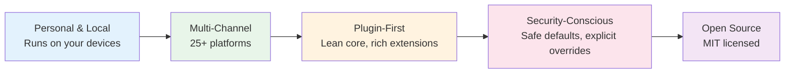

---

## 2. System Architecture

### 2.1 High-Level Architecture

```mermaid
graph TB
    subgraph UserLayer["User Interfaces"]
        direction LR
        CLI[CLI<br/>openclaw.mjs]
        TUI[TUI<br/>src/tui]
        WebUI[Web Dashboard<br/>ui/ (Vite + Lit)]
        NativeApps["Native Apps<br/>apps/macos, ios, android"]
    end

    subgraph Gateway["Gateway Layer"]
        direction TB
        GW[Gateway<br/>src/gateway]
        RT[Routing<br/>src/routing]
        SS[Sessions<br/>src/sessions]
        CR[Cron Scheduler<br/>src/cron]
    end

    subgraph Channels["Channel Adapters"]
        direction LR
        subgraph Core["Core Channels"]
            TG[Telegram]
            DC[Discord]
            SL[Slack]
            SG[Signal]
            IM[iMessage]
            WA[WhatsApp]
        end
        subgraph Extensions["Extension Channels"]
            MT[MS Teams]
            MX[Matrix]
            IRC[IRC]
            LN[LINE]
            FS[Feishu]
            GC[Google Chat]
            NS[Nostr]
            BB[BlueBubbles]
            MM[Mattermost]
            TW[Twitch]
            ZA[Zalo]
            TL[Tlon]
        end
    end

    subgraph Agent["Agent Core"]
        direction TB
        AG[Agents<br/>src/agents]
        ACP[ACP Adapter<br/>src/acp]
        SR[Subagents<br/>Subagent spawning]
        CE[Context Engine<br/>src/context-engine]
    end

    subgraph Backends["Provider Backends"]
        direction LR
        LLM[LLM Providers<br/>src/providers]
        MEM[Memory<br/>src/memory + extensions]
        TTS[TTS/STT<br/>src/tts]
        BRW[Browser Use<br/>src/browser]
        PROC[Process Mgmt<br/>src/process]
    end

    subgraph Storage["Storage"]
        direction LR
        DB[(SQLite<br/>Sessions/Spend)]
        FDB[(File-based<br/>Config/Skills)]
        LDB[(LanceDB<br/>Vector Memory)]
    end

    UserLayer --> Gateway
    Gateway --> Channels
    Gateway --> Agent
    Agent --> Backends
    Backends --> Storage

    style UserLayer fill:#e3f2fd
    style Gateway fill:#e8f5e9
    style Channels fill:#fff3e0
    style Agent fill:#fce4ec
    style Backends fill:#e0f2f1
    style Storage fill:#f3e5f5
```

### 2.2 Component Map

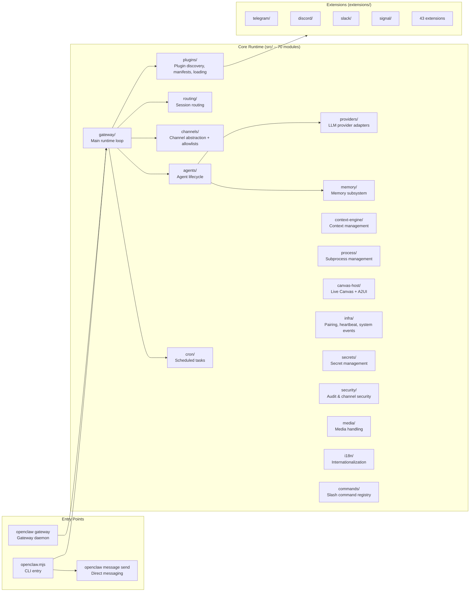

### 2.3 Monorepo Structure

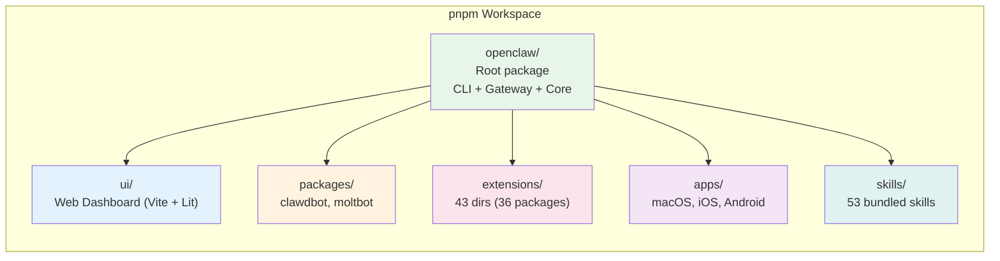

---

## 3. Gateway Layer

### 3.1 Gateway Architecture

The gateway is the central control plane. It manages channel connections, message routing, agent lifecycle, and scheduled tasks.

```mermaid
graph TB
    subgraph Gateway["Gateway (src/gateway/)"]
        direction TB

        subgraph Init["Initialization"]
            I1[Load config]
            I2[Discover plugins & extensions]
            I3[Start channel adapters]
            I4[Start cron scheduler]
        end

        subgraph Runtime["Message Pipeline"]
            R1[Receive message from channel]
            R2[Auth & allowlist check]
            R3[Command dispatch<br/>slash commands]
            R4[Route to session/agent]
            R5[Agent processes message]
            R6[Deliver response to channel]
        end

        subgraph Daemon["Daemon Management"]
            D1[launchd (macOS)]
            D2[systemd (Linux)]
            D3[PID file guard]
        end

        Init --> Runtime
        Init --> Daemon
    end

    style Gateway fill:#e8f5e9
    style Init fill:#e3f2fd
    style Runtime fill:#fff3e0
    style Daemon fill:#fce4ec
```

### 3.2 Gateway Startup Flow

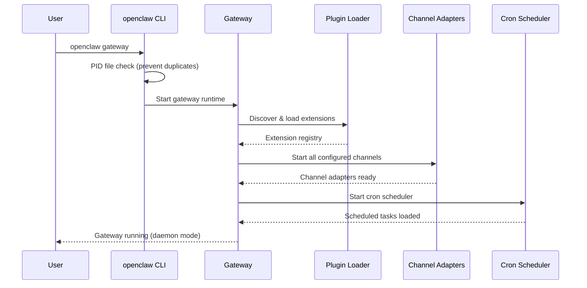

### 3.3 Gateway Control Plane

The gateway exposes a **WebSocket-based control plane** (`src/gateway/server.impl.js`) for real-time communication with clients, apps, and nodes:

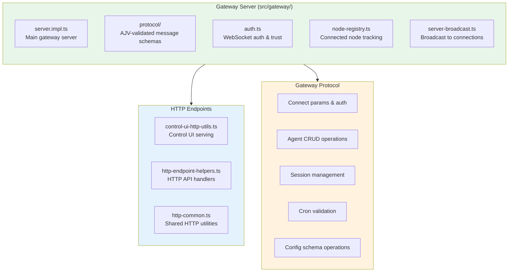

**Source:** `src/gateway/server.impl.ts` exports `startGatewayServer`. `src/gateway/protocol/index.ts` defines AJV-validated schemas for agents, sessions, cron, and config operations. Tests use `ws://127.0.0.1:{port}` WebSocket connections.

### 3.4 Plugin Discovery Flow

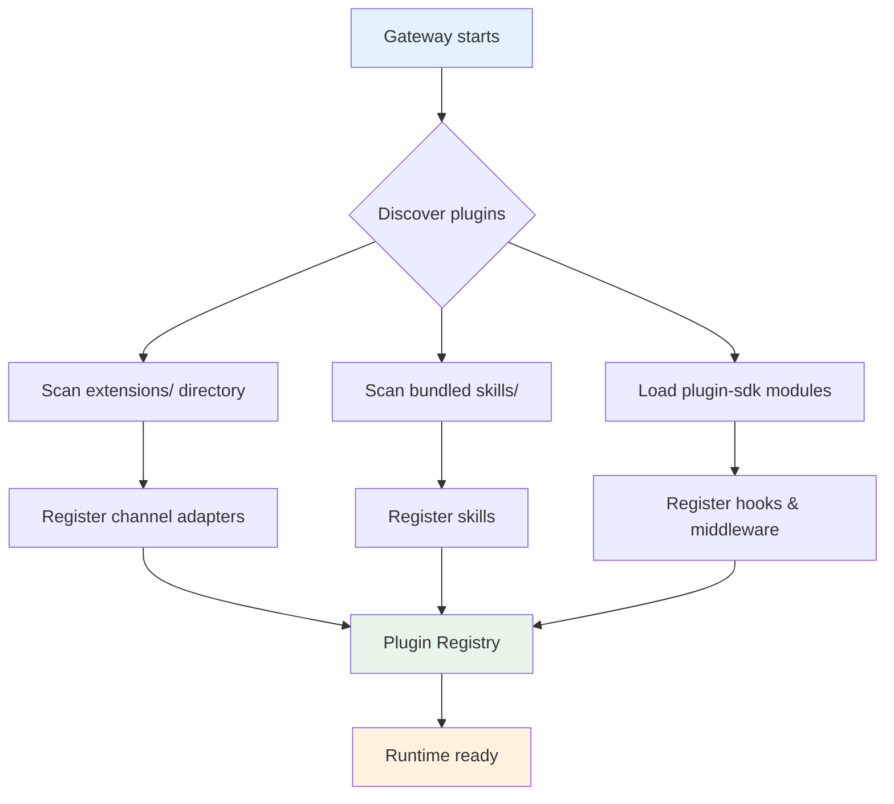

---

## 4. Channel & Extension System

### 4.1 Supported Channels

OpenClaw supports **25+ messaging platforms** split between core (built-in) and extension channels.

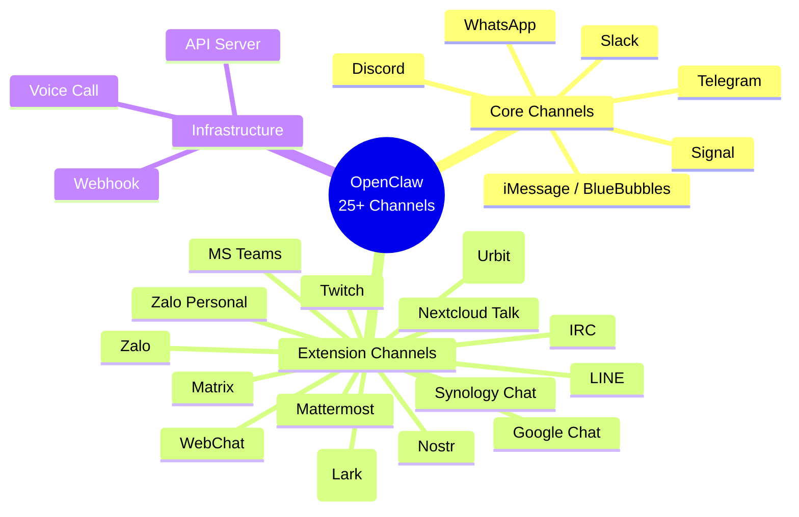

### 4.2 Plugin-Based Channel Architecture

Channels are not abstract adapter classes. Each channel is a **plugin package** that declares its entry point via the `openclaw.extensions` field in `package.json`. The plugin-sdk provides shared helpers (`plugin-sdk/telegram`, `plugin-sdk/discord`, etc.) but channels register themselves through the hook/plugin loader system, not via class inheritance.

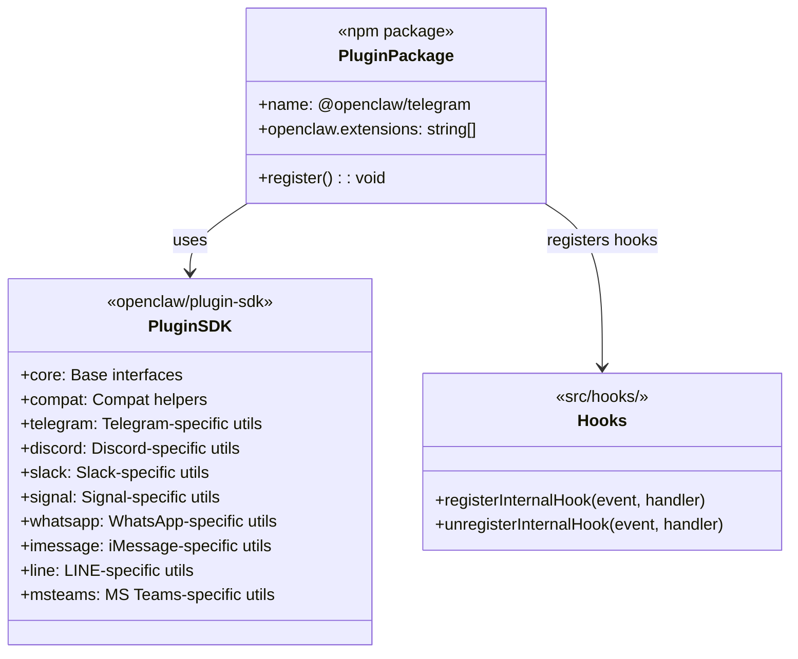

**Source:** `extensions/telegram/package.json` -- `"openclaw": {"extensions": ["./index.ts"]}`. Plugin SDK exports confirmed in `package.json` exports map.

### 4.3 Extension Package Structure

Each channel extension is a self-contained pnpm workspace package:

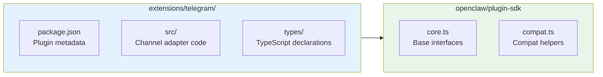

**Extension count:** 43 packages in `extensions/` (including `shared` utility package):

| Category | Extensions |
|----------|-----------|
| **Messaging** | telegram, discord, slack, signal, whatsapp, imessage, bluebubbles, irc, line, matrix, mattermost, msteams, googlechat, feishu, nextcloud-talk, nostr, synology-chat, tlon, twitch, zalo, zalouser |
| **Memory** | memory-core, memory-lancedb |
| **AI/LLM** | llm-task, ollama, sglang, vllm |
| **Voice** | talk-voice, voice-call |
| **Auth** | google-gemini-cli-auth, minimax-portal-auth, qwen-portal-auth |
| **Infrastructure** | acpx, copilot-proxy, device-pair, diagnostics-otel, diffs, lobster, open-prose, phone-control, thread-ownership |
| **Utilities** | shared, test-utils |

### 4.4 Message Flow: Channel to Agent

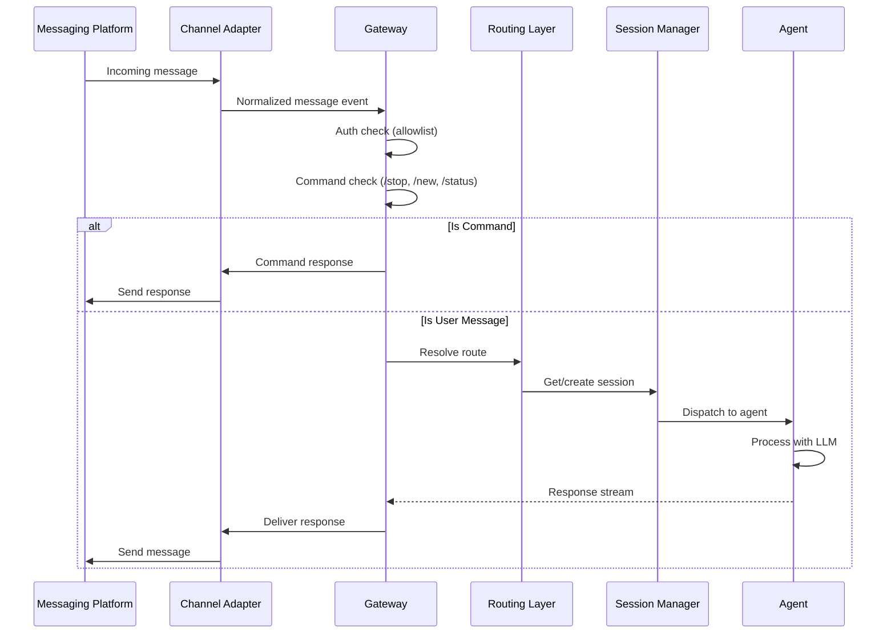

---

## 5. Agent Subsystem

### 5.1 Agent Architecture

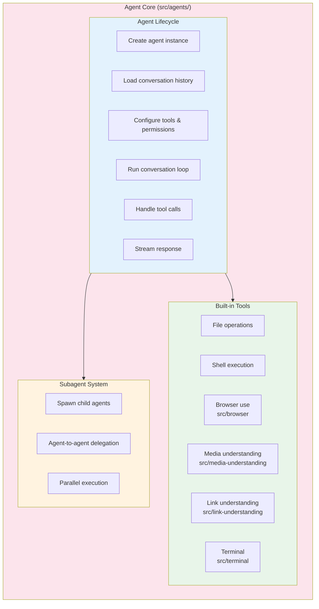

### 5.2 Agent Conversation Loop

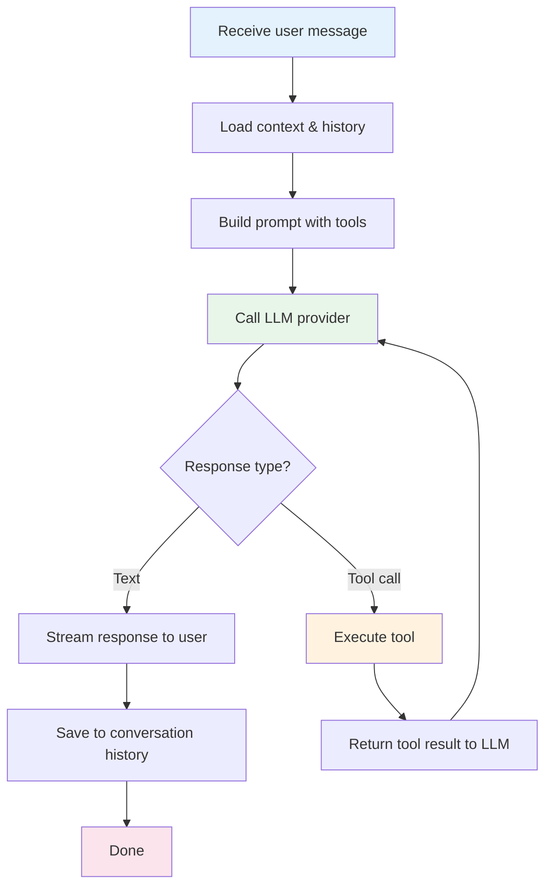

### 5.3 ACP (Agent Client Protocol)

OpenClaw implements ACP for IDE integration (VS Code, Zed, JetBrains):

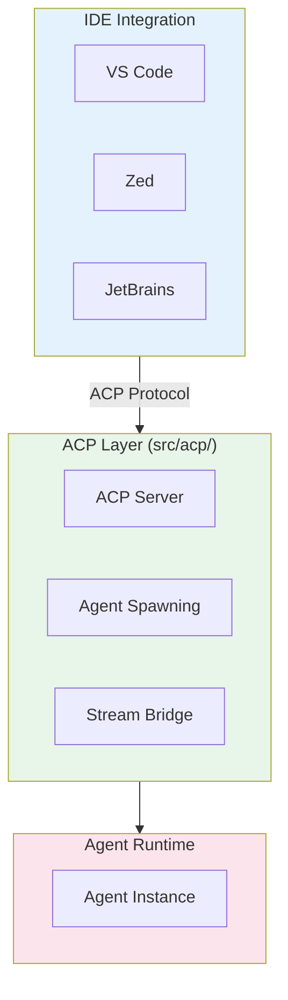

### 5.4 Media & Link Understanding

Two significant subsystems handle multi-modal content:

**Media Understanding** (`src/media-understanding/` -- 38 files) processes audio, video, images, and file attachments:

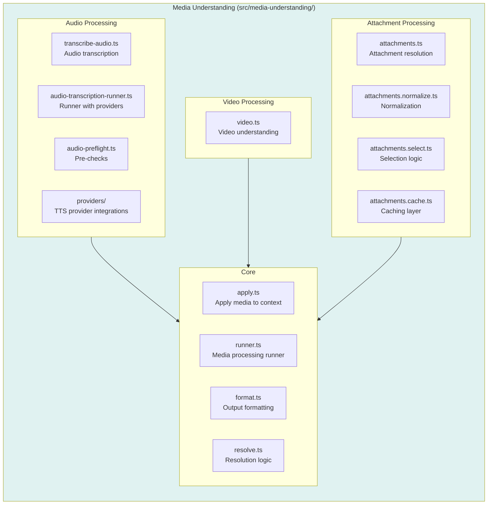

**Link Understanding** (`src/link-understanding/`) handles URL extraction and safety:

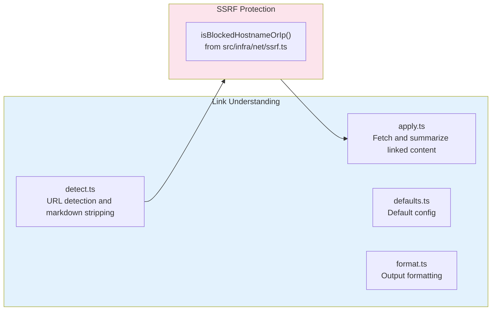

**Source:** `src/link-understanding/detect.ts` -- Strips markdown link syntax (`[text](url)`) to find bare URLs, limits by `DEFAULT_MAX_LINKS`. `src/media-understanding/apply.ts` -- Integrates media context into agent messages using `MsgContext` templating.

---

## 6. Provider & Model Layer

### 6.1 Provider Architecture

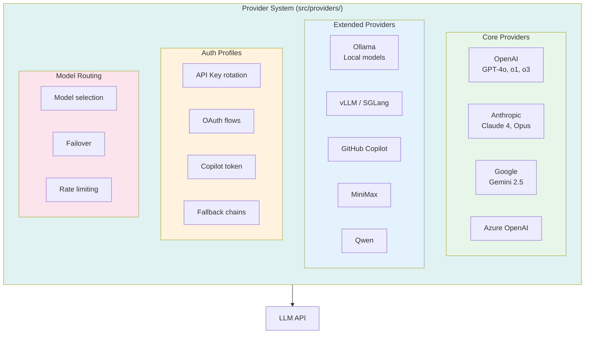

### 6.2 Model Failover Chain

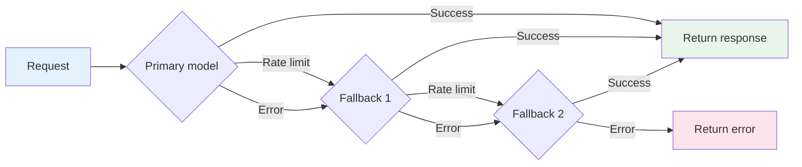

---

## 7. Plugin SDK & Extensions

### 7.1 Plugin SDK Architecture

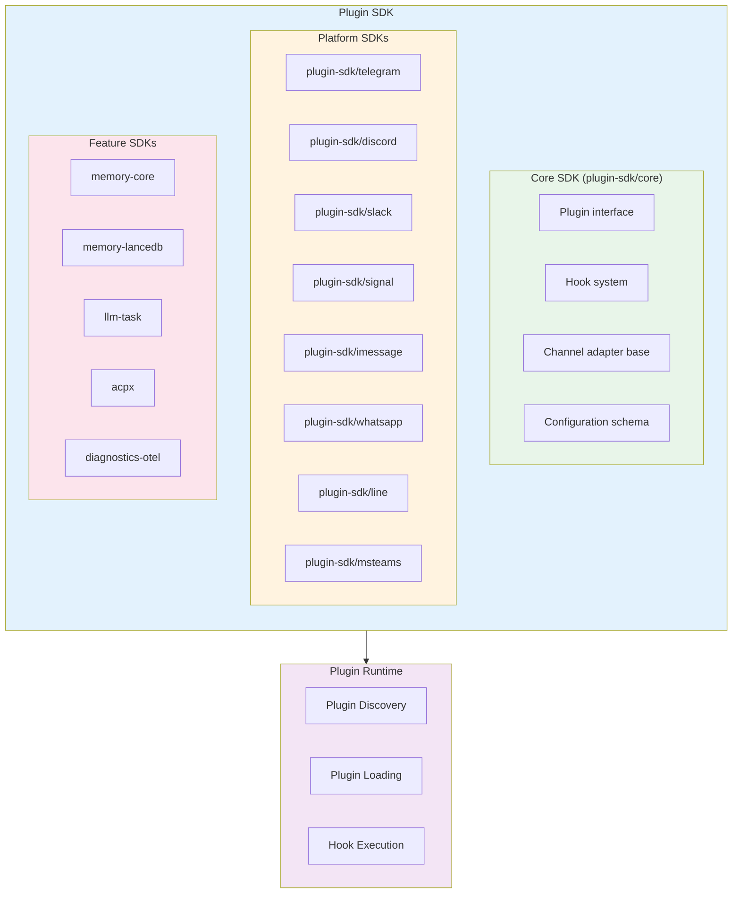

### 7.2 Hook System

OpenClaw uses an **event-driven internal hook system** (not lifecycle-phase hooks). Hooks register for typed events via `registerInternalHook(event, handler)` from `src/hooks/internal-hooks.ts`.

```mermaid
graph TB
    subgraph Events["Hook Event Types (src/hooks/internal-hooks.ts)"]
        direction TB

        subgraph AgentEvents["agent / bootstrap"]
            AE1["agent:bootstrap<br/>Workspace bootstrap context"]
        end

        subgraph GatewayEvents["gateway / startup"]
            GE1["gateway:startup<br/>Gateway config and deps"]
        end

        subgraph MessageEvents["message / received + sent"]
            ME1["message:received<br/>Incoming from channel"]
            ME2["message:sent<br/>Outgoing to channel"]
        end

        subgraph CommandEvents["command / action"]
            CE1["command:action<br/>Slash command dispatch"]
        end

        subgraph SessionEvents["session / action"]
            SE1["session:action<br/>Session lifecycle"]
        end
    end

    AgentEvents --> HookRegistry["registerInternalHook(event, handler)"]
    GatewayEvents --> HookRegistry
    MessageEvents --> HookRegistry
    CommandEvents --> HookRegistry
    SessionEvents --> HookRegistry

    style Events fill:#e3f2fd
    style HookRegistry fill:#e8f5e9
```

**Source:** `src/hooks/internal-hooks.ts:13` -- `InternalHookEventType = "command" | "session" | "agent" | "gateway" | "message"`. Message hooks include `received` and `sent` actions with rich context (channelId, conversationId, metadata). Agent hooks fire `bootstrap` with workspace context. Gateway hooks fire `startup` with config and deps.

Additional hook infrastructure:
- **Bundled hooks**: `src/hooks/bundled/` directory, resolved by `resolveBundledHooksDir()`
- **Hook config**: Per-hook runtime eligibility via `resolveHookConfig()` and `evaluateRuntimeEligibility()`
- **Frontmatter hooks**: Hooks can declare metadata via `parseFrontmatter()`
- **Fire-and-forget hooks**: Background hook execution via `fireAndForgetHook()`
- **Gmail hooks**: Specialized Gmail integration via `src/hooks/gmail.ts`

### 7.3 Plugin Manifest System

Each extension declares its capabilities via **two files**:

1. **`package.json`** -- `"openclaw": {"extensions": ["./index.ts"]}` declares the runtime entry point
2. **`openclaw.plugin.json`** -- Manifest declaring plugin ID, channel/provider bindings, config schema, and kind

41 of 43 extensions have `openclaw.plugin.json` manifests. The plugin loader (`src/plugins/loader.ts`) reads both files. The manifest registry (`src/plugins/manifest-registry.ts`) builds a normalized registry with fields: `id`, `name`, `description`, `version`, `kind`, `channels`, `providers`, `skills`, `configSchema`, `configUiHints`.

**PluginKind:** `PluginKind = "memory" | "context-engine"` (from `src/plugins/types.ts`). This controls which plugins can occupy the memory and context-engine plugin slots. Only plugins declaring a `kind` can register as a memory or context-engine provider.

**Source:** `extensions/telegram/openclaw.plugin.json`:
```json
{
  "id": "telegram",
  "channels": ["telegram"],
  "configSchema": {
    "type": "object",
    "additionalProperties": false,
    "properties": {}
  }
}
```

**Source:** `extensions/google-gemini-cli-auth/openclaw.plugin.json`:
```json
{
  "id": "google-gemini-cli-auth",
  "providers": ["google-gemini-cli"],
  "configSchema": { "type": "object", "additionalProperties": false, "properties": {} }
}
```

Plugin origin precedence: `config > workspace > explicit-install global > bundled > auto-discovered global` (from `src/plugins/manifest-registry.ts`).

### 7.4 Extension Lifecycle

```mermaid
stateDiagram-v2
    [*] --> Discovered: Plugin scanner finds package.json + openclaw.plugin.json
    Discovered --> Loaded: Import, validate manifest, resolve config schema
    Loaded --> Registered: Register hooks, channels, providers, skills
    Registered --> Active: Gateway starts
    Active --> Active: Handle messages
    Active --> Reloaded: Hot reload trigger
    Reloaded --> Active
    Active --> Unloaded: Gateway stops
    Unloaded --> [*]
```

---

## 8. TUI & User Interfaces

### 8.1 Interface Map

```mermaid
graph TB
    subgraph Interfaces["User Interfaces"]
        direction TB

        subgraph CLI["CLI (src/cli/)"]
            C1[openclaw onboard<br/>Setup wizard]
            C2[openclaw gateway<br/>Start/stop daemon]
            C3[openclaw message<br/>Send messages]
            C4[openclaw config<br/>Configuration]
        end

        subgraph TUI["TUI (src/tui/)"]
            T1[Terminal UI]
            T2[Rich text rendering]
            T3[Tool activity display]
        end

        subgraph Web["Web Dashboard (ui/)"]
            W1["Vite + Lit<br/>SPA frontend"]
            W2[Terminal emulator]
            W3[Session management]
        end

        subgraph Apps["Native Apps (apps/)"]
            A1[macOS<br/>SwiftUI (354 Swift files)]
            A2[iOS<br/>SwiftUI (108 Swift files)]
            A3[Android<br/>Kotlin (115 Kotlin files)]
            A4[Shared<br/>OpenClawKit]
        end
    end

    style CLI fill:#e3f2fd
    style TUI fill:#e8f5e9
    style Web fill:#fff3e0
    style Apps fill:#fce4ec
```

### 8.2 CLI Command Tree

```mermaid
graph LR
    ROOT[openclaw] --> ON[onboard<br/>Setup wizard]
    ROOT --> GW[gateway<br/>Daemon management]
    ROOT --> MSG[message<br/>Send/receive]
    ROOT --> CFG[config<br/>Configuration]
    ROOT --> PLG[plugins<br/>Plugin management]
    ROOT --> CR[cron<br/>Scheduled tasks]
    ROOT --> SK[skills<br/>Skill management]

    GW --> GW_START[start]
    GW --> GW_STOP[stop]
    GW --> GW_STATUS[status]
    GW --> GW_RESTART[restart]
```

### 8.3 TTS (Text-to-Speech) System

```mermaid
graph TB
    subgraph TTS["TTS System (src/tts/)"]
        direction TB
        T1[tts.ts<br/>Core TTS logic, config, auto mode]
        T2[tts-core.ts<br/>TTS provider abstraction]
        T3[prepare-text.ts<br/>Text normalization for speech]
        T4[Validation<br/>edge-tts-validation.test.ts]
    end

    subgraph Extensions["TTS Extensions"]
        E1[sherpa-onnx-tts<br/>Local on-device TTS]
        E2[openai-whisper<br/>Speech-to-text]
        E3[openai-whisper-api<br/>Whisper API integration]
    end

    subgraph Features["Voice Features"]
        F1[Voice Wake<br/>iOS wake word detection]
        F2[Talk Mode<br/>Push-to-talk voice]
        F3[Voice Call<br/>Phone call integration]
    end

    TTS --> Extensions
    TTS --> Features

    style TTS fill:#e0f2f1
    style Extensions fill:#e3f2fd
    style Features fill:#fff3e0
```

**Source:** `src/tts/tts.ts` -- exports TTS config with auto mode settings, text normalization via `prepare-text.ts`. Skill-level TTS via `skills/sherpa-onnx-tts/`.

### 8.4 Live Canvas & A2UI

OpenClaw includes a **Live Canvas** system (`src/canvas-host/`) that provides an agent-driven visual workspace. The Canvas uses A2UI (Agent-to-UI) protocol for real-time visual output.

```mermaid
graph TB
    subgraph Canvas["Canvas System (src/canvas-host/)"]
        direction TB
        C1[A2UI Protocol<br/>Agent-driven UI rendering]
        C2[Canvas Server<br/>canvas-host/server.ts]
        C3[File Resolver<br/>canvas-host/file-resolver.ts]
    end

    subgraph Clients["Canvas Clients"]
        CL1[macOS app<br/>Native canvas view]
        CL2[iOS app<br/>Canvas support]
        CL3[Android app<br/>Canvas support]
        CL4[Web Dashboard<br/>Browser canvas]
    end

    Agent[Agent Runtime] --> Canvas
    Canvas --> Clients

    style Canvas fill:#f3e5f5
    style Clients fill:#e3f2fd
```

**Source:** README -- "Live Canvas -- agent-driven visual workspace with A2UI". `src/canvas-host/` contains `a2ui.ts`, `a2ui/` directory, `server.ts`, `file-resolver.ts`.

---

## 9. Memory System

### 9.1 Memory Architecture

Memory in OpenClaw is a **plugin slot**: only one memory plugin can be active at a time (per VISION.md). The memory subsystem spans both `src/memory/` (core batch-embedding and HTTP-based memory) and extension packages (`memory-core`, `memory-lancedb`).

```mermaid
graph TB
    subgraph Memory["Memory Subsystem"]
        direction TB

        subgraph Core["src/memory/ (Core)"]
            MC1[Batch Embedding<br/>batch-gemini, batch-openai, batch-http]
            MC2[Backend Config<br/>backend-config.ts]
            MC3[Embedding Common<br/>batch-embedding-common.ts]
        end

        subgraph Extensions["Memory Extensions"]
            ME1[memory-core<br/>Base memory plugin interface]
            ME2[memory-lancedb<br/>LanceDB vector memory]
        end

        subgraph QMD["QMD (Query/Memory/Document)"]
            Q1[Direct QMD process]
            Q2[mcporter daemon<br/>MCP runtime for QMD]
        end
    end

    Core --> Extensions
    Extensions --> QMD

    style Memory fill:#f3e5f5
    style Core fill:#e8f5e9
    style Extensions fill:#e3f2fd
    style QMD fill:#fff3e0
```

**Source:** `src/memory/` contains `batch-gemini.ts`, `batch-openai.ts`, `batch-http.ts`, `batch-embedding-common.ts`, `backend-config.ts`. Config schema at `src/config/schema.help.ts` documents `memory.qmd.mcporter` -- routes QMD work through mcporter (MCP runtime) instead of spawning `qmd` per call. LanceDB extension at `extensions/memory-lancedb/`.

---

## 10. Routing & Session Management

### 10.1 Routing Architecture

```mermaid
graph TB
    subgraph Routing["Routing Layer (src/routing/)"]
        direction TB

        R1[resolve-route.ts<br/>Route resolution]
        R2[session-key.ts<br/>Session key generation]
        R3[account-lookup.ts<br/>Account resolution]
        R4[bindings.ts<br/>Route bindings]

        subgraph Session["Session Management"]
            S1[Session creation]
            S2[Session persistence]
            S3[Session recovery]
            S4[Multi-channel sessions]
        end
    end

    R1 --> R2
    R2 --> R3
    R3 --> R4
    R4 --> Session

    style Routing fill:#e3f2fd
    style Session fill:#e8f5e9
```

### 10.2 Session Flow

```mermaid
sequenceDiagram
    participant Msg as Incoming Message
    participant Route as Route Resolver
    participant Key as Session Key
    participant Store as Session Store
    participant Agent as Agent

    Msg->>Route: Message from platform + user
    Route->>Key: Generate session key<br/>(platform + user + channel)
    Key->>Store: Look up existing session

    alt Session exists
        Store-->>Agent: Resume session with history
    else New session
        Store->>Store: Create new session
        Store-->>Agent: Fresh session
    end

    Agent->>Agent: Process message
    Agent->>Store: Update session state
```

---

## 11. Security & Pairing

### 11.1 Security Model

```mermaid
graph TB
    subgraph Security["Security Model"]
        direction TB

        subgraph Auth["Authentication"]
            A1[Device pairing<br/>Crypto-token auth]
            A2[Allowlists<br/>Per-channel user lists]
            A3[Auth profiles<br/>API key management]
        end

        subgraph Control["Access Control"]
            AC1[Command gating<br/>Per-user permissions]
            AC2[Tool permissions<br/>Agent capability scope]
            AC3[Sandbox<br/>Docker/Podman execution]
        end

        subgraph Defaults["Safe Defaults"]
            SD1[Deny-by-default<br/>Unknown users blocked]
            SD2[Explicit overrides<br/>Power features opt-in]
            SD3[Code review<br/>CODEOWNERS enforcement]
        end
    end

    Auth --> Control
    Control --> Defaults

    style Security fill:#fce4ec
    style Auth fill:#e3f2fd
    style Control fill:#e8f5e9
    style Defaults fill:#fff3e0
```

### 11.2 Pairing Flow

The pairing system uses a **crypto-token-based device authentication protocol** (not simple pair codes). Implementation spans `src/infra/device-pairing.ts`, `src/infra/pairing-token.ts`, `src/infra/pairing-files.ts`, `src/infra/pairing-pending.ts`, and `src/pairing/`.

```mermaid
sequenceDiagram
    participant Device as New Device
    participant GW as Gateway
    participant Pair as Pairing System (src/infra/)
    participant Store as Pairing Files

    Device->>GW: Pairing request (deviceId, publicKey, displayName, platform, deviceFamily, role, scopes)
    GW->>Pair: Create pending request (requestId = randomUUID)
    Pair->>Store: Write pending request to file
    Pair-->>GW: Pending request created
    GW-->>Device: "Pairing request received. Approve on your paired device."

    Note over GW: Owner reviews pending request

    GW->>Pair: approve(requestId)
    Pair->>Pair: generatePairingToken(deviceId, publicKey, scopes)
    Pair->>Store: Write approved device with token
    Pair-->>GW: Device authorized with role-based scopes

    Device->>GW: Subsequent request with token
    GW->>Pair: verifyPairingToken(token, deviceId)
    Pair-->>GW: Valid - device authenticated
    GW->>GW: Apply role-based scopes for this session
```

**Source:** `src/infra/device-pairing.ts` -- `DevicePairingPendingRequest` includes `deviceId`, `publicKey`, `displayName`, `platform`, `deviceFamily`, `clientId`, `clientMode`, `role`, `roles[]`, `scopes[]`, `remoteIp`, `silent`, `isRepair`. Token generation via `src/infra/pairing-token.ts`. Pending requests pruned by `pruneExpiredPending()`.

### 11.3 Security Subsystem

```mermaid
graph TB
    subgraph Security["Security (src/security/ + src/secrets/ + src/pairing/)"]
        direction TB

        subgraph Audit["Security Audit"]
            SA1[audit-channel.ts<br/>Channel security audit]
            SA2[audit-extra.ts<br/>Extended audit checks]
        end

        subgraph Secrets["Secret Management"]
            SE1[apply.ts<br/>Apply secrets to config]
            SE2[audit.ts<br/>Secret audit]
            SE3[auth-profiles-scan.ts<br/>Scan auth profiles]
        end

        subgraph PairingUI["Pairing UI"]
            PU1[pairing-challenge.ts<br/>Challenge display]
            PU2[pairing-messages.ts<br/>User-facing messages]
            PU3[pairing-labels.ts<br/>Label formatting]
        end
    end

    style Security fill:#fce4ec
    style Audit fill:#e3f2fd
    style Secrets fill:#e8f5e9
    style PairingUI fill:#fff3e0
```

---

## 12. Skills & ClawHub Ecosystem

OpenClaw ships **53 bundled skills** in `skills/`, covering a wide range of integrations:

```mermaid
graph TB
    subgraph Skills["Skills (skills/) -- 53 bundled"]
        direction LR

        subgraph Productivity["Productivity"]
            S1[apple-notes]
            S2[apple-reminders]
            S3[bear-notes]
            S4[1password]
        end

        subgraph Media["Media and Social"]
            S5[blogwatcher]
            S6[camsnap]
            S7[canvas]
        end

        subgraph DevTools["Developer Tools"]
            S8[clawhub]
            S9[blucli]
        end

        subgraph More["44 more..."]
            SX[...]
        end
    end

    subgraph ClawHub["ClawHub (clawhub.ai)"]
        CH1[Community skill marketplace]
        CH2[Skill publishing and discovery]
    end

    Skills --> ClawHub

    style Skills fill:#e8f5e9
    style ClawHub fill:#fff3e0
    style Productivity fill:#e3f2fd
    style Media fill:#fce4ec
    style DevTools fill:#f3e5f5
```

Per VISION.md: new skills should be published to ClawHub first, not added to core by default. Core skill additions require a strong product or security reason.

---

## 13. MCP Support (mcporter)

OpenClaw supports MCP (Model Context Protocol) through **mcporter** (`github.com/steipete/mcporter`), which keeps MCP integration flexible and decoupled from core runtime:

```mermaid
graph LR
    subgraph MCP["MCP Integration"]
        direction TB
        MC1[mcporter<br/>MCP runtime daemon]
        MC2[Add/change MCP servers<br/>without restart]
        MC3[QMD via mcporter<br/>memory.qmd.mcporter]
    end

    Agent[Agent Runtime] --> MC1
    MC1 --> MC2
    MC1 --> MC3

    style MCP fill:#e0f2f1
```

**Source:** `src/config/schema.help.ts` -- `memory.qmd.mcporter.enabled` routes QMD work through mcporter daemon, reducing cold-start overhead for larger models.

---

## 14. Cron & Automation

### 14.1 Cron System

```mermaid
graph TB
    subgraph Cron["Cron System (src/cron/)"]
        direction TB

        C1[Cron Scheduler]
        C2[Scheduled Tasks]
        C3[Recurrence Engine]

        subgraph Tasks["Task Types"]
            T1[Periodic messages]
            T2[Health checks]
            T3[Memory maintenance]
            T4[Custom user tasks]
        end
    end

    C1 --> C2
    C2 --> C3
    C3 --> Tasks

    style Cron fill:#e8f5e9
    style Tasks fill:#e3f2fd
```

### 14.2 Auto-Reply System

The auto-reply system (`src/auto-reply/`) is the core message processing pipeline with 66 files. It handles inbound message dispatch, command detection, response generation, and delivery.

```mermaid
graph TB
    subgraph AutoReply["Auto-Reply (src/auto-reply/)"]
        direction TB

        subgraph Inbound["Inbound Processing"]
            AR1[dispatch.ts<br/>Inbound dispatch entry]
            AR2[command-detection.ts<br/>Slash command detection]
            AR3[command-auth.ts<br/>Command authorization]
            AR4[envelope.ts<br/>Message envelope]
            AR5[inbound-debounce.ts<br/>Deduplication]
        end

        subgraph Processing["Response Generation"]
            AR6[reply.ts<br/>Main reply logic]
            AR7[reply/ subdir<br/>Triggers, dispatchers, directives]
            AR8[templating.ts<br/>Message templating]
            AR9[thinking.ts<br/>Thinking/reasoning]
            AR10[model-runtime.ts<br/>Model invocation]
        end

        subgraph Delivery["Outbound Delivery"]
            AR11[chunk.ts<br/>Platform-sized text chunking]
            AR12[send-policy.ts<br/>Delivery policies]
            AR13[status.ts<br/>Delivery status tracking]
            AR14[media-note.ts<br/>Media attachments]
        end

        subgraph Features["Special Features"]
            AR15[heartbeat.ts<br/>Heartbeat/reconnection]
            AR16[group-activation.ts<br/>Group chat activation]
            AR17[skill-commands.ts<br/>Skill execution]
            AR18[tokens.ts<br/>Token counting]
            AR19[fallback-state.ts<br/>Fallback handling]
        end
    end

    Inbound --> Processing
    Processing --> Delivery

    style AutoReply fill:#fff3e0
    style Inbound fill:#e3f2fd
    style Processing fill:#e8f5e9
    style Delivery fill:#fce4ec
    style Features fill:#f3e5f5
```

**Source:** `src/auto-reply/chunk.ts` -- Text chunking with platform-specific limits (default 4000 chars), fence-aware splitting to avoid breaking code blocks. `src/auto-reply/dispatch.ts` -- Main inbound dispatch with `dispatchReplyFromConfig()`. `src/auto-reply/commands-registry.ts` -- Slash command registration.

---

## 15. Native Apps

### 15.1 App Architecture

All native apps are **SwiftUI/Kotlin** apps that embed or communicate with the OpenClaw gateway.

```mermaid
graph TB
    subgraph Apps["Native Apps (apps/)"]
        direction TB

        subgraph Shared["Shared (apps/shared/OpenClawKit/)"]
            SH1[Device auth payload<br/>DeviceAuthPayload.swift]
            SH2[Shared OpenClawKit library]
        end

        subgraph macOS["macOS (apps/macos/ -- 354 Swift files)"]
            M1[SwiftUI app<br/>Sources/OpenClaw/]
            M2[Menu bar<br/>MenuBar.swift, MenuContentView.swift]
            M3[Canvas manager<br/>CanvasManager.swift]
            M4[Cost usage<br/>CostUsageMenuView.swift]
            M5[Session menu<br/>SessionMenuLabelView.swift]
            M6[Cron settings<br/>CronSettings.swift]
        end

        subgraph iOS["iOS (apps/ios/ -- 108 Swift files)"]
            I1[SwiftUI app<br/>Sources/OpenClawApp.swift]
            I2[Push notifications<br/>UNNotification in OpenClawApp.swift]
            I3[Share extension<br/>ShareExtension/ShareViewController.swift]
            I4[Watch app<br/>WatchExtension/ (5 files)]
            I5[Voice wake<br/>VoiceWakeToast.swift]
        end

        subgraph Android["Android (apps/android/ -- 115 Kotlin files)"]
            A1[Kotlin app<br/>MainActivity.kt]
            A2[Node.js runtime<br/>NodeRuntime.kt, NodeForegroundService.kt]
            A3[Camera HUD<br/>CameraHudState.kt]
            A4[Device auth<br/>DeviceAuthPayload.kt]
        end

        Shared --> macOS
        Shared --> iOS
        Shared --> Android
    end

    Apps --> GW[Gateway API]

    style Apps fill:#f3e5f5
    style Shared fill:#e3f2fd
    style macOS fill:#e8f5e9
    style iOS fill:#fff3e0
    style Android fill:#fce4ec
```

**Source:** Code-verified file counts -- macOS: 354 Swift files, iOS: 108 Swift files, Android: 115 Kotlin files. macOS has explicit `MenuBar.swift` and `MenuContentView.swift`. iOS has `UNNotification` references and a WatchOS companion app (`WatchExtension/`). Android embeds a Node.js runtime (`NodeRuntime.kt`, `NodeForegroundService.kt`) for local gateway execution.

---

## 16. Codebase Analysis

### 16.1 Language Distribution

```mermaid
pie title File Distribution by Language (7,269 files)
    "TypeScript" : 85.2
    "Markdown" : 11.2
    "JSON" : 1.4
    "Bash" : 0.9
    "Python" : 0.4
    "JavaScript" : 0.2
    "Other" : 0.7
```

### 16.2 Codebase Statistics

| Metric | Value |
|--------|-------|
| **Total Files** | 7,269 |
| **Code Chunks** | 78,260 |
| **Avg Chunk Size** | ~1000 chars |
| **Extracted Symbols** | 452* |
| **Classes** | 247 |
| **Interfaces** | 181 |
| **Functions** | 24 |
| **Import Edges** | 18,798 |
| **ES Module Imports** | 18,553 |
| **DB Size (with embeddings)** | 808 MB |
| **Bundled Skills** | 53 |
| **Extension Packages** | 43 |

> **\* Symbol count caveat:** The 452 symbols are extracted via regex-based metadata extraction that matches `class`, `interface`, `function`, and `export function` patterns. This significantly undercounts the actual code surface: TypeScript arrow functions (`const foo = () => {}`), methods inside classes, type aliases, and re-exports are not captured. The true symbol count is likely 5-10x higher. The number is still useful for relative comparison across projects.

### 16.3 Symbol Distribution

```mermaid
pie title Code Symbols (452 total)
    "Classes" : 247
    "Interfaces" : 181
    "Functions" : 24
```

### 16.4 Architecture Characteristics

| Characteristic | Evidence |
|----------------|----------|
| **Class/Interface Heavy** | 247 classes, 181 interfaces vs 24 functions (undercount, see caveat) |
| **Declarative TypeScript** | Interface-driven design with class implementations |
| **Deep Module Graph** | 18,798 import edges across 7,269 files |
| **Extension-Dominated** | 43 extension dirs (36 npm packages) in `extensions/` |
| **Plugin-First** | Channels, memory, auth all as extension packages |
| **Monorepo Scale** | Root + ui/ + packages/ + extensions/ + apps/ + skills/ |

### 16.5 Top Directories by File Count

```mermaid
graph LR
    subgraph Top["Largest Directories"]
        direction TB
        D1["src/<br/>Core source (40+ modules)"]
        D2["extensions/<br/>43 packages"]
        D3["docs/<br/>Documentation"]
        D4["apps/<br/>Native apps"]
        D5["skills/<br/>53 bundled skills"]
        D6["ui/<br/>Web dashboard (Vite + Lit)"]
    end

    style D1 fill:#e8f5e9
    style D2 fill:#e3f2fd
    style D3 fill:#fff3e0
    style D4 fill:#fce4ec
    style D5 fill:#f3e5f5
    style D6 fill:#e0f2f1
```

---

## 17. Data Flow Diagrams

### 17.1 End-to-End Message Flow

```mermaid
flowchart TB
    subgraph Input["Message Input"]
        M1[WhatsApp]
        M2[Telegram]
        M3[Slack]
        M4[Discord]
        M5["25+ more..."]
    end

    subgraph Processing["Gateway Processing"]
        P1[Channel Adapter]
        P2[Auth and Allowlist]
        P3[Command Parser]
        P4[Route Resolver]
        P5[Session Manager]
    end

    subgraph Agent["Agent Pipeline"]
        A1[Context Builder]
        A2[LLM Provider]
        A3[Tool Executor]
        A4[Response Streamer]
    end

    subgraph Output["Response Delivery"]
        O1[Format for platform]
        O2[Media handling]
        O3[Send via adapter]
    end

    Input --> Processing
    Processing --> Agent
    Agent --> Output
    Output --> Input

    style Input fill:#e3f2fd
    style Processing fill:#e8f5e9
    style Agent fill:#fff3e0
    style Output fill:#fce4ec
```

### 17.2 Plugin Loading Pipeline

```mermaid
flowchart LR
    subgraph Discovery["Discovery Phase"]
        D1[Scan extensions/]
        D2[Read package.json]
        D3[Validate plugin-sdk entry]
    end

    subgraph Loading["Loading Phase"]
        L1[Import plugin module]
        L2[Call plugin.register()]
        L3[Collect hooks]
        L4[Register channel adapters]
    end

    subgraph Runtime["Runtime Phase"]
        R1[Hook execution order]
        R2[Channel adapter lifecycle]
        R3[Hot reload support]
    end

    Discovery --> Loading
    Loading --> Runtime
```

### 17.3 Deployment Architecture

OpenClaw uses a **multi-stage Docker build** with two runtime variants (bookworm and bookworm-slim). It supports both Docker and Podman container runtimes, and can optionally build with specific extensions at image build time.

```mermaid
graph TB
    subgraph Local["Local Deployment"]
        L1[macOS<br/>launchd daemon]
        L2[Linux<br/>systemd daemon]
        L3["Docker / Podman<br/>Multi-stage build, 2 variants"]
        L4[Nix<br/>Declarative]
    end

    subgraph Cloud["Cloud Deployment"]
        C1[Fly.io<br/>fly.toml]
        C2[Render<br/>render.yaml]
    end

    subgraph Docker["Docker Build Options"]
        DB1["Default: node:24-bookworm"]
        DB2["Slim: node:24-bookworm-slim"]
        DB3["Extension selection<br/>OPENCLAW_EXTENSIONS build arg"]
        DB4["Sandbox variants<br/>Dockerfile.sandbox, Dockerfile.sandbox-browser"]
    end

    subgraph Distribution["Distribution"]
        DI1[npm<br/>openclaw@latest]
        DI2[Docker Hub]
        DI3[GitHub Releases]
        DI4["Install scripts<br/>openclaw.ai/install.sh"]
    end

    Distribution --> Local
    Distribution --> Cloud
    Docker --> Local

    style Local fill:#e8f5e9
    style Cloud fill:#e3f2fd
    style Distribution fill:#fff3e0
    style Docker fill:#e0f2f1
```

**Source:** `Dockerfile` -- multi-stage build with `ARG OPENCLAW_EXTENSIONS=""` for build-time extension selection, `ARG OPENCLAW_VARIANT=default` for slim variant. Sandbox Dockerfiles (`Dockerfile.sandbox`, `Dockerfile.sandbox-browser`) for Docker-based agent execution isolation.

---

## Summary

OpenClaw is a **TypeScript-native, plugin-first personal AI assistant** with the following architectural hallmarks:

1. **Monorepo at scale** -- 7,269 files, 85% TypeScript, 43 extension dirs (36 npm packages), 53 bundled skills, 70 src modules
2. **Channel-agnostic gateway** -- 25+ messaging platforms via plugin packages with `openclaw.plugin.json` manifests
3. **Plugin SDK** -- Formal SDK with per-platform exports (`openclaw/plugin-sdk/telegram`, etc.), dual-file plugin registration
4. **Extension-dominated architecture** -- Channels, memory backends, auth flows, and voice all live in `extensions/`
5. **Event-driven hook system** -- Typed internal hooks (`agent`, `gateway`, `message`, `command`, `session`) with rich context
6. **Multi-modal agent** -- Media understanding (audio/video/attachments), link understanding (with SSRF protection), browser use, terminal, live Canvas with A2UI
7. **Multi-surface UX** -- CLI, TUI, Web Dashboard (Vite + Lit), native macOS (354 Swift files), iOS (108 Swift + Watch), Android (115 Kotlin)
8. **Crypto-token security** -- Device pairing with public key exchange, role-based scopes, per-channel allowlists, Docker/Podman sandbox execution
9. **Deep dependency graph** -- 18,798 import edges reflecting tight module integration within the core
10. **Skills ecosystem** -- 53 bundled skills + ClawHub marketplace for community skills
11. **MCP support** -- mcporter integration for MCP runtime, decoupled from core
12. **Context engine** -- Dedicated `src/context-engine/` module for context management, with PluginKind slot system
13. **Process management** -- Dedicated `src/process/` module for subprocess lifecycle (child-process-bridge, command-queue, kill-tree, lanes)
14. **Rich auto-reply pipeline** -- 66-file `src/auto-reply/` with dispatch, command-auth, group-activation, heartbeat, inbound-debounce, templating, and fence-aware text chunking

The project is actively maintained by 20+ contributors under a benevolent dictator model (Peter Steinberger), with a focus on security, stability, and expanding the channel ecosystem.

---

_"OpenClaw is not just an AI assistant. It is a personal AI operating system that speaks every language of every platform you use."_
