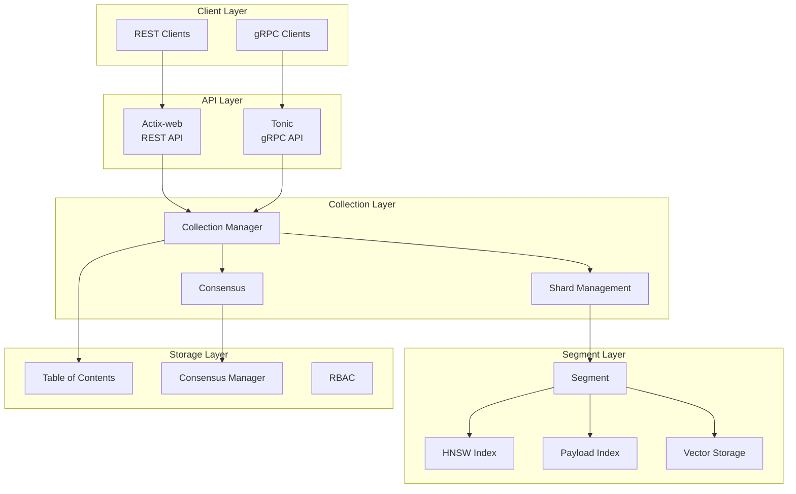
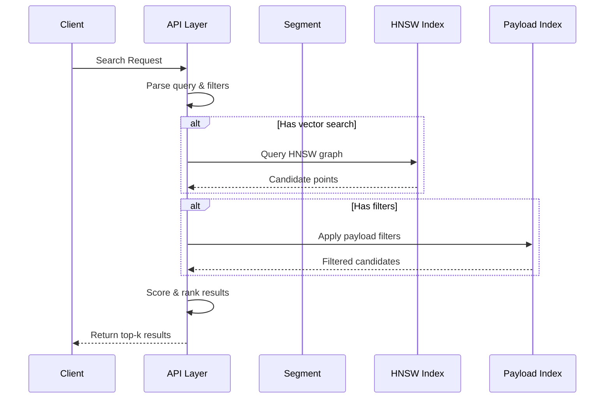

# Qdrant Research Report

**Project**: Qdrant - Vector Similarity Search Engine
**Location**: https://github.com/qdrant/qdrant
**Date**: March 2026

---

## Executive Summary

Qdrant is a production-grade **vector similarity search engine** written in Rust. It serves as a vector database that stores, searches, and manages points—vectors with associated payloads—enabling neural network and semantic-based matching for AI applications.

### Key Characteristics

| Attribute       | Value                    |
| --------------- | ------------------------ |
| **Language**    | Rust (v1.92+)            |
| **License**     | Apache 2.0               |
| **Version**     | 1.17.0                   |
| **Primary Use** | Vector similarity search |

### Primary Use Cases

- Semantic text search
- Similar image search
- Recommendation systems
- Chatbot memory/retrieval
- Anomaly detection
- Hybrid search (dense + sparse vectors)

---

## 1. Architecture Overview

Qdrant employs a **layered architecture** that separates concerns across API handling, collection management, core storage, and distributed coordination.



### Workspace Modules

| Module           | Path               | Purpose                                |
| ---------------- | ------------------ | -------------------------------------- |
| **segment**      | `lib/segment`      | Core data storage, indexing, retrieval |
| **collection**   | `lib/collection`   | Collection management, operations      |
| **storage**      | `lib/storage`      | High-level storage coordination        |
| **shard**        | `lib/shard`        | Sharding and replication               |
| **api**          | `lib/api`          | REST and gRPC API definitions          |
| **sparse**       | `lib/sparse`       | Sparse vector support (BM25-like)      |
| **quantization** | `lib/quantization` | Vector quantization (PQ, SQ, BQ)       |
| **consensus**    | `src/consensus.rs` | Raft-based distributed consensus       |

---

## 2. Core Data Model

### 2.1 Point Structure

A **point** is the fundamental data unit in Qdrant, consisting of:

```rust
pub struct ScoredPoint {
    pub id: PointIdType,           // Unique identifier
    pub version: SeqNumberType,    // Version for MVCC
    pub score: ScoreType,         // Similarity score
    pub payload: Option<Payload>, // JSON metadata
    pub vector: Option<VectorStructInternal>, // Vector data
    pub shard_key: Option<ShardKey>,           // Shard routing
    pub order_value: Option<OrderValue>,        // Ordering
}
```

### 2.2 Vector Types

| Type            | Description                |
| --------------- | -------------------------- |
| **Dense**       | Standard float vectors     |
| **Multi-dense** | Multiple vectors per point |
| **Quantized**   | Compressed representations |
| **Sparse**      | BM25-style sparse vectors  |

---

## 3. Key Features

### 3.1 HNSW Vector Indexing

**Semantic Purpose**: HNSW (Hierarchical Navigable Small World) provides fast approximate nearest neighbor search with configurable precision/performance tradeoffs.

**Implementation** (`lib/segment/src/index/hnsw_index/hnsw.rs`):

```rust
pub fn search(
    &self,
    top: usize,                    // Number of results
    ef: usize,                     // Search width
    algorithm: SearchAlgorithm,    // HNSW or Acorn
    mut points_scorer: FilteredScorer,
    custom_entry_points: Option<&[PointOffsetType]>,
    is_stopped: &AtomicBool,
) -> CancellableResult<Vec<ScoredPointOffset>>
```

**Configuration Parameters**:

- `m`: Number of connections per node
- `ef_construction`: Build-time search width
- `ef`: Query-time search width

**Why It Works**:

- Builds a multi-layer graph structure
- Higher layers contain "shortcuts" for fast traversal
- Greedy search with backtracking achieves high recall
- Supports both HNSW and Acorn search algorithms
- GPU acceleration available

### 3.2 Payload Filtering

**Semantic Purpose**: Enables rich query refinement using metadata attributes beyond vector similarity.

**Field Index Types** (`lib/segment/src/index/field_index/`):

| Index Type        | Purpose            | Query Examples                    |
| ----------------- | ------------------ | --------------------------------- |
| `bool_index`      | Boolean values     | `is_active: true`                 |
| `map_index`       | Keywords/IDs       | `category: "electronics"`         |
| `numeric_index`   | Numeric ranges     | `price: [10, 100]`                |
| `geo_index`       | Geospatial         | `location: {within: polygon}`     |
| `full_text_index` | Text search        | `description: "machine learning"` |
| `facet_index`     | Faceted navigation | `color: ["red", "blue"]`          |
| `null_index`      | NULL handling      | `deleted_at: null`                |

**Filter Combinations**:

- `must`: All conditions must match (AND)
- `must_not`: None can match (NOT)
- `should`: At least one should match (OR)

**Implementation Pattern**:

```rust
// Filter to index conversion
pub fn condition_to_index_query(&self, condition: &FieldCondition) -> Option<Box<dyn IndexIterator>>
```

### 3.3 Vector Quantization

**Semantic Purpose**: Reduces memory footprint by compressing vectors while preserving similarity search capability. Can achieve up to 97% RAM reduction.

**Types** (`lib/quantization/src/`):

#### Scalar Quantization (SQ)

Converts float32 to uint8 by dividing by a scale factor.

```rust
// lib/quantization/src/encoded_vectors_u8.rs
pub struct EncodedVectorsU8 {
    data: Vec<u8>,
    dim: usize,
}
```

#### Product Quantization (PQ)

Splits vectors into sub-vectors, clusters each separately, stores centroid indices.

```rust
// lib/quantization/src/encoded_vectors_pq.rs
pub struct EncodedVectorsPQ {
    data: Vec<u8>,
    dim: usize,
    sub_dim: usize,
    centers: Vec<Vec<f32>>,
}
```

#### Binary Quantization (BQ)

Represents vectors as binary strings (0/1).

```rust
// lib/quantization/src/encoded_vectors_binary.rs
pub struct EncodedVectorsBinary {
    data: Vec<u8>,
    dim: usize,
}
```

**Search with Quantization**:

```rust
pub fn similarity(
    &self,
    query: &[f32],
    storage: &EncodedVectorsSlice,
    top: usize,
) -> Vec<(VecOffsetType, ScoreType)>
```

### 3.4 Sparse Vectors (Hybrid Search)

**Semantic Purpose**: Enables keyword-based matching alongside dense vector similarity, supporting hybrid search scenarios.

**Implementation** (`lib/sparse/`):

- BM25-like text scoring
- Inverted index for term lookup
- Combines with dense vectors for relevance ranking

### 3.5 Distributed Deployment

**Architecture Components** (`lib/shard/` and `lib/collection/src/shards/`):

| Shard Type      | Purpose                      |
| --------------- | ---------------------------- |
| **LocalShard**  | Single-node storage          |
| **RemoteShard** | Distributed peer storage     |
| **ProxyShard**  | Delegation patterns          |
| **ReplicaSet**  | Multiple replicas management |

**Consensus Algorithm** (`src/consensus.rs`):

- Uses **Raft consensus** for distributed coordination
- Handles:
  - Collection creation/deletion
  - Shard transfers
  - Replica state management
  - Snapshot coordination

**Consensus Operations**:

```rust
pub enum ConsensusOperations {
    CollectionMeta(Box<CollectionMetaOperations>),
    AddPeer { peer_id: PeerId, uri: String },
    RemovePeer(PeerId),
    UpdatePeerMetadata { peer_id: PeerId, metadata: PeerMetadata },
    UpdateClusterMetadata { key: String, value: serde_json::Value },
    RequestSnapshot,
    ReportSnapshot { peer_id: PeerId, status: SnapshotStatus },
}
```

### 3.6 Write-Ahead Logging (WAL)

- Custom WAL implementation ensures durability
- Provides crash recovery capability
- Used in both collection and consensus layers

---

## 4. Storage Layer

### 4.1 Segment Structure

**File**: `lib/segment/src/segment/mod.rs`

```rust
pub struct Segment {
    pub uuid: Uuid,
    pub version: Option<SeqNumberType>,
    pub segment_path: PathBuf,
    pub version_tracker: VersionTracker,
    pub id_tracker: Arc<AtomicRefCell<IdTrackerSS>>,
    pub vector_data: HashMap<VectorNameBuf, VectorData>,
    pub payload_index: Arc<AtomicRefCell<StructPayloadIndex>>,
    pub payload_storage: Arc<AtomicRefCell<PayloadStorageEnum>>,
    pub segment_type: SegmentType,
    pub segment_config: SegmentConfig,
}
```

### 4.2 Storage Backends

| Backend           | Feature Flag | Use Case                   |
| ----------------- | ------------ | -------------------------- |
| **Memory-mapped** | Default      | Large vectors, general use |
| **RocksDB**       | `rocksdb`    | Larger datasets            |
| **io_uring**      | Linux only   | High-throughput async I/O  |

### 4.3 Performance Optimizations

- **SIMD Acceleration**: CPU SIMD instructions for vector operations
- **Memory Mapping**: Efficient large vector handling via `memmap2`
- **Parallel Processing**: Rayon for parallel operations
- **GPU Support**: CUDA acceleration for indexing
- **Jemalloc**: Custom memory allocator on Linux

---

## 5. API Layer

### 5.1 REST API

- **Framework**: Actix-web (`src/actix/`)
- **OpenAPI**: Auto-generated from code
- **Key Endpoints**:
  - Collection management (`/collections`)
  - Point CRUD (`/collections/{name}/points`)
  - Search queries (`/collections/{name}/points/search`)
  - Snapshots

### 5.2 gRPC API

- **Framework**: Tonic (`lib/api/src/grpc/`)
- **Proto Definitions**: `lib/api/src/grpc/proto/`
- **Services**:
  - Points operations
  - Collections
  - Snapshots
  - Health checks

### 5.3 Official Clients

| Language   | Package             |
| ---------- | ------------------- |
| Python     | `qdrant-client`     |
| Go         | `qdrant-go`         |
| Rust       | `qdrant-client`     |
| JavaScript | `@qdrant/js-client` |
| Java       | `qdrant-java`       |
| .NET       | `Qdrant.Net`        |

---

## 6. Query Execution Flow



---

## 7. Why Qdrant Works

### 7.1 Design Decisions

1. **Rust for Performance**: Memory safety without garbage collection overhead
2. **Layered Architecture**: Clear separation enables independent optimization
3. **Memory-Mapped Storage**: OS-level caching for large vector datasets
4. **Quantization**: Configurable precision/memory tradeoffs
5. **Hybrid Search**: Combines semantic (dense) and keyword (sparse) matching

### 7.2 Key Success Factors

| Factor            | Implementation                   |
| ----------------- | -------------------------------- |
| Fast ANNS         | HNSW with tunable parameters     |
| Rich Filtering    | Multiple index types for payload |
| Memory Efficiency | Quantization up to 97% reduction |
| Distributed       | Raft consensus for consistency   |
| Production-Ready  | WAL, snapshots, RBAC             |

---

## 8. Conclusion

Qdrant is a sophisticated vector database that combines:

- **High-performance approximate nearest neighbor search** via HNSW graphs
- **Rich payload filtering** with multiple specialized index types
- **Vector quantization** for dramatic memory savings
- **Distributed deployment** with Raft consensus
- **Hybrid search** combining dense vectors with sparse (BM25-like) vectors
- **Production-grade features**: WAL, snapshots, RBAC, multiple API protocols

The layered architecture allows each component to be optimized independently while maintaining a coherent system. The choice of Rust enables performance-critical operations (SIMD, memory mapping, async I/O) while ensuring memory safety.

---

## References

- Repository: https://github.com/qdrant/qdrant
- Documentation: https://qdrant.tech/documentation/
