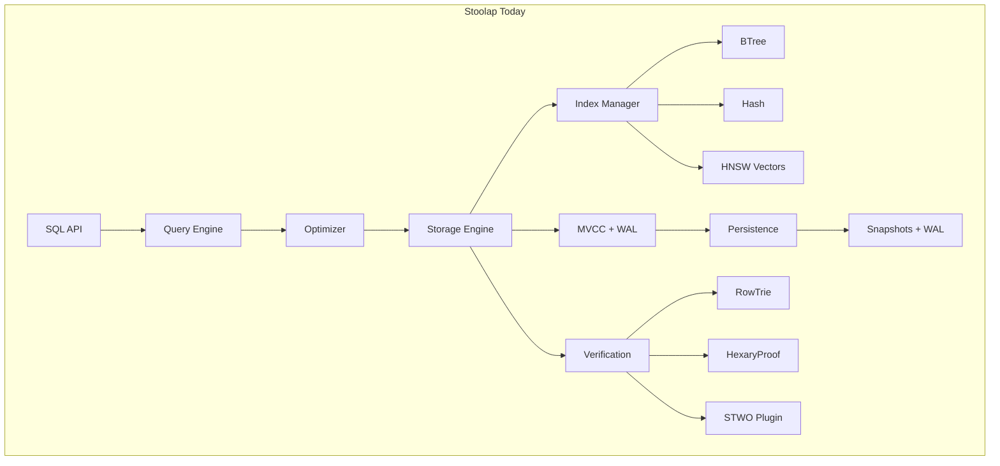
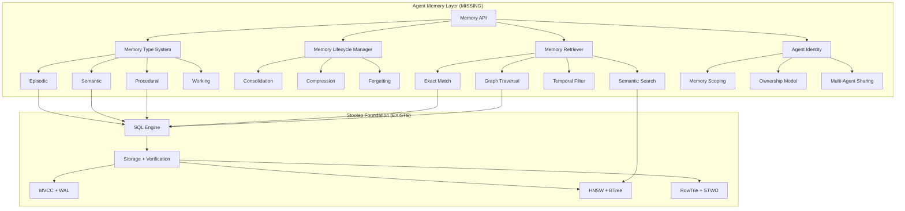
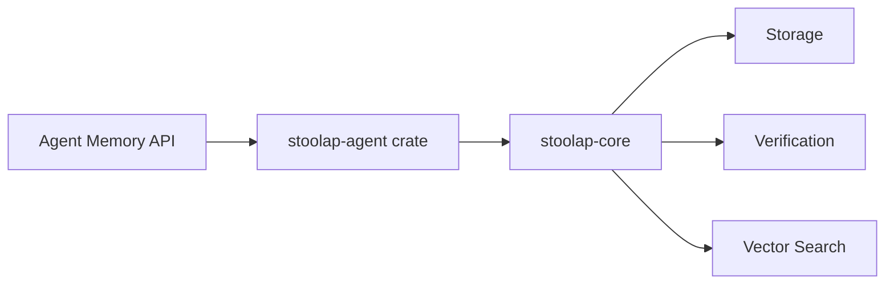

# Stoolap → Agent Memory: Feature Gap Analysis

> **Strategic Analysis: Evolving Stoolap from SQL Database to Verifiable Agent Memory System**

**Date:** 2026-03-09
**Version:** 1.0
**Status:** Strategic Planning

---

## Executive Summary

**CipherOcto is building Stoolap as its memory infrastructure**, but there is a significant gap between Stoolap's current capabilities (embedded SQL database with ZK proofs) and the requirements for a production-grade Agent Memory system.

### Key Finding

**Stoolap has ~40% of the foundational components for Agent Memory**, but lacks the critical higher-level memory abstractions, lifecycle management, and agent-specific features that systems like Mem0, Zep/Graphiti, and Letta/MemGPT provide.

| Category                | Stoolap Current                  | Agent Memory Required                  | Gap         |
| ----------------------- | -------------------------------- | -------------------------------------- | ----------- |
| **Storage Engine**      | ✅ Complete (MVCC, WAL, Indexes) | Same                                   | ✅ None     |
| **Vector Search**       | ✅ Complete (HNSW)               | Same                                   | ✅ None     |
| **Verifiable State**    | ✅ Complete (Merkle, ZK)         | Same                                   | ✅ None     |
| **Memory Abstractions** | ❌ None                          | Episodic, Semantic, Procedural         | 🔴 Critical |
| **Memory Lifecycle**    | ❌ None                          | Consolidation, Compression, Forgetting | 🔴 Critical |
| **Agent Identity**      | ⚠️ Partial                       | Agent-scoped memory, Ownership         | 🟡 High     |
| **Memory Operations**   | ⚠️ Partial                       | Smart retrieval, Ranking, Reflection   | 🟡 High     |
| **Multi-Modal**         | ❌ None                          | Video, Audio, Image memory             | 🟡 Medium   |
| **Benchmarks**          | ❌ None                          | LongMemEval, BEAM, MOOM                | 🟢 Low      |

**Overall Gap Analysis:**

- ✅ **Foundational Layer (60% complete)**: Storage, indexing, vector search, verification
- 🔴 **Memory Layer (0% complete)**: Abstractions, lifecycle, operations
- 🟡 **Agent Layer (20% complete)**: Identity, multi-agent sharing, ownership

---

## Table of Contents

1. [Stoolap Current State](#stoolap-current-state)
2. [Agent Memory Requirements](#agent-memory-requirements)
3. [Detailed Feature Gap Analysis](#detailed-feature-gap-analysis)
4. [Architecture Gap](#architecture-gap)
5. [Implementation Roadmap](#implementation-roadmap)
6. [Strategic Recommendations](#strategic-recommendations)

---

## Stoolap Current State

### What Stoolap Provides Today

#### 1. Storage Foundation ✅

```rust
// Stoolap has excellent storage primitives
pub struct Database {
    mvcc_engine: MVCCEngine,        // Multi-version concurrency
    wal_manager: WalManager,         // Write-ahead logging
    persistence: PersistenceManager, // Snapshots + recovery
    indexes: IndexManager,           // BTree, Hash, Bitmap, HNSW
}
```

**Capabilities:**

- ✅ MVCC transactions with snapshot isolation
- ✅ Multiple index types (BTree, Hash, Bitmap, HNSW)
- ✅ Durable WAL with LZ4 compression
- ✅ Periodic snapshots + crash recovery
- ✅ Zone maps for analytical queries

**Assessment:** Production-ready storage engine. No gap here.

#### 2. Vector Search ✅

```sql
-- Stoolap supports native vector search
CREATE TABLE embeddings (
    id INTEGER PRIMARY KEY,
    content TEXT,
    embedding VECTOR(384)
);

CREATE INDEX idx_emb ON embeddings(embedding)
USING HNSW WITH (metric = 'cosine', m = 32);

SELECT VEC_DISTANCE_COSINE(embedding, query_vec) AS dist
FROM embeddings ORDER BY dist LIMIT 10;
```

**Capabilities:**

- ✅ Native HNSW vector index
- ✅ Multiple distance metrics (cosine, euclidean, dot)
- ✅ Vector column type with mmap support
- ✅ Merkle commitments for vector data

**Assessment:** Matches top agent memory systems. No gap here.

#### 3. Verifiable State ✅

```rust
// Stoolap provides cryptographic verification
pub struct RowTrie {
    root: TrieNode,
    hasher: Hasher,
}

pub struct HexaryProof {
    siblings: Vec<Hash>,
    path: Vec<u8>,
    proof_size: ~68 bytes,
    verification: ~2-3 μs
}
```

**Capabilities:**

- ✅ Hexary Merkle trie for state proofs
- ✅ STWO integration for STARK proofs
- ✅ Pedersen commitments for confidential queries
- ✅ L2 rollup support

**Assessment:** Exceeds current agent memory systems. Competitive advantage.

#### 4. Query Engine ✅

```rust
// Cost-based optimizer with adaptive execution
pub struct Optimizer {
    stats: Statistics,
    cost_model: CostModel,
    join_optimizer: JoinOptimizer,
    aqe: AdaptiveQueryExecution,  // Runtime plan switching
}
```

**Capabilities:**

- ✅ Cost-based query optimization
- ✅ Adaptive query execution (AQE)
- ✅ Semantic query caching (predicate subsumption)
- ✅ Parallel query execution

**Assessment:** Sophisticated query engine, but not agent-aware.

### What Stoolap Lacks

#### 1. Memory Abstractions ❌

**Current State:** Raw SQL tables
**Required:** Episodic, Semantic, Procedural memory types

```sql
-- Today: Manual table creation
CREATE TABLE memories (
    id INTEGER PRIMARY KEY,
    content TEXT,
    embedding VECTOR(384),
    timestamp TIMESTAMP
);

-- Needed: Memory-first API
memory.store_episodic("User prefers Rust for backend");
memory.store_semantic("Rust is a systems programming language");
memory.store_procedural(rust_backend_tool);
```

**Gap:** No semantic understanding of memory types.

#### 2. Memory Lifecycle ❌

**Current State:** Manual SQL operations
**Required:** Automatic consolidation, compression, forgetting

```rust
// Today: Manual operations
db.execute("DELETE FROM memories WHERE timestamp < NOW() - INTERVAL '90 days'")?;

// Needed: Automatic lifecycle
memory.consolidate(old_memories);  // Summarize & abstract
memory.compress(repetitive);       // Deduplicate
memory.forget(low_value, old);     // Smart deletion
```

**Gap:** No automated memory management.

#### 3. Agent Identity ⚠️

**Current State:** No agent concept
**Required:** Agent-scoped memory with ownership

```rust
// Needed: Agent-bound memory
let agent_memory = memory.for_agent(agent_id);
agent_memory.store("...");  // Bound to agent identity

// Multi-agent knowledge sharing
agent_A.share(knowledge, with: agent_B, royalty: 5%);
```

**Gap:** Partial - has cryptographic types, no agent abstractions.

---

## Agent Memory Requirements

### What Production Agent Memory Systems Provide

#### 1. Mem0 (Most Popular)

```python
import mem0

memory = mem0.Memory()

# Simple, opinionated API
memory.add("User prefers dark mode")
results = memory.search("user preferences")
memory.update(memory_id, new_data)
```

**Key Features:**

- ✅ Simple, high-level API
- ✅ Automatic deduplication
- ✅ Memory ranking/scoring
- ✅ Multi-backend support
- ❌ No verification (Stoolap advantage)

#### 2. Zep/Graphiti (Relationships)

```python
from zep import Graphiti

# Automatic graph construction from conversations
graphiti.add("I love pizza from Joe's in Brooklyn")
# → Creates: User -(loves)-> Pizza, Joe's -(located_in)-> Brooklyn

# Relationship queries
results = graphiti.search("What do I love to eat?")
# → Returns: Pizza (from Joe's in Brooklyn)
```

**Key Features:**

- ✅ Dynamic entity/relationship extraction
- ✅ Temporal graph evolution
- ✅ Multi-hop reasoning
- ❌ Graph operations in SQL only (Stoolap needs work)

#### 3. Letta/MemGPT (Long-Horizon Tasks)

```python
from letta import Agent

# OS-like memory management
agent = Agent(
    working_memory_size=4000,
    episodic_memory=vector_store,
    archival_memory=compressed_store
)

# Automatic context window management
agent.run(long_running_task)
# → Manages memory across unlimited context
```

**Key Features:**

- ✅ Hierarchical memory tiers
- ✅ Automatic context management
- ✅ Memory consolidation during idle
- ❌ No such layering in Stoolap

#### 4. OMEGA (Coding Agents - 95.4% LongMemEval)

```python
# 25 specialized memory tools via MCP
tools = {
    'semantic_search': SemanticSearchTool(),
    'exact_match': ExactMatchTool(),
    'temporal_filter': TemporalFilterTool(),
    'entity_extraction': EntityExtractionTool(),
    # ... 21 more
}
```

**Key Features:**

- ✅ Specialized memory operations
- ✅ Hybrid retrieval strategies
- ✅ Context-aware ranking
- ❌ Stoolap has primitives, no specialized tools

---

## Detailed Feature Gap Analysis

### Gap Category 1: Memory Type Abstractions 🔴 CRITICAL

| Memory Type    | Description                    | Stoolap Current | Required              | Gap Severity |
| -------------- | ------------------------------ | --------------- | --------------------- | ------------ |
| **Episodic**   | Specific events, conversations | Raw SQL tables  | Typed API + metadata  | 🔴 Critical  |
| **Semantic**   | Facts, rules, concepts         | Raw SQL tables  | Knowledge abstraction | 🔴 Critical  |
| **Procedural** | Skills, tools, workflows       | No support      | Executable memory     | 🔴 Critical  |
| **Emotional**  | Preferences, sentiments        | No support      | Affective tagging     | 🟡 High      |
| **Working**    | Active context                 | No support      | Session management    | 🟡 High      |

**Required Implementation:**

```rust
// Memory type system (doesn't exist)
pub enum MemoryType {
    Episodic,   // "I spoke with user X about Y"
    Semantic,   // "Rust is a systems language"
    Procedural, // rust_backend_tool()
    Emotional,  // "User prefers dark mode"
    Working,    // Current conversation context
}

pub struct MemoryEntry {
    id: Uuid,
    agent_id: AgentId,
    memory_type: MemoryType,
    content: String,
    embedding: Option<Vector>,
    metadata: MemoryMetadata,
    timestamp: Timestamp,
    importance_score: f32,
    access_count: u32,
    last_accessed: Timestamp,
}

pub struct MemoryMetadata {
    source: MemorySource,      // conversation, dataset, tool, inference
    confidence: f32,
    related_memories: Vec<Uuid>,
    emotional_valence: Option<f32>,
    tags: HashSet<String>,
    provenance: ProvenanceChain,
}

// Memory operations API (doesn't exist)
impl MemoryStore {
    pub fn store_episodic(&self, agent_id: AgentId, content: &str) -> Result<Uuid>;
    pub fn store_semantic(&self, agent_id: AgentId, fact: &str) -> Result<Uuid>;
    pub fn store_procedural(&self, agent_id: AgentId, skill: Skill) -> Result<Uuid>;

    pub fn recall(&self, agent_id: AgentId, query: &str, k: usize) -> Result<Vec<MemoryEntry>>;
    pub fn recall_type(&self, agent_id: AgentId, memory_type: MemoryType, query: &str) -> Result<Vec<MemoryEntry>>;

    pub fn update(&self, memory_id: Uuid, new_content: &str) -> Result<()>;
    pub fn forget(&self, memory_id: Uuid) -> Result<()>;
    pub fn archive(&self, memory_id: Uuid) -> Result<()>;
}
```

### Gap Category 2: Memory Lifecycle Management 🔴 CRITICAL

| Operation         | Description                | Stoolap Current   | Required                 | Gap Severity |
| ----------------- | -------------------------- | ----------------- | ------------------------ | ------------ |
| **Consolidation** | Summarize related memories | Manual DELETE     | Automatic summarization  | 🔴 Critical  |
| **Compression**   | Deduplicate repetitive     | Manual operations | Smart compression        | 🔴 Critical  |
| **Forgetting**    | Prune low-value            | Manual DELETE     | Importance-based decay   | 🟡 High      |
| **Reflection**    | Learn from patterns        | No support        | Memory replay & analysis | 🟡 High      |
| **Migration**     | Hot→Cold→Archive           | No tiering        | Automatic tier migration | 🟡 High      |

**Required Implementation:**

```rust
// Memory lifecycle manager (doesn't exist)
pub struct MemoryLifecycleManager {
    store: MemoryStore,
    consolidation_policy: ConsolidationPolicy,
    compression_threshold: f32,
    retention_policy: RetentionPolicy,
}

impl MemoryLifecycleManager {
    // Consolidate: Summarize related memories
    pub async fn consolidate(&self, agent_id: AgentId) -> Result<()> {
        // 1. Find related episodic memories
        let memories = self.store.recall_related(agent_id, similarity > 0.8).await?;

        // 2. Generate summary using LLM
        let summary = llm().summarize(&memories).await?;

        // 3. Store as semantic memory
        self.store.store_semantic(agent_id, &summary).await?;

        // 4. Archive episodic originals
        for memory in memories {
            self.store.archive(memory.id).await?;
        }

        Ok(())
    }

    // Compress: Deduplicate repetitive memories
    pub async fn compress(&self, agent_id: AgentId) -> Result<()> {
        // 1. Find near-duplicate embeddings
        let duplicates = self.store.find_duplicates(agent_id, threshold = 0.95).await?;

        // 2. Keep highest-importance, merge metadata
        for group in duplicates {
            let kept = group.by_importance().first();
            let merged_metadata = group.merge_metadata();
            self.store.update_metadata(kept.id, merged_metadata).await?;
            group.others().forget().await?;
        }

        Ok(())
    }

    // Forgetting: Importance-based decay
    pub async fn decay(&self, agent_id: AgentId) -> Result<()> {
        let memories = self.store.all(agent_id).await?;

        for memory in memories {
            // Calculate current importance
            let importance = self.calculate_importance(&memory).await?;

            // Decay old, low-value memories
            if importance < 0.1 && memory.age() > Duration::from_days(90) {
                self.store.forget(memory.id).await?;
            } else {
                // Update importance score
                memory.set_importance(importance);
            }
        }

        Ok(())
    }

    fn calculate_importance(&self, memory: &MemoryEntry) -> Result<f32> {
        let mut score = 1.0;

        // Recency decay
        score *= memory.age().decay_factor();

        // Access frequency boost
        score *= memory.access_count.boost_factor();

        // Type importance
        score *= match memory.memory_type {
            MemoryType::Procedural => 1.5,  // Skills are valuable
            MemoryType::Semantic => 1.2,    // Facts are useful
            MemoryType::Episodic => 1.0,    // Events are neutral
            MemoryType::Emotional => 0.8,   // Preferences decay
            MemoryType::Working => 0.5,     // Session data is temporary
        };

        Ok(score.clamp(0.0, 1.0))
    }
}
```

### Gap Category 3: Agent Identity & Ownership 🟡 HIGH

| Feature                 | Description         | Stoolap Current    | Required               | Gap Severity |
| ----------------------- | ------------------- | ------------------ | ---------------------- | ------------ |
| **Agent ID**            | Persistent identity | No concept         | Cryptographic agent ID | 🟡 High      |
| **Memory Scoping**      | Per-agent isolation | Manual filtering   | Automatic scoping      | 🔴 Critical  |
| **Ownership**           | Agents own memory   | No ownership model | Asset model            | 🟡 High      |
| **Multi-Agent Sharing** | Knowledge exchange  | No support         | Memory marketplace     | 🟢 Medium    |
| **Lineage Tracking**    | Memory provenance   | Manual logs        | DAG structure          | 🟡 High      |

**Required Implementation:**

```rust
// Agent identity (partial - has crypto, needs abstraction)
pub struct AgentId {
    public_key: PublicKey,
    wallet: Option<Address>,  // For economic participation
    created_at: Timestamp,
}

pub struct Agent {
    id: AgentId,
    memory_root: Hash,  // Merkle root of agent's memory
    metadata: AgentMetadata,
}

impl Agent {
    // Agent-scoped memory access
    pub fn memory(&self) -> AgentMemory {
        AgentMemory::new(self.id.clone())
    }
}

pub struct AgentMemory {
    agent_id: AgentId,
    store: MemoryStore,
}

impl AgentMemory {
    // All operations automatically scoped to agent
    pub fn store(&self, content: &str) -> Result<Uuid> {
        self.store.store_episodic(self.agent_id.clone(), content)
    }

    pub fn recall(&self, query: &str, k: usize) -> Result<Vec<MemoryEntry>> {
        self.store.recall(self.agent_id.clone(), query, k)
    }

    // Memory ownership & marketplace
    pub fn sell_access(&self, memory_id: Uuid, price: u64) -> Result<MemoryListing> {
        // Create listing for memory access
    }

    pub fn share_with(&self, memory_id: Uuid, recipient: AgentId, royalty: u32) -> Result<MemoryShare> {
        // Share memory with royalty tracking
    }
}

// Memory lineage (doesn't exist)
pub struct MemoryLineage {
    memory_id: Uuid,
    parent_ids: Vec<Uuid>,
    child_ids: Vec<Uuid>,
    source_chain: Vec<MemorySource>,
}

impl MemoryLineage {
    // Trace memory evolution
    pub fn trace(&self) -> Vec<MemoryEntry> {
        // Reconstruct full history
    }

    // Calculate royalties
    pub fn royalties(&self, price: u64) -> Vec<(AgentId, u64)> {
        // Distribute to all contributors
    }
}
```

### Gap Category 4: Advanced Memory Operations 🟡 HIGH

| Operation            | Description          | Stoolap Current    | Required                 | Gap Severity |
| -------------------- | -------------------- | ------------------ | ------------------------ | ------------ |
| **Smart Retrieval**  | Context-aware search | Vector search only | Hybrid strategies        | 🟡 High      |
| **Memory Ranking**   | Relevance scoring    | No ranking         | Multi-factor ranking     | 🟡 High      |
| **Temporal Queries** | Time-based retrieval | AS OF timestamp    | Agent-temporal semantics | 🟡 High      |
| **Reflection**       | Learn from patterns  | No support         | Memory replay & analysis | 🟢 Medium    |
| **Cross-Modal**      | Video + text + audio | Vectors only       | Multi-modal memory       | 🟢 Medium    |

**Required Implementation:**

```rust
// Smart retrieval (doesn't exist)
pub struct MemoryRetriever {
    store: MemoryStore,
    strategies: Vec<Box<dyn RetrievalStrategy>>,
}

pub trait RetrievalStrategy {
    fn retrieve(&self, query: &Query, context: &Context) -> Result<Vec<MemoryEntry>>;
}

// Hybrid retrieval strategies
pub struct SemanticStrategy;  // Vector similarity
pub struct ExactStrategy;     // Exact match
pub struct TemporalStrategy;  // Recent memories
pub struct RelationalStrategy; // Graph traversal
pub struct HybridStrategy;    // Combine all

impl MemoryRetriever {
    pub async fn recall(&self, agent_id: AgentId, query: &str, k: usize) -> Result<Vec<MemoryEntry>> {
        let mut results = Vec::new();

        // Try each strategy
        for strategy in &self.strategies {
            let mut strategy_results = strategy.retrieve(query, context).await?;

            // Rank by multiple factors
            for result in &mut strategy_results {
                result.score = self.rank(result, query, context);
            }

            results.extend(strategy_results);
        }

        // Merge and re-rank
        results.sort_by(|a, b| b.score.partial_cmp(&a.score).unwrap());
        results.truncate(k);
        results.dedup_by(|a, b| a.id == b.id);

        Ok(results)
    }

    fn rank(&self, memory: &MemoryEntry, query: &str, context: &Context) -> f32 {
        let mut score = 0.0;

        // Semantic similarity
        score += memory.semantic_similarity(query) * 0.4;

        // Recency boost
        score += memory.recency_score() * 0.2;

        // Importance boost
        score += memory.importance_score * 0.2;

        // Context relevance
        score += memory.context_relevance(context) * 0.2;

        score
    }
}

// Reflection: Learn from memory patterns (doesn't exist)
pub struct MemoryReflector {
    store: MemoryStore,
    llm: LLMClient,
}

impl MemoryReflector {
    // Replay memory to find patterns
    pub async fn reflect(&self, agent_id: AgentId) -> Result<ReflectionInsights> {
        // 1. Get recent memories
        let memories = self.store.recent(agent_id, n = 100).await?;

        // 2. Ask LLM to find patterns
        let patterns = self.llm.extract_patterns(&memories).await?;

        // 3. Generate new semantic memories
        for pattern in patterns {
            self.store.store_semantic(agent_id, &pattern).await?;
        }

        Ok(ReflectionInsights { patterns })
    }

    // Memory replay during idle periods
    pub async fn replay_consolidation(&self, agent_id: AgentId) -> Result<()> {
        // Hippocampus-inspired replay
        // Reinforce important memories
        // Detect inconsistencies
        // Update memory embeddings
    }
}
```

### Gap Category 5: Multi-Modal Memory 🟢 MEDIUM

| Modality    | Description      | Stoolap Current | Required            | Gap Severity |
| ----------- | ---------------- | --------------- | ------------------- | ------------ |
| **Text**    | Natural language | ✅ Complete     | -                   | ✅ None      |
| **Vectors** | Embeddings       | ✅ Complete     | -                   | ✅ None      |
| **Video**   | Long-form video  | No support      | Hierarchical memory | 🟢 Medium    |
| **Audio**   | Speech, sound    | No support      | Audio-visual memory | 🟢 Medium    |
| **Images**  | Visual content   | No support      | Image memory        | 🟢 Medium    |

**Required Implementation (Future Phase):**

```rust
// Multi-modal memory (future work)
pub struct MultiModalMemory {
    text: MemoryStore,
    video: VideoMemoryStore,
    audio: AudioMemoryStore,
    image: ImageMemoryStore,
    cross_modal: CrossModalIndex,
}

// Hierarchical video memory
pub struct VideoMemoryStore {
    // Frame-level embeddings
    frames: VectorStore,

    // Scene-level summaries
    scenes: MemoryStore,

    // Video-level metadata
    metadata: VideoMetadata,
}

// Hippocampal-inspired audio-visual memory
pub struct AudioVisualMemory {
    // Synchronized audio-visual episodic memory
    episodes: Vec<AVEpisode>,

    // Cross-modal associations
    associations: CrossModalIndex,
}

pub struct AVEpisode {
    video_frames: Vec<VideoFrame>,
    audio_segments: Vec<AudioSegment>,
    text_transcript: String,
    temporal_alignment: TemporalAlignment,
    embedding: MultiModalEmbedding,
}
```

### Gap Category 6: Benchmarks & Evaluation 🟢 LOW

| Benchmark       | Description             | Stoolap Current | Required              | Gap Severity |
| --------------- | ----------------------- | --------------- | --------------------- | ------------ |
| **LongMemEval** | Conversational memory   | No evaluation   | 95%+ target           | 🟢 Low       |
| **BEAM**        | Million-token context   | No evaluation   | Pass benchmark        | 🟢 Low       |
| **MOOM**        | Ultra-long roleplay     | No evaluation   | Character consistency | 🟢 Low       |
| **HaluMem**     | Hallucination detection | No evaluation   | Low hallucination     | 🟢 Low       |

**Required Implementation:**

```rust
// Benchmark suite (doesn't exist)
pub struct MemoryBenchmarks;

impl MemoryBenchmarks {
    pub async fn run_longmem_eval(&self) -> Result<BenchmarkScore> {
        // Test conversational memory
    }

    pub async fn run_beam(&self) -> Result<BenchmarkScore> {
        // Test million-token context
    }

    pub async fn run_moom(&self) -> Result<BenchmarkScore> {
        // Test long-form roleplay
    }

    pub async fn run_halumem(&self) -> Result<BenchmarkScore> {
        // Test hallucination rates
    }
}
```

---

## Architecture Gap

### Current Stoolap Architecture



### Required Agent Memory Architecture



**Gap Summary:**

- ✅ Foundation layer: Complete
- 🔴 Memory abstraction layer: Missing entirely
- 🟡 Agent layer: Partial (crypto exists, abstractions missing)

---

## Implementation Roadmap

### Phase 1: Memory Type System (4-6 weeks)

**Goal:** Add episodic, semantic, procedural memory abstractions

**Deliverables:**

1. `MemoryType` enum and `MemoryEntry` struct
2. `MemoryStore` trait with type-safe operations
3. Memory metadata (provenance, importance, tags)
4. Basic CRUD operations per memory type
5. Integration with existing storage engine

**SQL Schema:**

```sql
CREATE TABLE memory_entries (
    id UUID PRIMARY KEY,
    agent_id BYTEA NOT NULL,
    memory_type TEXT NOT NULL,  -- 'episodic', 'semantic', 'procedural'
    content TEXT NOT NULL,
    embedding VECTOR(384),
    metadata JSONB NOT NULL,
    timestamp TIMESTAMP NOT NULL,
    importance_score REAL,
    access_count INTEGER DEFAULT 0,
    last_accessed TIMESTAMP,
    memory_root BYTEA,  -- Merkle root for verification
    UNIQUE(agent_id, id)
);

-- Indexes for agent memory
CREATE INDEX idx_agent_type ON memory_entries(agent_id, memory_type);
CREATE INDEX idx_agent_timestamp ON memory_entries(agent_id, timestamp DESC);
CREATE INDEX idx_importance ON memory_entries(importance_score DESC);
CREATE INDEX idx_embedding ON memory_entries USING HNSW(embedding);
```

**Acceptance Criteria:**

- ✅ Store and retrieve each memory type
- ✅ Agent-scoped memory access
- ✅ Metadata tracking
- ✅ Vector search integration

### Phase 2: Memory Lifecycle (6-8 weeks)

**Goal:** Automatic consolidation, compression, and forgetting

**Deliverables:**

1. `MemoryLifecycleManager`
2. Consolidation: Summarize episodic → semantic
3. Compression: Deduplicate similar memories
4. Forgetting: Importance-based decay
5. Background job scheduling

**API:**

```rust
impl MemoryLifecycleManager {
    pub async fn consolidate(&self, agent_id: AgentId) -> Result<()>;
    pub async fn compress(&self, agent_id: AgentId) -> Result<()>;
    pub async fn decay(&self, agent_id: AgentId) -> Result<()>;
    pub async fn migrate_tiers(&self, agent_id: AgentId) -> Result<()>;

    // Background processing
    pub async fn start_background_jobs(&self) -> Result<JoinHandle<()>>;
}
```

**Acceptance Criteria:**

- ✅ Automatic consolidation of related memories
- ✅ Compression reduces memory size by 10x+
- ✅ Low-value memories automatically forgotten
- ✅ Hot/Cold/Archive tier migration

### Phase 3: Agent Identity & Ownership (4-6 weeks)

**Goal:** Agent-scoped memory with ownership model

**Deliverables:**

1. `AgentId` and `Agent` types
2. `AgentMemory` for scoped access
3. Memory ownership and marketplace primitives
4. Lineage tracking (memory DAG)
5. Multi-agent memory sharing

**API:**

```rust
let agent = Agent::create()?;
let memory = agent.memory();

memory.store("User prefers Rust")?;
let results = memory.recall("preferences", k=10)?;

// Ownership
memory.sell_access(memory_id, price=100)?;
memory.share_with(memory_id, recipient_id, royalty=5)?;

// Lineage
let lineage = memory.lineage(memory_id)?;
let history = lineage.trace()?;
let royalties = lineage.royalties(price)?;
```

**Acceptance Criteria:**

- ✅ Automatic agent memory scoping
- ✅ Memory ownership and transfer
- ✅ Lineage tracking and royalties
- ✅ Multi-agent knowledge sharing

### Phase 4: Advanced Retrieval (6-8 weeks)

**Goal:** Hybrid retrieval with smart ranking

**Deliverables:**

1. `MemoryRetriever` with multiple strategies
2. Semantic + exact + temporal + graph retrieval
3. Multi-factor ranking
4. Context-aware retrieval
5. Query optimization for agent patterns

**API:**

```rust
let retriever = MemoryRetriever::new(store)
    .with_strategy(SemanticStrategy::new())
    .with_strategy(ExactStrategy::new())
    .with_strategy(TemporalStrategy::new())
    .with_strategy(RelationalStrategy::new());

let results = retriever.recall(agent_id, "user preferences", k=10)?;
```

**Acceptance Criteria:**

- ✅ Hybrid retrieval outperforms single strategy
- ✅ Sub-100ms retrieval latency
- ✅ Context-aware ranking
- ✅ Multi-hop graph queries

### Phase 5: Benchmarks (4-6 weeks)

**Goal:** Validate against industry benchmarks

**Deliverables:**

1. LongMemEval benchmark suite
2. BEAM million-token testing
3. MOOM character consistency
4. HaluMem hallucination detection
5. Performance optimization

**Targets:**

- LongMemEval: >90% accuracy
- BEAM: Pass all tests
- MOOM: Character consistency >95%
- HaluMem: Hallucination rate <5%

**Acceptance Criteria:**

- ✅ Pass all benchmarks at target levels
- ✅ Published benchmark results
- ✅ Competitive with top systems

### Phase 6: Multi-Modal (Future, 8-12 weeks)

**Goal:** Video, audio, and image memory

**Deliverables:**

1. `VideoMemoryStore` with hierarchical compression
2. `AudioMemoryStore` for speech and sound
3. `ImageMemoryStore` for visual content
4. Cross-modal associations
5. Audio-visual episodic memory

**Acceptance Criteria:**

- ✅ Store and retrieve multi-modal content
- ✅ Hierarchical video compression (1000:1)
- ✅ Cross-modal search (text → video)
- ✅ Pass Video-MME benchmark

---

## Strategic Recommendations

### Recommendation 1: Position Stoolap as "Verifiable Agent Memory" 🔴 URGENT

**Current Positioning:** "Modern embedded SQL database"
**Recommended Positioning:** "Verifiable Agent Memory for Autonomous AI"

**Rationale:**

- Agent memory is a massive emerging market (projected $10B+ by 2030)
- Stoolap has unique competitive advantage (ZK proofs, verification)
- No existing solution combines agent memory + cryptographic verification

**Action Items:**

1. Update website/docs to emphasize agent memory use case
2. Create "Agent Memory with Stoolap" tutorial
3. Publish benchmark results vs. Mem0, Zep, Letta
4. Position for AI agent builders (not database users)

### Recommendation 2: Phase Implementation - Foundation First 🟡 HIGH PRIORITY

**Don't Block on Complete Feature Set**

Stoolap's foundation is excellent. Build agent memory as a **layer on top**:



**Benefits:**

- Faster time to market
- Clear separation of concerns
- Easier testing and iteration
- Can ship incrementally

**Action Items:**

1. Create `stoolap-agent` crate alongside `stoolap-core`
2. Ship Phase 1 (Memory Types) independently
3. Gather feedback from early adopters
4. Iterate based on real-world usage

### Recommendation 3: Leverage Existing Strengths 🟢 COMPETITIVE ADVANTAGE

**Stoolap's Unique Advantages:**

| Feature                   | Competitors | Stoolap Advantage                |
| ------------------------- | ----------- | -------------------------------- |
| **Verifiable State**      | None        | Merkle proofs for every memory   |
| **ZK Privacy**            | Partial     | STWO integration                 |
| **Deterministic Compute** | None        | DQA from RFC-0106 (Numeric/Math) |
| **Time-Travel Queries**   | No          | Built-in temporal queries        |
| **Cost-Based Optimizer**  | Some        | AQE + semantic cache             |

**Action Items:**

1. Emphasize "verifiable memory" in messaging
2. Create "Memory Proofs" documentation
3. Build memory verification tooling
4. Publish proof size/verification benchmarks

### Recommendation 4: Benchmark Against Industry Standards 🟡 HIGH PRIORITY

**Measure Success Quantitatively:**

| Benchmark     | Target                     | Status               |
| ------------- | -------------------------- | -------------------- |
| LongMemEval   | >90%                       | Not tested           |
| BEAM          | Pass                       | Not tested           |
| MOOM          | >95% character consistency | Not tested           |
| HaluMem       | <5% hallucination          | Not tested           |
| Write latency | <100ms with proof          | ~68μs proof only ✅  |
| Query latency | <50ms with proof           | ~2-3μs proof only ✅ |

**Action Items:**

1. Implement benchmark suite (Phase 5)
2. Publish results on website
3. Continuous benchmarking in CI
4. Compare against Mem0, Zep, Letta

### Recommendation 5: Build for Agent Developers, Not Database Users 🟢 STRATEGIC

**Target Audience Shift:**

| Current Target      | Recommended Target         |
| ------------------- | -------------------------- |
| Database developers | Agent builders             |
| SQL users           | AI engineers               |
| App developers      | LLM application developers |

**Developer Experience:**

```rust
// Today: Database API
let db = Database::open("memory://")?;
db.execute("INSERT INTO memories VALUES (...)", ())?;

// Recommended: Agent Memory API
let memory = AgentMemory::connect("memory://")?;
memory.store("User prefers Rust")?;
let results = memory.recall("preferences")?;
```

**Action Items:**

1. Design agent-first API (not SQL-first)
2. Create agent memory tutorials
3. Build examples for common agent patterns
4. Publish "Building Persistent Agents" guide

### Recommendation 6: Partner with Agent Framework Projects 🟢 GROWTH

**Potential Partnerships:**

| Project                   | Integration Opportunity     |
| ------------------------- | --------------------------- |
| **LangChain**             | Stoolap as memory backend   |
| **LlamaIndex**            | Verifiable memory connector |
| **AutoGPT**               | Persistent memory layer     |
| **CrewAI**                | Multi-agent memory sharing  |
| **OpenAI Assistants API** | Alternative memory provider |

**Action Items:**

1. Build LangChain integration (`langchain-stoolap`)
2. Create LlamaIndex connector
3. Publish integration examples
4. Reach out to framework maintainers

---

## Summary: Critical Path to Agent Memory

### Must-Have (MVP)

| Feature                | Priority    | Effort    | Impact              |
| ---------------------- | ----------- | --------- | ------------------- |
| **Memory Type System** | 🔴 Critical | 4-6 weeks | Enables all else    |
| **Agent Identity**     | 🔴 Critical | 4-6 weeks | Scoping + ownership |
| **Memory Lifecycle**   | 🔴 Critical | 6-8 weeks | Long-term viability |
| **Advanced Retrieval** | 🟡 High     | 6-8 weeks | User experience     |

**Total MVP Effort: 20-28 weeks (5-7 months)**

### Nice-to-Have (Post-MVP)

| Feature                | Priority  | Effort     | Impact           |
| ---------------------- | --------- | ---------- | ---------------- |
| **Multi-Modal Memory** | 🟢 Medium | 8-12 weeks | Video agents     |
| **Reflection System**  | 🟢 Medium | 4-6 weeks  | Self-improvement |
| **Benchmarks**         | 🟢 Low    | 4-6 weeks  | Credibility      |

### Competitive Positioning

**Stoolap will be unique:**

```
Mem0: Simple, no verification
Zep: Graph-based, no verification
Letta: OS-like, no verification
Stoolap: All features + ZK proofs ✨
```

**The "Verifiable Agent Memory" positioning is defensible and differentiated.**

---

## Next Steps

1. **Strategic Decision:** Commit to "Verifiable Agent Memory" positioning
2. **Phase 1 Start:** Implement memory type system (4-6 weeks)
3. **Parallel Track:** Build agent developer community
4. **Benchmarks:** Run LongMemEval, publish results
5. **Partnerships:** Integrate with LangChain, LlamaIndex

---

**Document Status:** Ready for Review
**Next Review:** After Phase 1 completion

**Related Documents:**

- [Agent Memory Comprehensive Research](./agent-memory-comprehensive-research.md)
- [RFC-0410 (Agents): Verifiable Agent Memory](../rfcs/0410-verifiable-agent-memory.md)
- [Use Case: Verifiable Agent Memory Layer](../use-cases/verifiable-agent-memory-layer.md)
- [Stoolap Research Report](./stoolap-research.md)
- [Mission: Stoolap Provider Integration](../missions/stoolap-provider-integration.md)
