# Research: Stoolap Full Determinism for Blockchain/Distributed Ledgers

## Executive Summary

This research investigates whether Stoolap — a modern embedded SQL database in pure Rust — can be made fully deterministic for blockchain and distributed ledger use cases. The question is whether two independent Stoolap replicas, executing the same sequence of operations from a genesis state, will always produce identical results.

**Verdict: Partially yes, with significant work required.**

Stoolap has a `determ/` module providing deterministic value types and Merkle hashing, and a blockchain consensus layer (blocks, operations, Merkle roots). However, several production features introduce non-determinism: HNSW graph construction uses random layer assignment, transaction IDs use atomic counters with ordering semantics, FxHashMap/AHashMap provide non-deterministic iteration order, parallel execution uses Rayon's work-stealing scheduler, and the adaptive query execution (AQE) system modifies plans at runtime based on observed cardinalities.

This report maps every non-deterministic element to a CipherOcto execution class (A/B/C), identifies what stoolap already provides, and specifies what changes would be needed for full Protocol Determinism (Class A).

---

## Architecture Overview

### High-Level System Architecture

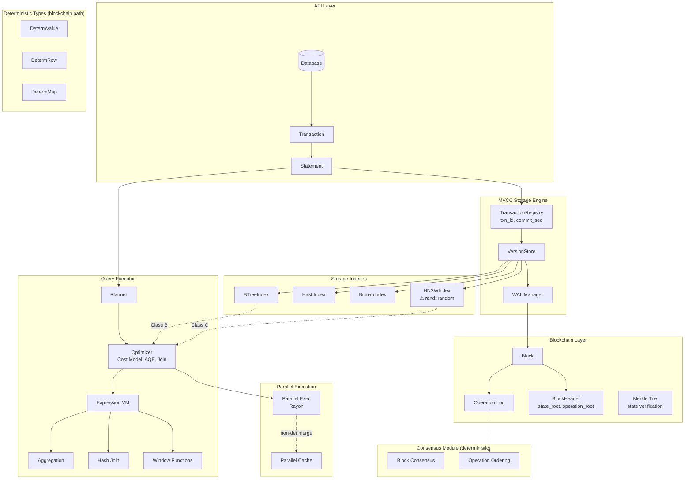

### Stoolap Source Folder Structure

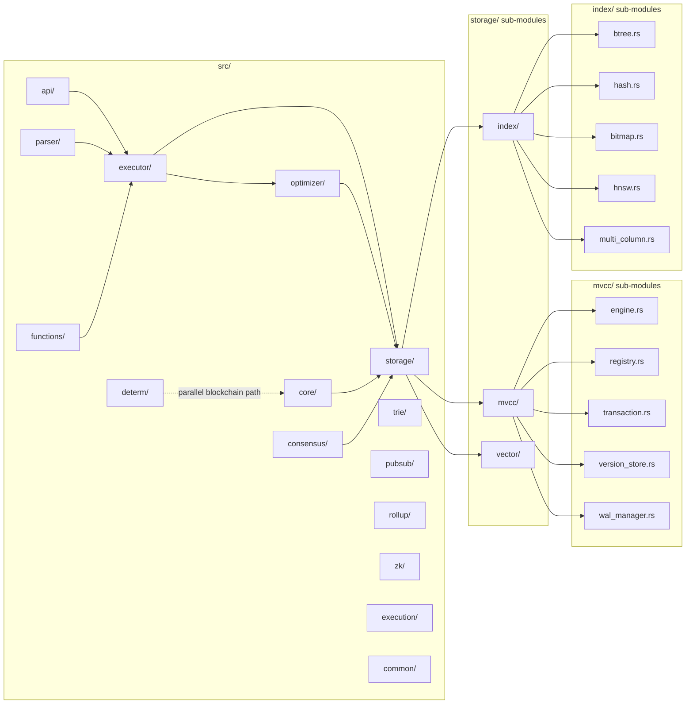

### Determinism Boundary — Execution Class Mapping

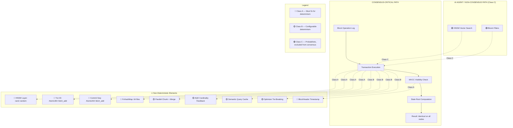

### MVCC Transaction Flow and Determinism Injection Points

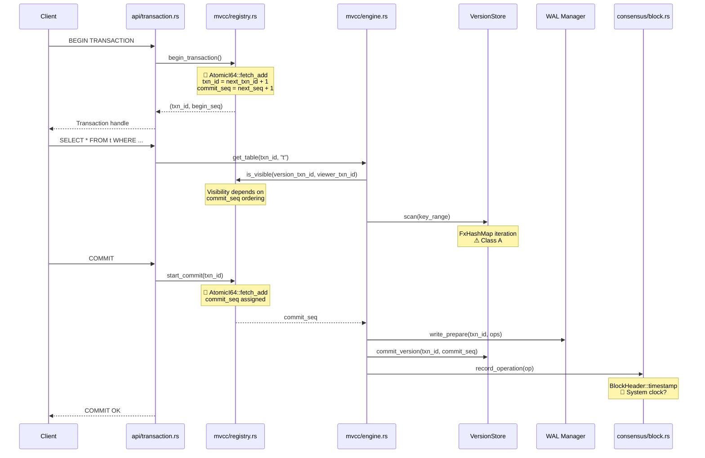

---

## Deep Module Analysis

This section provides detailed architectural documentation for the three modules with the highest determinism impact: **Executor**, **Storage**, and **Optimizer**.

---

### A. Executor Module

**Path**: `stoolap/src/executor/`

The executor implements a **Volcano-style streaming operator model** with a **compiled expression VM** and **parallel execution via Rayon**. It is the largest module in stoolap (~25+ files, ~1MB+ of code).

#### A.1 Architecture

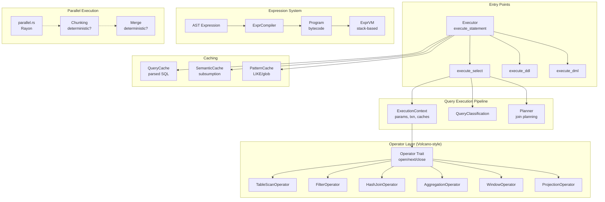

#### A.2 Key Components

| Component | File | Purpose | Non-Determinism |
|-----------|------|---------|----------------|
| **Operator Trait** | `operator.rs` | Volcano-style: `open()`, `next()`, `close()` | None |
| **RowRef** | `operator.rs` | Zero-copy row: `Owned`, `Composite`, `DirectBuildComposite` | None |
| **ExprCompiler** | `expression/compiler.rs` | AST → bytecode | None |
| **ExprVM** | `expression/vm.rs` | Stack-based bytecode execution | None |
| **HashJoinOperator** | `operators/hash_join.rs` | Streaming hash join | FxHashMap iteration |
| **AggregationOperator** | `aggregation.rs` | GROUP BY, ROLLUP, CUBE | FxHashMap grouping |
| **WindowOperator** | `window.rs` | ROW_NUMBER, RANK, LAG, LEAD | None |
| **parallel_filter** | `parallel.rs` | Rayon parallel WHERE | 🔴 Chunk boundaries + Rayon scheduling |
| **parallel_sort** | `parallel.rs` | Rayon `par_sort_unstable_by` | 🔴 Unstable sort on equal keys |
| **parallel_distinct** | `parallel.rs` | Two-phase dedup | 🔴 Chunk + merge ordering |
| **JoinHashTable** | `hash_table.rs` | O(N+M) hash join build/probe | 🔴 Hash collision chain order |
| **SemanticCache** | `semantic_cache.rs` | Predicate subsumption caching | 🟡 Cache state accumulated per-node |

#### A.3 Query Execution Flow

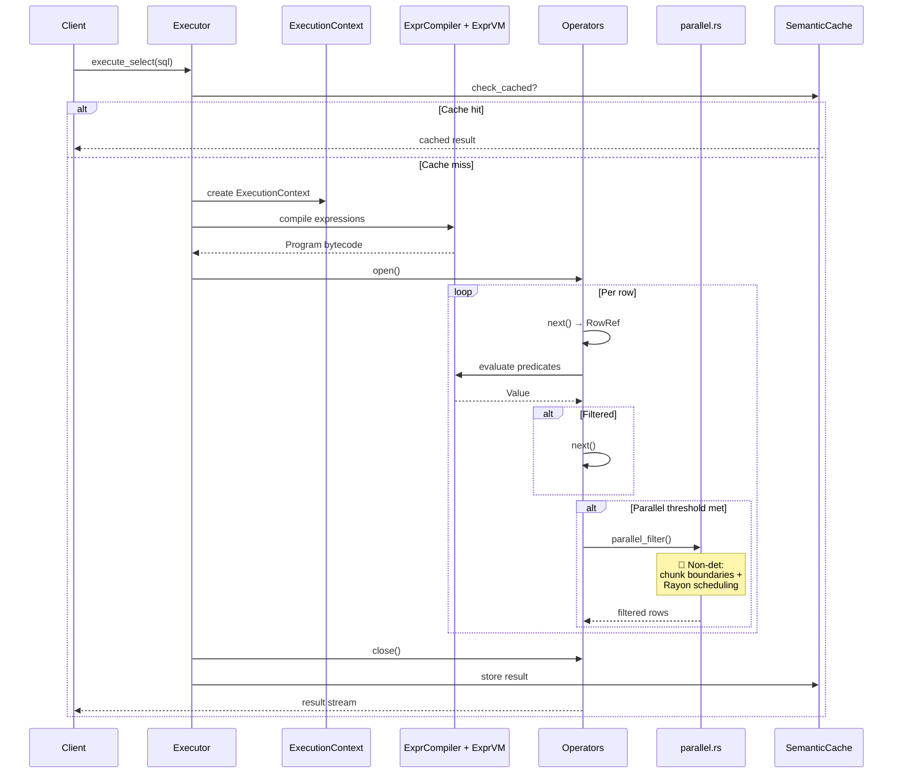

#### A.4 Hash Join Algorithm (Streaming Path)

```mermaid
graph LR
    subgraph "Build Phase (open)"
        B1[Materialize<br/>build rows]
        B2[Compute<br/>hash per row]
        B3[Insert into<br/>JoinHashTable]
        B4[Linear probing<br/>collision chains]

        B1 --> B2 --> B3 --> B4
    end

    subgraph "Probe Phase (next)"
        P1[Get probe row]
        P2[Hash probe key]
        P3[Bucket lookup<br/>O(1)]
        P4[Verify collision<br/>chain]
        P5[Emit<br/>CompositeRow]

        P1 --> P2 --> P3 --> P4 --> P5
    end

    subgraph "JoinHashTable Structure"
        HT[Table]
        BKT[Buckets<br/>array]
        CHAIN[Collision chains<br/>linked list]
        META[Entry: hash, row_idx, next]
    end
```

**Non-determinism in hash join**: `JoinHashTable::probe()` iterates collision chains in insertion order. When multiple rows have different keys but same hash bucket, output order depends on which row was inserted first — which depends on parallel build timing if `parallel_hash_build()` is used.

#### A.5 Parallel Execution Architecture

```mermaid
graph TB
    subgraph "parallel_filter()"
        P1[Collect rows into Vec]
        P2[Mark: into_par_iter.chunks(n)]
        P3[Parallel bool marking<br/>rayon work-stealing]
        P4[Sequential compaction<br/>stable order]
        P1 --> P2 --> P3 --> P4
    end

    subgraph "parallel_sort()"
        S1[par_sort_unstable_by<br/>🔴 unstable on equal keys]
    end

    subgraph "parallel_distinct()"
        D1[Phase 1: Local dedup<br/>per chunk]
        D2[Phase 2: Global dedup<br/>🔴 chunk order matters]
        D1 --> D2
    end

    subgraph "parallel_hash_join()"
        HJ1[parallel_hash_build<br/>🔴 DashMap concurrent]
        HJ2[parallel_hash_probe<br/>🔴 par_chunks]
        HJ3[Merge matched<br/>🔴 thread completion order]
        HJ1 --> HJ2 --> HJ3
    end

    subgraph "Thresholds"
        T1[Filter: ≥10K rows]
        T2[Sort: ≥50K rows]
        T3[Aggregation: ≥100K rows]
        T4[Hash join: ≥10K build rows]
    end
```

---

### B. Storage Module

**Path**: `stoolap/src/storage/`

The storage module implements an **MVCC (Multi-Version Concurrency Control) engine** with **Write-Ahead Log (WAL)**, **per-table version stores**, and **multiple index types** (BTree, Hash, Bitmap, HNSW).

#### B.1 Architecture

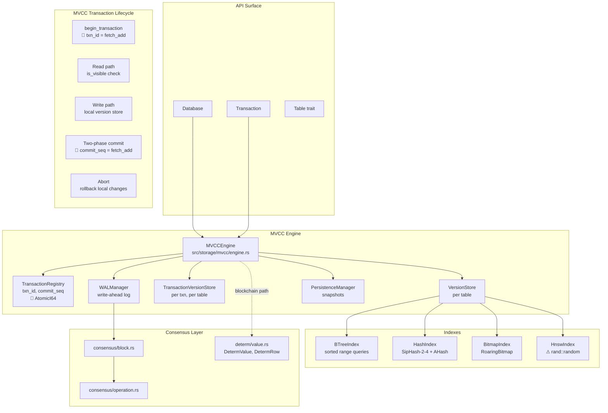

#### B.2 Transaction Registry — Visibility and ID Generation

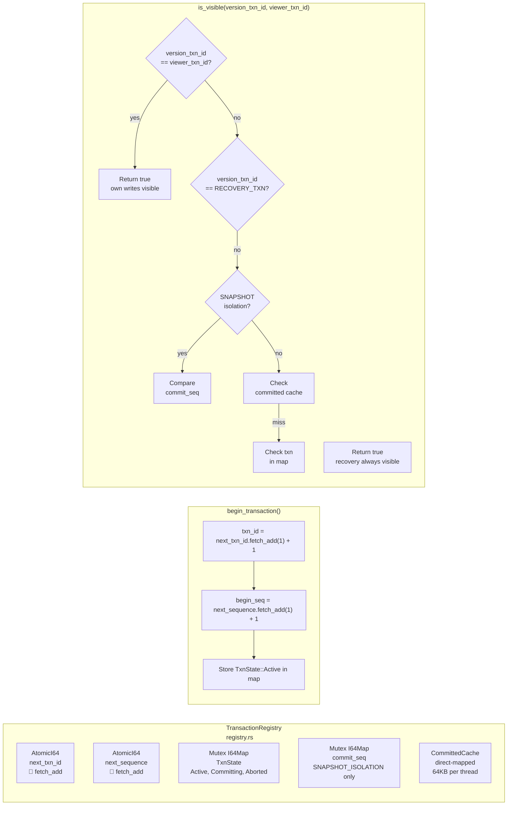

#### B.3 MVCC Version Store — Visibility Algorithm

```mermaid
graph TB
    subgraph "VersionStore<br/>version_store.rs"
        ARENA[CowBTree<br/>arena-optimized<br/>contiguous storage]
        TXN_STORES[I64Map<br/>TransactionVersionStore<br/>per-txn write sets]
        INDEXES[I64Map<br/>Arc dyn Index<br/>BTree, Hash, HNSW...]
    end

    subgraph "get_visible_version(row_key, txn_id)"
        GV1[Speculative probe<br/>O(1) for auto-inc PK]
        GV2[CowBTree lookup<br/>O(log n)]
        GV3[Chain traversal<br/>walk prev links]
        GV4[For each version<br/>is_visible check]
        GV5{version visible<br/>and not deleted?}
        GV6[Return visible<br/>RowVersion]
        GV7[Continue<br/>chain]

        GV1 -->|miss| GV2 --> GV3 --> GV4 --> GV5
        GV5 -->|yes| GV6
        GV5 -->|no| GV7 --> GV4
    end

    subgraph "RowVersion Chain"
        RV0[root: RowVersion]
        RV1[prev: Option<br/>Arc RowVersion]
        RV2[txn_id: i64<br/>creator transaction]
        RV3[commit_seq: i64<br/>commit sequence]
        RV4[deleted_at_txn: i64<br/>0 = not deleted]
        RV5[data: Row]
    end
```

#### B.4 Two-Phase Commit Protocol

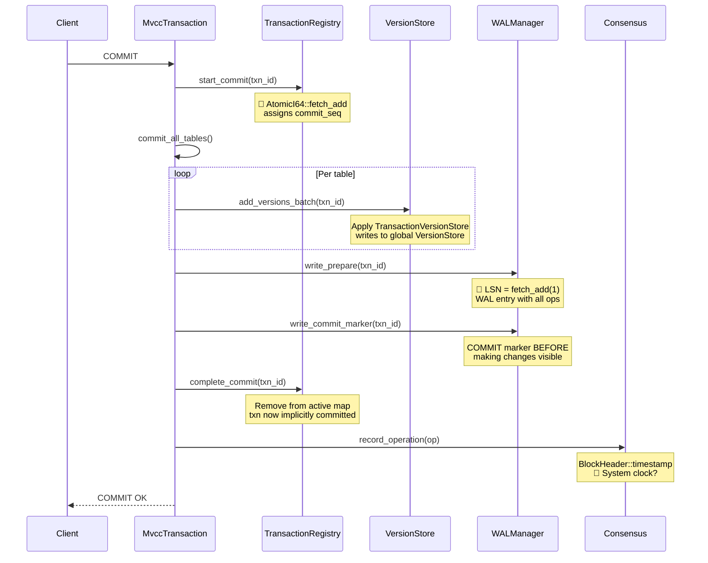

#### B.5 Index Comparison

| Index | File | Data Structure | Algorithm | Determinism |
|-------|------|---------------|-----------|-------------|
| **BTreeIndex** | `btree.rs` | `BTreeMap<CompactArc<Value>, RowIdSet>` | O(log n + k) range scan | ✅ Sorted (BTreeMap is deterministic) |
| **HashIndex** | `hash.rs` | `FxHashMap<u64, CompactVec<i64>>` + `I64Map<u64>` | O(1) lookup, SipHash-2-4 | ⚠️ FxHashMap iteration order |
| **BitmapIndex** | `bitmap.rs` | `RoaringTreemap` per distinct value | O(n/64) AND/OR | ✅ Deterministic (no randomness) |
| **HnswIndex** | `hnsw.rs` | Multi-layer graph + packed vectors | O(log N) ANN search | 🔴 `rand::random()` for layer assignment |

#### B.6 Key Files

| Path | Key Symbols | Non-Determinism |
|------|-------------|-----------------|
| `mvcc/registry.rs:312` | `begin_transaction()` | 🔴 `AtomicI64::fetch_add` for txn_id |
| `mvcc/registry.rs:318` | `start_commit()` | 🔴 `AtomicI64::fetch_add` for commit_seq |
| `mvcc/registry.rs:511` | `is_committed()` | Uses `next_txn_id` load — depends on prior fetch_add |
| `mvcc/version_store.rs:1107` | `get_visible_version()` | None (deterministic visibility rules) |
| `mvcc/wal_manager.rs:1304` | `write_entry()` | 🔴 LSN = `fetch_add(1)` order |
| `index/hnsw.rs:2306` | `random_level()` | 🔴 `rand::random()` — **only randomness source in codebase** |
| `index/hash.rs` | HashIndex | ⚠️ `FxHashMap` iteration |
| `mvcc/engine.rs` | MVCCEngine | ⚠️ `FxHashMap` for schemas, version_stores |

---

### C. Optimizer Module

**Path**: `stoolap/src/optimizer/`

The optimizer is a **cost-based query optimizer** with **adaptive execution (AQE)**, **cardinality feedback learning**, and **workload-aware planning**. It uses statistics from `ANALYZE` to estimate costs and selects plans minimizing estimated total cost.

#### C.1 Architecture

```mermaid
graph TB
    subgraph "Query Input"
        SQL[Parsed SQL]
        STATS[Table Statistics<br/>from ANALYZE]
        FEEDBACK[CardinalityFeedback<br/>FxHashMap<br/>🟡 learned corrections]
    end

    subgraph "Expression Simplification"
        SIM[simplify.rs<br/>constant folding<br/>deterministic]
    end

    subgraph "Cost Model (cost.rs)"
        COST[CostEstimator]
        SEL[SelectivityEstimator<br/>histogram, correlation]
        ACCESS[AccessMethod cost<br/>SeqScan, IndexScan, PKLookup]
        JOIN_COST[Join cost<br/>Hash, Merge, NestedLoop]
    end

    subgraph "Join Planning (join.rs)"
        JP[JoinOptimizer]
        DP[Dynamic Programming<br/>O(3^n) for n≤10]
        GREEDY[Greedy fallback<br/>O(n²) for n>10]
        MEM[Memory-aware planning<br/>HASH_JOIN_MEMORY_LIMIT]
    end

    subgraph "AQE (aqe.rs)"
        AQE[Adaptive Query Execution<br/>switches plan at runtime]
        SWITCH[AQE_SWITCH_THRESHOLD<br/>= 10x error]
    end

    subgraph "Feedback (feedback.rs)"
        FB[FeedbackCache<br/>FxHashMap<br/>🟡 accumulates per-node]
        FP[fingerprint_predicate<br/>FxHasher on structure]
        EMA[Exponential moving avg<br/>decay=0.3]
    end

    subgraph "Bloom Filters (bloom.rs)"
        BF[RuntimeBloomFilter<br/>AHasher<br/>🔴 non-det seed]
        TRACK[BloomEffectivenessTracker<br/>singleton]
    end

    subgraph "Workload (workload.rs)"
        WL[WorkloadLearner<br/>FxHashMap patterns]
        EDGE[EdgeAwarePlanner<br/>adjusts for edge/mobile]
    end

    SQL --> SIM --> COST & JP
    STATS --> COST
    FEEDBACK --> COST
    COST --> JP
    JP --> DP & GREEDY
    DP -.->|runtime| AQE
    GREEDY -.->|runtime| AQE
    FB -.->|lookup| COST
    BF -.->|propagate| JP
    WL --> EDGE --> COST
```

#### C.2 Cost Model Architecture

```mermaid
graph LR
    subgraph "PlanCost Components"
        STARTUP[startup cost<br/>one-time, e.g., hash build]
        PERROW[per_row cost<br/>cost per output row]
        TOTAL[total = startup + per_row × rows]
    end

    subgraph "Access Method Costs (cpu_relative)"
        SEQ[SeqScan<br/>cpu_tuple_cost × rows]
        IDX_BT[BTreeScan<br/>cpu_index × log n + cpu_op × matches]
        IDX_HASH[HashScan<br/>cpu_index × 1 + cpu_op × matches]
        PK[PK Lookup<br/>O(1), cheapest]
    end

    subgraph "Join Costs"
        HJ[HashJoin<br/>hash_build + hash_probe × probe_rows]
        MJ[MergeJoin<br/>sort + merge<br/>requires sorted input]
        NL[NestedLoop<br/>outer × inner<br/>🔴 expensive for large]
    end

    subgraph "Selectivity Estimation"
        EQ[Equality: 1/distinct<br/>or 0.1 default]
        RANGE[Range: histogram<br/>or 0.333 default]
        COMB[Combined AND:<br/>product × correlation]
    end
```

#### C.3 Join Ordering — Dynamic Programming

```mermaid
graph TB
    subgraph "DP Algorithm (n ≤ 10 tables)"
        START[Enumerate 2^n subsets<br/>bitmask DP table]
        SUBSET[For each subset S<br/>find best partition A×B]
        COST[Cost: cost(A) + cost(B) + join_cost(A,B)]
        MEMO[Memoize dp[mask] = best]
        BUILD[Build left-deep or bushy tree]
    end

    subgraph "Partition Enumeration"
        LOOP["while left_card > 0 {"]
        PART["right = remaining ^ left"]
        COMPARE["total_cost < best?"]
        SHIFT["left = (left - 1) & remaining"]
    end

    subgraph "Tie-Breaking"
        TIE["🔴 When costs equal:<br/>first partition wins<br/>depends on FxHashMap<br/>iteration order"]
    end

    START --> SUBSET --> COST --> MEMO --> BUILD
    LOOP --> PART --> COMPARE
    COMPARE -->|equal| TIE
    COMPARE -->|better| MEMO
```

**Non-determinism**: At `join.rs:568`, when `total_cost < best_cost` is false (equal costs), the first partition evaluated wins. The enumeration order of partitions depends on how `left` iterates from `remaining` downwards — which depends on bitmask arithmetic, not randomness. However, the **final plan selection** is deterministic for a given enumeration order — the issue is that different table orderings in the query can change which partitions get evaluated first.

#### C.4 Adaptive Query Execution (AQE)

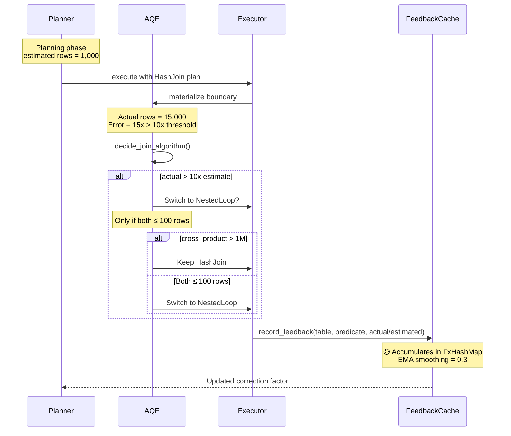

#### C.5 Cardinality Feedback

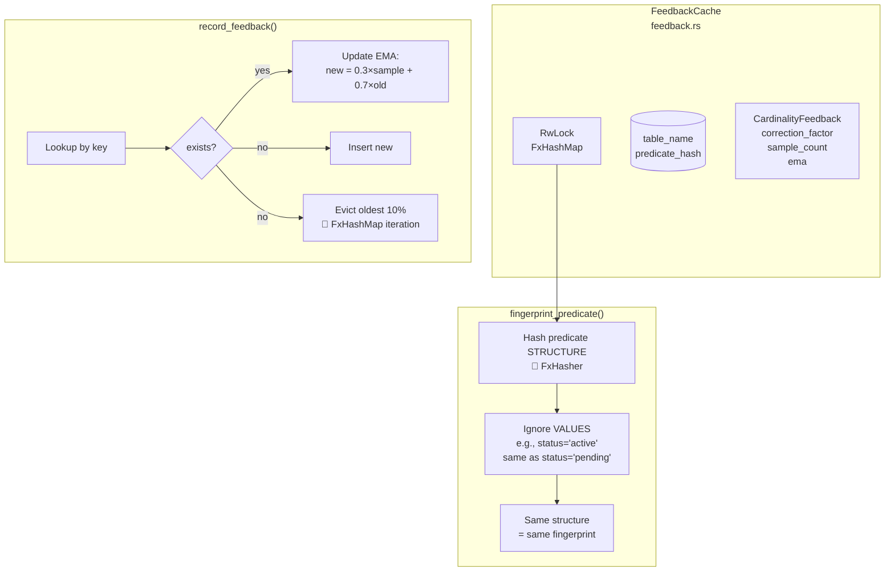

#### C.6 Bloom Filter — Non-Deterministic Hashing

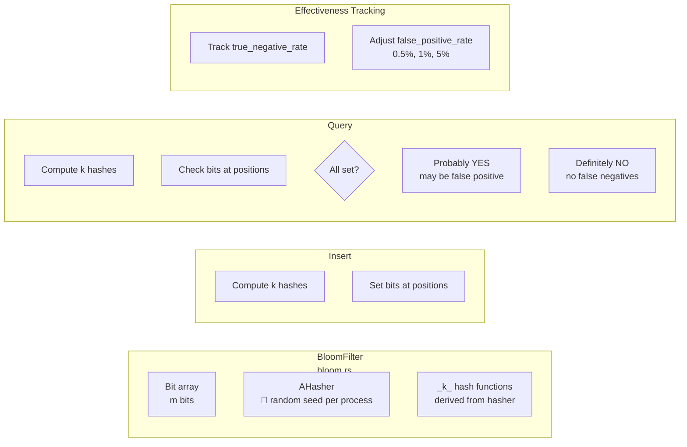

#### C.7 Key Non-Determinism Sources

| Location | Issue | Class | Impact |
|----------|-------|-------|--------|
| `cost.rs` — tie-breaking | When two access methods have equal cost, first wins | B | Different plans across nodes |
| `join.rs:568` — DP | Equal-cost partitions: first partition wins | B | Different join orders |
| `join.rs:891` — greedy | Equal-cost pairs: earlier pair wins | B | Different join tree shape |
| `feedback.rs:149` — FeedbackCache | `FxHashMap` lookup/eviction order | B | Different correction factors |
| `feedback.rs:182` — RwLock race | Concurrent EMA updates, last-writer-wins | B | Feedback oscillates |
| `bloom.rs:222` — AHasher | Random seed per process | B | Different bit patterns |
| `simplify.rs` — recursion | Simplification traversal order | B | Different intermediate forms |
| `workload.rs:261` — FxHashMap | Pattern eviction order | B | Different workload hints |
| `planner.rs:1060` — runtime swap | Build/probe swap based on runtime cardinality | B | Different execution path |

---

## Problem Statement

Distributed ledgers and blockchain databases require **deterministic execution**: every node that processes the same operations from the same starting state must reach bit-identical state. Non-determinism breaks consensus, invalidates cryptographic proofs, and enables equivocation.

Stoolap already targets blockchain use cases — it has a `consensus/` module with block structures, Merkle roots, and a `determ/` module for deterministic types. But the core database engine has production features that are inherently non-deterministic. This research systematically audits those features and maps a path to full determinism.

---

## Research Scope

### Included
- All Stoolap source modules (verified via GitNexus: 13,848 symbols, 45,844 edges)
- Transaction and MVCC engine
- Storage engine (B-tree, Hash, HNSW indexes)
- Query optimizer and executor
- Parallel execution
- Consensus and blockchain integration layer
- Existing `determ/` module

### Excluded
- Stoolap fork/modification (this is research only)
- Performance benchmarking
- Distributed networking layer (assumed honest peer model)

---

## Findings

### Current Stoolap Determinism Infrastructure

Stoolap already has meaningful infrastructure for deterministic execution:

#### 1. `determ/` Module — Deterministic Value Types

```rust
// src/determ/value.rs
pub enum DetermValue {
    Integer(i64),
    Float(f64),        // Uses bit-level comparison, not IEEE equality
    InlineText([u8; 15], u8),
    HeapText(Box<[u8]>),
    Boolean(bool),
    Timestamp(i64),    // Nanoseconds since epoch — not wall-clock
    // ...
}
```

Key properties:
- No `Arc`, no pointers — predictable memory layout
- Float comparison via `a.to_bits() == b.to_bits()` (bit-exact)
- `DetermRow`, `DetermMap`, `DetermSet` also defined
- Merkle hashing via SHA-256 built in

#### 2. `consensus/` Module — Blockchain Operation Log

```rust
// src/consensus/block.rs
pub struct BlockHeader {
    pub block_number: u64,
    pub parent_hash: [u8; 32],
    pub state_root_before: [u8; 32],
    pub state_root_after: [u8; 32],
    pub operation_root: [u8; 32],
    pub timestamp: u64,
    pub proposer: [u8; 32],
    // ...
}
```

Operations are serialized to bytes with canonical encoding. The block header hash (SHA-256) and operation Merkle root provide tamper-evident logging.

#### 3. `core/value.rs` — Value Type with Bit-Exact Float

The main `Value` enum uses bit-level float comparison via `f64::to_bits()`, matching the approach in `DetermValue`. Both types avoid IEEE `NaN != NaN` semantics. The `determ/` types (`DetermValue`, `DetermRow`) are separate from the main types — they exist as a parallel blockchain-oriented type system rather than a full replacement. For full determinism, the consensus path would need to consistently use `determ/` types throughout.

---

### Non-Deterministic Elements (Mapped by Execution Class)

#### Class A — Protocol Deterministic (MUST be deterministic across all implementations)

These are consensus-critical and **must** be fixed for full blockchain determinism.

| Element | Location | Issue | Fix Required |
|---------|----------|-------|--------------|
| **HNSW Layer Generation (build/insert)** | `src/storage/index/hnsw.rs:2306` | `rand::random()` used for layer assignment during graph build — changes the index structure itself | Replace with seeded PRNG (ChaCha8). Store `layer_seed` in HNSW index metadata for reproducible reconstruction. **This is Class A** — the built graph must be identical across all nodes |
| **HNSW Vector Search (runtime)** | `src/storage/index/hnsw.rs` | Approximate nearest neighbor — results vary across runs even with identical graphs due to tie-breaking in the max-heap | This is **Class C** — inherently probabilistic, acceptable for AI agent memory only |
| **Transaction ID Generation** | `src/storage/mvcc/registry.rs:317` | `AtomicI64::fetch_add` — txn IDs depend on interleaving of concurrent transactions | Replace with **sequence number from blockchain block** as txn ID source. All nodes derive txn IDs deterministically from agreed-upon block state |
| **Commit Sequence Generation** | `src/storage/mvcc/registry.rs:318` | `AtomicI64::fetch_add` for `next_sequence` — `commit_seq` affects MVCC visibility ordering | Same fix as txn_id: derive from block number + tx index. All visibility decisions must be reproducible across nodes |
| **FxHashMap Iteration Order** | 64 files, 429 total pattern matches | HashMap iteration order is unspecified for equal keys; FxHash/AHash are randomized per process | Replace with `BTreeMap` (sorted by key) **or** a deterministic hasher based on SHA-256. BTreeMap is O(log N) vs O(1); if O(1) is needed, a cryptographic hasher preserves performance while guaranteeing determinism |
| **Semantic Query Cache** | `src/executor/semantic_cache.rs` | Cache key is query string; accumulated state from prior executions differs across nodes | Require canonical cache key (e.g., SHA-256 hash of normalized SQL). Cache contents must be derived deterministically from the verified query log, not accumulated independently per node. In blockchain mode, cache should be disabled or treated as untrusted |
| **Parallel Chunk Assignment + Merge** | `src/executor/parallel.rs` | Rayon work-stealing scheduler causes non-deterministic task ordering. Even with deterministic chunk boundaries, the **merge phase** results depend on thread completion order | Use deterministic chunking: `chunk_id = row_index / chunk_size`. Merge results in a **single-threaded, stable sort** after all chunks complete, using a deterministic total order on rows |

#### Class B — Deterministic When Configured Correctly (Class B per CipherOcto taxonomy)

These require explicit configuration or version pinning but can be made deterministic.

| Element | Location | Issue | Fix Required |
|---------|----------|-------|--------------|
| **Adaptive Query Execution (AQE)** | `src/optimizer/feedback.rs` | Runtime plan switching based on observed cardinalities — non-reproducible across nodes | Disable AQE for blockchain mode (`aqe = false`). Alternatively: log all plan-switching decisions to the operation log so they are verifiable artifacts of execution |
| **Cardinality Feedback** | `src/optimizer/feedback.rs:47` | Stores correction factors from past executions in `FxHashMap` | For blockchain: disable, or seed the `FxHashMap` with a canonical empty state, or replace with `BTreeMap` |
| **Cost-Based Optimizer Plan Selection** | `src/optimizer/cost.rs` | Ties in cost estimation may be broken arbitrarily | Break ties deterministically (e.g., prefer alphabetically earlier plan name). Use fixed/canonical statistics for blockchain mode, not dynamically collected `ANALYZE` statistics |
| **Parallel Aggregation** | `src/executor/aggregation.rs` | Hash aggregation uses `FxHashMap` internally — iteration order during hash probing is non-deterministic | Replace with `BTreeMap` or deterministic hasher (same as FxHashMap fix) |
| **Parallel Hash Join Build** | `src/executor/hash_table.rs` | Hash table construction uses `FxHashMap` | Same as above |

#### Class C — Probabilistic (Non-Deterministic by Nature)

These are explicitly excluded from consensus but may be used in agent behavior.

| Element | Location | Class | Notes |
|---------|----------|-------|-------|
| **HNSW Vector Search (runtime)** | `src/storage/index/hnsw.rs` | C | Approximate nearest neighbor — inherently probabilistic, non-reproducible results across runs. **Must not affect consensus-critical state.** Appropriate for AI agent semantic memory only |
| **Bloom Filters** | `src/optimizer/bloom.rs` | C | Probabilistic membership test. Appropriate for filtering but **must not** be the sole gate for state-modifying operations |

---

### Key Architectural Observations

#### 1. Deterministic Types Already Exist but Are Not Used Universally

The `determ/` module defines `DetermValue`, `DetermRow`, `DetermMap`, `DetermSet` with:
- No `Arc` or heap pointers
- Bit-exact float comparison
- Deterministic ordering

But the main `core/value.rs` Value type also exists in parallel. The `determ/` types appear to be **separate from** rather than **a replacement for** the main types. For full determinism, a unified type system would be needed.

#### 2. HashMap Usage Is Pervasive

GitNexus analysis found **429 occurrences** of `FxHashMap`/`FxHashSet`/`ahash` across **64 files**. This is the single largest source of non-determinism — every `FxHashMap` iteration, every hash aggregation, every hash join uses it. Replacing all HashMaps with BTreeMaps is a large but well-defined task.

#### 3. Transaction ID and Commit Sequence Generation Is the Critical Consensus Issue

The MVCC registry uses `AtomicI64::fetch_add` for both transaction ID and commit sequence generation:

```rust
// src/storage/mvcc/registry.rs:317-318
let txn_id = self.next_txn_id.fetch_add(1, Ordering::AcqRel) + 1;
let begin_seq = self.next_sequence.fetch_add(1, Ordering::AcqRel) + 1;
```

Both `txn_id` and `commit_seq` are consensus-critical:

- **`txn_id`**: Used as the global identifier for a transaction across all nodes. Two nodes with different transaction interleaving will assign different IDs to the same logical operation.
- **`commit_seq`**: Used for MVCC visibility ordering. If node A assigns commit_seq=50 to a transaction and node B assigns commit_seq=51, they have different visibility boundaries.

**Proposed fix**: Derive both `txn_id` and `commit_seq` from the blockchain block number + transaction index within the block. For example: `txn_id = block_number * 1_000_000 + tx_index`. All nodes must agree on the ordering of transactions within a block before executing them. The local `begin_seq` can remain as an internal ordering aid but must not be used as a cross-node identifier.

#### 4. Consensus Module Is Well-Structured for Determinism

The `consensus/block.rs` block header structure is clean:
- All fields are fixed-size or length-prefixed
- SHA-256 hashing is used canonically
- Merkle root computation over operations is deterministic
- Block operations are serialized with explicit type tags

This is a solid foundation — the consensus layer itself is not the problem.

#### 5. The `rand` Crate Is Used Only in HNSW

Searching the codebase for `rand::random`, `rand::thread_rng`, etc., shows that random number generation is **exclusively used in HNSW index construction**. The HNSW `random_level()` function:

```rust
// src/storage/index/hnsw.rs:2306
fn random_level(ml: f64) -> usize {
    let r: f64 = rand::random::<f64>().max(1e-15);
    (-r.ln() * ml).floor() as usize
}
```

This is the **only** source of external entropy in the codebase. All other "random-looking" behavior (HashMap ordering, atomic interleaving) is pseudodeterministic or implementation-dependent, not truly random — but still non-deterministic for consensus purposes.

#### 6. `BlockHeader.timestamp` — Wall-Clock Time Is Non-Deterministic

The `BlockHeader` struct includes `timestamp: u64`. If this field is populated from the system clock, different nodes will compute different timestamps for the same block, breaking header hash equivalence. The fix is to derive the timestamp from the blockchain's agreed-upon time source — either the block number itself (treating block number as a proxy for time) or a validator-provided timestamp that is part of the consensus protocol. The current implementation must be audited to confirm whether `timestamp` is already protocol-derived or is system-clock populated.

---

## Recommendations

### Recommended Approach: Tiered Determinism

Rather than a single "fully deterministic mode," adopt CipherOcto's execution class model:

**For consensus-critical path (Class A):**
1. Replace `rand::random()` in HNSW with seeded PRNG (ChaCha8, key stored in index metadata)
2. Replace all `FxHashMap`/`FxHashSet`/`AHashMap` with `BTreeMap`/`BTreeSet` **or** a deterministic hasher in:
   - MVCC engine (`engine.rs`, `version_store.rs`, `table.rs`)
   - Query executor (hash joins, aggregations, window functions)
   - Optimizer (cost model, join planning, statistics)
   - Use `BTreeMap` for maps where sorted iteration is also beneficial. Use a SHA-256-based deterministic hasher for hot paths where O(1) is critical
3. Derive **both** `txn_id` and `commit_seq` from blockchain block number + tx index
4. Derive `BlockHeader::timestamp` from the consensus protocol's time source, not system clock
5. Disable AQE, cardinality feedback, and semantic query cache for consensus mode
6. Use deterministic chunking + single-threaded stable-order merge in parallel execution

**For AI agent / non-consensus path (Class C):**
- HNSW vector search remains probabilistic — this is acceptable for semantic memory
- AQE remains adaptive — this is appropriate for performance optimization

### Risks

| Risk | Severity | Mitigation |
|------|----------|------------|
| Performance regression from BTreeMap replacing HashMap | Medium | BTreeMap is O(log N) vs O(1). For hot paths (hash joins, aggregations), consider a **deterministic hasher** (e.g., SHA-256 keyed by input bytes) — this preserves O(1) average while guaranteeing deterministic iteration order |
| HNSW index rebuild required to switch to deterministic mode | Low | Store seed in index metadata; if absent, rebuild with seeded PRNG |
| Breaking existing MVCC semantics | High | Transaction ID and commit_seq change requires auditing all consumers of `txn_id` and `commit_seq` across the codebase |
| Parallel query performance with deterministic merge | Low | Single-threaded stable merge is fast; main parallel work is unaffected |
| **HNSW index serialization for blockchain state** | **High** | If HNSW graphs are part of blockchain state, the serialized graph must be reproducible. Options: (a) store seed and rebuild on load, (b) include graph structure hash in state root, (c) exclude HNSW from consensus state entirely (treat as Class C) |

### Open Questions

1. **Transaction ID Scope**: Should blockchain-mode txn_ids be scoped to a block (`block_number * 1_000_000 + tx_index`) or globally unique? Global uniqueness simplifies MVCC visibility comparisons but requires cross-node coordination to ensure no collisions. Block-scoped IDs are simpler but require a global counter for inter-block uniqueness.
2. **Statistics for Cost Model**: Should blockchain mode use fixed/canonical statistics, or derive them from the genesis state? If dynamically collected via `ANALYZE`, different nodes may produce slightly different statistics depending on data order.

---

## Related RFCs and Documents

This research intersects with several existing CipherOcto RFCs and research documents. The table below maps determinism sources to their corresponding specifications.

### RFC Cross-Reference

| RFC | Title | Relevance to This Research |
|-----|-------|---------------------------|
| **RFC-0303** (Draft, Retrieval) | [Deterministic Vector Index (HNSW-D)](../../rfcs/draft/retrieval/0303-deterministic-vector-index.md) | **Direct companion.** Defines SHA-256-based deterministic level assignment, canonical neighbor selection, and deterministic search ordering for HNSW. Provides the exact algorithm for fixing the `rand::random()` issue in stoolap's `hnsw.rs:2306`. Also defines `HNSW-D` with fixed-point L2 distance via RFC-0148. |
| **RFC-0003** (Draft, Process) | [Deterministic Execution Standard (DES)](../../rfcs/draft/process/0003-deterministic-execution-standard.md) | **Governing standard.** Defines global determinism rules for the CipherOcto protocol — numeric types (RFC-0106), vector indexing, retrieval pipelines. The DES is the parent standard this research extends into the stoolap context. |
| **RFC-0129** (Planned, Numeric) | [Deterministic RNG](../../rfcs/planned/numeric/0129-deterministic-rng.md) | **Direct companion.** Planned RFC for ChaCha8 seeded from block hash — exactly the fix recommended for HNSW layer generation. RFC-0303's implementation will depend on this. |
| **RFC-0304** (Draft, Retrieval) | [Verifiable Vector Query Execution (VVQE)](../../rfcs/draft/retrieval/0304-verifiable-vector-query-execution.md) | **Layer above HNSW-D.** Defines deterministic ANN query layer with SQL integration and proof generation. Builds on RFC-0303 (HNSW-D) and RFC-0107 (Vector-SQL). |
| **RFC-0520** (Draft, AI Execution) | [Deterministic AI VM](../../rfcs/draft/ai-execution/0520-deterministic-ai-vm.md) | **Broader scope.** Deterministic AI execution across heterogeneous hardware. Shares the same determinism taxonomy (Class A/B/C) and references RFC-0106 (Numeric Tower). |
| **RFC-0200** (Draft, Storage) | [Production Vector SQL Storage v2](../../rfcs/draft/storage/0200-production-vector-sql-storage-v2.md) | **Sibling spec.** Production vector SQL operations built on top of HNSW-D. Relevant if HNSW becomes consensus-state. |
| **RFC-0916** (Planned, Retrieval) | [TurboHNSW Quantized Index](../../rfcs/planned/retrieval/0916-turbohnsw-quantized-index.md) | **Future optimization.** PQ-quantized HNSW for memory efficiency. Deterministic version would need to follow RFC-0303's determinism patterns. |

### Related Research Documents

| Document | Title | Relevance |
|----------|-------|-----------|
| `docs/research/qdrant-research.md` | Qdrant Research Report | Reference architecture for production vector search. Qdrant's segment-based design with HNSW + payload indexes is a model for how HNSW-D could integrate with SQL storage. |
| `docs/research/stoolap-agent-memory-gap-analysis.md` | Stoolap → Agent Memory Gap Analysis | Confirms that stoolap's foundational layer (MVCC, WAL, HNSW, Merkle, ZK) is complete. The remaining gap is the **agent memory abstraction layer**, not the vector index itself. |
| `docs/use-cases/verifiable-agent-memory-layer.md` | Verifiable Agent Memory Layer | The use case for agent-owned cryptographic memory. HNSW vector search is a critical component of this — this research confirms the determinism requirements are achievable. |

### RFC Dependency Chain

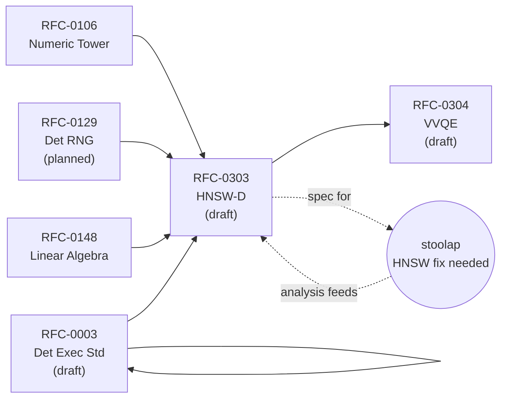

### Critical Gap: HNSW-D vs. Stoolap HNSW

**Important distinction:** RFC-0303 (HNSW-D) is a **CipherOcto crate specification** (`crates/octo-vector/src/hnsw_d.rs`). Stoolap is an **external dependency** with its own HNSW implementation (`stoolap/src/storage/index/hnsw.rs`) using `rand::random()`. The fix for stoolap must be applied within stoolap itself — RFC-0303 provides the **algorithm specification** but cannot directly modify stoolap's code.

For CipherOcto's purposes, there are two paths:
1. **Fork stoolap** and apply the HNSW-D algorithm to create a deterministic variant
2. **Build HNSW-D as a separate crate** within CipherOcto's `crates/` workspace, exposing deterministic vector indexes that integrate with the consensus layer while stoolap remains non-deterministic for its primary embedded-SQL use case

The choice depends on whether stoolap is intended as the sole storage engine or as one of several storage backends.

---

## Next Steps

- **Create Use Case?** Yes. The blockchain-SQL integration use case already exists at `docs/use-cases/blockchain-sql-database.md`. This research extends it.
- **Propose RFC?** Yes. Recommend an RFC in the **Storage** category (0200-0299) defining the Deterministic Stoolap configuration profile and the required changes.
- **Priority**: P0 — this is prerequisite for any blockchain consensus integration.

---

## Appendix: Detailed Non-Determinism Inventory

### Files with FxHashMap/FxHashSet

**Note:** "429 total occurrences" refers to grep pattern matches across 64 files — not 429 distinct HashMap instances. Many matches are in the same file (e.g., multiple `FxHashMap::new()` calls). The module breakdown below shows pattern-match counts per module.

| Module | Files | Pattern Matches | Impact |
|--------|-------|-----------------|--------|
| `src/executor/` | 17 files | ~180 | Hash joins, aggregations, query context, subqueries |
| `src/storage/` | 14 files | ~100 | MVCC version store, table, indexes, expression |
| `src/optimizer/` | 6 files | ~60 | Cost model, join planning, AQE feedback, bloom filters |
| `src/parser/` | 2 files | ~8 | Token handling, AST |
| `src/api/` | 3 files | ~12 | Database handles, parameters |
| Other | 22 files | ~69 | Common utilities, functions |

The actual number of distinct HashMap construction sites requiring replacement is far smaller than 429. Each site must be evaluated individually to determine whether the map's iteration order affects consensus-critical paths.

### Files with `rand` Usage

| File | Function | Purpose |
|------|----------|---------|
| `src/storage/index/hnsw.rs` | `random_level()` | HNSW layer assignment — **only randomness source** |

### Consensus-Critical Code Paths

1. `TransactionRegistry::begin_transaction()` → assigns `txn_id` via atomic fetch-add (**Class A**)
2. `TransactionRegistry::commit_transaction()` → assigns `commit_seq` via atomic fetch-add (**Class A**)
3. `MvccEngine::begin_txn()` → uses registry-generated IDs
4. `HnswIndex::insert()` → calls `random_level()` using `rand::random()` (**Class A**)
5. `consensus/block.rs:BlockHeader::hash()` → SHA-256 over canonical serialization
6. `consensus/block.rs:BlockOperations::compute_operation_root()` → Merkle tree over operations

---

**Research Date**: 2026-03-31
**Tools Used**: GitNexus (cipherocto index), source code analysis
**Codebase Reference**: stoolap@9ef6825 (March 2026)
