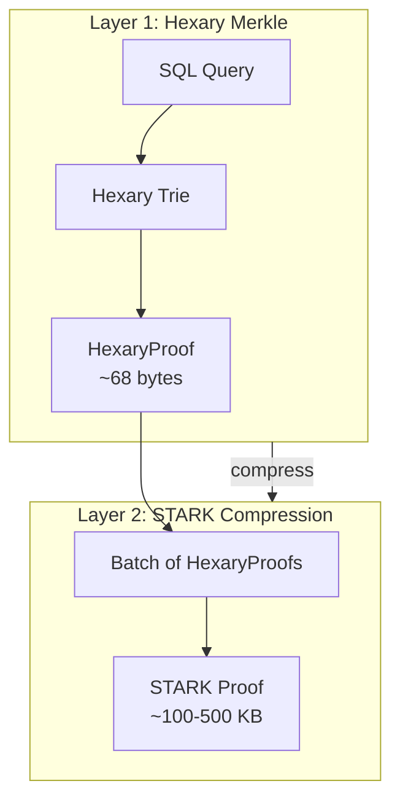
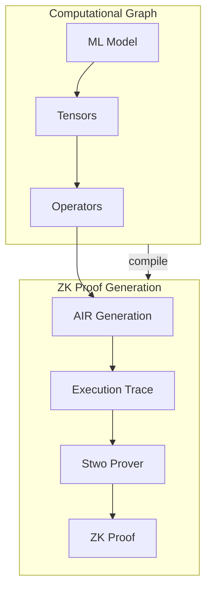
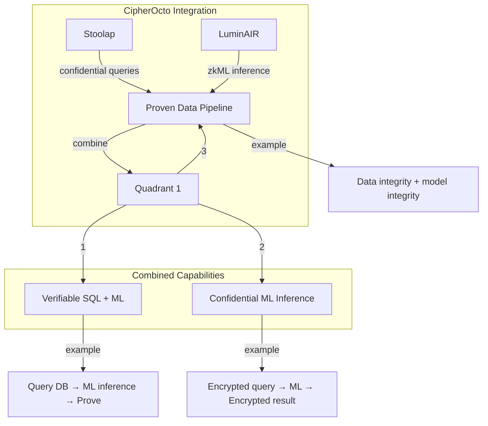
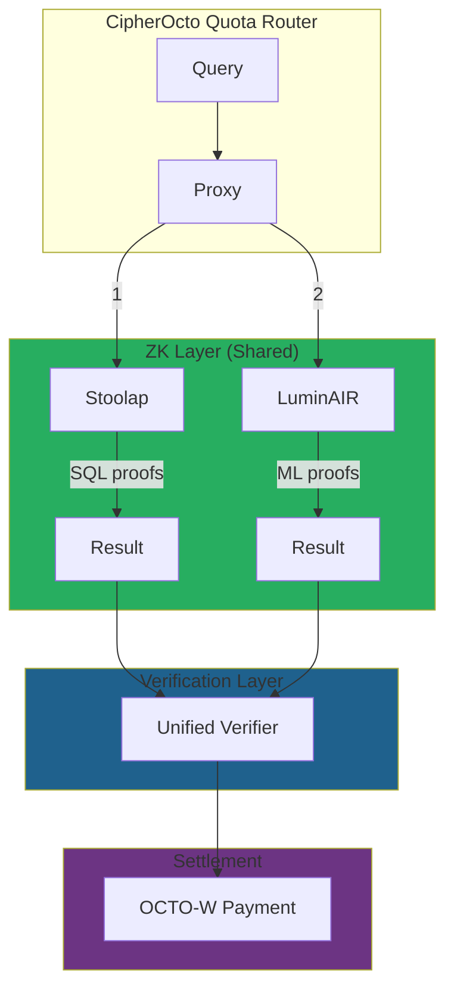

# Research: Stoolap ZK Extensions vs LuminAIR Comparison

## Executive Summary

This report provides a comprehensive technical comparison between the zero-knowledge proof systems implemented in **Stoolap** (blockchain SQL database) and **LuminAIR** (zkML framework by Giza). Both leverage Circle STARKs and Stwo prover, but serve different domains and have complementary capabilities.

## Overview

| Aspect | Stoolap | LuminAIR |
|--------|---------|----------|
| **Domain** | Blockchain SQL database | Machine learning inference |
| **Primary Proof Type** | Merkle (Hexary) + STARK | STARK (zkML) |
| **Prover** | Stwo (Circle STARKs) | Stwo (Circle STARKs) |
| **Language** | Rust | Rust |
| **Target** | Database integrity, confidential queries | ML computation integrity |
| **Status** | Phase 2 Complete | Phase 1 Active |

---

## Core Technology Comparison

### 1. Proof System

#### Stoolap: Dual-Layer Proofs



**Key Features:**
- **HexaryProof**: 16-way trie Merkle proofs (~68 bytes)
- **CompressedProof**: Aggregate multiple HexaryProofs into one STARK
- **Proof size**: 100-500 KB (STARK)
- **Verification**: ~2-3 μs (Hexary), depends on STARK (LuminAIR)

#### LuminAIR: zkML Proofs



**Key Features:**
- **Operators**: 11 primitive operators, Mul, Sin (Add, Exp2, etc.)
- **AIR**: Algebraic Intermediate Representation per operator
- **Trace**: Execution trace for each operator
- **LogUp**: Lookup argument for tensor data flow

### 2. Field & Curve

| Component | Stoolap | LuminAIR |
|-----------|---------|----------|
| **Field** | M31 (2^31 - 1) | M31 (2^31 - 1) |
| **Curve** | Circle STARK | Circle STARK |
| **Prover** | Stwo | Stwo |
| **Verifier** | Rust + Cairo plugin | Rust (WASM planned) |

**Note**: Both use the same underlying technology - Stwo prover with M31 prime field.

### 3. Commitment Schemes

#### Stoolap

```rust
// Pedersen commitments for confidential queries
pub struct Commitment {
    point: Point,
    randomness: Scalar,
}

// Commitment to filter values
pub struct EncryptedFilter {
    column: Vec<u8>,
    operator: FilterOp,
    value_commitment: Commitment,
    nonce: [u8; 32],
}
```

#### LuminAIR

```rust
// LogUp lookup argument for tensor data flow
// Ensures output of one operator = input of next
// Uses M31 field arithmetic
```

**Comparison:**

| Aspect | Stoolap | LuminAIR |
|--------|---------|----------|
| **Commitment** | Pedersen (discrete log) | LogUp (lookup) |
| **Purpose** | Hide filter values | Prove tensor flow |
| **Integration** | SQL filters | ML operator chains |

---

## Architecture Comparison

### Stoolap ZK Architecture

```
┌─────────────────────────────────────────────────────────────┐
│                      Stoolap ZK Stack                        │
├─────────────────────────────────────────────────────────────┤
│  Applications                                                │
│  ┌─────────────┐  ┌─────────────┐  ┌─────────────┐         │
│  │SQL Queries  │  │Confidential │  │  L2 Rollup  │         │
│  │             │  │   Queries   │  │             │         │
│  └──────┬──────┘  └──────┬──────┘  └──────┬──────┘         │
│         │                │                │                 │
├─────────┴────────────────┴────────────────┴─────────────────┤
│  Proof Generation                                            │
│  ┌─────────────────────────────────────────────────────┐   │
│  │  HexaryProof → CompressedProof → StarkProof        │   │
│  │  (Merkle)     (Batching)       (STWO)               │   │
│  └─────────────────────────────────────────────────────┘   │
├─────────────────────────────────────────────────────────────┤
│  Cairo Programs                                              │
│  ┌───────────────┐ ┌───────────────┐ ┌───────────────┐     │
│  │hexary_verify  │ │merkle_batch   │ │state_transition│    │
│  └───────────────┘ └───────────────┘ └───────────────┘     │
├─────────────────────────────────────────────────────────────┤
│  STWO Integration (Plugin Architecture)                      │
└─────────────────────────────────────────────────────────────┘
```

### LuminAIR zkML Architecture

```
┌─────────────────────────────────────────────────────────────┐
│                    LuminAIR zkML Stack                      │
├─────────────────────────────────────────────────────────────┤
│  Applications                                                │
│  ┌─────────────┐  ┌─────────────┐  ┌─────────────┐         │
│  │Verifiable   │  │Trustless   │  │Privacy      │         │
│  │DeFi Agents  │  │Inference   │  │Preserving ML│         │
│  └──────┬──────┘  └──────┬──────┘  └──────┬──────┘         │
│         │                │                │                 │
├─────────┴────────────────┴────────────────┴─────────────────┤
│  Prover (Stwo)                                              │
│  ┌─────────────────────────────────────────────────────┐   │
│  │  Computational Graph → AIR → Trace → Proof         │   │
│  │  (Luminal)        (StwoCompiler)  (Stwo)           │   │
│  └─────────────────────────────────────────────────────┘   │
├─────────────────────────────────────────────────────────────┤
│  Primitive Operators (11)                                    │
│  ┌───────┐ ┌───────┐ ┌───────┐ ┌───────┐ ┌───────┐        │
│  │Add/Mul│ │Exp2   │ │ Sin   │ │ Sqrt  │ │ Log2  │ ...   │
│  └───────┘ └───────┘ └───────┘ └───────┘ └───────┘        │
├─────────────────────────────────────────────────────────────┤
│  Data Flow: LogUp Lookup Argument                            │
│  ┌─────────────────────────────────────────────────────┐   │
│  │  Output Yields = Input Consumes (multiplicity)      │   │
│  └─────────────────────────────────────────────────────┘   │
└─────────────────────────────────────────────────────────────┘
```

---

## Feature Comparison Matrix

| Feature | Stoolap | LuminAIR | Notes |
|---------|---------|----------|-------|
| **Proof Type** | | | |
| Merkle (Hexary) | ✅ | ❌ | Stoolap-specific |
| STARK (Circle) | ✅ | ✅ | Both use Stwo |
| zkML | ❌ | ✅ | LuminAIR specialty |
| **Operators** | | | |
| Primitive set | N/A | 11 | LuminAIR ML-focused |
| SQL operations | ✅ | ❌ | Stoolap database |
| ML operations | ❌ | ✅ | LuminAIR compute |
| **Confidentiality** | | | |
| Pedersen commitments | ✅ | ❌ | Stoolap |
| LogUp lookup | ❌ | ✅ | LuminAIR |
| Encrypted queries | ✅ | Partial | Both |
| **Verification** | | | |
| Rust verifier | ✅ | ✅ | Current |
| WASM verifier | ❌ | 🔜 | LuminAIR Phase 2 |
| Cairo (on-chain) | ✅ | 🔜 | Both planned |
| **Performance** | | | |
| HexaryProof size | ~68 bytes | N/A | Stoolap |
| STARK proof | 100-500 KB | Varies | Model size |
| Hexary verify | ~2-3 μs | N/A | Stoolap |
| ML verify | N/A | ~seconds | LuminAIR |

---

## Detailed Capability Analysis

### 1. Proof Generation

#### Stoolap

```rust
// SQL query → HexaryProof → CompressedProof → StarkProof
let query_result = db.execute(query);
let hexary_proof = row_trie.prove(query_result)?;
let compressed = compress_proofs(batch_of_hexary)?;
let stark_proof = stwo_prover.prove(compressed)?;
```

**Flow:**
1. Execute SQL query
2. Generate HexaryProof (Merkle)
3. Batch multiple proofs
4. Compress to STARK
5. Submit to L2 or verify

#### LuminAIR

```rust
// ML Model → Graph → AIR → Trace → Proof
let mut cx = Graph::new();
let result = cx.tensor((2,2)).set(vec![1.0, 2.0, 3.0, 4.0]);
cx.compile(<(GenericCompiler, StwoCompiler)>::default(), &mut d);
let trace = cx.gen_trace()?;
let proof = cx.prove(trace)?;
cx.verify(proof)?;
```

**Flow:**
1. Build computational graph
2. Define operators
3. Compile to AIR (StwoCompiler)
4. Generate execution trace
5. Prove with Stwo
6. Verify proof

### 2. Data Flow Integrity

#### Stoolap: Hexary Trie

```rust
// Data flow in database operations
struct HexaryProof {
    key: Vec<u8>,
    value: Vec<u8>,
    siblings: Vec<FieldElement>,  // 16-way
    path: NibblePath,
}
```

- **Structure**: 16-way branching (nibble-based)
- **Proof size**: ~68 bytes typical
- **Verification**: ~2-3 microseconds
- **Use case**: SQL query result verification

#### LuminAIR: LogUp

```rust
// Data flow between ML operators
// Output Yields (positive multiplicity)
// Input Consumes (negative multiplicity)
// Ensures tensor flows correctly through graph
```

- **Purpose**: Prove operator outputs connect to correct inputs
- **Method**: LogUp lookup argument
- **Use case**: ML inference integrity

### 3. Confidential Queries

#### Stoolap (RFC-0203)

```rust
// Confidential SQL query
struct EncryptedQuery {
    encrypted_sql: Vec<u8>,
    input_commitments: Vec<Commitment>,
    range_proofs: Vec<RangeProof>,
}

struct EncryptedFilter {
    column: Vec<u8>,
    operator: FilterOp,
    value_commitment: Commitment,
    nonce: [u8; 32],
}
```

**Capabilities:**
- ✅ Encrypted WHERE clauses
- ✅ Commitment-based filters
- ✅ Range proofs
- ✅ Result verification without revealing data

#### LuminAIR

- Partial support via encrypted inputs
- Future: selective disclosure
- Focus is integrity, not confidentiality

### 4. Verification

#### Stoolap

```rust
// Rust verification
pub fn verify_hexary(proof: &HexaryProof, root: &FieldElement) -> bool;

// Cairo on-chain (via plugin)
pub fn verify_stark_cairo(proof: &StarkProof) -> Result<bool, VerifyError>;
```

#### LuminAIR

```rust
// Rust verification (current)
cx.verify(proof)?;

// Planned: WASM verifier
// Planned: Cairo verifier (on-chain)
```

---

## Complementary Capabilities

### What Stoolap Does Better

| Capability | Stoolap Advantage |
|-----------|------------------|
| **Database proofs** | HexaryProof specifically designed for trie/table verification |
| **Batch verification** | Efficient parallel batch verification |
| **SQL integrity** | Query result verification with merkle proofs |
| **Confidential queries** | Full Pedersen commitment scheme |
| **L2 rollup** | Complete rollup protocol implemented |

### What LuminAIR Does Better

| Capability | LuminAIR Advantage |
|-----------|------------------|
| **zkML** | Purpose-built for ML inference proofs |
| **Operator library** | 11 primitive ML operators |
| **AIR generation** | Automatic from computational graph |
| **Data flow proof** | LogUp for tensor connections |
| **SIMD parallel** | Native SIMD backend |

### Synergies for CipherOcto



---

## CipherOcto Integration Opportunities

### 1. Shared Infrastructure

Both systems use:
- **Stwo prover** (Circle STARKs)
- **M31 prime field**
- **Rust implementation**
- **Cairo verification (planned)**

This creates natural synergy for CipherOcto.

### 2. Recommended Architecture



### 3. Use Case Mapping

| CipherOcto Need | Best Fit | Implementation |
|-----------------|----------|----------------|
| Query integrity | Stoolap | HexaryProof for routing logs |
| ML inference proof | LuminAIR | zkML for agent execution |
| Confidential routing | Stoolap | Pedersen commitments |
| Verifiable quality | LuminAIR | Output validity proofs |
| Data pipeline | Both | Combined SQL + ML proofs |

## STWO Proof Benchmarks

### Stoolap (STWO for Database Operations)

| Operation | Time | Details| |
|-----------|---------------|
| **Proof Generation** (merkle_batch) | ~25-28 seconds | Cairo program for batch verification |
| **Proof Verification** | ~15 ms | Using stwo-cairo verifier |
| **HexaryProof** (no STWO) | ~2-3 μs | Lightweight Merkle proof only |

**Source:** `missions/archived/0106-01-stwo-real-benchmarks.md`

```rust
// Stoolap uses Blake2sMerkleChannel
prove_cairo::<Blake2sMerkleChannel>()  // ~25-28s
verify_cairo::<Blake2sMerkleChannel>() // ~15ms
```

### LuminAIR (STWO for ML Operations)

| Stage | Operation | Tensor Size | Status |
|-------|-----------|-------------|--------|
| Trace Generation | Add/Mul/Recip | 32x32 | Benchmarked |
| Proof Generation | Add/Mul/Recip | 32x32 | Benchmarked |
| Verification | Add/Mul/Recip | 32x32 | Benchmarked |

**Source:** `crates/graph/benches/ops.rs` - benchmarks run on GitHub Actions, published to https://gizatechxyz.github.io/LuminAIR/bench/

```rust
// LuminAIR benchmarks the full pipeline
// - Trace generation: graph.gen_trace()
// - Proof generation: prove(trace, settings)
// - Verification: verify(proof, settings)
```

### Comparison Analysis

| Metric | Stoolap | LuminAIR | Notes |
|--------|---------|----------|-------|
| **Workload** | Merkle batch (SQL) | ML operators (tensors) | Different domains |
| **Proving** | ~25-28s | Unknown* | *Results not publicly listed |
| **Verification** | ~15ms | Unknown* | *Published to web UI |
| **Tensor size** | N/A | 32x32 (tested) | Scales with complexity |
| **Proof size** | 100-500 KB | Varies | Depends on model |

### Is LuminAIR Better?

**It depends on the use case:**

| Criterion | Stoolap | LuminAIR | Winner |
|-----------|---------|----------|--------|
| **Database proofs** | ✅ Specialized | ❌ Not designed | **Stoolap** |
| **ML inference proofs** | ❌ Not designed | ✅ Specialized | **LuminAIR** |
| **Proof size** | Optimized | Varies | **Stoolap** (for DB) |
| **Verification speed** | 15ms | Unknown | TBD |
| **Operator flexibility** | Fixed (SQL) | extensible (11+ operators) | **LuminAIR** |

### Key Insight

The systems are **not directly comparable** - they prove different things:
- **Stoolap**: Proves SQL query results are correct (merkle batch)
- **LuminAIR**: Proves ML inference executed correctly (zkML)

However, LuminAIR's approach could inspire **future optimizations** in Stoolap's proving pipeline.

---

## Recommendations

### Immediate (MVE)

1. **Use Stoolap for**:
   - Routing log integrity
   - Balance verification
   - Transaction proofs

2. **Reference LuminAIR for**:
   - Future zkML integration patterns
   - AIR generation approach
   - Operator design patterns

### Near-term (Phase 2)

1. **Integrate Stoolap**:
   - Confidential queries for privacy
   - Proof verification in Rust
   - Commitment schemes

2. **Adopt LuminAIR patterns**:
   - zkML for agent verification
   - Output validity proofs
   - WASM verifier (when ready)

### Future (Phase 3)

1. **Combined approach**:
   - On-chain verification (Cairo)
   - EigenLayer AVS integration
   - Unified proof standard

---

## Conclusion

| Aspect | Stoolap | LuminAIR | Verdict |
|--------|---------|----------|---------|
| **Database integrity** | ✅ Excellent | ❌ N/A | Stoolap for SQL |
| **ML integrity** | ❌ Not designed | ✅ Excellent | LuminAIR for zkML |
| **Confidentiality** | ✅ Advanced | ⚠️ Basic | Stoolap leads |
| **Verification** | ✅ Rust + Cairo | ✅ Rust + WASM | Both strong |
| **Performance** | ✅ Optimized | 🔄 Improving | Stoolap faster for DB |

**Key Finding**: Stoolap and LuminAIR are **complementary**, not competitive. Stoolap excels at database integrity and confidential queries. LuminAIR excels at ML inference verification. For CipherOcto, both can be leveraged:

- **Stoolap**: Query/routing integrity, confidential storage
- **LuminAIR**: Agent execution verification, output proofs

---

## References

- Stoolap: https://github.com/CipherOcto/stoolap
- LuminAIR: https://github.com/gizatechxyz/LuminAIR
- Stwo: https://github.com/starkware-libs/stwo
- Circle STARKs: https://eprint.iacr.org/2024/278
- LogUp: https://eprint.iacr.org/2022/1530

---

**Research Status:** Complete
**Prepared for:** CipherOcto ZK Integration Planning
