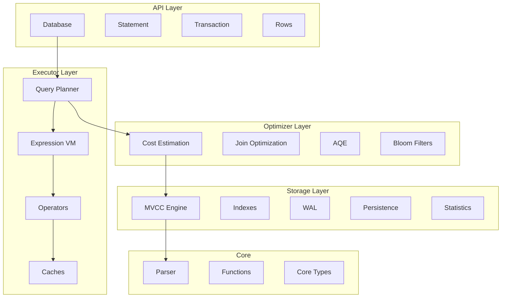
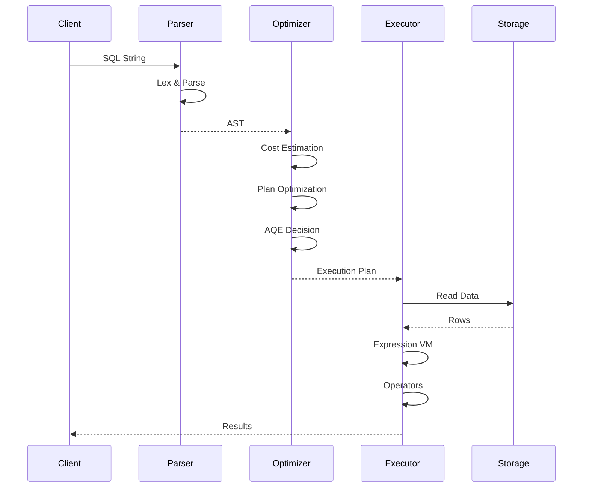

# Stoolap Research Report

**Project**: Stoolap - Modern Embedded SQL Database
**Location**: https://github.com/stulast/stoolap
**Date**: March 2026

---

## Executive Summary

Stoolap is a modern embedded SQL database written entirely in pure Rust (Apache 2.0 license). It targets low-latency transactional workloads and real-time analytical queries with modern SQL features and no external server process.

### Key Differentiators

| Feature                      | Stoolap  | SQLite    | DuckDB    | PostgreSQL |
| ---------------------------- | -------- | --------- | --------- | ---------- |
| **Time-Travel Queries**      | Built-in | No        | No        | Extension  |
| **MVCC Transactions**        | Yes      | No        | No        | Yes        |
| **Cost-Based Optimizer**     | Yes      | No        | Yes       | Yes        |
| **Adaptive Query Execution** | Yes      | No        | No        | Partial    |
| **Semantic Query Caching**   | Yes      | No        | No        | No         |
| **Parallel Query Execution** | Yes      | No        | Yes       | Yes        |
| **Native Vector Search**     | Yes      | Extension | Extension | Extension  |
| **Pure Rust**                | Yes      | No        | No        | No         |

---

## 1. Architecture

### 1.1 Layered Architecture



### 1.2 Main Source Modules

| Module       | Purpose                                                      |
| ------------ | ------------------------------------------------------------ |
| `api/`       | Public database interface (Database, Statement, Transaction) |
| `executor/`  | Query execution engine with parallel execution               |
| `optimizer/` | Cost-based optimization, AQE, join planning                  |
| `storage/`   | MVCC engine, indexes, WAL, persistence                       |
| `parser/`    | SQL parser (lexer, AST, statements)                          |
| `functions/` | 101+ built-in SQL functions                                  |
| `core/`      | Core types (DataType, Value, Row, Schema)                    |
| `consensus/` | Blockchain operation log (blocks, operations)                |
| `trie/`      | Merkle trie for state verification                           |
| `determ/`    | Deterministic value types                                    |

---

## 2. Core Features

### 2.1 MVCC Transactions

**Semantic Purpose**: Provides snapshot isolation allowing consistent reads without locking, enabling concurrent read/write operations without blocking.

**Implementation** (`src/storage/mvcc/engine.rs`):

```rust
pub struct MVCCEngine {
    // Version store: tracks multiple row versions
    versions: BTreeMap<RowKey, Vec<RowVersion>>,
    // Transaction registry: tracks active transactions
    tx_registry: TransactionRegistry,
    // Write set: modifications within transactions
    write_sets: HashMap<TxId, WriteSet>,
}
```

**Components**:

| Component             | Purpose                                     |
| --------------------- | ------------------------------------------- |
| `MvccTransaction`     | Transaction context                         |
| `TransactionRegistry` | Global transaction tracking                 |
| `RowVersion`          | Individual row version with metadata        |
| `VisibilityChecker`   | Determines visible versions per transaction |

**Isolation Levels**:

- `ReadUncommitted`: No isolation
- `ReadCommitted`: See committed changes (default)
- `Snapshot`: See snapshot at transaction start (MVCC)

### 2.2 Multiple Index Types

**Semantic Purpose**: Different access patterns require different index structures for optimal performance.

**Implementation** (`src/storage/index/mod.rs`):

| Index Type           | Use Case                     | Implementation  |
| -------------------- | ---------------------------- | --------------- |
| **BTreeIndex**       | Range queries, sorted access | Standard B-tree |
| **HashIndex**        | O(1) equality lookups        | Hash map based  |
| **BitmapIndex**      | Low-cardinality columns      | Roaring bitmaps |
| **HnswIndex**        | Vector similarity search     | HNSW algorithm  |
| **MultiColumnIndex** | Composite queries            | Composite keys  |
| **PkIndex**          | Primary key lookups          | Virtual index   |

### 2.3 Cost-Based Optimizer

**Semantic Purpose**: Selects optimal query execution plans based on data statistics rather than heuristic rules.

**Implementation** (`src/optimizer/mod.rs`):

```rust
pub struct Optimizer {
    // Statistics collector
    stats: Statistics,
    // Cost estimation
    cost_model: CostModel,
    // Join reordering
    join_optimizer: JoinOptimizer,
    // Adaptive query execution
    aqe: AdaptiveQueryExecution,
}
```

**Features**:

- **Statistics Collection**: Table/column statistics via `ANALYZE`
- **Histogram Support**: Range selectivity estimation
- **Zone Maps**: Segment pruning for columnar storage
- **Join Optimization**: Multiple join algorithms with cost estimation
- **Adaptive Query Execution (AQE)**: Runtime plan switching
- **Cardinality Feedback**: Learn from actual execution stats

### 2.4 Semantic Query Caching

**Semantic Purpose**: Intelligent caching that understands query semantics, not just exact string matches. A cached query with broader predicates can serve results for more specific queries.

**Implementation** (`src/executor/semantic_cache.rs`):

```rust
pub struct SemanticCache {
    // Cached query results
    cache: HashMap<QueryKey, CachedResult>,
    // Predicate analysis
    predicate_analyzer: PredicateAnalyzer,
}

impl SemanticCache {
    /// Predicate subsumption: broader query covers narrower one
    /// If cached: amount > 100, new query: amount > 150
    /// Filter cached results with additional predicate
    pub fn get_or_execute<F>(&self, query: &str, pred: Predicate) -> Option<Vec<Row>> {
        // Check if new predicate subsumes cached predicate
        if pred.subsumes(&cached_pred) {
            // Apply additional filter to cached results
            return Some(filter_results(cached_results, pred));
        }
        None
    }
}
```

**Capabilities**:

- **Predicate Subsumption**: `amount > 100` covers `amount > 150`
- **Numeric Range Tightening**: Narrow `>` and `<` predicates
- **Equality Subset**: `IN` clause narrowing
- **AND Conjunction Strengthening**: Adding more filters

### 2.5 Time-Travel Queries

**Semantic Purpose**: Access historical data at any point in time without maintaining separate history tables.

**SQL Syntax**:

```sql
-- Query data as of specific timestamp
SELECT * FROM accounts AS OF TIMESTAMP '2024-01-15 10:30:00';

-- Query data as of specific transaction
SELECT * FROM inventory AS OF TRANSACTION 1234;
```

**Implementation**: The MVCC engine maintains all row versions with timestamps and transaction IDs, enabling point-in-time queries.

### 2.6 Parallel Query Execution

**Semantic Purpose**: Utilize multi-core processors for faster query execution on large datasets.

**Implementation** (`src/executor/parallel.rs`):

Uses Rayon for parallel operations:

```rust
// Parallel hash join
pub fn parallel_hash_join(
    left: Vec<Row>,
    right: Vec<Row>,
    left_key: Expr,
    right_key: Expr,
) -> JoinResult {
    // Build phase: create hash table in parallel
    let hash_table = left.par_chunks(CHUNK_SIZE)
        .flat_map(|chunk| build_hash_table(chunk))
        .collect::<HashMap<_, _>>();

    // Probe phase: lookup in parallel
    right.par_chunks(CHUNK_SIZE)
        .flat_map(|chunk| probe_hash_table(chunk, &hash_table))
        .collect()
}
```

**Parallel Operations**:

- Parallel hash join (build and probe phases)
- Parallel ORDER BY
- Parallel aggregation
- Configurable chunk sizes and thresholds

### 2.7 Vector Search (HNSW)

**Semantic Purpose**: Native vector similarity search for AI/ML applications without external services.

**Implementation** (`src/storage/index/hnsw.rs`):

```sql
-- Create table with vector column
CREATE TABLE embeddings (
    id INTEGER PRIMARY KEY,
    content TEXT,
    embedding VECTOR(384)
);

-- Create HNSW index
CREATE INDEX idx_emb ON embeddings(embedding)
USING HNSW WITH (metric = 'cosine', m = 32, ef_construction = 400);

-- Query with cosine distance
SELECT id, content, VEC_DISTANCE_COSINE(embedding, '[0.1, 0.2, ...]') AS dist
FROM embeddings ORDER BY dist LIMIT 10;
```

---

## 3. Storage Layer

### 3.1 Write-Ahead Log (WAL)

**Implementation** (`src/storage/mvcc/wal_manager.rs`):

```rust
pub struct WalManager {
    // Log file handle
    log_file: File,
    // Current log position
    position: u64,
    // Sync mode
    sync_mode: SyncMode,
    // Compression
    compressor: Lz4Compressor,
}
```

**Features**:

- **Durable Logging**: All operations logged before applying
- **Configurable Sync Modes**: None, Normal, Full
- **WAL Rotation**: Automatic rotation at 64MB
- **Compression**: LZ4 compression for large entries
- **Checkpoint Support**: Periodic snapshots

### 3.2 Persistence

**Implementation** (`src/storage/mvcc/persistence.rs`):

```rust
pub struct PersistenceManager {
    // Snapshot manager
    snapshots: SnapshotManager,
    // Recovery log
    recovery: RecoveryManager,
    // Zone maps for pruning
    zone_maps: ZoneMapStore,
    // Statistics
    statistics: StatisticsStore,
}
```

**Features**:

- Periodic full database snapshots
- Recovery: Load snapshot + replay WAL entries
- Zone Maps: Column-level min/max statistics for segment pruning
- Statistics: Table and column statistics for optimizer

### 3.3 Data Types

**Implementation** (`src/core/types.rs`):

| Type        | Description                      |
| ----------- | -------------------------------- |
| `Null`      | NULL value                       |
| `Integer`   | 64-bit signed integer            |
| `Float`     | 64-bit floating point            |
| `Text`      | UTF-8 string                     |
| `Boolean`   | true/false                       |
| `Timestamp` | Timestamp with timezone          |
| `Json`      | JSON document                    |
| `Vector`    | f32 vector for similarity search |

---

## 4. Query Execution Pipeline

### 4.1 Execution Flow



### 4.2 Expression Compilation

**Implementation** (`src/executor/expression/vm.rs`):

```rust
pub struct ExpressionVM {
    // Compiled bytecode
    instructions: Vec<Instruction>,
    // Constant pool
    constants: Vec<Value>,
}

impl ExpressionVM {
    // Compile expression to bytecode
    pub fn compile(expr: &Expr) -> CompiledExpr {
        // Zero-copy evaluation where possible
        // Inline constant folding
        // Short-circuit boolean evaluation
    }
}
```

### 4.3 Join Algorithms

**Implementation** (`src/executor/operators/`):

| Algorithm        | Best For          | Implementation          |
| ---------------- | ----------------- | ----------------------- |
| **Hash Join**    | Large datasets    | Build hash table, probe |
| **Merge Join**   | Pre-sorted inputs | Sorted merge            |
| **Nested Loop**  | Small tables      | Index-optimized variant |
| **Bloom Filter** | Runtime filtering | Probabilistic filter    |

---

## 5. API/Interfaces

### 5.1 Database API

**Implementation** (`src/api/database.rs`):

```rust
// Open database
let db = Database::open("memory://")?;  // In-memory
let db = Database::open("file:///tmp/mydb")?;  // Persistent

// Execute DDL/DML
db.execute("CREATE TABLE users (id INTEGER PRIMARY KEY, name TEXT)", ())?;

// Insert with parameters
db.execute("INSERT INTO users VALUES ($1, $2)", (1, "Alice"))?;

// Query
for row in db.query("SELECT * FROM users WHERE id = $1", (1,))? {
    let name: String = row.get("name")?;
}

// Query single value
let count: i64 = db.query_one("SELECT COUNT(*) FROM users", ())?;

// Transactions
let tx = db.begin()?;
tx.execute("UPDATE users SET name = $1 WHERE id = $2", ("Bob", 1))?;
tx.commit()?;
```

### 5.2 Prepared Statements

```rust
let stmt = db.prepare("SELECT * FROM users WHERE id = $1")?;
for row in stmt.query((1,))? { }
```

### 5.3 Named Parameters

```rust
db.execute_named(
    "INSERT INTO users VALUES (:id, :name)",
    named_params! { id: 1, name: "Alice" }
)?;
```

### 5.4 CLI

**Implementation** (`src/bin/stoolap.rs`):

```bash
./stoolap              # Interactive REPL
./stoolap -e "SELECT 1"  # Execute single query
./stoolap --db "file://./mydb"  # Persistent database
```

---

## 6. Additional Components

### 6.1 Blockchain Integration

Stoolap includes components for blockchain integration:

| Module       | Purpose                                        |
| ------------ | ---------------------------------------------- |
| `consensus/` | Block and operation types for operation logs   |
| `trie/`      | Merkle tries for state verification            |
| `determ/`    | Deterministic value types                      |
| `rollup/`    | L2 rollup types                                |
| `zk/`        | Zero-knowledge proof integration (STWO plugin) |

### 6.2 Merkle Trie

**Implementation** (`src/trie/`):

```rust
// RowTrie for state verification
pub struct RowTrie {
    root: TrieNode,
    hasher: Hasher,
}

// Hexary proofs for light clients
pub struct HexaryProof {
    siblings: Vec<Hash>,
    path: Vec<u8>,
}
```

### 6.3 WASM Support

**Implementation** (`src/wasm.rs`):

Can be compiled to WebAssembly for browser and edge execution.

---

## 7. Why Stoolap Works

### 7.1 Design Decisions

| Decision                 | Rationale                                              |
| ------------------------ | ------------------------------------------------------ |
| **Pure Rust**            | Memory safety, no C dependencies, WASM support         |
| **MVCC**                 | Concurrent reads/writes without locking                |
| **Cost-Based Optimizer** | Better plans than rule-based optimizers                |
| **Semantic Caching**     | Higher cache hit rates through predicate understanding |
| **Time-Travel**          | Built-in temporal queries without application logic    |
| **Vector Search**        | Single database for SQL + AI workloads                 |

### 7.2 Performance Features

| Feature             | Benefit                               |
| ------------------- | ------------------------------------- |
| MVCC                | Lock-free reads, consistent snapshots |
| Parallel Execution  | Multi-core utilization                |
| Semantic Caching    | Reduced redundant computation         |
| AQE                 | Runtime plan adaptation               |
| Zone Maps           | Reduced I/O for analytical queries    |
| Vector Quantization | Memory-efficient similarity search    |

---

## 8. Conclusion

Stoolap is a comprehensive embedded SQL database that combines:

- **Modern SQL**: CTEs, window functions, recursive queries, JSON, vectors
- **High Performance**: MVCC, parallel execution, semantic caching, cost-based optimization
- **Developer Experience**: Simple embedded API, prepared statements, rich type system
- **Persistence**: WAL, snapshots, crash recovery
- **Advanced Features**: Time-travel queries, vector search, adaptive execution
- **Pure Rust**: Memory-safe, no external dependencies, WASM-compatible

The architecture demonstrates a well-thought-out balance between simplicity (embedded, no server) and sophistication (MVCC, cost-based optimizer, semantic cache).

---

## References

- Repository: https://github.com/stulast/stoolap
- Documentation: https://stulast.github.io/stoolap/
