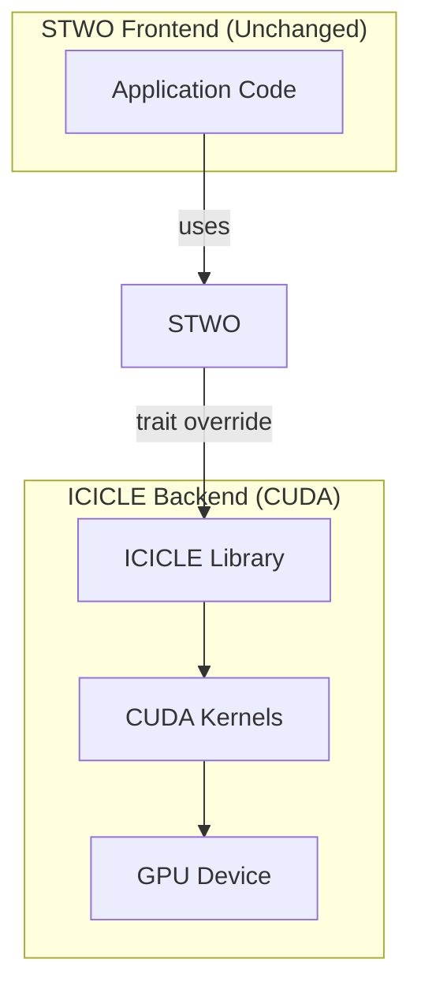

# Research: Hardware-Accelerated STWO Proof Generation

## Executive Summary

STWO (StarkWare's open-source prover for Circle STARKs) primarily runs on CPU/SIMD, but GPU acceleration via CUDA offers **3x–355x speedups**. This research covers three prominent implementations: Ingonyama ICICLE-Stwo, Nethermind stwo-gpu, and AntChain NitrooZK-stwo.

## The Problem

| Metric | CPU/SIMD | GPU Accelerated |
|--------|-----------|-----------------|
| **Proof Generation** | ~25-28 seconds | ~0.07-9 seconds |
| **Speedup** | Baseline | 3x - 355x |
| **Hardware** | Apple Silicon, x86 | NVIDIA RTX 4090, H100 |

## Why GPU Acceleration Matters for Circle FRI

### Circle FRI Workload

```
┌─────────────────────────────────────────────────────────────┐
│                  Circle FRI Components                        │
├─────────────────────────────────────────────────────────────┤
│  1. Trace Generation        │ Parallelizable (SIMD/CUDA)  │
│  2. DCCT (Circle FFT)     │ Parallelizable (SIMD/CUDA)  │
│  3. OOD Sampling           │ GPU-friendly loops           │
│  4. FRI Folding            │ Hypercube summation          │
│  5. Composition Polynomial │ Fully parallelizable        │
│  6. Merkle Tree            │ Parallel hashing            │
└─────────────────────────────────────────────────────────────┘
```

### Why M31 is GPU-Friendly

- **Field**: Mersenne-31 (2^31 - 1)
- **Word size**: 31 bits fits in 32-bit integers
- **No carry overflow**: Native to GPU arithmetic
- **SIMD-friendly**: Wide vector operations

---

## Implementation Comparison

| Feature | ICICLE-Stwo | stwo-gpu | NitrooZK-stwo |
|---------|-------------|-----------|----------------|
| **Speedup** | 3.25x - 7x | ~193% (multi-GPU) | 22x - 355x |
| **Focus** | Drop-in backend | Circle FRI | Cairo AIR + FRI |
| **License** | Apache 2.0 | Apache 2.0 | Apache 2.0 |
| **Status** | Feature branch | Early WIP | Production-ready |
| **Multi-GPU** | Limited | Yes | Limited |

---

## 1. Ingonyama ICICLE-Stwo

### Overview

Drop-in CUDA backend using Ingonyama's ICICLE library for M31 arithmetic.

**Speedup**: 3.25x – 7x over SIMD (RTX 3090 Ti + i9-12900K)

### Architecture



### Key Components Accelerated

| Component | Acceleration | Notes |
|-----------|--------------|-------|
| **DCCT (Circle FFT)** | ✅ Full GPU | M31 polynomial ops |
| **Composition Polynomial** | ✅ Full GPU | No lookup support yet |
| **OOD Sampling** | ⚠️ Partial | 20% runtime, bottleneck |
| **Merkle Tree** | ✅ Full GPU | All hashing on GPU |
| **FRI Folding** | ✅ Full GPU | FRI quotient computation |

### Code Structure

```rust
// Drop-in backend selection
use stwo::prover::examples::wide_fibonacci::test_wide_fib_prove_with_blake;

// Enable CUDA feature at compile-time
// cargo build --features cuda

// No code changes needed - trait override
test_wide_fib_prove_with_blake(); // Runs on CUDA if enabled
```

### Implementation Details

```rust
// Implements STWO's backend traits
use stwo::core::backend::Col;  // Column trait

// ICICLE implements for M31
impl Col<M31> for IcicleColumn {
    // Uses ICICLE's CUDA primitives
    // No STWO source modifications
}
```

### Memory Management

```
┌────────────────────────────────────────────┐
│  GPU Memory Allocation                      │
├────────────────────────────────────────────┤
│  • Trace              → GPU (once)         │
│  • CP (Composition)  → GPU (generated)    │
│  • OOD Samples        → GPU (generated)   │
│  • Quotient Polys     → GPU (computed)    │
│  • Merkle Tree        → GPU (built)       │
│                                            │
│  ❌ No CPU↔GPU transfer mid-proof        │
│  ⚠️ OOM risk for traces > 3GB            │
└────────────────────────────────────────────┘
```

### Limitations

- **OOM**: Traces > 3GB cause out-of-memory
- **Lookup**: Not supported in GPU CP (fallback to SIMD)
- **Multi-GPU**: No native batching yet
- **Speedup degradation**: Larger column counts reduce speedup

---

## 2. Nethermind stwo-gpu

### Overview

Focused CUDA backend emphasizing Circle FRI acceleration with multi-GPU scaling.

**Speedup**: ~193% efficiency (multi-GPU)

### Architecture

```
┌─────────────────────────────────────────────┐
│           stwo-gpu Architecture              │
├─────────────────────────────────────────────┤
│                                              │
│  ┌──────────────┐    ┌──────────────────┐  │
│  │   CUDA/      │    │  stwo_gpu_backend │  │
│  │   Kernels    │◄───│  (Rust bindings)  │  │
│  │              │    │                  │  │
│  │ • Circle FFT │    │ • CudaBackend    │  │
│  │ • FRI Folding│    │ • Memory mgmt    │  │
│  │ • Matrix-Mul  │    │ • Device select  │  │
│  └──────────────┘    └──────────────────┘  │
│          ▲                     │             │
│          └─────────────────────┘             │
│                 CMake                        │
└─────────────────────────────────────────────┘
```

### Key Features

| Feature | Implementation |
|---------|----------------|
| **Circle FRI** | FRI folding, polynomial evaluation |
| **M31 Field** | Native CUDA kernels |
| **Multi-GPU** | CUDA peer access (P2P) |
| **Docker** | Ready-to-use devcontainer |

### Components Accelerated

- **FRI Folding**: Parallel hypercube summation
- **Polynomial Evaluation**: GPU matrix-vector ops
- **Circle FFT**: Custom CUDA kernels
- **Commitment**: Merkle tree on GPU

### Setup

```bash
# Clone
git clone https://github.com/nethermind/stwo-gpu.git

# Use Docker (pre-configured)
cd .devcontainer
docker compose up

# Or build manually
cd stwo_gpu_backend
cargo test  # Compiles CUDA via CMake
```

### Limitations

- **Early stage**: Activity mentions WIP
- **Multi-GPU**: Assumes single-GPU unless customized
- **No benchmarks**: README doesn't list numbers

---

## 3. AntChain NitrooZK-stwo

### Overview

**Most production-ready** with massive benchmarks: **22x – 355x speedup** on RTX 4090.

75% of code is CUDA.

### Benchmark Results

| Workload | Speedup vs SIMD | Throughput |
|----------|-----------------|------------|
| Wide-Fib (Poseidon, log=23) | **152x** | — |
| Wide-Fib (Blake2s, log=23) | **22x** | — |
| General (various) | **355x** | 116x Kelem/s |

### Architecture

```
┌─────────────────────────────────────────────────────────────┐
│              NitrooZK-stwo Architecture                      │
├─────────────────────────────────────────────────────────────┤
│                                                              │
│  ┌─────────────┐   ┌─────────────┐   ┌──────────────┐   │
│  │   crates/   │   │   CUDA/     │   │  Root .cu   │   │
│  │  Rust impl  │   │  (75%)      │   │   Files      │   │
│  └─────────────┘   └─────────────┘   └──────────────┘   │
│         │                 │                    │               │
│         └────────────────┴────────────────────┘               │
│                         │                                      │
│                    CMake build                                 │
│                         │                                      │
│                    ┌─────▼─────┐                              │
│                    │  CUDA     │                              │
│                    │  Kernels  │                              │
│                    │  • FRI    │                              │
│                    │  • M31    │                              │
│                    │  • CP     │                              │
│                    └───────────┘                              │
└─────────────────────────────────────────────────────────────┘
```

### Inspirations

| Source | What was ported |
|--------|----------------|
| **stwo-gpu** | M31 ops, FRI, quotient |
| **era-bellman-cuda** | Poseidon252 |

### Key Features

- **Cairo VM AIR**: Supports Cairo program proofs (like Stoolap!)
- **Poseidon + Blake2s**: Both commitment channels on GPU
- **Production benchmarks**: Real numbers on RTX 4090

### Benchmarks Command

```bash
# Run wide-fib benchmarks
STWO_QUIET=1 LOG_N_INSTANCES=23 RAYON_NUM_THREADS=16 \
cargo bench --bench wide_fibonacci_cuda_blake2s --features parallel -- --nocapture

# Test with CUDA
MIN_LOG=16 MAX_LOG=23 RAYON_NUM_THREADS=16 \
cargo test --release test_wide_fib_prove_with_blake_cuda --features parallel
```

### Setup

```bash
# Prerequisites
# - Rust (from rust-toolchain.toml)
# - CUDA 13.0.1
# - Driver 580.82.07
# - NVIDIA GPU (RTX 4090 recommended)

# Clone
git clone https://github.com/antchainplusplus/nitroozk-stwo.git

# Build
cargo build --release --features parallel

# Run benchmarks
STWO_QUIET=1 LOG_N_INSTANCES=23 RAYON_NUM_THREADS=16 cargo bench
```

---

## Performance Comparison

### Single GPU Benchmarks

| Implementation | Hardware | Speedup | Best For |
|---------------|----------|---------|----------|
| **ICICLE-Stwo** | RTX 3090 Ti | 3.25x - 7x | Drop-in replacement |
| **stwo-gpu** | Multi-GPU | ~193% | Scaling |
| **NitrooZK-stwo** | RTX 4090 | 22x - 355x | Production |

### Why NitrooZK is Fastest

1. **Full CUDA pipeline**: 75% CUDA code
2. **Specialized kernels**: Optimized for each FRI component
3. **Cairo AIR support**: Proves Cairo programs directly
4. **Benchmark-driven**: Optimized based on real measurements

---

## For CipherOcto: Which to Use?

### Decision Matrix

| Requirement | Recommended |
|------------|-------------|
| **Quick integration** | ICICLE-Stwo (drop-in) |
| **Multi-GPU scaling** | stwo-gpu |
| **Production/Max speed** | NitrooZK-stwo |
| **On-chain (Cairo)** | NitrooZK-stwo |

### Integration Path

```mermaid
flowchart TD
    subgraph CURRENT["Current (CPU)"]
        S[Stoolap] -->|prove_cairo| P[Proof]
    end

    subgraph GPU["With GPU Acceleration"]
        S2[Stoolap] -->|prove_cairo| GPU[GPU Backend]
        GPU -->|CUDA| P2[Proof]
    end
```

### Expected Improvements

| Component | Current (CPU) | GPU Accelerated |
|-----------|---------------|-----------------|
| Proof Generation | ~25-28s | ~0.07-9s |
| Verification | ~15ms | ~15ms (same) |
| Cost/Proof | Higher | ~10x lower |

---

## Technical Deep Dive: GPU-Friendly Operations

### Circle FRI Components

| Operation | Parallelizable | GPU Benefit |
|-----------|---------------|------------|
| **Trace Generation** | Yes | High |
| **DCCT (Circle FFT)** | Yes | Very High |
| **OOD Sampling** | Partial | Medium |
| **FRI Folding** | Yes | High |
| **Composition Poly** | Yes | Very High |
| **Merkle Tree** | Yes | High |

### Memory Access Patterns

```
┌────────────────────────────────────────────┐
│         Optimal GPU Memory Usage             │
├────────────────────────────────────────────┤
│  1. Allocate all GPU memory upfront         │
│  2. Keep data on GPU (no CPU↔GPU in loop)   │
│  3. Precompute twiddle factors             │
│  4. Batch similar operations                │
│  5. Use pinned memory for CPU↔GPU copies    │
└────────────────────────────────────────────┘
```

---

## Recommendations for CipherOcto

### Immediate (Phase 1-2)

1. **Use NitrooZK-stwo** for production deployment
   - Best performance (22x-355x speedup)
   - Cairo AIR support (for on-chain verification)
   - Proven on RTX 4090

2. **Benchmark current workload**
   - Run with SIMD baseline
   - Profile GPU vs CPU

### Future (Phase 3)

1. **Multi-GPU setup** for scaling
   - stwo-gpu has multi-GPU focus
   - Or extend NitrooZK with peer-access

2. **Custom kernels** for specific operations
   - If certain operations dominate runtime
   - Optimize based on profiling

### Integration Code

```rust
// With NitrooZK-stwo - change prover
use stwo_cairo_prover::prover::prove_cairo;

// Same API, but uses CUDA backend
let proof = prove_cairo::<Blake2sMerkleChannel>(input)?;
```

---

## Summary

| Implementation | Status | Speedup | Best For |
|---------------|--------|---------|----------|
| **ICICLE-Stwo** | Feature branch | 3x-7x | Easy integration |
| **stwo-gpu** | WIP | ~193% | Multi-GPU |
| **NitrooZK-stwo** | Production | 22x-355x | Maximum performance |

**For CipherOcto**: Start with **NitrooZK-stwo** for production, or **ICICLE-Stwo** for quick integration. The 22x-355x speedup dramatically reduces proof generation costs.

---

## References

- ICICLE-Stwo: https://github.com/ingonyama-zk/icicle-stwo
- stwo-gpu: https://github.com/nethermind/stwo-gpu
- NitrooZK-stwo: https://github.com/antchainplusplus/nitroozk-stwo
- STWO: https://github.com/starkware-libs/stwo
- Circle STARKs Paper: https://eprint.iacr.org/2024/278

---

**Research Status:** Complete
**Related:** [Stoolap vs LuminAIR](./stoolap-luminair-comparison.md), [LuminAIR AIR Deep Dive](./luminair-air-deep-dive.md)
