# Research: ZeroClaw Architecture

**Date:** 2026-05-26
**Status:** Research (v2 -- post CocoIndex verification)
**Source:** Source code analysis of `zeroclaw` v0.8.0-beta-1 (zeroclaw-labs/zeroclaw)
**Index Stats:** 1,132 files, 29,325 chunks, 1,787 symbols, 4,666 import edges, 772 Rust files (418,710 LOC)

---

## Table of Contents

1. [Project Overview](#1-project-overview)
2. [System Architecture](#2-system-architecture)
3. [Crate Topology](#3-crate-topology)
4. [Agent Runtime](#4-agent-runtime)
5. [Tools System](#5-tools-system)
6. [Provider Layer](#6-provider-layer)
7. [Channel System](#7-channel-system)
8. [Security Model](#8-security-model)
9. [Memory System](#9-memory-system)
10. [Plugin System (WASM)](#10-plugin-system-wasm)
11. [Hardware & Peripherals](#11-hardware--peripherals)
12. [Skills & SkillForge](#12-skills--skillforge)
13. [Observability](#13-observability)
14. [Gateway & Frontend](#14-gateway--frontend)
15. [Codebase Analysis](#15-codebase-analysis)
16. [Data Flow Diagrams](#16-data-flow-diagrams)

---

## 1. Project Overview

ZeroClaw is a Rust-first autonomous agent runtime optimized for performance, efficiency, stability, extensibility, sustainability, and security. It runs on your own devices, communicates across 35 messaging channels, supports 14 LLM providers, has 95+ built-in tools, and extends through WASM plugins and hardware peripherals.

| Property | Value | Evidence |
|----------|-------|----------|
| **Version** | 0.8.0-beta-1 | `Cargo.toml:24` |
| **Language** | Rust (edition 2024, rustc >=1.87) | `Cargo.toml:25-27` |
| **License** | MIT OR Apache-2.0 | `Cargo.toml:26` |
| **Architecture** | Cargo workspace (17 crates + root + apps/tools/xtask) | `Cargo.toml:1-21` |
| **Total Rust Files** | 772 | `find` analysis |
| **Total Rust LOC** | 418,710 | `find + wc` analysis |
| **Code Chunks** | 29,325 | CocoIndex |
| **Extracted Symbols** | 1,787 | CocoIndex (regex-based) |
| **Import Edges** | 4,666 | CocoIndex |
| **Channels** | 35 implementations (34 files) | `impl Channel for` grep in `crates/zeroclaw-channels/src/` |
| **LLM Providers** | 14 implementations | `crates/zeroclaw-providers/src/` (excl. factory/reliable/router) |
| **Tools** | 95+ (69 in `src/tools/`, 26 in `crates/zeroclaw-runtime/src/tools/`) | Direct file count |
| **Memory Backend Kinds** | 7 kinds + 16 feature modules | `MemoryBackendKind` enum in `backend.rs` |
| **Security Modules** | 15 + 6 infrastructure | `crates/zeroclaw-runtime/src/security/` |
| **Firmware Targets** | 8 (Arduino, ESP32, ESP32-UI, Pico, Nucleo, Uno Q Bridge, FW Protocol, Nucleo FW) | `firmware/` |
| **Native App** | Tauri desktop app | `apps/tauri/` |

### 1.1 Design Philosophy

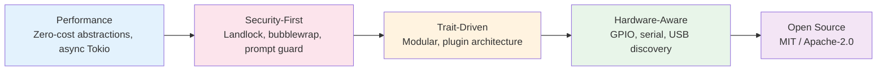

### 1.2 Key Differentiators

| Dimension | ZeroClaw | IronClaw | OpenClaw |
|-----------|----------|----------|----------|
| **Language** | Rust | Rust | TypeScript |
| **Channels** | 35 (incl. WeChat, WeCom, Lark, DingTalk, QQ) | ~6 | 25+ |
| **Providers** | 14 (OpenAI, Anthropic, Gemini, Ollama, Bedrock, Azure, OpenRouter, Copilot, GLM, Telnyx, Gemini CLI, OpenAI Codex, Compatible, KiloCLI) | 10+ | Multi via adapters |
| **Tools** | 95+ built-in tools | ~20 | ~30 |
| **Security** | 15 modules (Landlock, bubblewrap, Docker, firejail, seatbelt, Nevis, prompt guard, leak detector, secrets, OTP, WebAuthn, pairing, IAM, E-stop, audit) | WASM sandbox + capabilities | Safe defaults |
| **Hardware** | GPIO, serial, USB, firmware (Pico/Nucleo/ESP32) | None | None |
| **Plugins** | WASM component model | WASM modules + MCP | npm + plugin SDK |
| **Memory** | 7 backend kinds + 16 feature modules (knowledge graph, consolidation, decay, embeddings) | libSQL/Postgres | SQLite + LanceDB |
| **Sandboxing** | Landlock + bubblewrap + firejail + seatbelt + Docker + Nevis | Wasmtime WASM | Docker/Podman |

---

## 2. System Architecture

### 2.1 High-Level Architecture

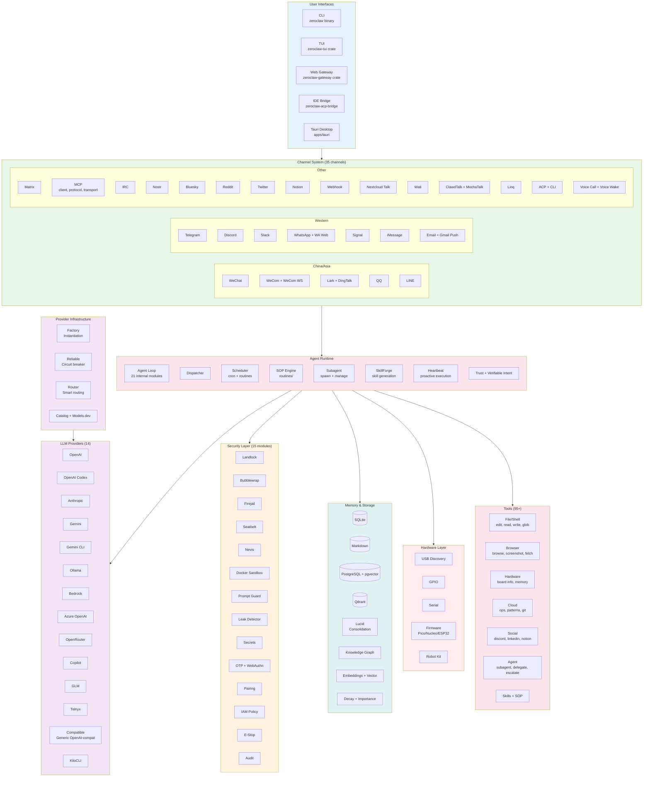

### 2.2 Component Map

```mermaid
graph LR
    subgraph Entry["Entry Points"]
        E1["src/main.rs<br/>CLI dispatch"]
        E2["src/bin/zeroclaw-acp-bridge.rs<br/>IDE integration"]
        E3["crates/zeroclaw-gateway/<br/>Webhook daemon"]
    end

    subgraph Core["Core Runtime (src/ -- 45+ modules)"]
        G1[agent/<br/>Agent loop]
        G2[channels/<br/>Channel orchestration]
        G3[commands/<br/>CLI commands]
        G4[config/<br/>Configuration]
        G5[cron/<br/>Scheduled tasks]
        G6[heartbeat/<br/>Proactive execution]
        G7[hooks/<br/>Event hooks]
        G8[memory/<br/>Memory CLI + tests]
        G9[nodes/<br/>Node management]
        G10[observability/<br/>Tracing + metrics]
        G11[onboard/<br/>Onboarding wizard]
        G12[platform/<br/>Platform detection]
        G13[security/<br/>Security orchestration]
        G14[skillforge/<br/>Skill generation]
        G15[skills/<br/>Skill management]
        G16[sop/<br/>Standard operating procedures]
        G17[routines/<br/>Routine execution]
        G18[approval/<br/>Human-in-the-loop]
        G19[trust/<br/>Trust policy]
        G20[verifiable_intent/<br/>Intent verification]
        G21[rag/<br/>RAG pipeline]
        G22[tools/<br/>69 tool implementations]
        G23[integrations/<br/>External integrations]
        G24[multimodal.rs<br/>Multimodal support]
    end

    subgraph Crates["Workspace Crates"]
        C1[zeroclaw-api<br/>Public trait definitions]
        C2[zeroclaw-config<br/>Schema + loading]
        C3[zeroclaw-log<br/>Unified log surface]
        C4[zeroclaw-providers<br/>14 LLM providers + infra]
        C5[zeroclaw-channels<br/>35 channels + orchestrator]
        C6[zeroclaw-tools<br/>Tool execution]
        C7[zeroclaw-memory<br/>7 backends + 16 features]
        C8[zeroclaw-runtime<br/>Agent loop + security + tools]
        C9[zeroclaw-infra<br/>Shared infra]
        C10[zeroclaw-gateway<br/>Webhook server]
        C11[zeroclaw-tui<br/>TUI wizard]
        C12[zeroclaw-plugins<br/>WASM plugins]
        C13[zeroclaw-hardware<br/>USB/GPIO/serial]
        C14[zeroclaw-tool-call-parser<br/>Tool call parsing]
        C15[zeroclaw-macros<br/>Derive macros]
        C16[robot-kit<br/>Robot abstraction]
        C17[aardvark-sys<br/>Native bindings]
    end

    E1 --> Core
    E2 --> Core
    E3 --> Core
    Core --> Crates
```

---

## 3. Crate Topology

ZeroClaw organizes its codebase into 17 workspace crates with a trait-driven, layered architecture. Extension points are defined in `zeroclaw-api` and implemented by domain crates.

```mermaid
graph TB
    subgraph Layer0["Layer 0: Foundation"]
        API[zeroclaw-api<br/>Public trait definitions<br/>Provider, Channel, Tool, Memory, Observer, Peripheral]
        INFRA[zeroclaw-infra<br/>Debounce, session, stall watchdog]
        CFG[zeroclaw-config<br/>Schema, config loading/merging]
        LOG[zeroclaw-log<br/>record! macro, JSONL, broadcast hook]
        MACROS[zeroclaw-macros<br/>Configurable derive macro]
    end

    subgraph Layer1["Layer 1: Domain Crates"]
        direction LR
        PROV[zeroclaw-providers<br/>14 LLM providers + resilient wrapper + smart router]
        CHAN[zeroclaw-channels<br/>35 channels + orchestrator]
        TOOLS2[zeroclaw-tools<br/>Shell, file, memory, browser tools]
        MEM[zeroclaw-memory<br/>7 backends + 16 feature modules]
    end

    subgraph Layer2["Layer 2: Composition"]
        direction LR
        RT[zeroclaw-runtime<br/>Agent loop, security, cron, SOP, skills, tools, onboarding]
        GW[zeroclaw-gateway<br/>Webhook/gateway server]
        HW[zeroclaw-hardware<br/>USB, peripherals, serial, GPIO]
        PLUG[zeroclaw-plugins<br/>WASM plugin system]
    end

    subgraph Layer3["Layer 3: User-Facing"]
        direction LR
        TUI[zeroclaw-tui<br/>TUI onboarding wizard]
        TCP[zeroclaw-tool-call-parser<br/>Tool call parsing]
        RK[robot-kit<br/>Robot abstraction]
        ASYS[aardvark-sys<br/>Native bindings]
    end

    Layer0 --> Layer1
    Layer1 --> Layer2
    Layer2 --> Layer3

    style Layer0 fill:#e3f2fd
    style Layer1 fill:#e8f5e9
    style Layer2 fill:#fff3e0
    style Layer3 fill:#fce4ec
```

### 3.1 Crate Details

| Crate | Tier | LOC (lib.rs) | Role |
|-------|------|-------------|------|
| `zeroclaw-api` | Experimental | 47 | Trait definitions (Provider, Channel, Tool, Memory, Observer, Peripheral) |
| `zeroclaw-config` | Beta | 44 | Schema, config loading/merging, TOML-based |
| `zeroclaw-log` | Beta | 82 | Unified log emission, JSONL persistence, broadcast hook |
| `zeroclaw-macros` | Beta | 2,205 | `#[derive(Configurable)]` and other procedural macros |
| `zeroclaw-infra` | Beta | 163 | Debounce, session management, stall watchdog |
| `zeroclaw-providers` | Beta | 3,314 | 14 LLM providers, factory, resilient wrapper, smart router, catalog |
| `zeroclaw-channels` | Experimental | 89 (lib) | 35 channel adapters, orchestrator (lifecycle, media pipeline, MQTT) |
| `zeroclaw-tools` | Experimental | 73 | Shell, file, memory, browser tool execution |
| `zeroclaw-memory` | Beta | 907 | 7 backend kinds + 16 feature modules (KG, consolidation, decay, embeddings) |
| `zeroclaw-runtime` | Experimental | 42 (lib) | Agent loop (21 modules), security (15+6), tools (26), cron, SOP, skills, onboarding |
| `zeroclaw-gateway` | Experimental | 5,211 | Webhook/gateway server, separate binary |
| `zeroclaw-tui` | Experimental | 10 | TUI onboarding wizard |
| `zeroclaw-plugins` | Experimental | 91 | WASM plugin system (host, runtime, signature, WASM channel/tool) |
| `zeroclaw-hardware` | Experimental | 747 | USB discovery, peripherals, serial, GPIO, firmware flashing |
| `zeroclaw-tool-call-parser` | Beta | 3,834 | Tool call parsing from LLM output |
| `robot-kit` | Experimental | 154 | Robot hardware abstraction |
| `aardvark-sys` | Experimental | 483 | Native system bindings |

---

## 4. Agent Runtime

### 4.1 Agent Loop Architecture

The agent runtime lives in `crates/zeroclaw-runtime/` and `src/agent/`. It orchestrates the full lifecycle from message receipt to response delivery.

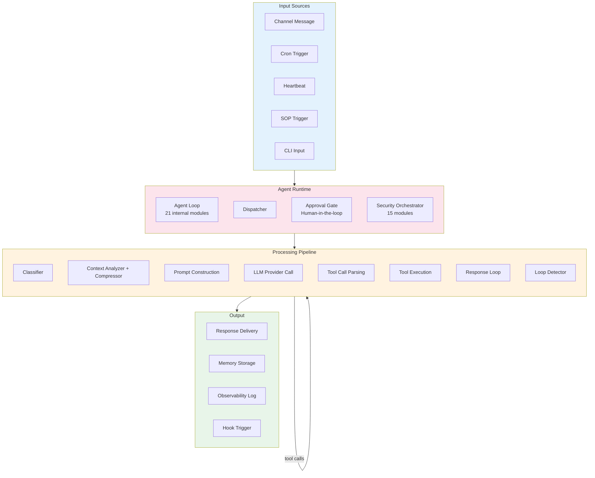

### 4.2 Runtime Modules (Top-Level)

The runtime crate (`crates/zeroclaw-runtime/src/`) contains 36 top-level modules:

| Module | Path | Role |
|--------|------|------|
| **Agent** | `agent/` | Core agent loop with 21 internal modules (see 4.3) |
| **Approval** | `approval/` | Human-in-the-loop approval workflows |
| **Browse** | `browse.rs` | Browser automation |
| **CLI Input** | `cli_input.rs` | CLI input handling |
| **Cost** | `cost/` | Cost tracking |
| **Cron** | `cron/` | Scheduled task execution |
| **Daemon** | `daemon/` | Background daemon management |
| **Doctor** | `doctor/` | Health diagnostics |
| **Firmware** | `firmware/` | Firmware management |
| **Health** | `health/` | Health check endpoints |
| **Heartbeat** | `heartbeat/` | Proactive agent execution on intervals |
| **Hooks** | `hooks/` | Event hook system |
| **i18n** | `i18n.rs` | Internationalization (Fluent strings) |
| **Identity** | `identity.rs` | Agent identity management |
| **Integrations** | `integrations/` | External integrations |
| **Migration** | `migration.rs` | Data migration |
| **Nodes** | `nodes/` | Node management |
| **Observability** | `observability/` | Tracing + metrics (7 backends) |
| **Onboard** | `onboard/` | First-run onboarding wizard |
| **Peers** | `peers.rs` | Peer management |
| **Platform** | `platform/` | Platform detection |
| **Process Stats** | `process_stats.rs` | Process statistics |
| **RAG** | `rag/` | Retrieval-augmented generation |
| **Routines** | `routines/` | Routine execution engine |
| **Security** | `security/` | 15 security modules + 6 infrastructure |
| **Service** | `service/` | Service lifecycle management |
| **SkillForge** | `skillforge/` | Autonomous skill generation from experience |
| **Skills** | `skills/` | Skill management (16 submodules) |
| **SOP** | `sop/` | Standard Operating Procedures |
| **Subagent** | `subagent/` | Subagent spawning and management |
| **Tools** | `tools/` | 26 runtime tools (shell, cron, SOP, skills, etc.) |
| **Trust** | `trust/` | Trust policy enforcement |
| **Tunnel** | `tunnel/` | Tunnel management |
| **Util** | `util.rs` | Utilities |
| **Verifiable Intent** | `verifiable_intent/` | Cryptographic intent verification (crypto, issuance, verification) |

**Note:** The root `src/` package has additional modules not in the runtime crate: `auth/`, `bin/`, `channels/`, `commands/`, `config/`, `gateway/`, `hardware/`, `memory/`, `multimodal.rs`, `peripherals/`, `plugins/`, `providers/`, `schema_markdown.rs`, `tools/` (69 tools).

### 4.3 Agent Internals

The agent loop (`crates/zeroclaw-runtime/src/agent/`) contains 21 modules:

| Module | File | Role |
|--------|------|------|
| **Agent** | `agent.rs` | Core agent struct and lifecycle |
| **Loop** | `loop_.rs` | Main execution loop |
| **Loop Detector** | `loop_detector.rs` | Detect infinite tool call loops |
| **Dispatcher** | `dispatcher.rs` | Message dispatch logic |
| **Classifier** | `classifier.rs` | Message classification |
| **Context Analyzer** | `context_analyzer.rs` | Context window analysis |
| **Context Compressor** | `context_compressor.rs` | Context compression for long conversations |
| **History** | `history.rs` | Conversation history management |
| **History Pruner** | `history_pruner.rs` | History pruning for context limits |
| **Memory Loader** | `memory_loader.rs` | Load memory into context |
| **Prompt** | `prompt.rs` | Prompt construction |
| **System Prompt** | `system_prompt.rs` | System prompt generation |
| **Personality** | `personality.rs` | Agent personality configuration |
| **Personality Templates** | `personality_templates/` | Built-in personality templates |
| **Thinking** | `thinking.rs` | Extended thinking / chain-of-thought |
| **Tool Execution** | `tool_execution.rs` | Tool call execution pipeline |
| **Tool Receipts** | `tool_receipts.rs` | Tool result processing |
| **Cost** | `cost.rs` | Per-turn cost tracking |
| **Eval** | `eval.rs` | Agent evaluation |
| **Tests** | `tests.rs` | Agent tests |

---

## 5. Tools System

### 5.1 Tool Catalog

ZeroClaw has 95+ tool implementations across `src/tools/` (69 files) and `crates/zeroclaw-runtime/src/tools/` (26 files).

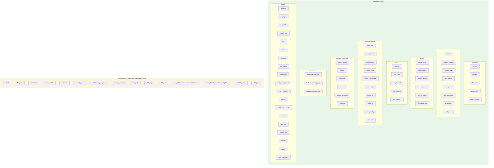

### 5.2 Tool Categories

| Category | Count | Key Tools |
|----------|-------|-----------|
| **File & Shell** | 6 | file_edit, file_read, file_write, glob_search, content_search, shell |
| **Browser & Web** | 9 | browser, browser_delegate, browser_open, text_browser, web_fetch, web_search_tool, web_search_provider_routing, screenshot, pdf_read |
| **Memory** | 6 | memory_recall, memory_store, memory_export, memory_forget, memory_purge, knowledge_tool |
| **MCP** | 5 | mcp_tool, mcp_client, mcp_deferred, mcp_protocol, mcp_transport |
| **Cloud & DevOps** | 10 | cloud_ops, cloud_patterns, git_operations, claude_code, claude_code_runner, opencode_cli, gemini_cli, codex_cli, proxy_config, composio |
| **Social & Productivity** | 7 | discord_search, linkedin, linkedin_client, notion_tool, jira_tool, google_workspace, pushover |
| **Hardware** | 3 | hardware_board_info, hardware_memory_map, hardware_memory_read |
| **Scheduling** | 8 | schedule, cron_add, cron_list, cron_remove, cron_run, cron_runs, cron_update, poll |
| **Agent** | 5 | spawn_subagent, send_message_to_peer, escalate, ask_user, delegate |
| **Skills** | 4 | read_skill, skill_http, skill_tool, attribution |
| **SOP** | 5 | sop_advance, sop_approve, sop_execute, sop_list, sop_status |
| **Security** | 1 | security_ops |
| **Utilities** | 16 | calculator, image_gen, image_info, weather_tool, model_routing_config, model_switch, data_management, report_templates, pipeline, project_intel, sessions, reaction, tool_search, backup_tool, canvas, llm_task |
| **Other** | 4 | verifiable_intent, node_capabilities, cli_discovery, schema |

---

## 6. Provider Layer

### 6.1 Provider Architecture

ZeroClaw supports 14 LLM providers through a unified trait-based abstraction with circuit breaker patterns, failover, and smart routing.

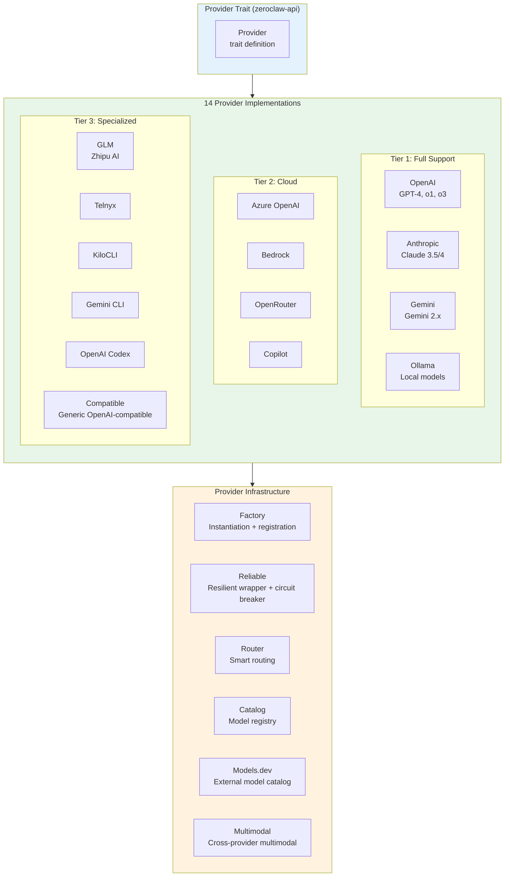

### 6.2 Provider Catalog

| Provider | File | Key Features |
|----------|------|-------------|
| OpenAI | `openai.rs` | GPT-4, o1, o3, native tools, streaming |
| Anthropic | `anthropic.rs` | Claude 3.5/4, extended thinking, tool use |
| Gemini | `gemini.rs` | Gemini 2.x, multimodal, grounding |
| Ollama | `ollama.rs` | Local model serving, no API key |
| Azure OpenAI | `azure_openai.rs` | Enterprise Azure deployments |
| Bedrock | `bedrock.rs` | AWS Bedrock, cross-region |
| OpenRouter | `openrouter.rs` | Multi-provider aggregator |
| Copilot | `copilot.rs` | GitHub Copilot models |
| GLM | `glm.rs` | Zhipu AI GLM-4 series |
| Telnyx | `telnyx.rs` | Telnyx AI platform |
| KiloCLI | `kilocli.rs` | Kilo CLI provider |
| Gemini CLI | `gemini_cli.rs` | Gemini CLI integration |
| OpenAI Codex | `openai_codex.rs` | Codex-specific adapter |
| Compatible | `compatible.rs` | Generic OpenAI-compatible endpoint |

### 6.3 Provider Infrastructure

| Component | File | Role |
|-----------|------|------|
| Factory | `factory.rs` | Provider instantiation and registration (66 Provider-related references) |
| Reliable | `reliable.rs` | Resilient wrapper with circuit breaker (12 references) |
| Router | `router.rs` | Smart routing across providers (15 references) |
| Catalog | `catalog.rs` | Model registry and capabilities |
| Models.dev | `models_dev.rs` | External model catalog integration |
| Multimodal | `multimodal.rs` | Cross-provider multimodal support |

---

## 7. Channel System

### 7.1 Channel Architecture

ZeroClaw connects to 35 messaging platforms through a unified Channel trait and an orchestrator that manages lifecycle, routing, and media pipeline.

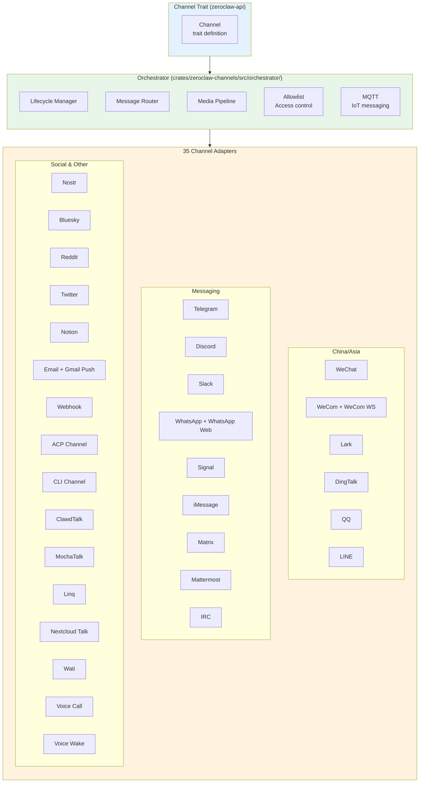

### 7.2 Channel List

| Category | Channels | Count |
|----------|----------|-------|
| **China/Asia** | WeChat, WeCom, WeCom WS, Lark, DingTalk, QQ, LINE | 7 |
| **Western Messaging** | Telegram, Discord, Slack, WhatsApp, WhatsApp Web, Signal, iMessage | 7 |
| **Enterprise** | Matrix, Mattermost, IRC, Nextcloud Talk, Email, Gmail Push | 6 |
| **Social** | Nostr, Bluesky, Reddit, Twitter | 4 |
| **Productivity** | Notion, Webhook, Wati | 3 |
| **Internal** | ACP (IDE), CLI, ClawdTalk, MochaTalk, Linq | 5 |
| **Voice** | Voice Call, Voice Wake | 2 |
| **Infrastructure** | Allowlist, Orchestrator (lifecycle, media pipeline, MQTT), Link Enricher, Listing, Transcription, Util | -- |
| **Total** | 35 `impl Channel for` across 34 files (whatsapp_web has 2 impls) | **35** |

**Source:** `grep -c 'impl Channel for' crates/zeroclaw-channels/src/*.rs` -- 34 files with Channel implementations.

---

## 8. Security Model

### 8.1 Security Architecture

ZeroClaw implements 15 security modules providing defense-in-depth from OS-level sandboxing to prompt injection detection.

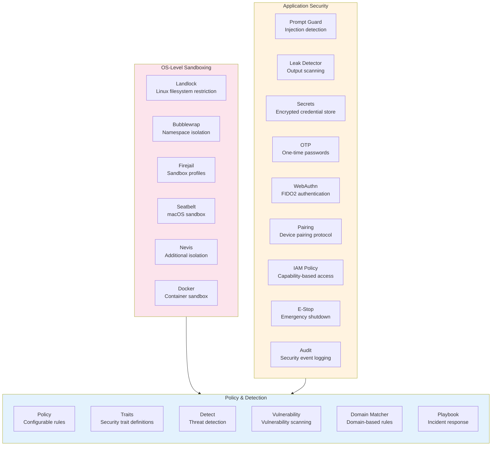

### 8.2 Security Modules

| Module | File | Platform | Role |
|--------|------|----------|------|
| **Landlock** | `landlock.rs` | Linux | Filesystem access restriction via Landlock LSM |
| **Bubblewrap** | `bubblewrap.rs` | Linux | Namespace isolation (bwrap) |
| **Firejail** | `firejail.rs` | Linux | Application sandboxing profiles |
| **Seatbelt** | `seatbelt.rs` | macOS | macOS sandbox profiles |
| **Nevis** | `nevis.rs` | Cross-platform | Additional isolation layer |
| **Docker** | `docker.rs` | Cross-platform | Container-based sandboxing |
| **Prompt Guard** | `prompt_guard.rs` | Cross-platform | LLM prompt injection detection |
| **Leak Detector** | `leak_detector.rs` | Cross-platform | Credential/data leak scanning in outputs |
| **Secrets** | `secrets.rs` | Cross-platform | Encrypted credential storage |
| **OTP** | `otp.rs` | Cross-platform | One-time password authentication |
| **WebAuthn** | `webauthn.rs` | Cross-platform | WebAuthn FIDO2 authentication |
| **Pairing** | `pairing.rs` | Cross-platform | Device pairing protocol |
| **IAM Policy** | `iam_policy.rs` | Cross-platform | Capability-based access control |
| **E-Stop** | `estop.rs` | Cross-platform | Emergency agent shutdown |
| **Audit** | `audit.rs` | Cross-platform | Security event logging |

**Infrastructure modules** (not direct security actions): `detect.rs` (threat detection), `domain_matcher.rs` (domain rules), `playbook.rs` (incident response), `policy.rs` (configurable rules), `traits.rs` (security trait definitions), `vulnerability.rs` (vulnerability scanning).

---

## 9. Memory System

### 9.1 Memory Architecture

ZeroClaw implements 7 storage backend kinds with 16+ feature modules for advanced memory management.

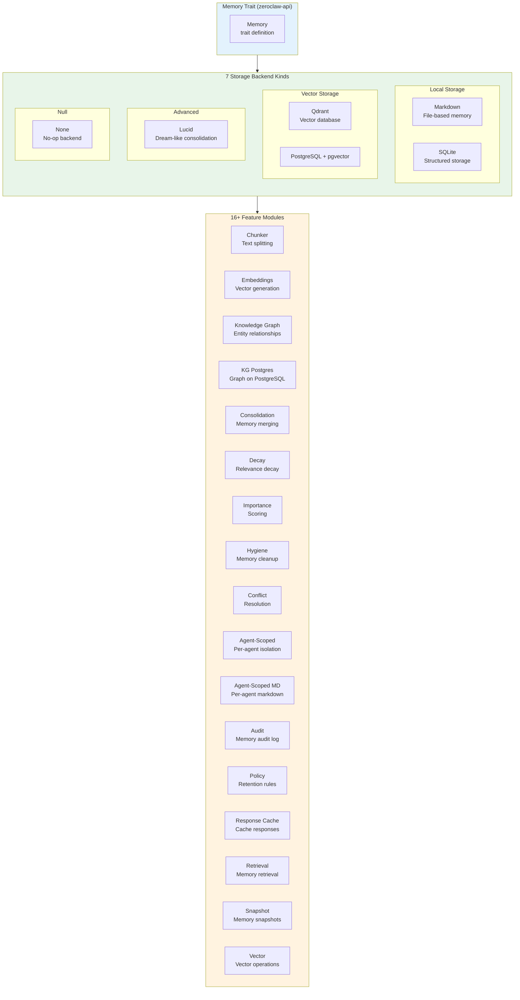

### 9.2 Storage Backend Kinds

| Backend | Enum Variant | Storage | Use Case |
|---------|-------------|---------|----------|
| SQLite | `MemoryBackendKind::Sqlite` | Local DB | Default structured storage |
| Markdown | `MemoryBackendKind::Markdown` | Local files | Simple file-based memory |
| Lucid | `MemoryBackendKind::Lucid` | In-process | Dream-like memory consolidation |
| PostgreSQL | `MemoryBackendKind::Postgres` | Remote | Enterprise storage + pgvector |
| Qdrant | `MemoryBackendKind::Qdrant` | Remote | Production vector DB |
| None | `MemoryBackendKind::None` | N/A | No-op for testing |
| Unknown | `MemoryBackendKind::Unknown` | Custom | Custom/third-party backends |

**Source:** `crates/zeroclaw-memory/src/backend.rs` -- `MemoryBackendKind` enum with 7 variants.

### 9.3 Memory Feature Modules

| Feature | File | Role |
|---------|------|------|
| Agent-Scoped | `agent_scoped.rs` | Per-agent memory isolation |
| Agent-Scoped Markdown | `agent_scoped_markdown.rs` | Per-agent markdown memory |
| Audit | `audit.rs` | Memory access audit trail |
| Chunker | `chunker.rs` | Text splitting for storage |
| Conflict | `conflict.rs` | Memory conflict resolution |
| Consolidation | `consolidation.rs` | Memory merging and dedup |
| Decay | `decay.rs` | Time-based relevance decay |
| Embeddings | `embeddings.rs` | Vector embedding generation |
| Hygiene | `hygiene.rs` | Memory cleanup and maintenance |
| Importance | `importance.rs` | Memory importance scoring |
| Knowledge Graph | `knowledge_graph.rs` | Entity relationship mapping |
| Knowledge Graph PG | `knowledge_graph_pg.rs` | Knowledge graph on PostgreSQL |
| Policy | `policy.rs` | Retention and access policies |
| Response Cache | `response_cache.rs` | Cache LLM responses |
| Retrieval | `retrieval.rs` | Memory retrieval strategies |
| Snapshot | `snapshot.rs` | Memory state snapshots |
| Vector | `vector.rs` | Vector operations and search |

---

## 10. Plugin System (WASM)

### 10.1 WASM Plugin Architecture

ZeroClaw extends through WASM components using the component model for secure, sandboxed plugin execution.

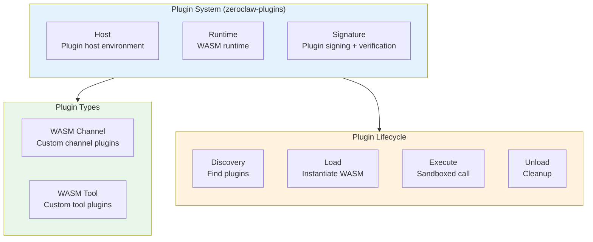

---

## 11. Hardware & Peripherals

### 11.1 Hardware Architecture

ZeroClaw has a full hardware abstraction layer for IoT and robotics use cases.

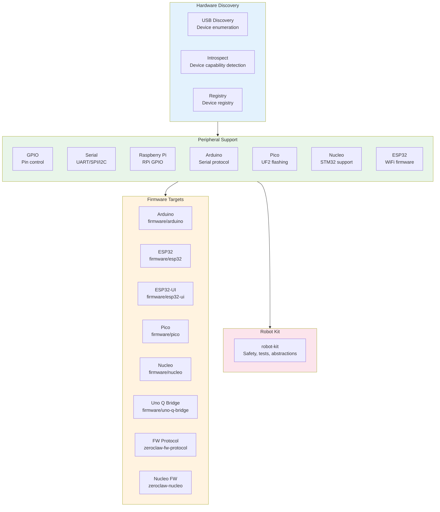

---

## 12. Skills & SkillForge

### 12.1 Skills System

ZeroClaw manages skills as reusable capability bundles that can be created, tested, improved, and shared.

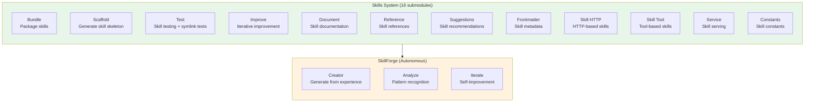

---

## 13. Observability

### 13.1 Observability Stack

ZeroClaw provides unified observability through 7 backends.

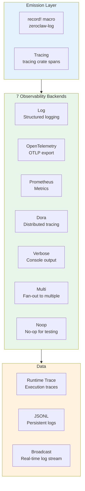

---

## 14. Gateway & Frontend

### 14.1 Gateway Architecture

The `zeroclaw-gateway` crate (5,211 LOC in lib.rs) provides a webhook/gateway server for external integrations.

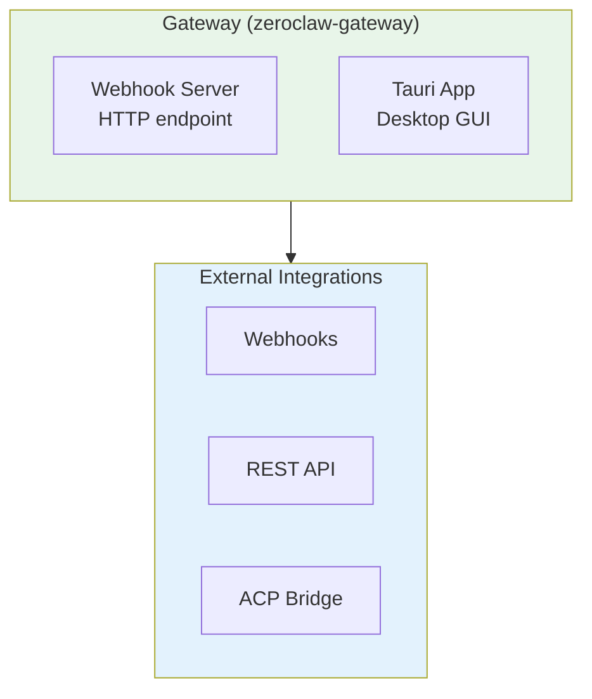

---

## 15. Codebase Analysis

### 15.1 CocoIndex Statistics

| Metric | Value |
|--------|-------|
| **Total Files Indexed** | 1,132 |
| **Code Chunks** | 29,325 |
| **Extracted Symbols** | 1,787 |
| **Import Edges** | 4,666 |
| **Embedding Coverage** | 100% (29,325/29,325) |

### 15.2 Code Metrics

| Metric | Value | Evidence |
|--------|-------|----------|
| **Rust Files** | 772 | `find . -name '*.rs'` |
| **Total Rust LOC** | 418,710 | `find + wc -l` |
| **Workspace Crates** | 17 | `Cargo.toml` workspace members |
| **Channel Implementations** | 35 | `impl Channel for` grep (34 files, whatsapp_web has 2) |
| **Provider Implementations** | 14 | Provider files excl. infrastructure |
| **Provider Infrastructure** | 6 | factory, reliable, router, catalog, models_dev, multimodal |
| **Tools** | 95+ | 69 in `src/tools/`, 26 in `crates/zeroclaw-runtime/src/tools/` |
| **Memory Backend Kinds** | 7 | `MemoryBackendKind` enum |
| **Memory Feature Modules** | 16 | Feature files in `crates/zeroclaw-memory/src/` |
| **Security Modules** | 15 | Active security modules |
| **Security Infrastructure** | 6 | Policy, detection, playbook, traits, vulnerability, domain_matcher |
| **Observability Backends** | 7 | Log, OTEL, Prometheus, Dora, Verbose, Multi, Noop |
| **Firmware Targets** | 8 | Arduino, ESP32, ESP32-UI, Pico, Nucleo, Uno Q, FW Protocol, Nucleo FW |

### 15.3 Largest Crates (by lib.rs)

| Crate | lib.rs LOC | Role |
|-------|-----------|------|
| `zeroclaw-gateway` | 5,211 | Webhook server |
| `zeroclaw-tool-call-parser` | 3,834 | Tool call parsing |
| `zeroclaw-providers` | 3,314 | LLM providers |
| `zeroclaw-macros` | 2,205 | Derive macros |
| `zeroclaw-memory` | 907 | Memory backends |
| `zeroclaw-hardware` | 747 | Hardware abstraction |
| `aardvark-sys` | 483 | Native bindings |
| `zeroclaw-infra` | 163 | Shared infra |

### 15.4 Stability Tiers

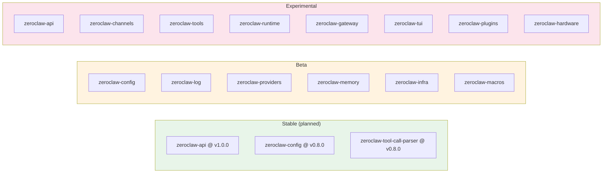

---

## 16. Data Flow Diagrams

### 16.1 Message Processing Flow

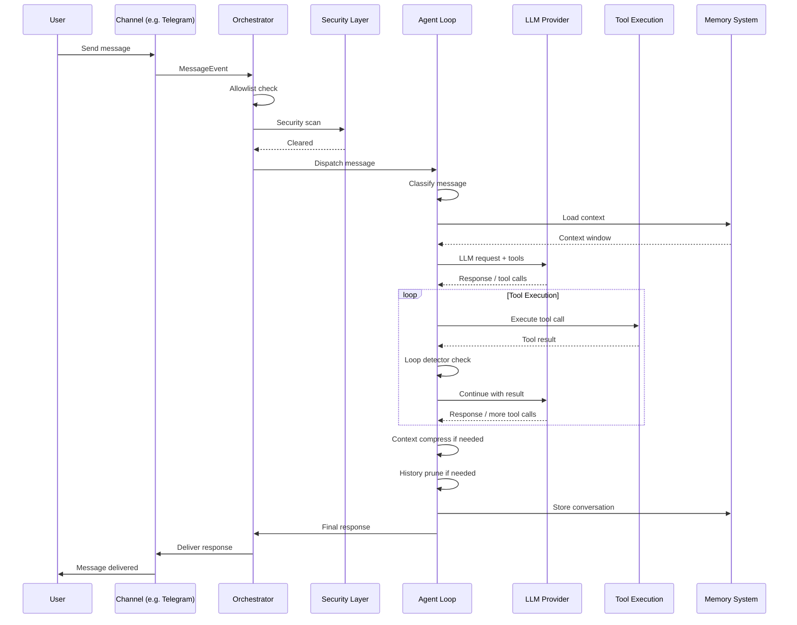

### 16.2 Security Pipeline Flow

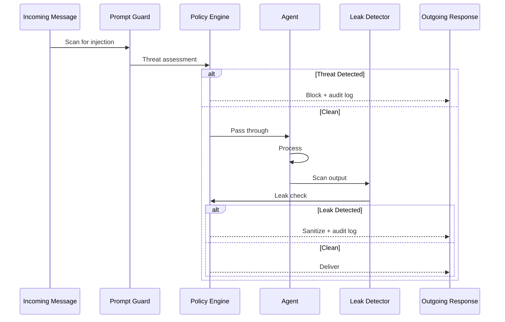

### 16.3 Plugin Execution Flow

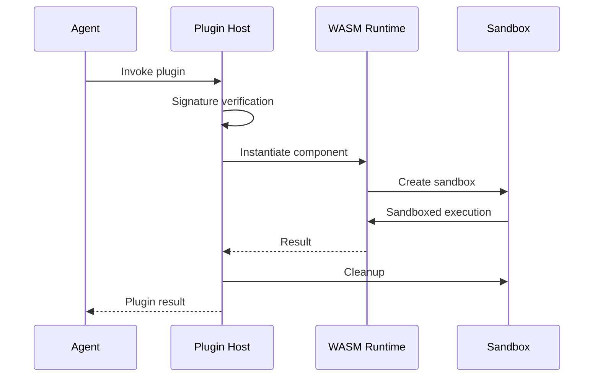

### 16.4 Memory Consolidation Flow

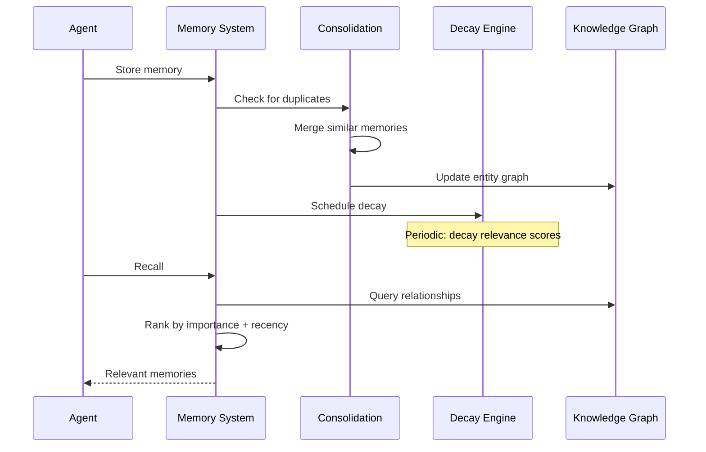

### 16.5 Agent Loop Detail

```mermaid
sequenceDiagram
    participant Input as Input Source
    participant Agent as Agent Loop
    participant Classifier as Classifier
    participant Context as Context Analyzer
    participant LLM as LLM Provider
    participant Tools as Tool Executor
    participant Memory as Memory System
    participant History as History Pruner

    Input->>Agent: Message
    Agent->>Classifier: Classify message
    Classifier-->>Agent: Classification result

    Agent->>Context: Analyze context window
    Context-->>Agent: Context strategy

    Agent->>Memory: Load relevant memories
    Memory-->>Agent: Memory context

    Agent->>Agent: Build prompt (system + personality + context)
    Agent->>LLM: Send request
    LLM-->>Agent: Response / tool calls

    loop Tool Execution
        Agent->>Tools: Execute tool call
        Tools-->>Agent: Tool result
        Agent->>Agent: Loop detector check
        Agent->>LLM: Continue with result
        LLM-->>Agent: Response / more calls
    end

    Agent->>Agent: Context compress if needed
    Agent->>History: Prune if needed
    Agent->>Memory: Store conversation

    Note over Agent,History: Loop detector monitors for infinite tool call cycles
```

---

## Appendix A: Repository Structure

```
zeroclaw/
├── Cargo.toml                    # Workspace root
├── src/
│   ├── main.rs                   # CLI entrypoint
│   ├── lib.rs                    # Module re-exports
│   ├── agent/                    # Agent loop
│   ├── approval/                 # Human-in-the-loop
│   ├── auth/                     # Authentication
│   ├── channels/                 # Channel orchestration
│   ├── commands/                 # CLI commands
│   ├── config/                   # Configuration
│   ├── cost/                     # Cost tracking
│   ├── cron/                     # Scheduled tasks
│   ├── daemon/                   # Background daemon
│   ├── doctor/                   # Health diagnostics
│   ├── gateway/                  # Gateway integration
│   ├── hardware/                 # Hardware abstraction
│   ├── health/                   # Health checks
│   ├── heartbeat/                # Proactive execution
│   ├── hooks/                    # Event hooks
│   ├── i18n.rs                   # Internationalization
│   ├── identity.rs               # Agent identity
│   ├── integrations/             # External integrations
│   ├── memory/                   # Memory CLI + tests
│   ├── migration.rs              # Data migration
│   ├── multimodal.rs             # Multimodal support
│   ├── nodes/                    # Node management
│   ├── observability/            # Tracing + metrics
│   ├── onboard/                  # Onboarding wizard
│   ├── peripherals/              # Peripheral management
│   ├── platform/                 # Platform detection
│   ├── plugins/                  # Plugin integration
│   ├── providers/                # Provider integration
│   ├── rag/                      # RAG pipeline
│   ├── schema_markdown.rs        # Schema documentation
│   ├── security/                 # Security orchestration
│   ├── service/                  # Service management
│   ├── skillforge/               # Skill generation
│   ├── skills/                   # Skill management
│   ├── sop/                      # Standard operating procedures
│   ├── tools/                    # 69 tool implementations
│   ├── trust/                    # Trust policy
│   ├── tunnel/                   # Tunnel management
│   ├── util.rs                   # Utilities
│   └── verifiable_intent/        # Intent verification
├── crates/
│   ├── zeroclaw-api/             # Public traits
│   ├── zeroclaw-config/          # Config schema
│   ├── zeroclaw-log/             # Logging
│   ├── zeroclaw-macros/          # Derive macros
│   ├── zeroclaw-infra/           # Shared infra
│   ├── zeroclaw-providers/       # 14 LLM providers + 6 infra
│   ├── zeroclaw-channels/        # 35 channels + orchestrator
│   ├── zeroclaw-tools/           # Tool execution
│   ├── zeroclaw-memory/          # 7 backends + 16 features
│   ├── zeroclaw-runtime/         # Agent runtime (36 modules)
│   ├── zeroclaw-gateway/         # Webhook server
│   ├── zeroclaw-tui/             # TUI wizard
│   ├── zeroclaw-plugins/         # WASM plugins
│   ├── zeroclaw-hardware/        # Hardware abstraction
│   ├── zeroclaw-tool-call-parser/# Tool call parsing
│   ├── robot-kit/                # Robot abstraction
│   └── aardvark-sys/             # Native bindings
├── apps/tauri/                   # Tauri desktop app
├── firmware/                     # MCU firmware
│   ├── arduino/
│   ├── esp32/
│   ├── esp32-ui/
│   ├── pico/
│   ├── nucleo/
│   ├── uno-q-bridge/
│   ├── zeroclaw-fw-protocol/
│   └── zeroclaw-nucleo/
├── tools/fill-translations/      # i18n tooling
├── xtask/                        # Build automation
└── docs/                         # Documentation
```

## Appendix B: Extension Points

| Extension Point | Trait/Location | How to Extend |
|----------------|----------------|---------------|
| **Provider** | `crates/zeroclaw-api/src/provider.rs` | Implement `Provider` trait |
| **Channel** | `crates/zeroclaw-api/src/channel.rs` | Implement `Channel` trait |
| **Tool** | `crates/zeroclaw-api/src/tool.rs` | Implement `Tool` trait |
| **Memory** | `crates/zeroclaw-api/src/memory_traits.rs` | Implement `Memory` trait |
| **Observer** | `crates/zeroclaw-api/src/observability_traits.rs` | Implement `Observer` trait |
| **Runtime Adapter** | `crates/zeroclaw-api/src/runtime_traits.rs` | Implement `RuntimeAdapter` trait |
| **Peripheral** | `crates/zeroclaw-api/src/peripherals_traits.rs` | Implement `Peripheral` trait |
| **WASM Plugin** | `crates/zeroclaw-plugins/` | Build WASM component |
