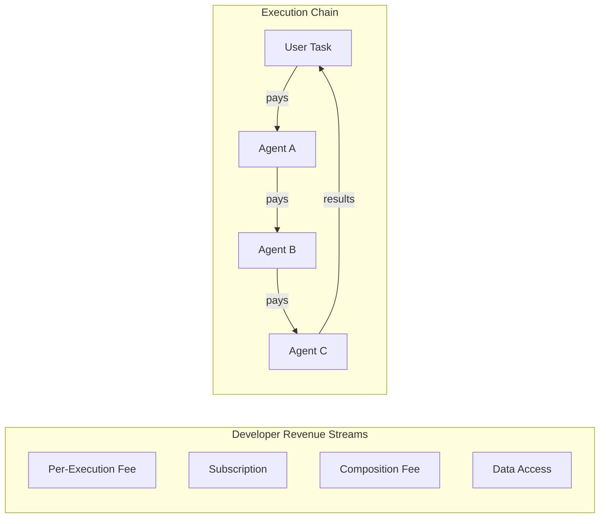
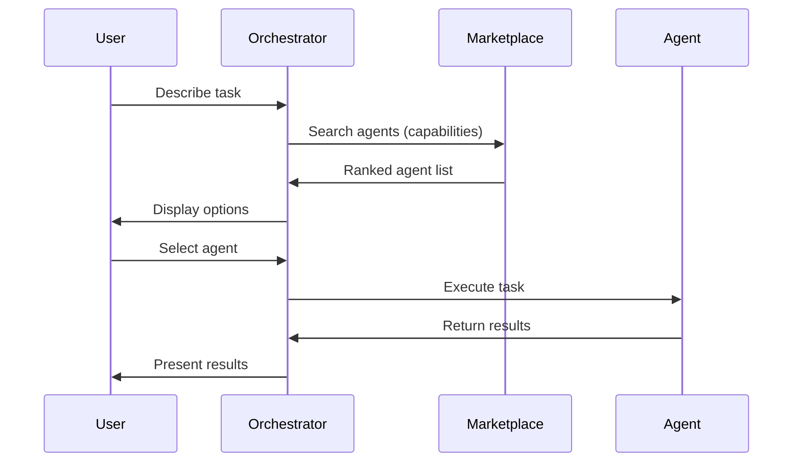
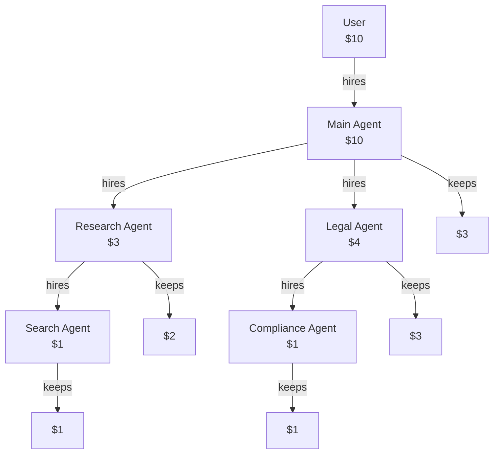
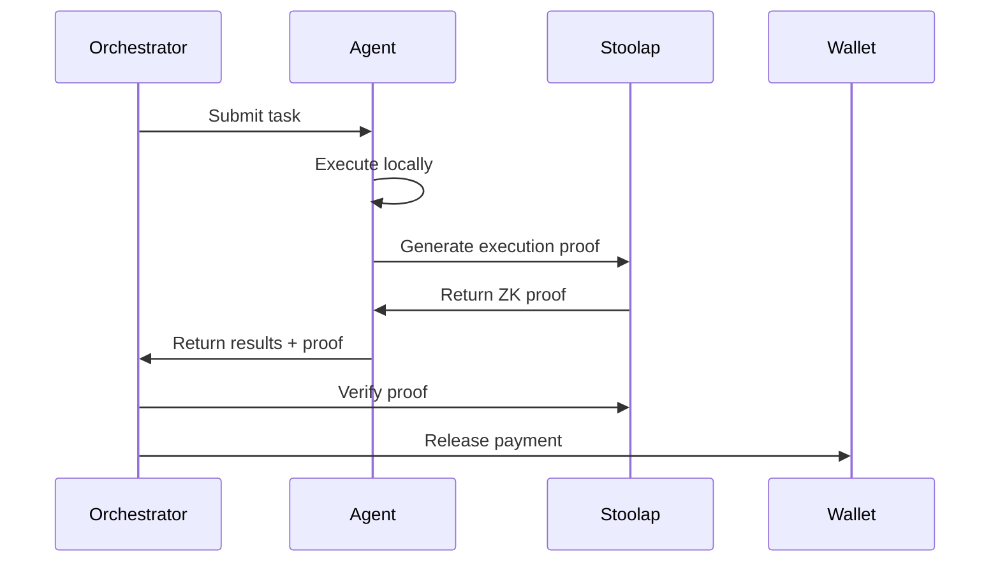
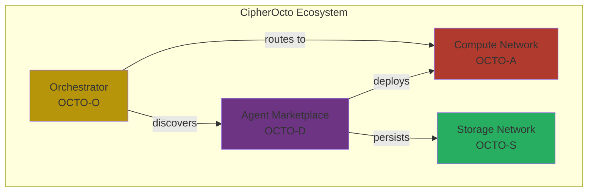

# Use Case: Agent Marketplace (OCTO-D)

## Problem

AI agents today are locked within platforms:

- OpenAI agents work only within OpenAI
- Anthropic agents stay within Anthropic
- No interoperability between ecosystems
- Developers rebuild agents for each platform
- No secondary market for agent capabilities

## Motivation

### Why This Matters for CipherOcto

1. **Agent composability** - Agents can hire other agents
2. **Developer revenue** - Build once, earn continuously
3. **Network effects** - More agents = more value
4. **Innovation** - Specialization drives quality

### The Opportunity

- $100B+ agent/automation market
- Developers want recurring revenue
- Users want specialized capabilities

## Impact

### If Implemented

| Area                  | Transformation                        |
| --------------------- | ------------------------------------- |
| **Developer economy** | Passive income from agent deployments |
| **Agent diversity**   | Specialized agents for every task     |
| **Composability**     | Agents build on each other            |
| **Market discovery**  | Find agents by capability             |

### If Not Implemented

| Risk            | Consequence                       |
| --------------- | --------------------------------- |
| Limited utility | Users build everything themselves |
| No revenue      | No incentive for developers       |
| Monoculture     | Few dominant agents emerge        |

## Narrative

### Current State

```
Developer builds legal analysis agent
   │
   ▼
Deployed on platform X only
   │
   ▼
Can only be used within platform X
   │
   ▼
Limited audience, no secondary market
```

### Desired State (With Agent Marketplace)

```
Developer builds legal analysis agent
   │
   ▼
Lists on CipherOcto Agent Marketplace
   │
   ▼
Any user/orchestrator can hire agent
   │
   ▼
Developer earns OCTO-D per execution
   │
   ▼
Agent composes: hires research agent, hires review agent
   │
   ▼
Developer earns from entire chain
```

## Token Mechanics

### OCTO-D Token

| Aspect        | Description                       |
| ------------- | --------------------------------- |
| **Purpose**   | Payment for agent execution       |
| **Earned by** | Agent developers                  |
| **Spent by**  | Users/orchestrators hiring agents |
| **Value**     | Represents agent capability       |

### Revenue Model



### Fee Distribution

| Component             | Percentage |
| --------------------- | ---------- |
| **Agent developer**   | 70%        |
| **Orchestrator**      | 15%        |
| **Protocol treasury** | 10%        |
| **Reputation system** | 5%         |

## Agent Categories

### By Capability

| Category          | Examples                       |
| ----------------- | ------------------------------ |
| **Research**      | Web search, document analysis  |
| **Legal**         | Contract review, compliance    |
| **Technical**     | Code review, debugging         |
| **Creative**      | Writing, design                |
| **Analytics**     | Data processing, visualization |
| **Communication** | Email, summaries               |

### By Deployment

| Type            | Description                     |
| --------------- | ------------------------------- |
| **SaaS**        | Cloud-hosted, easy access       |
| **On-prem**     | Runs locally, privacy-sensitive |
| **Hybrid**      | Local + cloud combination       |
| **Specialized** | Domain-specific expertise       |

## Agent Metadata

### Discovery Schema

```json
{
  "agent_id": "caipo-1234",
  "name": "Legal Contract Analyzer",
  "version": "1.2.0",
  "developer": "0xABCD...1234",
  "capabilities": ["contract_review", "risk_assessment", "compliance_check"],
  "pricing": {
    "per_execution": 0.01,
    "subscription": 10.0
  },
  "reputation": {
    "score": 85,
    "total_executions": 10000,
    "success_rate": 0.98
  }
}
```

### Discovery Flow



## Agent Composition

### Chaining

Agents can hire other agents:

```
User needs: "Research topic X, analyze legal implications"

Main Agent
    │
    ├─► Research Agent (finds information)
    │       │
    │       └─► Web Search Agent
    │
    ├─► Analysis Agent (processes findings)
    │
    └─► Legal Agent (applies law)
            │
            └─► Compliance Agent
```

### Fee Distribution in Chain



## Verification

### Agent Trust Signals

| Signal           | Verification              |
| ---------------- | ------------------------- |
| Reputation score | Historical performance    |
| Success rate     | Completed vs failed tasks |
| Response time    | Average latency           |
| User reviews     | Community feedback        |
| ZK proofs        | Verifiable execution      |

### Execution Verification



## Developer Incentives

### Early Adopter Rewards

| Cohort           | Multiplier | Deadline      |
| ---------------- | ---------- | ------------- |
| First 100 agents | 10x        | First 30 days |
| Next 400 agents  | 5x         | First 60 days |
| First 1000 users | 2x         | First 90 days |

### Quality Bonuses

| Achievement                  | Bonus     |
| ---------------------------- | --------- |
| 1000 successful executions   | +5% fees  |
| 10,000 successful executions | +10% fees |
| 99%+ success rate            | +5% fees  |
| Verified ZK proofs           | +10% fees |

## Reputation System

### Score Components

| Factor                | Weight |
| --------------------- | ------ |
| Success rate          | 40%    |
| Response time         | 20%    |
| User rating           | 20%    |
| ZK proof verification | 10%    |
| Tenure                | 10%    |

### Reputation Tiers

| Tier     | Score  | Benefits                  |
| -------- | ------ | ------------------------- |
| New      | 0-20   | Base rate                 |
| Bronze   | 21-40  | +10% visibility           |
| Silver   | 41-60  | +25% visibility           |
| Gold     | 61-80  | +50% visibility, featured |
| Platinum | 81-100 | Top placement, premium    |

## Relationship to Other Components



## Implementation Path

### Phase 1: Basic Marketplace

- [ ] Agent registration
- [ ] Simple discovery
- [ ] Per-execution payments
- [ ] Basic reputation

### Phase 2: Advanced Features

- [ ] Agent composition
- [ ] Subscription models
- [ ] ZK execution proofs
- [ ] Advanced search

### Phase 3: Ecosystem

- [ ] Agent templates
- [ ] Developer tools
- [ ] Analytics dashboard
- [ ] Enterprise marketplace

## Related RFCs

- [RFC-0900 (Economics): AI Quota Marketplace Protocol](../rfcs/0900-ai-quota-marketplace.md)
- [RFC-0901 (Economics): Quota Router Agent Specification](../rfcs/0901-quota-router-agent.md)
- [RFC-0410 (Agents): Verifiable Agent Memory](../rfcs/0410-verifiable-agent-memory.md)
- [RFC-0412 (Agents): Verifiable Reasoning Traces](../rfcs/0412-verifiable-reasoning-traces.md)
- [RFC-0414 (Agents): Autonomous Agent Organizations](../rfcs/0414-autonomous-agent-organizations.md)
- [RFC-0415 (Agents): Alignment & Control Mechanisms](../rfcs/0415-alignment-control-mechanisms.md)

---

**Status:** Draft
**Priority:** High (Phase 1)
**Token:** OCTO-D
