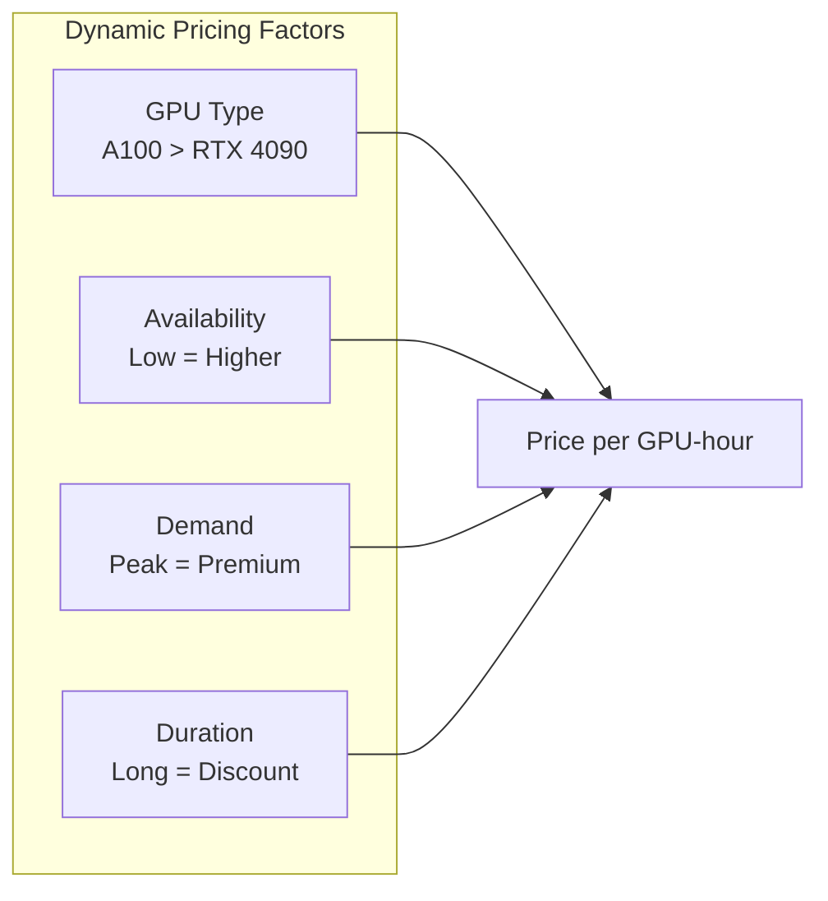
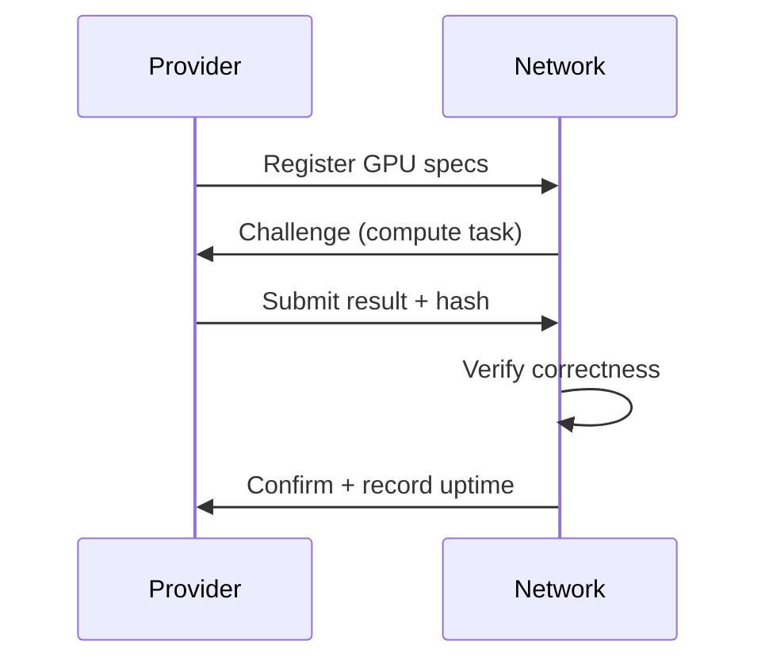
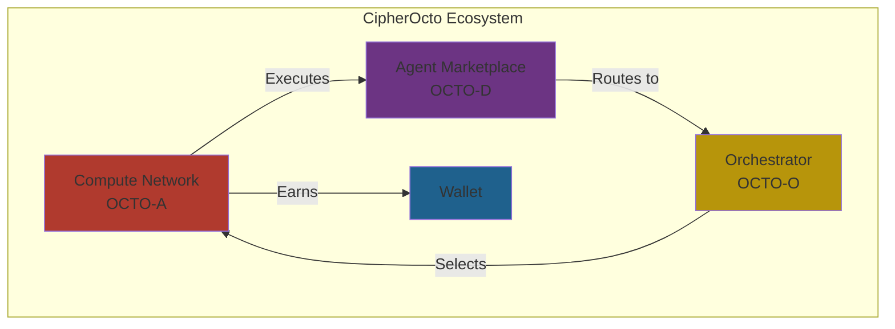

# Use Case: Compute Provider Network (OCTO-A)

## Problem

The CipherOcto network requires computational resources to execute AI agents, but:

- GPU providers worldwide have 40-60% idle capacity
- No decentralized marketplace exists for monetizing idle compute
- Enterprises cannot easily lease compute resources
- AI inference costs remain centralized and expensive

## Motivation

### Why This Matters for CipherOcto

1. **Infrastructure foundation** - Compute is the backbone of agent execution
2. **Revenue opportunity** - GPU owners earn from idle hardware
3. **Cost reduction** - Competitive pricing vs centralized clouds
4. **Decentralization** - No single provider controls the network

### The Opportunity

- $50B+ in wasted GPU compute annually
- Growing demand for inference capacity
- DePIN sector proving decentralized compute works

## Impact

### If Implemented

| Area                 | Transformation                   |
| -------------------- | -------------------------------- |
| **Network Supply**   | Global compute pool available    |
| **Cost Efficiency**  | 30-50% savings vs centralized    |
| **Provider Revenue** | New income stream for GPU owners |
| **Resilience**       | No single point of failure       |

### If Not Implemented

| Risk                  | Consequence                   |
| --------------------- | ----------------------------- |
| No execution capacity | Agents cannot run             |
| Centralized fallback  | Becomes another cloud service |
| High costs            | Limits network adoption       |

## Narrative

### Current State (Fragmented)

```
GPU Owner A: RTX 4090 sitting idle 20 hours/day
GPU Owner B: A100 cluster underutilized
AI Developer: Needs compute, must use AWS/GCP at high cost
```

### Desired State (With Compute Network)

```
GPU Owner A registers hardware, sets pricing
GPU Owner B lists capacity on network
AI Developer submits task → routed to available GPU
Providers earn OCTO-A tokens for execution
```

## Token Mechanics

### OCTO-A Token

| Aspect        | Description                         |
| ------------- | ----------------------------------- |
| **Purpose**   | Payment for compute resources       |
| **Earned by** | GPU/inference providers             |
| **Spent by**  | Agent execution, task processing    |
| **Value**     | Represents compute time (GPU-hours) |

### Pricing Model



### Value Flow

```
Provider: GPU time → OCTO-A → Can swap → OCTO (governance)
User: OCTO-A → Agent execution → Results
```

## Provider Types

### Tier 1: Consumer Hardware

- RTX 3060/4070/4090 series
- Mac M-series (Apple Silicon)
- Entry-level proof of concept

### Tier 2: Professional Hardware

- A100, H100, H200
- Professional workstations
- Small render farms

### Tier 3: Data Center

- Large GPU clusters
- Enterprise-grade hardware
- Multi-GPU setups

## Verification

### Proof of Work



### Trust Signals

| Signal      | Verification                  |
| ----------- | ----------------------------- |
| Uptime      | Continuous availability check |
| Performance | Benchmark tests               |
| Accuracy    | Result validation             |
| Reliability | Historical track record       |

## Slashing Conditions

Providers lose stake for:

| Offense                | Penalty          |
| ---------------------- | ---------------- |
| **Sybil**              | 100% stake slash |
| **Invalid work**       | 25% stake slash  |
| **Extended downtime**  | 5% per hour      |
| **Price manipulation** | 50% stake slash  |

## Early Adopter Incentives

| Cohort              | Multiplier  | Deadline      |
| ------------------- | ----------- | ------------- |
| First 100 providers | 10x rewards | First 30 days |
| Next 400 providers  | 5x rewards  | First 60 days |
| Next 1000 providers | 2x rewards  | First 90 days |

## Relationship to Other Components



## Implementation Path

### Phase 1: Basic Provisioning

- [ ] Provider registration
- [ ] Simple task submission
- [ ] Basic payment in OCTO-A
- [ ] Manual verification

### Phase 2: Enhanced Trust

- [ ] Automated benchmark verification
- [ ] Reputation system integration
- [ ] Dynamic pricing
- [ ] ZK proofs of execution

### Phase 3: Full Network

- [ ] Global GPU marketplace
- [ ] Real-time bidding
- [ ] Enterprise integrations
- [ ] Hardware diversity support

## Related RFCs

- [RFC-0100: AI Quota Marketplace Protocol](../rfcs/0100-ai-quota-marketplace.md)
- [RFC-0101: Quota Router Agent Specification](../rfcs/0101-quota-router-agent.md)

---

**Status:** Draft
**Priority:** High (Phase 1)
**Token:** OCTO-A
