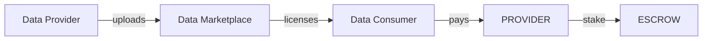
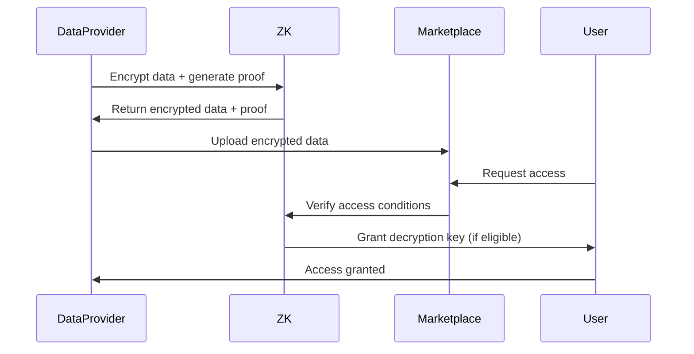

# Use Case: Data Marketplace

## Problem

Valuable data remains locked:
- Enterprises have datasets that could train better AI
- Individuals cannot monetize their personal data
- Researchers lack access to quality datasets
- No trustless way to verify data quality

## Motivation

### Why This Matters for CipherOcto

1. **Data economy** - Unlock trapped value in datasets
2. **Quality signals** - Reputation-based verification
3. **Privacy control** - Data flagging system enforced
4. **Research access** - Democratize AI training data

## Data Classification

| Level | Access | Monetization |
|-------|--------|--------------|
| **PRIVATE** | Owner only | None |
| **CONFIDENTIAL** | Selected agents | Premium |
| **SHARED** | Verified agents | Standard |
| **PUBLIC** | Anyone | Full |

## Token Mechanics

### Value Flow



### Pricing Models

| Model | Description |
|-------|-------------|
| **Per-query** | Pay per data access |
| **Subscription** | Monthly data access |
| **One-time** | Buy dataset outright |
| **Revenue share** | % of AI revenue generated |

## Verification

### Data Quality Signals

| Signal | Verification |
|--------|--------------|
| Provenance | Origin verification |
| Freshness | Last update timestamp |
| Completeness | Missing data percentage |
| Accuracy | Spot-check validation |
| ZK proofs | Privacy-preserving verification |

### Quality Scores

```
Score = (Accuracy * 0.4) + (Freshness * 0.2) + (Completeness * 0.2) + (Reputation * 0.2)
```

## Privacy Enforcement

### ZK Integration



### Access Control

| Classification | Verification Required |
|----------------|---------------------|
| PRIVATE | Owner signature only |
| CONFIDENTIAL | Owner + reputation check |
| SHARED | Reputation threshold |
| PUBLIC | None |

## Use Cases

### Training Data
- Model fine-tuning datasets
- Evaluation benchmarks
- Synthetic data generation

### Real-time Data
- Market feeds
- Weather data
- News aggregation

### Domain Expertise
- Legal precedents
- Medical records (anonymized)
- Scientific datasets

## Provider Requirements

### Minimum Stake

| Data Type | Minimum Stake |
|-----------|--------------|
| Public | 100 OCTO |
| Shared | 500 OCTO |
| Confidential | 1000 OCTO |

### Slashing Conditions

| Offense | Penalty |
|---------|---------|
| **Fake data** | 100% stake + ban |
| **Privacy breach** | 100% stake + legal |
| **Inaccurate quality** | 50% stake |
| **Unauthorized sharing** | 75% stake |

---

**Status:** Draft
**Priority:** Medium
**Token:** All (multi-token)
