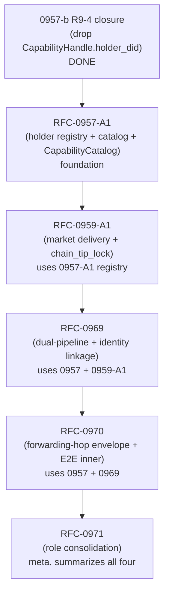

# Use Case: Dual-Mode Authorization Workflow (Legacy Bearer + Capability)

## Status

Intent layer (per `docs/BLUEPRINT.md` §Use Cases). Driven by `docs/research/2026-08-01-dual-mode-workflow-gap-research.md` (R1-R5 convergence reached).

## Problem

CipherOcto's quota-router mesh forwards inference requests toward the destination node that holds the provider key. The destination node serves two distinct client populations through the **same gateway**:

1. **Legacy clients** — claude-code, hardcoded HTTP agents, anything written before the capability substrate. They send `Authorization: Bearer <sk-...>`. They have no Ed25519 keypair on the client side; they cannot sign.
2. **Capability clients** — wallet-side agents, anything built on the CipherOcto SDK that holds an `IdentityKey`. They send `X-Capability-Token: <3-segment macaroon>`. They sign via RFC-0009 §Capability Keys.

The wire supports both. The spec does not. Today's documents scatter the dual-pipeline story across RFC-0903 (virtual keys), RFC-0957 (capability token), RFC-0870 (forwarding network), RFC-0959 (settlement chain), and a one-line aside in RFC-0957 §Wire Format. No document names the destination-node-as-mints role, no document specifies the per-hop authorization envelope, no document defines what the seller delivers to the buyer when a deal settles in the RFC-0955 marketplace.

The result: every implementer builds a slightly different authorization path. The egress-side struct (`CapabilityHandle`) carries a dead `holder_did` field that is REMOVED in this amendment (per M6); the egress struct becomes `{cap_root_hash: [u8;32]}` only. (R9-N9 fix: prior text framed the bug as "no producer" — the fix is removal, not producer-addition.)

## Stakeholders

- **Primary: Buyer (wallet-side agent operator)** — purchases access via RFC-0955 marketplace; wants both bearer (for legacy client fallback) + capability token (for wallet-side SDK) atomically delivered at deal settlement.
- **Primary: Legacy client operator** — runs claude-code or a hardcoded HTTP agent; wants bearer to keep working without client-side changes.
- **Primary: Destination node operator** — runs the node that holds the provider key; mints both bearer and capability tokens; maintains the catalog of holders; verifies incoming authorization at the gateway.
- **Secondary: Intermediate router operator** — runs a node in the RFC-0870 forwarding mesh; forwards envelopes per RFC-0970 (E2E-encrypted inner content + per-hop wrappers).
- **Secondary: Settlement contract** — RFC-0959 settlement chain; needs `DealSettled` event to fire when both tokens are delivered.
- **Affected: Wallet SDK implementer** — RFC-0009 §Identity substrate holder; needs the catalog resolver at parse time.

## Motivation

Why this matters for CipherOcto:

- **The marketplace is dead without delivery.** RFC-0955 lets sellers list access, RFC-0959-A1 lets deals settle + deliver.
- **The mesh is brittle without hop auth.** RFC-0970 per-hop envelope with E2E-encrypted inner content.
- **The destination node is the only role capable of minting.** RFC-0971 names the binding explicitly.
- **The wallet already trusts the destination.** The egress-side `holder_did` field is structurally dead; the mint API stays as-is.

The dual-mode workflow is the **first end-to-end workflow** that exercises the full CipherOcto stack: wallet identity → marketplace settlement → delivery → gateway verification → provider boundary → return path.

## Success Metrics

| Metric                                | Target                                                                                                                                                                                                                                                                                                                                                                                                                                                                                                                                                                                                                                                                                                                            | Measurement                                                                                                                                                                                                              |
| ------------------------------------- | --------------------------------------------------------------------------------------------------------------------------------------------------------------------------------------------------------------------------------------------------------------------------------------------------------------------------------------------------------------------------------------------------------------------------------------------------------------------------------------------------------------------------------------------------------------------------------------------------------------------------------------------------------------------------------------------------------------------------------- | ------------------------------------------------------------------------------------------------------------------------------------------------------------------------------------------------------------------------ |
| **M1: Dual-pipeline auth coverage**   | 100% of gateway requests routed through bearer path, capability path, or both (AND-gate)                                                                                                                                                                                                                                                                                                                                                                                                                                                                                                                                                                                                                                          | Integration test exercising both headers + both parse paths + identity linkage on the same gateway instance                                                                                                              |
| **M2: Forwarding-hop isolation**      | 0 bytes of long-lived bearer/capability visible at intermediate routers                                                                                                                                                                                                                                                                                                                                                                                                                                                                                                                                                                                                                                                           | E2E encryption + per-hop channel binding per RFC-0970                                                                                                                                                                    |
| **M3: Market delivery atomicity**     | Every settled deal results in exactly one bearer + exactly one capability token delivered                                                                                                                                                                                                                                                                                                                                                                                                                                                                                                                                                                                                                                         | Stoolap transaction with `UNIQUE(ask_id, kind)` + `insert_dual` atomic                                                                                                                                                   |
| **M4: HolderRegistry lookup latency** | ≤ 5ms p99 over 100K holders                                                                                                                                                                                                                                                                                                                                                                                                                                                                                                                                                                                                                                                                                                       | Stoolap BLAKE3-keyed PK index benchmark                                                                                                                                                                                  |
| **M5: Mint API signature delta**      | `mint(root_secret, holder, holder_did, initial_caveats) -> Result<CapabilityToken, MintError>` — 4 args, persistence-free (R6-C3 fix); R58-N8 reconciliation: research conclusion at `docs/research/2026-08-01-dual-mode-workflow-gap-research.md:310,386` preserves the 5-arg catalog form for the wallet's auto-insert post-write hook path; the canonical `mint` (R6-C3 fix) is persistence-free and 4-arg; the 5-arg catalog form lives only in `octo-wallet::capability::mint_with_catalog_persistence` as a thin wrapper that calls the 4-arg canonical mint inside an open transaction. RESEARCH CONCLUSION SUPERSEDED for the persistence-free canonical signature; the catalog wrapper is preserved for backward compat. | Diff against RFC-0957 v1.0 §Algorithms shows NO parameter additions; R6-C3 fix REMOVED `catalog` and `Option<&mut Transaction>` parameters                                                                               |
| **M6: Egress-side struct shrink**     | `CapabilityHandle.holder_did` removed; struct is `{cap_root_hash: [u8;32]}` only                                                                                                                                                                                                                                                                                                                                                                                                                                                                                                                                                                                                                                                  | Static check (R58-N9 fix): `grep -rn 'pub holder_did' crates/quota-router-core/src/egress.rs` returns 0; the broad `grep -rn holder_did` was a false positive because removal-explanation comments contain the substring |
| **M7: Per-hop wrap latency**          | ≤ 2ms p99 added per hop                                                                                                                                                                                                                                                                                                                                                                                                                                                                                                                                                                                                                                                                                                           | Bench `wrap_for_hop(inner, next_hop_did, prev_chain_hash, ttl_millis, wallet, clock, db: Arc<stoolap::Database>)` (canonical 7-arg per RFC-0970 §Algorithms; R23-N3 fix: prior 3-arg example was stale)                  |

## Constraints

- **Must not:** break RFC-0903 virtual-key path.
- **Must not:** change the RFC-0957 §Wire Format.
- **Must not:** change the RFC-0957 `CapabilityToken::mint` semantics; the signature is AMENDED to 4-arg persistence-free `mint(root_secret, holder, holder_did, initial_caveats)` (R6-C3 fix removes the prior auto-insert post-write hook and the `catalog`/`Option<&mut Transaction>` parameters).
- **Must not:** allow intermediate hops to inspect the inner authorization header (E2E-encrypted to destination per RFC-0970).
- **Must not:** require a global identity lookup at verify time.
- **Limited to:** capability tokens based on RFC-0957 macaroon v1 + Ed25519 substrate per RFC-0009.
- **Limited to:** destinations that are also mints (Router ∧ TokenIssuer ∧ Asker per RFC-0971). Pure forwarders are covered by RFC-0970 §pure_forward.

## Non-Goals

- **ZK capability subclass** — RFC-0958. The dual-pipeline authority extends to ZK, but that's its own scoping exercise. RFC-0957-A1 must remain subclass-agnostic.
- **Provider-key vault redesign** — RFC-0009 §Vault is the authoritative spec.
- **Wallet-side derivation key changes** — RFC-0009 §Capability Keys is authoritative.
- **Cross-provider correlation analysis** — RFC-0957-b R9 already addresses this.
- **Asking settlement math** — RFC-0959 §Algorithms unchanged; only the delivery artifact is added.
- **Network-level federation of HolderRegistry** — RFC-0862 handles sync.
- **Browser-side enterprise SSO** — RFC-0949 is separate.
- **Asking chain re-write** — RFC-0959 v1.0 Option A is settled.

## Impact

What changes if this is implemented:

- **Wallet SDK** gains a `HolderRegistry` trait with a `StoolapHolderRegistry` reference impl. Parsing a capability token from the wire requires the wallet to look up `(holder_did, holder_pub, caveats_canonical, ask_id, ttl_unix)` from the local registry.
- **Destination node** runs a unified `HolderRegistry` that backs both bearer and capability issuance. The same node function handles both paths.
- **Forwarding hops** run E2E-encrypted inner content + per-hop wrappers (RFC-0970). Intermediate routers never see the long-lived credential.
- **Marketplace deals** deliver both tokens at settlement time (RFC-0959-A1).
- **Egress-side `CapabilityHandle`** loses its dead `holder_did` field.
- **The dual-pipeline becomes a single spec concept** rather than five scattered references.

The architectural impact: CipherOcto's mesh becomes a single coherent authorization surface.

## Related RFCs

- RFC-0903 — Virtual Keys
- RFC-0949 — Enterprise SSO
- RFC-0957 — Capability Token Format
- RFC-0957-A1 — Holder Registry + Catalog Storage (amendment)
- RFC-0959 — Ask Settlement Chain
- RFC-0959-A1 — Market Delivery Envelope (amendment)
- RFC-0955 — Model Liquidity Layer
- RFC-0958 — ZK Capability Subclass
- RFC-0853 — Overlay Cryptography
- RFC-0870 — Distributed Quota Router Network
- RFC-0862 — Stoolap Sync Layer
- RFC-0009 — Identity Management
- RFC-0126 — Deterministic Serialization
- RFC-0969 — Dual-Pipeline Authorization (new)
- RFC-0970 — Forwarding-Hop Auth Envelope (new)
- RFC-0971 — Destination-Node Role Consolidation (new)

## Related Research

- `docs/research/2026-08-01-dual-mode-workflow-gap-research.md` — R1-R5 convergence (5 rounds, 31 findings resolved, 0 open)

## Related Missions

- `missions/claimed/0957-b-provider-boundary-exercise-path.md` — R9-4 closure DONE (commit `c87a4833` on `next`, 2026-08-01)
- `missions/claimed/0957-a-capability-token-macaroon.md` — base mint + verify (mint signature amended by RFC-0957-A1)
- Future: `missions/open/0957-c-holder-registry-impl.md`
- Future: `missions/open/0957-d-wire-resolver-update.md`
- Future: `missions/open/0957-e-mint-txn-parameter.md`
- Future: `missions/open/0959-b-market-delivery-impl.md`
- Future: `missions/open/0959-c-delivery-gossip-integration.md`
- Future: `missions/open/0969-a-dual-pipeline-gateway.md`
- Future: `missions/open/0969-b-dual-issuance-mint.md`
- Future: `missions/open/0970-a-hop-envelope.md`
- Future: `missions/open/0970-b-forward-integration.md`
- Future: `missions/open/0971-a-role-binding.md`

## Implementation Path

Per the research document's sequencing (now in Mermaid):

1 mission fix + 5 RFCs (2 amendments + 3 new), 4-5 sessions of work. Commits free; push + remote writes need explicit user instruction per repo convention.

## Cross-Reference: Outgoing Edges

This Use Case is referenced by (and motivates) the following RFCs:

- RFC-0957-A1 — Holder Registry + Catalog Storage
- RFC-0959-A1 — Market Delivery Envelope
- RFC-0969 — Dual-Pipeline Authorization
- RFC-0970 — Forwarding-Hop Auth Envelope
- RFC-0971 — Destination-Node Role Consolidation
