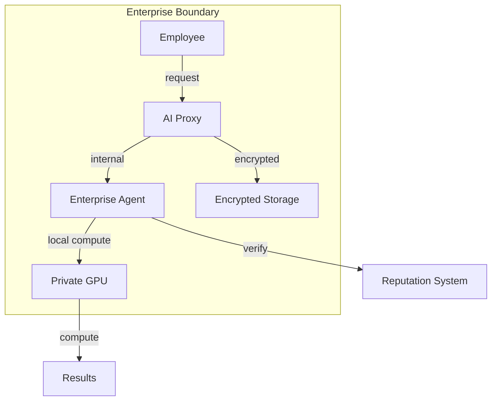
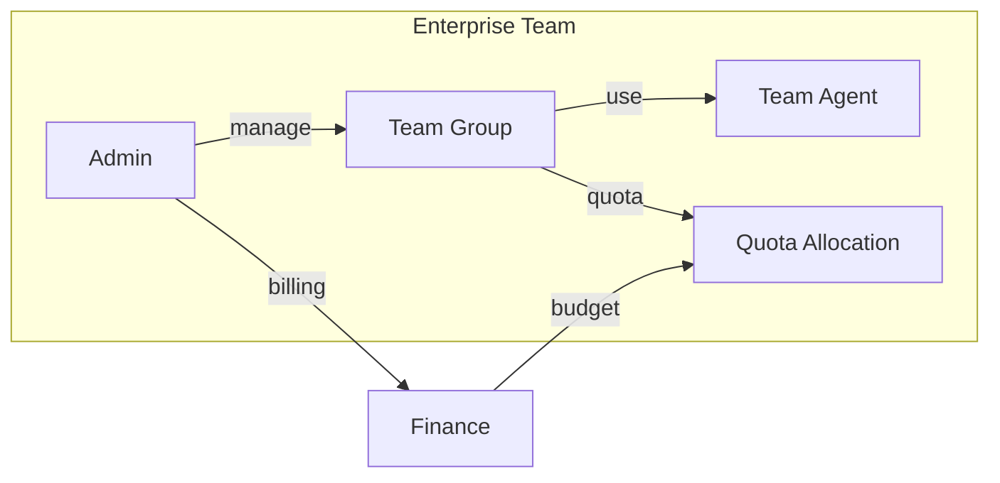
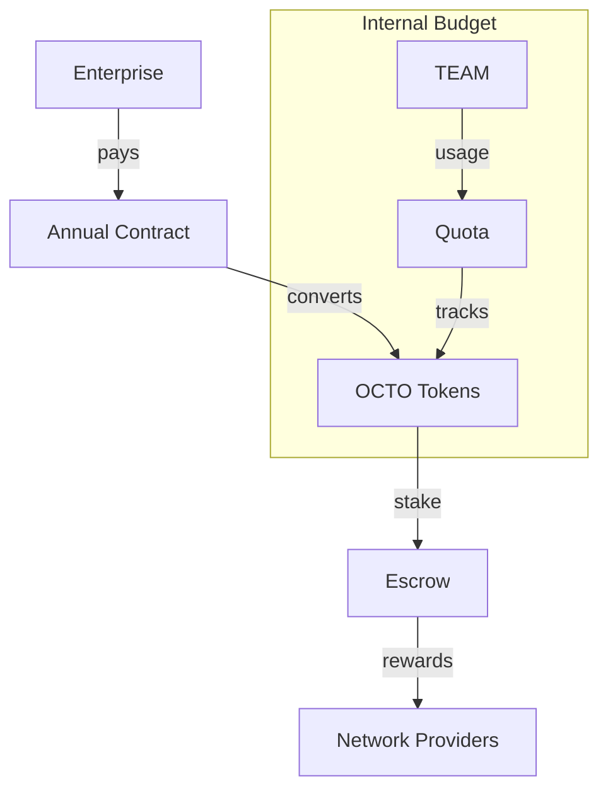

# Use Case: Enterprise Private AI

## Problem

Enterprises face AI challenges:

- Cannot send sensitive data to external APIs
- Need AI capabilities without infrastructure overhead
- Must comply with SOC2, HIPAA, GDPR
- Want cost control and predictability

## Motivation

### Why This Matters for CipherOcto

1. **Enterprise revenue** - High-value customer segment
2. **Compliance** - Built-in regulatory support
3. **Privacy** - Data never leaves boundaries
4. **Cost efficiency** - 30-50% vs current solutions

## Solution

### Private AI Infrastructure



### Deployment Options

| Model             | Data Location          | Compliance         |
| ----------------- | ---------------------- | ------------------ |
| **On-premises**   | Enterprise data center | Full control       |
| **Private cloud** | Dedicated VPC          | SOC2 Type II       |
| **Hybrid**        | Edge + cloud           | Flexible           |
| **Sovereign**     | Geographic restriction | GDPR/ localization |

## Features

### Compliance Native

| Framework | Support              |
| --------- | -------------------- |
| SOC2      | ✅ Type I & II       |
| HIPAA     | ✅ BAA available     |
| GDPR      | ✅ Data localization |
| ISO 27001 | ✅ Certification     |

### Team Management



### Capabilities

| Feature              | Description                   |
| -------------------- | ----------------------------- |
| **Team agents**      | Specialized AI per department |
| **Shared memory**    | Team knowledge bases          |
| **Quota management** | Budget controls               |
| **Audit logs**       | Full activity tracking        |
| **Access control**   | RBAC integration              |

## Token Economics

### Enterprise Token Flow



### Pricing Models

| Model             | Description             | Best For          |
| ----------------- | ----------------------- | ----------------- |
| **Subscription**  | Fixed monthly AI budget | Predictable costs |
| **Pay-as-you-go** | Per-request pricing     | Variable usage    |
| **Enterprise**    | Custom annual contract  | Large scale       |
| **Hybrid**        | Base + variable         | Mix of needs      |

## Use Cases

### Department-Specific Agents

| Department      | Agent Capability            |
| --------------- | --------------------------- |
| **Legal**       | Contract review, compliance |
| **Finance**     | Analysis, forecasting       |
| **HR**          | Resume screening, Q&A       |
| **Sales**       | Lead scoring, CRM           |
| **Support**     | Ticket classification       |
| **Engineering** | Code review, debugging      |

### Compliance Workflows

```
User Query →
    │
    ├─► Classify (PRIVATE/CONFIDENTIAL)
    │
    ├─► Route to compliant agent
    │
    ├─► Execute on approved compute
    │
    ├─► Log to audit trail
    │
    └─► Return encrypted result
```

## Security

### Data Protection

| Layer         | Protection         |
| ------------- | ------------------ |
| **Transport** | TLS 1.3            |
| **Storage**   | AES-256 encryption |
| **Compute**   | TEE (optional)     |
| **Access**    | RBAC + MFA         |
| **Audit**     | Immutable logs     |

### Privacy Levels

| Level            | Behavior                     |
| ---------------- | ---------------------------- |
| **PRIVATE**      | Local-only, no network       |
| **CONFIDENTIAL** | Encrypted, restricted agents |
| **SHARED**       | Encrypted, verified agents   |
| **PUBLIC**       | Allowed out-of-band          |

## Integration

### Enterprise Systems

| System               | Integration         |
| -------------------- | ------------------- |
| **Active Directory** | SSO/LDAP            |
| **Slack/Teams**      | Bot integration     |
| **CRM**              | Salesforce, HubSpot |
| **HRIS**             | Workday, BambooHR   |
| **SIEM**             | Splunk, Datadog     |

### API Access

```rust
// Enterprise API integration
struct EnterpriseConfig {
    organization_id: String,
    api_endpoint: String,
    auth: AuthMethod,
    compliance_level: ComplianceLevel,
}

impl EnterpriseClient {
    fn new(config: EnterpriseConfig) -> Self;
    fn create_agent(&self, spec: AgentSpec) -> AgentId;
    fn allocate_quota(&self, team: &str, amount: u64);
    fn get_audit_log(&self, filter: AuditFilter) -> Vec<AuditEntry>;
}
```

## Support

### Service Levels

| Tier             | Response Time | Support Hours | Price  |
| ---------------- | ------------- | ------------- | ------ |
| **Standard**     | 24 hours      | Business      | Base   |
| **Professional** | 4 hours       | 12x5          | +50%   |
| **Enterprise**   | 1 hour        | 24x7          | Custom |

---

**Status:** Draft
**Priority:** Medium (Phase 3)
**Token:** OCTO (primary), role tokens

## Related RFCs

- [RFC-0108: Verifiable AI Retrieval](../rfcs/0108-verifiable-ai-retrieval.md)
- [RFC-0109: Retrieval Architecture](../rfcs/0109-retrieval-architecture-read-economics.md)
