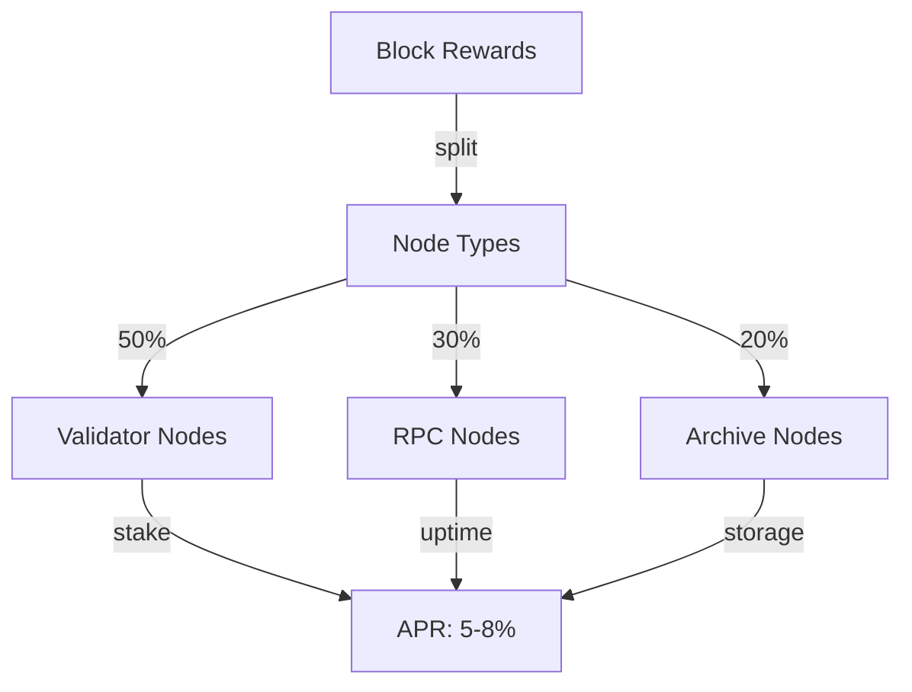
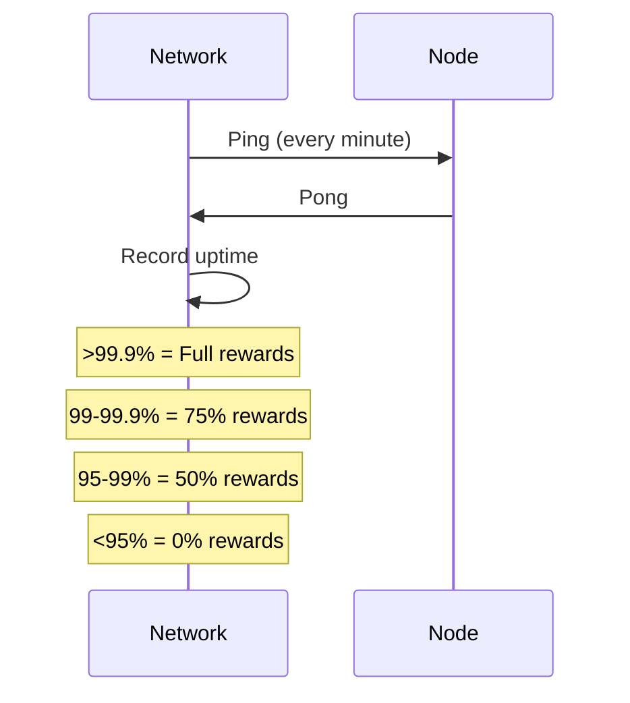

# Use Case: Node Operations (OCTO-N)

## Problem

CipherOcto requires infrastructure:

- Network validation and consensus
- State synchronization
- API endpoints for users
- Security monitoring

These nodes form the backbone of decentralization.

## Motivation

### Why This Matters for CipherOcto

1. **Decentralization** - No single point of control
2. **Accessibility** - Users need entry points
3. **Security** - Distributed validation
4. **Reliability** - Redundant infrastructure

## Token Mechanics

### OCTO-N Token

| Aspect        | Description                            |
| ------------- | -------------------------------------- |
| **Purpose**   | Payment for node operations            |
| **Earned by** | Node operators                         |
| **Spent by**  | Protocol (rewards)                     |
| **Value**     | Represents infrastructure contribution |

### Reward Structure



## Node Types

### Validator Nodes

| Aspect           | Description              |
| ---------------- | ------------------------ |
| **Role**         | Consensus participation  |
| **Requirements** | High stake, 99.9% uptime |
| **Rewards**      | Block production + fees  |
| **Slashing**     | Severe for double-sign   |

### RPC Nodes

| Aspect           | Description           |
| ---------------- | --------------------- |
| **Role**         | API endpoints         |
| **Requirements** | Low latency, reliable |
| **Rewards**      | Per-request fees      |
| **Slashing**     | Downtime penalties    |

### Archive Nodes

| Aspect           | Description             |
| ---------------- | ----------------------- |
| **Role**         | Historical data storage |
| **Requirements** | Large storage capacity  |
| **Rewards**      | Storage fees            |
| **Slashing**     | Data integrity failures |

### Light Nodes

| Aspect           | Description                   |
| ---------------- | ----------------------------- |
| **Role**         | Mobile/embedded participation |
| **Requirements** | Minimal resources             |
| **Rewards**      | Reduced but accessible        |
| **Slashing**     | None (observe-only)           |

## Requirements

### Hardware Specifications

| Node Type | CPU     | RAM  | Storage   | Bandwidth |
| --------- | ------- | ---- | --------- | --------- |
| Validator | 8 cores | 32GB | 500GB SSD | 1 Gbps    |
| RPC       | 4 cores | 16GB | 100GB SSD | 500 Mbps  |
| Archive   | 4 cores | 8GB  | 10TB HDD  | 100 Mbps  |
| Light     | 1 core  | 2GB  | 10GB      | 10 Mbps   |

### Stake Requirements

| Node Type | Minimum OCTO | Minimum OCTO-N |
| --------- | ------------ | -------------- |
| Validator | 10,000       | 1,000          |
| RPC       | 1,000        | 100            |
| Archive   | 500          | 50             |
| Light     | 0            | 0              |

## Verification

### Uptime Monitoring



### Performance Metrics

| Metric    | Target         | Impact               |
| --------- | -------------- | -------------------- |
| Uptime    | 99.9%          | Reward multiplier    |
| Latency   | <100ms         | RPC priority         |
| Sync time | <5min          | Validator status     |
| Storage   | 100% integrity | Archive verification |

## Slashing Conditions

### Validator Slashing

| Offense              | Penalty             |
| -------------------- | ------------------- |
| **Double sign**      | 100% stake          |
| **Liveness failure** | 1% per hour offline |
| **Censorship**       | 50% stake           |
| **Invalid state**    | 25% stake           |

### RPC Slashing

| Offense                   | Penalty           |
| ------------------------- | ----------------- |
| **Data manipulation**     | 100% stake        |
| **Extended downtime**     | 10% per day       |
| **Response manipulation** | 50% stake         |
| **Slow responses**        | Warning → penalty |

## Security

### Key Management

```
┌─────────────────────────────────────┐
│         Validator Security          │
├─────────────────────────────────────┤
│ • HSM required for validator keys   │
│ • Multi-sig for stake management    │
│ • Geographic distribution required   │
│ • Regular key rotation               │
└─────────────────────────────────────┘
```

### Best Practices

| Practice                | Requirement        |
| ----------------------- | ------------------ |
| Key storage             | HSM/TEE            |
| Geographic distribution | 3+ regions         |
| Monitoring              | 24/7 alerts        |
| Backup                  | Encrypted, offsite |
| Updates                 | Timely, tested     |

## Incentives

### Early Adopter Rewards

| Cohort                  | Multiplier | Deadline      |
| ----------------------- | ---------- | ------------- |
| First 50 validators     | 10x        | First 30 days |
| First 100 RPC nodes     | 5x         | First 60 days |
| First 200 archive nodes | 3x         | First 90 days |

### Performance Bonuses

| Achievement                 | Bonus |
| --------------------------- | ----- |
| 1 year continuous operation | +10%  |
| 99.99% uptime               | +5%   |
| Zero slashing events        | +10%  |
| Geographic diversity        | +5%   |

---

**Status:** Draft
**Priority:** High
**Token:** OCTO-N

## Related RFCs

- [RFC-0109 (Retrieval): Retrieval Architecture](../rfcs/0109-retrieval-architecture-read-economics.md)
- [RFC-0130 (Proof Systems): Proof-of-Inference Consensus](../rfcs/0130-proof-of-inference-consensus.md)
- [RFC-0140 (Consensus): Sharded Consensus Protocol](../rfcs/0140-sharded-consensus-protocol.md)
- [RFC-0141 (Consensus): Parallel Block DAG Specification](../rfcs/0141-parallel-block-dag.md)
- [RFC-0142 (Consensus): Data Availability & Sampling Protocol](../rfcs/0142-data-availability-sampling.md)
- [RFC-0143 (Networking): OCTO-Network Protocol](../rfcs/0143-octo-network-protocol.md)
- [RFC-0144 (Economics): Inference Task Market](../rfcs/0144-inference-task-market.md)
- [RFC-0145 (Networking): Hardware Capability Registry](../rfcs/0145-hardware-capability-registry.md)
