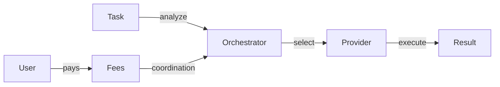
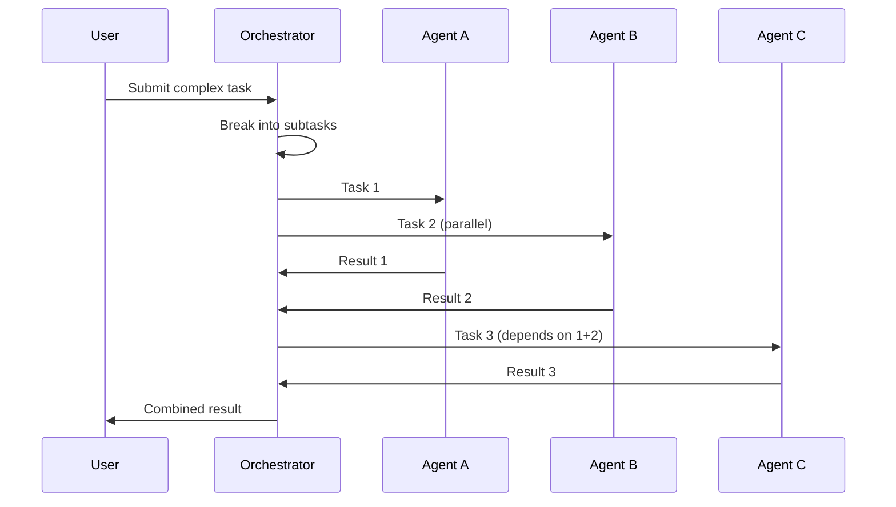

# Use Case: Orchestrator Role (OCTO-O)

## Problem

Users and agents need:
- Intelligent routing to best providers
- Trust-aware selection of services
- Privacy constraint enforcement
- Multi-party coordination

Without orchestration, users must manually select providers.

## Motivation

### Why This Matters for CipherOcto

1. **User experience** - Automated best-path selection
2. **Trust propagation** - Reputation system integration
3. **Efficiency** - Optimal resource allocation
4. **Composability** - Chain multiple agents/services

## Token Mechanics

### OCTO-O Token

| Aspect | Description |
|--------|-------------|
| **Purpose** | Payment for coordination services |
| **Earned by** | Orchestrators |
| **Spent by** | Users/agents needing routing |
| **Value** | Represents coordination complexity |

### Fee Structure



| Coordination Type | Fee |
|------------------|-----|
| Simple routing | 1-2% |
| Multi-agent chain | 5-10% |
| Complex orchestration | 10-15% |

## Responsibilities

### Task Analysis
- Understand user requirements
- Identify necessary capabilities
- Estimate complexity and cost

### Provider Selection
- Match requirements to providers
- Apply trust/reputation weighting
- Consider price/performance

### Execution Management
- Monitor task progress
- Handle failures gracefully
- Coordinate multi-party work

### Result Verification
- Validate outputs
- Enforce quality thresholds
- Handle disputes

## Routing Policies

### Policy Types

| Policy | Selection Criteria |
|--------|-------------------|
| **cheapest** | Lowest cost |
| **fastest** | Lowest latency |
| **quality** | Highest reputation |
| **balanced** | Price/performance score |
| **custom** | User-defined rules |

### Trust Weighting

```rust
struct TrustScore {
    reputation: u8,      // 0-100
    stake: u64,          // OCTO staked
    age_days: u32,       // Account age
    successful_tasks: u64,
}

fn calculate_weight(score: &TrustScore) -> f64 {
    (score.reputation as f64 * 0.4) +
    (min(score.stake, 10000) as f64 / 100.0 * 0.3) +
    (min(score.age_days, 365) as f64 / 365.0 * 0.2) +
    (min(score.successful_tasks, 1000) as f64 / 1000.0 * 0.1)
}
```

## Provider Coordination

### Multi-Agent Chaining



### Failure Handling

| Scenario | Response |
|----------|----------|
| Provider timeout | Retry with next best |
| Quality failure | Re-assign to different provider |
| Chain failure | Rollback, notify user |
| Dispute | Hold payment, escalate |

## Reputation for Orchestrators

### Scoring

| Metric | Weight |
|--------|--------|
| Task success rate | 40% |
| User satisfaction | 25% |
| Latency | 15% |
| Cost efficiency | 20% |

### Tier Benefits

| Tier | Score | Benefits |
|------|-------|----------|
| Bronze | 21-40 | Base routing |
| Silver | 41-60 | Priority listing |
| Gold | 61-80 | Featured placement |
| Platinum | 81-100 | Premium fees |

## Requirements

### Minimum Stake

| Tier | Stake Required |
|------|----------------|
| Basic | 500 OCTO |
| Standard | 5000 OCTO |
| Professional | 50,000 OCTO |
| Enterprise | 500,000 OCTO |

### Slashing Conditions

| Offense | Penalty |
|---------|---------|
| **Fraud** | 100% stake + ban |
| **Collusion** | 75% stake |
| **Poor routing** | 25% stake |
| **Data breach** | 100% stake |

---

**Status:** Draft
**Priority:** High (Phase 1)
**Token:** OCTO-O
