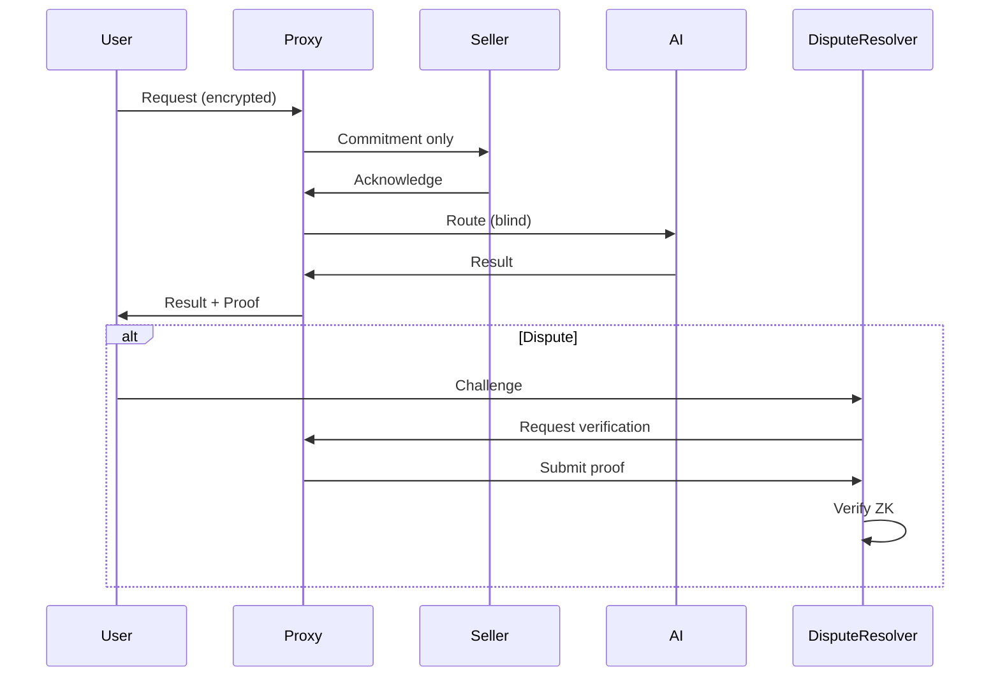
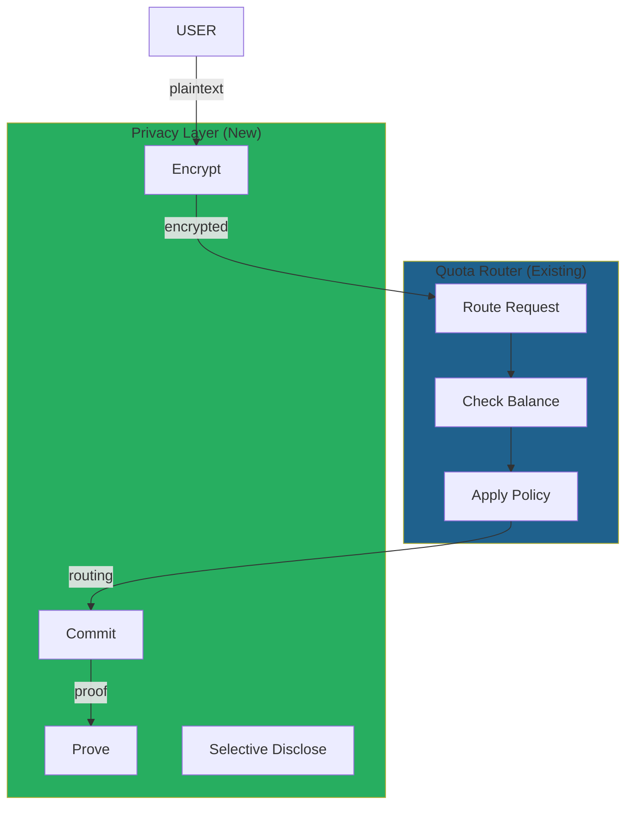
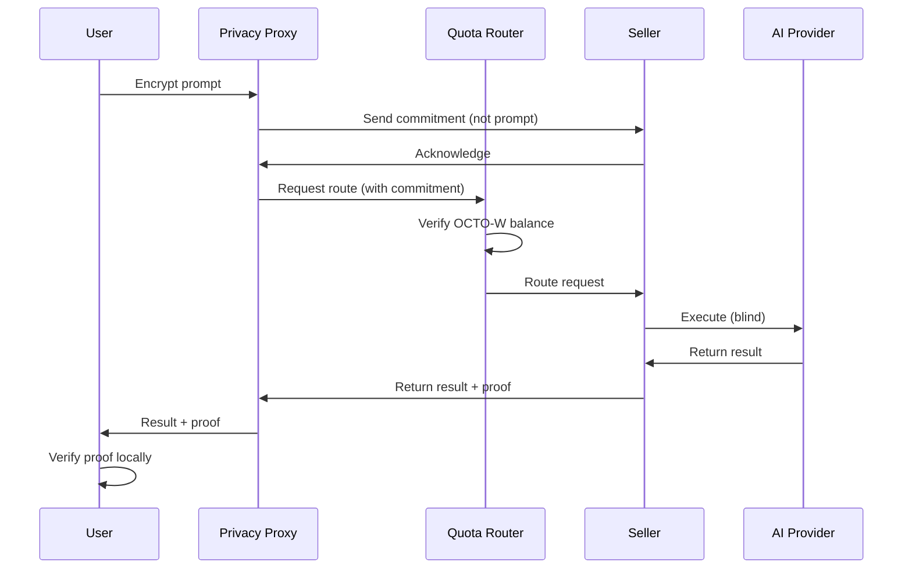

# Use Case: Privacy-Preserving Query Routing

## Problem

Current CipherOcto architecture has a privacy gap:

- Sellers see prompt content when proxying requests
- Trust assumption required - seller could leak/inspect data
- No cryptographic guarantee of privacy
- Enterprise users cannot use due to compliance

## Motivation

### Why This Matters for CipherOcto

1. **Privacy** - Cryptographic guarantee, not trust
2. **Compliance** - Meet SOC2, HIPAA, GDPR requirements
3. **Enterprise adoption** - Unblock enterprise users
4. **Competitive advantage** - Differentiator in market

### The Opportunity

- Enterprise AI market requires privacy guarantees
- No current solution for proxy-based routing with privacy
- Growing regulatory pressure

## Solution Architecture

### Privacy-Preserving Proxy

```mermaid
flowchart TD
    subgraph ENCRYPT["Client Side"]
        USER[User] --> ENC[Encrypt Prompt]
        ENC -->|encrypted| PROXY[Proxy]
    end

    subgraph COMMIT["Commitment Phase"]
        PROXY -->|commitment| SELLER[Seller]
        SELLER -->|verify commitment| PROXY
    end

    subgraph PROOF["Proof Generation"]
        PROXY --> ROUTE[Route to AI]
        ROUTE --> ZK[Generate ZK Proof]
        ZK --> PROOF[Proof of Correct Routing]
    end

    subgraph DECRYPT["Client Side"]
        PROOF -->|result + proof| USER
        USER -->|verify proof| V[Verify]
    end

    style ENC fill:#b03a2e
    style PROOF fill:#27ae60
    style V fill:#1f618d
```

## Privacy Levels

### Tiered Privacy Model

| Level            | What Seller Sees | Proof Type           |
| ---------------- | ---------------- | -------------------- |
| **Standard**     | Nothing          | Routing commitment   |
| **Confidential** | Model type only  | No input/output      |
| **Private**      | Nothing at all   | Full zk proof        |
| **Sovereign**    | User controls    | Selective disclosure |

### Standard Mode (Phase 1)

```
User Prompt → [Encrypt] → Proxy
                          │
                          ▼
                    Seller receives:
                    - Commitment (hash of encrypted)
                    - No plaintext
                    │
                    ▼
                    Route to AI
                    │
                    ▼
                    Return: result + proof
                    │
                    ▼
                    User verifies proof
```

### Private Mode (Phase 2)

```
User Prompt → [Encrypt + ZK-Commit] → Proxy
                                        │
                                        ▼
                                  Seller receives:
                                  - ZK commitment
                                  - Proof of valid commitment
                                  - Nothing else
                                        │
                                        ▼
                                  Route to AI (blind)
                                        │
                                        ▼
                                  Return: encrypted result
                                        │
                                        ▼
                                  User decrypts
```

## Cryptographic Primitives

### Commitment Scheme

```rust
struct PrivacyCommitment {
    // Encrypted prompt (seller cannot read)
    encrypted_prompt: Vec<u8>,

    // Commitment for verification
    commitment: FieldElement,

    // Randomness (for ZK)
    randomness: FieldElement,

    // Proof of valid commitment
    proof: ZKProof,
}

impl PrivacyCommitment {
    fn create(prompt: &[u8], public_key: &PublicKey) -> Self {
        // 1. Generate randomness
        let r = random();

        // 2. Encrypt prompt
        let encrypted = encrypt(prompt, public_key, r);

        // 3. Create commitment
        let commitment = pedersen_commit(encrypted, r);

        // 4. ZK proof that commitment is valid
        let proof = prove_commitment_valid(encrypted, r, commitment);

        Self { encrypted_prompt: encrypted, commitment, randomness: r, proof }
    }

    fn verify(&self) -> bool {
        // Verify ZK proof without revealing plaintext
        verify_proof(&self.proof, &self.commitment)
    }
}
```

### Selective Disclosure

```rust
struct SelectiveDisclosure {
    // Full encrypted data
    encrypted: EncryptedData,

    // Disclosure policy
    policy: DisclosurePolicy,

    // Proof of policy compliance
    policy_proof: ZKProof,
}

enum DisclosurePolicy {
    Never,                           // Never reveal
    OnDispute,                       // Reveal only in disputes
    Timer { reveal_after: u64 },    // Reveal after time
    Threshold { signers: u8 },      // Reveal with N signatures
}

impl SelectiveDisclosure {
    fn reveal(&self, condition: &DisclosureCondition) -> Option<Vec<u8>> {
        if self.policy.allows(condition) {
            Some(decrypt(&self.encrypted))
        } else {
            None
        }
    }
}
```

## Routing Proof

### What Gets Proven

```rust
struct RoutingProof {
    // Commitment (doesn't reveal content)
    input_commitment: FieldElement,

    // What was proven (without revealing)
    proven_statements: Vec< ProvenStatement >,

    // Execution details (verifiable)
    provider: Address,
    model: String,        // e.g., "gpt-4" - allowed to reveal
    timestamp: u64,
    latency_ms: u64,

    // ZK proof
    proof: CircleStarkProof,
}

enum ProvenStatement {
    InputEncrypted,
    RoutingCorrect,
    OutputValid,
    NoDataLeaked,
}
```

### Verification



## Privacy vs Features

### Trade-off Matrix

| Feature                  | Standard Privacy | High Privacy   |
| ------------------------ | ---------------- | -------------- |
| **Routing verification** | ✅               | ✅             |
| **Latency proof**        | ✅               | ✅             |
| **Output validation**    | ✅               | ✅             |
| **Model selection**      | ✅               | Provider sees  |
| **Prompt content**       | ❌ Hidden        | ❌ Hidden      |
| **Response content**     | ✅ Visible       | ❌ Encrypted   |
| **Full zkML**            | ❌               | ✅ (expensive) |

### Cost Comparison

| Mode         | Compute Cost  | Latency Impact |
| ------------ | ------------- | -------------- |
| Standard     | 1x (baseline) | +10ms          |
| Confidential | 1.5x          | +50ms          |
| Private      | 10x           | +500ms         |
| Sovereign    | 20x           | +1000ms        |

## Compliance Mapping

### Regulatory Requirements

| Regulation | Privacy Mode Required | CipherOcto Feature   |
| ---------- | --------------------- | -------------------- |
| **SOC2**   | Confidential          | No prompt access     |
| **HIPAA**  | Private               | Full encryption      |
| **GDPR**   | Sovereign             | Selective disclosure |
| **FINRA**  | Private               | Full audit trail     |

### Audit Capabilities

```
Regulator Request
        │
        ▼
CipherOcto Protocol
        │
        ▼
    Is there a valid proof?
        │
    ├── Yes → Provide proof (no plaintext needed)
        │
    └── No → Flag violation
```

## Integration with Existing Components

### Relationship to Quota Router



### Modified Request Flow



## Implementation Path

### Phase 1: Standard Privacy

- [ ] Client-side encryption
- [ ] Commitment-based routing
- [ ] Proof of correct routing
- [ ] Basic verification

### Phase 2: Confidential Mode

- [ ] Zero-knowledge commitments
- [ ] Blind execution
- [ ] Encrypted responses
- [ ] WASM verifier

### Phase 3: Sovereign Mode

- [ ] Full zkML integration
- [ ] Selective disclosure policies
- [ ] On-chain verification
- [ ] Compliance integrations

---

**Status:** Draft
**Priority:** High (addresses privacy gap)
**Token:** OCTO-W (additional fees for privacy)
**Research:** [LuminAIR Analysis](../research/luminair-analysis.md)

## Related RFCs

- [RFC-0108 (Retrieval): Verifiable AI Retrieval](../rfcs/0108-verifiable-ai-retrieval.md)
- [RFC-0109 (Retrieval): Retrieval Architecture](../rfcs/0109-retrieval-architecture-read-economics.md)
- [RFC-0113 (Retrieval): Retrieval Gateway & Query Routing](../rfcs/0113-retrieval-gateway-query-routing.md)
