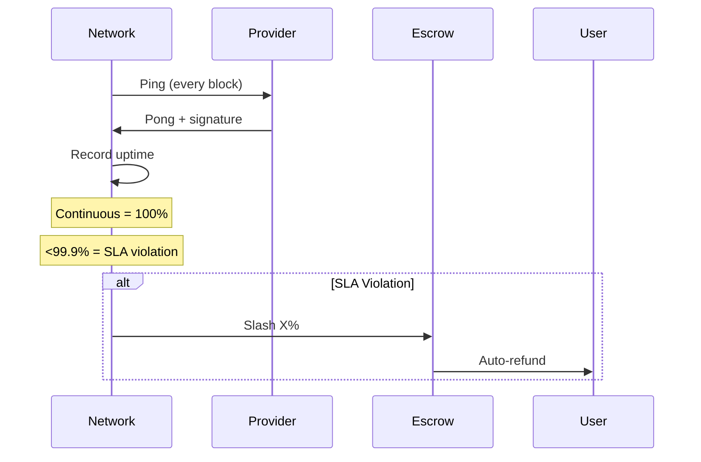
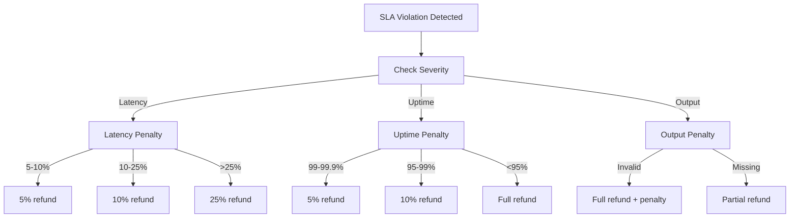
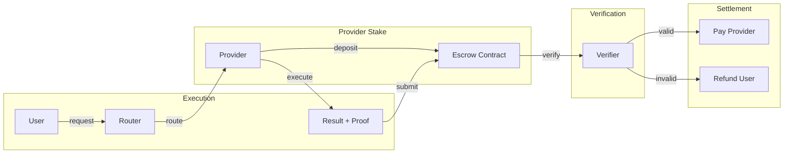
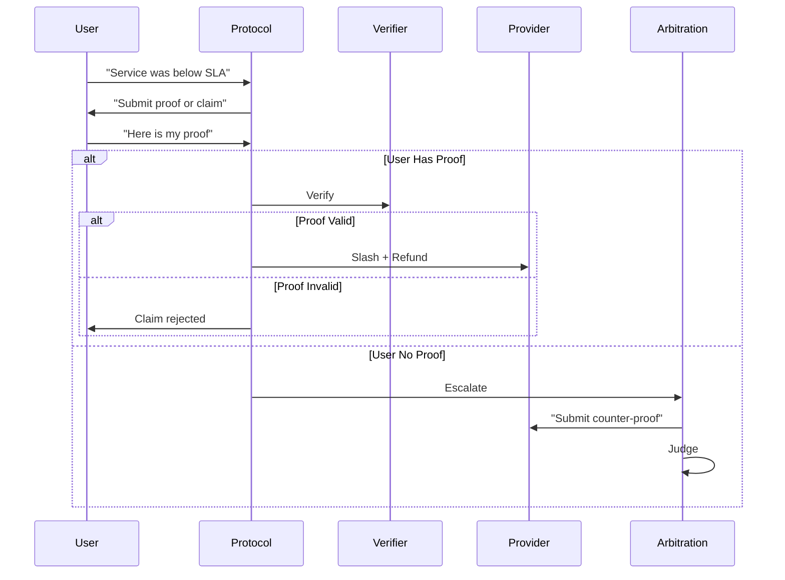
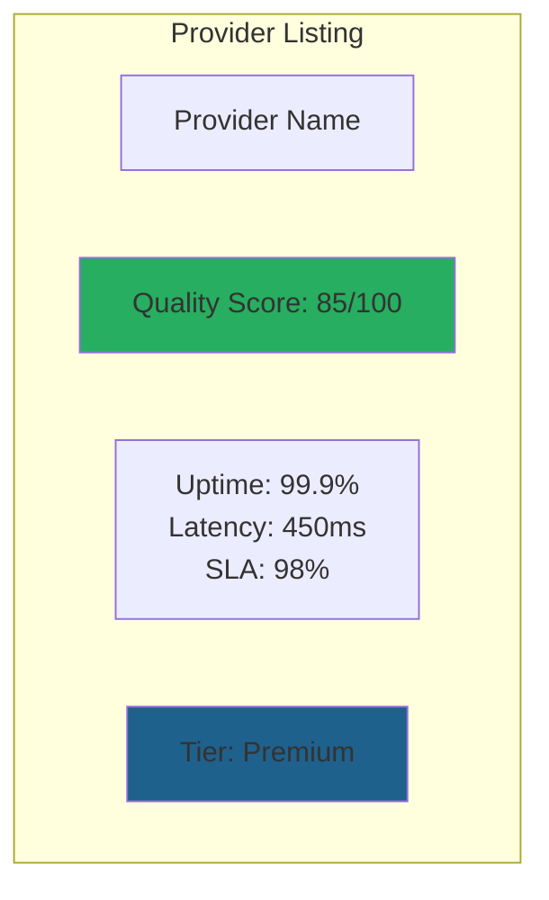
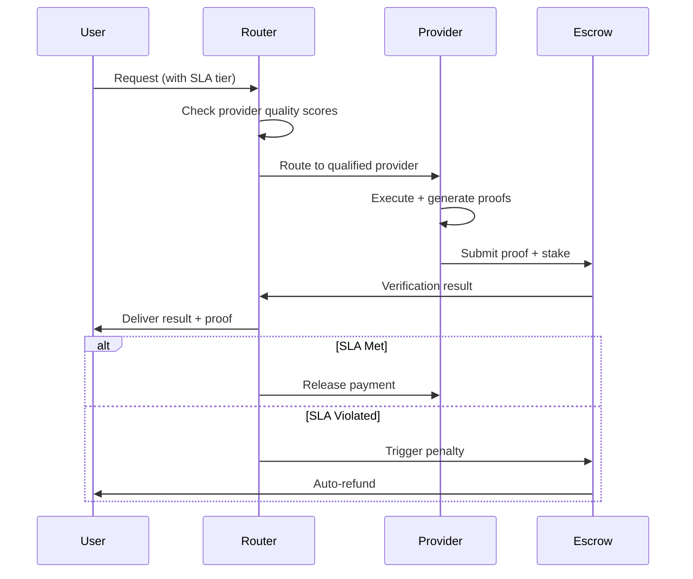

# Use Case: Provable Quality of Service (QoS)

## Problem

Current service quality relies on trust:
- Latency claims unverified
- SLA violations difficult to prove
- Dispute resolution based on reputation
- No cryptographic proof of service delivery

## Motivation

### Why This Matters for CipherOcto

1. **Dispute resolution** - Cryptographic proof vs trust
2. **SLA enforcement** - Automatic compensation
3. **Provider differentiation** - Quality verifiable on-chain
4. **Enterprise confidence** - Guaranteed service levels

### The Opportunity

- Enterprise users pay premium for guarantees
- DeFi requires verifiable execution
- Compliance needs audit trails

## Quality Metrics

### Verifiable Metrics

| Metric | Proof Method | On-chain Settleable |
|--------|--------------|---------------------|
| **Latency** | Timestamp + hash | ✅ Auto-refund |
| **Uptime** | Block inclusion | ✅ SLA penalties |
| **Output validity** | Shape/content proof | ✅ Dispute resolution |
| **Routing correctness** | Merkle path | ✅ Payment release |
| **Model execution** | zkML proof | ✅ Quality bonus |

### Latency Proof

```rust
struct LatencyProof {
    // Timestamps (block-based)
    request_received: u64,    // Block timestamp
    response_sent: u64,       // Block timestamp

    // What was processed (hash, not content)
    request_hash: FieldElement,
    response_hash: FieldElement,

    // Quality indicators
    provider: Address,
    model: String,

    // Verification
    block_hashes: Vec<FieldElement>,  // Merkle path
    signature: Signature,
}

impl LatencyProof {
    fn calculate_latency(&self) -> u64 {
        self.response_sent - self.request_received
    }

    fn verify(&self) -> bool {
        // Verify block timestamps
        // Verify Merkle inclusion
        // Verify signature
        true
    }
}
```

### Uptime Proof



### Output Validity Proof

```rust
struct OutputValidityProof {
    // What was requested
    request_hash: FieldElement,

    // What was returned
    output_hash: FieldElement,

    // Validity checks
    checks: Vec<ValidityCheck>,
}

enum ValidityCheck {
    ValidJson,
    ValidSchema(Schema),
    MaxSize(u64),
    ContainsField(String),
    ValidTokenCount(u64),
}

impl OutputValidityProof {
    fn verify(&self, output: &[u8]) -> bool {
        self.checks.iter().all(|check| check.validates(output))
    }
}
```

## SLA Structure

### Service Levels

| Tier | Latency | Uptime | Output Validity | Price |
|------|---------|--------|------------------|-------|
| **Basic** | < 10s | 99% | Best effort | 1x |
| **Standard** | < 5s | 99.9% | Guaranteed | 1.5x |
| **Premium** | < 1s | 99.99% | Verified | 2x |
| **Enterprise** | < 500ms | 99.999% | Fully proven | 4x |

### SLA Penalties



## On-chain Settlement

### Escrow Mechanism



### Smart Contract Logic

```cairo
#[starknet::contract]
mod QoSContract {
    struct Storage {
        provider_stake: u256,
        total_requests: u64,
        sla_violations: u64,
    }

    #[external]
    fn verify_and_settle(
        proof: QualityProof,
        user: address
    ) -> u256 {
        // 1. Verify proof
        assert(verify_proof(proof), 'Invalid proof');

        // 2. Calculate penalty if any
        let penalty = calculate_penalty(proof);

        // 3. Settle
        if penalty > 0 {
            slash_provider(penalty);
            refund_user(user, penalty);
        } else {
            pay_provider(proof.amount);
        }

        penalty
    }
}
```

## Dispute Resolution

### Challenge Flow



### Arbitration Levels

| Level | Description | Resolution Time |
|-------|-------------|----------------|
| **Automated** | On-chain verification | < 1 minute |
| **Evidence** | Both parties submit proof | < 24 hours |
| **Arbitration** | Third-party judge | < 7 days |
| **Appeals** | DAO vote on edge cases | < 30 days |

## Quality Scoring

### Provider Reputation Integration

```rust
struct QualityScore {
    // Raw metrics
    total_requests: u64,
    successful_requests: u64,
    avg_latency_ms: u64,
    uptime_percent: f64,

    // SLA performance
    sla_violations: u64,
    sla_fulfilled: u64,

    // Proof quality
    proofs_submitted: u64,
    proofs_valid: u64,

    // Calculated
    score: u8,
    tier: QualityTier,
}

enum QualityTier {
    Basic,      // < 50
    Standard,   // 50-75
    Premium,    // 75-90
    Elite,      // > 90
}

impl QualityScore {
    fn calculate(&mut self) {
        let sla_score = (self.sla_fulfilled as f64 / self.total_requests as f64) * 100.0;
        let proof_score = (self.proofs_valid as f64 / self.proofs_submitted as f64) * 100.0;
        let latency_score = if self.avg_latency_ms < 1000 { 100 } else { 50 };

        self.score = ((sla_score * 0.4) + (proof_score * 0.4) + (latency_score * 0.2)) as u8;
        self.tier = match self.score {
            0..=50 => QualityTier::Basic,
            51..=75 => QualityTier::Standard,
            76..=90 => QualityTier::Premium,
            _ => QualityTier::Elite,
        };
    }
}
```

### Quality Display



## Integration with CipherOcto

### Modified Request Flow



### Token Economics

| Component | Token | Purpose |
|-----------|-------|---------|
| Provider stake | OCTO | Security deposit |
| Payment | OCTO-W | For execution |
| Bonuses | OCTO | For exceeding SLA |
| Penalties | OCTO | Slashed for violations |

## Implementation Path

### Phase 1: Basic QoS
- [ ] Timestamp-based latency proofs
- [ ] Block inclusion for uptime
- [ ] Basic SLA penalties
- [ ] Manual dispute submission

### Phase 2: Automated Verification
- [ ] On-chain proof verification
- [ ] Automatic refund triggers
- [ ] Quality score calculation
- [ ] Provider tiering

### Phase 3: Full SLA
- [ ] zkML output validation
- [ ] Real-time verification
- [ ] Complete arbitration system
- [ ] Enterprise SLA contracts

---

**Status:** Draft
**Priority:** High (improves trust)
**Token:** OCTO, OCTO-W
**Research:** [LuminAIR Analysis](../research/luminair-analysis.md)
