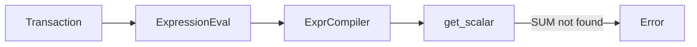
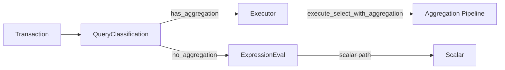

# Use Case: Stoolap MVCC Transaction Aggregate Support

## Problem

Stoolap's embedded SQL database cannot execute aggregate functions (SUM, COUNT, AVG, MIN, MAX) inside MVCC transactions. This breaks fundamental use cases like budget calculations in quota-router:

```sql
-- This fails inside a transaction with "Function not found: SUM"
BEGIN;
SELECT SUM(amount) FROM accounts WHERE user_id = $1 FOR UPDATE;
COMMIT;
```

The same query succeeds outside transaction context because it routes through aggregation pushdown optimization.

## Stakeholders

- **Primary:** Developers using stoolap for embedded SQL in applications requiring ACID transactions
- **Secondary:** Quota-router implementation (mission-0909) requiring atomic budget updates
- **Affected:** Any application that needs aggregate calculations inside transactions

## Motivation

### Why This Matters for CipherOcto

1. **ACID Compliance** - Aggregate queries inside transactions are fundamental to financial applications
2. **Quota Router Requirements** - `record_spend_ledger` in quota-router needs `SELECT SUM(cost_amount) FROM spend_ledger WHERE key_id = $1 FOR UPDATE` to work atomically
3. **Stoolap-Only Persistence** - Use case requires stoolap to replace Redis, but aggregate support is missing
4. **Enterprise Readiness** - Any financial/billing system needs aggregates inside transactions

### Root Cause

The `Transaction::execute()` path bypasses the `Executor` entirely and routes directly through scalar expression compilation (`ExpressionEval`), which doesn't support aggregates:

```
Transaction::execute()
  └── project_columns()
        └── ExpressionEval (scalar only)
              └── ExprCompiler
                    └── get_scalar() → fails for SUM
```

Outside transactions, simple aggregates route through `try_aggregation_pushdown()` which bypasses expression compilation.

## Success Metrics

| Metric | Target | Measurement |
|--------|--------|-------------|
| SUM inside transaction | Works | `SELECT SUM(col) FROM t WHERE key = $1 FOR UPDATE` succeeds |
| COUNT inside transaction | Works | `SELECT COUNT(*) FROM t WHERE key = $1 FOR UPDATE` succeeds |
| AVG inside transaction | Works | `SELECT AVG(col) FROM t WHERE key = $1` succeeds |
| MIN/MAX inside transaction | Works | `SELECT MIN(col), MAX(col) FROM t WHERE key = $1` succeeds |
| GROUP BY with aggregates | Works | `SELECT key, SUM(amount) FROM t GROUP BY key` succeeds |
| Zero regression | 100% | Existing non-aggregate queries unchanged |
| Pushdown preservation | 100% | Non-transaction aggregates still use pushdown |

## Constraints

- **Must not:** Break existing non-transaction aggregate queries
- **Must not:** Reduce transaction isolation or ACID guarantees
- **Must not:** Add significant latency to transaction SELECT path
- **Limited to:** Single-table aggregates (no JOINs in Phase 2)

## Non-Goals

- Multi-table JOIN aggregates (future work)
- Window functions (separate RFC)
- Distributed transactions (beyond single-node)

## Impact

### If Implemented

| Area | Transformation |
|------|----------------|
| **Quota Router** | Can use atomic budget updates with `FOR UPDATE` |
| **Stoolap-Only Persistence** | Eliminates Redis dependency for aggregate use cases |
| **Enterprise Ready** | Supports financial/billing workflows |
| **Code Quality** | Clearer error messages when aggregates are detected |

### Architecture Change

**Before (Broken Path):**


**After (Fixed Path):**


### Error Message Improvement

| Before | After |
|--------|-------|
| `Compile error: Function not found: SUM` | `aggregate function 'SUM' is not supported in this context (use SQL aggregation path)` |
| N/A | Routes to proper aggregation path when Executor available |

## Implementation Phases

### Phase 1: Better Aggregate Detection (COMPLETED)

- [x] Modify `compiler.rs` to check aggregate registry when scalar lookup fails
- [x] Add regression test: `tests/aggregate_in_transaction_test.rs`
- Status: Committed as `35cafe9`

### Phase 2: Route Aggregate Queries Through Executor (COMPLETED)

- [x] Add `Arc<Executor>` to `Transaction` struct
- [x] Add `Executor::execute_in_transaction()` method
- [x] Route aggregate queries to Executor
- [x] Support WHERE clause filtering
- Status: Committed as `dcb4f1c`

### Phase 3: Performance Validation (PENDING)

- [ ] Benchmark pushdown vs compilation for aggregate queries
- [ ] Ensure no regression in non-transaction path
- [ ] Integration test: COUNT/SUM/AVG/MIN/MAX in various contexts

## Technical Details

### Files Modified

| File | Change |
|------|--------|
| `src/executor/expression/compiler.rs` | Phase 1: Add `get_aggregate()` fallback |
| `src/api/transaction.rs` | Phase 2: Add `executor` field, route aggregates |
| `src/api/database.rs` | Phase 2: Change `Arc<Mutex<Executor>>`, pass to Transaction |
| `src/executor/mod.rs` | Phase 2: Add `execute_in_transaction()`, WHERE conversion |

### Test Coverage

6 regression tests in `tests/aggregate_in_transaction_test.rs`:
- `test_sum_inside_transaction` - SUM with WHERE
- `test_count_inside_transaction` - COUNT(*) with WHERE
- `test_avg_inside_transaction` - AVG with WHERE
- `test_min_max_inside_transaction` - MIN/MAX with WHERE
- `test_aggregates_no_for_update` - Aggregate without FOR UPDATE
- `test_group_by_with_aggregate_in_transaction` - GROUP BY with aggregates

All 6 tests pass after Phase 2.

## Related RFCs

- RFC-0200: Production Vector-SQL Storage Engine (MVCC transactions)
- RFC-0202: Stoolap BIGINT/DECIMAL Core Types (type system baseline)
- RFC-0204 (Accepted): [Expression Compiler Aggregate Function Resolution](../../rfcs/accepted/storage/0204-expression-compiler-aggregate-fix.md)

## Related Use Cases

- [Stoolap-Only Persistence for Quota Router](../use-cases/stoolap-only-persistence.md) - Requires aggregate support inside transactions
- [Enhanced Quota Router Gateway](../use-cases/enhanced-quota-router-gateway.md) - Budget enforcement needs atomic aggregates

## Related Missions

- Mission: `stoolap-provider-integration.md` - Stoolap as provider in quota marketplace
- Mission: `0909-i-tokenizer-reverse-lookup.md` - quota-router ledger operations

## Future Work

- F1: Window function support for full SQL compliance
- F2: Multi-table aggregate JOIN support
- F3: Parallel aggregation for large datasets
- F4: Distributed transaction aggregate support