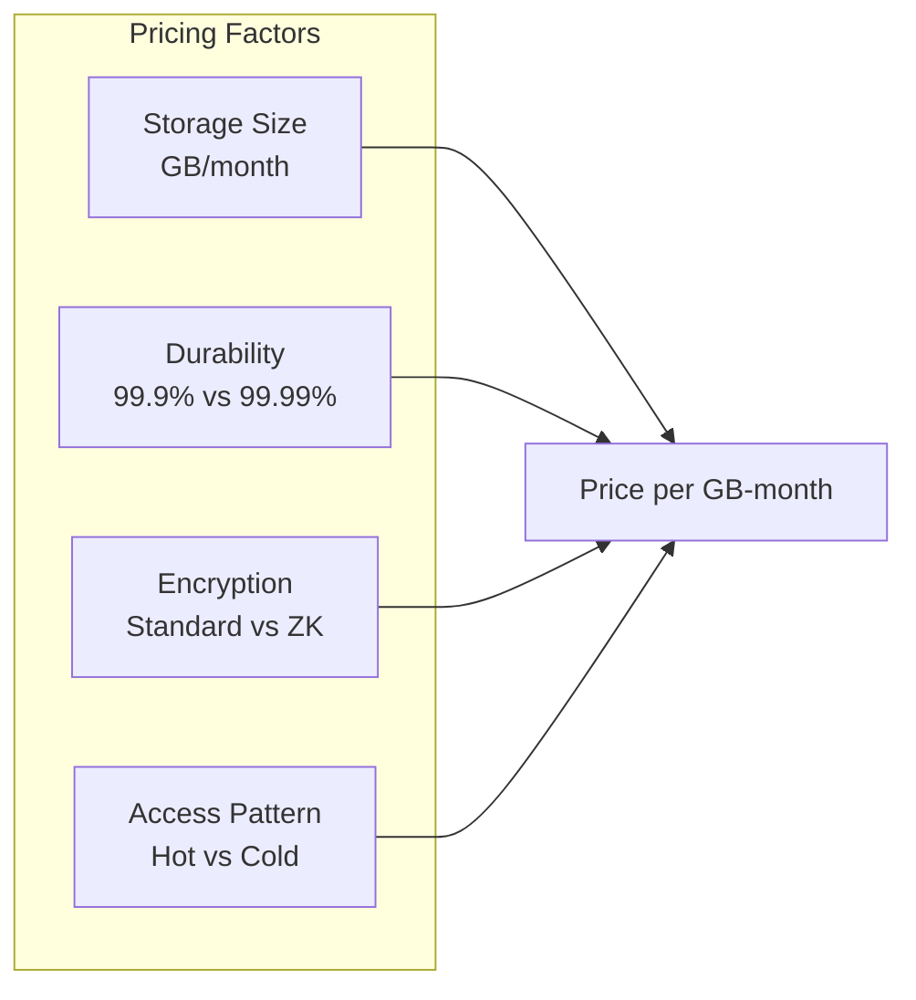
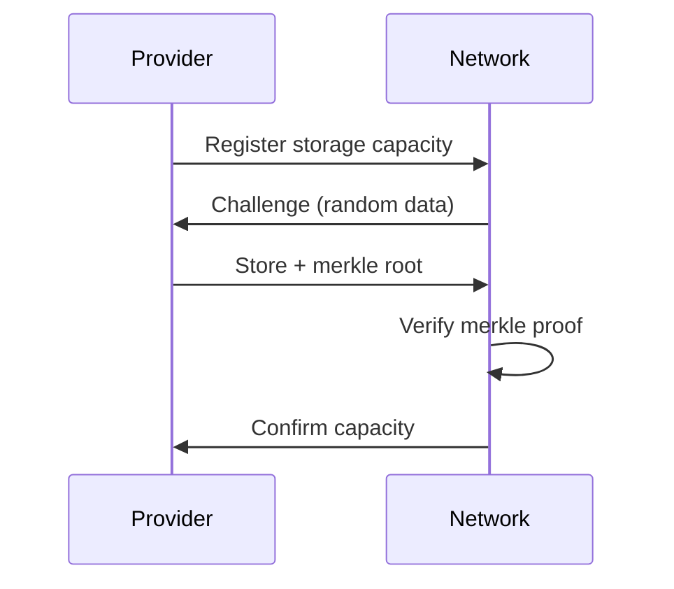
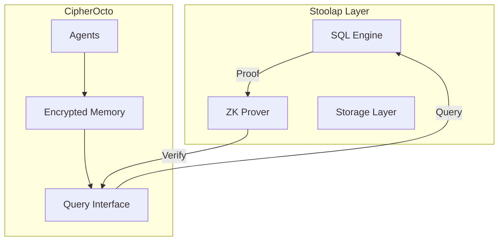
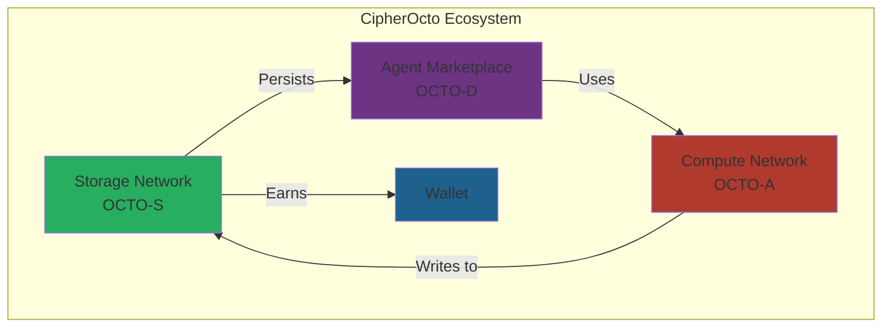

# Use Case: Storage Provider Network (OCTO-S)

## Problem

CipherOcto agents need persistent memory and data storage, but:
- No decentralized encrypted storage exists for AI agents
- Sensitive data requires guarantees of privacy
- Historical state must be verifiable and immutable
- Storage costs remain high with centralized providers

## Motivation

### Why This Matters for CipherOcto

1. **Agent persistence** - Agents must remember context across sessions
2. **Data sovereignty** - Users control their encrypted data
3. **Immutable records** - Blockchain-backed historical proof
4. **Recurring revenue** - Storage creates durable token demand

### The Opportunity

- $30B+ cloud storage market
- Growing AI data requirements
- Privacy concerns increasing demand for encryption

## Impact

### If Implemented

| Area | Transformation |
|------|----------------|
| **Agent Memory** | Persistent state across sessions |
| **Data Privacy** | End-to-end encryption guaranteed |
| **Revenue** | Recurring provider income |
| **Verifiability** | ZK proofs of storage integrity |

### If Not Implemented

| Risk | Consequence |
|------|-------------|
| No persistence | Agents lose context |
| Privacy gaps | Users don't trust network |
| Limited utility | Network feels incomplete |

## Narrative

### Current State

```
Agent runs today
Agent restarts tomorrow
→ All context lost
→ Must start fresh
→ User frustrated
```

### Desired State (With Storage)

```
Agent processes task
     │
     ▼
Encrypted data → Storage network (OCTO-S)
     │
     ▼
Agent restarts tomorrow
     │
     ▼
Retrieves encrypted context
     │
     ▼
Continues seamlessly
```

## Token Mechanics

### OCTO-S Token

| Aspect | Description |
|--------|-------------|
| **Purpose** | Payment for encrypted storage |
| **Earned by** | Storage providers |
| **Spent by** | Agent memory, data archives |
| **Value** | Represents storage capacity (GB-months) |

### Pricing Model



## Storage Tiers

### Hot Storage
- Frequently accessed data
- Low latency requirements
- Higher cost per GB

### Cold Storage
- Archival data
- Infrequent access
- Lower cost, higher retrieval time

### Encrypted Vaults
- Maximum security
- Zero-knowledge proof availability
- Enterprise compliance

## Verification

### Proof of Storage



### Integrity Verification

| Method | Frequency | Purpose |
|--------|-----------|----------|
| Merkle proofs | Random | Data integrity |
| Uptime checks | Hourly | Availability |
| Encryption validation | Weekly | Security |
| ZK proofs | On-demand | Privacy verification |

## ZK Integration

### Stoolap Integration

The storage layer integrates with Stoolap blockchain:



### Privacy Guarantees

| Feature | Protection |
|---------|------------|
| Client-side encryption | Provider cannot read data |
| Zero-knowledge proofs | Verify without exposing |
| Selective disclosure | Share specific fields only |
| Immutable logs | Historical proof |

## Data Flagging

Storage respects CipherOcto's data classification:

| Level | Storage Behavior |
|-------|-----------------|
| **PRIVATE** | Single-tenant, never leaves user |
| **CONFIDENTIAL** | Encrypted, access-controlled |
| **SHARED** | Encrypted, accessible to verified agents |
| **PUBLIC** | Can be cached, monetizable |

## Provider Requirements

### Minimum Stake

| Tier | Storage Provided | Stake Required |
|------|-----------------|----------------|
| Basic | 10 GB | 100 OCTO |
| Standard | 100 GB | 1000 OCTO |
| Professional | 1 TB | 10,000 OCTO |
| Enterprise | 10 TB | 100,000 OCTO |

### Slashing Conditions

| Offense | Penalty |
|---------|---------|
| Data loss | 50-100% stake |
| Privacy breach | 100% stake + ban |
| Invalid proofs | 25% stake |
| Downtime >24h | 10% stake |

## Relationship to Other Components



## Use Cases

### Agent Memory
- Conversation history
- User preferences
- Learning data

### Knowledge Vaults
- Proprietary insights
- Research data
- Business intelligence

### Immutable Records
- Transaction history
- Compliance logs
- Verification proofs

## Implementation Path

### Phase 1: Basic Storage
- [ ] Provider registration
- [ ] Encrypted upload/download
- [ ] Basic durability guarantees
- [ ] Simple payment in OCTO-S

### Phase 2: ZK Integration
- [ ] Stoolap integration
- [ ] Proof generation
- [ ] Verification layer
- [ ] Tiered storage options

### Phase 3: Enterprise Features
- [ ] SOC2 compliance
- [ ] HIPAA support
- [ ] GDPR tools
- [ ] Multi-region replication

## RFC Link

- [RFC-0100: AI Quota Marketplace Protocol](../rfcs/0100-ai-quota-marketplace.md)
- [Wallet Technology Research](../research/wallet-technology-research.md)

---

**Status:** Draft
**Priority:** High (Phase 2)
**Token:** OCTO-S
