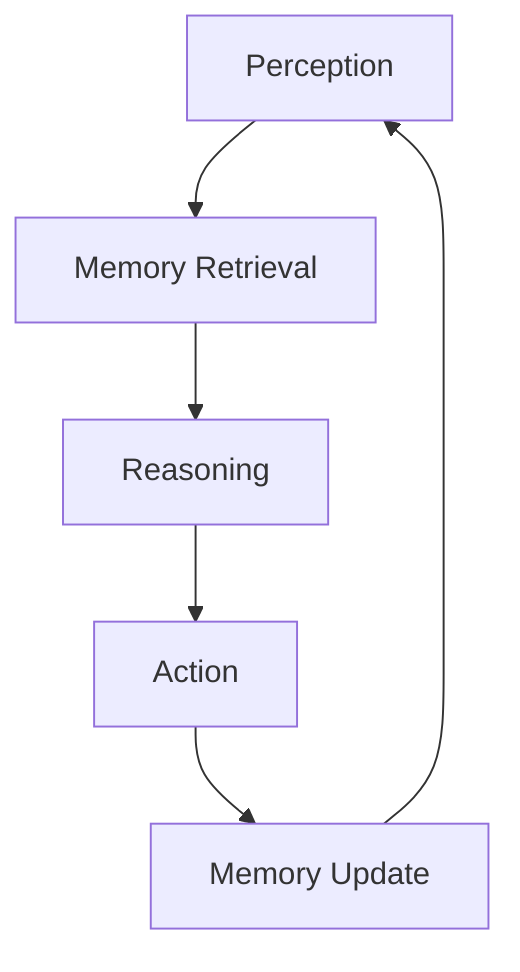

# Use Case: Verifiable Agent Memory Layer

## Problem

Most LLM systems are stateless — they forget everything after each request. Developers bolt on memory using vector databases, Redis, Pinecone — but these have critical issues:

| Issue                        | Impact                           |
| ---------------------------- | -------------------------------- |
| No verifiable provenance     | Memory can be manipulated        |
| No decentralized persistence | Vendor lock-in                   |
| No economic incentives       | No ownership model               |
| No cryptographic guarantees  | Agents cannot trust their memory |

Agents cannot own or trust their memory layer.

## Motivation

### Why This Matters for CipherOcto

1. **Persistent Agents** - Modern AI moves toward stateful, persistent agents
2. **Verifiable Memory** - Cryptographic guarantees for memory integrity
3. **Agent Ownership** - Agents own their memory as assets
4. **Economic Layer** - Agents become economic actors

### The Opportunity

- Autonomous AI agents market projected to grow significantly
- No existing solution for verifiable agent memory
- Every intelligent agent needs persistent, trustworthy memory

## Solution Architecture

### CipherOcto as Verifiable Agent Memory

CipherOcto provides persistent cryptographic memory:

```json
{
  "memory_object": {
    "agent_id": "sha256:...",
    "timestamp": 1234567890,
    "content_hash": "sha256:...",
    "embedding": "...",
    "provenance": "..."
  }
}
```

Each memory entry includes:

- Merkle commitment
- Retrieval proof
- Access permissions

### The Agent Cognitive Loop



Each step produces verifiable traces.

### Agent Memory Types

| Type           | Description                          | Storage Tier |
| -------------- | ------------------------------------ | ------------ |
| **Episodic**   | Events, conversations, task outcomes | Hot          |
| **Semantic**   | Facts, learned rules, documents      | Cold         |
| **Procedural** | Tools, code, automation scripts      | Archive      |

### Memory DAG Structure

Memory forms a directed acyclic graph:

```
Memory_0 (genesis)
    │
    ├── Memory_1 (conversation)
    │
    ├── Memory_2 (learned fact)
    │
    └── Memory_3 (skill)
```

Enables full lineage tracking, causal reasoning, knowledge inheritance.

### Agent Identity & Ownership

```json
{
  "agent_id": "sha256:...",
  "public_key": "...",
  "creation_block": 12345678,
  "memory_root": "sha256:..."
}
```

Agents own:

- Memory objects
- Datasets
- Models
- Knowledge assets

### The Agent Economy

With persistent memory and identity, agents become economic actors:

```
Agent discovers dataset
     ↓
Agent trains model
     ↓
Agent sells inference API
     ↓
Revenue → agent wallet
```

### Multi-Agent Knowledge Networks

Agents share memory with automatic royalty distribution:

```
Agent A research → dataset → Agent B → model → Agent C app
```

### Memory Compression Layer

Agent memory grows extremely fast (1000 events/day). CipherOcto supports:

```
Raw Memory → Summarized Memory → Knowledge Graph
```

### ZK-Private Memory

Agents prove facts without revealing data:

```json
{
  "encrypted_memory": "...",
  "commitment": "sha256:...",
  "zk_proof": "...",
  "fact_proved": "agent_learned_X"
}
```

## Impact

- **Persistent Agents** - Agents remember across sessions
- **Verifiable Memory** - Cryptographic guarantees
- **Agent Ownership** - Agents own their knowledge
- **Economic Actors** - Agents trade knowledge assets

## Strategic Positioning

CipherOcto becomes the memory layer for:

- AI agents
- Autonomous companies
- DAO governance
- Scientific research

Effectively: `Git + IPFS + VectorDB + Knowledge Graph` for AI agents.

---

**Status:** Draft
**Priority:** High
**Token:** OCTO-D

## Related RFCs

- [RFC-0410 (Agents): Verifiable Agent Memory](../rfcs/0410-verifiable-agent-memory.md)
- [RFC-0108 (Numeric/Math): Deterministic Training Circuits](../rfcs/0108-deterministic-training-circuits.md)
- [RFC-0109 (Numeric/Math): Linear Algebra Engine](../rfcs/0109-linear-algebra-engine.md)
- [RFC-0412 (Agents): Verifiable Reasoning Traces](../rfcs/0412-verifiable-reasoning-traces.md)
- [RFC-0413 (Agents): State Virtualization for Massive Scaling](../rfcs/0413-state-virtualization-massive-scaling.md)
- [RFC-0414 (Agents): Autonomous Agent Organizations](../rfcs/0414-autonomous-agent-organizations.md)
- [RFC-0415 (Agents): Alignment & Control Mechanisms](../rfcs/0415-alignment-control-mechanisms.md)
