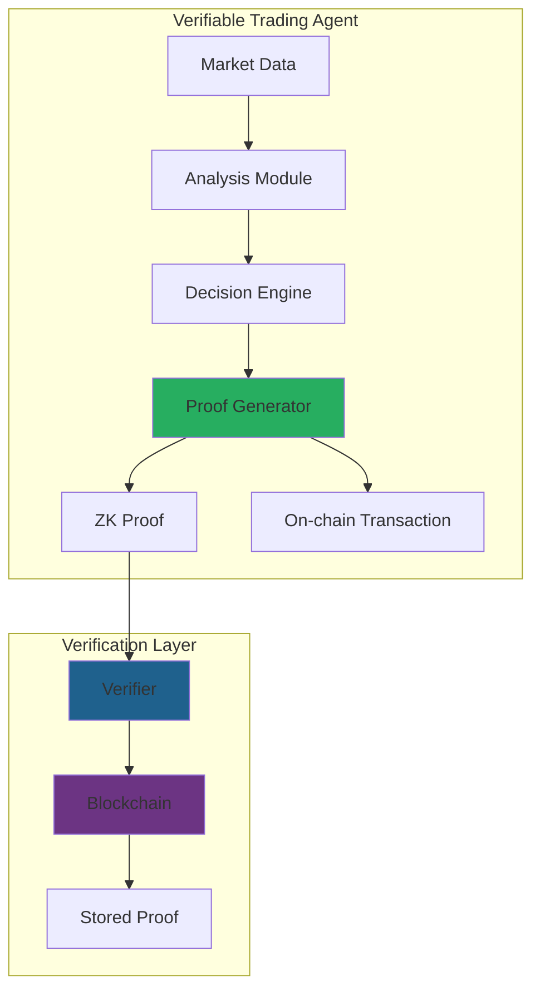
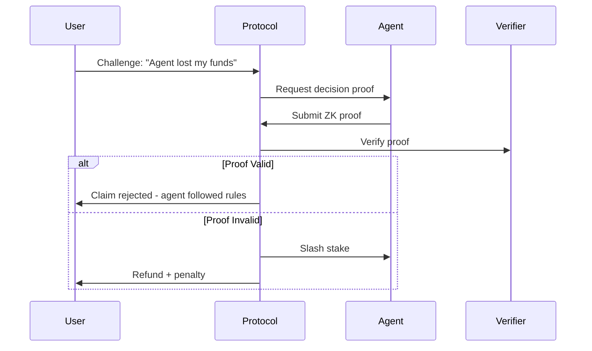
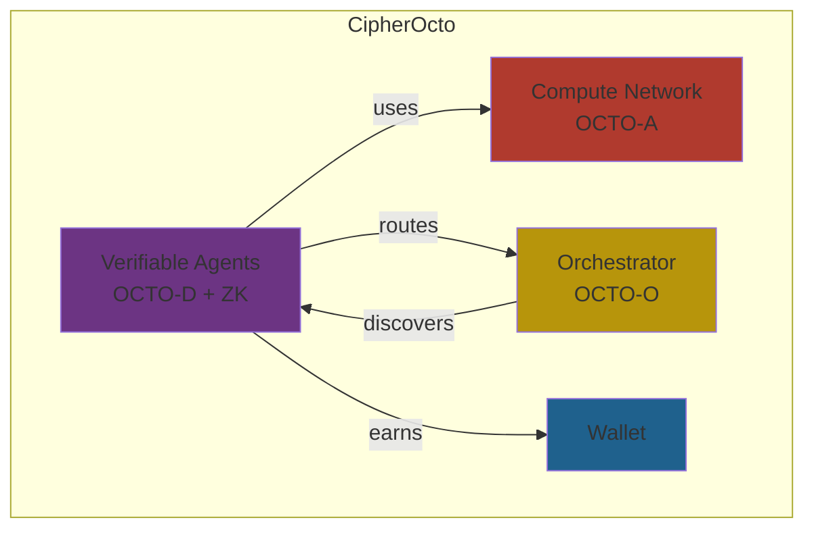

# Use Case: Verifiable AI Agents for DeFi

## Problem

DeFi protocols face trust challenges with AI agents:

- No way to verify trading decisions were made correctly
- Black-box AI makes unpredictable moves with user funds
- Cannot prove agent followed its stated strategy
- Auditing requires full re-execution of decisions

## Motivation

### Why This Matters for CipherOcto

1. **Trust** - Users can verify agent decisions post-hoc
2. **Transparency** - On-chain proof of correct execution
3. **Compliance** - Regulators can audit without re-executing
4. **New market** - DeFi protocols pay premium for verifiable AI

### The Opportunity

- $50B+ DeFi market needing trustless automation
- Growing demand for transparent AI in finance
- No current solution for provable AI decisions

## Solution Architecture

### Verifiable Trading Agent



## Proof Components

### Decision Proof Structure

```rust
struct DecisionProof {
    // Market state (hashed, not revealed)
    market_state_hash: FieldElement,

    // Decision details
    action: TradeAction,        // Buy, Sell, Hold
    asset: String,
    amount: u64,
    reason_hash: FieldElement, // Hash of reasoning

    // Execution proof
    timestamp: u64,
    block_number: u64,
    zk_proof: CircleStarkProof,
}

enum TradeAction {
    Buy { price_limit: u64 },
    Sell { price_limit: u64 },
    Hold,
}
```

### What Gets Proven

| Property               | Proof Method     | On-chain Settleable |
| ---------------------- | ---------------- | ------------------- |
| **Correct analysis**   | zkML proof       | ✅                  |
| **Strategy adherence** | Constraint proof | ✅                  |
| **Timing**             | Block timestamp  | ✅                  |
| **No manipulation**    | Merkle inclusion | ✅                  |

## Integration with CipherOcto

### Token Flow

```mermaid
flowchart LR
    subgraph REQUEST["Request Layer"]
        USER[User] --> ROUTER[Quota Router]
    end

    subgraph AGENT["Agent Layer"]
        ROUTER --> AGENT[DeFi Agent]
        AGENT --> ZK[ZK Proof Gen]
    end

    subgraph SETTLE["Settlement Layer"]
        ZK --> ONCHAIN[On-chain]
        ONCHAIN --> VERIFY[Verify]
        VERIFY --> PAY[Release Payment]
    end

    USER -->|OCTO-W| PAY
    AGENT -->|earns| PAY
```

### Agent Reputation + Proof

```
Verification Score = (Reputation * 0.3) + (Proof Quality * 0.7)

Where:
- Reputation: Historical success rate
- Proof Quality: Completeness of zk proof
```

## Use Cases

### Automated Trading Strategies

| Strategy                  | Verifiable Proof             |
| ------------------------- | ---------------------------- |
| **Dollar-cost averaging** | Regular intervals proven     |
| **Rebalancing**           | Threshold triggers proven    |
| **Arbitrage**             | Cross-exchange timing proven |
| **Yield optimization**    | APY calculations proven      |

### Portfolio Management

```
User: "Invest $10K in blue-chip DeFi"
    │
    ▼
Agent: Analyzes → Decides → Proves
    │
    ▼
Proof: "Allocated 60% stablecoin, 40% blue-chip"
    │
    ▼
On-chain: Verified → Executed → Recorded
```

### Risk Management

| Risk                    | Verifiable Proof            |
| ----------------------- | --------------------------- |
| **Stop-loss triggered** | Price oracle + timestamp    |
| **Max drawdown**        | Historical value proof      |
| **Exposure limits**     | Portfolio composition proof |

## Dispute Resolution

### Challenge Flow



### Slashing Conditions

| Offense                | Penalty           |
| ---------------------- | ----------------- |
| **No proof submitted** | 50% stake         |
| **Invalid proof**      | 100% stake        |
| **Strategy deviation** | 75% stake         |
| **Late proof**         | Warning → penalty |

## Technical Implementation

### Proof Generation

```rust
impl VerifiableAgent {
    fn generate_decision_proof(
        &self,
        market_data: &MarketData,
        decision: &Decision,
    ) -> Result<DecisionProof, Error> {
        // 1. Hash market data (commitment)
        let market_hash = hash(market_data);

        // 2. Execute decision in zkML circuit
        let trace = self.execute_zk(market_data, decision);

        // 3. Generate Circle STARK proof
        let proof = stwo_prover::prove(trace)?;

        // 4. Create proof structure
        Ok(DecisionProof {
            market_state_hash: market_hash,
            action: decision.action,
            reason_hash: hash(decision.reasoning),
            timestamp: current_timestamp(),
            block_number: current_block(),
            zk_proof: proof,
        })
    }
}
```

### Verification

```rust
fn verify_decision_proof(proof: &DecisionProof) -> bool {
    // 1. Verify ZK proof
    if !stwo_verifier::verify(&proof.zk_proof) {
        return false;
    }

    // 2. Verify timing
    if proof.timestamp > current_timestamp() {
        return false;
    }

    // 3. Verify block inclusion
    if !verify_merkle_inclusion(proof) {
        return false;
    }

    true
}
```

## CipherOcto Integration

### Relationship to Other Components



### Token Economics

| Component         | Token  | Purpose             |
| ----------------- | ------ | ------------------- |
| Agent execution   | OCTO-W | Pay for inference   |
| Agent development | OCTO-D | Developer revenue   |
| Verification      | OCTO   | Protocol security   |
| Staking           | OCTO   | Economic commitment |

## Implementation Path

### Phase 1: Basic Verifiable Agents

- [ ] Decision logging with hashes
- [ ] Block timestamp proofs
- [ ] Strategy commitment on-chain

### Phase 2: zkML Integration

- [ ] Lightweight zkML for decisions
- [ ] WASM verifier for browsers
- [ ] Off-chain verification

### Phase 3: Full Protocol

- [ ] On-chain Cairo verifier
- [ ] EigenLayer AVS integration
- [ ] Complete dispute flow

---

**Status:** Draft
**Priority:** Medium (Phase 2-3)
**Token:** OCTO-D, OCTO-W, OCTO
**Research:** [LuminAIR Analysis](../research/luminair-analysis.md)

## Related RFCs

- [RFC-0108 (Retrieval): Verifiable AI Retrieval](../rfcs/0108-verifiable-ai-retrieval.md)
- [RFC-0110 (Agents): Verifiable Agent Memory](../rfcs/0110-verifiable-agent-memory.md)
- [RFC-0114 (Agents): Verifiable Reasoning Traces](../rfcs/0114-verifiable-reasoning-traces.md)
- [RFC-0115 (Proof Systems): Probabilistic Verification Markets](../rfcs/0115-probabilistic-verification-markets.md)
- [RFC-0116 (Numeric/Math): Unified Deterministic Execution Model](../rfcs/0116-unified-deterministic-execution-model.md)
- [RFC-0117 (AI Execution): State Virtualization for Massive Agent Scaling](../rfcs/0117-state-virtualization-massive-scaling.md)
- [RFC-0118 (Agents): Autonomous Agent Organizations](../rfcs/0118-autonomous-agent-organizations.md)
- [RFC-0119 (Agents): Alignment & Control Mechanisms](../rfcs/0119-alignment-control-mechanisms.md)
- [RFC-0120 (AI Execution): Deterministic AI Virtual Machine](../rfcs/0120-deterministic-ai-vm.md)
- [RFC-0121 (AI Execution): Verifiable Large Model Execution](../rfcs/0121-verifiable-large-model-execution.md)
- [RFC-0122 (AI Execution): Mixture-of-Experts](../rfcs/0122-mixture-of-experts.md)
- [RFC-0123 (AI Execution): Scalable Verifiable AI Execution](../rfcs/0123-scalable-verifiable-ai-execution.md)
- [RFC-0124 (Proof Systems): Proof Market and Hierarchical Inference Network](../rfcs/0124-proof-market-hierarchical-network.md)
- [RFC-0125 (Economics): Model Liquidity Layer](../rfcs/0125-model-liquidity-layer.md)
- [RFC-0130 (Proof Systems): Proof-of-Inference Consensus](../rfcs/0130-proof-of-inference-consensus.md)
- [RFC-0131 (Numeric/Math): Deterministic Transformer Circuit](../rfcs/0131-deterministic-transformer-circuit.md)
- [RFC-0132 (Numeric/Math): Deterministic Training Circuits](../rfcs/0132-deterministic-training-circuits.md)
- [RFC-0133 (Proof Systems): Proof-of-Dataset Integrity](../rfcs/0133-proof-of-dataset-integrity.md)
- [RFC-0134 (Agents): Self-Verifying AI Agents](../rfcs/0134-self-verifying-ai-agents.md)
- [RFC-0140 (Consensus): Sharded Consensus Protocol](../rfcs/0140-sharded-consensus-protocol.md)
- [RFC-0141 (Consensus): Parallel Block DAG Specification](../rfcs/0141-parallel-block-dag.md)
- [RFC-0142 (Consensus): Data Availability & Sampling Protocol](../rfcs/0142-data-availability-sampling.md)
- [RFC-0143 (Networking): OCTO-Network Protocol](../rfcs/0143-octo-network-protocol.md)
