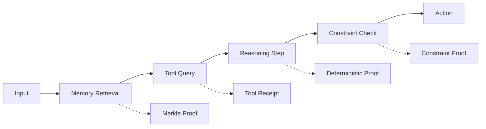

# Use Case: Verifiable Reasoning Traces

## Problem

AI agents make decisions that affect real-world outcomes, but:

- No way to verify what reasoning led to a decision
- Black-box AI makes unpredictable moves with user funds
- Cannot prove policy compliance
- Regulatory audits impossible

## Motivation

### Why This Matters for CipherOcto

1. **Regulatory compliance** - Auditable decisions
2. **Trust** - Cryptographic proof of reasoning
3. **Liability** - Clear accountability
4. **Economic value** - Reasoning traces as assets

### The Opportunity

- DeFi protocols need auditable AI
- Governments requiring AI governance
- Enterprise compliance requirements

## Solution

### Reasoning Trace Architecture



### Trace Structure

```json
{
  "trace_id": "trace_abc123",
  "agent_id": "agent_defi_trader",
  "input_hash": "sha256:...",
  "steps": [
    {
      "step_id": 0,
      "step_type": "RETRIEVAL",
      "input_commitment": "merkle:...",
      "output_commitment": "merkle:..."
    }
  ],
  "output_hash": "sha256:...",
  "trace_hash": "sha256:..."
}
```

## Use Cases

### DeFi Trading

```
Market data retrieval
      ↓
Portfolio memory lookup
      ↓
Risk model evaluation
      ↓
Strategy reasoning
      ↓
Trade execution
```

The trace proves risk limits were respected.

### Scientific Research

```
Retrieve research papers
      ↓
Extract hypotheses
      ↓
Run simulation
      ↓
Generate conclusion
```

The trace proves methodology was followed.

### Enterprise Compliance

```
User request
      ↓
Policy check
      ↓
Audit logging
      ↓
Response
```

The trace proves regulatory compliance.

## Token Economics

| Component       | Token  | Purpose           |
| --------------- | ------ | ----------------- |
| Trace storage   | OCTO-S | Memory layer      |
| Verification    | OCTO   | Protocol security |
| Trace licensing | OCTO-D | Developer revenue |

## Implementation Path

### Phase 1: Basic Traces

- [ ] Trace structure
- [ ] Hash chain
- [ ] Step commitments

### Phase 2: Verification

- [ ] Step proof verification
- [ ] Constraint checking
- [ ] Tool receipt validation

### Phase 3: Privacy

- [ ] ZK proofs for reasoning
- [ ] Selective disclosure
- [ ] Confidential modes

---

**Status:** Draft
**Priority:** High (Phase 2)
**Token:** OCTO, OCTO-D

## Related RFCs

- [RFC-0412 (Agents): Verifiable Reasoning Traces](../rfcs/0412-verifiable-reasoning-traces.md)
- [RFC-0410 (Agents): Verifiable Agent Memory](../rfcs/0410-verifiable-agent-memory.md)
- [RFC-0411 (Economics): Knowledge Market](../rfcs/0411-knowledge-market-verifiable-data-assets.md)
- [RFC-0116 (Numeric/Math): Unified Deterministic Execution Model](../rfcs/0116-unified-deterministic-execution-model.md)
- [RFC-0413 (Agents): State Virtualization for Massive Agent Scaling](../rfcs/0413-state-virtualization-massive-scaling.md)
- [RFC-0414 (Agents): Autonomous Agent Organizations](../rfcs/0414-autonomous-agent-organizations.md)
- [RFC-0415 (Agents): Alignment & Control Mechanisms](../rfcs/0415-alignment-control-mechanisms.md)
