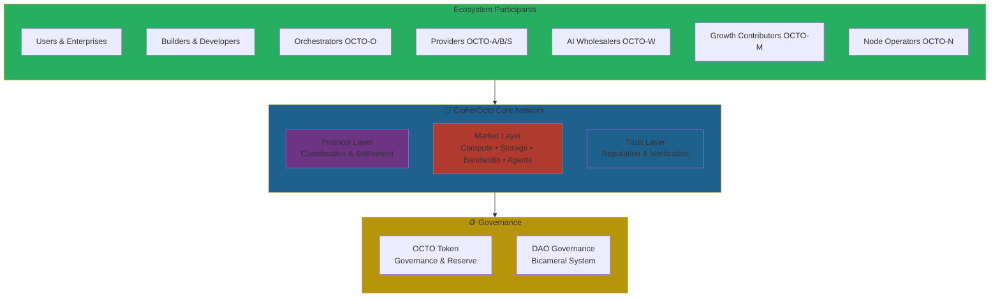
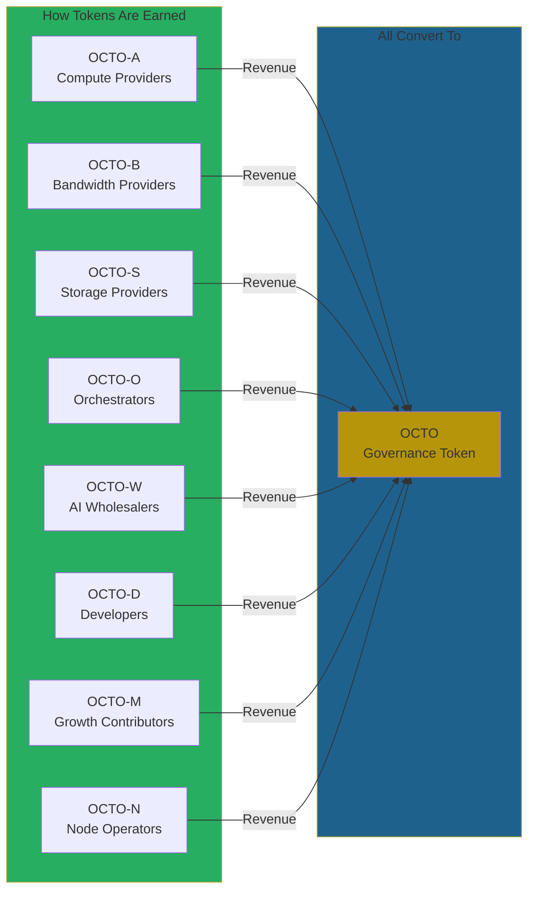
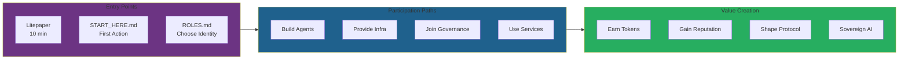
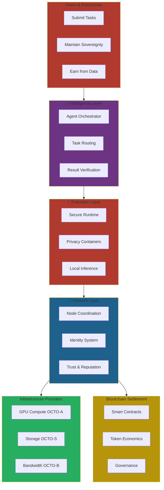
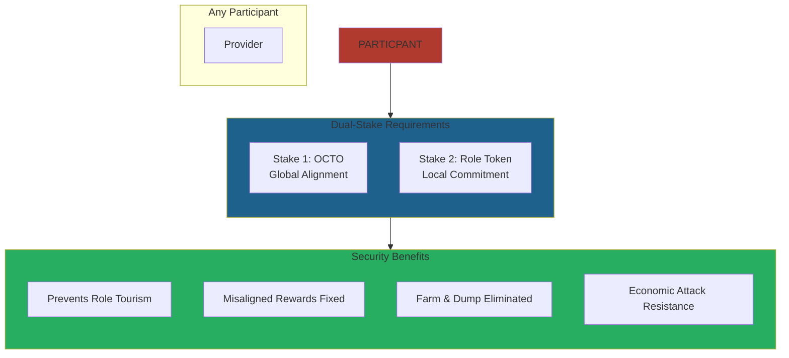
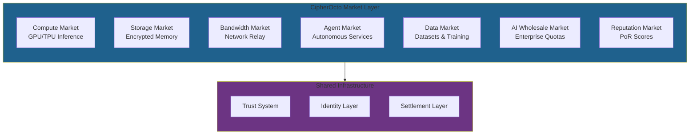
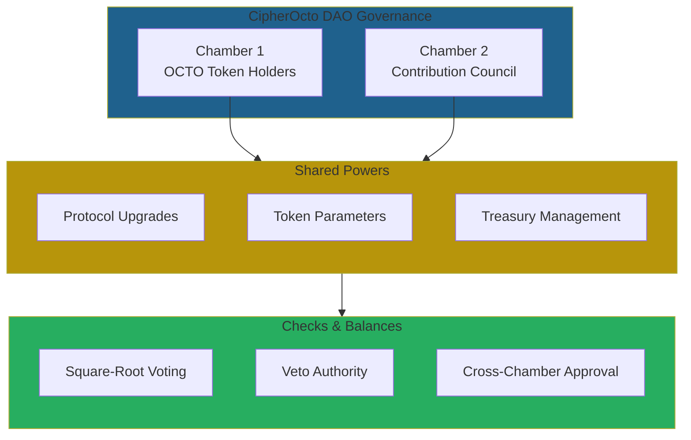
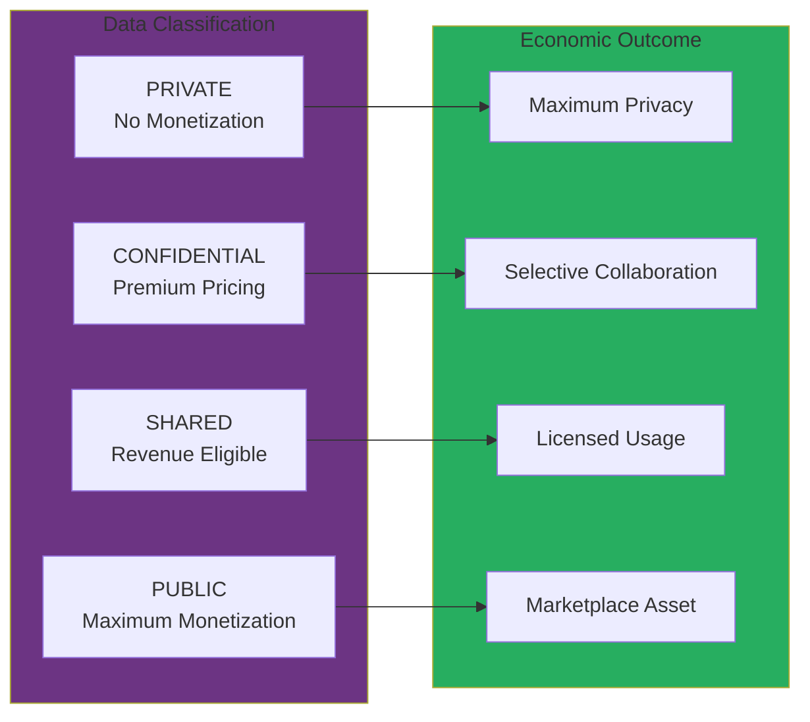

# CipherOcto Ecosystem Map

**One view of the entire network.**

---

## The Ecosystem at a Glance

---

## Token Flow Economy

---

## User Journey Map

---

## The Ocean Stack in Context

---

## Dual-Stake Security Model

---

## Market Layer Composition

---

## Network Effects Flywheel

---

## Bicameral Governance

---

## Data Classification Economy

---

## Key Insight

**CipherOcto is not a product. It is a coordinated system.**

Every participant has:
- A clear role
- A specific token
- A defined earning mechanism
- Governance participation
- Sovereign ownership

The ecosystem works when all parts coordinate.

---

## Quick Reference

| Layer | Token | Function |
| ----- | ----- | -------- |
| **Governance** | OCTO | Coordination, settlement, reserve |
| **Compute** | OCTO-A | GPU inference, training |
| **Storage** | OCTO-S | Encrypted memory, archival |
| **Bandwidth** | OCTO-B | Network relay, delivery |
| **Orchestration** | OCTO-O | Task routing, coordination |
| **Wholesale** | OCTO-W | Enterprise AI resale |
| **Developers** | OCTO-D | Agent building, tools |
| **Growth** | OCTO-M | Marketing, community |
| **Nodes** | OCTO-N | Blockchain validation |

---

🐙 **Private intelligence, everywhere.**
