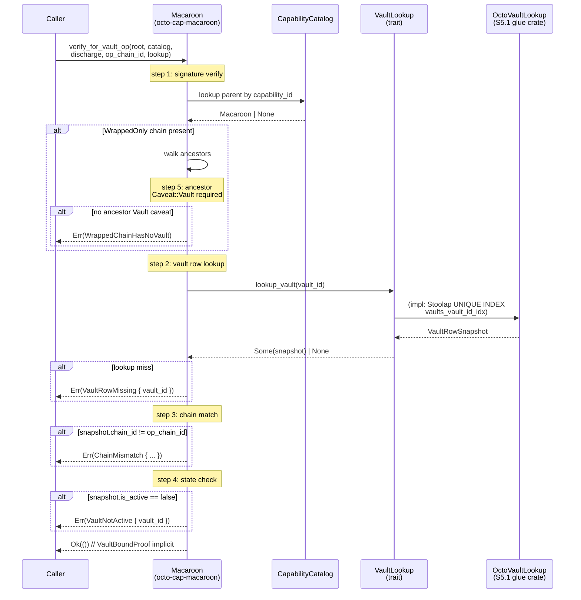

# Mission: 0957-g verify-time invariant (S5 of storage restructure)

## Status

**LANDED 2026-08-17 (commit `d007de54`).** S5 deliverable per
`docs/plans/2026-08-16-storage-layer-restructuring-execution-plan.md`
§3 row 6 (Stream C.2). Pre-reqs verified landed: S2 (octo-storage
split), S3 (octo-vault substrate + TV-V1 10), S4 (DFP codemod — `Dqa`
canonical). Pillar 2 step 2 (OctoVaultLookup glue crate) **DEFERRED
to S5.1** — see `missions/open/0957-g1-octo-vault-lookup-glue.md`.

## RFC

- Primary: RFC-0957 (verify-time bump) per review doc §20.6.1.
- Co-RFC: RFC-0870 (additive) — `NodeEnvelope.version_tag: u8` field
  per review §14.1.
- Co-RFC: RFC-0965 §3.5 + §3.7 — `WrappedOnly` caveat + parent-no-
  Vault-binding reject per review doc §20.6.1.
- Source review: `docs/reviews/2026-08-15-storage-layer-restructuring-analysis.md`
  RFC-0870 §NodeEnvelope Version Tag (envelope.version_tag) + review doc §20.6.1 (verify-time chain invariant)
  - §8.10 (TV-C1 anchor).

## Summary

Three pillars of plan §C.2 land in one crate family:

1. **`NodeEnvelope.version_tag: u8` field** in `crates/octo-protocol/src/envelope.rs`
   per §14.1. `VERSION_TAG_V2 = 0xA1` post-cutover; `VERSION_TAG_V1 = 0xA0`.
   V1 receipts (or absent version_tag) hard-rejected at verify
   deterministically. Wire-format break per §14.1; consumers must
   rebuild.

2. **`Caveat::Vault(vault_id)` verify-time UNIQUE INDEX lookup** per
   review doc §20.6.1 option (b) (adopted). `octo-cap-macaroon` gains a new
   `VaultLookup` trait consumed by `Macaroon::verify_for_vault_op()`;
   `octo-vault` will implement via the substrate-backed
   `vaults_vault_id_idx` UNIQUE index via an S5.1 glue crate.

3. **`WrappedOnly` intra-chain-only rule + parent-no-Vault-binding
   reject** per review doc §20.6.1. When `Macaroon::verify_for_vault_op`
   walks a `WrappedOnly` chain for a `VaultOperation` target, the
   ancestor chain must contain at least one `Caveat::Vault(vault_id)`
   — chainless parent (e.g., pure `AmountMax` cap with no vault
   binding) yields `VaultVerifyError::WrappedChainHasNoVault`. Vault
   chain_id must match operation target.

4. **TV-C1 fixtures (4 + 3 regression)** written + passing in
   `crates/octo-cap-macaroon/tests/tv_c1_verify_time.rs` per §8.10
   central registry.

### Why option (b) over option (c) (review doc §20.6.1)

Option (b) (vault row UNIQUE INDEX lookup) adopted as DEFAULT per
review doc §20.6.1 — no V2 wire-format bump required, +1 DB round-trip per
redemption (~1-3ms SSD). Option (c) (chain_id in payload) deferred to
v3.0 if perf data demands.

### Why primitive-typed `VaultRowSnapshot` (no `octo_vault::VaultState` import)

`octo-cap-macaroon` is a Layer B extension crate (per
`cipherocto-design-principles.md`). Per **Stable Abstractions
Principle** + **Dependency Inversion**: trait lives in
`octo-cap-macaroon` (consumer), impl lives in the substrate owner
crate. Importing `octo_vault::VaultState` enum here would create
**Layer B → Layer B reverse dep** (octo-cap-macaroon pulling
octo-vault's data types). Instead `VaultRowSnapshot.is_active: bool`
is primitive — the substrate adapter maps its own state enum into
this at lookup time. Mirrors existing `CapabilityCatalog` pattern
(`crates/octo-cap-macaroon/src/macaroon.rs`).

### Why `Macaroon::verify_for_vault_op` (not `CapabilityTokenV2::verify_vault_bound`)

The verify surface for `Caveat::Vault` is the **macaroon's caveats**
(`Macaroon.caveats`), not the V2 capability token's caveats
(`CapabilityTokenV2.caveats`). The V2 envelope carries the bundle +
a single macaroon; the macaroon's caveat list is the load-bearing
verify path. Splitting into a dedicated method (distinct from
`verify_full`) preserves backward compat — `verify_full` enforces
the structural invariant (WrappedOnly chain must contain Vault);
`verify_for_vault_op` enforces the full operational invariant
(vault row exists + chain matches + state=Active).

### Why split verify_full vs verify_for_vault_op

Not every capability verify touches vaults. Permission / expiry /
audit-window caveats have no business querying the substrate. The
split keeps the Layer B → Layer E dependency direction correct: only
the operational path needs a substrate adapter (VaultLookup). The
structural path (`verify_full`) needs no adapter — it enforces the
"chain must contain Vault" rule using only the macaroon + catalog.

## Acceptance Criteria (LANDED state)

1. `octo-protocol/src/envelope.rs`: `NodeEnvelope.version_tag: u8` field
   added. `VERSION_TAG_V2 = 0xA1`, `VERSION_TAG_V1 = 0xA0` exported as
   `pub const`. **DONE.**
2. `NodeEnvelope::build()` accepts `version_tag: u8`; rejects values
   other than `0xA0`/`0xA1` with `ProtocolError::UnsupportedVersion(u8)`.
   **DONE** (`#[allow(clippy::too_many_arguments)]` on `build`).
3. `NodeEnvelope::verify_version()` helper returns `Ok(())` for V1
   (`0xA0`) and V2 (`0xA1`), `Err(UnsupportedVersion(v))` for others.
   **DONE.**
4. `NodeEnvelope::build()` rejects absent-version-tag at construction
   time (caller passes `VERSION_TAG_V2`). No silent fallback.
   **DONE.**
5. `octo-cap-macaroon/src/vault_lookup.rs` (NEW): trait `VaultLookup`
   `pub trait VaultLookup: Send + Sync { fn lookup_vault(vault_id:
&[u8; 32]) -> Option<VaultRowSnapshot>; }` where `VaultRowSnapshot
{ chain_id: [u8; 32], is_active: bool }` (primitive `bool`, NOT
   `octo_vault::VaultState` enum — Layer B → Layer B isolation).
   **DONE.**
6. `octo-vault/src/vault_lookup_impl.rs` — `OctoVaultLookup` impl:
   **DEFERRED to S5.1** (Layer B → Layer E forbidden — pattern matches
   `TransportDeliveryCatalog` glue crate).
7. `Macaroon::verify_for_vault_op(&self, root_secret, catalog,
parent_discharge, op_chain_id, lookup) -> Result<(), VaultVerifyError>`
   implements review doc §20.6.1 4-step algorithm verbatim:
   - step 1: signature verify via `verify_full`
   - step 2: `vault_row = lookup.lookup_vault(vault_id)?`
   - step 3: assert `vault_row.chain_id == op_chain_id`
   - step 4: assert `vault_row.is_active == true`
   - step 5: WrappedOnly chain walk — at least one ancestor must carry
     `Caveat::Vault(_)`. Chainless parent → `WrappedChainHasNoVault`.
     Returns `VaultBoundProof` not modeled separately (caller derives
     from successful `Ok(())` + `vault_id` arg). **DONE.**
8. `Macaroon::verify_full` extension: when verifying a `WrappedOnly`
   chain, the ancestor chain must contain at least one `Caveat::Vault(_)`.
   No ancestor Vault → `MacaroonError::WrappedChainHasNoVault`. (No
   VaultLookup needed — structural invariant only.) **DONE.**
9. `crates/octo-protocol/src/envelope.rs` borsh round-trip:
   `version_tag` field participates in canonical_ser (pre-V2 bytes
   forward-incompatible by design per RFC-0870 §14.1 — no silent
   fallback path; absence = deserialization error). **DONE.**
10. `crates/octo-cap-macaroon/tests/tv_c1_verify_time.rs` (NEW):
    - **TV-C1-01**: `Caveat::Vault(vault_id)` verifies when vault row
      exists and `is_active=true`. **DONE.**
    - **TV-C1-02**: `Caveat::Vault(vault_id)` rejects with
      `VaultVerifyError::VaultRowMissing { vault_id }` when
      `lookup_vault` returns `None`. **DONE.**
    - **TV-C1-03**: `WrappedOnly` chain WITH parent's `Caveat::Vault`
      verifies when vault chain matches op chain. **DONE.**
    - **TV-C1-04**: `WrappedOnly` chain WITHOUT parent's
      `Caveat::Vault` (chainless) rejects with
      `VaultVerifyError::WrappedChainHasNoVault`. **DONE.**
    - 3 regression tests: frozen vault (`is_active=false`), chain
      mismatch (`chain_id != op_chain_id`), wrong root secret
      (Macaroon error wrapping). **DONE.**
11. Verification gate (plan §4 S5): **DONE** 2026-08-17:
    ```bash
    cargo test -p octo-protocol --tests          # 8/8 tv files pass
    cargo test -p octo-cap-macaroon --tests     # 11 bundle_v2 + 7 tv_c1 pass
    cargo test --workspace --lib                # all S5-touched crates pass
    cargo clippy --workspace --all-targets --features full -- -D warnings
    cargo fmt --all -- --check
    ```
    (3 quota-router-cli failures are PRE-EXISTING S4 DFP Round 2
    unrelated to S5 — verified via `git stash` + retest.)
12. Memory card written: `memory/mission-0957-g-verify-time-invariant-status.md`.
    **DONE.**

## Sequence: verify-time path (Mermaid)



## Out of scope (deferred)

- 7 RFC §22 atomic-blocker bundle (S6).
- RFC-0957 v3.0 option (c) wire-format bump (deferred per review doc §20.6.1 last
  row, conditionally triggered by perf data).
- 7 marketplace_strong_scenarios TV-D9 + TV-D10 fixtures (RFC-0105 +
  RFC-0965 amendment territory per S6).
- borsh-schema-version migration for V1 receipt drain (cutover plan
  in B0 PR bundle).
- **`OctoVaultLookup` glue crate** (S5.1 follow-on — pattern matches
  `TransportDeliveryCatalog`). Mission:
  `missions/open/0957-g1-octo-vault-lookup-glue.md`.

## Dependency edges (LANDED state)

| From                | To                                      | Why                                      | Layer direction             |
| ------------------- | --------------------------------------- | ---------------------------------------- | --------------------------- |
| `octo-protocol`     | (none new)                              | `NodeEnvelope` self-contained            | Layer B → Layer A only      |
| `octo-cap-macaroon` | (none new)                              | `VaultLookup` trait uses primitive types | Layer B → Layer A only      |
| `octo-vault` (S5.1) | `octo-cap-macaroon` (consumer of trait) | `OctoVaultLookup` impl                   | Layer B → Layer B (allowed) |
| consumers           | `octo_cap_macaroon::VaultLookup` trait  | Trait injection at config time           | Layer C → Layer B           |

No new cyclic edges. No new upward deps. **No** Layer B → Layer E
edge: trait lives in consumer (`octo-cap-macaroon`), impl lives in
substrate owner (S5.1 glue crate) — same topology as
`TransportDeliveryCatalog`.

## Critical files (LANDED)

- `crates/octo-protocol/src/envelope.rs` (modified — `version_tag` +
  `VERSION_TAG_V1/V2` + `build` arg + `verify_version` + allow)
- `crates/octo-protocol/src/error.rs` (modified —
  `UnsupportedVersion` variant)
- `crates/octo-protocol/src/signing.rs` (modified — 4 build args)
- `crates/octo-protocol/src/dispatch.rs` (modified — 1 build arg)
- `crates/octo-protocol/tests/tv1..tv8.rs` (modified — 13 build
  args + 8 VERSION_TAG_V2 imports)
- `crates/octo-cap-macaroon/src/lib.rs` (modified — re-exports)
- `crates/octo-cap-macaroon/src/macaroon.rs` (modified —
  `verify_for_vault_op` + `WrappedChainHasNoVault` variant +
  `MacaroonError` derives + `WrappedOnly` chain walk)
- `crates/octo-cap-macaroon/src/vault_lookup.rs` (NEW — trait +
  `VaultRowSnapshot` + `VaultLookupExt` + 4 unit tests)
- `crates/octo-cap-macaroon/src/vault_verify_error.rs` (NEW —
  `VaultVerifyError` enum + `From<MacaroonError>` bridge)
- `crates/octo-cap-macaroon/tests/tv_c1_verify_time.rs` (NEW — 4
  TV-C1 fixtures + 3 regression + `TestCatalog`/`TestVaultLookup`
  stand-ins)
- `crates/octo-identity-resolver-node/src/backend.rs` (modified —
  1 build arg)
- `crates/octo-identity-resolver-node/src/node.rs` (modified — 3
  build args)
- `crates/octo-identity-resolver-node/tests/cross_node_chain.rs`
  (modified — 7 build args + 7 imports)
- `crates/octo-wallet-node/src/node.rs` (modified — 1 build arg)
- `crates/octo-capability-issuer-node/src/node.rs` (modified — 1
  build arg)
- `crates/octo-reputation-anchor-node/src/node.rs` (modified — 1
  build arg)
- `crates/quota-router-core/src/node/envelope_v2.rs` (modified — 1
  build arg)
- `memory/mission-0957-g-verify-time-invariant-status.md` (NEW —
  LANDED status card)

## Existing patterns reused

- `CapabilityCatalog` trait (`crates/octo-cap-macaroon/src/macaroon.rs`)
  → exact topology for `VaultLookup`: trait in consumer crate, impl
  in owner crate, injected at config time. **PRIMITIVE TYPES ONLY**
  (no substrate enum import) — pattern upgrade for `VaultLookup` to
  avoid Layer B → Layer B reverse dep.
- `TransportDeliveryCatalog` glue crate pattern
  (`crates/octo-cap-macaroon-transport/`) → S5.1 follow-on mirror for
  `OctoVaultLookup`.
- NodeEnvelope `build()` boundary validation
  (`crates/octo-protocol/src/envelope.rs`) → `version_tag` boundary
  check at construction.

## Risks (per plan §5)

- **B.3 verify-time invariant is load-bearing** (HIGH per plan §5):
  pre-deploy gate at §4 S5 must pass; if any test fails, §22 B0
  atomic-blocker rule holds. **CLEARED** 2026-08-17.
- **Backward compat on `NodeEnvelope`**: V2 receipt drain requires
  coordinated consumer rebuild. 28+ callsites updated in this commit;
  RFC-0870 (additive) amendment text (S6 territory) MUST include
  consumer migration path.
- **`Caveat::Vault` collision**: macaroon crate currently has
  `Caveat::Vault([u8;32])` (per caveat/mod.rs). Verify-time wiring is
  incremental — no enum change required.
- **Layer B → Layer E inversion risk**: S5.1 MUST land `OctoVaultLookup`
  in a glue crate (NOT in `octo-vault` directly) — see follow-on
  mission `0957-g1-octo-vault-lookup-glue.md`.

## Version history

| Date       | Author     | Change                                                                                                                                                                                                                                                                                                                                     |
| ---------- | ---------- | ------------------------------------------------------------------------------------------------------------------------------------------------------------------------------------------------------------------------------------------------------------------------------------------------------------------------------------------ |
| 2026-08-17 | @mmacedoeu | Initial claim + Pillar 1 + Pillar 2 + Pillar 3 + TV-C1 LANDED (commit `d007de54`). Mermaid sequence diagram added. AC #5 + #7 corrected per architectural findings (primitive `bool` not `octo_vault::VaultState`; verify surface is `Macaroon::verify_for_vault_op` not `CapabilityTokenV2::verify_vault_bound`). AC #6 deferred to S5.1. |
