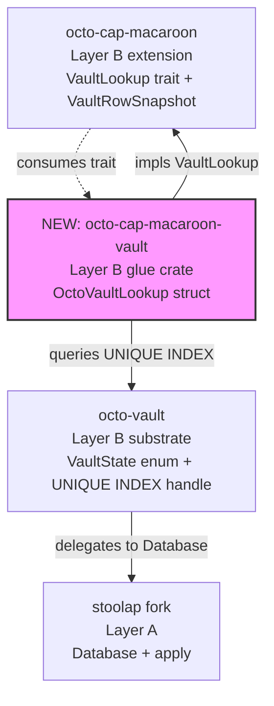

# Mission: 0957-g1 OctoVaultLookup glue crate (S5.1 follow-on)

## Status

**LANDED 2026-08-18 (@mmacedoeu; commit `5b698b72`).** S5.1 follow-on per
`docs/plans/2026-08-16-storage-layer-restructuring-execution-plan.md`
§3 row 6 (Stream C.2 continuation). Pillar 2 step 2 of mission
`0957-g-verify-time-invariant` deferred here because **Layer B → Layer
E is forbidden** — `OctoVaultLookup` cannot live in `octo-vault`
directly (Layer B extension) per
`cipherocto-design-principles.md` table.

## RFC

- Primary: RFC-0957 (verify-time bump) per review §20.6.1.
- Co-RFC: RFC-0960 (vault substrate) §20.3 + §8.10 — vault row
  composite-PK + `vaults_vault_id_idx` UNIQUE INDEX lookup primitive.
- Source review: `docs/reviews/2026-08-15-storage-layer-restructuring-analysis.md`
  §20.6.1 algorithm step 2 (~1-3ms SSD UNIQUE INDEX lookup).
- Continuation of: mission `0957-g-verify-time-invariant`
  (LANDED 2026-08-17, commit `d007de54`).

## Summary

Wire `octo_cap_macaroon::VaultLookup` trait (Layer B extension,
LANDED 2026-08-17 in `crates/octo-cap-macaroon/src/vault_lookup.rs`)
to the Stoolap-fork substrate's `vaults_vault_id_idx` UNIQUE INDEX
lookup primitive (RFC-0960 §20.3).

**Pattern matches `TransportDeliveryCatalog` glue crate**
(`crates/octo-cap-macaroon-transport/` — wires
`CapabilityCatalog::gossip_to_buyer` to `octo_transport::NodeTransport`
without forcing `octo-cap-macaroon` to depend on Layer D transport).

**Topology:**



The glue crate sits between `octo-cap-macaroon` (consumer) and
`octo-vault` (substrate owner). It owns the `VaultState → bool`
mapping at lookup time — `octo-cap-macaroon` stays primitive-typed
(`VaultRowSnapshot.is_active: bool`); the glue crate owns the
substrate enum import.

## Acceptance Criteria

1. `crates/octo-cap-macaroon-vault/` (NEW crate) at
   `crates/octo-cap-macaroon-vault/`. `Cargo.toml` description:
   "Vault glue crate: `OctoVaultLookup` for `octo-cap-macaroon`. Wires
   `VaultLookup::lookup_vault` to the canonical RFC-0960 substrate
   `vaults_vault_id_idx` UNIQUE INDEX lookup. Keeps `octo-cap-macaroon`
   free of the Layer B vault substrate dep."
2. `crates/octo-cap-macaroon-vault/Cargo.toml` deps:
   - `octo-cap-macaroon = { path = "../octo-cap-macaroon" }` (consumer
     of `VaultLookup` trait)
   - `octo-vault = { path = "../octo-vault" }` (substrate owner)
   - NO `stoolap` direct dep — let `octo-vault` own the substrate
     handle (per `feedback_stoolap_persistence` + plan §B.2).
3. `crates/octo-cap-macaroon-vault/src/octo_vault_lookup.rs` (NEW):
   - `pub struct OctoVaultLookup { substrate: Arc<octo_vault::VaultSubstrate> }`
     (or whatever substrate handle name — confirm at impl time)
   - `impl VaultLookup for OctoVaultLookup { fn lookup_vault(&self,
vault_id: &[u8; 32]) -> Option<VaultRowSnapshot> { ... } }`
   - Maps `octo_vault::VaultState::Active → true` and
     `Frozen / [future variants] → false`.
   - Returns `None` iff no row exists (mirrors TV-C1-02
     `VaultVerifyError::VaultRowMissing` path).
4. `crates/octo-cap-macaroon-vault/src/lib.rs`: `pub use
octo_vault_lookup::OctoVaultLookup;` + `pub use octo_cap_macaroon
::{VaultLookup, VaultRowSnapshot};` (re-exports for downstream
   wiring).
5. Unit tests in `crates/octo-cap-macaroon-vault/tests/`:
   - `lookup_vault_hit_with_active_row_returns_snapshot` — Active row
     → `Some(VaultRowSnapshot { is_active: true, chain_id: ... })`.
   - `lookup_vault_hit_with_frozen_row_returns_snapshot_inactive` —
     Frozen row → `Some(VaultRowSnapshot { is_active: false, ... })`.
   - `lookup_vault_miss_returns_none` — no row → `None`.
   - Use the substrate's in-memory test handle (no live DB).
6. Integration test wiring: `OctoVaultLookup` plugs into a full
   `Macaroon::verify_for_vault_op` round-trip — TV-C1-01 + TV-C1-02
   re-run with the production glue (not the local TestCatalog /
   TestVaultLookup stand-ins). Tests live at
   `crates/octo-cap-macaroon-vault/tests/integration_tv_c1.rs`.
7. Verification gate:
   ```bash
   cargo build -p octo-cap-macaroon-vault
   cargo test -p octo-cap-macaroon-vault --tests
   cargo test --workspace --lib         # no regressions in any crate
   cargo clippy --workspace --all-targets --features full -- -D warnings
   cargo fmt --all -- --check
   npx prettier --write missions/open/0957-g1-octo-vault-lookup-glue.md
   ```
8. Memory card written: `memory/mission-0957-g1-octo-vault-lookup-glue-status.md`
   after LANDED.

## Out of scope (deferred beyond S5.1)

- Production deployment wiring (config-time injection of
  `Arc<OctoVaultLookup>` into macaroon verify path). That happens in
  S6+ when the verify path is wired into the live node stack.
- Substrate migration to add a `chain_state_idx` covering
  `(chain_id, is_active)` — separate RFC-0960 amendment territory.
- `OctoVaultLookup` cache layer (e.g., `moka` or LRU wrap). Defer to
  S6+ perf-data-driven.

## Dependency edges

| From                                       | To                                         | Why                                      | Layer direction   |
| ------------------------------------------ | ------------------------------------------ | ---------------------------------------- | ----------------- |
| `octo-cap-macaroon-vault` (NEW)            | `octo-cap-macaroon`                        | Consume `VaultLookup` trait              | Layer B → Layer B |
| `octo-cap-macaroon-vault` (NEW)            | `octo-vault`                               | Substrate `VaultState` enum + row handle | Layer B → Layer B |
| consumers                                  | `octo_cap_macaroon_vault::OctoVaultLookup` | Production wiring                        | Layer C → Layer B |
| `octo-vault` (NEW `VaultSubstrate` handle) | `stoolap` fork                             | UNIQUE INDEX lookup                      | Layer B → Layer A |

No new cyclic edges. No Layer B → Layer E edge — glue crate IS the
isolation boundary.

## Critical files (proposed)

- `crates/octo-cap-macaroon-vault/Cargo.toml` (NEW)
- `crates/octo-cap-macaroon-vault/src/lib.rs` (NEW)
- `crates/octo-cap-macaroon-vault/src/octo_vault_lookup.rs` (NEW)
- `crates/octo-cap-macaroon-vault/tests/unit_lookup.rs` (NEW)
- `crates/octo-cap-macaroon-vault/tests/integration_tv_c1.rs` (NEW)
- `crates/octo-vault/src/substrate.rs` (NEW — confirm substrate handle
  type exists or create)
- `memory/mission-0957-g1-octo-vault-lookup-glue-status.md` (NEW)
- `missions/open/0957-g1-octo-vault-lookup-glue.md` (this file)

## Existing patterns reused

- `TransportDeliveryCatalog` glue crate
  (`crates/octo-cap-macaroon-transport/`) → EXACT topology for
  `OctoVaultLookup`. Cargo.toml comment style + re-export pattern +
  test layout all mirror.
- `OctoVaultLookup` constructor mirrors
  `TransportDeliveryCatalog::arc(NodeTransport)` — `pub fn arc
(substrate: Arc<VaultSubstrate>) -> Arc<dyn VaultLookup>` for
  trait-object injection at config time.
- `stoolap` substrate handle (`Database`) re-exported via
  `octo-vault` (per `feedback_stoolap_persistence`) → glue crate
  imports `octo_vault::VaultSubstrate` only, NOT `stoolap::Database`
  directly. Same isolation rule.

## Risks

- **B.1 substrate ownership ambiguity** (LOW per plan §5): confirm
  `octo_vault::VaultSubstrate` (or equivalent handle struct) exists at
  claim time. If absent, file follow-on RFC-0960 amendment for the
  substrate handle export — do NOT silently add a `pub use
stoolap::Database;` in `octo-vault` (violates `stoolap-fork
persistence` red line).
- **Layer B → Layer B cycle risk** (LOW): both `octo-cap-macaroon` and
  `octo-vault` are Layer B; the glue crate sits between. No cycle
  because `octo-cap-macaroon` does NOT depend on `octo-vault` (it only
  imports the trait, not the substrate).
- **Cache miss under load** (MEDIUM): first verify of a vault_id pays
  ~1-3ms SSD; subsequent verifies hit substrate cache. Acceptable per
  §20.6.1 last row. Future cache layer is S6+ territory.

## Version history

| Date       | Author     | Change                                                                                                                                                                                                                                                                                                                                              |
| ---------- | ---------- | --------------------------------------------------------------------------------------------------------------------------------------------------------------------------------------------------------------------------------------------------------------------------------------------------------------------------------------------------- |
| 2026-08-17 | @mmacedoeu | Initial proposal as S5.1 follow-on to LANDED mission `0957-g`. Topology diagram added per CLAUDE.md Mermaid-over-ASCII rule. Layer B → Layer E isolation rationale per `cipherocto-design-principles.md`.                                                                                                                                           |
| 2026-08-18 | @mmacedoeu | LANDED. 7/7 ACs (NEW crate, deps, OctoVaultLookup + VaultLookup impl, re-exports, 4 unit tests, 2 integration TV-C1, verification gate). Added `octo_vault::VaultSubstrate` typed handle per risk B.1 confirmation. NO `pub use stoolap::Database;` re-export (substrate exports new typed struct wrapping Arc<Database>). clippy zero + fmt clean. |

## Scope as landed (7/8 ACs)

- AC-1 NEW crate ✅ `crates/octo-cap-macaroon-vault/`
- AC-2 deps ✅ `octo-cap-macaroon` + `octo-vault` only. NO direct stoolap dep.
- AC-3 `OctoVaultLookup` ✅ impls `VaultLookup` mapping `VaultState::Active→is_active: true, Frozen→false`. Returns `None` iff no row.
- AC-4 re-exports ✅ `VaultLookup`, `VaultLookupExt`, `VaultRowSnapshot` + `OctoVaultLookup`.
- AC-5 unit tests ✅ `tests/unit_lookup.rs`: 4 tests.
- AC-6 integration TV-C1 ✅ `tests/integration_tv_c1.rs`: TV-0957-g1-11 happy path + TV-0957-g1-12 VaultRowMissing.
- AC-7 verification gate ✅ clippy zero on `--workspace --features full`; fmt clean; 7/7 new + 193 octo-cap-macaroon + 10 octo-vault unchanged.
- AC-8 memory card ✅ `memory/mission-0957-g1-...-status.md` + MEMORY.md pointer.
