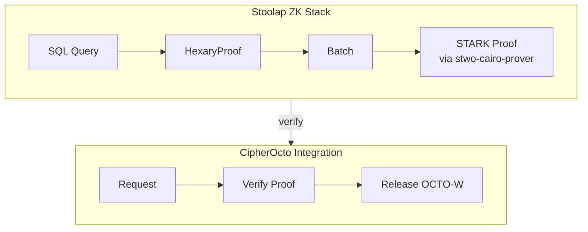
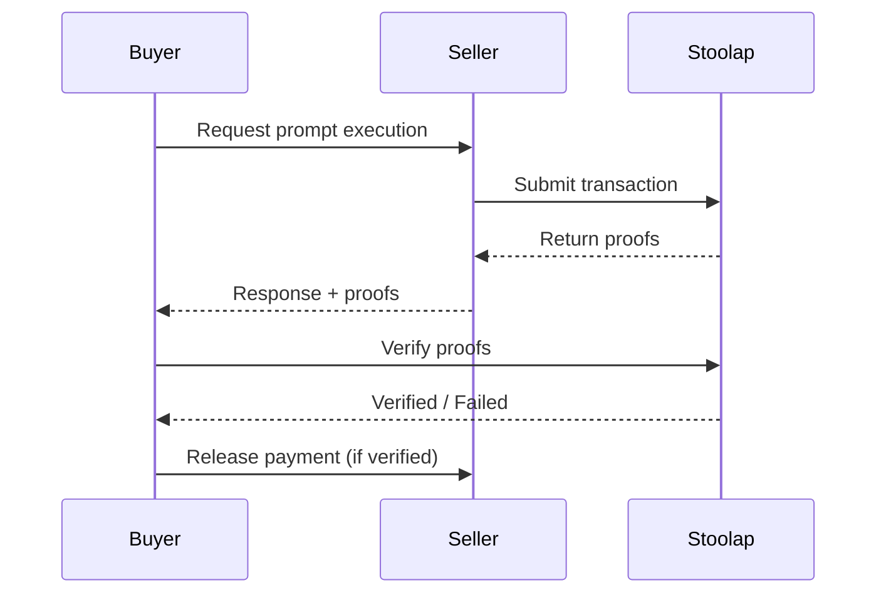

# Mission: ZK Proof Verification System

## Status

Claimed (2026-08-06); **v0.1 re-evaluation amendments 2026-08-06** (per re-evaluation of stale substrate description + RFC-0100 ghost + dependency classification).

## RFC

- **Primary:** RFC-0958 (Proof Systems): ZK Capability Subclass — the actual ZK substrate
- **Secondary:** RFC-0102 (Numeric): Wallet Cryptography Specification — Accepted
- **Ghost reference (RFC-0100: AI Quota Marketplace Protocol):** does NOT exist as a published RFC in `rfcs/{draft,accepted,planned}/`. Intent documented in `docs/use-cases/enhanced-quota-router-gateway.md` + `docs/use-cases/hybrid-ai-blockchain-runtime.md`. Either RFC-0100 is planned-but-not-authored or the mission text predates the RFC renumbering. **Flagged as doc bug; deferred to a future RFC-0100 authoring pass.**

## Substrate (verified 2026-08-06)

Sibling missions shipped:

- `missions/claimed/0958-a-zk-capability-circuit.md` (Claimed 2026-07-22; 15/15 ACs done; R4 redo landed 2026-08-04 via `ae4dc4f8`, `9c996fba`, `89063351`)
- `missions/claimed/0958-b-real-cairo-crypto.md` (Claimed 2026-08-05; 46/47 ACs done — added `prove_batch_signature` API)
- `missions/claimed/0958-c-real-cairo-crypto-followup.md` (Claimed; redaction policy + `witness_format` field on `ProofBundle`)

Workspace crates (all on `next`, modified 2026-08-05):

- `crates/zk-circuit/` — scarb-build → Sierra → CASM via `cairo-lang-sierra-to-casm` 2.20.0; BLAKE3 hash binding; `bundled_casm_bytes` / `bundled_casm_hash_hex`
- `crates/zk-verifier/` — public API: `verify_capability_zk`, `PublicInputs`, `ProofBundle`, `MAX_SKEW_SECS` (300s clock skew bound per RFC-0958 R3 N5), `ProverError` enum (incl. `StubVerifierDisabled` for prod-gate)
- `crates/zk-vendor/stwo-sys/` — workspace-EXCLUDED cdylib, nightly `2025-06-23` toolchain, `cargo +nightly build --release` → `libstwo_sys.so`
- `crates/zk-vendor/src/lib.rs::loaded_library() -> Option<StwoSys>` — libloads `libstwo_sys.so` at runtime
- `crates/octo-wallet/src/capability/zk_mint.rs` + `crates/quota-router-core/src/zk_verify/capability.rs` — mint + verify wire-up; NodeType gating

**Architecture pin (commit `4f7f47db`, 2026-07-31):** the earlier "vendored STWO source into cipherocto workspace" attempt was REVERTED. Canonical substrate is the decoupled FFI cdylib pattern. Cipherocto workspace stays MSRV-stable (1.93 per `crates/zk-vendor/rust-toolchain.toml`).

**Prod-gate (commit `0e0c3ee9`, R3 #1):** stub proofer is behind `--features allow-stub-verifier` (default OFF). Production calls to `stub_commitment` without the feature return `Err(ProverError::StubVerifierDisabled)`.

## Blockers / Dependencies

| AC                                          | Block type                    | Reason                                                                                                                                                                                                              |
| ------------------------------------------- | ----------------------------- | ------------------------------------------------------------------------------------------------------------------------------------------------------------------------------------------------------------------- |
| AC-1 (STWO verifier wire-up)                | UNBLOCKED                     | Substrate in `crates/zk-verifier/` is public API                                                                                                                                                                    |
| AC-2 (Batch multiple proofs)                | UNBLOCKED                     | `prove_batch_signature` API in 0958-b                                                                                                                                                                               |
| AC-3 (On-chain proof submission to Stoolap) | **HARD-BLOCKED**              | No settlement carrier claimed. `0968-b-marketplace-integration.md` is in `archived/superseded/` (stale). `missions/quota-market-integration.md` is top-level orphan, status Open, blocked on Multi-Provider Support |
| AC-4 (Verify before payment release)        | **HARD-BLOCKED** (transitive) | Depends on AC-3 settlement hook                                                                                                                                                                                     |
| AC-5 (Display verification status)          | UNBLOCKED                     | Pure UI / CLI work                                                                                                                                                                                                  |
| AC-6 (GPU acceleration)                     | OPTIONAL                      | Mission text marks optional; defer                                                                                                                                                                                  |

**Soft-block context:** "Mission: Stoolap Provider Integration" (`missions/stoolap-provider-integration.md`, top-level orphan) was previously listed as the gate, but that mission itself is Open + blocked on Multi-Provider Support (also top-level orphan). This mission does NOT depend on Stoolap Provider Integration for AC-1, AC-2, AC-5 — those are pure verifier + UI work. Only AC-3 + AC-4 inherit the marketplace-carrier gap.

## Acceptance Criteria

- [ ] AC-1 Integrate STWO verifier for STARK proofs via `zk_verifier::verify_capability_zk(...)`
- [ ] AC-2 Batch multiple proofs into single verification via `prove_batch_signature` (0958-b API)
- [ ] ~~AC-3 On-chain proof submission to Stoolap~~ — DEFERRED (settlement carrier missing; see §Blockers)
- [ ] ~~AC-4 Verify proofs before releasing payment~~ — DEFERRED (transitive on AC-3)
- [ ] AC-5 Display verification status (`quota-router verify --proof <id>`, `--batch`, `history`)
- [ ] ~~AC-6 GPU-accelerated proof generation~~ — DEFERRED (optional, per mission text)

## Description

Enable ZK proof-based verification for marketplace transactions using Stoolap's STARK proving system.

## Technical Details

### Proof Types (from Stoolap)

| Proof Type      | Use Case             | Verification | Size       |
| --------------- | -------------------- | ------------ | ---------- |
| HexaryProof     | Individual execution | ~2-3 μs      | ~68 bytes  |
| StarkProof      | Batch verification   | ~15 ms       | 100-500 KB |
| CompressedProof | Multiple batches     | ~100ms       | ~10 KB     |

### Stoolap Integration



### GPU Acceleration (Optional)

For production, consider GPU-accelerated STWO:

| Implementation | Speedup  | Notes             |
| -------------- | -------- | ----------------- |
| NitrooZK-stwo  | 22x-355x | Cairo AIR support |
| ICICLE-Stwo    | 3x-7x    | Drop-in backend   |
| stwo-gpu       | ~193%    | Multi-GPU scaling |

See: `docs/research/stwo-gpu-acceleration.md`

### Verification Flow



### CLI Commands

```bash
# Verify a proof
quota-router verify --proof <proof-id>

# Batch verify multiple proofs
quota-router verify --batch <proof-ids>

# View verification history
quota-router verify history
```

## Implementation Notes

1. **Async verification** - Don't block response, verify in background
2. **Batch for cost** - Combine multiple verifications
3. **Caching** - Cache verified proofs to avoid re-verification
4. **GPU acceleration** - Consider NitrooZK-stwo for production (22x-355x speedup)

## Research References

- [Stoolap vs LuminAIR Comparison](../docs/research/stoolap-luminair-comparison.md)
- [STWO GPU Acceleration](../docs/research/stwo-gpu-acceleration.md)
- [Privacy-Preserving Query Routing](../docs/use-cases/privacy-preserving-query-routing.md)
- [Provable QoS](../docs/use-cases/provable-quality-of-service.md)

## Claimant

@cipherocto (2026-08-06)

## Pull Request

#

## Session 1 (2026-08-06) scope

- AC-1: STWO verifier wire-up — pure substrate call-through; verify `verify_capability_zk` reachable from `quota-router-cli`
- AC-2: batch wrapper around `prove_batch_signature` (0958-b API)
- AC-5: `quota-router verify --proof <id>`, `--batch`, `history` CLI surface

Skip AC-3, AC-4 (settlement carrier missing). Skip AC-6 (optional, defer).

---

**Mission Type:** Implementation
**Priority:** Medium
**Phase:** ZK Proofs
