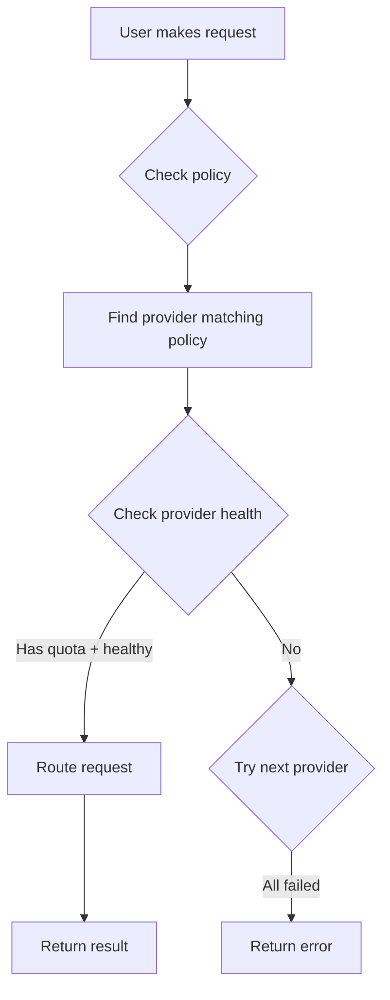

# Mission: Multi-Provider Support

## Status
Open

## RFC
RFC-0100: AI Quota Marketplace Protocol
RFC-0101: Quota Router Agent Specification
RFC-0102: Wallet Cryptography Specification

## Blockers / Dependencies

- **Blocked by:** Mission: Quota Router MVE (must complete first)

## Acceptance Criteria

- [ ] Support multiple API providers (OpenAI, Anthropic, Google, etc.)
- [ ] Per-provider balance tracking
- [ ] Provider health monitoring
- [ ] Automatic failover when provider fails
- [ ] Provider-specific routing policies

## Description

Extend the quota router to support multiple AI API providers simultaneously, enabling redundancy and provider-specific optimization.

## Technical Details

### Provider Commands

```bash
# Add provider
quota-router provider add --name anthropic --key $ANTHROPIC_KEY

# List providers
quota-router provider list

# Remove provider
quota-router provider remove --name anthropic

# Set provider priority
quota-router provider priority --set "openai,anthropic,google"

# Check provider health
quota-router provider health

# Test provider
quota-router provider test --name openai
```

### Provider State

```rust
struct Provider {
    name: String,
    status: ProviderStatus,  // Active, Inactive, Error
    balance: u64,             // OCTO-W quota available
    latency_ms: u64,
    success_rate: f64,
    last_used: DateTime,
}

enum ProviderStatus {
    Active,
    Inactive,
    Error,
}
```

### Routing with Multiple Providers



### Provider Policies

| Policy | Selection Criteria |
|--------|-------------------|
| **cheapest** | Lowest OCTO-W per prompt |
| **fastest** | Lowest latency |
| **quality** | Prefer higher-quality models |
| **balanced** | Score based on price + speed |

## Dependencies

- Mission: Quota Router MVE (must complete first)

## Implementation Notes

1. **Graceful degradation** - If one provider fails, try others
2. **Transparent** - User doesn't notice provider switches
3. **Metric tracking** - Track success/latency per provider

## Claimant

<!-- Add your name when claiming -->

## Pull Request

<!-- PR number when submitted -->

---

**Mission Type:** Implementation
**Priority:** Medium
**Phase:** Multi-Provider
