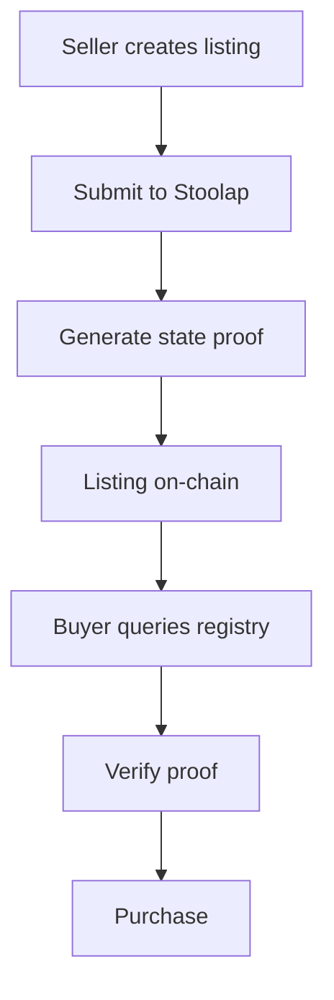

# Mission: On-Chain Registry Migration

## Status
Open

## RFC
RFC-0100: AI Quota Marketplace Protocol

## Blockers / Dependencies

- **Blocked by:** Mission: ZK Proof Verification System (must complete first)

## Acceptance Criteria

- [ ] Migrate listing registry to Stoolap
- [ ] Create on-chain listing transactions
- [ ] Verify listing state with proofs
- [ ] Enable private listings with commitments
- [ ] Maintain off-chain fallback

## Description

Migrate the marketplace listing registry from off-chain to on-chain using Stoolap, enabling verifiable state and decentralized operation.

## Technical Details

### On-Chain Listing

```rust
struct Listing {
    id: u64,
    seller: Address,
    provider: String,
    quantity: u64,
    price_per_prompt: u64,
    commitment: Hash,  // For privacy
    status: ListingStatus,
}

// Transaction types
enum ListingTx {
    Create(Listing),
    Update { id: u64, quantity: u64 },
    Cancel { id: u64 },
}
```

### Registry Flow



### CLI Commands

```bash
# Create on-chain listing
quota-router listing create --prompts 100 --price 1 --on-chain

# Verify listing proof
quota-router listing verify --id <listing-id>

# Migrate existing listing to chain
quota-router listing migrate --id <listing-id>
```

## Privacy Considerations

Use Pedersen commitments for confidential listings:
- Listing existence is public
- Price/quantity details can be private
- Buyer can verify commitment without revealing values

## Implementation Notes

1. **Gradual migration** - Keep off-chain as fallback
2. **Privacy optional** - Users choose public or private
3. **Proof-based** - Every state change has cryptographic proof

## Claimant

<!-- Add your name when claiming -->

## Pull Request

<!-- PR number when submitted -->

---

**Mission Type:** Implementation
**Priority:** Medium
**Phase:** On-Chain Registry
