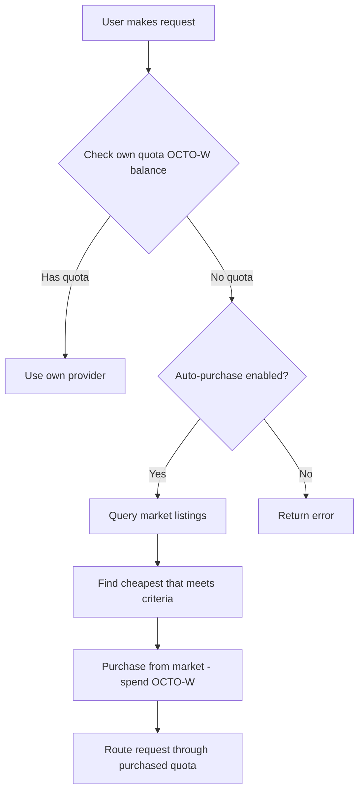

# Mission: Quota Market Integration

## Status
Open

## RFC
RFC-0100: AI Quota Marketplace Protocol
RFC-0101: Quota Router Agent Specification
RFC-0102: Wallet Cryptography Specification

## Blockers / Dependencies

- **Blocked by:** Mission: Quota Router MVE (must complete first)

## Acceptance Criteria

- [ ] Market client that queries available listings
- [ ] Automatic quota purchase when own quota exhausted
- [ ] Price discovery (lowest price first)
- [ ] Market price display
- [ ] Fallback when market unavailable

## Description

Enable the quota router to automatically purchase quota from the marketplace when the user's own quota is exhausted.

## Technical Details

### New CLI Commands

```bash
# View market listings
quota-router market list

# View market prices
quota-router market prices

# Enable auto-purchase
quota-router market auto-enable --max-price 5

# Disable auto-purchase
quota-router market auto-disable
```

### Market Flow



## Dependencies

- Mission: Quota Router MVE (must complete first)

## Implementation Notes

1. **Offline-first** - Works even if market unavailable
2. **Configurable** - User sets max price they'll pay
3. **Transparent** - User sees when market quota is used

## Claimant

<!-- Add your name when claiming -->

## Pull Request

<!-- PR number when submitted -->

---

**Mission Type:** Implementation
**Priority:** High
**Phase:** Market
