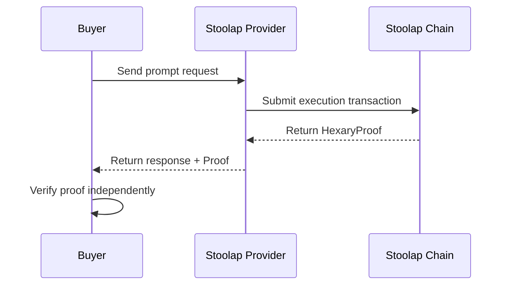

# Mission: Stoolap Provider Integration

## Status
Open

## RFC
RFC-0100: AI Quota Marketplace Protocol
RFC-0101: Quota Router Agent Specification

## Blockers / Dependencies

- **Blocked by:** Mission: Multi-Provider Support (must complete first)

## Acceptance Criteria

- [ ] Stoolap provider type added to router
- [ ] Stoolap node connection/config
- [ ] Submit execution proof after prompt completion
- [ ] Verify proof before payment release
- [ ] Display proof status in balance

## Description

Integrate Stoolap blockchain SQL database as a provider type in the quota router, enabling cryptographic proof of execution.

## Technical Details

### Stoolap Provider

```rust
struct StoolapProvider {
    name: &'static str,  // "stoolap"
    endpoint: String,
    chain_id: String,
}

impl StoolapProvider {
    // Submit execution proof
    async fn submit_proof(&self, execution: Execution) -> Result<Proof>;

    // Verify proof before payment
    async fn verify_proof(&self, proof: &Proof) -> Result<bool>;
}
```

### Proof Flow



### CLI Commands

```bash
# Add Stoolap provider
quota-router provider add --type stoolap --endpoint https://stoolap.example.com

# Enable proof verification
quota-router provider stoolap verify-proofs enable

# View proof history
quota-router provider stoolap proofs
```

## Integration Points

| Component | Change |
|-----------|--------|
| RFC-0101 | Add StoolapProvider to provider types |
| RFC-0101 | Add verifyProof() to unified schema |

## Implementation Notes

1. **Optional first** - Stoolap verification is opt-in
2. **Fallback** - If proof fails, use reputation-based resolution
3. **Async** - Proof generation can be async, don't block response

## Research References

- [Stoolap vs LuminAIR Comparison](../docs/research/stoolap-luminair-comparison.md)
- [STWO GPU Acceleration](../docs/research/stwo-gpu-acceleration.md)
- [Privacy-Preserving Query Routing](../docs/use-cases/privacy-preserving-query-routing.md)

## Claimant

<!-- Add your name when claiming -->

## Pull Request

<!-- PR number when submitted -->

---

**Mission Type:** Implementation
**Priority:** Medium
**Phase:** Stoolap Integration
