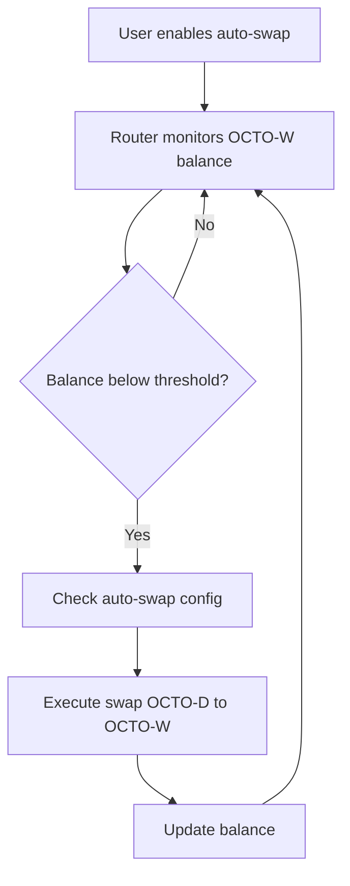

# Mission: Token Swap Integration

## Status
Open

## RFC
RFC-0100: AI Quota Marketplace Protocol
RFC-0101: Quota Router Agent Specification
RFC-0102: Wallet Cryptography Specification

## Blockers / Dependencies

- **Blocked by:** Mission: Quota Router MVE (must complete first)
- **Recommended:** Mission: Quota Market Integration (can run in parallel)

## Acceptance Criteria

- [ ] OCTO-W ↔ OCTO-D swap at market rate
- [ ] OCTO ↔ OCTO-W swap at market rate
- [ ] OCTO ↔ OCTO-D swap at market rate
- [ ] Auto-swap when balance low (configurable)
- [ ] Manual swap commands
- [ ] Display current rates

## Description

Enable automatic and manual token swaps to ensure developers can always get OCTO-W when they need quota.

## Technical Details

### Swap Commands

```bash
# Check rates
quota-router swap rates

# Swap OCTO-D to OCTO-W
quota-router swap d-to-w --amount 100

# Swap OCTO to OCTO-W
quota-router swap o-to-w --amount 50

# Enable auto-swap (when balance < 10, swap 100 OCTO-D)
quota-router swap auto-enable --threshold 10 --amount 100 --from OCTO-D

# Disable auto-swap
quota-router swap auto-disable

# Check swap history
quota-router swap history
```

### Swap Flow



### Exchange Rates

Rates are fetched from decentralized exchange or oracle:
- Market-based (not fixed)
- Updated on each swap
- Displayed before confirmation

## Dependencies

- Mission: Quota Router MVE (must complete first)

## Implementation Notes

1. **Reversible** - User can swap back any time
2. **Confirmed** - Show rate before executing
3. **History** - Keep log of all swaps

## Claimant

<!-- Add your name when claiming -->

## Pull Request

<!-- PR number when submitted -->

---

**Mission Type:** Implementation
**Priority:** High
**Phase:** Swaps
