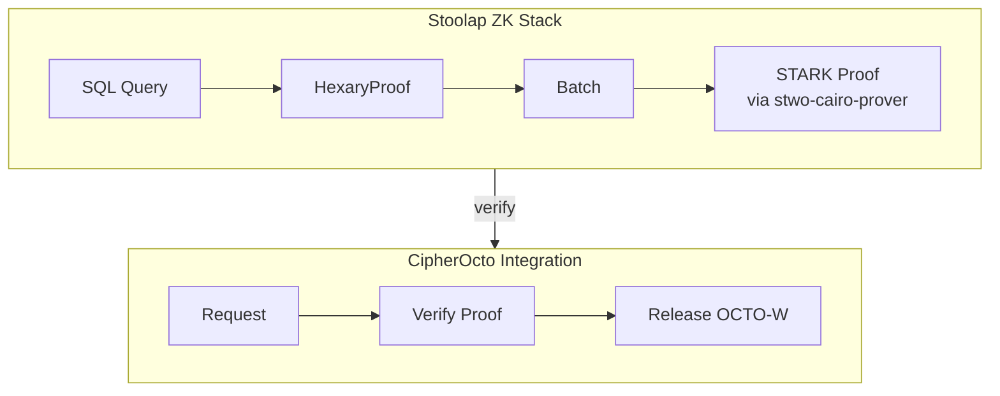
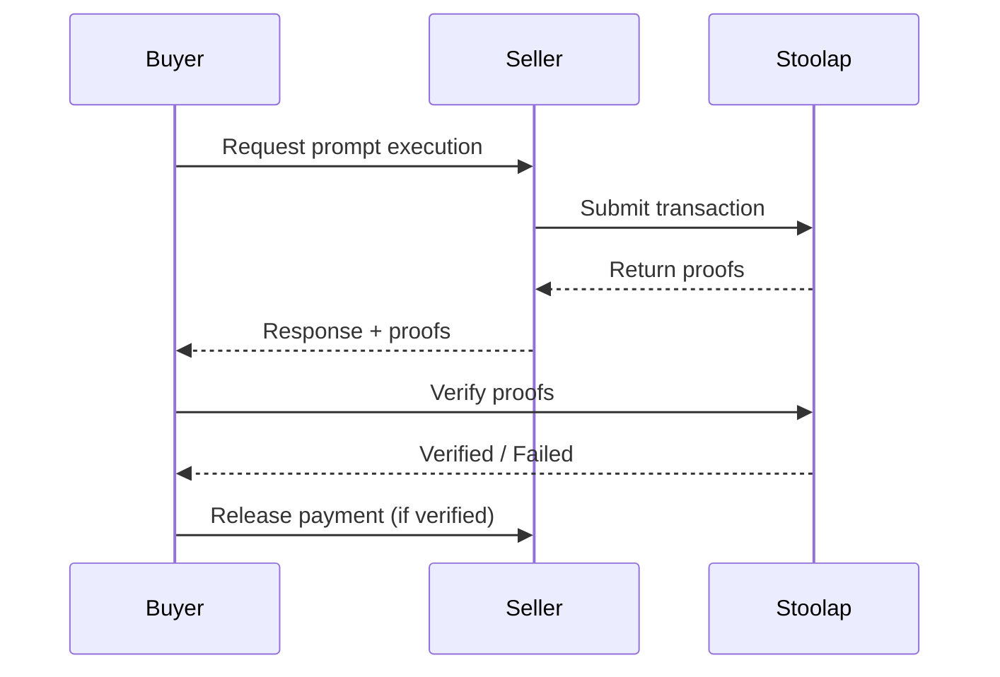

# Mission: ZK Proof Verification System

## Status
Open

## RFC
RFC-0100: AI Quota Marketplace Protocol
RFC-0102: Wallet Cryptography Specification

## Blockers / Dependencies

- **Blocked by:** Mission: Stoolap Provider Integration (must complete first)

## Acceptance Criteria

- [ ] Integrate STWO verifier for STARK proofs
- [ ] Batch multiple proofs into single verification
- [ ] On-chain proof submission to Stoolap
- [ ] Verify proofs before releasing payment
- [ ] Display verification status
- [ ] GPU-accelerated proof generation (optional optimization)

## Description

Enable ZK proof-based verification for marketplace transactions using Stoolap's STARK proving system.

## Technical Details

### Proof Types (from Stoolap)

| Proof Type | Use Case | Verification | Size |
|-----------|-----------|---------------|------|
| HexaryProof | Individual execution | ~2-3 μs | ~68 bytes |
| StarkProof | Batch verification | ~15 ms | 100-500 KB |
| CompressedProof | Multiple batches | ~100ms | ~10 KB |

### Stoolap Integration



### GPU Acceleration (Optional)

For production, consider GPU-accelerated STWO:

| Implementation | Speedup | Notes |
|---------------|---------|-------|
| NitrooZK-stwo | 22x-355x | Cairo AIR support |
| ICICLE-Stwo | 3x-7x | Drop-in backend |
| stwo-gpu | ~193% | Multi-GPU scaling |

See: `docs/research/stwo-gpu-acceleration.md`

### Verification Flow



### CLI Commands

```bash
# Verify a proof
quota-router verify --proof <proof-id>

# Batch verify multiple proofs
quota-router verify --batch <proof-ids>

# View verification history
quota-router verify history
```

## Implementation Notes

1. **Async verification** - Don't block response, verify in background
2. **Batch for cost** - Combine multiple verifications
3. **Caching** - Cache verified proofs to avoid re-verification
4. **GPU acceleration** - Consider NitrooZK-stwo for production (22x-355x speedup)

## Research References

- [Stoolap vs LuminAIR Comparison](../docs/research/stoolap-luminair-comparison.md)
- [STWO GPU Acceleration](../docs/research/stwo-gpu-acceleration.md)
- [Privacy-Preserving Query Routing](../docs/use-cases/privacy-preserving-query-routing.md)
- [Provable QoS](../docs/use-cases/provable-quality-of-service.md)

## Claimant

<!-- Add your name when claiming -->

## Pull Request

<!-- PR number when submitted -->

---

**Mission Type:** Implementation
**Priority:** Medium
**Phase:** ZK Proofs
