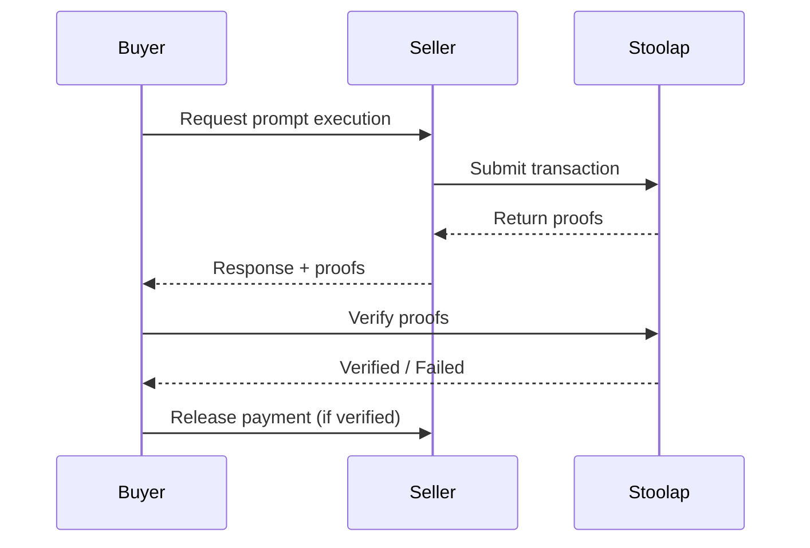

# Mission: ZK Proof Verification System

## Status
Open

## RFC
RFC-0100: AI Quota Marketplace Protocol

## Blockers / Dependencies

- **Blocked by:** Mission: Stoolap Provider Integration (must complete first)

## Acceptance Criteria

- [ ] Integrate STWO verifier for STARK proofs
- [ ] Batch multiple proofs into single verification
- [ ] On-chain proof submission to Stoolap
- [ ] Verify proofs before releasing payment
- [ ] Display verification status

## Description

Enable ZK proof-based verification for marketplace transactions using Stoolap's STARK proving system.

## Technical Details

### Proof Types

| Proof Type | Use Case | Verification |
|-----------|-----------|---------------|
| HexaryProof | Individual execution | ~2-3 μs |
| StarkProof | Batch verification | ~100ms |
| CompressedProof | Multiple batches | ~500ms |

### Verification Flow



### CLI Commands

```bash
# Verify a proof
quota-router verify --proof <proof-id>

# Batch verify multiple proofs
quota-router verify --batch <proof-ids>

# View verification history
quota-router verify history
```

## Implementation Notes

1. **Async verification** - Don't block response, verify in background
2. **Batch for cost** - Combine multiple verifications
3. **Caching** - Cache verified proofs to avoid re-verification

## Claimant

<!-- Add your name when claiming -->

## Pull Request

<!-- PR number when submitted -->

---

**Mission Type:** Implementation
**Priority:** Medium
**Phase:** ZK Proofs
