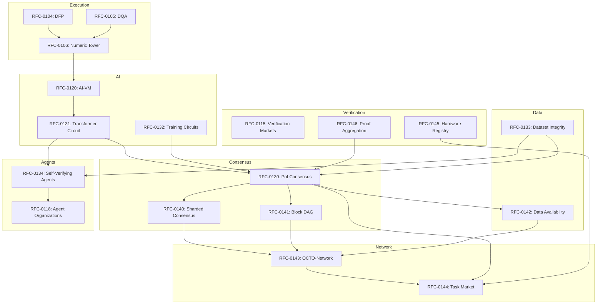
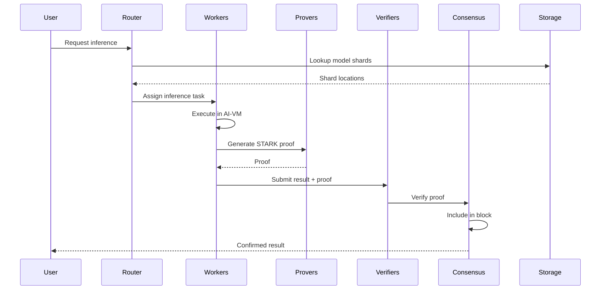

# RFC-0000 (Process/Meta): CipherOcto Architecture Overview

## Status

Draft

> **Note:** This RFC was originally numbered RFC-0000 under the legacy numbering system. It remains at 0000 as it belongs to the Process/Meta category.

## Summary

This RFC provides the **architectural overview** of CipherOcto — a verifiable decentralized AI operating system that combines deterministic AI computation, cryptographic verification, and blockchain consensus to enable trustless AI inference, training, and autonomous agent execution at scale.

## Design Goals

| Goal | Target | Metric |
| ---- | ------ | ------ |
| G1: Completeness | All subsystems documented | 100% coverage |
| G2: Clarity | New contributors understand | Onboarding <1 hour |
| G3: Navigation | Find related RFCs easily | Cross-references |
| G4: Accuracy | Technical correctness | All specs verified |

## Motivation

### CAN WE? — Feasibility Research

The fundamental question: **Can we build a complete decentralized AI operating system that is both verifiable and scalable?**

Research confirms feasibility through:

- Deterministic computation (RFC-0106)
- STARK-based verification (RFC-0107)
- Sharded consensus (RFC-0140)
- Task markets (RFC-0144)

### WHY? — Why This Matters

Without architectural overview:

| Problem | Consequence |
|---------|-------------|
| Navigation chaos | Can't find related RFCs |
| Onboarding friction | New contributors lost |
| Dependency confusion | Unknown implementation order |
| Gaps invisible | Missing protocols unnoticed |

The architecture provides:

- **System map** — Complete subsystem view
- **Dependency graph** — Implementation ordering
- **Cross-references** — Related RFC navigation
- **Gap detection** — Identify missing pieces

### WHAT? — What This Specifies

This overview defines:

1. **Layer structure** — How subsystems stack
2. **Component relationships** — Dependencies
3. **Data flows** — How information moves
4. **Protocol gaps** — What's still needed

### HOW? — Implementation

This RFC serves as an index. It does not define new protocols but references existing RFCs.

## Specification

### Layer Architecture

CipherOcto consists of **seven architectural layers**:

```
┌─────────────────────────────────────────────────────────────────────────────┐
│                         APPLICATION LAYER                                   │
│  ┌─────────────────────┐  ┌─────────────────────────────────────────┐       │
│  │ Self-Verifying     │  │ Autonomous Agent Organizations         │       │
│  │ AI Agents          │  │ (RFC-0118)                            │       │
│  │ (RFC-0416)        │  │                                        │       │
│  └─────────────────────┘  └─────────────────────────────────────────┘       │
└────────────────────────────────────┬────────────────────────────────────┘
                                     │
┌────────────────────────────────────▼────────────────────────────────────┐
│                         AI EXECUTION LAYER                              │
│  ┌─────────────────────────┐  ┌─────────────────────────────────────┐       │
│  │ Deterministic           │  │ Deterministic Training Circuits       │       │
│  │ Transformer Circuit    │  │ (RFC-0108)                          │       │
│  │ (RFC-0107)            │  │                                     │       │
│  └─────────────────────────┘  └─────────────────────────────────────┘       │
│                                    │                                    │
│  ┌───────────────────────────────▼────────────────────────────────┐        │
│  │            Deterministic AI-VM (RFC-0120)                    │        │
│  └───────────────────────────────┬────────────────────────────────┘        │
└──────────────────────────────────┼───────────────────────────────────┘
                                   │
┌──────────────────────────────────▼───────────────────────────────────┐
│                         VERIFICATION LAYER                              │
│  ┌─────────────────────────┐  ┌─────────────────────────────────────┐       │
│  │ Proof-of-Dataset       │  │ Probabilistic Verification Markets   │       │
│  │ Integrity (RFC-0631)   │  │ (RFC-0115)                         │       │
│  └─────────────────────────┘  └─────────────────────────────────────┘       │
│  ┌─────────────────────────┐  ┌─────────────────────────────────────┐       │
│  │ Proof Aggregation      │  │ Hardware Capability Registry         │       │
│  │ (RFC-0146)            │  │ (RFC-0145)                         │       │
│  └─────────────────────────┘  └─────────────────────────────────────┘       │
└────────────────────────────────────┬────────────────────────────────────┘
                                     │
┌────────────────────────────────────▼────────────────────────────────────┐
│                         CONSENSUS LAYER                                  │
│  ┌──────────────────────────────────────────────────────────────┐          │
│  │            Proof-of-Inference Consensus (RFC-0630)           │          │
│  │  ┌─────────────┐  ┌─────────────┐  ┌──────────────────┐  │          │
│  │  │ Sharded     │  │ Parallel    │  │ Data            │  │          │
│  │  │ Consensus   │  │ Block DAG   │  │ Availability    │  │          │
│  │  │(RFC-0140)  │  │(RFC-0141)  │  │(RFC-0142)      │  │          │
│  │  └─────────────┘  └─────────────┘  └──────────────────┘  │          │
│  └──────────────────────────────────────────────────────────────┘          │
└────────────────────────────────────┬────────────────────────────────────┘
                                     │
┌────────────────────────────────────▼────────────────────────────────────┐
│                         NETWORK LAYER                                     │
│  ┌─────────────────────────────┐  ┌─────────────────────────────────┐       │
│  │ OCTO-Network Protocol      │  │ Inference Task Market            │       │
│  │ (RFC-0143)                │  │ (RFC-0144)                      │       │
│  └─────────────────────────────┘  └─────────────────────────────────┘       │
└────────────────────────────────────┬────────────────────────────────────┘
                                     │
┌────────────────────────────────────▼────────────────────────────────────┐
│                         EXECUTION LAYER                                  │
│  ┌──────────────────────────────────────────────────────────────┐          │
│  │            Deterministic Numeric Tower (RFC-0106)            │          │
│  │  ┌────────────┐  ┌────────────┐  ┌────────────────────┐   │          │
│  │  │ DFP        │  │ DQA        │  │ Numeric Types    │   │          │
│  │  │(RFC-0104)  │  │(RFC-0105)  │  │(RFC-0106)       │   │          │
│  │  └────────────┘  └────────────┘  └────────────────────┘   │          │
│  └──────────────────────────────────────────────────────────────┘          │
└─────────────────────────────────────────────────────────────────────────────┘
```

### RFC Dependency Graph



### Subsystem Breakdown

#### Layer 1: Execution (Deterministic Math)

| RFC | Purpose | Status |
|-----|---------|--------|
| RFC-0104 | Deterministic Floating-Point | Complete |
| RFC-0105 | Deterministic Quant Arithmetic | Complete |
| RFC-0106 | Deterministic Numeric Tower | Complete |

**Key Property:** Any computation produces identical results on any hardware.

#### Layer 2: AI Execution

| RFC | Purpose | Status |
|-----|---------|--------|
| RFC-0116 | Unified Deterministic Execution | Complete |
| RFC-0120 | Deterministic AI-VM | Complete |
| RFC-0131 | Transformer Circuit | Complete |
| RFC-0132 | Training Circuits | Complete |

#### Layer 3: Storage & Knowledge

| RFC | Purpose | Status |
|-----|---------|--------|
| RFC-0103 | Vector-SQL Storage | Complete |
| RFC-0107 | Production Storage v2 | Complete |
| RFC-0110 | Verifiable Agent Memory | Complete |
| RFC-0111 | Knowledge Market | Complete |
| RFC-0133 | Dataset Integrity | Complete |

#### Layer 4: Retrieval & Reasoning

| RFC | Purpose | Status |
|-----|---------|--------|
| RFC-0108 | Verifiable AI Retrieval | Complete |
| RFC-0109 | Retrieval Architecture | Complete |
| RFC-0113 | Query Routing | Complete |
| RFC-0114 | Verifiable Reasoning Traces | Complete |

#### Layer 5: AI Economy

| RFC | Purpose | Status |
|-----|---------|--------|
| RFC-0100 | AI Quota Marketplace | Complete |
| RFC-0101 | Quota Router | Complete |
| RFC-0115 | Verification Markets | Complete |
| RFC-0124 | Proof Market | Complete |
| RFC-0125 | Model Liquidity Layer | Complete |

#### Layer 6: Autonomous AI

| RFC | Purpose | Status |
|-----|---------|--------|
| RFC-0001 | Mission Lifecycle | Complete |
| RFC-0002 | Agent Manifest | Complete |
| RFC-0118 | Agent Organizations | Complete |
| RFC-0119 | Alignment Controls | Complete |
| RFC-0134 | Self-Verifying Agents | Complete |

#### Layer 7: Consensus & Network

| RFC | Purpose | Status |
|-----|---------|--------|
| RFC-0130 | Proof-of-Inference | Complete |
| RFC-0140 | Sharded Consensus | Complete |
| RFC-0141 | Parallel Block DAG | Complete |
| RFC-0142 | Data Availability | Complete |
| RFC-0143 | OCTO-Network | Complete |
| RFC-0144 | Inference Task Market | Complete |

#### Layer 8: Infrastructure (New)

| RFC | Purpose | Status |
|-----|---------|--------|
| RFC-0145 | Hardware Capability Registry | NEW |
| RFC-0146 | Proof Aggregation Protocol | NEW |

### Data Flow: End-to-End Inference



## Implementation Roadmap

### Phase 1: Foundation

Goal: Deterministic inference locally.

Required RFCs:
- RFC-0104, RFC-0105, RFC-0106 (Numeric Tower)
- RFC-0116, RFC-0120 (Execution Model + AI-VM)
- RFC-0107 (Transformer Circuit)

**Status:** ✓ Complete

### Phase 2: Proof Generation

Goal: Provable inference.

Required RFCs:
- RFC-0108 (Training Circuits)
- RFC-0121, RFC-0123 (Large Model + Scalable Execution)

**Status:** ✓ Complete

### Phase 3: Network Layer

Goal: Distributed nodes.

Required RFCs:
- RFC-0143 (OCTO-Network)

**Status:** ✓ Complete

### Phase 4: Consensus

Goal: Secure the network.

Required RFCs:
- RFC-0630 (Proof-of-Inference)
- RFC-0140, RFC-0141, RFC-0142 (Sharding, DAG, DA)

**Status:** ✓ Complete

### Phase 5: Knowledge & Data

Goal: Verifiable datasets.

Required RFCs:
- RFC-0631 (Dataset Integrity)
- RFC-0111 (Knowledge Market)

**Status:** ✓ Complete

### Phase 6: Infrastructure

Goal: Production-ready systems.

Required RFCs:
- RFC-0144 (Task Market)
- RFC-0145 (Hardware Registry)
- RFC-0146 (Proof Aggregation)

**Status:** In Progress

## Gap Analysis

### Completed Components

| Component | RFCs | Status |
|-----------|------|--------|
| Deterministic Math | 0104-0106 | ✓ |
| AI Execution | 0116, 0120, 0131-0132 | ✓ |
| Storage | 0103, 0107, 0110-0111 | ✓ |
| Retrieval | 0108-0109, 0113-0114 | ✓ |
| Economy | 0100-0101, 0115, 0124-0125 | ✓ |
| Agents | 0001-0002, 0118-0119, 0134 | ✓ |
| Consensus | 0130, 0140-0143 | ✓ |

### Remaining Opportunities

| Component | Description | Priority |
|-----------|-------------|----------|
| Litepaper | Executive summary for investors | Medium |
| Integration Tests | RFC cross-cutting validation | High |
| Formal Specs | Mathematical proofs for security | Medium |

## Token Economy

| Token | Purpose |
|-------|---------|
| OCTO | Governance, staking |
| OCTO-A | Compute providers |
| OCTO-O | Orchestrators |
| OCTO-W | Workers |
| OCTO-D | Dataset providers |

## Performance Targets

| Metric | Target |
|--------|--------|
| Inference latency | <1s |
| Proof generation | <30s |
| Block time | 10s |
| Network nodes | 10,000+ |
| TPS | 1000+ |

## Related RFCs

This RFC references all other RFCs. See individual RFCs for detailed specifications.

## Related Documentation

- [Architecture Overview (docs)](../docs/ARCHITECTURE.md)
- [Hybrid AI-Blockchain Runtime](../docs/use-cases/hybrid-ai-blockchain-runtime.md)
- [Node Operations](../docs/use-cases/node-operations.md)

---

**Version:** 1.0
**Submission Date:** 2026-03-07
**Last Updated:** 2026-03-07
**Replaces:** None (new)
