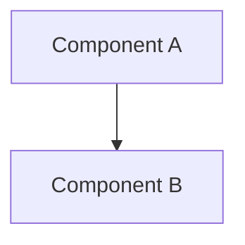

# RFC-XXXX (Category): [Title]

## Status

Draft | Review | Accepted | Final | Rejected | Superseded | Deprecated

> **Note:** This RFC was originally numbered RFC-XXXX under the legacy numbering system. It remains at XXXX as it belongs to the [Category] category.

## Authors

- Author: @username

## Maintainers

- Maintainer: @username

## Summary

One-paragraph overview of what this RFC defines.

## Dependencies

**Requires:**

- RFC-XXXX (Category): [Title]

**Optional:**

- RFC-XXXX (Category): [Title]

## Design Goals

Specific measurable objectives (G1, G2, G3...).

| Goal | Target | Metric        |
| ---- | ------ | ------------- |
| G1   | <50ms  | Query latency |
| G2   | >95%   | Recall@10     |

## Motivation

Why this RFC? What problem does it solve?

## Specification

Technical details, constraints, interfaces, data types, algorithms.

### System Architecture

### Data Structures

Formal interface definitions.

### Algorithms

Canonical algorithms with deterministic behavior.

### Determinism Requirements

MUST specify deterministic behavior if affecting consensus, proofs, or verification.

### Error Handling

Error codes and recovery strategies.

## Performance Targets

| Metric     | Target | Notes       |
| ---------- | ------ | ----------- |
| Latency    | <50ms  | @ 1K QPS    |
| Throughput | >10k/s | Single node |

## Security Considerations

MUST document:

- Consensus attacks
- Economic exploits
- Proof forgery
- Replay attacks
- Determinism violations

## Adversarial Review

Analysis of failure modes and mitigations.

| Threat | Impact | Mitigation   |
| ------ | ------ | ------------ |
| XSS    | High   | Sanitization |

## Economic Analysis

(Optional) Market dynamics and economic attack surfaces.

## Compatibility

Backward/forward compatibility guarantees.

## Test Vectors

Canonical test cases for verification.

## Alternatives Considered

| Approach | Pros | Cons |
| -------- | ---- | ---- |
| Option A | X    | Y    |

## Implementation Phases

### Phase 1: Core

- [ ] Task 1
- [ ] Task 2

### Phase 2: Enhanced

- [ ] Task 3

## Key Files to Modify

| File     | Change           |
| -------- | ---------------- |
| src/a.rs | Add feature X    |
| src/b.rs | Update interface |

## Future Work

- F1: [Description]
- F2: [Description]

## Rationale

Why this approach over alternatives?

## Version History

| Version | Date       | Changes |
| ------- | ---------- | ------- |
| 1.0     | YYYY-MM-DD | Initial |

## Related RFCs

- RFC-XXXX (Category): [Title]
- RFC-XXXX (Category): [Title]

## Related Use Cases

- [Use Case Name](../../docs/use-cases/filename.md)

## Appendices

### A. [Topic]

Additional implementation details.

### B. [Topic]

Reference material.

---

**Version:** 1.0
**Submission Date:** YYYY-MM-DD
**Last Updated:** YYYY-MM-DD
