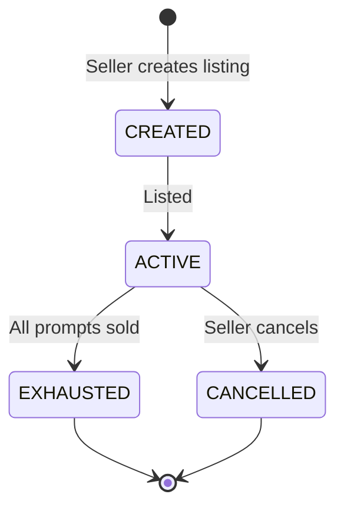
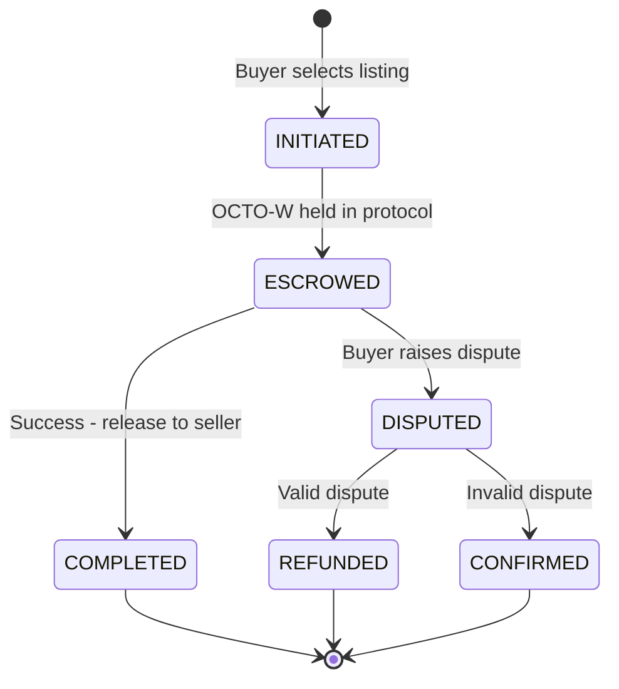
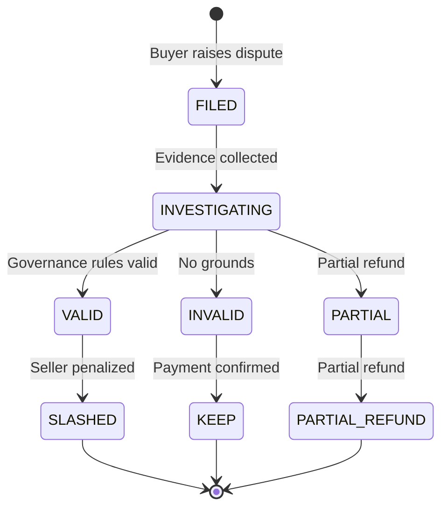

# RFC-0100: AI Quota Marketplace Protocol

## Status
Draft

## Summary

Define the protocol for trading AI API quotas between developers using OCTO-W tokens as both currency and authorization grant.

## Motivation

Enable developers to:
- Contribute spare AI API quota to the network
- Earn OCTO-W tokens for contributed quota
- Purchase quota from other developers when needed
- Swap OCTO-W for other tokens (OCTO-D, OCTO)

This creates immediate utility for OCTO-W and bootstraps the developer network.

## Specification

### Core Concepts

```typescript
// Quota listing
interface QuotaListing {
  id: string;
  provider: 'openai' | 'anthropic' | 'google' | 'other';
  prompts_remaining: number;
  price_per_prompt: number; // in OCTO-W
  seller_wallet: string;
  status: 'active' | 'exhausted' | 'cancelled';
}

// Quota purchase
interface QuotaPurchase {
  listing_id: string;
  buyer_wallet: string;
  prompts_requested: number;
  total_cost: OCTO-W;
  timestamp: number;
}

// Token balance
interface QuotaRouter {
  wallet: string;
  octo_w_balance: OCTO-W;
  api_key: string; // encrypted, never transmitted
  proxy_port: number;
  status: 'online' | 'offline';
}
```

### Token Economics

| Action | Token |
|--------|-------|
| Contribute 1 prompt | +1 OCTO-W |
| Purchase 1 prompt | -1 OCTO-W |
| Minimum listing | 10 prompts |

### Routing Protocol

```typescript
interface RouterConfig {
  // Policy
  max_price_per_prompt: OCTO-W;
  preferred_providers: string[];
  fallback_enabled: boolean;
  fallback_timeout_ms: number;

  // Security
  require_minimum_balance: OCTO-W;
  auto_recharge_enabled: boolean;
  auto_recharge_source: 'wallet' | 'swap';
}
```

### Market Operations

```typescript
// List quota for sale
async function listQuota(
  prompts: number,
  pricePerPrompt: OCTO-W
): Promise<QuotaListing>;

// Purchase quota
async function purchaseQuota(
  listingId: string,
  prompts: number
): Promise<QuotaPurchase>;

// Route prompt through network
async function routePrompt(
  prompt: string,
  config: RouterConfig
): Promise<string>;
```

## Implementation

*Implementation phases have been moved to the Roadmap and Mission files.*

See: `missions/quota-router-mve.md`, `missions/quota-market-integration.md`

## Settlement Model

### Registry Decision

| Option | Pros | Cons | Recommendation |
|--------|------|------|----------------|
| **Off-chain** | Fast, cheap | Less trust | MVE - start here |
| **On-chain** | Trustless, verifiable | Expensive, slow | Phase 2 |

### Escrow Flow

```
1. Buyer initiates purchase
   │
   ▼
2. OCTO-W held in escrow (protocol contract)
   │
   ▼
3. Seller executes prompt via their proxy
   │
   ▼
4. Success?
   │
   ├─ YES → Release OCTO-W to seller
   │
   └─ NO → Refund to buyer, slash seller stake
```

### Dispute Resolution

```typescript
enum DisputeOutcome {
  Valid,      // Refund buyer, slash seller
  Invalid,    // Keep payment, no action
  Partial,    // Partial refund
}

interface Dispute {
  id: string;
  buyer: string;
  seller: string;
  listing_id: string;
  reason: 'failed_response' | 'garbage_data' | 'timeout';
  evidence: string;  // URL or hash
  timestamp: number;
}

// Resolution: Governance vote or automated arbitration
```

### Dispute Evidence Challenge

**Issue:** Prompts are private, but buyer needs to prove "garbage response" without revealing prompt content.

**MVE Solution:** Heavily weight automated failures:

| Dispute Type | Evidence | Verifiability |
|-------------|----------|---------------|
| **Timeout** | Network logs, timestamps | Automatic |
| **Provider error** | Provider error codes | Automatic |
| **Latency high** | Latency measurements | Automatic |
| **Garbage response** | Requires human review | Manual |
| **Failed response** | HTTP status codes | Automatic |

**For MVE:** Focus disputes on automated verifications (timeouts, errors, latency). Response quality disputes require trust (reputation-based) until cryptographic solutions emerge.

**Future:** ZK proofs of inference quality (research phase).

### Slashing Model

```typescript
interface SlashingRules {
  // First offense: 10% of stake
  first_offense_penalty: 0.10;

  // Escalation per offense
  offense_multiplier: 1.5;

  // Permanent ban threshold
  permanent_ban_at: 0.50;  // 50% of stake lost
}
```

## Security

| Mechanism | Purpose |
|----------|---------|
| Local proxy only | API keys never leave machine |
| Balance check first | Prevent overspending |
| Stake requirement | Prevent spam/abuse |
| Reputation system | Build trust |

## Related Use Cases

- [AI Quota Marketplace for Developer Bootstrapping](../../docs/use-cases/ai-quota-marketplace.md)

## State Machines

### Listing Lifecycle



### Purchase Lifecycle



### Dispute Lifecycle



## Observability

The marketplace must support logging without exposing sensitive data:

```typescript
interface MarketTelemetry {
  // What we log (no PII)
  event: 'purchase' | 'listing' | 'swap' | 'dispute';
  timestamp: number;
  provider: string;
  octo_w_amount: number;
  latency_ms: number;
  success: boolean;

  // What we DON'T log
  // - Prompt content
  // - API keys
  // - Wallet addresses (use hash instead)
}
```

## Security & Privacy

| Concern | Mitigation |
|---------|------------|
| API key exposure | Local proxy only, keys never transmitted |
| Prompt privacy | ⚠️ **TRUST ASSUMPTION** - Sellers see prompt content when executing API calls |
| Wallet privacy | Pseudonymous addresses |
| Data residency | No central storage |

**Important:** Prompt content is visible to the seller who executes the API request.
This is a trust-based model, not cryptographic. See Research doc for future options (TEE/ZK).

## Related RFCs

- RFC-0101: Quota Router Agent Specification
- RFC-XXXX: Token Swap Protocol (future)
- RFC-XXXX: Reputation System (future)

## References

- Parent Document: docs/use-cases/ai-quota-marketplace.md
- Research: docs/research/ai-quota-marketplace-research.md

## Open Questions

1. On-chain vs off-chain listing registry?
2. Minimum stake for sellers?
3. How to handle failed requests (refund OCTO-W)?

---

**Draft Date:** 2026-03-02
