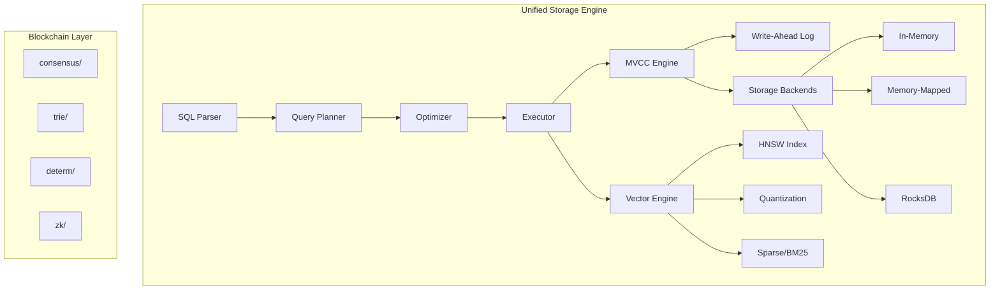

# RFC-0103: Unified Vector-SQL Storage Engine

## Status

Draft

## Summary

This RFC specifies the design for merging Qdrant's vector search capabilities with Stoolap's SQL/MVCC engine to create a unified vector-SQL database. The resulting system preserves Stoolap's blockchain-oriented features (Merkle tries, deterministic values, ZK proofs) while adding Qdrant's quantization, sparse vectors, payload filtering, and GPU acceleration.

## Motivation

### Problem Statement

Current AI applications require multiple systems:
- **Vector database** (Qdrant, Pinecone, Weaviate) for similarity search
- **SQL database** (PostgreSQL, SQLite) for structured data
- **Blockchain** for verification/audit

This creates operational complexity, data consistency challenges, and latency from cross-system queries.

### Why This Matters for CipherOcto

CipherOcto's architecture requires:
1. **Vector similarity search** for agent memory/retrieval
2. **SQL queries** for structured data (quotas, payments, reputation)
3. **Blockchain verification** for provable state (Merkle proofs)
4. **MVCC transactions** for concurrent operations

A unified system reduces infrastructure complexity while maintaining all required capabilities.

## Specification

### Architecture Overview



### Storage Backend System

#### Backend Types

| Backend | Use Case | Trade-offs |
|---------|----------|------------|
| **In-Memory** | Low-latency, small datasets | Limited by RAM |
| **Memory-Mapped** | Large datasets, OS-managed caching | Slower than memory |
| **RocksDB** | Persistent, large scale | C++ dependency, memory overhead |

#### SQL Syntax

```sql
-- Specify storage backend per table
CREATE TABLE embeddings (
    id INTEGER PRIMARY KEY,
    content TEXT,
    embedding VECTOR(384)
) STORAGE = mmap;  -- Options: memory, mmap, rocksdb

-- Vector index with quantization
CREATE INDEX idx_emb ON embeddings(embedding)
USING HNSW WITH (
    metric = 'cosine',
    m = 32,
    ef_construction = 400,
    quantization = 'pq',    -- Options: none, sq, pq, bq
    compression = 8         -- Compression ratio
);

-- Hybrid search: vector + sparse
SELECT id, content,
    VEC_DISTANCE_COSINE(embedding, $query) as score,
    BM25_MATCH(description, $keywords) as bm25
FROM embeddings
WHERE category = 'ai'
ORDER BY score + bm25 * 0.3
LIMIT 10;
```

### Vector Engine Specifications

#### HNSW Index

| Parameter | Default | Range | Description |
|-----------|---------|-------|-------------|
| `m` | 16 | 2-128 | Connections per node |
| `ef_construction` | 200 | 64-512 | Build-time search width |
| `ef_search` | 200 | 1-512 | Query-time search width |
| `metric` | cosine | l2, cosine, ip | Distance metric |

#### Quantization

| Type | Compression | Quality Loss | Use Case |
|------|-------------|--------------|----------|
| **SQ** (Scalar) | 4x | Low | General use |
| **PQ** (Product) | 4-64x | Medium | Large datasets |
| **BQ** (Binary) | 32x | High | Extreme compression |

#### Sparse Vectors

- BM25-style inverted index
- Combined with dense vectors for hybrid search
- Configurable term weighting

#### Payload Filtering

| Index Type | Use Case |
|------------|----------|
| `bool_index` | Boolean filters |
| `numeric_index` | Range queries |
| `geo_index` | Location filtering |
| `full_text_index` | Text match |
| `facet_index` | Categorical |
| `map_index` | Key-value |

### Blockchain Feature Preservation

The following modules remain unchanged:

| Module | Purpose | Integration |
|--------|---------|-------------|
| `consensus/` | Block/Operation types | Unchanged |
| `trie/` | RowTrie, SchemaTrie | Unchanged |
| `determ/` | Deterministic values | Unchanged |
| `zk/` | ZK proofs | Unchanged |

All blockchain features operate independently of storage backend selection.

### GPU Acceleration

```rust
#[cfg(feature = "gpu")]
pub mod gpu {
    // CUDA kernels for HNSW graph building
    // GPU-accelerated vector operations
    // Memory management for GPU vectors
}
```

- Feature-gated with `#[cfg(feature = "gpu")]`
- Fallback to CPU when GPU unavailable
- CUDA support only (OpenCL future)

### Search Algorithms

| Algorithm | Best For | Implementation |
|-----------|----------|----------------|
| **HNSW** | General ANNS | Default |
| **Acorn** | Memory-constrained | Optional |

## Rationale

### Why Multiple Backends?

1. **Flexibility**: Different workloads have different requirements
2. **Optimization**: Per-table/backend choice enables tuning
3. **Migration Path**: Start with memory, migrate to mmap/rocksdb
4. **No Trade-offs**: Users choose what fits their use case

### Why Merge into Stoolap?

1. **Clean Foundation**: Stoolap's HNSW is well-structured, cache-optimized
2. **SQL Integration**: Already has query planner, optimizer, MVCC
3. **Blockchain Ready**: Already has trie, consensus, ZK modules
4. **Pure Rust**: No C++ dependencies (unlike adding to Qdrant)

### Alternative Approaches Considered

#### Option 1: New Codebase
- **Rejected**: Duplication of SQL/MVCC infrastructure
- **Trade-off**: More work, cleaner slate

#### Option 2: Fork Qdrant + Add SQL
- **Rejected**: Qdrant's Rust codebase less modular for SQL addition
- **Trade-off**: Would require significant refactoring

## Implementation

### Phases

```
Phase 1: Storage Backend Abstraction
├── Define StorageBackend enum
├── Implement InMemory backend (current)
├── Implement MmapBackend (from Qdrant)
└── Implement RocksDBBackend (from Qdrant)

Phase 2: Quantization (from Qdrant)
├── Copy lib/quantization to src/storage/quantization
├── Integrate with HNSW index
└── Add SQL syntax for quantization config

Phase 3: Sparse Vectors / BM25
├── Copy lib/sparse to src/storage/sparse
├── Add SPARSE index type
└── Add BM25_MATCH SQL function

Phase 4: Payload Indexes
├── Add field index modules from Qdrant
├── Integrate with query planner
└── Add filter syntax

Phase 5: GPU Support
├── Add GPU feature flag
├── Port CUDA kernels (future)
└── Add runtime GPU detection
```

### Key Files to Modify

| File | Change |
|------|--------|
| `src/storage/mod.rs` | Add backend abstraction |
| `src/storage/index/hnsw.rs` | Add quantization, algorithms |
| `src/storage/index/mod.rs` | Add sparse, field indexes |
| `src/parser/` | Add STORAGE, QUANTIZATION syntax |
| `src/executor/` | Add vector/sparse operators |
| `Cargo.toml` | Add quantization, sparse deps |

### Testing Strategy

1. **Unit Tests**: Each component independently
2. **Integration Tests**: SQL + Vector queries
3. **Benchmark Tests**: Performance vs Qdrant, vs standalone Stoolap
4. **Blockchain Tests**: Verify trie/ZK integration unchanged

## Related Use Cases

- [Decentralized Mission Execution](../../docs/use-cases/decentralized-mission-execution.md)
- [Autonomous Agent Marketplace](../../docs/use-cases/agent-marketplace.md)

## Related Research

- [Qdrant Research Report](../../docs/research/qdrant-research.md)
- [Stoolap Research Report](../../docs/research/stoolap-research.md)
