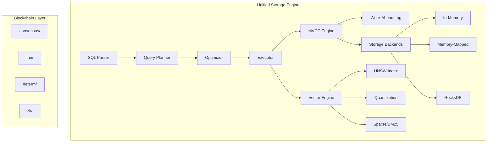
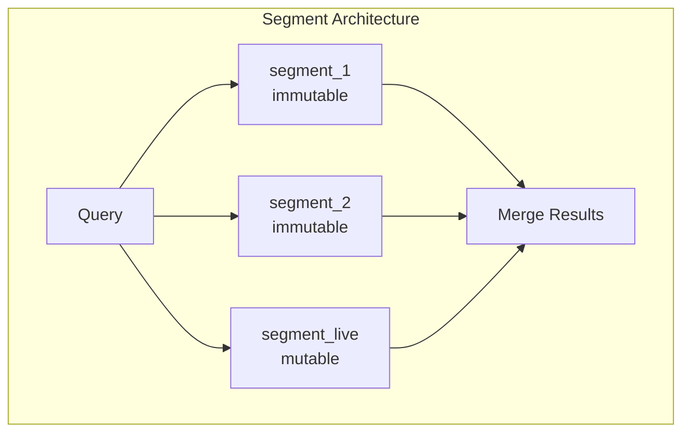

# RFC-0103: Unified Vector-SQL Storage Engine

## Status

Draft

## Summary

This RFC specifies the design for merging Qdrant's vector search capabilities with Stoolap's SQL/MVCC engine to create a unified vector-SQL database. The resulting system preserves Stoolap's blockchain-oriented features (Merkle tries, deterministic values, ZK proofs) while adding Qdrant's quantization, sparse vectors, payload filtering, and GPU acceleration.

## Motivation

### Problem Statement

Current AI applications require multiple systems:
- **Vector database** (Qdrant, Pinecone, Weaviate) for similarity search
- **SQL database** (PostgreSQL, SQLite) for structured data
- **Blockchain** for verification/audit

This creates operational complexity, data consistency challenges, and latency from cross-system queries.

### Why This Matters for CipherOcto

CipherOcto's architecture requires:
1. **Vector similarity search** for agent memory/retrieval
2. **SQL queries** for structured data (quotas, payments, reputation)
3. **Blockchain verification** for provable state (Merkle proofs)
4. **MVCC transactions** for concurrent operations

A unified system reduces infrastructure complexity while maintaining all required capabilities.

## Specification

### Architecture Overview



### Storage Backend System

#### Backend Types

| Backend | Status | Use Case |
|---------|--------|----------|
| **In-Memory** | Default | Low-latency, small datasets |
| **Memory-Mapped** | Default | Large datasets, OS-managed caching |
| **RocksDB** | Future | Persistent, large scale (optional) |
| **redb** | Future | Pure Rust alternative |

> **Recommendation**: Start with In-Memory + Memory-Mapped only. Add persistence backends later to avoid development surface explosion.

#### SQL Syntax

```sql
-- Specify storage backend per table
CREATE TABLE embeddings (
    id INTEGER PRIMARY KEY,
    content TEXT,
    embedding VECTOR(384)
) STORAGE = mmap;  -- Options: memory, mmap, rocksdb

-- Vector index with quantization
CREATE INDEX idx_emb ON embeddings(embedding)
USING HNSW WITH (
    metric = 'cosine',
    m = 32,
    ef_construction = 400,
    quantization = 'pq',    -- Options: none, sq, pq, bq
    compression = 8         -- Compression ratio
);

-- Hybrid search: vector + sparse
SELECT id, content,
    VEC_DISTANCE_COSINE(embedding, $query) as score,
    BM25_MATCH(description, $keywords) as bm25
FROM embeddings
WHERE category = 'ai'
ORDER BY score + bm25 * 0.3
LIMIT 10;
```

### Vector Engine Specifications

#### HNSW Index

| Parameter | Default | Range | Description |
|-----------|---------|-------|-------------|
| `m` | 16 | 2-128 | Connections per node |
| `ef_construction` | 200 | 64-512 | Build-time search width |
| `ef_search` | 200 | 1-512 | Query-time search width |
| `metric` | cosine | l2, cosine, ip | Distance metric |

#### Quantization

| Type | Compression | Quality Loss | Use Case |
|------|-------------|--------------|----------|
| **SQ** (Scalar) | 4x | Low | General use |
| **PQ** (Product) | 4-64x | Medium | Large datasets |
| **BQ** (Binary) | 32x | High | Extreme compression |

#### Sparse Vectors

- BM25-style inverted index
- Combined with dense vectors for hybrid search
- Configurable term weighting

#### Payload Filtering

| Index Type | Use Case |
|------------|----------|
| `bool_index` | Boolean filters |
| `numeric_index` | Range queries |
| `geo_index` | Location filtering |
| `full_text_index` | Text match |
| `facet_index` | Categorical |
| `map_index` | Key-value |

### Blockchain Feature Preservation

The following modules remain unchanged:

| Module | Purpose | Integration |
|--------|---------|-------------|
| `consensus/` | Block/Operation types | Unchanged |
| `trie/` | RowTrie, SchemaTrie | Unchanged |
| `determ/` | Deterministic values | Unchanged |
| `zk/` | ZK proofs | Unchanged |

All blockchain features operate independently of storage backend selection.

### GPU Acceleration (Limited Scope)

> ⚠️ **Implementation Warning**: HNSW GPU support is experimental. Graph traversal is memory-bound; GPU gains are smaller than expected.

**Initial GPU Scope** (Phase 5):
| Operation | GPU Benefit |
|----------|-------------|
| Vector distance computation | High |
| Quantization training | High |
| Batch re-ranking | Medium |
| Full graph traversal | Low (memory-bound) |

```rust
#[cfg(feature = "gpu")]
pub mod gpu {
    // CUDA kernels for distance computation
    // Quantization training
    // Batch re-ranking
    // NOT full graph traversal initially
}
```

- Feature-gated with `#[cfg(feature = "gpu")]`
- Fallback to CPU when GPU unavailable
- CUDA support only (OpenCL future)
- Start with distance computation, not full traversal

### Search Algorithms

| Algorithm | Best For | Implementation |
|-----------|----------|----------------|
| **HNSW** | General ANNS | Default |
| **Acorn** | Memory-constrained | Optional |

### Determinism & Consensus

**Critical Challenge**: Blockchain consensus requires exact determinism. Vector search uses floating-point math which can be non-deterministic across architectures.

#### The Problem

- Floating-point rounding differs between x86 (AVX) and ARM (NEON)
- SIMD instructions may produce slightly different results
- Concurrent HNSW graph construction is non-deterministic

#### Solution: Snapshot-Based Verification


**Approach**:
1. **Immutable Snapshots**: After commit, vector index becomes immutable
2. **Merkle Root**: Compute root hash of all vectors at commit time
3. **Stored State**: Store serialized vector data (not graph) for verification
4. **Software Float**: Use strict IEEE 754 for critical comparisons (optional feature)

> **Trade-off**: This means live HNSW graph searches cannot be directly verified. Instead, verified queries use a snapshot. Real-time verification requires async proof generation.

> ⚠️ **Implementation Warning**: Computing Merkle root at commit time for tables with millions of vectors will destroy write throughput.
>
> **Recommendation**: Use incremental hashing - only hash newly inserted/deleted vectors and update branches to root, rather than rehashing entire dataset. The existing `trie/RowTrie` should support this pattern.

#### Improved Merkle Strategy: ID + Content Hash

Instead of hashing raw vectors (1.5GB for 1M vectors), hash vector IDs and content:

```rust
// Instead of hashing 1536 bytes per vector:
// vector_hash = blake3(embedding_bytes)  // 1536 bytes

// Hash only:
// vector_hash = blake3(vector_id || blake3(embedding_bytes))  // ~64 bytes
struct MerkleEntry {
    vector_id: i64,
    content_hash: [u8; 32],  // blake3 of embedding
}

// Merkle tree uses: vector_id → vector_hash
// Much smaller tree, faster updates
```

**Benefits**:
- Smaller hashes (64 bytes vs 1536 bytes per vector)
- Faster incremental updates
- Still proves vector content exists

#### Software Float Performance

> ⚠️ **Implementation Warning**: Software floating-point emulation (strict IEEE 754) is orders of magnitude slower than hardware SIMD.
>
> **Recommendation**: Isolate software emulation strictly to verification/snapshot phase. Live query nodes should use hardware acceleration (AVX/NEON) to maintain <50ms latency. Only enforce software float on nodes participating in block generation/validation.

### Three-Layer Verification Architecture

Separate concerns into distinct layers:

```mermaid
graph LR
    A[Query Node] --> B[Fast Search<br/>HNSW (AVX/GPU)]
    B --> C[Candidate Set<br/>top-200]
    C --> D[Deterministic Re-rank<br/>Software Float]
    D --> E[Top-K Result]
    E --> F[Merkle Proof<br/>of vectors]
```

| Layer | Purpose | Determinism |
|-------|---------|------------|
| **Fast Search** | HNSW traversal, candidate generation | Non-deterministic |
| **Deterministic Re-rank** | Final ranking of candidates | Software float |
| **Blockchain Proof** | Verify vector inputs exist | Full verification |

**Benefits**:
- Fast queries use hardware acceleration
- Final result is deterministically ranked
- Merkle proof verifies input vectors

> **Key Insight**: You can prove vectors exist, but the ranking may differ across architectures. This architecture ensures both speed and verifiability.

### Performance SLAs

| Metric | Target | Measurement |
|--------|--------|-------------|
| Live query latency | <50ms | P50 at 1K QPS |
| Proof generation (async) | <5s (95th percentile) | Async background |
| Proof generation (fast-proof) | <100ms | Synchronous, top-K only |
| Merkle root update | <1s | Incremental at commit |
| Auto-compaction trigger | <25% tombstone threshold | Background scheduler |

> **Fast-Proof Mode**: Optional synchronous proof generation for small result sets (top-K). Uses abbreviated Merkle proof for top-K results only, bypassing full snapshot hashing.

### Benchmark Targets (Post-Implementation)

| Metric | Target | Notes |
|--------|--------|-------|
| Query latency | <50ms | vs 350ms multi-system baseline |
| Storage reduction | 60% | With BQ compression |
| Compression ratio | 4-64x | PQ/SQ/BQ configurations |
| Recall@10 | >95% | At 25% tombstone threshold |

### MVCC & Vector Index

**Critical Challenge**: HNSW is a connected graph. Concurrent transactions must see consistent vector visibility.

#### The Problem

- Transaction A inserts vector → updates HNSW graph
- Transaction B runs concurrently → should not see A's uncommitted vectors
- Graph traversals may include/exclude nodes incorrectly

#### Solution: Segment Architecture (Qdrant-Style)

Instead of per-vector MVCC visibility checks (20-40% slowdown), use immutable segments:



**Approach**:
1. **Immutable Segments**: After commit, vectors go into immutable segments
2. **Live Segment**: New inserts go to mutable segment_live
3. **Per-Segment Visibility**: Transaction sees `visible_segments(txn_id)`
4. **Search Per Segment**: Search each segment, merge results

**Benefits**:
- No per-node visibility checks (eliminates branch mispredictions)
- Simpler concurrency model
- Faster queries
- Borrowed from Qdrant's proven segment architecture

**Implementation**:
```rust
fn search_with_mvcc(query: &Query, txn: &Transaction) -> Vec<ScoredPoint> {
    let visible = visible_segments(&txn);
    let mut results = Vec::new();

    for segment in visible {
        results.extend(search_segment(segment, query));
    }

    merge_top_k(results, query.limit)
}
```

### Hybrid Query Optimization

**Challenge**: For queries like `WHERE reputation > 0.9 ORDER BY vector_distance`, which plan is optimal?

```sql
SELECT * FROM agents
WHERE reputation_score > 0.9
ORDER BY VEC_DISTANCE_COSINE(embedding, $query)
LIMIT 10;
```

#### Approach: Cost-Based Decision

The optimizer will estimate:

| Factor | Consideration |
|--------|---------------|
| **Selectivity** | How many rows pass `reputation > 0.9`? |
| **Index Selectivity** | HNSW ef_search value vs full scan |
| **Vector Dimension** | Brute-force cost scales with dimension |
| **Quantization** | Quantized search is faster but approximate |

**Plans**:
1. **Index-First**: Use HNSW, filter by reputation post-search (low selectivity)
2. **Filter-First**: Scan with reputation filter, brute-force vector (high selectivity)
3. **Index-Filtered**: Use HNSW with payload filter pre-search (Qdrant-style)

The optimizer will use statistics to pick the cheapest plan.

## Rationale

### Why Multiple Backends?

1. **Flexibility**: Different workloads have different requirements
2. **Optimization**: Per-table/backend choice enables tuning
3. **Migration Path**: Start with memory, migrate to mmap/rocksdb
4. **No Trade-offs**: Users choose what fits their use case

### Why Merge into Stoolap?

1. **Clean Foundation**: Stoolap's HNSW is well-structured, cache-optimized
2. **SQL Integration**: Already has query planner, optimizer, MVCC
3. **Blockchain Ready**: Already has trie, consensus, ZK modules
4. **Default Pure Rust**: No C++ dependencies by default (rocksdb is optional)

> **Correction**: The "Pure Rust" benefit applies to default builds. RocksDB is available as an optional feature for users who need its production-proven persistence.

### Alternative Approaches Considered

#### Option 1: New Codebase
- **Rejected**: Duplication of SQL/MVCC infrastructure
- **Trade-off**: More work, cleaner slate

#### Option 2: Fork Qdrant + Add SQL
- **Rejected**: Qdrant's Rust codebase less modular for SQL addition
- **Trade-off**: Would require significant refactoring

## Implementation

### Phases (Risk-Ordered)

> ⚠️ **Important**: Implement hardest parts first. Reversed from original order.

```
Phase 1: MVCC + Vector Correctness
├── Segment architecture (not per-vector visibility)
├── Three-layer verification (fast search → deterministic → proof)
├── Vector ID + content hash for Merkle
└── Test: MVCC + concurrent vector UPDATE/DELETE

Phase 2: Deterministic Snapshot
├── Software float re-ranking
├── Incremental Merkle updates
├── Fast-proof mode (top-K sync)
└── Test: Cross-architecture (x86 vs ARM)

Phase 3: Hybrid Query Planner
├── Cost-based planning (index-first vs filter-first)
├── Statistics collection (selectivity, histograms)
├── Payload filter integration
└── Test: Hybrid queries with various selectivities

Phase 4: Storage Backends
├── In-Memory (current)
├── Memory-Mapped
└── (Persistence backends: future)

Phase 5: Quantization
├── Copy lib/quantization to src/storage/quantization
├── Integrate with HNSW index
└── Add SQL syntax for quantization config

Phase 6: Sparse Vectors / BM25
├── Copy lib/sparse to src/storage/sparse
├── Add SPARSE index type
└── Add BM25_MATCH SQL function

Phase 7: GPU Support (Future)
├── Add GPU feature flag
├── Distance computation only
└── NOT full graph traversal initially
```

### Key Files to Modify

| File | Change |
|------|--------|
| `src/storage/mod.rs` | Add backend abstraction |
| `src/storage/index/hnsw.rs` | Add quantization, algorithms |
| `src/storage/index/mod.rs` | Add sparse, field indexes |
| `src/parser/` | Add STORAGE, QUANTIZATION syntax |
| `src/executor/` | Add vector/sparse operators |
| `Cargo.toml` | Add quantization, sparse deps |

### Vector Update/Delete Semantics

#### UPDATE Vector

```sql
UPDATE embeddings SET embedding = $new_vec WHERE id = 5;
```

**Behavior**:
1. Old vector marked with `deleted_txn_id` (tombstone)
2. New vector inserted with `created_txn_id`
3. HNSW graph updated asynchronously (background merge)

#### DELETE Vector

```sql
DELETE FROM embeddings WHERE id = 5;
```

**Behavior**:
1. Vector marked with `deleted_txn_id`
2. Tombstoned until garbage collection
3. HNSW index entry marked deleted (not removed from graph)

#### Background Compaction

```sql
-- Trigger manual compaction
ALTER TABLE embeddings COMPACT;
```

Compaction rebuilds the HNSW graph without tombstones. Recommended after bulk deletes.

> ⚠️ **Implementation Warning**: HNSW search performance degrades rapidly with too many tombstones. Relying on users manually running `COMPACT` will cause slowdowns.
>
> **Recommendation**: Implement auto-vacuum/auto-compact threshold in background (e.g., trigger when tombstone count > 20% of total nodes).
>
> **Strengthening**:
> - Make auto-compaction **mandatory**, not optional
> - **Hard limit: 30%** - Beyond this, recall collapses
> - Soft trigger: 15%
> - Configurable per-table threshold (similar to PostgreSQL autovacuum)
> - Log warnings when compaction is delayed

#### Testing Requirements

The following test matrix must be implemented:

| Test Category | Scenario | Acceptance Criteria |
|---------------|----------|---------------------|
| **MVCC + Vector** | High-concurrency UPDATE/DELETE | No consistency violations |
| **Determinism** | x86 vs ARM execution | Identical results |
| **Merkle Root** | 1M → 100M vectors | <1s incremental update |
| **Tombstone Degradation** | recall@10 vs % deleted | <5% recall loss at 25% deleted |

> **Segment-Merge Philosophy**: Borrow from Qdrant - use immutable segments + background merge. Old segments remain searchable while new ones are built.

### Monitoring & Telemetry

Add production monitoring hooks:

| Metric | Purpose |
|--------|---------|
| `tombstone_ratio` | Current % deleted nodes in HNSW |
| `compaction_queue_depth` | Pending compaction operations |
| `proof_gen_queue_latency` | P50/P95/P99 proof generation time |
| `recall_estimate` | Estimated recall degradation |

```sql
-- System view for monitoring
SELECT * FROM system.vector_index_stats('embeddings');
-- Returns: tombstone_ratio, last_compacted, proof_pending, etc.
```

### Benchmark Baselines

Validate against:

| Baseline | Target |
|----------|--------|
| **Current Stoolap** (basic HNSW) | Compare latency |
| **Standalone Qdrant** | Compare recall @ K |
| **Multi-system** (SQL + vector DB) | Compare 350ms vs 50ms narrative |

> **Critical**: Prototype highest-risk pieces first:
> 1. Incremental Merkle root at 10M+ scale
> 2. Visibility filter cost during HNSW descent
> 3. Auto-compaction with recall/latency measurements

### License Compliance

When porting code from Qdrant (Apache 2.0 license):

1. **Copyright Headers**: Maintain all original Apache 2.0 headers
2. **NOTICE File**: Add to repository noting Apache 2.0 code used
3. **Module Attribution**: Add doc comments crediting original Qdrant authors
4. **No Proprietary Changes**: Apache 2.0 allows modification, but changes must be documented

```rust
// Example attribution header
// Originally adapted from Qdrant (Apache 2.0)
// https://github.com/qdrant/qdrant
// Copyright 2024 Qdrant Contributors
```

### Testing Strategy

1. **Unit Tests**: Each component independently
2. **Integration Tests**: SQL + Vector queries
3. **Benchmark Tests**: Performance vs Qdrant, vs standalone Stoolap
4. **Blockchain Tests**: Verify trie/ZK integration unchanged

## Related Use Cases

- [Decentralized Mission Execution](../../docs/use-cases/decentralized-mission-execution.md)
- [Autonomous Agent Marketplace](../../docs/use-cases/agent-marketplace.md)

## Related Research

- [Qdrant Research Report](../../docs/research/qdrant-research.md)
- [Stoolap Research Report](../../docs/research/stoolap-research.md)

---

## Appendices

### A. Replication Model

**Question**: How do nodes synchronize in distributed deployments?

| Model | Use Case | Implementation |
|-------|----------|----------------|
| **Raft** | Strong consistency | Leader + followers, log replication |
| **Gossip** | Eventual consistency | Peer-to-peer state sharing |
| **Blockchain-only** | Verification only | Merkle state, not real-time sync |

**Recommendation**: Start with Raft for strong consistency. Gossip for large-scale deployments (future).

### B. Query Language Extensions

SQL extensions for vector operations:

| Syntax | Purpose |
|--------|---------|
| `VECTOR(dims)` | Column type for vectors |
| `VEC_DISTANCE_COSINE(v1, v2)` | Cosine distance function |
| `VEC_DISTANCE_L2(v1, v2)` | Euclidean distance |
| `BM25_MATCH(column, query)` | Text search |
| `STORAGE = backend` | Storage backend selection |
| `USING HNSW` | Index type selection |

**Future Extensions**:
```sql
-- Hybrid search (dense + sparse)
SELECT * FROM docs
ORDER BY hybrid_score(dense_vector, sparse_vector, 0.7)
LIMIT 10;
```

### C. Agent Memory Model

CipherOcto agents require structured memory:

```sql
-- Episodic memory: what the agent did
CREATE TABLE episodic_memory (
    id INTEGER PRIMARY KEY,
    agent_id INTEGER,
    episode_id BIGINT,
    embedding VECTOR(768),
    action JSON,
    result JSON,
    timestamp TIMESTAMP
) STORAGE = memory;

-- Semantic memory: what the agent knows
CREATE TABLE semantic_memory (
    id INTEGER PRIMARY KEY,
    agent_id INTEGER,
    embedding VECTOR(768),
    content TEXT,
    importance FLOAT,
    last_accessed TIMESTAMP
) STORAGE = mmap;

-- Task memory: current tasks
CREATE TABLE task_memory (
    id INTEGER PRIMARY KEY,
    agent_id INTEGER,
    task_id BIGINT,
    embedding VECTOR(768),
    status TEXT,
    priority INTEGER
) STORAGE = memory;

-- Index for retrieval
CREATE INDEX idx_episodic ON episodic_memory(embedding) USING HNSW;
CREATE INDEX idx_semantic ON semantic_memory(embedding) USING HNSW;
```

**Query: Retrieve relevant context for agent**
```sql
SELECT * FROM (
    SELECT 'episodic' as type, id, action, timestamp,
        VEC_DISTANCE_COSINE(embedding, $context) as score
    FROM episodic_memory WHERE agent_id = $agent
    UNION ALL
    SELECT 'semantic' as type, id, content, timestamp,
        VEC_DISTANCE_COSINE(embedding, $context) as score
    FROM semantic_memory WHERE agent_id = $agent
) combined
ORDER BY score DESC
LIMIT 5;
```
